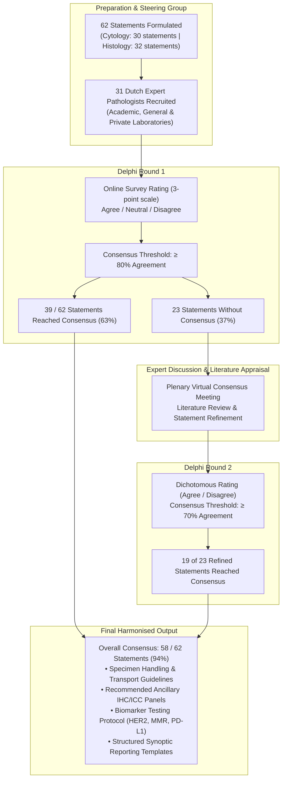
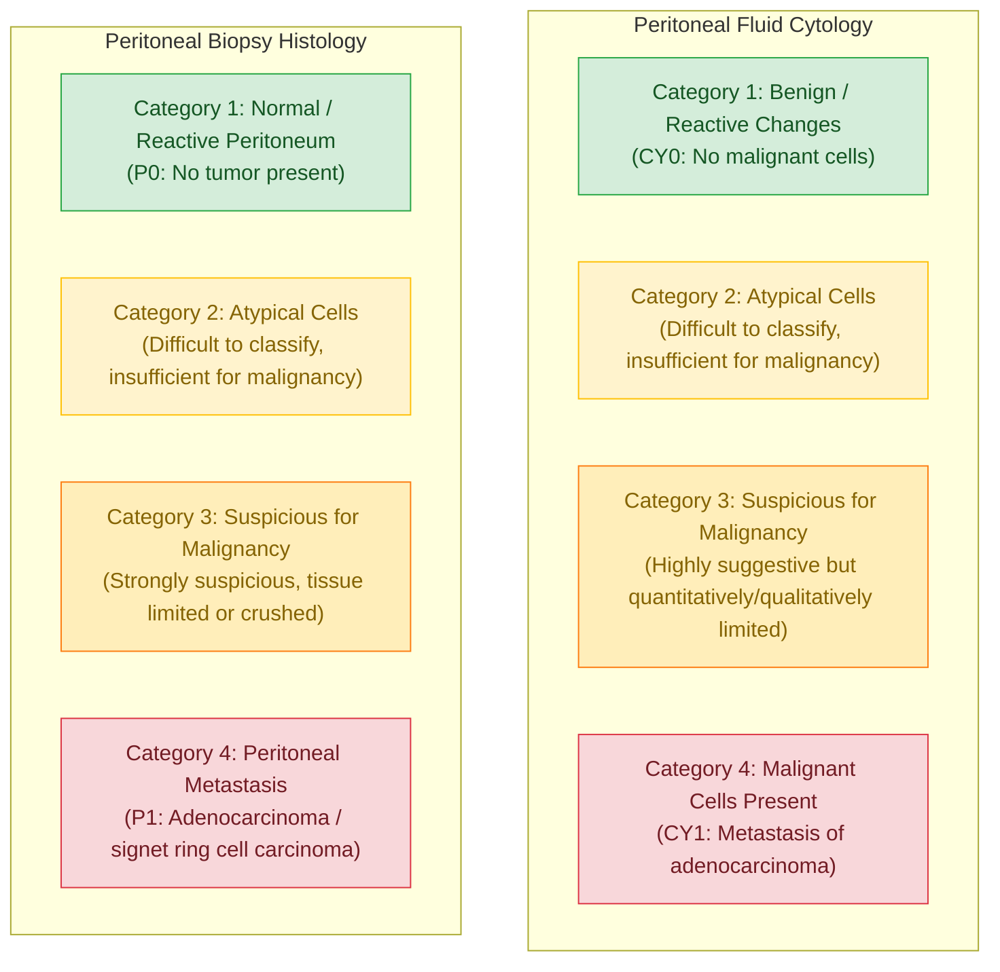

# From operating room to pathology report: Delphi consensus on pathological assessment of peritoneal cytology and biopsies in staging laparoscopy for gastric cancer

**Quik JSE, de Neijs MJ, Grabsch HI, Guchelaar NAD, Freund JE, Brosens LAA, Oudijk L, van Velthuysen MLF, Doukas M, Snaebjornsson P, Klooster A, Doddema N, van den Burg K, Wijnhoven BPL, van Sandick JW, Meijer SL, Kodach LL; Dutch Gastric Cancer Pathology Delphi Collaborators.** *From operating room to pathology report: Delphi consensus on pathological assessment of peritoneal cytology and biopsies in staging laparoscopy for gastric cancer.* Gastric Cancer (2026). Published online: 03 October 2026. DOI: [10.1007/s10120-026-01803-1](https://doi.org/10.1007/s10120-026-01803-1).

- **Journal:** *Gastric Cancer* (Springer Nature / International Gastric Cancer Association)
- **DOI:** [10.1007/s10120-026-01803-1](https://doi.org/10.1007/s10120-026-01803-1)
- **Electronic Supplementary Material:** [MediaObjects/10120_2026_1803_MOESM1_ESM.docx](https://media.springernature.com/original/springer-static/esm/art%3A10.1007%2Fs10120-026-01803-1/MediaObjects/10120_2026_1803_MOESM1_ESM.docx)
- **Corresponding Author:** Dr. Liudmila L. Kodach (`l.kodach@nki.nl`), Department of Pathology, The Netherlands Cancer Institute – Antoni van Leeuwenhoek (NKI-AVL), Amsterdam, The Netherlands.
- **Affiliations & Working Group:** 31 Dutch expert GI pathologists and cytopathologists representing 17 academic medical centers, general hospitals, and independent pathology institutes across the Netherlands.

---

## Executive Summary & Clinical Context

In patients presenting with locally advanced gastric adenocarcinoma ($\ge \text{cT3}$, $\text{cN+}$, or aggressive Lauren diffuse/signet ring cell histotype), staging laparoscopy (SL) with peritoneal fluid assessment and targeted peritoneal biopsy is standard of care across major international guidelines (ESMO, NCCN, JGCA). Peritoneal dissemination is detected at staging laparoscopy in 15%–30% of patients. Importantly, positive peritoneal cytology alone ($\text{CY1}$ / $\text{P0CY1}$) constitutes distant metastatic disease (Stage IV, $\text{M1}$), which radically alters clinical management—converting a treatment plan from curative-intent radical gastrectomy to systemic chemotherapy, immunotherapy, or targeted intraperitoneal protocols (e.g., PIPAC, HIPEC).

Despite this critical prognostic weight, clinical practice has historically suffered from extensive interlaboratory and interobserver variation:
1. **Clinical Information Gaps:** Pathologists frequently receive specimens without tumor subtype, surgical peritoneal cancer index (Sugarbaker PCI) scores, or specification of whether the fluid represents spontaneous ascites or saline washings.
2. **Pre-analytical & Technical Discrepancies:** No universal volume thresholds exist, sample processing methods vary widely (cytocentrifugation, direct smears, liquid-based thinlayers, or cell blocks), and staining protocols diverge (May-Grünwald-Giemsa vs Papanicolaou vs H&E).
3. **Diagnostic Gray Zones:** Distinguishing isolated, poorly cohesive / signet ring carcinoma cells from activated, reactive mesothelial cells or phagocytic histiocytes represents one of the most perilous diagnostic challenges in cytopathology.
4. **Biomarker Uncertainty:** Lack of consensus on whether peritoneal biopsies can or should be utilized for predictive biomarker profiling (HER2, MMR/MSI, PD-L1 CPS, CLDN18.2) when primary biopsies are negative.
5. **Narrative Ambiguity:** Unstructured free-text reports often communicate uncertain findings ambiguously to surgical oncology and multidisciplinary tumor boards.

To establish standardized national and international practice, the Dutch Gastric Cancer Pathology Working Group conducted a formal two-round **modified Delphi consensus study** involving 31 pathology experts, evaluating 62 statements across cytology and histology. The study attained **94% final consensus (58/62 statements)**, producing actionable clinical recommendations and synoptic structured reporting templates.

---

## Delphi Study Methodology & Consensus Architecture



- **Round 1 (3-point scale):** 62 statements; consensus predefined as $\ge 80\%$ agreement. 39/62 (63%) statements reached immediate consensus.
- **Inter-round Plenary Meeting:** Focused review of 10 contentious clinical/pathological domains supported by focused literature synthesis (pre-analytical degradation, low-volume fluids, ICC panels, molecular vs morphological sensitivity, PD-L1/MMR/HER2 discordance).
- **Round 2 (dichotomous scale):** Re-rating of 23 revised statements; consensus predefined as $\ge 70\%$ agreement. 19/23 reached consensus, yielding a **94% cumulative consensus rate**.

---

## Detailed Consensus Recommendations by Domain

### 1. Clinical Information from Operating Room to Pathology (Domain A)
Consensus mandates that surgeons explicitly communicate key clinical and laparoscopic findings to ensure accurate pathological interpretation:
- **Primary Tumor Histopathology:** Primary histological diagnosis and Lauren classification (**diffuse/poorly cohesive**, **intestinal**, or **mixed**) must be provided. Diffuse/signet-ring carcinomas manifest predominantly as isolated single cells in washings, which can easily be missed or mistaken for histiocytes without prior notice.
- **Clinical Risk Factors:** Clinical T-stage ($\text{cT3-T4}$), nodal involvement ($\text{cN+}$), and preoperative imaging suspicion of peritoneal carcinomatosis.
- **Laparoscopic Peritoneal Assessment:** Documentation of whether macroscopic peritoneal deposits were visualized (absent, limited, or extensive), with anatomical distribution and Sugarbaker Peritoneal Cancer Index (PCI) score.
- **Sample Nature:** Explicit clarification whether the specimen submitted is **spontaneous ascites / free fluid** or **peritoneal lavage / washing fluid**, and the specific anatomical site irrigated (e.g., right/left subphrenic spaces, pelvis/pouch of Douglas, bursa omentalis).

### 2. Specimen Collection, Handling & Pre-analytics (Domain B)
- **Site-Specific Separation:** Peritoneal fluid collected from different anatomical compartments must be placed in separate labeled containers and evaluated independently.
- **Dual Fluid Processing:** When both spontaneous ascites and lavage fluid are obtained, both must be evaluated separately.
- **Macroscopic Fluid Inspection:** Laboratories must document volume (mL), color (straw-yellow, clear, serous, or hemorrhagic), and clarity (clear vs turbid/murky).
- **Storage & Temperature Control:** Specimens should be transported and processed as rapidly as possible. If overnight storage or transport delays occur, specimens **must be kept refrigerated at 4°C** and **never stored at room temperature**, as ambient autolysis rapidly destroys cytomorphology.
- **Peritoneal Biopsies:** Biopsies must be immersed immediately into fluid upon excision in the operating room to prevent tissue desiccation. Formalin is standard; if transported fresh in PBS or transport medium, tissue must be kept at 4°C and transferred into neutral buffered formalin promptly. Standardized formalin fixation times (minimum 6 hours, maximum 72 hours) must be upheld to protect predictive biomarker integrity.

### 3. Initial Morphological Assessment (Domain C)
- **Cytology Preparations:** Laboratories may utilize validated standard preparation techniques: **cytocentrifugation (cytospin)**, **direct smears**, **liquid-based thinlayers (e.g., ThinPrep, SurePath)**, and **paraffin-embedded cell blocks**.
- **Staining:** Acceptable standard initial stains include Papanicolaou, May-Grünwald-Giemsa (MGG), and Hematoxylin & Eosin (H&E).
- **Histology:** Standard initial assessment of peritoneal biopsies is performed on H&E-stained FFPE sections, with documentation of biopsy maximum diameter (mm) and macroscopic appearance.
- **Threshold for Ancillary Testing:**
  - *Unequivocally Negative Cases:* When standard initial examination shows unequivocally normal/benign cells without cytological atypia or architectural distortion, **routine reflex ancillary immunostaining is not indicated**, and results should be reported as negative.
  - *Suspicious, Equivocal, or Abnormal Findings:* If suspicious cells are detected, or if subtle peritoneal abnormalities are observed on biopsy (increased submesothelial cellularity, reactive mesothelial hyperplasia, serosal fibrosis, chronic inflammation), additional step sections and ancillary immunohistochemical/immunocytochemical stains must be performed.

### 4. Ancillary Immunostains, Biomarkers & Molecular Diagnostics (Domain D)

#### Diagnostic Ancillary Panels (ICC & IHC)
When cytomorphology or histology is equivocal, a balanced, multi-marker panel must be employed rather than relying on single markers:

| Marker Target | Preferred Antibodies | Diagnostic Utility & Interpretation |
| :--- | :--- | :--- |
| **Epithelial Lineage** | **EpCAM (Ber-EP4, MOC-31)**, **Claudin-4**, **Pan-Cytokeratin (AE1/AE3)** | Strongly positive in metastatic adenocarcinoma; negative in reactive mesothelial cells. Claudin-4 and Ber-EP4 are especially reliable for discriminating discohesive signet-ring cells from mesothelium. |
| **Mesothelial Lineage** | **Calretinin**, **WT1**, **D2-40 (Podoplanin)**, **Cytokeratin 5/6** | Positive in reactive and normal mesothelial cells (nuclear/cytoplasmic); negative in gastric adenocarcinoma. |
| **Histiocytic / Inflammatory** | **CD68**, **CD163** | Positive in peritoneal macrophages/histiocytes; eliminates confusion between vacuolated macrophages and signet-ring adenocarcinoma cells. |
| **GI Organ-Specific** | **CDX2**, **CK20**, **CK7** | Supports upper gastrointestinal / intestinal differentiation when primary tumor origin is uncertain or when synchronous pelvic primaries (e.g., ovarian carcinoma) are suspected. |

#### Role of Molecular Diagnostics in Peritoneal Cytology
The consensus critically addressed molecular assays (e.g., CEA mRNA RT-PCR, mutation panels, liquid biopsy):
- **Current standard molecular diagnostics should NOT replace cytomorphological evaluation.**
- In the absence of morphologically identifiable tumor cells on cytology or histology, molecular testing alone is **not recommended** to establish a diagnosis of peritoneal metastasis in routine clinical care.

#### Predictive Biomarker Testing on Peritoneal Biopsies
Peritoneal biopsy specimens frequently provide the sole confirmed tissue representing metastatic disease:
- **Biomarker Feasibility:** Peritoneal biopsies **can and should be used** for standard predictive biomarker testing in advanced gastroesophageal adenocarcinoma: **HER2 (IHC / ISH)**, **MMR / MSI (MLH1, MSH2, MSH6, PMS2)**, **PD-L1 Combined Positive Score (CPS)**, and emerging targets such as **Claudin 18.2 (CLDN18.2)**.
- **Minimum Cellular Adequacy:** Standard cellularity rules apply; for instance, a minimum of **100 viable tumor cells** is required for reliable PD-L1 CPS assessment.
- **Repeat Testing on Metastatic Tissue:** Due to documented temporal and spatial intratumoral heterogeneity, if biomarker evaluation on the primary endoscopic biopsy was negative or borderline (e.g., HER2-negative, PD-L1 CPS $< 5$, or MMR-proficient), **repeat testing on the peritoneal metastatic biopsy should be strongly considered**, as biomarker gain occurs in a clinically significant subset of patients.

---

## Standardized Synoptic Reporting Categories (Domain E)

To eliminate ambiguous narrative terminology ("atypical cells favor reactive", "cannot rule out malignancy"), the consensus established **four harmonized diagnostic categories** for both cytology and histology:



### Second Opinion & Multidisciplinary Integration
- **Mandatory Second Opinion:** For any case classified into Category 2 (*Atypical*) or Category 3 (*Suspicious*), review by a second internal pathologist or expert consultation is strongly recommended before finalizing the report.
- **Pathologist at the MDT:** A pathologist with expertise in gastrointestinal disease should participate directly in the Multidisciplinary Tumor Board (MDT) to explain equivocal, suspicious, or discordant cytological/histological findings to surgical and medical oncologists.

---

## Standardized Structured Reporting Templates

### Template 1: Peritoneal Fluid Cytology Report

```markdown
================================================================================
STANDARDIZED CYTOPATHOLOGY REPORT: PERITONEAL FLUID (GASTRIC CANCER STAGING)
================================================================================

CLINICAL INFORMATION:
  - Primary Tumor Diagnosis: [ Gastric Adenocarcinoma ]
  - Lauren Classification: [ Diffuse / Poorly Cohesive | Intestinal | Mixed | Unknown ]
  - Clinical Stage: cT[ 3 / 4 ], cN[ + / 0 / x ]
  - Suspected Macroscopic Peritoneal Metastases: [ Absent | Limited | Extensive ]
  - Laparoscopic Sampling Site: [ Right Subphrenic | Left Subphrenic | Pelvis/Douglas | Bursa Omentalis | General ]
  - Specimen Type: [ Spontaneous Ascites / Free Fluid | Peritoneal Lavage / Washing Fluid ]

MACROSCOPIC EXAMINATION:
  - Fluid Volume Received: [ _____ mL ]
  - Fluid Color: [ Colorless / Serous | Straw-yellow | Blood-tinged / Hemorrhagic ]
  - Fluid Clarity: [ Clear | Turbid / Murky ]

PROCESSING & PREPARATION TECHNIQUES:
  - Preparation Method(s): [ Cytospin | Direct Smears | Liquid-based Monolayer | Cell Block ]
  - Primary Staining: [ Papanicolaou | May-Grünwald-Giemsa (MGG) | H&E ]
  - Cell Block Created: [ Yes | No ]

ANCILLARY TESTING (IMMUNOCYTOCHEMISTRY):
  - Performed: [ No (Initial morphologically negative) | Yes ]
  - Antibodies Evaluated:
      * Epithelial: EpCAM (Ber-EP4): [ Positive | Negative | Not Done ]
      * Epithelial: Claudin-4: [ Positive | Negative | Not Done ]
      * Mesothelial: Calretinin: [ Positive | Negative | Not Done ]
      * Histiocytic: CD68: [ Positive | Negative | Not Done ]
      * Additional: [ CDX2 / WT1 / CK7 / CK20 ]: [ _____ ]

DIAGNOSTIC CONCLUSION (Select One Standard Category):
  [ ] Category 1: Benign / Reactive Changes
        (Negative for malignant cells; mesothelial cells and histiocytes present)
  [ ] Category 2: Atypical Cells Difficult to Classify, Insufficient for Malignancy
        (Cellular atypia present; insufficient for definitive malignancy; see note)
  [ ] Category 3: Suspicious for Malignancy
        (Highly suggestive of adenocarcinoma cells, but quantitatively/qualitatively limited)
  [ ] Category 4: Malignant Cells Present, Metastasis of Adenocarcinoma (CY1)
        (Positive for adenocarcinoma cells; specify: tubular / poorly cohesive / signet-ring)

SECOND OPINION:
  - Internal Consensus / Reviewer: [ Not Required | Reviewed by Dr. _____ ]

SYNOPTIC COMMENT / MDT NOTE:
  [ __________________________________________________________________________ ]
================================================================================
```

### Template 2: Peritoneal Biopsy Histology Report

```markdown
================================================================================
STANDARDIZED HISTOPATHOLOGY REPORT: PERITONEAL BIOPSY (GASTRIC CANCER STAGING)
================================================================================

CLINICAL INFORMATION:
  - Primary Tumor Diagnosis: [ Gastric Adenocarcinoma ]
  - Lauren Classification: [ Diffuse / Poorly Cohesive | Intestinal | Mixed | Unknown ]
  - Sugarbaker Peritoneal Cancer Index (PCI) Score / Region: [ Region ___ / PCI ___ ]
  - Macroscopic Appearance at Laparoscopy: [ Suspicious Nodule | Granularity | Plaques | Adhesion ]
  - Biopsy Anatomical Site: [ Omentum | Parietal Peritoneum | Pelvis | Diaphragm | Mesentery ]

MACROSCOPIC EXAMINATION:
  - Number of Tissue Fragments: [ _____ ]
  - Maximum Dimensions: [ _____ x _____ mm ]
  - Aspect: [ Soft | Fibrotic | Nodular | Hemorrhagic ]

HISTOLOGICAL EXAMINATION (H&E):
  - Initial Assessment: [ Normal | Fibrous Stroma | Reactive Mesothelium | Infiltration Present ]

ANCILLARY IMMUNOHISTOCHEMISTRY (IHC):
  - Performed: [ No | Yes ]
  - Results:
      * AE1/AE3 / Pan-Cytokeratin: [ Positive | Negative ]
      * EpCAM / Ber-EP4: [ Positive | Negative ]
      * Claudin-4: [ Positive | Negative ]
      * Calretinin: [ Positive | Negative ]
      * CDX2: [ Positive | Negative ]

PREDICTIVE BIOMARKER EVALUATION (If Metastatic):
  - Tumor Cell Count in Biopsy: [ < 100 cells (Inadequate) | ≥ 100 viable tumor cells ]
  - HER2 IHC (Gastric Scoring): [ 0 | 1+ | 2+ (Equivocal) | 3+ (Positive) ]
      * HER2 ISH / FISH (if 2+): [ Amplified (Ratio ≥ 2.0) | Non-amplified | Not Done ]
  - MMR IHC:
      * MLH1: [ Intact | Loss ]    MSH2: [ Intact | Loss ]
      * MSH6: [ Intact | Loss ]    PMS2: [ Intact | Loss ]
      * Interpretation: [ MMR-Proficient (pMMR) | MMR-Deficient (dMMR) ]
  - PD-L1 IHC (Clone 22C3 / 28-8):
      * Combined Positive Score (CPS): [ _____ ]
  - Claudin 18.2 (CLDN18.2): [ ≥ 75% moderate-to-strong membranous | < 75% | Not Done ]

DIAGNOSTIC CONCLUSION (Select One Standard Category):
  [ ] Category 1: Normal / Reactive Peritoneum
        (No histological evidence of metastasis; reactive mesothelial/fibrovascular changes)
  [ ] Category 2: Atypical Cells Difficult to Classify, Insufficient for Malignancy
        (Suspicious focus obscured by crush artifact or intense inflammation; non-diagnostic)
  [ ] Category 3: Suspicious for Malignancy
        (Isolated atypical epithelial clusters in submesothelial stroma; definitive invasion not proven)
  [ ] Category 4: Peritoneal Metastasis of Adenocarcinoma (P1)
        (Positive for metastatic adenocarcinoma; histological type: [ Diffuse / Intestinal / Mixed ])

SECOND OPINION:
  - Internal Consensus / Reviewer: [ Reviewed by Dr. _____ ]

SYNOPTIC COMMENT / MDT NOTE:
  [ __________________________________________________________________________ ]
================================================================================
```

---

## Vault & Conceptual Integration

This consensus document bridges clinical surgical oncology, routine cytopathology, and molecular predictive pathology, establishing vital connections across multiple core areas of the vault:

- **Gastrointestinal Pathology & Staging:** Informs [Gastrointestinal Pathology](../systemic-pathology/gastrointestinal-pathology/README.md) and [Stomach](../systemic-pathology/gastrointestinal-pathology/stomach-biopsy.md) with standardized diagnostic criteria for peritoneal dissemination, which governs whether a patient proceeds to radical D2 gastrectomy or systemic palliative/conversion protocols.
- **Reporting Quality & Synoptic Templates:** Directly enriches [Pathology Reports](../pathology-residents-and-pathologists/pathology-reports.md) and [Quality And Standardisation](../laboratory-management/quality-and-standardisation.md) by replacing free-text ambiguity with validated four-tier diagnostic categories and standardized pre-analytical requirements.
- **Cognitive & Systems Context:** Complements [The pathology report as a boundary object: From clinical communication to computational representation](The%20pathology%20report%20as%20a%20boundary%20object%20-%20From%20clinical%20communication%20to%20computational%20representation.md) and [Beyond root cause analysis: a practical systems engineering approach to incident investigation in histopathology](Beyond%20root%20cause%20analysis%20-%20a%20practical%20systems%20engineering%20approach%20to%20incident%20investigation%20in%20histopathology.md) by creating clear linguistic interfaces that prevent misinterpretation between surgeons, oncologists, and pathologists.
- **Cytopreparation Protocols:** Connects with [Liquid Based Cytology Preperations](../laboratory-management/liquid-based-cytology-preperations.md) regarding cell block preparation and temperature-controlled storage (4°C) to prevent diagnostic failure.

<!-- tolaria:related:start -->

## See also

* [Beyond root cause analysis: a practical systems engineering approach to incident investigation in histopathology](Beyond%20root%20cause%20analysis%20-%20a%20practical%20systems%20engineering%20approach%20to%20incident%20investigation%20in%20histopathology.md)
* [Gastrointestinal Pathology](../systemic-pathology/gastrointestinal-pathology/README.md)
* [Liquid Based Cytology Preperations](../laboratory-management/liquid-based-cytology-preperations.md)
* [Pathology Reports](../pathology-residents-and-pathologists/pathology-reports.md)
* [Quality And Standardisation](../laboratory-management/quality-and-standardisation.md)
* [Recommendations for reporting tumor budding in colorectal cancer based on the International Tumor Budding Consensus Conference (ITBCC) 2016](Recommendations%20for%20reporting%20tumor%20budding%20in%20colorectal%20cancer%20based%20on%20the%20International%20Tumor%20Budding%20Consensus%20Conference%20%28ITBCC%29%202016.md)
* [Stomach](../systemic-pathology/gastrointestinal-pathology/stomach-biopsy.md)
* [The pathology report as a boundary object: From clinical communication to computational representation](The%20pathology%20report%20as%20a%20boundary%20object%20-%20From%20clinical%20communication%20to%20computational%20representation.md)

<!-- tolaria:related:end -->
