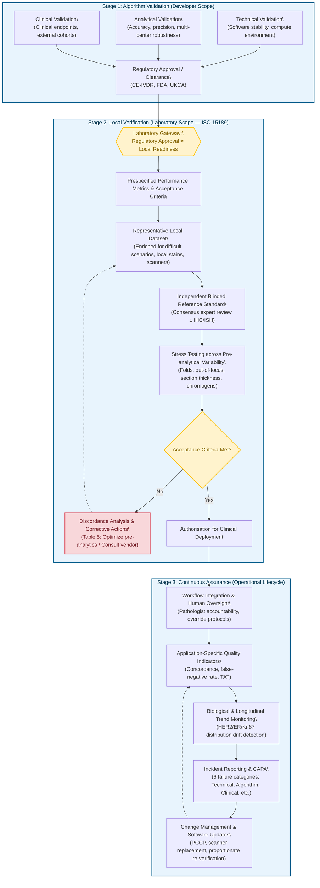
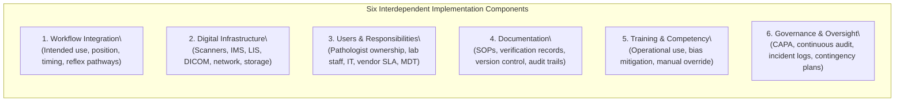
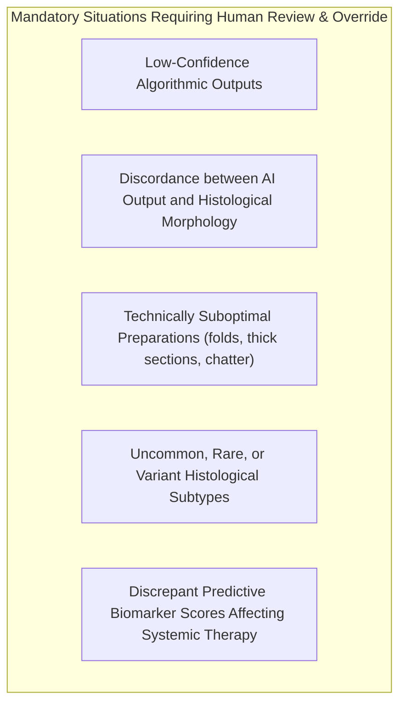
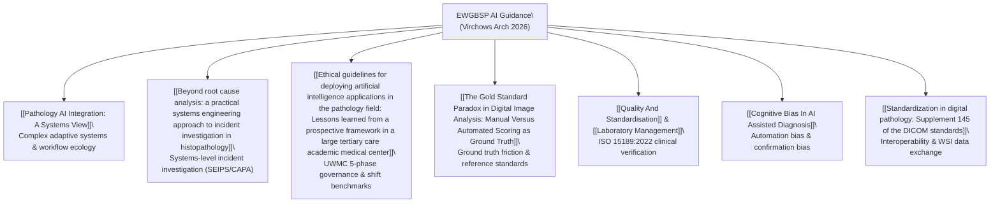

# Guidance for laboratory implementation, governance and continuous assurance of artificial intelligence in histopathology

**Rakha EA, Wesseling J, Kovács A, Ryška A, Provenzano E, Cserni G, Varga Z, Bagó-Horváth Z, Charafe-Jauffret E, Kulka J, van Deurzen CHM, Polónia A, Decker T, van Diest PJ, Quinn C; on behalf of the European Working Group for Breast Screening Pathology (EWGBSP).** *Guidance for laboratory implementation, governance and continuous assurance of artificial intelligence in histopathology.* Virchows Archiv (2026). Published online: 02 September 2026. DOI: [10.1007/s00428-026-04684-y](https://doi.org/10.1007/s00428-026-04684-y).

- **Journal:** *Virchows Archiv* (European Journal of Pathology; Springer Berlin Heidelberg)
- **DOI:** [10.1007/s00428-026-04684-y](https://doi.org/10.1007/s00428-026-04684-y)
- **Open Access:** CC BY 4.0 (Creative Commons Attribution 4.0 International License)
- **Corresponding Author:** Prof. Emad A. Rakha (`erakha@nrl.ae`), School of Medicine, University of Nottingham, Nottingham, UK; National Reference Laboratory and Cleveland Clinic Abu Dhabi, Abu Dhabi, UAE.
- **Affiliated Working Group:** European Working Group for Breast Screening Pathology (EWGBSP), bringing together leading academic breast pathologists, digital pathology directors, and laboratory quality leaders across the United Kingdom, Netherlands, Sweden, Czech Republic, Hungary, Switzerland, Austria, France, Portugal, Germany, and Ireland.

---

## Executive Summary & Core Paradigm Shift

Artificial intelligence (AI) is transitioning from academic computer vision research and proof-of-concept benchmarks into daily diagnostic histopathology. While extensive literature and international regulatory frameworks (such as FDA authorization, CE-IVDR certification, and the UKCA mark) focus heavily on **algorithm development, training datasets, analytical validation, and regulatory approval**, there has been a critical void in practical guidance addressing the **laboratory side of the equation**.

> [!IMPORTANT]
> **The Core Reality of Pathology AI Adoption:**
> Most cellular pathology laboratories will **never develop or train their own AI models**. Instead, they procure commercially available, regulatory-cleared AI medical devices. 
> 
> **Regulatory approval is a prerequisite, not proof of local clinical readiness.** Unlike traditional mechanical or chemical laboratory analyzers that remain stable once calibrated, AI algorithms exist within a dynamic, non-linear socio-technical ecosystem. Algorithm behavior is highly vulnerable to local staining variations, scanner optical characteristics, tissue processing idiosyncrasies, local case-mix shifts, software patches, and human cognitive biases (such as automation complacency and confirmation bias).

To bridge this operational gap, the **European Working Group for Breast Screening Pathology (EWGBSP)** formulated a comprehensive, technology-agnostic guidance framework. Grounded in international quality standards (**ISO 15189:2022** and **ISO 13485**), this guidance establishes how pathology laboratories must verify, integrate, govern, and continuously monitor commercial AI tools to ensure sustained diagnostic accuracy, patient safety, and clinical accountability.

---

## The Four Foundational Principles of the Guidance

The guidance is structured around four distinct principles that differentiate it from generic computer science or regulatory models:

1. **Implementation as a Continuous Operational Lifecycle:** Implementation is not a single sign-off event; it spans a continuous arc from local pre-deployment verification through clinical workflow integration, real-time diagnostic monitoring, incident management, and proportionate revalidation throughout the software's lifespan.
2. **Function-Based Classification:** AI applications in histopathology must be categorized by their **intended clinical function** (Diagnostic, Biomarker, Prognostic, Quality Assurance, Workflow, or Generative). Different functions carry vastly different clinical risks and demand completely different validation, verification, and governance strategies (see Table 1).
3. **Risk-Proportionate Verification:** The rigor of local verification must scale proportionately to patient risk (see Table 2). Autonomous diagnostic triage or predictive biomarker quantitation dictates extensive analytical and clinical verification against hard consensus ground truth, whereas operational workflow sorting requires primarily technical and operational validation.
4. **Application-Specific Quality Assurance:** Quality assurance must track the unique failure modes of each application (see Table 3), ranging from tissue fold sensitivity in slide QC tools to subtle categorical drift in predictive biomarker scoring algorithms.

---

## Detailed Functional Classification of Pathology AI Systems

### Table 1: Functional Classification, Intended Use, Associated Risks, and Quality Assurance

| AI Category (Intended Function) | Typical Input | Typical Output / Examples | Primary Clinical Risk | Main Validation Required | Ongoing Quality Assurance |
| :--- | :--- | :--- | :--- | :--- | :--- |
| **1. Image-Based AI** | | | | | |
| **Diagnostic Image AI** | Whole-slide images (H&E) | Tumour detection, classification, subtyping, grading | Diagnostic error (false negative / false positive, under-grading) | Clinical diagnostic validation (accuracy, concordance) | External QA, continuous pathologist review, periodic performance audits |
| **Biomarker AI** | Whole-slide images (IHC / ISH) | HER2, ER, PR, Ki-67, PD-L1 scoring; MMR protein assessment; ALK/ROS1; quantification of immune/molecular surrogates | Incorrect biomarker result leading to inappropriate targeted therapy or patient stratification | Analytical and clinical validation | Biomarker-specific QA, calibration, longitudinal distribution tracking, EQA participation |
| **Prognostic / Predictive AI** | Histology, grade, molecular and clinical data | Recurrence risk scores, survival predictions, therapy response estimation | Incorrect clinical risk stratification (over- or under-treatment) | Clinical outcome validation against long-term follow-up | Periodic clinical audit, correlation with outcome registries, vendor-driven model reviews |
| **Quality Assurance AI** | Digital slide images (WSI) | Blur detection, tissue fold detection, tissue completeness check, scanning artefacts | Technical quality failures remaining undetected and impairing diagnosis | Operational and technical validation | Scanner QA programmes, rescan rate tracking, laboratory QC logs |
| **2. Data-Driven & Generative AI** | | | | | |
| **Operational / Workflow AI** | LIS metadata, scanner logs, timestamps | Case prioritisation, smart worklists, slide-block barcode matching, batch routing | Workflow failure, delayed turn-around-time, specimen misrouting | Operational and IT systems verification | IT QA, workflow throughput monitoring, incident reporting |
| **Generative AI** | Pathology reports, clinical histories, multimodal inputs | Synoptic report drafting, text summarisation, tumor board digests, educational support | Hallucinations, fabricated diagnoses, automation bias, omitted clinical caveats | Human expert review (not autonomous diagnostic validation) | Documentation, version control, mandatory pathologist line-by-line sign-off |

---

## Verification Requirements Matrix & Quality Indicators

### Table 2: Validation and Verification Requirements According to AI Category

The guidance establishes that the responsibility for algorithm development validation rests with the commercial developer, whereas **local verification is the mandatory responsibility of the adopting laboratory**:

| AI Category | Developer: Technical Validation | Developer: Analytical Validation | Developer: Clinical Validation | Laboratory: Local Verification |
| :--- | :---: | :---: | :---: | :---: |
| **Diagnostic AI** | $\checkmark$ | $\checkmark\checkmark\checkmark$ | $\checkmark\checkmark\checkmark$ | $\checkmark\checkmark\checkmark$ (Extensive local verification) |
| **Biomarker AI** | $\checkmark$ | $\checkmark\checkmark\checkmark$ | $\checkmark\checkmark\checkmark$ | $\checkmark\checkmark\checkmark$ (Extensive local verification) |
| **Prognostic AI** | $\checkmark$ | $\checkmark\checkmark$ | $\checkmark\checkmark\checkmark$ | $\checkmark\checkmark$ (Cohort outcome checks) |
| **Quality Assurance AI** | $\checkmark\checkmark$ | $\checkmark$ | — | $\checkmark$ (Operational stress test) |
| **Workflow AI** | $\checkmark\checkmark\checkmark$ | $\checkmark$ | — | $\checkmark\checkmark$ (IT interoperability check) |
| **Generative AI** | $\checkmark$ | $\checkmark$ | $\ast\ast$ | $\checkmark$ (Expert audit / oversight) |

*Key:* $\checkmark$ = Recommended / basic requirement; $\checkmark\checkmark$ = Important requirement; $\checkmark\checkmark\checkmark$ = Essential / extensive requirement; `—` = Not generally required; $\ast\ast$ = Human expert qualitative review rather than formal quantitative clinical diagnostic validation.

### Table 3: Suggested Quality Monitoring Indicators by Application

| AI Category | Suggested Continuous Monitoring Indicators |
| :--- | :--- |
| **Diagnostic AI** | Overall diagnostic concordance with signing pathologists; false-positive rate; false-negative rate; sensitivity; specificity; discordant case review logs. |
| **Biomarker AI** | Longitudinal population distributions (e.g. tracking percentage of HER2 0 vs 1+ vs 2+ vs 3+; ER positivity rates; Ki-67 median shifts); discordance with manual pathologist scoring; EQA performance. |
| **Quality Assurance AI** | Automated blur detection rate; slide rescanning rates; tissue completeness errors; false rejection of readable slides. |
| **Workflow AI** | Specimen turnaround time (TAT); worklist routing errors; failed image-to-case uploads; scanner downtime. |
| **Generative AI** | Hallucination rate; factual inaccuracy frequency; omission rate of critical staging/margin details; frequency of pathologist text edits before sign-out. |

---

## The Three Implementation Stages: Deep Dive

### Stage 1: Algorithm Validation (Developer Responsibility)
Before a commercial AI system reaches a hospital tender, the manufacturer must have executed:
1. **Technical Validation:** Demonstrates software code stability, memory handling, error catching, and computational integrity within specified operating environments.
2. **Analytical Validation:** Establishes accuracy, sensitivity, specificity, repeatability (intra-run), and reproducibility (inter-scanner, inter-stainer, inter-laboratory) across multi-center datasets.
3. **Clinical Validation:** Demonstrates that algorithm outputs correlate with true clinical endpoints (e.g., patient survival, recurrence, response to targeted therapy, or expert consensus diagnosis) across diverse external patient cohorts.

### Stage 2: Local Verification (Laboratory Responsibility under ISO 15189)
Pathology laboratories must never assume that an FDA-cleared or CE-marked IVD algorithm will perform reliably on their specific histology sections. Laboratories must perform **in-house local verification** to demonstrate acceptable performance under their specific pre-analytical and imaging conditions:

#### Table 4: Illustrative Local Verification Protocols

| Verification Step | General Principle | Diagnostic Image AI Protocol *(e.g., Nodal Metastasis in Breast SLN)* | Biomarker AI Protocol *(e.g., HER2 IHC in Breast Carcinoma)* |
| :--- | :--- | :--- | :--- |
| **Clinical Question** | Prespecify the primary performance metric and minimum acceptable threshold before reviewing slides. | Does the algorithm achieve acceptable sensitivity for detecting lymph node metastases within the local laboratory workflow? | Does the algorithm reproduce HER2 assessment with clinically acceptable agreement within the local laboratory? |
| **Representative Verification Dataset** | Use representative, consecutive local cases enriched for clinically difficult scenarios and rare subtypes. | A few hundred slides enriched for **isolated tumour cells (ITCs)**, micrometastases, invasive lobular carcinoma, and post-neoadjuvant chemotherapy changes. | Representative local cases covering the full spectrum (**0, 1+, 2+, 3+**), specifically enriched for **HER2-low** and borderline/equivocal cases. |
| **Reference Standard** | Establish an independent ground truth blinded to AI output. | Original sign-out diagnosis verified by consensus expert panel review, supplemented by deeper levels or cytokeratin IHC where equivocal. | Consensus expert review, with ISH (dual-probe FISH/CISH) adjudication for all 2+ equivocal cases. |
| **Robustness Assessment** | Deliberately expose the algorithm to routine local pre-analytical variability. | Assess performance across routine tissue folds, knife chatter, variable slide thickness, stain color variation, and out-of-focus areas. | Assess performance across routine DAB staining intensity shifts, different autostainers, and local scanner calibration profiles. |
| **Discordance Analysis** | Compare results against predefined thresholds; audit all errors. | Audit all false negatives; investigate whether missed foci were macrometastases, micrometastases, or ITCs. | Quantify agreement per category; calculate weighted kappa; investigate discordant cases affecting trastuzumab/T-DXd eligibility. |
| **Implementation Decision** | Formal sign-off within laboratory quality management system. | If targets are met, authorize deployment with defined pathologist oversight; if failed, consult vendor or re-verify. | If targets are met, deploy with ongoing monitoring of category proportions and EQA participation; if failed, suspend deployment. |

#### Table 5: Corrective Actions Following Unsuccessful Local Verification

| Verification Finding | Root-Cause Investigation & Suggested Action |
| :--- | :--- |
| **Minor reduction in overall performance** | Review workflow integration, scanner optical profile, and case selection criteria before repeating verification. |
| **Performance degraded by staining / image quality** | Re-calibrate autostainers, optimize H&E/IHC staining protocols, clean scanner optics, adjust tissue focus point settings, and repeat verification. |
| **Clinically significant false-negative results** | **Immediately suspend clinical deployment** pending thorough investigation, conduct root-cause analysis, and consult the manufacturer. |
| **Software malfunction or interoperability failure** | Investigate network latency, DICOM/LIS communication, and driver integration; execute CAPA; repeat technical verification. |
| **Persistent failure to meet acceptance criteria** | **Indefinitely defer clinical implementation** until root causes are resolved and a full repeat verification succeeds. |

### Stage 3: Continuous Assurance & Lifecycle Management
AI systems require active, long-term stewardship. Post-deployment quality management encompasses continuous indicator tracking, risk management, cybersecurity auditing, and controlled change management.

---

## Clinical Workflow Integration & Implementation Pathways

### Table 6: Key Components of Clinical Workflow Integration

- **Workflow Integration:** Clearly define the algorithmic position in the diagnostic pipeline (first-read triage vs concurrent assistant vs second-read safety net). Determine whether AI outputs alter reflex IHC orders, molecular testing triggers, or clinical guidelines.
- **Digital Infrastructure:** Establish end-to-end compatibility across whole-slide scanners, Image Management Systems (IMS), Laboratory Information Systems (LIS), and network backbones.
- **Users and Responsibilities:** Establish that ultimate diagnostic accountability resides strictly with the signing pathologist. For actionable predictive biomarkers, engage Multidisciplinary Tumor Boards (MDTs) to agree on reporting terminology, cutoffs, and equivocal handling.
- **Documentation:** Maintain formal Standard Operating Procedures (SOPs), intended use statements, risk assessments, version registries, and audit trails.
- **Training and Competency:** Provide structured staff education on algorithm boundaries, failure modes, automation bias, and override procedures; re-assess competency following major software patches.
- **Governance and Oversight:** Formulate incident reporting mechanisms, disaster-recovery contingency plans for server outages, and cross-site harmonization across distributed networks.

### Table 7: AI Implementation Pathways in Histopathology

Pathology departments frequently face situations beyond straightforward on-label use. Table 7 defines the governance boundaries for six real-world clinical pathways:

| Implementation Pathway | Regulatory Status | Manufacturer's Intended Use | Laboratory Implementation | Permitted Clinical Use | Recommended Laboratory Governance |
| :--- | :--- | :--- | :--- | :--- | :--- |
| **1. Clinical Implementation** | Regulatory authorised / approved (CE/FDA/UKCA) | Approved clinical application (e.g. HER2 scoring in breast cancer) | Used strictly within the manufacturer's approved indication | **Routine clinical practice** | Standard local verification, workflow integration, routine internal QC, continuous performance tracking, and lifecycle governance. |
| **2. Off-Label Clinical Implementation** | Regulatory approved | Approved for one clinical application | Used for an alternative indication (e.g. using a breast SLN metastasis model to screen colon lymph nodes) | **Only following formal institutional approval** | **Routine off-label use is strongly discouraged.** If exceptionally considered: requires institutional clinical governance approval, formal risk assessment, full analytical and clinical validation, written clinical justification, and enhanced post-market surveillance. |
| **3. Pilot or Silent Implementation** | Regulatory approved or investigational | Any application | Runs in parallel ("silent mode") in the background without influencing patient care | **Evaluation only** (no clinical impact) | Prospective local verification, comparative analysis against routine sign-out diagnoses, predefined success criteria, and formal committee review prior to clinical release. |
| **4. Research / Investigational Implementation** | Investigational / not regulatory approved | Research use only (RUO) | Clinical trial evaluation (e.g. patient stratification, trial eligibility, trial biomarker endpoint) | **Research use only** | Clinical research governance, Institutional Review Board (IRB) / Ethics approval, protocol-defined validation; **prohibited from routine clinical reporting** unless specifically authorized. |
| **5. Locally Developed AI (LDT)** | Not commercially approved | In-house institution-defined algorithm | Local clinical implementation (where legal frameworks permit) | In accordance with local/national in-house IVD regulations | Comprehensive developer-grade technical, analytical, and clinical validation; rigorous institutional governance; strict compliance with ISO 15189 and regional IVDR in-house rules. |
| **6. Expanded Autonomy** | Regulatory approved | Designed and cleared as decision support | Deployed with semi-autonomous or autonomous triage (e.g. auto-signing negative biopsies) | **Only following comprehensive governance review** | Re-evaluation of intended clinical use; extensive validation proving non-inferiority and safety; real-time safety gating; continuous manual spot-checking; regulatory compliance review. |

---

## Interoperability, Digital Infrastructure & Pre-Analytics

### Interoperability and Ecosystem Cohesion
Algorithm validation in isolation is meaningless if image exchange fails. Local verification must validate the entire data loop:
- **Standards Adoption:** Strong recommendation to adopt **DICOM Supplement 145** for whole-slide image exchange and **HL7 / FHIR** for bidirectional LIS communication.
- **Fidelity & Metadata Preservation:** When navigating mixed vendor environments with proprietary formats, verification must prove that image pyramids, spatial coordinates, magnification calibration, patient identifiers, and stain metadata are preserved without truncation or artifact injection.
- **Data Privacy & Cloud Security:** For cloud-based algorithmic pipelines, laboratories must mandate strict de-identification, robust cybersecurity measures, data sovereignty compliance, and adherence to legal mandates (such as **GDPR** in the EU).

### Pre-Analytical Variation & Tissue Quality
Pre-analytical variation is the primary real-world disruptor of deep learning algorithms:
- **Variables:** Tissue fixation delay, over/under-fixation in neutral buffered formalin, paraffin processing temperatures, microtome section thickness, hematoxylin batch differences, eosin color shifts, coverslip bubbles, and glass slide dirt.
- **Chromogen Vulnerabilities:** Algorithms trained exclusively on 3,3'-diaminobenzidine (DAB, brown) frequently misclassify or fail when exposed to alternative red chromogens (e.g., alkaline phosphatase red used in dual-stains or melanin-rich tissues).
- **Standardization over Normalization:** While computational stain normalization algorithms exist, the guidance cautions that they can introduce algorithmic artifacts; **optimizing and standardizing laboratory pre-analytical histology protocols is the preferred and definitive remedy**.

---

## Human Oversight, Cognitive Biases & Multi-Disciplinary Care

### Countering Cognitive Biases in AI-Assisted Sign-Out
The guidance underscores that AI must augment, never replace, the pathologist. Diagnostic legal liability rests squarely with the signing pathologist. Human oversight must actively defend against two well-documented cognitive pitfalls:
1. **Automation Bias (Automation Complacency):** The dangerous tendency of pathologists to passively accept incorrect AI recommendations, particularly during fatigue, high slide volume, or time pressure.
2. **Confirmation Bias:** The tendency of a diagnostician to unconsciously regress toward the AI’s output when it is close to their subjective impression, abandoning healthy diagnostic skepticism.

### Engaging Multidisciplinary Tumor Boards (MDTs)
When deploying AI for clinically actionable predictive biomarkers (such as HER2, PD-L1, or mismatch repair deficiency), the pathology laboratory must engage clinical oncologists and surgeons at the MDT:
- **Consensus Reporting Language:** Agree upon how AI quantitative metrics (e.g., continuous percentage vs categorical bins) are stated in the diagnostic report.
- **Reflex Testing Pathways:** Define whether an equivocal AI score triggers automatic reflex ISH, repeat IHC, or secondary expert slide review.
- **Discrepancy Transparency:** Ensure clinicians understand algorithmic limitations and that a manual pathologist override was executed when morphologically indicated.

---

## Continuous Quality Assurance & Incident Management

### Table 8: Quality Indicators for Continuous Monitoring

| Domain | Monitored Quality Indicators |
| :--- | :--- |
| **Diagnostic Performance** | Overall concordance between AI and signing pathologists; sensitivity; specificity; frequency of clinically significant diagnostic discrepancies. |
| **Operational Performance** | Specimen turnaround time (TAT); digital workflow efficiency; case throughput rates; batch analysis speeds. |
| **Safety** | False-positive and false-negative incident rates; near-miss reporting; patient safety notifications. |
| **Technical Performance** | Scanner-algorithm compatibility; software processing crashes; server downtime; network transfer latencies. |
| **Governance** | Frequency and rationale of manual pathologist overrides; internal audit findings; compliance with standard operating procedures (SOPs). |
| **Biological Monitoring** | **Longitudinal biomarker tracking:** Monitoring the population distribution of biomarker categories over weeks and months (e.g., tracking the ratio of HER2-low vs HER2-zero, or median Ki-67 percentages) to detect insidious analytical drift caused by reagent lots, scanner calibration, or environmental shifts. |

### Table 9: Incident Categorization & Systems Engineering Management

When errors occur, laboratories must manage them through established quality management systems (incorporating Root Cause Analysis and systems-engineering principles):

| Incident Category | Real-World Histopathology Examples |
| :--- | :--- |
| **1. Technical Incidents** | Software crash during batch analysis; local server GPU out-of-memory failure; cloud network timeout causing unanalyzed cases. |
| **2. Image Acquisition Incidents** | Incorrect slide scanned; out-of-focus WSI tiles; focal scanner banding; air bubbles obscuring tumor margins. |
| **3. Algorithm Incidents** | Nuclear segmentation failure in dense lymphocyte infiltrates; false-positive classification of benign entrapped glands; quantification error in patchy biomarker staining. |
| **4. Clinical Incidents** | Missed micrometastasis in a sentinel lymph node; false-positive diagnosis of malignancy in reactive atypia; false-negative HER2 score depriving a patient of targeted therapy. |
| **5. Governance Incidents** | Algorithmic version mismatch across satellite sites; deployment of an unverified software patch; failure of user access control. |
| **6. Performance Incidents** | **Model drift**; gradual decline in diagnostic concordance; unexpected sudden shift in regional biomarker positivity rates; grade or stage migration. |

---

## Laboratory Implementation Checklist

### Table 10: Practical 14-Domain Checklist for Safe AI Implementation

Pathology leadership, laboratory managers, and clinical informatics leads must satisfy this checklist prior to live clinical deployment:

| # | Governance Domain | Key Mandatory Questions Before Clinical Deployment |
| :--- | :--- | :--- |
| **1** | **Intended Clinical Use** | Has the clinical intended use been explicitly defined? Is the AI deployed solely within the manufacturer's approved indication? Has the required level of human oversight been formally established? |
| **2** | **Regulatory Compliance** | Does the software hold valid regulatory approval (CE-IVDR, FDA, UKCA)? Are the software version, algorithmic release, and regulatory constraints documented? |
| **3** | **Risk Assessment** | Has a formal clinical risk assessment been performed? Is the verification strategy proportionate to clinical risk? Have potential algorithmic failure modes been cataloged? |
| **4** | **Technical Integration** | Has compatibility been verified across scanners, IMS, LIS, and networks? Has interoperability been validated using open standards (DICOM, HL7/FHIR)? |
| **5** | **Local Verification** | Has local verification demonstrated acceptable accuracy on local routine cases? Has robustness been confirmed across local stains, scanners, and artifacts against prespecified criteria? |
| **6** | **Clinical Workflow** | Is the algorithm's role in the diagnostic pipeline clear? Are procedures defined for pathologist review, manual override, and discrepancy resolution? Are outage contingencies ready? |
| **7** | **Human Oversight** | Is the reporting pathologist confirmed as holding sole diagnostic accountability? Are mandatory human review triggers defined for low confidence, discordant, or unusual cases? |
| **8** | **User Training & Competency** | Have all pathologists and laboratory staff completed training? Is competency formally documented? Does curriculum cover automation bias, confirmation bias, and failure modes? |
| **9** | **Quality Assurance** | Have application-specific quality indicators been implemented? Are diagnostic concordance, technical errors, and throughput tracked? Is the lab enrolled in an AI EQA scheme? |
| **10** | **Governance & Ownership** | Are clinical and operational ownership, SOPs, version registries, and audit trails established? Are vendor, IT, and laboratory responsibilities partitioned in SLAs? |
| **11** | **Incident Management** | Is there a documented SOP for reporting AI incidents? Are root-cause analysis and Corrective and Preventive Action (CAPA) pathways integrated into the lab QMS? |
| **12** | **Software Updates & Change** | Is there a formal change-control protocol? Are criteria established for re-verification following software patches, algorithm retraining, or scanner replacements? |
| **13** | **Data Protection & Cybersecurity** | Have cybersecurity vulnerabilities been assessed? Are GDPR/HIPAA privacy rules met? Are legal data-sharing agreements active for cloud processing? |
| **14** | **Continuous Assurance** | Is ongoing statistical monitoring active? Are revalidation triggers identified? Is a periodic audit scheduled to confirm long-term safety? |

---

## Discussion & Future Horizons: Evolving AI Models

The EWGBSP guidance highlights emerging paradigm shifts that will reshape computational pathology governance:

1. **Continuously Evolving AI & Predetermined Change Control Plans (PCCPs):** Current commercial algorithms are "locked" models. As regulatory bodies implement PCCPs, algorithms will begin to learn and adapt from post-market data. Laboratory governance must transition from static verification to managing controlled algorithmic evolution.
2. **Multimodal Foundation Models & Generative AI:** Large pathology foundation models and multimodal generative vision-language models will handle tasks far broader than single-lesion detectors. Evaluating hallucinations, factual omissions, and multi-organ generalization will require entirely new prompt-engineering and expert-adjudication quality assurance protocols.
3. **Grade and Stage Migration:** Highly sensitive AI algorithms that detect single isolated tumor cells, obscure micro-lymphovascular invasion, or minute mitotic figures may artificially elevate tumor grades and cancer stages (the **Will Rogers phenomenon**). Clinical trials and oncological guidelines must continuously re-evaluate prognostic thresholds in an AI-screened world.
4. **Economics & Sustainable Reimbursement:** The true cost of clinical AI deployment extends far beyond software license fees—encompassing high-throughput storage, GPU compute, network bandwidth, IT maintenance, workforce education, and continuous quality audits. Sustainable adoption requires health systems to establish dedicated diagnostic reimbursement codes for AI-assisted digital pathology.

---

## Vault & Conceptual Integration

This guidance note occupies a central junction within the ParaPathology knowledge vault, interconnecting technical, regulatory, cognitive, and theoretical frameworks:

- **Systems-Level Frameworks:** Directly operationalizes the conceptual models in [[Pathology AI Integration: A Systems View]] by providing concrete laboratory checklists, governance tiers, and workflow integration rules that prevent sociotechnical rejection.
- **Incident Investigation & Safety Engineering:** Couples with Rakha & Rakha's [[Beyond root cause analysis: a practical systems engineering approach to incident investigation in histopathology]], mapping the six AI incident categories directly into proportional SEIPS investigation and non-punitive CAPA cycles.
- **Institutional Governance Parallels:** Complements Hosny & Vargas' [[Ethical guidelines for deploying artificial intelligence applications in the pathology field: Lessons learned from a prospective framework in a large tertiary care academic medical center]] (UWMC framework), expanding their 15-principle model with ISO 15189-aligned European quality management and multi-application verification matrices.
- **The Ground Truth Dilemma:** Deepens [[The Gold Standard Paradox in Digital Image Analysis: Manual Versus Automated Scoring as Ground Truth]] by mandating blinded, multi-pathologist consensus review and ISH adjudication to establish robust local verification reference sets.
- **Cognitive Ecology & Bias:** Furnishes practical clinical safeguards for [[Cognitive Bias In AI Assisted Diagnosis]], establishing mandatory human review triggers to actively prevent automation complacency during high-volume sign-out.
- **Technical Standards:** Reinforces [[Standardization in digital pathology: Supplement 145 of the DICOM standards]] as a non-negotiable prerequisite for enterprise-scale AI image exchange and vendor-neutral archive interoperability.
