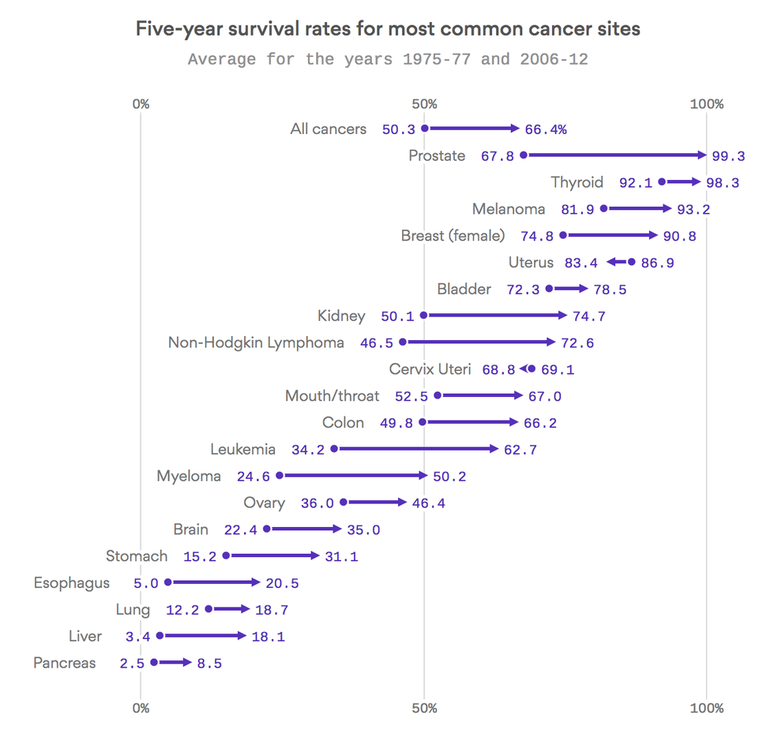
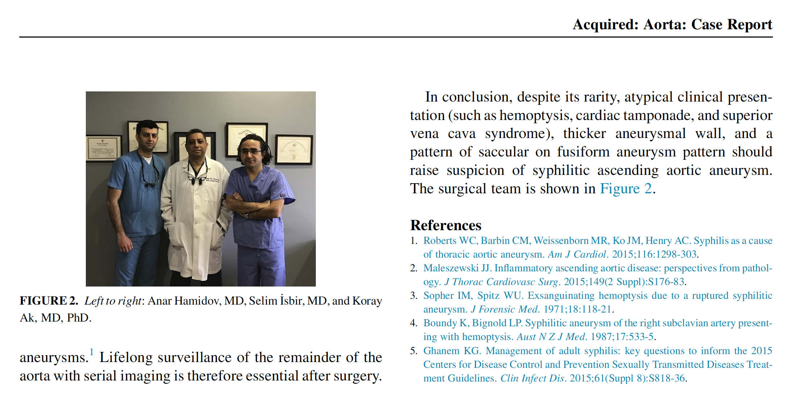
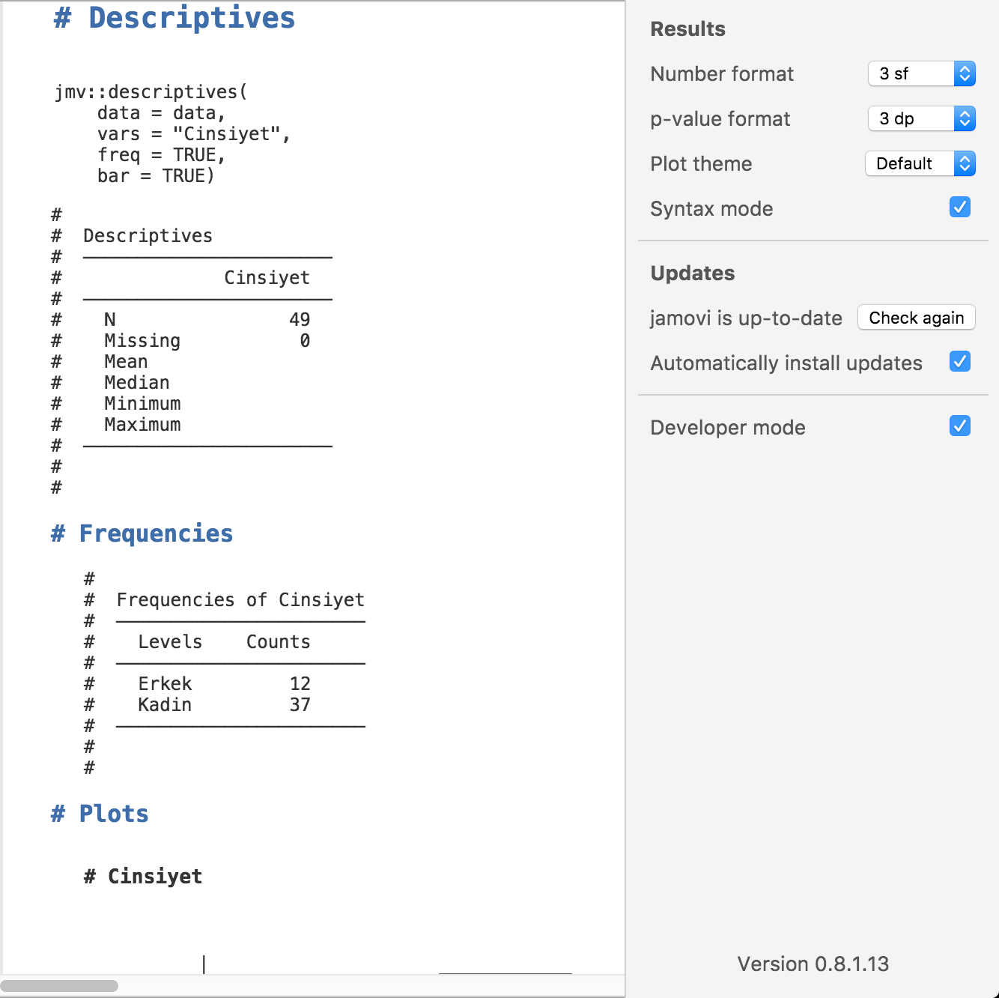
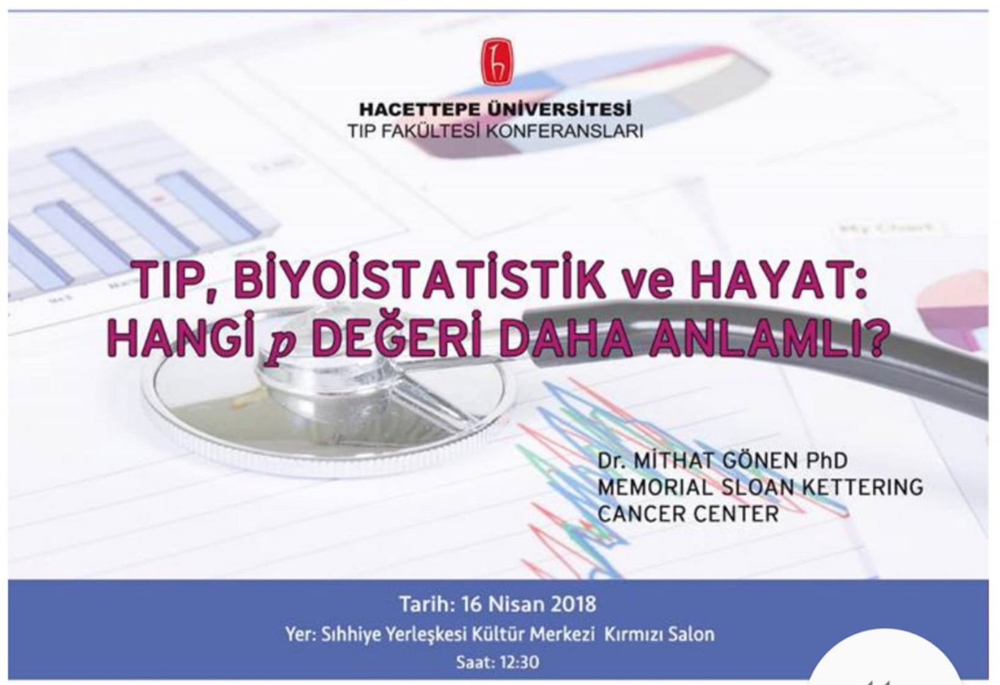
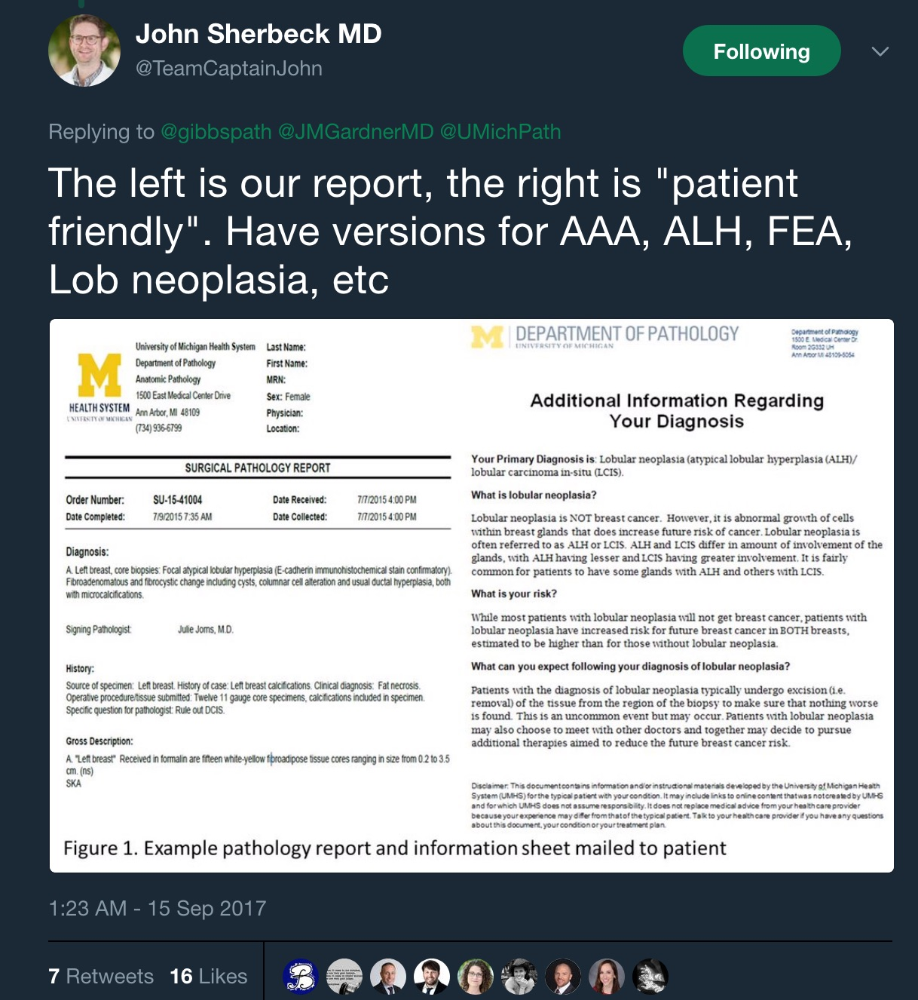
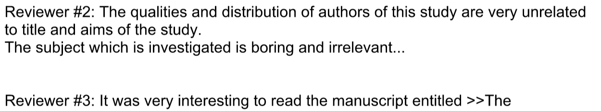
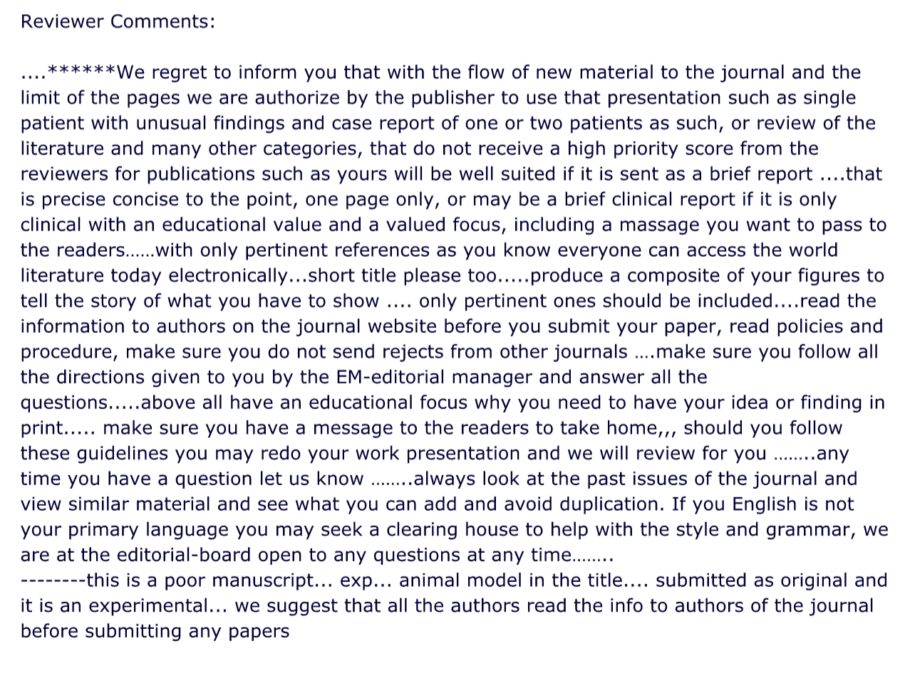
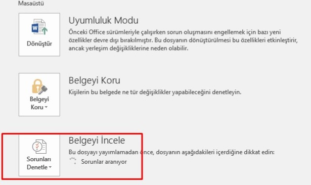
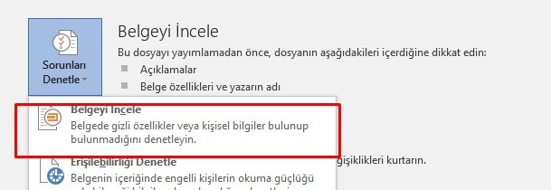
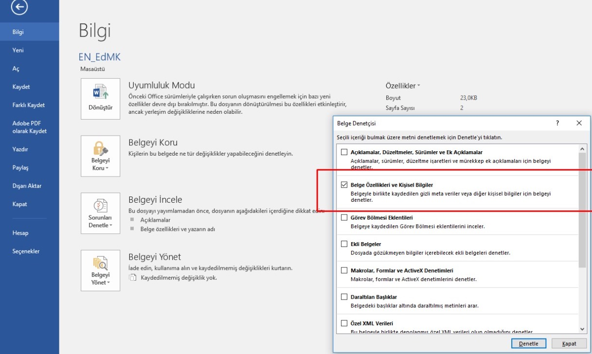

# R project

* R Package Documentation

[https://rdrr.io/](https://rdrr.io/)

* Snippets Run any R code you like

[https://rdrr.io/snippets/](https://rdrr.io/snippets/)

* Getting R and Java 1.8 to work together on OSX

[http://conjugateprior.org/2014/12/r-java8-osx/](http://conjugateprior.org/2014/12/r-java8-osx/)

* [**rJava load error in RStudio/R after “upgrading” to OSX Yosemite**](http://stackoverflow.com/questions/30738974/rjava-load-error-in-rstudio-r-after-upgrading-to-osx-yosemite)

[http://stackoverflow.com/questions/30738974/rjava-load-error-in-rstudio-r-after-upgrading-to-osx-yosemite/31039105](http://stackoverflow.com/questions/30738974/rjava-load-error-in-rstudio-r-after-upgrading-to-osx-yosemite/31039105)

* Jamovi is an open source R based statistics program with "clickable" interface.

[https://www.jamovi.org/](https://t.co/cOmH9PucqI)

* R commander \(Rcmdr\)

[http://www.rcommander.com/](http://www.rcommander.com/)

[https://socialsciences.mcmaster.ca/jfox/Misc/Rcmdr/](https://socialsciences.mcmaster.ca/jfox/Misc/Rcmdr/)

* JASP is another R based statistical open source software, also has Bayesian features

[https://jasp-stats.org/](https://jasp-stats.org/)

* RKWard

[https://rkward.kde.org/](https://rkward.kde.org/)

* The MacPorts Project Official Homepage

[https://www.macports.org](https://www.macports.org)

* How to install and use MacPorts

[http://blog.kicaj.com/installing-macports/](http://blog.kicaj.com/installing-macports/)

* Rattle: A Graphical User Interface for Data Mining using R

[https://rattle.togaware.com](https://rattle.togaware.com)

[http://marcoghislanzoni.com/blog/2014/08/29/solved-installing-rattle-r-3-1-mac-os-x-10-9/](http://marcoghislanzoni.com/blog/2014/08/29/solved-installing-rattle-r-3-1-mac-os-x-10-9/)

# Stains


# Public Health

# Guidelines

# Computational, Digital & Mathematical Pathology

# Stains

# Immunohistochemistry

# Text Mining General

# Nöropatoloji

# Treatment

# Pathology of CNS

# The Mechanisms of Cell Death, Apoptosis, and Autophagy

Last updated:01.05.2015

Name of the Lecture:The Mechanisms of Cell Death, Apoptosis, and Autophagy

Required Prior Knowledge:

Aim of the Lecture:

Goals of the lecture:

Lecture Outlines:

* Analogy for necrosis and apoptosis
* Differences between necrosis and apoptosis
* * Morphologic features of necrosis and steps of necrosis development
  * Morphologic features of apoptosis and steps of apoptosis development
* Necrosis
* * Nuclear changes in necrosis
  * * Pyknosis
    * Karyolysis
    * Karyorrhexis
  * Necrosis, morphology, its effect to regional tissue and its removal
* Apoptosis
* * Factors controlling apoptosis
  * Physiologic Causes of Apoptosis
  * Pathologic Causes of Apoptosis
  * Mechanisms of apoptosis
  * * The Mitochondrial \(Intrinsic\) Pathway of Apoptosis
    * The Death Receptor \(Extrinsic\) Pathway of Apoptosis
    * Caspases
    * Clearance of Apoptotic Cells
  * Examples of Apoptosis
* Necroptosis
* Pyroptosis
* Autophagy

References:

1. Robbins Basic Pathology, 9th edition
2. Robbins and Cotran Pathologic Basis of Disease, 9th edition
3. Programmed cell death:[https://www.coursera.org/course/pcd](https://www.coursera.org/course/pcd)

# Intracellular Accumulations and Cellular Aging

Last updated:01.05.2015

Name of the Lecture:Intracellular Accumulations and Cellular Aging

Required Prior Knowledge:

Basic knowledge of intracellular transport

Basic knowledge about enzyme functions and metabolic pathways

Aim of the Lecture:

Goals of the lecture:

Lecture Outlines:

* Intracellular accumulations
* Intracellular accumulation mechanisms
* * Abnormal removal, inadequate transport
  * Abnormal folding, or depot
  * Abnormal anabolism, enzyme deficiency, byproducts
  * Exogenous materials that cannot be ingested
* Fat accumulation
* Protein accumulation
* Glycogen accumulation
* Pigments
* * Carbon
  * Lipofuscin
  * Melanin
  * Hemosiderin
  * Amyloid
  * Hyaline change
* Pathologic Calcification
* * Dystrophic calcification
  * Metastatic calcification
  * Causes of hypercalcemia
* Cellular aging
* Why do we age?
* DNA damage
* Decreased cellular replication
* Telomeres
* Werner syndrome

References:

1. Robbins Basic Pathology, 9th edition
2. Robbins and Cotran Pathologic Basis of Disease, 9th edition

# General Pathology

# Laboratory Lectures

# The Mechanisms of Cell Death, Apoptosis, and Autophagy

# Bibliography, Impact Factor, and Citations

# Data And Tools For Bibliographic Analysis

# Histochemistry

# Immunohistochemistry

# R project

# Macroscopy

# Macroscopy

* 
# Machine Learning

# Hematoxylin & Eosin

# Gynecological Pathology

# Colon and Rectum

# Gastrointestinal Pathology

# Survival Analysis

# Tools for Data Analysis and Visualisation

# Statistics and Pathology

# About Pathology Lectures

Dersler ile ilgili genel bilgiler

Patoloji derslerinde hastalıklar değişik açılardan anlatılacaktır. Sizden beklenen bu değişik yönleri klinik derslerle de birleştirmenizdir.

* Epidemiyoloji
* Patogenez
* Morfoloji
* * Genetik
* Tedavi
* * Morfoloji ve patogenezin klinik ile korelasyonu
* Hastalığın süreci
* * Hastalığın değişik dönemleri ve ayırıcı tanıyla ilişkisi

Kaynaklar:

Patoloji derslerini hazırlarken temel olarak Robbins’ten faydalanıyoruz.

Aşağıda listesi verilen kitaplardan faydalanabilirsiniz. Bunların hemen tümü kütüphanemizde mevcuttur:

1. Robbins Basic Pathology, 9th edition
2. Robbins and Cotran Pathologic Basis of Disease, 9th edition
3. Robbins Temel Patoloji
4. BRS Pathology \(Board Review Series\)
5. Pathology Secrets
6. Pathophysiology: The Biologic Basis for Disease in Adults and Children, 7e
7. Elsevier's Integrated Pathology
8. Histology and Cell Biology: An Introduction to Pathology
9. Netter's Illustrated Human Pathology
10. Rapid Review Pathology
11. Robbins and Cotran Atlas of Pathology
12. Robbins and Cotran Review of Pathology
13. Wheater's Basic Pathology
14. Wheater's Basic Pathology: A Text, Atlas and Review of Histopathology
15. Wheater's Review of Histology & Basic Pathology
16. Rubin’s Pathology CLINICOPATHOLOGIC FOUNDATIONS OF MEDICINE
17. The Biology of Cancer Robert A. Weinberg

# Uropathology

# Treatment

# Science


# Introduction to Pathology
# Medical School Lectures


# Nöropatoloji

[https://www.youtube.com/watch?v=2gNjnwlwQ20](https://www.youtube.com/watch?v=2gNjnwlwQ20)

# Pathology Laboratory How it works

# The Mechanisms of Cell Death, Apoptosis, and Autophagy

Last updated:01.05.2015

Name of the Lecture:The Mechanisms of Cell Death, Apoptosis, and Autophagy

Required Prior Knowledge:

Aim of the Lecture:

Goals of the lecture:

Lecture Outlines:

* Analogy for necrosis and apoptosis
* Differences between necrosis and apoptosis
* * Morphologic features of necrosis and steps of necrosis development
  * Morphologic features of apoptosis and steps of apoptosis development
* Necrosis
* * Nuclear changes in necrosis
  * * Pyknosis
    * Karyolysis
    * Karyorrhexis
  * Necrosis, morphology, its effect to regional tissue and its removal
* Apoptosis
* * Factors controlling apoptosis
  * Physiologic Causes of Apoptosis
  * Pathologic Causes of Apoptosis
  * Mechanisms of apoptosis
  * * The Mitochondrial \(Intrinsic\) Pathway of Apoptosis
    * The Death Receptor \(Extrinsic\) Pathway of Apoptosis
    * Caspases
    * Clearance of Apoptotic Cells
  * Examples of Apoptosis
* Necroptosis
* Pyroptosis
* Autophagy

References:

1. Robbins Basic Pathology, 9th edition
2. Robbins and Cotran Pathologic Basis of Disease, 9th edition
3. Programmed cell death:[https://www.coursera.org/course/pcd](https://www.coursera.org/course/pcd)

# About Pathology Lectures

Dersler ile ilgili genel bilgiler

Patoloji derslerinde hastalıklar değişik açılardan anlatılacaktır. Sizden beklenen bu değişik yönleri klinik derslerle de birleştirmenizdir.

* Epidemiyoloji
* Patogenez
* Morfoloji
* * Genetik
* Tedavi
* * Morfoloji ve patogenezin klinik ile korelasyonu
* Hastalığın süreci
* * Hastalığın değişik dönemleri ve ayırıcı tanıyla ilişkisi

Kaynaklar:

Patoloji derslerini hazırlarken temel olarak Robbins’ten faydalanıyoruz.

Aşağıda listesi verilen kitaplardan faydalanabilirsiniz. Bunların hemen tümü kütüphanemizde mevcuttur:

1. Robbins Basic Pathology, 9th edition
2. Robbins and Cotran Pathologic Basis of Disease, 9th edition
3. Robbins Temel Patoloji
4. BRS Pathology \(Board Review Series\)
5. Pathology Secrets
6. Pathophysiology: The Biologic Basis for Disease in Adults and Children, 7e
7. Elsevier's Integrated Pathology
8. Histology and Cell Biology: An Introduction to Pathology
9. Netter's Illustrated Human Pathology
10. Rapid Review Pathology
11. Robbins and Cotran Atlas of Pathology
12. Robbins and Cotran Review of Pathology
13. Wheater's Basic Pathology
14. Wheater's Basic Pathology: A Text, Atlas and Review of Histopathology
15. Wheater's Review of Histology & Basic Pathology
16. Rubin’s Pathology CLINICOPATHOLOGIC FOUNDATIONS OF MEDICINE
17. The Biology of Cancer Robert A. Weinberg

# Nöropatoloji

[https://www.youtube.com/watch?v=2gNjnwlwQ20](https://www.youtube.com/watch?v=2gNjnwlwQ20)

# SPSS

* **Paired Samples t-test - SPSS**

[https://www.youtube.com/watch?v=MJGk2sg4EZU](https://www.youtube.com/watch?v=MJGk2sg4EZU)

* **Oneway ANOVA - SPSS**

[https://www.youtube.com/watch?v=\_btBuD3LIsM](https://www.youtube.com/watch?v=_btBuD3LIsM)

[https://www.youtube.com/watch?v=ZxLfDYCTlhE](https://www.youtube.com/watch?v=ZxLfDYCTlhE)

[https://www.youtube.com/watch?v=5SThhCVDecc](https://www.youtube.com/watch?v=5SThhCVDecc)

* **Tutorials**

[https://www.spss-tutorials.com](https://www.spss-tutorials.com)

* **Raynald's SPSS Tools**

[http://spsstools.net/en/](http://spsstools.net/en/)

* **Survival Analysis**

  * **Life Tables:**

  [http://www.ucdenver.edu/academics/colleges/nursing/Documents/PDF/SurvivalHowTo.pdf](http://www.ucdenver.edu/academics/colleges/nursing/Documents/PDF/SurvivalHowTo.pdf)

* **Syntax:**
  * **Rename variables**

[https://www.youtube.com/watch?v=oNQJ3qXBQBk](https://www.youtube.com/watch?v=oNQJ3qXBQBk)

türkçe karakterleri olan değişkenler syntax'ta çalışmıyor \(Öğrenci\_No\).

bunun için variable isimlerini notepad'e kopyalayıp, ı, ğ, ü, ş, ö, ç harflerini replace ediyoruz.

excelde a1, a2, a3 şeklinde isimler oluşturup, variable view da isimlerin üstüne yapıştırıyoruz.

sonra a1, a2, a3'leri notepad teki isimlerle değiştiriyoruz.

Lablel'lar da varsa kontrolü daha kolay.

aşağıdaki komutu excelde oluşturmak mümkün =CONCATENATE\("\( ";A1;" = ";B1;" \)"\)

RENAME VARIABLES

\( a1 = ogrenci\_no \).

EXECUTE.

**Multifactorial GLM/ANOVA \(SPSS\)**

[https://www.youtube.com/watch?v=arA-gh0yJoA](https://www.youtube.com/watch?v=arA-gh0yJoA)

**MANOVA \(Multivariate Analysis of Variance\)**

[https://www.youtube.com/watch?v=m0zV\_wFGA1I](https://www.youtube.com/watch?v=m0zV_wFGA1I)

**MANOVA - SPSS \(part 1\)**

[https://www.youtube.com/watch?v=3pzCa4Whv74](https://www.youtube.com/watch?v=3pzCa4Whv74)

**SPSS output Legacy Wiever.**

[ftp://ftp.software.ibm.com/software/analytics/spss/support/Stats/Docs/Statistics/LegacyViewer/readme.html](ftp://ftp.software.ibm.com/software/analytics/spss/support/Stats/Docs/Statistics/LegacyViewer/readme.html)

**Lesson \#7: Custom Tables in SPSS**

[https://www.youtube.com/watch?v=D-tEqPFSYCY](https://www.youtube.com/watch?v=D-tEqPFSYCY)

**Fit Output Table to One Page - SPSS**

[https://www.youtube.com/watch?v=RDJUqx-WFQ4](https://www.youtube.com/watch?v=RDJUqx-WFQ4)

**SPSS - Kruskal Wallis H test with post-hoc**

[https://www.youtube.com/watch?v=a\_Wr4-a2k3s](https://www.youtube.com/watch?v=a_Wr4-a2k3s)

**Pearson's Correlation Coefficient in SPSS**

[https://www.youtube.com/watch?time\_continue=9&v=VqISD8DlXeE](https://www.youtube.com/watch?time_continue=9&v=VqISD8DlXeE)

[http://www.statisticshowto.com/correlation-coefficient-spss/](http://www.statisticshowto.com/correlation-coefficient-spss/)

**Two-step Cluster Analysis in SPSS**

[https://www.youtube.com/watch?v=DpucueFsigA](https://www.youtube.com/watch?v=DpucueFsigA)

**Cramér’s V – What and Why?**

[https://www.spss-tutorials.com/cramers-v-what-and-why/](https://www.spss-tutorials.com/cramers-v-what-and-why/)

[https://www.ibm.com/support/knowledgecenter/en/SSLVMB\_24.0.0/spss/base/idh\_xtab\_statistics.html](https://www.ibm.com/support/knowledgecenter/en/SSLVMB_24.0.0/spss/base/idh_xtab_statistics.html)

[http://uregina.ca/~gingrich/ch11a.pdf](http://uregina.ca/~gingrich/ch11a.pdf)

Laerd Statistics \(2016\). Chi-square test for association using SPSS Statistics. _Statistical tutorials and software guides_. Retrieved from [https://statistics.laerd.com/](https://statistics.laerd.com/)

## Spaghetti Plot in SPSS - The Easy Way

[https://www.youtube.com/watch?v=TGCU0SIZMhU](https://www.youtube.com/watch?v=TGCU0SIZMhU)

## SPSS Repeated Measures ANOVA <a id="main-title"></a>

[https://www.spss-tutorials.com/repeated-measures-anova/](https://www.spss-tutorials.com/repeated-measures-anova/)

[https://www.spss-tutorials.com/spss-repeated-measures-anova/](https://www.spss-tutorials.com/spss-repeated-measures-anova/)

[https://www.spss-tutorials.com/spss-repeated-measures-anova-example-2/](https://www.spss-tutorials.com/spss-repeated-measures-anova-example-2/)

# Tools for Data Analysis and Visualisation

* Sankey diagram

[https://medium.com/@Elijah\_Meeks/2018-data-visualization-survey-results-26a90856476b](https://medium.com/@Elijah_Meeks/2018-data-visualization-survey-results-26a90856476b)


* THE WORK OF EDWARD TUFTE AND GRAPHICS PRESS

[https://www.edwardtufte.com/tufte/](https://www.edwardtufte.com/tufte/)

* R Graph Gallery

[https://www.r-graph-gallery.com/](https://www.r-graph-gallery.com/)

* rollApp

[https://www.rollapp.com/apps/statistics](https://www.rollapp.com/apps/statistics)

* Bluesky Statistics

[http://www.blueskystatistics.com/](http://www.blueskystatistics.com/)

* Knime

[https://www.knime.com/](https://www.knime.com/)

* **R commander**

[http://www.rcommander.com/](http://www.rcommander.com/)

* Free statistics software for Macintosh computers \(Macs\)

  [https://www.macstats.org/statistics-software/free.html](https://www.macstats.org/statistics-software/free.html)

* ggplot2 extensions

[http://www.ggplot2-exts.org/gallery/](http://www.ggplot2-exts.org/gallery/)

* Web Pages that Perform Statistical Calculations

[http://statpages.info/](http://statpages.info/)

* EpiTools epidemiological calculators

[http://epitools.ausvet.com.au/content.php?page=home](http://epitools.ausvet.com.au/content.php?page=home)

* QuickCalcs Online Statistical Calculator

[https://www.graphpad.com/quickcalcs/](https://www.graphpad.com/quickcalcs/)

* VassarStats: Website for Statistical Computation [http://vassarstats.net/](http://vassarstats.net/)
* Cutoff Finder

  [http://molpath.charite.de/cutoff/index.jsp](http://molpath.charite.de/cutoff/index.jsp)

* Plotly

[https://plot.ly/](https://plot.ly/)

[https://plot.ly/r/](https://plot.ly/r/)

* A website trying to present all relevant data visualizations, so you can find the right visualization and get inspiration on how to do it.

[http://datavizproject.com/](http://datavizproject.com/)

* Open Source Epidemiologic Statistics for Public Health

[http://www.openepi.com/](http://www.openepi.com/)

* [https://www.datawrapper.de](https://www.datawrapper.de)
* [https://public.tableau.com/](https://public.tableau.com/)
* **Open Refine, Google Refine**

[http://openrefine.org/](http://openrefine.org/)

* Google Refine 2.0 - Introduction \(1 of 3\) \(video version 2\)

[https://www.youtube.com/watch?v=B70J\_H\_zAWM](https://www.youtube.com/watch?v=B70J_H_zAWM)

* Google Refine 2.0 - Data Augmentation \(3 of 3\) \(video version 2\)

[https://www.youtube.com/watch?v=5tsyz3ibYzk&index=2&list=WL](https://www.youtube.com/watch?v=5tsyz3ibYzk&index=2&list=WL)

* [https://www.coursera.org/learn/datavisualization/supplement/ijZAO/resources](https://www.coursera.org/learn/datavisualization/supplement/ijZAO/resources)

**Online Data Visualization Websites**

* [DataHero](http://datahero.com/)
* [Plotly](http://plot.ly/)
* [Number Picture](http://site.numberpicture.com/)
* [Polychart](https://github.com/Polychart)
* [Juice Analytics](http://www.juiceanalytics.com/)
* [Weave](http://www.iweave.org/)
* [Datavisual](http://datavisu.al/)
* [Silk](https://www.silk.co/)
* [Zoomdata](http://www.zoomdata.com/)

  \(via the cloud platforms\)

* [RAW](http://app.raw.densitydesign.org/)
* [Datawrapper](https://datawrapper.de/)

**Software**

* [Tableau](http://www.tableau.com/)
* [SAP Lumira](http://www.sapstore.com/getlumira)

  \(including a free Personal Edition version\)

* [Microsoft Excel](https://products.office.com/excel)

  \(or any other spreadsheet that includes charts\)

* [ClearStory](http://www.clearstorydata.com/)
* [BeyondCore](http://beyondcore.com/)
* [Mathematica](http://www.wolfram.com/mathematica/)
* [MATLAB](http://www.mathworks.com/products/matlab/)
* [MatPlotLib](http://matplotlib.org/)

  \(if you are comfortable programming Python\)

* [R Programming Language](https://www.r-project.org/)
* [ggplot2](http://ggplot2.org/)

**Some Data Sources**

* [Google Public Data Explorer](http://www.google.com/publicdata/directory)
* [Data from the World Bank](http://data.worldbank.org/)

**Plotting your data**

[https://sites.google.com/site/obintlab/wiki/plotting-data](https://sites.google.com/site/obintlab/wiki/plotting-data)

* RevMan 5

[http://community.cochrane.org/tools/review-production-tools/revman-5](http://community.cochrane.org/tools/review-production-tools/revman-5)

* Trifacta

[https://www.trifacta.com/](https://www.trifacta.com/)

* UW Interactive Data Lab

[http://idl.cs.washington.edu/](http://idl.cs.washington.edu/)

[https://vega.github.io/](https://vega.github.io/)

* Design better data tables The ingredients of a successful data table UI

[https://uxdesign.cc/design-better-data-tables-4ecc99d23356](https://uxdesign.cc/design-better-data-tables-4ecc99d23356)

* gapminder

[https://www.gapminder.org/](https://www.gapminder.org/)

* DOLLAR STREET

[https://www.gapminder.org/dollar-street/matrix](https://www.gapminder.org/dollar-street/matrix)

* Show your own data

[https://vizabi.org/tutorials/2017/04/03/show-your-data/](https://vizabi.org/tutorials/2017/04/03/show-your-data/)

* Join your data with Gapminder's data

[https://vizabi.org/tutorials/2017/04/04/join-your-data-with-g/](https://vizabi.org/tutorials/2017/04/04/join-your-data-with-g/)

# AAPA

Dersler ile ilgili genel bilgiler

  


Patoloji derslerinde hastalıklar değişik açılardan anlatılacaktır. Sizden beklenen bu değişik yönleri klinik derslerle de birleştirmenizdir.

  


* Epidemiyoloji

* Patogenez

* Morfoloji

* 
* Genetik

* Tedavi

* 
* Morfoloji ve patogenezin klinik ile korelasyonu

* Hastalığın süreci

* * Hastalığın değişik dönemleri ve ayırıcı tanıyla ilişkisi

  


  


Kaynaklar:

Patoloji derslerini hazırlarken temel olarak Robbins’ten faydalanıyoruz.

Aşağıda listesi verilen kitaplardan faydalanabilirsiniz. Bunların hemen tümü kütüphanemizde mevcuttur:

  


1. Robbins Basic Pathology, 9th edition

2. Robbins and Cotran Pathologic Basis of Disease, 9th edition

3. Robbins Temel Patoloji

4. BRS Pathology \(Board Review Series\)

5. Pathology Secrets

6. Pathophysiology: The Biologic Basis for Disease in Adults and Children, 7e

7. Elsevier's Integrated Pathology

8. Histology and Cell Biology: An Introduction to Pathology

9. Netter's Illustrated Human Pathology

10. Rapid Review Pathology

11. Robbins and Cotran Atlas of Pathology

12. Robbins and Cotran Review of Pathology

13. Wheater's Basic Pathology

14. Wheater's Basic Pathology: A Text, Atlas and Review of Histopathology

15. Wheater's Review of Histology & Basic Pathology

16. Rubin’s Pathology CLINICOPATHOLOGIC FOUNDATIONS OF MEDICINE

17. The Biology of Cancer Robert A. Weinberg

  


  


Dersler ile ilgili genel bilgiler

  


Patoloji derslerinde hastalıklar değişik açılardan anlatılacaktır. Sizden beklenen bu değişik yönleri klinik derslerle de birleştirmenizdir.

  


* Epidemiyoloji

* Patogenez

* Morfoloji

* 
* Genetik

* Tedavi

* 
* Morfoloji ve patogenezin klinik ile korelasyonu

* Hastalığın süreci

* * Hastalığın değişik dönemleri ve ayırıcı tanıyla ilişkisi

  


  


Kaynaklar:

Patoloji derslerini hazırlarken temel olarak Robbins’ten faydalanıyoruz.

Aşağıda listesi verilen kitaplardan faydalanabilirsiniz. Bunların hemen tümü kütüphanemizde mevcuttur:

  


1. Robbins Basic Pathology, 9th edition

2. Robbins and Cotran Pathologic Basis of Disease, 9th edition

3. Robbins Temel Patoloji

4. BRS Pathology \(Board Review Series\)

5. Pathology Secrets

6. Pathophysiology: The Biologic Basis for Disease in Adults and Children, 7e

7. Elsevier's Integrated Pathology

8. Histology and Cell Biology: An Introduction to Pathology

9. Netter's Illustrated Human Pathology

10. Rapid Review Pathology

11. Robbins and Cotran Atlas of Pathology

12. Robbins and Cotran Review of Pathology

13. Wheater's Basic Pathology

14. Wheater's Basic Pathology: A Text, Atlas and Review of Histopathology

15. Wheater's Review of Histology & Basic Pathology

16. Rubin’s Pathology CLINICOPATHOLOGIC FOUNDATIONS OF MEDICINE

17. The Biology of Cancer Robert A. Weinberg

  


  


* Whole Slide Imaging Versus Microscopy for Primary Diagnosis in Surgical Pathology: A Multicenter Blinded Randomized Noninferiority Study of 1992 Cases \(Pivotal Study\).

http://journals.lww.com/ajsp/Abstract/publishahead/Whole\_Slide\_Imaging\_Versus\_Microscopy\_for\_Primary.97978.aspx

* The Gold Standard Paradox in Digital Image Analysis Manual Versus Automated Scoring as Ground Truth

Arch Pathol Lab Med. 2017 May 30.  PMID: 28557614 DOI: [10.5858/arpa.2016-0386-RA](https://doi.org/10.5858/arpa.2016-0386-RA)

# About the Usage of Digital Pathology

* Whole Slide Imaging Versus Microscopy for Primary Diagnosis in Surgical Pathology: A Multicenter Blinded Randomized Noninferiority Study of 1992 Cases \(Pivotal Study\).

[http://journals.lww.com/ajsp/Abstract/publishahead/Whole\_Slide\_Imaging\_Versus\_Microscopy\_for\_Primary.97978.aspx](http://journals.lww.com/ajsp/Abstract/publishahead/Whole_Slide_Imaging_Versus_Microscopy_for_Primary.97978.aspx)

* The Gold Standard Paradox in Digital Image Analysis Manual Versus Automated Scoring as Ground Truth

Arch Pathol Lab Med. 2017 May 30. PMID: 28557614 DOI: [10.5858/arpa.2016-0386-RA](https://doi.org/10.5858/arpa.2016-0386-RA)

* Whole Slide Imaging Versus Microscopy for Primary Diagnosis in Surgical Pathology: A Multicenter Blinded Randomized Noninferiority Study of 1992 Cases \(Pivotal Study\).

http://journals.lww.com/ajsp/Abstract/publishahead/Whole\_Slide\_Imaging\_Versus\_Microscopy\_for\_Primary.97978.aspx

* The Gold Standard Paradox in Digital Image Analysis Manual Versus Automated Scoring as Ground Truth

Arch Pathol Lab Med. 2017 May 30.  PMID: 28557614 DOI: [10.5858/arpa.2016-0386-RA](https://doi.org/10.5858/arpa.2016-0386-RA)

* Whole Slide Imaging Versus Microscopy for Primary Diagnosis in Surgical Pathology: A Multicenter Blinded Randomized Noninferiority Study of 1992 Cases \(Pivotal Study\).

http://journals.lww.com/ajsp/Abstract/publishahead/Whole\_Slide\_Imaging\_Versus\_Microscopy\_for\_Primary.97978.aspx

* The Gold Standard Paradox in Digital Image Analysis Manual Versus Automated Scoring as Ground Truth

Arch Pathol Lab Med. 2017 May 30.  PMID: 28557614 DOI: [10.5858/arpa.2016-0386-RA](https://doi.org/10.5858/arpa.2016-0386-RA)

# About the Usage of Digital Pathology

* Whole Slide Imaging Versus Microscopy for Primary Diagnosis in Surgical Pathology: A Multicenter Blinded Randomized Noninferiority Study of 1992 Cases \(Pivotal Study\).

[http://journals.lww.com/ajsp/Abstract/publishahead/Whole\_Slide\_Imaging\_Versus\_Microscopy\_for\_Primary.97978.aspx](http://journals.lww.com/ajsp/Abstract/publishahead/Whole_Slide_Imaging_Versus_Microscopy_for_Primary.97978.aspx)

* The Gold Standard Paradox in Digital Image Analysis Manual Versus Automated Scoring as Ground Truth

Arch Pathol Lab Med. 2017 May 30. PMID: 28557614 DOI: [10.5858/arpa.2016-0386-RA](https://doi.org/10.5858/arpa.2016-0386-RA)

# Academics General

* Access 2013 videos and tutorials

https://support.office.com/en-us/article/Access-2013-videos-and-tutorials-A4BD10EA-D5F4-40C5-8B37-D254561F8BCE

* 


* Access 2013 videos and tutorials

https://support.office.com/en-us/article/Access-2013-videos-and-tutorials-A4BD10EA-D5F4-40C5-8B37-D254561F8BCE

* 


# Access

* Access 2013 videos and tutorials

[https://support.office.com/en-us/article/Access-2013-videos-and-tutorials-A4BD10EA-D5F4-40C5-8B37-D254561F8BCE](https://support.office.com/en-us/article/Access-2013-videos-and-tutorials-A4BD10EA-D5F4-40C5-8B37-D254561F8BCE)

* 
* Patoloji'de akreditasyona gazetecilerin katkısı

Patoloji'de akreditasyona gazetecilerin katkısı üzerine de düşünmek lazım.

https://wwwn.cdc.gov/cliac/pdf/Addenda/cliac0208/Addendum%20G.pdf

http://faculty.poly.edu/~jbain/scitechsoc/readings/98CC.pdf

Belki de son zamanlarda çıkan haberlere reaksiyon göstermek yerine gerginliği dozunda kontrol edip, bu durumu fırsata çevirmek mümkün olabilir.

* Patoloji'de akreditasyona gazetecilerin katkısı

Patoloji'de akreditasyona gazetecilerin katkısı üzerine de düşünmek lazım.

https://wwwn.cdc.gov/cliac/pdf/Addenda/cliac0208/Addendum%20G.pdf

http://faculty.poly.edu/~jbain/scitechsoc/readings/98CC.pdf

Belki de son zamanlarda çıkan haberlere reaksiyon göstermek yerine gerginliği dozunda kontrol edip, bu durumu fırsata çevirmek mümkün olabilir.

* Patoloji'de akreditasyona gazetecilerin katkısı

Patoloji'de akreditasyona gazetecilerin katkısı üzerine de düşünmek lazım.

https://wwwn.cdc.gov/cliac/pdf/Addenda/cliac0208/Addendum%20G.pdf

http://faculty.poly.edu/~jbain/scitechsoc/readings/98CC.pdf

Belki de son zamanlarda çıkan haberlere reaksiyon göstermek yerine gerginliği dozunda kontrol edip, bu durumu fırsata çevirmek mümkün olabilir.

* Patoloji'de akreditasyona gazetecilerin katkısı

Patoloji'de akreditasyona gazetecilerin katkısı üzerine de düşünmek lazım.

https://wwwn.cdc.gov/cliac/pdf/Addenda/cliac0208/Addendum%20G.pdf

http://faculty.poly.edu/~jbain/scitechsoc/readings/98CC.pdf

Belki de son zamanlarda çıkan haberlere reaksiyon göstermek yerine gerginliği dozunda kontrol edip, bu durumu fırsata çevirmek mümkün olabilir.

# Acreditation

* Patoloji'de akreditasyona gazetecilerin katkısı

Patoloji'de akreditasyona gazetecilerin katkısı üzerine de düşünmek lazım.

[https://wwwn.cdc.gov/cliac/pdf/Addenda/cliac0208/Addendum G.pdf](https://wwwn.cdc.gov/cliac/pdf/Addenda/cliac0208/Addendum%20G.pdf)

[http://faculty.poly.edu/~jbain/scitechsoc/readings/98CC.pdf](http://faculty.poly.edu/~jbain/scitechsoc/readings/98CC.pdf)

Belki de son zamanlarda çıkan haberlere reaksiyon göstermek yerine gerginliği dozunda kontrol edip, bu durumu fırsata çevirmek mümkün olabilir.

# AJCC, UICC, TNM

* 
[http://www.uicc.org/sites/main/files/atoms/files/TNM\_Classification\_of\_Malignant\_ Tumours\_8th\_edition\_NEW\_updated\_0.pptx](http://www.uicc.org/sites/main/files/atoms/files/TNM_Classification_of_Malignant_%20Tumours_8th_edition_NEW_updated_0.pptx)

* Eighth Edition of the UICC Classification of Malignant Tumours: an overview of the changes in the pathological TNM classification criteria—What has changed and why?

[https://link.springer.com/article/10.1007/s00428-017-2276-y](https://link.springer.com/article/10.1007/s00428-017-2276-y)

*  

[http://www.uicc.org/sites/main/files/atoms/files/TNM\_Classification\_of\_Malignant\_ Tumours\_8th\_edition\_NEW\_updated\_0.pptx](http://www.uicc.org/sites/main/files/atoms/files/TNM_Classification_of_Malignant_ Tumours_8th_edition_NEW_updated_0.pptx)

* Eighth Edition of the UICC Classification of Malignant Tumours: an overview of the changes in the pathological TNM classification criteria—What has changed and why?

[https://link.springer.com/article/10.1007/s00428-017-2276-y](https://link.springer.com/article/10.1007/s00428-017-2276-y)

*  

[http://www.uicc.org/sites/main/files/atoms/files/TNM\_Classification\_of\_Malignant\_ Tumours\_8th\_edition\_NEW\_updated\_0.pptx](http://www.uicc.org/sites/main/files/atoms/files/TNM_Classification_of_Malignant_ Tumours_8th_edition_NEW_updated_0.pptx)

* Eighth Edition of the UICC Classification of Malignant Tumours: an overview of the changes in the pathological TNM classification criteria—What has changed and why?

[https://link.springer.com/article/10.1007/s00428-017-2276-y](https://link.springer.com/article/10.1007/s00428-017-2276-y)

*  

[http://www.uicc.org/sites/main/files/atoms/files/TNM\_Classification\_of\_Malignant\_ Tumours\_8th\_edition\_NEW\_updated\_0.pptx](http://www.uicc.org/sites/main/files/atoms/files/TNM_Classification_of_Malignant_ Tumours_8th_edition_NEW_updated_0.pptx)

* Eighth Edition of the UICC Classification of Malignant Tumours: an overview of the changes in the pathological TNM classification criteria—What has changed and why?

[https://link.springer.com/article/10.1007/s00428-017-2276-y](https://link.springer.com/article/10.1007/s00428-017-2276-y)

# AJCC, UICC, TNM

# Alluvial Diagrams

[http://datavizproject.com/data-type/alluvial-diagram/](http://datavizproject.com/data-type/alluvial-diagram/)

[https://cran.r-project.org/web/packages/alluvial/vignettes/alluvial.html](https://cran.r-project.org/web/packages/alluvial/vignettes/alluvial.html)

## Alluvial Diagrams with ggforce

[http://www.dandersondata.com/post/alluvial-plots-with-ggforce/](http://www.dandersondata.com/post/alluvial-plots-with-ggforce/)

## Alluvial Diagrams in ggplot2

[http://corybrunson.github.io/ggalluvial/articles/ggalluvial.html](http://corybrunson.github.io/ggalluvial/articles/ggalluvial.html)

[http://datavizproject.com/data-type/alluvial-diagram/](http://datavizproject.com/data-type/alluvial-diagram/)

[https://cran.r-project.org/web/packages/alluvial/vignettes/alluvial.html](https://cran.r-project.org/web/packages/alluvial/vignettes/alluvial.html)

# Alluvial Diagrams with ggforce

[http://www.dandersondata.com/post/alluvial-plots-with-ggforce/](http://www.dandersondata.com/post/alluvial-plots-with-ggforce/)

# Alluvial Diagrams in ggplot2

http://corybrunson.github.io/ggalluvial/articles/ggalluvial.html


[http://datavizproject.com/data-type/alluvial-diagram/](http://datavizproject.com/data-type/alluvial-diagram/)

[https://cran.r-project.org/web/packages/alluvial/vignettes/alluvial.html](https://cran.r-project.org/web/packages/alluvial/vignettes/alluvial.html)

# Alluvial Diagrams with ggforce

[http://www.dandersondata.com/post/alluvial-plots-with-ggforce/](http://www.dandersondata.com/post/alluvial-plots-with-ggforce/)

# Alluvial Diagrams in ggplot2

http://corybrunson.github.io/ggalluvial/articles/ggalluvial.html


[http://datavizproject.com/data-type/alluvial-diagram/](http://datavizproject.com/data-type/alluvial-diagram/)

[https://cran.r-project.org/web/packages/alluvial/vignettes/alluvial.html](https://cran.r-project.org/web/packages/alluvial/vignettes/alluvial.html)

# Alluvial Diagrams with ggforce

[http://www.dandersondata.com/post/alluvial-plots-with-ggforce/](http://www.dandersondata.com/post/alluvial-plots-with-ggforce/)

# Alluvial Diagrams in ggplot2

http://corybrunson.github.io/ggalluvial/articles/ggalluvial.html


[http://datavizproject.com/data-type/alluvial-diagram/](http://datavizproject.com/data-type/alluvial-diagram/)

[https://cran.r-project.org/web/packages/alluvial/vignettes/alluvial.html](https://cran.r-project.org/web/packages/alluvial/vignettes/alluvial.html)

# Alluvial Diagrams with ggforce

[http://www.dandersondata.com/post/alluvial-plots-with-ggforce/](http://www.dandersondata.com/post/alluvial-plots-with-ggforce/)

# Alluvial Diagrams in ggplot2

http://corybrunson.github.io/ggalluvial/articles/ggalluvial.html


# Alluvial Diagrams

[http://datavizproject.com/data-type/alluvial-diagram/](http://datavizproject.com/data-type/alluvial-diagram/)

[https://cran.r-project.org/web/packages/alluvial/vignettes/alluvial.html](https://cran.r-project.org/web/packages/alluvial/vignettes/alluvial.html)

## Alluvial Diagrams with ggforce

[http://www.dandersondata.com/post/alluvial-plots-with-ggforce/](http://www.dandersondata.com/post/alluvial-plots-with-ggforce/)

## Alluvial Diagrams in ggplot2

[http://corybrunson.github.io/ggalluvial/articles/ggalluvial.html](http://corybrunson.github.io/ggalluvial/articles/ggalluvial.html)

**ImmunoRatio**

[http://153.1.200.58:8080/immunoratio/](http://153.1.200.58:8080/immunoratio/)

[http://imtmicroscope.uta.fi/immunoratio/](http://imtmicroscope.uta.fi/immunoratio/)

ImmunoRatio: a publicly available web application for quantitative image analysis of estrogen receptor \(ER\), progesterone receptor \(PR\), and Ki-67. [PMID: 20663194](https://www.ncbi.nlm.nih.gov/pubmed/20663194)

**ImmunoMembrane**

[http://153.1.200.58:8080/immunomembrane/](http://153.1.200.58:8080/immunomembrane/)

ImmunoMembrane: a publicly available web application for digital image analysis of HER2 immunohistochemistry. [PMID: 22296215](https://www.ncbi.nlm.nih.gov/pubmed/22296215)

Quantifying Stained Liver Tissue

[https://imagej.nih.gov/ij/docs/examples/stained-sections/index.html](https://imagej.nih.gov/ij/docs/examples/stained-sections/index.html)

[https://www.researchgate.net/post/Can\_ImageJ\_software\_be\_used\_to\_calculate\_collagen\_volume\_fraction\_from\_Massons-Trichrome\_stained\_slide\_images](https://www.researchgate.net/post/Can_ImageJ_software_be_used_to_calculate_collagen_volume_fraction_from_Massons-Trichrome_stained_slide_images)

[https://www.scientistsolutions.com/forum/cytology-histology-and-ihc-digital-atlas/how-can-use-imagej-software-collagen-deposition](https://www.scientistsolutions.com/forum/cytology-histology-and-ihc-digital-atlas/how-can-use-imagej-software-collagen-deposition)

Quantification of myocardial fibrosis by digital image analysis and interactive stereology

[https://diagnosticpathology.biomedcentral.com/articles/10.1186/1746-1596-9-114](https://diagnosticpathology.biomedcentral.com/articles/10.1186/1746-1596-9-114)

**Quantifications of Western Blots with ImageJ**

Comparison of collagen content in skin wounds evaluated by biochemical assay and by computeraided histomorphometric analysis

Virtual Double Staining for Automated Quantification in Immunohistochemistry

[https://www.youtube.com/watch?v=\_BLOizOLiMo](https://www.youtube.com/watch?v=_BLOizOLiMo)

# Analysis

**ImmunoRatio**

[http://153.1.200.58:8080/immunoratio/](http://153.1.200.58:8080/immunoratio/)

[http://imtmicroscope.uta.fi/immunoratio/](http://imtmicroscope.uta.fi/immunoratio/)

ImmunoRatio: a publicly available web application for quantitative image analysis of estrogen receptor \(ER\), progesterone receptor \(PR\), and Ki-67. [PMID: 20663194](https://www.ncbi.nlm.nih.gov/pubmed/20663194)

**ImmunoMembrane**

[http://153.1.200.58:8080/immunomembrane/](http://153.1.200.58:8080/immunomembrane/)

ImmunoMembrane: a publicly available web application for digital image analysis of HER2 immunohistochemistry. [PMID: 22296215](https://www.ncbi.nlm.nih.gov/pubmed/22296215)

Quantifying Stained Liver Tissue

[https://imagej.nih.gov/ij/docs/examples/stained-sections/index.html](https://imagej.nih.gov/ij/docs/examples/stained-sections/index.html)

[https://www.researchgate.net/post/Can\_ImageJ\_software\_be\_used\_to\_calculate\_collagen\_volume\_fraction\_from\_Massons-Trichrome\_stained\_slide\_images](https://www.researchgate.net/post/Can_ImageJ_software_be_used_to_calculate_collagen_volume_fraction_from_Massons-Trichrome_stained_slide_images)

[https://www.scientistsolutions.com/forum/cytology-histology-and-ihc-digital-atlas/how-can-use-imagej-software-collagen-deposition](https://www.scientistsolutions.com/forum/cytology-histology-and-ihc-digital-atlas/how-can-use-imagej-software-collagen-deposition)

Quantification of myocardial fibrosis by digital image analysis and interactive stereology

[https://diagnosticpathology.biomedcentral.com/articles/10.1186/1746-1596-9-114](https://diagnosticpathology.biomedcentral.com/articles/10.1186/1746-1596-9-114)

**Quantifications of Western Blots with ImageJ**

Comparison of collagen content in skin wounds evaluated by biochemical assay and by computeraided histomorphometric analysis

Virtual Double Staining for Automated Quantification in Immunohistochemistry

[https://www.youtube.com/watch?v=\_BLOizOLiMo](https://www.youtube.com/watch?v=_BLOizOLiMo)

**ImmunoRatio**

[http://153.1.200.58:8080/immunoratio/](http://153.1.200.58:8080/immunoratio/)

[http://imtmicroscope.uta.fi/immunoratio/](http://imtmicroscope.uta.fi/immunoratio/)

ImmunoRatio: a publicly available web application for quantitative image analysis of estrogen receptor \(ER\), progesterone receptor \(PR\), and Ki-67. [PMID: 20663194](https://www.ncbi.nlm.nih.gov/pubmed/20663194)

**ImmunoMembrane**

[http://153.1.200.58:8080/immunomembrane/](http://153.1.200.58:8080/immunomembrane/)

ImmunoMembrane: a publicly available web application for digital image analysis of HER2 immunohistochemistry. [PMID: 22296215](https://www.ncbi.nlm.nih.gov/pubmed/22296215)

Quantifying Stained Liver Tissue

[https://imagej.nih.gov/ij/docs/examples/stained-sections/index.html](https://imagej.nih.gov/ij/docs/examples/stained-sections/index.html)

[https://www.researchgate.net/post/Can\_ImageJ\_software\_be\_used\_to\_calculate\_collagen\_volume\_fraction\_from\_Massons-Trichrome\_stained\_slide\_images](https://www.researchgate.net/post/Can_ImageJ_software_be_used_to_calculate_collagen_volume_fraction_from_Massons-Trichrome_stained_slide_images)

[https://www.scientistsolutions.com/forum/cytology-histology-and-ihc-digital-atlas/how-can-use-imagej-software-collagen-deposition](https://www.scientistsolutions.com/forum/cytology-histology-and-ihc-digital-atlas/how-can-use-imagej-software-collagen-deposition)

Quantification of myocardial fibrosis by digital image analysis and interactive stereology

[https://diagnosticpathology.biomedcentral.com/articles/10.1186/1746-1596-9-114](https://diagnosticpathology.biomedcentral.com/articles/10.1186/1746-1596-9-114)

**Quantifications of Western Blots with ImageJ**

Comparison of collagen content in skin wounds evaluated by biochemical assay and by computeraided histomorphometric analysis

Virtual Double Staining for Automated Quantification in Immunohistochemistry

[https://www.youtube.com/watch?v=\_BLOizOLiMo](https://www.youtube.com/watch?v=_BLOizOLiMo)

**ImmunoRatio**

[http://153.1.200.58:8080/immunoratio/](http://153.1.200.58:8080/immunoratio/)

[http://imtmicroscope.uta.fi/immunoratio/](http://imtmicroscope.uta.fi/immunoratio/)

ImmunoRatio: a publicly available web application for quantitative image analysis of estrogen receptor \(ER\), progesterone receptor \(PR\), and Ki-67. [PMID: 20663194](https://www.ncbi.nlm.nih.gov/pubmed/20663194)

**ImmunoMembrane**

[http://153.1.200.58:8080/immunomembrane/](http://153.1.200.58:8080/immunomembrane/)

ImmunoMembrane: a publicly available web application for digital image analysis of HER2 immunohistochemistry. [PMID: 22296215](https://www.ncbi.nlm.nih.gov/pubmed/22296215)

Quantifying Stained Liver Tissue

[https://imagej.nih.gov/ij/docs/examples/stained-sections/index.html](https://imagej.nih.gov/ij/docs/examples/stained-sections/index.html)

[https://www.researchgate.net/post/Can\_ImageJ\_software\_be\_used\_to\_calculate\_collagen\_volume\_fraction\_from\_Massons-Trichrome\_stained\_slide\_images](https://www.researchgate.net/post/Can_ImageJ_software_be_used_to_calculate_collagen_volume_fraction_from_Massons-Trichrome_stained_slide_images)

[https://www.scientistsolutions.com/forum/cytology-histology-and-ihc-digital-atlas/how-can-use-imagej-software-collagen-deposition](https://www.scientistsolutions.com/forum/cytology-histology-and-ihc-digital-atlas/how-can-use-imagej-software-collagen-deposition)

Quantification of myocardial fibrosis by digital image analysis and interactive stereology

[https://diagnosticpathology.biomedcentral.com/articles/10.1186/1746-1596-9-114](https://diagnosticpathology.biomedcentral.com/articles/10.1186/1746-1596-9-114)

**Quantifications of Western Blots with ImageJ**

Comparison of collagen content in skin wounds evaluated by biochemical assay and by computeraided histomorphometric analysis

Virtual Double Staining for Automated Quantification in Immunohistochemistry

[https://www.youtube.com/watch?v=\_BLOizOLiMo](https://www.youtube.com/watch?v=_BLOizOLiMo)

# Analysis

**ImmunoRatio**

[http://153.1.200.58:8080/immunoratio/](http://153.1.200.58:8080/immunoratio/)

[http://imtmicroscope.uta.fi/immunoratio/](http://imtmicroscope.uta.fi/immunoratio/)

ImmunoRatio: a publicly available web application for quantitative image analysis of estrogen receptor \(ER\), progesterone receptor \(PR\), and Ki-67. [PMID: 20663194](https://www.ncbi.nlm.nih.gov/pubmed/20663194)

**ImmunoMembrane**

[http://153.1.200.58:8080/immunomembrane/](http://153.1.200.58:8080/immunomembrane/)

ImmunoMembrane: a publicly available web application for digital image analysis of HER2 immunohistochemistry. [PMID: 22296215](https://www.ncbi.nlm.nih.gov/pubmed/22296215)

Quantifying Stained Liver Tissue

[https://imagej.nih.gov/ij/docs/examples/stained-sections/index.html](https://imagej.nih.gov/ij/docs/examples/stained-sections/index.html)

[https://www.researchgate.net/post/Can\_ImageJ\_software\_be\_used\_to\_calculate\_collagen\_volume\_fraction\_from\_Massons-Trichrome\_stained\_slide\_images](https://www.researchgate.net/post/Can_ImageJ_software_be_used_to_calculate_collagen_volume_fraction_from_Massons-Trichrome_stained_slide_images)

[https://www.scientistsolutions.com/forum/cytology-histology-and-ihc-digital-atlas/how-can-use-imagej-software-collagen-deposition](https://www.scientistsolutions.com/forum/cytology-histology-and-ihc-digital-atlas/how-can-use-imagej-software-collagen-deposition)

Quantification of myocardial fibrosis by digital image analysis and interactive stereology

[https://diagnosticpathology.biomedcentral.com/articles/10.1186/1746-1596-9-114](https://diagnosticpathology.biomedcentral.com/articles/10.1186/1746-1596-9-114)

**Quantifications of Western Blots with ImageJ**

Comparison of collagen content in skin wounds evaluated by biochemical assay and by computeraided histomorphometric analysis

Virtual Double Staining for Automated Quantification in Immunohistochemistry

[https://www.youtube.com/watch?v=\_BLOizOLiMo](https://www.youtube.com/watch?v=_BLOizOLiMo)

# Approach to Endometrial Biopsies

# Approach to Endometrial Biopsies

[http://endometrium.org/](http://endometrium.org/)

http://endometrium.org/

http://endometrium.org/

http://endometrium.org/

http://endometrium.org/

* USCAP: Wendy Frankel's Gastrointestinal and Liver Pathology

[https://www.youtube.com/watch?v=rGC1RcAEqiY](https://www.youtube.com/watch?v=rGC1RcAEqiY)

* The Almost-Normal Liver Biopsy: Presentation, Clinical Associations, and Outcome

Am J Surg Pathol. 2017 Sep;41\(9\):1247-1253. doi: 10.1097/PAS.0000000000000881.

https://www.ncbi.nlm.nih.gov/pubmed/28614198


* USCAP: Wendy Frankel's Gastrointestinal and Liver Pathology

[https://www.youtube.com/watch?v=rGC1RcAEqiY](https://www.youtube.com/watch?v=rGC1RcAEqiY)

* The Almost-Normal Liver Biopsy: Presentation, Clinical Associations, and Outcome

Am J Surg Pathol. 2017 Sep;41\(9\):1247-1253. doi: 10.1097/PAS.0000000000000881.

https://www.ncbi.nlm.nih.gov/pubmed/28614198


* USCAP: Wendy Frankel's Gastrointestinal and Liver Pathology

[https://www.youtube.com/watch?v=rGC1RcAEqiY](https://www.youtube.com/watch?v=rGC1RcAEqiY)

* The Almost-Normal Liver Biopsy: Presentation, Clinical Associations, and Outcome

Am J Surg Pathol. 2017 Sep;41\(9\):1247-1253. doi: 10.1097/PAS.0000000000000881.

https://www.ncbi.nlm.nih.gov/pubmed/28614198


* USCAP: Wendy Frankel's Gastrointestinal and Liver Pathology

[https://www.youtube.com/watch?v=rGC1RcAEqiY](https://www.youtube.com/watch?v=rGC1RcAEqiY)

* The Almost-Normal Liver Biopsy: Presentation, Clinical Associations, and Outcome

Am J Surg Pathol. 2017 Sep;41\(9\):1247-1253. doi: 10.1097/PAS.0000000000000881.

https://www.ncbi.nlm.nih.gov/pubmed/28614198


# Approach to Liver Biopsies

# USCAP: Jason Hornick's Deep Soft Tissue Tumors, Spindle Cell Tumors

[https://www.youtube.com/watch?v=z0987zsl60Y](https://www.youtube.com/watch?v=z0987zsl60Y)

# Pathology Insights - Soft Tissue Pathology with John Goldblum, MD

well-differentiated lipomatous tumors

https://youtu.be/kMKZdlyS0b8?list=PL5Sz1btoV3kFwtba5Mp7nBdfamOXoX5UR


# USCAP: Jason Hornick's Deep Soft Tissue Tumors, Spindle Cell Tumors

[https://www.youtube.com/watch?v=z0987zsl60Y](https://www.youtube.com/watch?v=z0987zsl60Y)

# Pathology Insights - Soft Tissue Pathology with John Goldblum, MD

well-differentiated lipomatous tumors

https://youtu.be/kMKZdlyS0b8?list=PL5Sz1btoV3kFwtba5Mp7nBdfamOXoX5UR


# USCAP: Jason Hornick's Deep Soft Tissue Tumors, Spindle Cell Tumors

[https://www.youtube.com/watch?v=z0987zsl60Y](https://www.youtube.com/watch?v=z0987zsl60Y)

# Pathology Insights - Soft Tissue Pathology with John Goldblum, MD

well-differentiated lipomatous tumors

https://youtu.be/kMKZdlyS0b8?list=PL5Sz1btoV3kFwtba5Mp7nBdfamOXoX5UR


# USCAP: Jason Hornick's Deep Soft Tissue Tumors, Spindle Cell Tumors

[https://www.youtube.com/watch?v=z0987zsl60Y](https://www.youtube.com/watch?v=z0987zsl60Y)

# Pathology Insights - Soft Tissue Pathology with John Goldblum, MD

well-differentiated lipomatous tumors

https://youtu.be/kMKZdlyS0b8?list=PL5Sz1btoV3kFwtba5Mp7nBdfamOXoX5UR


# Approach to Soft Tissue Tumors

# Apriori Algorithm \(Associated Learning\)

[https://www.youtube.com/watch?v=WGlMlS\_Yydk&list=PL\_Nji0JOuXg2udXfS6nhK3CkIYLDtHNLp&index=12](https://www.youtube.com/watch?v=WGlMlS_Yydk&list=PL_Nji0JOuXg2udXfS6nhK3CkIYLDtHNLp&index=12)

# Apriori Algorithm \(Associated Learning\)

https://www.youtube.com/watch?v=WGlMlS\_Yydk&list=PL\_Nji0JOuXg2udXfS6nhK3CkIYLDtHNLp&index=12


# Apriori Algorithm \(Associated Learning\)

https://www.youtube.com/watch?v=WGlMlS\_Yydk&list=PL\_Nji0JOuXg2udXfS6nhK3CkIYLDtHNLp&index=12


# Apriori Algorithm \(Associated Learning\)

https://www.youtube.com/watch?v=WGlMlS\_Yydk&list=PL\_Nji0JOuXg2udXfS6nhK3CkIYLDtHNLp&index=12


# Apriori Algorithm \(Associated Learning\)

[https://www.youtube.com/watch?v=WGlMlS\_Yydk&list=PL\_Nji0JOuXg2udXfS6nhK3CkIYLDtHNLp&index=12](https://www.youtube.com/watch?v=WGlMlS_Yydk&list=PL_Nji0JOuXg2udXfS6nhK3CkIYLDtHNLp&index=12)

# Articles on computational, digital, and mathematical pathology

* Survival Prediction in Pancreatic Ductal Adenocarcinoma by Quantitative Computed Tomography Image Analysis

[https://link.springer.com/article/10.1245/s10434-017-6323-3](https://link.springer.com/article/10.1245/s10434-017-6323-3)

* Survival Prediction in Pancreatic Ductal Adenocarcinoma by Quantitative Computed Tomography Image Analysis

https://link.springer.com/article/10.1245/s10434-017-6323-3


# Articles on computational, digital, and mathematical pathology

* Survival Prediction in Pancreatic Ductal Adenocarcinoma by Quantitative Computed Tomography Image Analysis

[https://link.springer.com/article/10.1245/s10434-017-6323-3](https://link.springer.com/article/10.1245/s10434-017-6323-3)

# Artificial Neural Networks

[https://www.youtube.com/watch?v=GQVLl0RqpSs&list=PL\_Nji0JOuXg2udXfS6nhK3CkIYLDtHNLp&index=11](https://www.youtube.com/watch?v=GQVLl0RqpSs&list=PL_Nji0JOuXg2udXfS6nhK3CkIYLDtHNLp&index=11)

# Artificial Neural Networks

https://www.youtube.com/watch?v=GQVLl0RqpSs&list=PL\_Nji0JOuXg2udXfS6nhK3CkIYLDtHNLp&index=11


# Artificial Neural Networks

https://www.youtube.com/watch?v=GQVLl0RqpSs&list=PL\_Nji0JOuXg2udXfS6nhK3CkIYLDtHNLp&index=11


# Artificial Neural Networks

https://www.youtube.com/watch?v=GQVLl0RqpSs&list=PL\_Nji0JOuXg2udXfS6nhK3CkIYLDtHNLp&index=11


# Artificial Neural Networks

[https://www.youtube.com/watch?v=GQVLl0RqpSs&list=PL\_Nji0JOuXg2udXfS6nhK3CkIYLDtHNLp&index=11](https://www.youtube.com/watch?v=GQVLl0RqpSs&list=PL_Nji0JOuXg2udXfS6nhK3CkIYLDtHNLp&index=11)

# Association Rules

[https://www.youtube.com/watch?v=oBiq8cMkTCU](https://www.youtube.com/watch?v=oBiq8cMkTCU)

# Eclat Association Rule Learning

https://www.youtube.com/watch?v=oBiq8cMkTCU


# Eclat Association Rule Learning

https://www.youtube.com/watch?v=oBiq8cMkTCU


# Eclat Association Rule Learning

https://www.youtube.com/watch?v=oBiq8cMkTCU


# Association Rules

[https://www.youtube.com/watch?v=oBiq8cMkTCU](https://www.youtube.com/watch?v=oBiq8cMkTCU)

# Authorship

* Patologların makalelere otör olarak yazılmaması konusunda tartışmalar:

> [https://www.facebook.com/groups/1707688912815364/permalink/1967106623540257/](https://www.facebook.com/groups/1707688912815364/permalink/1967106623540257/)
>
> Bu olayın gerçekle hiç bir ilgili yoktur tamamen kurmacadır.
>
> Kadın hastalıkları ABD'ından bir grup hekim Sertoli Leydig hücreli tümörlerin prognozu ile ilgili bir çalışma yapmayı planlıyorlar. O hastanede bu hastaların tümünün raporunu yazan patologdan bu hastaların listesini talep ediyorlar. Yazarlar çalışmanın bazı verilerini bu raporlardan elde ediyorlar. Bu aşamadan sonra patologun çalışma ile başka bir ilişkisi olmuyor. Patolog çalışmanın yayınlandığını ve kendi isminin yazarlar arasında yer almadığını daha sonra görüyor. Bu durumda sizce en uygun adım ne olmalı?

Kesin bir sonuca ulaşmak zor. Kafam karışık. Fikir uçuşması şeklinde şunları düşünüyorum:

Sadece hasta listesi elde edildiyse \(yaş, cinsiyet, ameliyat tarihi gibi klinik bilgiler kullanıldıysa\) bu durumda patoloğun yazılmasına gerek olmayabilir. Ama patoloji disiplinine has veriler kullanılıyorsa patoloğun adının yazılması lazım. Ve çalışmayı o konunun eksper patoloğunun gözetiminde yapmak lazım. Burada etik kaygıdan çok çalışmanın düzgün olmasını önemsiyorum. Sonra kolon tümörlerinde CDX2 ekspresyonuna TMA ile bakıp tümör heterojenitesini göz önüne almayan ya da yeni papiller RCC sınıflamasını göz önüne almadan TCGA çalışması yapıp NEJM'de yayınlatanlar oluyor maalesef :\) :\)

Hakemler de patoloji ile ilgili kısımlar olduğunda makalenin patolog tarafından gözden geçirilmesini \(yazar olarak ya da teşekkür kısmında belirtilerek\) istemeli.

Sorunlardan biri de seriyi rapor eden birden fazla patolog varsa hangisinin ismi yazılacak? Diğer patoloğun tanısına katılmayıp seriye vaka katar ya da çıkarırsak ne yapacağız?

Bir de tam tersini düşünelim. Raporlardan bilgileri alıp bir makale yazsalar, patolog hiç vakaları gözden geçirmemiş olsa yine patoloğun ismi yazılmalı mı? Mesela başka patologların tanı verdiği vakalar olsa ve onun değil de başka patoloğun ismi yazılsa?

Peki vakaların yeniden gözden geçirilmesi gerekir mi? İdeal tanılar ile sağkalımı karşılaştırmak mı önemli, yoksa rutin tanılar ile karşılaştırmak mı?

Makale yazmak ve "yazar olmak" ve "belli bir sırada yazar olmak" bir amaç. O yüzden bu tartışma çok su götürür :\)


* Assigning authorship for research papers can be tricky. These approaches can help

[https://www.sciencemag.org/careers/2018/12/assigning-authorship-research-papers-can-be-tricky-these-approaches-can-help](https://www.sciencemag.org/careers/2018/12/assigning-authorship-research-papers-can-be-tricky-these-approaches-can-help)

* Academic promotion policies and equity in global health collaborations

[https://www.thelancet.com/journals/lancet/article/PIIS0140-6736\(18\)32345-6/fulltext](https://www.thelancet.com/journals/lancet/article/PIIS0140-6736%2818%2932345-6/fulltext)

* Farewell authors, hello contributors

[https://www.nature.com/articles/d41586-019-02084-8](https://www.nature.com/articles/d41586-019-02084-8)

* CRediT \(Contributor Roles Taxonomy\)

is high-level taxonomy, including 14 roles, that can be used to represent the roles typically played by contributors to scientific scholarly output. The roles describe each contributor’s specific contribution to the scholarly output.

[https://www.casrai.org/credit.html](https://www.casrai.org/credit.html)

# Bibliography

* Bioconductor

http://bioconductor.org/

* A test drive of a DNA-analysis toolkit in the cloud

[https://www.nature.com/articles/d41586-017-07833-1?utm\_source=FBK\_NatureNews&sf175335127=1](https://www.nature.com/articles/d41586-017-07833-1?utm_source=FBK_NatureNews&sf175335127=1)

* F1000research

[https://f1000research.com/](https://f1000research.com/)

[https://www.youtube.com/user/bioconductor](https://www.youtube.com/user/bioconductor)

* Getting started with Bioconductor in the cloud

[https://www.youtube.com/watch?time\_continue=16&v=cP5rvWoJDOQ](https://www.youtube.com/watch?time_continue=16&v=cP5rvWoJDOQ)

* RNA-Seq workflow: gene-level exploratory analysis and differential expression

[https://f1000research.com/articles/4-1070/v2](https://f1000research.com/articles/4-1070/v2)

[https://www.ncbi.nlm.nih.gov/pmc/articles/PMC4670015/](https://www.ncbi.nlm.nih.gov/pmc/articles/PMC4670015/)

* Bioconductor

http://bioconductor.org/

* A test drive of a DNA-analysis toolkit in the cloud

[https://www.nature.com/articles/d41586-017-07833-1?utm\_source=FBK\_NatureNews&sf175335127=1](https://www.nature.com/articles/d41586-017-07833-1?utm_source=FBK_NatureNews&sf175335127=1)

* F1000research

[https://f1000research.com/](https://f1000research.com/)

[https://www.youtube.com/user/bioconductor](https://www.youtube.com/user/bioconductor)

* Getting started with Bioconductor in the cloud

[https://www.youtube.com/watch?time\_continue=16&v=cP5rvWoJDOQ](https://www.youtube.com/watch?time_continue=16&v=cP5rvWoJDOQ)

* RNA-Seq workflow: gene-level exploratory analysis and differential expression

[https://f1000research.com/articles/4-1070/v2](https://f1000research.com/articles/4-1070/v2)

[https://www.ncbi.nlm.nih.gov/pmc/articles/PMC4670015/](https://www.ncbi.nlm.nih.gov/pmc/articles/PMC4670015/)

* Bioconductor

http://bioconductor.org/

* A test drive of a DNA-analysis toolkit in the cloud

[https://www.nature.com/articles/d41586-017-07833-1?utm\_source=FBK\_NatureNews&sf175335127=1](https://www.nature.com/articles/d41586-017-07833-1?utm_source=FBK_NatureNews&sf175335127=1)

* F1000research

[https://f1000research.com/](https://f1000research.com/)

[https://www.youtube.com/user/bioconductor](https://www.youtube.com/user/bioconductor)

* Getting started with Bioconductor in the cloud

[https://www.youtube.com/watch?time\_continue=16&v=cP5rvWoJDOQ](https://www.youtube.com/watch?time_continue=16&v=cP5rvWoJDOQ)

* RNA-Seq workflow: gene-level exploratory analysis and differential expression

[https://f1000research.com/articles/4-1070/v2](https://f1000research.com/articles/4-1070/v2)

[https://www.ncbi.nlm.nih.gov/pmc/articles/PMC4670015/](https://www.ncbi.nlm.nih.gov/pmc/articles/PMC4670015/)

* Bioconductor

http://bioconductor.org/

* A test drive of a DNA-analysis toolkit in the cloud

[https://www.nature.com/articles/d41586-017-07833-1?utm\_source=FBK\_NatureNews&sf175335127=1](https://www.nature.com/articles/d41586-017-07833-1?utm_source=FBK_NatureNews&sf175335127=1)

* F1000research

[https://f1000research.com/](https://f1000research.com/)

[https://www.youtube.com/user/bioconductor](https://www.youtube.com/user/bioconductor)

* Getting started with Bioconductor in the cloud

[https://www.youtube.com/watch?time\_continue=16&v=cP5rvWoJDOQ](https://www.youtube.com/watch?time_continue=16&v=cP5rvWoJDOQ)

* RNA-Seq workflow: gene-level exploratory analysis and differential expression

[https://f1000research.com/articles/4-1070/v2](https://f1000research.com/articles/4-1070/v2)

[https://www.ncbi.nlm.nih.gov/pmc/articles/PMC4670015/](https://www.ncbi.nlm.nih.gov/pmc/articles/PMC4670015/)

# Bioconductor

* Bioconductor

[http://bioconductor.org/](http://bioconductor.org/)

* A test drive of a DNA-analysis toolkit in the cloud

[https://www.nature.com/articles/d41586-017-07833-1?utm\_source=FBK\_NatureNews&sf175335127=1](https://www.nature.com/articles/d41586-017-07833-1?utm_source=FBK_NatureNews&sf175335127=1)

* F1000research

[https://f1000research.com/](https://f1000research.com/)

[https://www.youtube.com/user/bioconductor](https://www.youtube.com/user/bioconductor)

* Getting started with Bioconductor in the cloud

[https://www.youtube.com/watch?time\_continue=16&v=cP5rvWoJDOQ](https://www.youtube.com/watch?time_continue=16&v=cP5rvWoJDOQ)

* RNA-Seq workflow: gene-level exploratory analysis and differential expression

[https://f1000research.com/articles/4-1070/v2](https://f1000research.com/articles/4-1070/v2)

[https://www.ncbi.nlm.nih.gov/pmc/articles/PMC4670015/](https://www.ncbi.nlm.nih.gov/pmc/articles/PMC4670015/)

**Are there regions in the genome that are not covered by DNA sequencing?**

[http://ecseq.com/support/ngs/are-there-regions-in-the-genome-that-are-not-coverered-by-dna-sequencing](http://ecseq.com/support/ngs/are-there-regions-in-the-genome-that-are-not-coverered-by-dna-sequencing)

**Are there regions in the genome that are not covered by DNA sequencing?**

[http://ecseq.com/support/ngs/are-there-regions-in-the-genome-that-are-not-coverered-by-dna-sequencing](http://ecseq.com/support/ngs/are-there-regions-in-the-genome-that-are-not-coverered-by-dna-sequencing)

**Are there regions in the genome that are not covered by DNA sequencing?**

[http://ecseq.com/support/ngs/are-there-regions-in-the-genome-that-are-not-coverered-by-dna-sequencing](http://ecseq.com/support/ngs/are-there-regions-in-the-genome-that-are-not-coverered-by-dna-sequencing)

**Are there regions in the genome that are not covered by DNA sequencing?**

[http://ecseq.com/support/ngs/are-there-regions-in-the-genome-that-are-not-coverered-by-dna-sequencing](http://ecseq.com/support/ngs/are-there-regions-in-the-genome-that-are-not-coverered-by-dna-sequencing)

# Bioinformatics

**Are there regions in the genome that are not covered by DNA sequencing?**

[http://ecseq.com/support/ngs/are-there-regions-in-the-genome-that-are-not-coverered-by-dna-sequencing](http://ecseq.com/support/ngs/are-there-regions-in-the-genome-that-are-not-coverered-by-dna-sequencing)

* # Pathology Insights - Osteoblastic Lesions with Scott Kilpatrick, MD

[https://www.youtube.com/watch?v=v\_SFRMD-7uk&list=PL5Sz1btoV3kFwtba5Mp7nBdfamOXoX5UR&index=1](https://www.youtube.com/watch?v=v_SFRMD-7uk&list=PL5Sz1btoV3kFwtba5Mp7nBdfamOXoX5UR&index=1)


* # Pathology Insights - Osteoblastic Lesions with Scott Kilpatrick, MD

[https://www.youtube.com/watch?v=v\_SFRMD-7uk&list=PL5Sz1btoV3kFwtba5Mp7nBdfamOXoX5UR&index=1](https://www.youtube.com/watch?v=v_SFRMD-7uk&list=PL5Sz1btoV3kFwtba5Mp7nBdfamOXoX5UR&index=1)


# Bone

* ## The Maude Abbott Lecture 2016 - Presented by Dr. Stuart Schnitt

[https://www.youtube.com/watch?v=d8MaqvjKmqY](https://www.youtube.com/watch?v=d8MaqvjKmqY)

* ## Recurrent problems in Breast Pathology

[https://www.facebook.com/TheUSCAP/videos/1637583032933514/](https://www.facebook.com/TheUSCAP/videos/1637583032933514/)


* ## The Maude Abbott Lecture 2016 - Presented by Dr. Stuart Schnitt

[https://www.youtube.com/watch?v=d8MaqvjKmqY](https://www.youtube.com/watch?v=d8MaqvjKmqY)

* ## Recurrent problems in Breast Pathology

[https://www.facebook.com/TheUSCAP/videos/1637583032933514/](https://www.facebook.com/TheUSCAP/videos/1637583032933514/)


* ## The Maude Abbott Lecture 2016 - Presented by Dr. Stuart Schnitt

[https://www.youtube.com/watch?v=d8MaqvjKmqY](https://www.youtube.com/watch?v=d8MaqvjKmqY)

* ## Recurrent problems in Breast Pathology

[https://www.facebook.com/TheUSCAP/videos/1637583032933514/](https://www.facebook.com/TheUSCAP/videos/1637583032933514/)


* ## The Maude Abbott Lecture 2016 - Presented by Dr. Stuart Schnitt

[https://www.youtube.com/watch?v=d8MaqvjKmqY](https://www.youtube.com/watch?v=d8MaqvjKmqY)

* ## Recurrent problems in Breast Pathology

[https://www.facebook.com/TheUSCAP/videos/1637583032933514/](https://www.facebook.com/TheUSCAP/videos/1637583032933514/)


# Breast Pathology

# Cancer Research General

# CAP

### CAP Cancer Protocols

[http://www.cap.org/cancerprotocols](http://www.cap.org/cancerprotocols)

### Current CAP Guidelines

[http://www.cap.org/web/home/resources/cap-guidelines/current-cap-guidelines](http://www.cap.org/web/home/resources/cap-guidelines/current-cap-guidelines)

## International Collaboration on Cancer Reporting <a id="title"></a>

[http://www.iccr-cancer.org/datasets](http://www.iccr-cancer.org/datasets)

### CAP Cancer Protocols

[http://www.cap.org/cancerprotocols](http://www.cap.org/cancerprotocols)

### Current CAP Guidelines

[http://www.cap.org/web/home/resources/cap-guidelines/current-cap-guidelines](http://www.cap.org/web/home/resources/cap-guidelines/current-cap-guidelines)

# International Collaboration on Cancer Reporting {#title}

http://www.iccr-cancer.org/datasets


### CAP Cancer Protocols

[http://www.cap.org/cancerprotocols](http://www.cap.org/cancerprotocols)

### Current CAP Guidelines

[http://www.cap.org/web/home/resources/cap-guidelines/current-cap-guidelines](http://www.cap.org/web/home/resources/cap-guidelines/current-cap-guidelines)

# International Collaboration on Cancer Reporting {#title}

http://www.iccr-cancer.org/datasets


### CAP Cancer Protocols

[http://www.cap.org/cancerprotocols](http://www.cap.org/cancerprotocols)

### Current CAP Guidelines

[http://www.cap.org/web/home/resources/cap-guidelines/current-cap-guidelines](http://www.cap.org/web/home/resources/cap-guidelines/current-cap-guidelines)

# International Collaboration on Cancer Reporting {#title}

http://www.iccr-cancer.org/datasets


# CAP

# Cellular Pathology

Last updated:02.05.2015

Name of the Lecture:Cellular Pathology

Required Prior Knowledge:

Aim of the Lecture:

Goals of the lecture:

Lecture Outlines:

* Diseases originate from cell
* Genome
* * Coding and non-coding DNA
  * Epigenetics
  * 

References:

1. Robbins and Cotran Pathologic Basis of Disease, 9th edition

Last updated:02.05.2015

Name of the Lecture:Cellular Pathology

  


Required Prior Knowledge:

  


Aim of the Lecture:

  


Goals of the lecture:

  


Lecture Outlines:

* Diseases originate from cell

* Genome

* * Coding and non-coding DNA

  * Epigenetics

  * 

  


  


  


  


References:

1. Robbins and Cotran Pathologic Basis of Disease, 9th edition

  


Last updated:02.05.2015

Name of the Lecture:Cellular Pathology

  


Required Prior Knowledge:

  


Aim of the Lecture:

  


Goals of the lecture:

  


Lecture Outlines:

* Diseases originate from cell

* Genome

* * Coding and non-coding DNA

  * Epigenetics

  * 

  


  


  


  


References:

1. Robbins and Cotran Pathologic Basis of Disease, 9th edition

  


* The Types and Roles of Uncertainty in Science: Implications on Research Metrics and Beyond

[https://www.researchgate.net/publication/320403705\_The\_Types\_and\_Roles\_of\_Uncertainty\_in\_Science\_Implications\_on\_Research\_Metrics\_and\_Beyond](https://www.researchgate.net/publication/320403705_The_Types_and_Roles_of_Uncertainty_in_Science_Implications_on_Research_Metrics_and_Beyond)

* Chaos Game - Numberphile

https://www.youtube.com/watch?v=kbKtFN71Lfs

* 


* The Types and Roles of Uncertainty in Science: Implications on Research Metrics and Beyond

[https://www.researchgate.net/publication/320403705\_The\_Types\_and\_Roles\_of\_Uncertainty\_in\_Science\_Implications\_on\_Research\_Metrics\_and\_Beyond](https://www.researchgate.net/publication/320403705_The_Types_and_Roles_of_Uncertainty_in_Science_Implications_on_Research_Metrics_and_Beyond)

* Chaos Game - Numberphile

https://www.youtube.com/watch?v=kbKtFN71Lfs

* 


* The Types and Roles of Uncertainty in Science: Implications on Research Metrics and Beyond

[https://www.researchgate.net/publication/320403705\_The\_Types\_and\_Roles\_of\_Uncertainty\_in\_Science\_Implications\_on\_Research\_Metrics\_and\_Beyond](https://www.researchgate.net/publication/320403705_The_Types_and_Roles_of_Uncertainty_in_Science_Implications_on_Research_Metrics_and_Beyond)

* Chaos Game - Numberphile

https://www.youtube.com/watch?v=kbKtFN71Lfs

* 


* The Types and Roles of Uncertainty in Science: Implications on Research Metrics and Beyond

[https://www.researchgate.net/publication/320403705\_The\_Types\_and\_Roles\_of\_Uncertainty\_in\_Science\_Implications\_on\_Research\_Metrics\_and\_Beyond](https://www.researchgate.net/publication/320403705_The_Types_and_Roles_of_Uncertainty_in_Science_Implications_on_Research_Metrics_and_Beyond)

* Chaos Game - Numberphile

https://www.youtube.com/watch?v=kbKtFN71Lfs

* 


# List Of Lectures

[Dersler ile ilgili genel bilgiler](https://docs.google.com/document/d/1_NOnKrDbGcY4wXpidE2OBXzi4s_uqUTm6GZ3bbZCr0M/pub)

[Laboratuvar dersleri ile ilgili genel bilgiler](https://docs.google.com/document/d/1RHSrxaVGStNSXbaiGIs88JOBmXtGnyeAsxiC2NOLxCE/pub)

Dönem 2 Komite 7 Dersleri, Türkçe Grup

[Patolojiye Giriş](https://docs.google.com/document/d/1IQYxAVqj5e8tQ4BFV9wb4SjKw562eQMdDDsiKJ4yLY4/pub)

[Patoloji Laboratuvarı: Nasıl çalışır?](https://docs.google.com/document/d/1kgnJ-c_8Rq84BYg7zBmvJCvSdyM_qPwkudBEMobLOlI/pub)

[Hücre Patolojisi](https://docs.google.com/document/d/13-eHgXpVERd5o0iNmb04II3jJ5g5nPdc79FfUMCmmeg/pub)

[Hücre içi birikimler ve Hücre yaşlanması](https://docs.google.com/document/d/1R9anC_HQgeMrQqJtTnW2BMFziJ5MNUai9sCv1hG8T94/pub)

[Hücre ölümünün mekanizmaları, Apoptoz ve Otofaji](https://docs.google.com/document/d/1qErUhlutNCxHjZCeyLjaINoPeOYa7xs_vnSjydAaAeE/pub)

Kronik inflamasyon

Yara iyileşmesi ve tamir

Genetik bozuklukların patolojisi

Lab: Hücre hasarı

Lab: Akut ve Kronik inflamasyon

Lab: Hemodinamik bozukluklar

Phase 2 Committee 7 Lectures, English Group

[Introduction to Pathology](https://docs.google.com/document/d/1vSXvR3rGZ5lzaYupXc4J0E73Fg63E2ObT_9X7U-0Rfs/pub)

[Pathology Laboratory: How it works?](https://docs.google.com/document/d/1ewT_5USLhZozobrXR-Btt6TV5FHiNndG5tnd0Exhsrc/pub)

[Cellular Pathology](https://docs.google.com/document/d/1T7frhH9mbM2dJWeh38qHvqcUmEtJ6hj0mISfXX7q2PU/pub)

[Intracellular Accumulations and Cellular Aging](https://docs.google.com/document/d/1KTXcgBDKRsVf7sKmED3kgJM5jImIe-UgSLmUCIBImtE/pub)

[The Mechanisms of Cell Death, Apoptosis and Autophagy](https://docs.google.com/document/d/1JUzuKbZes_zMLx17x2MuB-9s8cnN4roI-MDCA_gVsDw/pub)

[Chronic Inflammation](https://docs.google.com/document/d/1Plu10XjB49yR325Hbe168l_i2AkuefxERQwsUg0ia_Y/pub)

Wound Healing and Repair

Embolism, Infarction and Shock

[Lab: Cellular Injury](https://docs.google.com/document/d/1Q2uHvezqf8v7dfXDnbXNEHyx58s53yZK-hj7c9TlX3U/pub)

[Lab: Acute and Chronic Inflammation](https://docs.google.com/document/d/1RP80oAIPQnhBaLBjxopLwe24FglM7flIHGS0kVTpqjU/pub)

[Lab: Hemodynamic Disorders](https://docs.google.com/document/d/1Kq0QQFIjwShQ98cFKDSadYNsFV7N1pQP87xYkkEQx0Q/pub)

Phase 3 Committee 1 Lectures, English Group

[Transmission and Dissemination of Microbes](https://docs.google.com/document/d/1LauzvfCfQD9EHXSQjCnoR6IK1bfoIuWy2yrAHRBm_xQ/pub)

Pathology of Fungal and Parasitic Infections

Amyloidosis

[Lab: Infectious agents in tissues](https://docs.google.com/document/d/1RMH1js_5DbU__Wu33rB3hDSv2-bgiFqLGFe0Gl6UB0A/pub)

Dönem 3 Komite 1 Dersleri, Türkçe Grup

Lab: Dokularda infeksiyöz ajanlar

Phase 3 Committee 2 Lectures, English Group

Nomenclature and Classification of Neoplasia

Characteristics of Benign and Malignant Neoplasms

Hallmarks of Cancer-1

Hallmarks of Cancer-2, Metastasis

[Clinicopathological Features of Neoplasia and Epidemiology](https://docs.google.com/document/d/1R8X7J2BRxG2tcnaSrABsZb_SsitWQYqy37AZHLJjJJk/pub)

Mesenchymal Tumors

Teratomas, biphasic tumors and tumors of unknown origin

Lab: Basic Tumor Pathology-1

Lab: Basic Tumor Pathology-2

Lab: Pathology of hematopoietic system and lymphomas-1

Lab: Pathology of hematopoietic system and lymphomas-2

Dönem 3 Komite 2 Dersleri, Türkçe Grup

Kanserin özellikleri-1

Kanserin özellikleri-2 ve Metastaz

Neoplazinin klinikopatolojik özellikleri ve epidemiyoloji

Lab: Genel tümör patolojisi-1

Lab: Genel tümör patolojisi-2

Lab: Hematolojik patoloji ve lenfomalar-1

Lab: Hematolojik patoloji ve lenfomalar-2

Phase 3 Committee 3 Lectures, English Group

Pathology of Atherosclerosis

Ischemic Heart Disease

Non-Atherosclerotic Vascular Diseases

Valvular Hearth Diseases, Rheumatic Fever and Endocarditis

Cardiomyopathy, Pericardial diseases and Cardiac Tumors

Hearth Failure, Congenital Hearth Diseases and Arryhtmias

Chronic Interstitial Lung Diseases

Pulmonary Circulation Disorders

Chronic Obstructive Pulmonary Diseases

Asthma

Atelectasis and Acute Lung Injury

Pulmonary Infections

Tuberculosis

Diseases and Tumors of the Upper Respiratory Tract

Diseases and Tumors of the Mediastinum and Pleura

Lung Tumors

Lab: Pathology of Heart and Vascular Diseases

Lab: Diseases and Tumors of Respiratory System-1

Lab: Diseases and Tumors of Respiratory System-2

Dönem 3 Komite 3 Dersleri, Türkçe Grup

Non-aterosklerotik damar hastalıkları

Lab: Kalp ve damar hastalıklarının patolojisi

Lab: Solunum sisteminin hastalıkları ve tümörleri-1

Lab: Solunum sisteminin hastalıkları ve tümörleri-2

Phase 3 Committee 4 Lectures, English Group

Lab: Pathology of Urinary System

Lab: Tumors of Urinary System and Testis

Lab: Gynecologic pathologies-1

Lab: Gynecologic pathologies-2

Dönem 3 Komite 4 Dersleri, Türkçe Grup

Lab: Üriner sistem patolojisi

Lab: Üriner sistem ve testis tümörleri

Lab: Jinekolojik patolojiler-1

Lab: Jinekolojik patolojiler-2

Phase 3 Committee 5 Lectures, English Group

Pathology of Oral Cavity and Esophagus

Pathology of the Stomach

Tumors of upper GI Tract

Tumors of Lower GI Tract

Malabsorption

Inflammatory Bowell Diseases

Pathology of the Small Intestines, Colon and appendix

Inflammatory, Toxic, Alcoholic and Metabolic Diseases of Liver

Viral and Autoimmune Hepatitis

Liver Cirrhosis and Neoplasms

Circulatory Disorders of Liver

Gallbladder and extrahepatic biliary tract diseases

Diseases of Exocrine Pancreas

Hypophysis Diseases

Neoplasms of Exocrine and Endocrine Pancreas

Lab: Pathology of Gastrointestinal Tract-1

Lab: Pathology of Gastrointestinal Tract-2

Lab: Pathology of Gastrointestinal Tract-3

Lab: Pathology of Liver and Pancreatobiliary System

Lab: Pathology of Endocrine System-1

Lab: Pathology of Endocrine System-2

Lab: Pathology of Breast

Dönem 3 Komite 5 Dersleri, Türkçe Grup

Üst GIS tümörleri

Alt GIS tümörleri

İnflamatuar barsak hastalıkları patoljisi

İnce barsak, Kalın barsak ve appendiks patolojisi

Karaciğerin iltihabi, toksik, alkolik ve metabolik hastalıkları

Viral ve Otoimmün hepatitler

Siroz ve Karaciğer Tümörleri

Karaciğerin sirkülatuar hastalıkları

Safra kesesi ve ekstrahepatik safra kanal hastalıkları

Pankreas hastalıkları ve tümörleri

Hipofiz hastalıkları

Endokrin pankreasın tümöral hastalıkları

Lab: Gastrointestinal sistem patolojisi-1

Lab: Gastrointestinal sistem patolojisi-2

Lab: Gastrointestinal sistem patolojisi-3

Lab: Karaciğer ve pankreatobilier sistem patolojisi

Lab: Endokrin sistem patolojisi-1

Lab: Endokrin sistem patolojisi-2

Lab: Meme patolojisi

Phase 3 Committee 6 Lectures, English Group

Injury in central nervous system and cerebrovascular diseases

Traumatic Diseases of CNS

Infectious Diseases of CNS

Diseases of the Myelin and Metabolic and Toxic Disorders

Degenerative Diseases of CNS

CNS Tumors

Lab: Pathology of CNS

Dönem 3 Komite 6 Dersleri, Türkçe Grup

Santral sinir sistemi hasarı ve serebrovasküler hastalıklar

SSS’nin travmatik hastalıkları

SSS’nin enfeksiyöz hastalıkları

Demyelinizan, metabolik ve toksik hastalıklar

SSS Dejeneratif Hastalıkları

Santral sinir sistemi tümörleri

Lab: SSS patolojisi

Phase 3 Committee 7 Lectures, English Group

Lab: Tumors of Soft Tissue and Bone

Dönem 3 Komite 7 Dersleri, Türkçe Grup

Lab: Yumuşak doku ve kemik tümörleri

Dersler için faydalanılabilecek kaynaklar:

**Kitaplar:**

1. Robbins Basic Pathology, 9th edition
2. Robbins and Cotran Pathologic Basis of Disease, 9th edition
3. Robbins Temel Patoloji
4. BRS Pathology \(Board Review Series\)
5. Pathology Secrets
6. Pathophysiology: The Biologic Basis for Disease in Adults and Children, 7e
7. Elsevier's Integrated Pathology
8. Histology and Cell Biology: An Introduction to Pathology
9. Netter's Illustrated Human Pathology
10. Rapid Review Pathology
11. Robbins and Cotran Atlas of Pathology
12. Robbins and Cotran Review of Pathology
13. Wheater's Basic Pathology
14. Wheater's Basic Pathology: A Text, Atlas and Review of Histopathology
15. Wheater's Review of Histology & Basic Pathology
16. Rubin’s Pathology CLINICOPATHOLOGIC FOUNDATIONS OF MEDICINE
17. The Biology of Cancer Robert A. Weinberg

Web:

[http://www.pathguy.com/](http://www.pathguy.com/)

[http://www.webpathology.com/](http://www.webpathology.com/)

[http://www.nobelprize.org/nobel\_prizes/medicine/laureates/](http://www.nobelprize.org/nobel_prizes/medicine/laureates/)

[http://ocw.mit.edu/courses/find-by-topic/\#cat=science&subcat=biology&spec=genetics](http://ocw.mit.edu/courses/find-by-topic/#cat=science&subcat=biology&spec=genetics)

[http://ocw.mit.edu/courses/find-by-topic/\#cat=healthandmedicine&subcat=pathologyandpathophysiology](http://ocw.mit.edu/courses/find-by-topic/#cat=healthandmedicine&subcat=pathologyandpathophysiology)

Programmed cell death:[https://www.coursera.org/course/pcd](https://www.coursera.org/course/pcd)

[https://www.coursera.org/courses?categories=biology,medicine](https://www.coursera.org/courses?categories=biology,medicine)

[https://www.edx.org/courses?subject=Medicine](https://www.edx.org/courses?subject=Medicine)

[https://lagunita.stanford.edu/courses](https://lagunita.stanford.edu/courses)

[Dersler ile ilgili genel bilgiler](https://docs.google.com/document/d/1_NOnKrDbGcY4wXpidE2OBXzi4s_uqUTm6GZ3bbZCr0M/pub)

[Laboratuvar dersleri ile ilgili genel bilgiler](https://docs.google.com/document/d/1RHSrxaVGStNSXbaiGIs88JOBmXtGnyeAsxiC2NOLxCE/pub)

Dönem 2 Komite 7 Dersleri, Türkçe Grup

[Patolojiye Giriş](https://docs.google.com/document/d/1IQYxAVqj5e8tQ4BFV9wb4SjKw562eQMdDDsiKJ4yLY4/pub)

[Patoloji Laboratuvarı: Nasıl çalışır?](https://docs.google.com/document/d/1kgnJ-c_8Rq84BYg7zBmvJCvSdyM_qPwkudBEMobLOlI/pub)

[Hücre Patolojisi](https://docs.google.com/document/d/13-eHgXpVERd5o0iNmb04II3jJ5g5nPdc79FfUMCmmeg/pub)

[Hücre içi birikimler ve Hücre yaşlanması](https://docs.google.com/document/d/1R9anC_HQgeMrQqJtTnW2BMFziJ5MNUai9sCv1hG8T94/pub)

[Hücre ölümünün mekanizmaları, Apoptoz ve Otofaji](https://docs.google.com/document/d/1qErUhlutNCxHjZCeyLjaINoPeOYa7xs_vnSjydAaAeE/pub)

Kronik inflamasyon

Yara iyileşmesi ve tamir

Genetik bozuklukların patolojisi

Lab: Hücre hasarı

Lab: Akut ve Kronik inflamasyon

Lab: Hemodinamik bozukluklar

Phase 2 Committee 7 Lectures, English Group

[Introduction to Pathology](https://docs.google.com/document/d/1vSXvR3rGZ5lzaYupXc4J0E73Fg63E2ObT_9X7U-0Rfs/pub)

[Pathology Laboratory: How it works?](https://docs.google.com/document/d/1ewT_5USLhZozobrXR-Btt6TV5FHiNndG5tnd0Exhsrc/pub)

[Cellular Pathology](https://docs.google.com/document/d/1T7frhH9mbM2dJWeh38qHvqcUmEtJ6hj0mISfXX7q2PU/pub)

[Intracellular Accumulations and Cellular Aging](https://docs.google.com/document/d/1KTXcgBDKRsVf7sKmED3kgJM5jImIe-UgSLmUCIBImtE/pub)

[The Mechanisms of Cell Death, Apoptosis and Autophagy](https://docs.google.com/document/d/1JUzuKbZes_zMLx17x2MuB-9s8cnN4roI-MDCA_gVsDw/pub)

[Chronic Inflammation](https://docs.google.com/document/d/1Plu10XjB49yR325Hbe168l_i2AkuefxERQwsUg0ia_Y/pub)

Wound Healing and Repair

Embolism, Infarction and Shock

[Lab: Cellular Injury](https://docs.google.com/document/d/1Q2uHvezqf8v7dfXDnbXNEHyx58s53yZK-hj7c9TlX3U/pub)

[Lab: Acute and Chronic Inflammation](https://docs.google.com/document/d/1RP80oAIPQnhBaLBjxopLwe24FglM7flIHGS0kVTpqjU/pub)

[Lab: Hemodynamic Disorders](https://docs.google.com/document/d/1Kq0QQFIjwShQ98cFKDSadYNsFV7N1pQP87xYkkEQx0Q/pub)

Phase 3 Committee 1 Lectures, English Group

[Transmission and Dissemination of Microbes](https://docs.google.com/document/d/1LauzvfCfQD9EHXSQjCnoR6IK1bfoIuWy2yrAHRBm_xQ/pub)

Pathology of Fungal and Parasitic Infections

Amyloidosis

[Lab: Infectious agents in tissues](https://docs.google.com/document/d/1RMH1js_5DbU__Wu33rB3hDSv2-bgiFqLGFe0Gl6UB0A/pub)

Dönem 3 Komite 1 Dersleri, Türkçe Grup

Lab: Dokularda infeksiyöz ajanlar

Phase 3 Committee 2 Lectures, English Group

Nomenclature and Classification of Neoplasia

Characteristics of Benign and Malignant Neoplasms

Hallmarks of Cancer-1

Hallmarks of Cancer-2, Metastasis

[Clinicopathological Features of Neoplasia and Epidemiology](https://docs.google.com/document/d/1R8X7J2BRxG2tcnaSrABsZb_SsitWQYqy37AZHLJjJJk/pub)

Mesenchymal Tumors

Teratomas, biphasic tumors and tumors of unknown origin

Lab: Basic Tumor Pathology-1

Lab: Basic Tumor Pathology-2

Lab: Pathology of hematopoietic system and lymphomas-1

Lab: Pathology of hematopoietic system and lymphomas-2

Dönem 3 Komite 2 Dersleri, Türkçe Grup

Kanserin özellikleri-1

Kanserin özellikleri-2 ve Metastaz

Neoplazinin klinikopatolojik özellikleri ve epidemiyoloji

Lab: Genel tümör patolojisi-1

Lab: Genel tümör patolojisi-2

Lab: Hematolojik patoloji ve lenfomalar-1

Lab: Hematolojik patoloji ve lenfomalar-2

Phase 3 Committee 3 Lectures, English Group

Pathology of Atherosclerosis

Ischemic Heart Disease

Non-Atherosclerotic Vascular Diseases

Valvular Hearth Diseases, Rheumatic Fever and Endocarditis

Cardiomyopathy, Pericardial diseases and Cardiac Tumors

Hearth Failure, Congenital Hearth Diseases and Arryhtmias

Chronic Interstitial Lung Diseases

Pulmonary Circulation Disorders

Chronic Obstructive Pulmonary Diseases

Asthma

Atelectasis and Acute Lung Injury

Pulmonary Infections

Tuberculosis

Diseases and Tumors of the Upper Respiratory Tract

Diseases and Tumors of the Mediastinum and Pleura

Lung Tumors

Lab: Pathology of Heart and Vascular Diseases

Lab: Diseases and Tumors of Respiratory System-1

Lab: Diseases and Tumors of Respiratory System-2

Dönem 3 Komite 3 Dersleri, Türkçe Grup

Non-aterosklerotik damar hastalıkları

Lab: Kalp ve damar hastalıklarının patolojisi

Lab: Solunum sisteminin hastalıkları ve tümörleri-1

Lab: Solunum sisteminin hastalıkları ve tümörleri-2

Phase 3 Committee 4 Lectures, English Group

Lab: Pathology of Urinary System

Lab: Tumors of Urinary System and Testis

Lab: Gynecologic pathologies-1

Lab: Gynecologic pathologies-2

Dönem 3 Komite 4 Dersleri, Türkçe Grup

Lab: Üriner sistem patolojisi

Lab: Üriner sistem ve testis tümörleri

Lab: Jinekolojik patolojiler-1

Lab: Jinekolojik patolojiler-2

Phase 3 Committee 5 Lectures, English Group

Pathology of Oral Cavity and Esophagus

Pathology of the Stomach

Tumors of upper GI Tract

Tumors of Lower GI Tract

Malabsorption

Inflammatory Bowell Diseases

Pathology of the Small Intestines, Colon and appendix

Inflammatory, Toxic, Alcoholic and Metabolic Diseases of Liver

Viral and Autoimmune Hepatitis

Liver Cirrhosis and Neoplasms

Circulatory Disorders of Liver

Gallbladder and extrahepatic biliary tract diseases

Diseases of Exocrine Pancreas

Hypophysis Diseases

Neoplasms of Exocrine and Endocrine Pancreas

Lab: Pathology of Gastrointestinal Tract-1

Lab: Pathology of Gastrointestinal Tract-2

Lab: Pathology of Gastrointestinal Tract-3

Lab: Pathology of Liver and Pancreatobiliary System

Lab: Pathology of Endocrine System-1

Lab: Pathology of Endocrine System-2

Lab: Pathology of Breast

Dönem 3 Komite 5 Dersleri, Türkçe Grup

Üst GIS tümörleri

Alt GIS tümörleri

İnflamatuar barsak hastalıkları patoljisi

İnce barsak, Kalın barsak ve appendiks patolojisi

Karaciğerin iltihabi, toksik, alkolik ve metabolik hastalıkları

Viral ve Otoimmün hepatitler

Siroz ve Karaciğer Tümörleri

Karaciğerin sirkülatuar hastalıkları

Safra kesesi ve ekstrahepatik safra kanal hastalıkları

Pankreas hastalıkları ve tümörleri

Hipofiz hastalıkları

Endokrin pankreasın tümöral hastalıkları

Lab: Gastrointestinal sistem patolojisi-1

Lab: Gastrointestinal sistem patolojisi-2

Lab: Gastrointestinal sistem patolojisi-3

Lab: Karaciğer ve pankreatobilier sistem patolojisi

Lab: Endokrin sistem patolojisi-1

Lab: Endokrin sistem patolojisi-2

Lab: Meme patolojisi

Phase 3 Committee 6 Lectures, English Group

Injury in central nervous system and cerebrovascular diseases

Traumatic Diseases of CNS

Infectious Diseases of CNS

Diseases of the Myelin and Metabolic and Toxic Disorders

Degenerative Diseases of CNS

CNS Tumors

Lab: Pathology of CNS

Dönem 3 Komite 6 Dersleri, Türkçe Grup

Santral sinir sistemi hasarı ve serebrovasküler hastalıklar

SSS’nin travmatik hastalıkları

SSS’nin enfeksiyöz hastalıkları

Demyelinizan, metabolik ve toksik hastalıklar

SSS Dejeneratif Hastalıkları

Santral sinir sistemi tümörleri

Lab: SSS patolojisi

Phase 3 Committee 7 Lectures, English Group

Lab: Tumors of Soft Tissue and Bone

Dönem 3 Komite 7 Dersleri, Türkçe Grup

Lab: Yumuşak doku ve kemik tümörleri

Dersler için faydalanılabilecek kaynaklar:

**Kitaplar:**

1. Robbins Basic Pathology, 9th edition

2. Robbins and Cotran Pathologic Basis of Disease, 9th edition

3. Robbins Temel Patoloji

4. BRS Pathology \(Board Review Series\)

5. Pathology Secrets

6. Pathophysiology: The Biologic Basis for Disease in Adults and Children, 7e

7. Elsevier's Integrated Pathology

8. Histology and Cell Biology: An Introduction to Pathology

9. Netter's Illustrated Human Pathology

10. Rapid Review Pathology

11. Robbins and Cotran Atlas of Pathology

12. Robbins and Cotran Review of Pathology

13. Wheater's Basic Pathology

14. Wheater's Basic Pathology: A Text, Atlas and Review of Histopathology

15. Wheater's Review of Histology & Basic Pathology

16. Rubin’s Pathology CLINICOPATHOLOGIC FOUNDATIONS OF MEDICINE

17. The Biology of Cancer Robert A. Weinberg

Web:

[http://www.pathguy.com/](http://www.pathguy.com/)

[http://www.webpathology.com/](http://www.webpathology.com/)

[http://www.nobelprize.org/nobel\_prizes/medicine/laureates/](http://www.nobelprize.org/nobel_prizes/medicine/laureates/)

[http://ocw.mit.edu/courses/find-by-topic/\#cat=science&subcat=biology&spec=genetics](http://ocw.mit.edu/courses/find-by-topic/#cat=science&subcat=biology&spec=genetics)

[http://ocw.mit.edu/courses/find-by-topic/\#cat=healthandmedicine&subcat=pathologyandpathophysiology](http://ocw.mit.edu/courses/find-by-topic/#cat=healthandmedicine&subcat=pathologyandpathophysiology)

Programmed cell death:[https://www.coursera.org/course/pcd](https://www.coursera.org/course/pcd)

[https://www.coursera.org/courses?categories=biology,medicine](https://www.coursera.org/courses?categories=biology,medicine)

[https://www.edx.org/courses?subject=Medicine](https://www.edx.org/courses?subject=Medicine)

[https://lagunita.stanford.edu/courses](https://lagunita.stanford.edu/courses)

[Dersler ile ilgili genel bilgiler](https://docs.google.com/document/d/1_NOnKrDbGcY4wXpidE2OBXzi4s_uqUTm6GZ3bbZCr0M/pub)

[Laboratuvar dersleri ile ilgili genel bilgiler](https://docs.google.com/document/d/1RHSrxaVGStNSXbaiGIs88JOBmXtGnyeAsxiC2NOLxCE/pub)

Dönem 2 Komite 7 Dersleri, Türkçe Grup

[Patolojiye Giriş](https://docs.google.com/document/d/1IQYxAVqj5e8tQ4BFV9wb4SjKw562eQMdDDsiKJ4yLY4/pub)

[Patoloji Laboratuvarı: Nasıl çalışır?](https://docs.google.com/document/d/1kgnJ-c_8Rq84BYg7zBmvJCvSdyM_qPwkudBEMobLOlI/pub)

[Hücre Patolojisi](https://docs.google.com/document/d/13-eHgXpVERd5o0iNmb04II3jJ5g5nPdc79FfUMCmmeg/pub)

[Hücre içi birikimler ve Hücre yaşlanması](https://docs.google.com/document/d/1R9anC_HQgeMrQqJtTnW2BMFziJ5MNUai9sCv1hG8T94/pub)

[Hücre ölümünün mekanizmaları, Apoptoz ve Otofaji](https://docs.google.com/document/d/1qErUhlutNCxHjZCeyLjaINoPeOYa7xs_vnSjydAaAeE/pub)

Kronik inflamasyon

Yara iyileşmesi ve tamir

Genetik bozuklukların patolojisi

Lab: Hücre hasarı

Lab: Akut ve Kronik inflamasyon

Lab: Hemodinamik bozukluklar

Phase 2 Committee 7 Lectures, English Group

[Introduction to Pathology](https://docs.google.com/document/d/1vSXvR3rGZ5lzaYupXc4J0E73Fg63E2ObT_9X7U-0Rfs/pub)

[Pathology Laboratory: How it works?](https://docs.google.com/document/d/1ewT_5USLhZozobrXR-Btt6TV5FHiNndG5tnd0Exhsrc/pub)

[Cellular Pathology](https://docs.google.com/document/d/1T7frhH9mbM2dJWeh38qHvqcUmEtJ6hj0mISfXX7q2PU/pub)

[Intracellular Accumulations and Cellular Aging](https://docs.google.com/document/d/1KTXcgBDKRsVf7sKmED3kgJM5jImIe-UgSLmUCIBImtE/pub)

[The Mechanisms of Cell Death, Apoptosis and Autophagy](https://docs.google.com/document/d/1JUzuKbZes_zMLx17x2MuB-9s8cnN4roI-MDCA_gVsDw/pub)

[Chronic Inflammation](https://docs.google.com/document/d/1Plu10XjB49yR325Hbe168l_i2AkuefxERQwsUg0ia_Y/pub)

Wound Healing and Repair

Embolism, Infarction and Shock

[Lab: Cellular Injury](https://docs.google.com/document/d/1Q2uHvezqf8v7dfXDnbXNEHyx58s53yZK-hj7c9TlX3U/pub)

[Lab: Acute and Chronic Inflammation](https://docs.google.com/document/d/1RP80oAIPQnhBaLBjxopLwe24FglM7flIHGS0kVTpqjU/pub)

[Lab: Hemodynamic Disorders](https://docs.google.com/document/d/1Kq0QQFIjwShQ98cFKDSadYNsFV7N1pQP87xYkkEQx0Q/pub)

Phase 3 Committee 1 Lectures, English Group

[Transmission and Dissemination of Microbes](https://docs.google.com/document/d/1LauzvfCfQD9EHXSQjCnoR6IK1bfoIuWy2yrAHRBm_xQ/pub)

Pathology of Fungal and Parasitic Infections

Amyloidosis

[Lab: Infectious agents in tissues](https://docs.google.com/document/d/1RMH1js_5DbU__Wu33rB3hDSv2-bgiFqLGFe0Gl6UB0A/pub)

Dönem 3 Komite 1 Dersleri, Türkçe Grup

Lab: Dokularda infeksiyöz ajanlar

Phase 3 Committee 2 Lectures, English Group

Nomenclature and Classification of Neoplasia

Characteristics of Benign and Malignant Neoplasms

Hallmarks of Cancer-1

Hallmarks of Cancer-2, Metastasis

[Clinicopathological Features of Neoplasia and Epidemiology](https://docs.google.com/document/d/1R8X7J2BRxG2tcnaSrABsZb_SsitWQYqy37AZHLJjJJk/pub)

Mesenchymal Tumors

Teratomas, biphasic tumors and tumors of unknown origin

Lab: Basic Tumor Pathology-1

Lab: Basic Tumor Pathology-2

Lab: Pathology of hematopoietic system and lymphomas-1

Lab: Pathology of hematopoietic system and lymphomas-2

Dönem 3 Komite 2 Dersleri, Türkçe Grup

Kanserin özellikleri-1

Kanserin özellikleri-2 ve Metastaz

Neoplazinin klinikopatolojik özellikleri ve epidemiyoloji

Lab: Genel tümör patolojisi-1

Lab: Genel tümör patolojisi-2

Lab: Hematolojik patoloji ve lenfomalar-1

Lab: Hematolojik patoloji ve lenfomalar-2

Phase 3 Committee 3 Lectures, English Group

Pathology of Atherosclerosis

Ischemic Heart Disease

Non-Atherosclerotic Vascular Diseases

Valvular Hearth Diseases, Rheumatic Fever and Endocarditis

Cardiomyopathy, Pericardial diseases and Cardiac Tumors

Hearth Failure, Congenital Hearth Diseases and Arryhtmias

Chronic Interstitial Lung Diseases

Pulmonary Circulation Disorders

Chronic Obstructive Pulmonary Diseases

Asthma

Atelectasis and Acute Lung Injury

Pulmonary Infections

Tuberculosis

Diseases and Tumors of the Upper Respiratory Tract

Diseases and Tumors of the Mediastinum and Pleura

Lung Tumors

Lab: Pathology of Heart and Vascular Diseases

Lab: Diseases and Tumors of Respiratory System-1

Lab: Diseases and Tumors of Respiratory System-2

Dönem 3 Komite 3 Dersleri, Türkçe Grup

Non-aterosklerotik damar hastalıkları

Lab: Kalp ve damar hastalıklarının patolojisi

Lab: Solunum sisteminin hastalıkları ve tümörleri-1

Lab: Solunum sisteminin hastalıkları ve tümörleri-2

Phase 3 Committee 4 Lectures, English Group

Lab: Pathology of Urinary System

Lab: Tumors of Urinary System and Testis

Lab: Gynecologic pathologies-1

Lab: Gynecologic pathologies-2

Dönem 3 Komite 4 Dersleri, Türkçe Grup

Lab: Üriner sistem patolojisi

Lab: Üriner sistem ve testis tümörleri

Lab: Jinekolojik patolojiler-1

Lab: Jinekolojik patolojiler-2

Phase 3 Committee 5 Lectures, English Group

Pathology of Oral Cavity and Esophagus

Pathology of the Stomach

Tumors of upper GI Tract

Tumors of Lower GI Tract

Malabsorption

Inflammatory Bowell Diseases

Pathology of the Small Intestines, Colon and appendix

Inflammatory, Toxic, Alcoholic and Metabolic Diseases of Liver

Viral and Autoimmune Hepatitis

Liver Cirrhosis and Neoplasms

Circulatory Disorders of Liver

Gallbladder and extrahepatic biliary tract diseases

Diseases of Exocrine Pancreas

Hypophysis Diseases

Neoplasms of Exocrine and Endocrine Pancreas

Lab: Pathology of Gastrointestinal Tract-1

Lab: Pathology of Gastrointestinal Tract-2

Lab: Pathology of Gastrointestinal Tract-3

Lab: Pathology of Liver and Pancreatobiliary System

Lab: Pathology of Endocrine System-1

Lab: Pathology of Endocrine System-2

Lab: Pathology of Breast

Dönem 3 Komite 5 Dersleri, Türkçe Grup

Üst GIS tümörleri

Alt GIS tümörleri

İnflamatuar barsak hastalıkları patoljisi

İnce barsak, Kalın barsak ve appendiks patolojisi

Karaciğerin iltihabi, toksik, alkolik ve metabolik hastalıkları

Viral ve Otoimmün hepatitler

Siroz ve Karaciğer Tümörleri

Karaciğerin sirkülatuar hastalıkları

Safra kesesi ve ekstrahepatik safra kanal hastalıkları

Pankreas hastalıkları ve tümörleri

Hipofiz hastalıkları

Endokrin pankreasın tümöral hastalıkları

Lab: Gastrointestinal sistem patolojisi-1

Lab: Gastrointestinal sistem patolojisi-2

Lab: Gastrointestinal sistem patolojisi-3

Lab: Karaciğer ve pankreatobilier sistem patolojisi

Lab: Endokrin sistem patolojisi-1

Lab: Endokrin sistem patolojisi-2

Lab: Meme patolojisi

Phase 3 Committee 6 Lectures, English Group

Injury in central nervous system and cerebrovascular diseases

Traumatic Diseases of CNS

Infectious Diseases of CNS

Diseases of the Myelin and Metabolic and Toxic Disorders

Degenerative Diseases of CNS

CNS Tumors

Lab: Pathology of CNS

Dönem 3 Komite 6 Dersleri, Türkçe Grup

Santral sinir sistemi hasarı ve serebrovasküler hastalıklar

SSS’nin travmatik hastalıkları

SSS’nin enfeksiyöz hastalıkları

Demyelinizan, metabolik ve toksik hastalıklar

SSS Dejeneratif Hastalıkları

Santral sinir sistemi tümörleri

Lab: SSS patolojisi

Phase 3 Committee 7 Lectures, English Group

Lab: Tumors of Soft Tissue and Bone

Dönem 3 Komite 7 Dersleri, Türkçe Grup

Lab: Yumuşak doku ve kemik tümörleri

Dersler için faydalanılabilecek kaynaklar:

**Kitaplar:**

1. Robbins Basic Pathology, 9th edition

2. Robbins and Cotran Pathologic Basis of Disease, 9th edition

3. Robbins Temel Patoloji

4. BRS Pathology \(Board Review Series\)

5. Pathology Secrets

6. Pathophysiology: The Biologic Basis for Disease in Adults and Children, 7e

7. Elsevier's Integrated Pathology

8. Histology and Cell Biology: An Introduction to Pathology

9. Netter's Illustrated Human Pathology

10. Rapid Review Pathology

11. Robbins and Cotran Atlas of Pathology

12. Robbins and Cotran Review of Pathology

13. Wheater's Basic Pathology

14. Wheater's Basic Pathology: A Text, Atlas and Review of Histopathology

15. Wheater's Review of Histology & Basic Pathology

16. Rubin’s Pathology CLINICOPATHOLOGIC FOUNDATIONS OF MEDICINE

17. The Biology of Cancer Robert A. Weinberg

Web:

[http://www.pathguy.com/](http://www.pathguy.com/)

[http://www.webpathology.com/](http://www.webpathology.com/)

[http://www.nobelprize.org/nobel\_prizes/medicine/laureates/](http://www.nobelprize.org/nobel_prizes/medicine/laureates/)

[http://ocw.mit.edu/courses/find-by-topic/\#cat=science&subcat=biology&spec=genetics](http://ocw.mit.edu/courses/find-by-topic/#cat=science&subcat=biology&spec=genetics)

[http://ocw.mit.edu/courses/find-by-topic/\#cat=healthandmedicine&subcat=pathologyandpathophysiology](http://ocw.mit.edu/courses/find-by-topic/#cat=healthandmedicine&subcat=pathologyandpathophysiology)

Programmed cell death:[https://www.coursera.org/course/pcd](https://www.coursera.org/course/pcd)

[https://www.coursera.org/courses?categories=biology,medicine](https://www.coursera.org/courses?categories=biology,medicine)

[https://www.edx.org/courses?subject=Medicine](https://www.edx.org/courses?subject=Medicine)

[https://lagunita.stanford.edu/courses](https://lagunita.stanford.edu/courses)

# Chronic Inflammation

Last updated:06.05.2015

Name of the Lecture:Chronic Inflammation

Required Prior Knowledge:

Pathology of acute inflammation

Basic histology of blood cells

Aim of the Lecture:

Goals of the lecture:

Lecture Outlines:

* Terms used for inflammation in Turkish
* Features of acute and chronic inflammation
* Definition of chronic inflammation
* Features of chronic inflammation
* Chronic inflammation may arise from
* * Acute inflammation
  * Persistent infections
  * Immune system disorders
  * Prolonged exposure to toxins
* Acute and chronic inflammation together
* * Neutrophils in chronic inflammation
* Examples of chronic inflammation
* Cells of chronic inflammation
* * Macrophages
  * Lymphocytes
  * Eosinophils
  * Mast Cells
* Granulomatous Inflammation
* * Tuberculosis
  * Foreign type giant cell reaction
  * Sarcoidosis
  * Crohn disease
  * Fungal infections
* Systemic effects of Inflammation
* * Acute phase reaction
  * Fever
  * Leukocytosis

References:

1. Robbins Basic Pathology, 9th edition
2. Robbins and Cotran Pathologic Basis of Disease, 9th edition

Last updated:06.05.2015

Name of the Lecture:Chronic Inflammation

Required Prior Knowledge:

Pathology of acute inflammation

Basic histology of blood cells

Aim of the Lecture:

  


Goals of the lecture:

  


Lecture Outlines:

* Terms used for inflammation in Turkish

* Features of acute and chronic inflammation

* Definition of chronic inflammation

* Features of chronic inflammation

* Chronic inflammation may arise from

* * Acute inflammation

  * Persistent infections

  * Immune system disorders

  * Prolonged exposure to toxins
* Acute and chronic inflammation together

* * Neutrophils in chronic inflammation
* Examples of chronic inflammation

* Cells of chronic inflammation

* * Macrophages

  * Lymphocytes

  * Eosinophils

  * Mast Cells
* Granulomatous Inflammation

* * Tuberculosis

  * Foreign type giant cell reaction

  * Sarcoidosis

  * Crohn disease

  * Fungal infections
* Systemic effects of Inflammation

* * Acute phase reaction

  * Fever

  * Leukocytosis

References:

1. Robbins Basic Pathology, 9th edition

2. Robbins and Cotran Pathologic Basis of Disease, 9th edition


Last updated:06.05.2015

Name of the Lecture:Chronic Inflammation

Required Prior Knowledge:

Pathology of acute inflammation

Basic histology of blood cells

Aim of the Lecture:

  


Goals of the lecture:

  


Lecture Outlines:

* Terms used for inflammation in Turkish

* Features of acute and chronic inflammation

* Definition of chronic inflammation

* Features of chronic inflammation

* Chronic inflammation may arise from

* * Acute inflammation

  * Persistent infections

  * Immune system disorders

  * Prolonged exposure to toxins
* Acute and chronic inflammation together

* * Neutrophils in chronic inflammation
* Examples of chronic inflammation

* Cells of chronic inflammation

* * Macrophages

  * Lymphocytes

  * Eosinophils

  * Mast Cells
* Granulomatous Inflammation

* * Tuberculosis

  * Foreign type giant cell reaction

  * Sarcoidosis

  * Crohn disease

  * Fungal infections
* Systemic effects of Inflammation

* * Acute phase reaction

  * Fever

  * Leukocytosis

References:

1. Robbins Basic Pathology, 9th edition

2. Robbins and Cotran Pathologic Basis of Disease, 9th edition


# Citavi

# CiteSpace

# CitNetExplorer

# Classification Theory

Last updated:

Name of the Lecture:

Required Prior Knowledge:

Aim of the Lecture:

Goals of the lecture:

Slides:

* 


Last updated:

Name of the Lecture:

Required Prior Knowledge:

Aim of the Lecture:

Goals of the lecture:

Slides:

* 


# Cluster Analysis

## Hierarchical Clustering

[https://www.youtube.com/watch?v=EUQY3hL38cw&list=PL\_Nji0JOuXg2udXfS6nhK3CkIYLDtHNLp&index=9](https://www.youtube.com/watch?v=EUQY3hL38cw&list=PL_Nji0JOuXg2udXfS6nhK3CkIYLDtHNLp&index=9)

Reproducibility of endometrial intraepithelial neoplasia diagnosis is good, but influenced by the diagnostic style of pathologists. Mod Pathol. 2012 Jun;25\(6\):877-84. doi: 10.1038/modpathol.2011.220.

[https://www.nature.com/modpathol/journal/v25/n6/full/modpathol2011220a.html](https://www.nature.com/modpathol/journal/v25/n6/full/modpathol2011220a.html)

### Clustering with categorical variables

[https://www.theinformationlab.co.uk/2016/11/08/clustering-categorical-variables/](https://www.theinformationlab.co.uk/2016/11/08/clustering-categorical-variables/)

## Hierarchical Cluster Analysis SPSS

[https://www.youtube.com/watch?v=bMH-aHNlhBA](https://www.youtube.com/watch?v=bMH-aHNlhBA)

## Cluster analysis of immunohistochemical markers in leiomyosarcoma delineates specific anatomic and gender subgroups

[http://onlinelibrary.wiley.com/doi/10.1002/cncr.24486/full](http://onlinelibrary.wiley.com/doi/10.1002/cncr.24486/full)

[http://gaggle.systemsbiology.net/docs/](http://gaggle.systemsbiology.net/docs/)

[http://mev.tm4.org/\#/welcome](http://mev.tm4.org/#/welcome)

# Hierarchical Clustering

[https://www.youtube.com/watch?v=EUQY3hL38cw&list=PL\_Nji0JOuXg2udXfS6nhK3CkIYLDtHNLp&index=9](https://www.youtube.com/watch?v=EUQY3hL38cw&list=PL_Nji0JOuXg2udXfS6nhK3CkIYLDtHNLp&index=9)

Reproducibility of endometrial intraepithelial neoplasia diagnosis is good, but influenced by the diagnostic style of pathologists. Mod Pathol. 2012 Jun;25\(6\):877-84. doi: 10.1038/modpathol.2011.220.

[https://www.nature.com/modpathol/journal/v25/n6/full/modpathol2011220a.html](https://www.nature.com/modpathol/journal/v25/n6/full/modpathol2011220a.html)

## Clustering with categorical variables

[https://www.theinformationlab.co.uk/2016/11/08/clustering-categorical-variables/](https://www.theinformationlab.co.uk/2016/11/08/clustering-categorical-variables/)

# Hierarchical Cluster Analysis SPSS

[https://www.youtube.com/watch?v=bMH-aHNlhBA](https://www.youtube.com/watch?v=bMH-aHNlhBA)

# Cluster analysis of immunohistochemical markers in leiomyosarcoma delineates specific anatomic and gender subgroups

[http://onlinelibrary.wiley.com/doi/10.1002/cncr.24486/full](http://onlinelibrary.wiley.com/doi/10.1002/cncr.24486/full)

http://gaggle.systemsbiology.net/docs/

http://mev.tm4.org/\#/welcome

# Hierarchical Clustering

[https://www.youtube.com/watch?v=EUQY3hL38cw&list=PL\_Nji0JOuXg2udXfS6nhK3CkIYLDtHNLp&index=9](https://www.youtube.com/watch?v=EUQY3hL38cw&list=PL_Nji0JOuXg2udXfS6nhK3CkIYLDtHNLp&index=9)

Reproducibility of endometrial intraepithelial neoplasia diagnosis is good, but influenced by the diagnostic style of pathologists. Mod Pathol. 2012 Jun;25\(6\):877-84. doi: 10.1038/modpathol.2011.220.

[https://www.nature.com/modpathol/journal/v25/n6/full/modpathol2011220a.html](https://www.nature.com/modpathol/journal/v25/n6/full/modpathol2011220a.html)

## Clustering with categorical variables

[https://www.theinformationlab.co.uk/2016/11/08/clustering-categorical-variables/](https://www.theinformationlab.co.uk/2016/11/08/clustering-categorical-variables/)

# Hierarchical Cluster Analysis SPSS

[https://www.youtube.com/watch?v=bMH-aHNlhBA](https://www.youtube.com/watch?v=bMH-aHNlhBA)

# Cluster analysis of immunohistochemical markers in leiomyosarcoma delineates specific anatomic and gender subgroups

[http://onlinelibrary.wiley.com/doi/10.1002/cncr.24486/full](http://onlinelibrary.wiley.com/doi/10.1002/cncr.24486/full)

http://gaggle.systemsbiology.net/docs/

http://mev.tm4.org/\#/welcome

# Hierarchical Clustering

[https://www.youtube.com/watch?v=EUQY3hL38cw&list=PL\_Nji0JOuXg2udXfS6nhK3CkIYLDtHNLp&index=9](https://www.youtube.com/watch?v=EUQY3hL38cw&list=PL_Nji0JOuXg2udXfS6nhK3CkIYLDtHNLp&index=9)

Reproducibility of endometrial intraepithelial neoplasia diagnosis is good, but influenced by the diagnostic style of pathologists. Mod Pathol. 2012 Jun;25\(6\):877-84. doi: 10.1038/modpathol.2011.220.

[https://www.nature.com/modpathol/journal/v25/n6/full/modpathol2011220a.html](https://www.nature.com/modpathol/journal/v25/n6/full/modpathol2011220a.html)

## Clustering with categorical variables

[https://www.theinformationlab.co.uk/2016/11/08/clustering-categorical-variables/](https://www.theinformationlab.co.uk/2016/11/08/clustering-categorical-variables/)

# Hierarchical Cluster Analysis SPSS

[https://www.youtube.com/watch?v=bMH-aHNlhBA](https://www.youtube.com/watch?v=bMH-aHNlhBA)

# Cluster analysis of immunohistochemical markers in leiomyosarcoma delineates specific anatomic and gender subgroups

[http://onlinelibrary.wiley.com/doi/10.1002/cncr.24486/full](http://onlinelibrary.wiley.com/doi/10.1002/cncr.24486/full)

http://gaggle.systemsbiology.net/docs/

http://mev.tm4.org/\#/welcome

# Cluster Analysis

## Hierarchical Clustering

[https://www.youtube.com/watch?v=EUQY3hL38cw&list=PL\_Nji0JOuXg2udXfS6nhK3CkIYLDtHNLp&index=9](https://www.youtube.com/watch?v=EUQY3hL38cw&list=PL_Nji0JOuXg2udXfS6nhK3CkIYLDtHNLp&index=9)

Reproducibility of endometrial intraepithelial neoplasia diagnosis is good, but influenced by the diagnostic style of pathologists. Mod Pathol. 2012 Jun;25\(6\):877-84. doi: 10.1038/modpathol.2011.220.

[https://www.nature.com/modpathol/journal/v25/n6/full/modpathol2011220a.html](https://www.nature.com/modpathol/journal/v25/n6/full/modpathol2011220a.html)

### Clustering with categorical variables

[https://www.theinformationlab.co.uk/2016/11/08/clustering-categorical-variables/](https://www.theinformationlab.co.uk/2016/11/08/clustering-categorical-variables/)

## Hierarchical Cluster Analysis SPSS

[https://www.youtube.com/watch?v=bMH-aHNlhBA](https://www.youtube.com/watch?v=bMH-aHNlhBA)

## Cluster analysis of immunohistochemical markers in leiomyosarcoma delineates specific anatomic and gender subgroups

[http://onlinelibrary.wiley.com/doi/10.1002/cncr.24486/full](http://onlinelibrary.wiley.com/doi/10.1002/cncr.24486/full)

[http://gaggle.systemsbiology.net/docs/](http://gaggle.systemsbiology.net/docs/)

[http://mev.tm4.org/\#/welcome](http://mev.tm4.org/#/welcome)

# Comperative Pathology

* **Atlas of Laboratory Mouse Histology**

[http://ctrgenpath.net/static/atlas/mousehistology/](http://ctrgenpath.net/static/atlas/mousehistology/)

eMouseAtlas

[https://www.emouseatlas.org/emap/home.html](https://www.emouseatlas.org/emap/home.html)

Mouse Pathology On-Line

[http://www.pathbase.net/Links/index.php](http://www.pathbase.net/Links/index.php)

Mouse Virtual Necropsy

[http://tvmouse.ucdavis.edu/virtualNecropsy/](http://tvmouse.ucdavis.edu/virtualNecropsy/)

2013 JHU Mouse Pathobiology and Phenotyping Short Course

[http://www.hopkinsmedicine.org/mcp/PHENOCORE/CoursePDFs/2013/13 Phenocourse Lab Manual 52p.pdf](http://www.hopkinsmedicine.org/mcp/PHENOCORE/CoursePDFs/2013/13%20Phenocourse%20Lab%20Manual%2052p.pdf)

Practical Guide to the Histology of the Mouse

[http://onlinelibrary.wiley.com/book/10.1002/9781118789568](http://onlinelibrary.wiley.com/book/10.1002/9781118789568)

Histological Atlas of the Laboratory Mouse

[http://www.springer.com/la/book/9781461517436](http://www.springer.com/la/book/9781461517436)

* **Atlas of Laboratory Mouse Histology**

[http://ctrgenpath.net/static/atlas/mousehistology/](http://ctrgenpath.net/static/atlas/mousehistology/)

eMouseAtlas

[https://www.emouseatlas.org/emap/home.html](https://www.emouseatlas.org/emap/home.html)

Mouse Pathology On-Line

[http://www.pathbase.net/Links/index.php](http://www.pathbase.net/Links/index.php)

Mouse Virtual Necropsy

[http://tvmouse.ucdavis.edu/virtualNecropsy/](http://tvmouse.ucdavis.edu/virtualNecropsy/)

2013 JHU Mouse Pathobiology and Phenotyping Short Course

[http://www.hopkinsmedicine.org/mcp/PHENOCORE/CoursePDFs/2013/13 Phenocourse Lab Manual 52p.pdf](http://www.hopkinsmedicine.org/mcp/PHENOCORE/CoursePDFs/2013/13 Phenocourse Lab Manual 52p.pdf)

Practical Guide to the Histology of the Mouse

[http://onlinelibrary.wiley.com/book/10.1002/9781118789568](http://onlinelibrary.wiley.com/book/10.1002/9781118789568)

Histological Atlas of the Laboratory Mouse

[http://www.springer.com/la/book/9781461517436](http://www.springer.com/la/book/9781461517436)

# Comperative Pathology

* **Atlas of Laboratory Mouse Histology**

[http://ctrgenpath.net/static/atlas/mousehistology/](http://ctrgenpath.net/static/atlas/mousehistology/)

eMouseAtlas

[https://www.emouseatlas.org/emap/home.html](https://www.emouseatlas.org/emap/home.html)

Mouse Pathology On-Line

[http://www.pathbase.net/Links/index.php](http://www.pathbase.net/Links/index.php)

Mouse Virtual Necropsy

[http://tvmouse.ucdavis.edu/virtualNecropsy/](http://tvmouse.ucdavis.edu/virtualNecropsy/)

2013 JHU Mouse Pathobiology and Phenotyping Short Course

[http://www.hopkinsmedicine.org/mcp/PHENOCORE/CoursePDFs/2013/13 Phenocourse Lab Manual 52p.pdf](http://www.hopkinsmedicine.org/mcp/PHENOCORE/CoursePDFs/2013/13%20Phenocourse%20Lab%20Manual%2052p.pdf)

Practical Guide to the Histology of the Mouse

[http://onlinelibrary.wiley.com/book/10.1002/9781118789568](http://onlinelibrary.wiley.com/book/10.1002/9781118789568)

Histological Atlas of the Laboratory Mouse

[http://www.springer.com/la/book/9781461517436](http://www.springer.com/la/book/9781461517436)

* [CompPath Lecture Series 2016-2017 Semester](https://www.youtube.com/playlist?list=PLwdWByS9hJ3IpNyN1Ge4dbfSV43296jLn)

CompPath Dr. Shikhar Uttam, Ph.D. Lecture \(April 14th 2017\)

[https://www.youtube.com/watch?v=6NFyB19D\_fU&list=PLwdWByS9hJ3IpNyN1Ge4dbfSV43296jLn&index=2](https://www.youtube.com/watch?v=6NFyB19D_fU&list=PLwdWByS9hJ3IpNyN1Ge4dbfSV43296jLn&index=2)

---

* [Foundations of Computational and Systems Biology](https://ocw.mit.edu/courses/biology/7-91j-foundations-of-computational-and-systems-biology-spring-2014)

[https://ocw.mit.edu/courses/biology/7-91j-foundations-of-computational-and-systems-biology-spring-2014/video-lectures/](https://ocw.mit.edu/courses/biology/7-91j-foundations-of-computational-and-systems-biology-spring-2014/video-lectures/)

1. Introduction to Computational and Systems Biology

   [https://youtu.be/lJzybEXmIj0](https://youtu.be/lJzybEXmIj0)

2. Local Alignment \(BLAST\) and Statistics

[https://www.youtube.com/watch?time\_continue=6&v=6Udqou3vmng](https://www.youtube.com/watch?time_continue=6&v=6Udqou3vmng)

---

[https://www.youtube.com/results?search\_query=Philips+healthcare+pathology](https://www.youtube.com/results?search_query=Philips+healthcare+pathology)

---

* Biologists would love to program cells as if they were computer chips

[https://www.technologyreview.com/s/609663/biologists-would-love-to-program-cells-as-if-they-were-computer-chips/](https://www.technologyreview.com/s/609663/biologists-would-love-to-program-cells-as-if-they-were-computer-chips/)

* Using the principles of evolution to treat and prevent cancer

https://www.statnews.com/2018/06/27/cancer-treatment-prevention-evolution/

---


* [CompPath Lecture Series 2016-2017 Semester](https://www.youtube.com/playlist?list=PLwdWByS9hJ3IpNyN1Ge4dbfSV43296jLn)

CompPath Dr. Shikhar Uttam, Ph.D. Lecture \(April 14th 2017\)

[https://www.youtube.com/watch?v=6NFyB19D\_fU&list=PLwdWByS9hJ3IpNyN1Ge4dbfSV43296jLn&index=2](https://www.youtube.com/watch?v=6NFyB19D_fU&list=PLwdWByS9hJ3IpNyN1Ge4dbfSV43296jLn&index=2)

---

* [Foundations of Computational and Systems Biology](https://ocw.mit.edu/courses/biology/7-91j-foundations-of-computational-and-systems-biology-spring-2014)

[https://ocw.mit.edu/courses/biology/7-91j-foundations-of-computational-and-systems-biology-spring-2014/video-lectures/](https://ocw.mit.edu/courses/biology/7-91j-foundations-of-computational-and-systems-biology-spring-2014/video-lectures/)

1. Introduction to Computational and Systems Biology

   [https://youtu.be/lJzybEXmIj0](https://youtu.be/lJzybEXmIj0)

2. Local Alignment \(BLAST\) and Statistics

[https://www.youtube.com/watch?time\_continue=6&v=6Udqou3vmng](https://www.youtube.com/watch?time_continue=6&v=6Udqou3vmng)

---

[https://www.youtube.com/results?search\_query=Philips+healthcare+pathology](https://www.youtube.com/results?search_query=Philips+healthcare+pathology)

---

* Biologists would love to program cells as if they were computer chips

[https://www.technologyreview.com/s/609663/biologists-would-love-to-program-cells-as-if-they-were-computer-chips/](https://www.technologyreview.com/s/609663/biologists-would-love-to-program-cells-as-if-they-were-computer-chips/)

* Using the principles of evolution to treat and prevent cancer

https://www.statnews.com/2018/06/27/cancer-treatment-prevention-evolution/

---


* [CompPath Lecture Series 2016-2017 Semester](https://www.youtube.com/playlist?list=PLwdWByS9hJ3IpNyN1Ge4dbfSV43296jLn)

CompPath Dr. Shikhar Uttam, Ph.D. Lecture \(April 14th 2017\)

[https://www.youtube.com/watch?v=6NFyB19D\_fU&list=PLwdWByS9hJ3IpNyN1Ge4dbfSV43296jLn&index=2](https://www.youtube.com/watch?v=6NFyB19D_fU&list=PLwdWByS9hJ3IpNyN1Ge4dbfSV43296jLn&index=2)

---

* [Foundations of Computational and Systems Biology](https://ocw.mit.edu/courses/biology/7-91j-foundations-of-computational-and-systems-biology-spring-2014)

[https://ocw.mit.edu/courses/biology/7-91j-foundations-of-computational-and-systems-biology-spring-2014/video-lectures/](https://ocw.mit.edu/courses/biology/7-91j-foundations-of-computational-and-systems-biology-spring-2014/video-lectures/)

1. Introduction to Computational and Systems Biology

   [https://youtu.be/lJzybEXmIj0](https://youtu.be/lJzybEXmIj0)

2. Local Alignment \(BLAST\) and Statistics

[https://www.youtube.com/watch?time\_continue=6&v=6Udqou3vmng](https://www.youtube.com/watch?time_continue=6&v=6Udqou3vmng)

---

[https://www.youtube.com/results?search\_query=Philips+healthcare+pathology](https://www.youtube.com/results?search_query=Philips+healthcare+pathology)

* [CompPath Lecture Series 2016-2017 Semester](https://www.youtube.com/playlist?list=PLwdWByS9hJ3IpNyN1Ge4dbfSV43296jLn)

CompPath Dr. Shikhar Uttam, Ph.D. Lecture \(April 14th 2017\)

[https://www.youtube.com/watch?v=6NFyB19D\_fU&list=PLwdWByS9hJ3IpNyN1Ge4dbfSV43296jLn&index=2](https://www.youtube.com/watch?v=6NFyB19D_fU&list=PLwdWByS9hJ3IpNyN1Ge4dbfSV43296jLn&index=2)

---

* [Foundations of Computational and Systems Biology](https://ocw.mit.edu/courses/biology/7-91j-foundations-of-computational-and-systems-biology-spring-2014)

[https://ocw.mit.edu/courses/biology/7-91j-foundations-of-computational-and-systems-biology-spring-2014/video-lectures/](https://ocw.mit.edu/courses/biology/7-91j-foundations-of-computational-and-systems-biology-spring-2014/video-lectures/)

1. Introduction to Computational and Systems Biology

   [https://youtu.be/lJzybEXmIj0](https://youtu.be/lJzybEXmIj0)

2. Local Alignment \(BLAST\) and Statistics

[https://www.youtube.com/watch?time\_continue=6&v=6Udqou3vmng](https://www.youtube.com/watch?time_continue=6&v=6Udqou3vmng)

---

[https://www.youtube.com/results?search\_query=Philips+healthcare+pathology](https://www.youtube.com/results?search_query=Philips+healthcare+pathology)

# Computer Tips

* Setup Ruby On Rails on macOS 10.13 High Sierra

[https://gorails.com/setup/osx/10.13-high-sierra](https://gorails.com/setup/osx/10.13-high-sierra)

* Install Homebrew

[https://brew.sh/](https://brew.sh/)

* [https://goo.gl/](https://goo.gl/)
* 23 Research Things \(2017\) Digital tools to support your research

  [http://blogs.unimelb.edu.au/23researchthings/](http://blogs.unimelb.edu.au/23researchthings/)

* How to take ownership and get full access to files and folders in Windows 10

[http://winaero.com/blog/how-to-take-ownership-and-get-full-access-to-files-and-folders-in-windows-10/](http://winaero.com/blog/how-to-take-ownership-and-get-full-access-to-files-and-folders-in-windows-10/)

* Transcription of voice, sound records

[http://voicedocs.com/tr](http://voicedocs.com/tr)

[https://transcribe.wreally.com/](https://transcribe.wreally.com/)

[https://public.tableau.com/en-us/s/](https://public.tableau.com/en-us/s/)

[http://tabula.technology/](http://tabula.technology/)

[http://openrefine.org/](http://openrefine.org/)

[https://opendatakit.org/](https://opendatakit.org/)

* LICEcap can capture an area of your desktop and save it directly to .GIF

[https://www.cockos.com/licecap/](https://www.cockos.com/licecap/)

[https://imageoptim.com/mac](https://imageoptim.com/mac)

* Convert multiple Word to PDF

[https://pdf.iskysoft.com/create-pdf/how-to-batch-convert-word-to-pdf.html](https://pdf.iskysoft.com/create-pdf/how-to-batch-convert-word-to-pdf.html)

> ## **Part 3. Batch Convert Word to PDF with Google Drive**
>
> * **Step 1:**
>
>   Set your Google Drive settings to convert uploads to Google Docs format.
>
> * **Step 2:**
>
>   Create a Google Drive folder and name it as you wish. Upload all your Word files to this folder and then go to Google Takeout. Make sure only Google Drive is turned on and then choose "Select files and folders". Select your folder and set the file format to PDF.
>
> * **Step 3:**
>
>   Click next and then press Create archive.
>
> * **Step 4:**  
>   You don’t have to sit there and wait for the conversion to complete. You can close the browser and wait for the email notification. In the email you will find a download link for your archive PDF files.
>
>   Download it and open the ZIP file and you should be able to see and access all your PDF files.

* Graphic resources for everyone Find Free Vectors, PSD, Icons and photos

[https://www.freepik.com/](https://www.freepik.com/)

Screen recording gif

* LICEcap simple animated screen captures

[https://www.cockos.com/licecap/](https://www.cockos.com/licecap/)

* image optimization

[https://imageoptim.com/mac](https://imageoptim.com/mac)

* \#GTMTips: Add Google Tag Manager To Your Blogger Blog

[https://www.simoahava.com/gtm-tips/add-google-tag-manager-to-your-blogger-blog/](https://www.simoahava.com/gtm-tips/add-google-tag-manager-to-your-blogger-blog/)

> Now, here’s the important thing. In the container snippet, find the following string: `dl=l!='dataLayer'?'&l;='+l:'';`, and **change** the ampersand \(**&**\) to its HTML encoded counterpart \(**&**\), so that the string looks like this: `dl=l!='dataLayer'?'&amp;l='+l:'';`
>
> .

* **Silinmeyen Disk Bölümünü Silme Rehberi**

  [https://www.youtube.com/watch?v=dnj6Gt298yw](https://www.youtube.com/watch?v=dnj6Gt298yw)

[http://webcache.googleusercontent.com/search?q=cache:https://www.serdarbalci.com](http://webcache.googleusercontent.com/search?q=cache:https://www.serdarbalci.com)

[https://www.photopea.com/](https://www.photopea.com/)

* Delete 'Where From' metadata from files Apps

[http://hints.macworld.com/article.php?story=20101206161739274](http://hints.macworld.com/article.php?story=20101206161739274)

> If you run xattr on your downloaded file, like this:
>
> `xattr /Path/To/File`
>
> You'll get a key named com.apple.metadata:kMDItemWhereFroms. To delete this key in the Terminal, run:
>
> `xattr -d com.apple.metadata:kMDItemWhereFroms /Path/To/File`

* Use Preview to combine PDFs on your Mac

[https://support.apple.com/en-us/HT202945](https://support.apple.com/en-us/HT202945)


* 
* Setup Ruby On Rails on macOS 10.13 High Sierra

[https://gorails.com/setup/osx/10.13-high-sierra](https://gorails.com/setup/osx/10.13-high-sierra)

* Install Homebrew

[https://brew.sh/](https://brew.sh/)

* [https://goo.gl/](https://goo.gl/)

* 23 Research Things \(2017\) Digital tools to support your research

  [http://blogs.unimelb.edu.au/23researchthings/](http://blogs.unimelb.edu.au/23researchthings/)

* How to take ownership and get full access to files and folders in Windows 10

[http://winaero.com/blog/how-to-take-ownership-and-get-full-access-to-files-and-folders-in-windows-10/](http://winaero.com/blog/how-to-take-ownership-and-get-full-access-to-files-and-folders-in-windows-10/)

* Transcription of voice, sound records

[http://voicedocs.com/tr](http://voicedocs.com/tr)

[https://transcribe.wreally.com/](https://transcribe.wreally.com/)

[https://public.tableau.com/en-us/s/](https://public.tableau.com/en-us/s/)

[http://tabula.technology/](http://tabula.technology/)

[http://openrefine.org/](http://openrefine.org/)

[https://opendatakit.org/](https://opendatakit.org/)

* LICEcap can capture an area of your desktop and save it directly to .GIF

[https://www.cockos.com/licecap/](https://www.cockos.com/licecap/)

[https://imageoptim.com/mac](https://imageoptim.com/mac)

* Convert multiple Word to PDF

[https://pdf.iskysoft.com/create-pdf/how-to-batch-convert-word-to-pdf.html](https://pdf.iskysoft.com/create-pdf/how-to-batch-convert-word-to-pdf.html)

> ## **Part 3. Batch Convert Word to PDF with Google Drive**
>
> * **Step 1:**
>    Set your Google Drive settings to convert uploads to Google Docs format.
> * **Step 2:**
>    Create a Google Drive folder and name it as you wish. Upload all your Word files to this folder and then go to Google Takeout. Make sure only Google Drive is turned on and then choose "Select files and folders". Select your folder and set the file format to PDF.
> * **Step 3:**
>    Click next and then press Create archive.
> * **Step 4:**  
>    You don’t have to sit there and wait for the conversion to complete. You can close the browser and wait for the email notification. In the email you will find a download link for your archive PDF files.
>
>   Download it and open the ZIP file and you should be able to see and access all your PDF files.

---

* Graphic resources for everyone Find Free Vectors, PSD, Icons and photos

[https://www.freepik.com/](https://www.freepik.com/)

---

Screen recording gif

* LICEcap simple animated screen captures

[https://www.cockos.com/licecap/](https://www.cockos.com/licecap/)

* image optimization

[https://imageoptim.com/mac](https://imageoptim.com/mac)


---

*  \#GTMTips: Add Google Tag Manager To Your Blogger Blog

https://www.simoahava.com/gtm-tips/add-google-tag-manager-to-your-blogger-blog/

> Now, here’s the important thing. In the container snippet, find the following string: `dl=l!='dataLayer'?'&l;='+l:'';`, and **change **the ampersand \(**&**\) to its HTML encoded counterpart \(**&**\), so that the string looks like this: `dl=l!='dataLayer'?'&amp;l='+l:'';`
>
> .


* Setup Ruby On Rails on macOS 10.13 High Sierra

[https://gorails.com/setup/osx/10.13-high-sierra](https://gorails.com/setup/osx/10.13-high-sierra)

* Install Homebrew

[https://brew.sh/](https://brew.sh/)

* [https://goo.gl/](https://goo.gl/)

* 23 Research Things \(2017\) Digital tools to support your research

  [http://blogs.unimelb.edu.au/23researchthings/](http://blogs.unimelb.edu.au/23researchthings/)

* How to take ownership and get full access to files and folders in Windows 10

[http://winaero.com/blog/how-to-take-ownership-and-get-full-access-to-files-and-folders-in-windows-10/](http://winaero.com/blog/how-to-take-ownership-and-get-full-access-to-files-and-folders-in-windows-10/)

* Transcription of voice, sound records

[http://voicedocs.com/tr](http://voicedocs.com/tr)

[https://transcribe.wreally.com/](https://transcribe.wreally.com/)

[https://public.tableau.com/en-us/s/](https://public.tableau.com/en-us/s/)

[http://tabula.technology/](http://tabula.technology/)

[http://openrefine.org/](http://openrefine.org/)

[https://opendatakit.org/](https://opendatakit.org/)

* LICEcap can capture an area of your desktop and save it directly to .GIF

[https://www.cockos.com/licecap/](https://www.cockos.com/licecap/)

[https://imageoptim.com/mac](https://imageoptim.com/mac)

* Convert multiple Word to PDF

[https://pdf.iskysoft.com/create-pdf/how-to-batch-convert-word-to-pdf.html](https://pdf.iskysoft.com/create-pdf/how-to-batch-convert-word-to-pdf.html)

> ## **Part 3. Batch Convert Word to PDF with Google Drive**
>
> * **Step 1:**
>    Set your Google Drive settings to convert uploads to Google Docs format.
> * **Step 2:**
>    Create a Google Drive folder and name it as you wish. Upload all your Word files to this folder and then go to Google Takeout. Make sure only Google Drive is turned on and then choose "Select files and folders". Select your folder and set the file format to PDF.
> * **Step 3:**
>    Click next and then press Create archive.
> * **Step 4:**  
>    You don’t have to sit there and wait for the conversion to complete. You can close the browser and wait for the email notification. In the email you will find a download link for your archive PDF files.
>
>   Download it and open the ZIP file and you should be able to see and access all your PDF files.

---

* Graphic resources for everyone Find Free Vectors, PSD, Icons and photos

[https://www.freepik.com/](https://www.freepik.com/)

---

Screen recording gif

* LICEcap simple animated screen captures

[https://www.cockos.com/licecap/](https://www.cockos.com/licecap/)

* image optimization

[https://imageoptim.com/mac](https://imageoptim.com/mac)

---

* \#GTMTips: Add Google Tag Manager To Your Blogger Blog

[https://www.simoahava.com/gtm-tips/add-google-tag-manager-to-your-blogger-blog/](https://www.simoahava.com/gtm-tips/add-google-tag-manager-to-your-blogger-blog/)

> Now, here’s the important thing. In the container snippet, find the following string: `dl=l!='dataLayer'?'&l;='+l:'';`, and **change **the ampersand \(**&**\) to its HTML encoded counterpart \(**&**\), so that the string looks like this: `dl=l!='dataLayer'?'&amp;l='+l:'';`
>
> .

---

* # Silinmeyen Disk Bölümünü Silme Rehberi

  https://www.youtube.com/watch?v=dnj6Gt298yw

---

http://webcache.googleusercontent.com/search?q=cache:https://www.serdarbalci.com

---

https://www.photopea.com/

---

- Delete 'Where From' metadata from files Apps

http://hints.macworld.com/article.php?story=20101206161739274


> If you run xattr on your downloaded file, like this:

> `xattr /Path/To/File`

> You'll get a key named com.apple.metadata:kMDItemWhereFroms. To delete this key in the Terminal, run:

> `xattr -d com.apple.metadata:kMDItemWhereFroms /Path/To/File`

---

- Use Preview to combine PDFs on your Mac

https://support.apple.com/en-us/HT202945


---
  
- 

---* Setup Ruby On Rails on macOS 10.13 High Sierra

[https://gorails.com/setup/osx/10.13-high-sierra](https://gorails.com/setup/osx/10.13-high-sierra)

* Install Homebrew

[https://brew.sh/](https://brew.sh/)

* [https://goo.gl/](https://goo.gl/)

* 23 Research Things \(2017\) Digital tools to support your research

  [http://blogs.unimelb.edu.au/23researchthings/](http://blogs.unimelb.edu.au/23researchthings/)

* How to take ownership and get full access to files and folders in Windows 10

[http://winaero.com/blog/how-to-take-ownership-and-get-full-access-to-files-and-folders-in-windows-10/](http://winaero.com/blog/how-to-take-ownership-and-get-full-access-to-files-and-folders-in-windows-10/)

* Transcription of voice, sound records

[http://voicedocs.com/tr](http://voicedocs.com/tr)

[https://transcribe.wreally.com/](https://transcribe.wreally.com/)

[https://public.tableau.com/en-us/s/](https://public.tableau.com/en-us/s/)

[http://tabula.technology/](http://tabula.technology/)

[http://openrefine.org/](http://openrefine.org/)

[https://opendatakit.org/](https://opendatakit.org/)

* LICEcap can capture an area of your desktop and save it directly to .GIF

[https://www.cockos.com/licecap/](https://www.cockos.com/licecap/)

[https://imageoptim.com/mac](https://imageoptim.com/mac)

* Convert multiple Word to PDF

[https://pdf.iskysoft.com/create-pdf/how-to-batch-convert-word-to-pdf.html](https://pdf.iskysoft.com/create-pdf/how-to-batch-convert-word-to-pdf.html)

> ## **Part 3. Batch Convert Word to PDF with Google Drive**
>
> * **Step 1:**
>    Set your Google Drive settings to convert uploads to Google Docs format.
> * **Step 2:**
>    Create a Google Drive folder and name it as you wish. Upload all your Word files to this folder and then go to Google Takeout. Make sure only Google Drive is turned on and then choose "Select files and folders". Select your folder and set the file format to PDF.
> * **Step 3:**
>    Click next and then press Create archive.
> * **Step 4:**  
>    You don’t have to sit there and wait for the conversion to complete. You can close the browser and wait for the email notification. In the email you will find a download link for your archive PDF files.
>
>   Download it and open the ZIP file and you should be able to see and access all your PDF files.

---

* Graphic resources for everyone Find Free Vectors, PSD, Icons and photos

[https://www.freepik.com/](https://www.freepik.com/)

---

Screen recording gif

* LICEcap simple animated screen captures

[https://www.cockos.com/licecap/](https://www.cockos.com/licecap/)

* image optimization

[https://imageoptim.com/mac](https://imageoptim.com/mac)


---

*  \#GTMTips: Add Google Tag Manager To Your Blogger Blog

https://www.simoahava.com/gtm-tips/add-google-tag-manager-to-your-blogger-blog/

> Now, here’s the important thing. In the container snippet, find the following string: `dl=l!='dataLayer'?'&l;='+l:'';`, and **change **the ampersand \(**&**\) to its HTML encoded counterpart \(**&**\), so that the string looks like this: `dl=l!='dataLayer'?'&amp;l='+l:'';`
>
> .


* Setup Ruby On Rails on macOS 10.13 High Sierra

[https://gorails.com/setup/osx/10.13-high-sierra](https://gorails.com/setup/osx/10.13-high-sierra)

* Install Homebrew

[https://brew.sh/](https://brew.sh/)

* [https://goo.gl/](https://goo.gl/)

* 23 Research Things \(2017\) Digital tools to support your research

  [http://blogs.unimelb.edu.au/23researchthings/](http://blogs.unimelb.edu.au/23researchthings/)

* How to take ownership and get full access to files and folders in Windows 10

[http://winaero.com/blog/how-to-take-ownership-and-get-full-access-to-files-and-folders-in-windows-10/](http://winaero.com/blog/how-to-take-ownership-and-get-full-access-to-files-and-folders-in-windows-10/)

* Transcription of voice, sound records

[http://voicedocs.com/tr](http://voicedocs.com/tr)

[https://transcribe.wreally.com/](https://transcribe.wreally.com/)

[https://public.tableau.com/en-us/s/](https://public.tableau.com/en-us/s/)

[http://tabula.technology/](http://tabula.technology/)

[http://openrefine.org/](http://openrefine.org/)

[https://opendatakit.org/](https://opendatakit.org/)

* LICEcap can capture an area of your desktop and save it directly to .GIF

[https://www.cockos.com/licecap/](https://www.cockos.com/licecap/)

[https://imageoptim.com/mac](https://imageoptim.com/mac)

* Convert multiple Word to PDF

[https://pdf.iskysoft.com/create-pdf/how-to-batch-convert-word-to-pdf.html](https://pdf.iskysoft.com/create-pdf/how-to-batch-convert-word-to-pdf.html)

> ## **Part 3. Batch Convert Word to PDF with Google Drive**
>
> * **Step 1:**
>    Set your Google Drive settings to convert uploads to Google Docs format.
> * **Step 2:**
>    Create a Google Drive folder and name it as you wish. Upload all your Word files to this folder and then go to Google Takeout. Make sure only Google Drive is turned on and then choose "Select files and folders". Select your folder and set the file format to PDF.
> * **Step 3:**
>    Click next and then press Create archive.
> * **Step 4:**  
>    You don’t have to sit there and wait for the conversion to complete. You can close the browser and wait for the email notification. In the email you will find a download link for your archive PDF files.
>
>   Download it and open the ZIP file and you should be able to see and access all your PDF files.

---

* Graphic resources for everyone Find Free Vectors, PSD, Icons and photos

[https://www.freepik.com/](https://www.freepik.com/)

---

Screen recording gif

* LICEcap simple animated screen captures

[https://www.cockos.com/licecap/](https://www.cockos.com/licecap/)

* image optimization

[https://imageoptim.com/mac](https://imageoptim.com/mac)

---

* \#GTMTips: Add Google Tag Manager To Your Blogger Blog

[https://www.simoahava.com/gtm-tips/add-google-tag-manager-to-your-blogger-blog/](https://www.simoahava.com/gtm-tips/add-google-tag-manager-to-your-blogger-blog/)

> Now, here’s the important thing. In the container snippet, find the following string: `dl=l!='dataLayer'?'&l;='+l:'';`, and **change **the ampersand \(**&**\) to its HTML encoded counterpart \(**&**\), so that the string looks like this: `dl=l!='dataLayer'?'&amp;l='+l:'';`
>
> .

---

* # Silinmeyen Disk Bölümünü Silme Rehberi

  https://www.youtube.com/watch?v=dnj6Gt298yw

---

http://webcache.googleusercontent.com/search?q=cache:https://www.serdarbalci.com

---

https://www.photopea.com/

---

- Delete 'Where From' metadata from files Apps

http://hints.macworld.com/article.php?story=20101206161739274


> If you run xattr on your downloaded file, like this:

> `xattr /Path/To/File`

> You'll get a key named com.apple.metadata:kMDItemWhereFroms. To delete this key in the Terminal, run:

> `xattr -d com.apple.metadata:kMDItemWhereFroms /Path/To/File`

---

- Use Preview to combine PDFs on your Mac

https://support.apple.com/en-us/HT202945


---
  
- Spark Adobe

https://spark.adobe.com/

---# Computers

# Convolutional Neural Networks

[https://www.youtube.com/watch?v=DEcvz\_7a2Fs](https://www.youtube.com/watch?v=DEcvz_7a2Fs)

# Convolutional Neural Networks

https://www.youtube.com/watch?v=DEcvz\_7a2Fs


# Convolutional Neural Networks

https://www.youtube.com/watch?v=DEcvz\_7a2Fs


# Convolutional Neural Networks

https://www.youtube.com/watch?v=DEcvz\_7a2Fs


# Convolutional Neural Networks

[https://www.youtube.com/watch?v=DEcvz\_7a2Fs](https://www.youtube.com/watch?v=DEcvz_7a2Fs)

Association of Directors of Anatomic and Surgical Pathology. Critical diagnoses \(critical values\) in anatomic pathology. Hum Pathol 37, 982-984, 2006.

Association of Directors of Anatomic and Surgical Pathology. Critical diagnoses \(critical values\) in anatomic pathology. Hum Pathol 37, 982-984, 2006.

Association of Directors of Anatomic and Surgical Pathology. Critical diagnoses \(critical values\) in anatomic pathology. Hum Pathol 37, 982-984, 2006.

Association of Directors of Anatomic and Surgical Pathology. Critical diagnoses \(critical values\) in anatomic pathology. Hum Pathol 37, 982-984, 2006.

# Critical Diagnoses

Association of Directors of Anatomic and Surgical Pathology. Critical diagnoses \(critical values\) in anatomic pathology. Hum Pathol 37, 982-984, 2006.

[http://www.eurocytology.eu/en/home](http://www.eurocytology.eu/en/home)

[http://www.eurocytology.eu/en/course/3](http://www.eurocytology.eu/en/course/3)

## Bethesda System for Reporting Gynecologic Cytology Online Atlas

https://bethesda.soc.wisc.edu/


# Cytomine

[https://cytomine.coop/](https://cytomine.coop/)

https://cytomine.coop/

# Cytomine

[https://cytomine.coop/](https://cytomine.coop/)

* Data Visualization and R, part 1, Outline

[https://www.youtube.com/watch?v=P0xTaOb7OEQ](https://www.youtube.com/watch?v=P0xTaOb7OEQ)

* Files

[https://github.com/ryandata/DataViz](https://github.com/ryandata/DataViz)

* Data Visualization and R, part 2, Introduction

[https://www.youtube.com/watch?v=2uOTj3g0p\_I](https://www.youtube.com/watch?v=2uOTj3g0p_I)

* Data Visualization and R, part 3, History

https://www.youtube.com/watch?v=PY5plp3J8wA


# Data Visualization and R

* Data Visualization and R, part 1, Outline

[https://www.youtube.com/watch?v=P0xTaOb7OEQ](https://www.youtube.com/watch?v=P0xTaOb7OEQ)

* Files

[https://github.com/ryandata/DataViz](https://github.com/ryandata/DataViz)

* Data Visualization and R, part 2, Introduction

[https://www.youtube.com/watch?v=2uOTj3g0p\_I](https://www.youtube.com/watch?v=2uOTj3g0p_I)

* Data Visualization and R, part 3, History

[https://www.youtube.com/watch?v=PY5plp3J8wA](https://www.youtube.com/watch?v=PY5plp3J8wA)

* Data Visualization and R, part 4, lattice and the small multiple

[https://www.youtube.com/watch?v=xDu5\_TK67hA&list=PLCj1LhGni3hPGy6Kj1AFxHYkKklxenO9D&index=4](https://www.youtube.com/watch?v=xDu5_TK67hA&list=PLCj1LhGni3hPGy6Kj1AFxHYkKklxenO9D&index=4)

* Data Visualization and R, part 1, Outline

[https://www.youtube.com/watch?v=P0xTaOb7OEQ](https://www.youtube.com/watch?v=P0xTaOb7OEQ)

* Files

[https://github.com/ryandata/DataViz](https://github.com/ryandata/DataViz)

* Data Visualization and R, part 2, Introduction

[https://www.youtube.com/watch?v=2uOTj3g0p\_I](https://www.youtube.com/watch?v=2uOTj3g0p_I)

* Data Visualization and R, part 3, History

[https://www.youtube.com/watch?v=PY5plp3J8wA](https://www.youtube.com/watch?v=PY5plp3J8wA)

* Data Visualization and R, part 4, lattice and the small multiple

[https://www.youtube.com/watch?v=xDu5\_TK67hA&list=PLCj1LhGni3hPGy6Kj1AFxHYkKklxenO9D&index=4](https://www.youtube.com/watch?v=xDu5_TK67hA&list=PLCj1LhGni3hPGy6Kj1AFxHYkKklxenO9D&index=4)


* Data Visualization and R, part 1, Outline

[https://www.youtube.com/watch?v=P0xTaOb7OEQ](https://www.youtube.com/watch?v=P0xTaOb7OEQ)

* Files

[https://github.com/ryandata/DataViz](https://github.com/ryandata/DataViz)

* Data Visualization and R, part 2, Introduction

[https://www.youtube.com/watch?v=2uOTj3g0p\_I](https://www.youtube.com/watch?v=2uOTj3g0p_I)

* Data Visualization and R, part 3, History

[https://www.youtube.com/watch?v=PY5plp3J8wA](https://www.youtube.com/watch?v=PY5plp3J8wA)

* Data Visualization and R, part 4, lattice and the small multiple

[https://www.youtube.com/watch?v=xDu5\_TK67hA&list=PLCj1LhGni3hPGy6Kj1AFxHYkKklxenO9D&index=4](https://www.youtube.com/watch?v=xDu5_TK67hA&list=PLCj1LhGni3hPGy6Kj1AFxHYkKklxenO9D&index=4)


# Data Visualization and R

* Data Visualization and R, part 1, Outline

[https://www.youtube.com/watch?v=P0xTaOb7OEQ](https://www.youtube.com/watch?v=P0xTaOb7OEQ)

* Files

[https://github.com/ryandata/DataViz](https://github.com/ryandata/DataViz)

* Data Visualization and R, part 2, Introduction

[https://www.youtube.com/watch?v=2uOTj3g0p\_I](https://www.youtube.com/watch?v=2uOTj3g0p_I)

* Data Visualization and R, part 3, History

[https://www.youtube.com/watch?v=PY5plp3J8wA](https://www.youtube.com/watch?v=PY5plp3J8wA)


# Databases and Pathology

# Databases and Pathology

# Decision Tree \(CART\)

[https://www.youtube.com/watch?v=DCZ3tsQIoGU&index=3&list=PL\_Nji0JOuXg2udXfS6nhK3CkIYLDtHNLp](https://www.youtube.com/watch?v=DCZ3tsQIoGU&index=3&list=PL_Nji0JOuXg2udXfS6nhK3CkIYLDtHNLp)

# Decision Tree \(CART\)

https://www.youtube.com/watch?v=DCZ3tsQIoGU&index=3&list=PL\_Nji0JOuXg2udXfS6nhK3CkIYLDtHNLp


# Decision Tree \(CART\)

https://www.youtube.com/watch?v=DCZ3tsQIoGU&index=3&list=PL\_Nji0JOuXg2udXfS6nhK3CkIYLDtHNLp


# Decision Tree \(CART\)

https://www.youtube.com/watch?v=DCZ3tsQIoGU&index=3&list=PL\_Nji0JOuXg2udXfS6nhK3CkIYLDtHNLp


# Decision Tree \(CART\)

[https://www.youtube.com/watch?v=DCZ3tsQIoGU&index=3&list=PL\_Nji0JOuXg2udXfS6nhK3CkIYLDtHNLp](https://www.youtube.com/watch?v=DCZ3tsQIoGU&index=3&list=PL_Nji0JOuXg2udXfS6nhK3CkIYLDtHNLp)

* Pathologists’ diagnosis of invasive melanoma and melanocytic proliferations: observer accuracy and reproducibility study

[https://www.bmj.com/content/bmj/357/bmj.j2813.full.pdf](https://www.bmj.com/content/bmj/357/bmj.j2813.full.pdf)

[https://twitter.com/BenMazer/status/1012301951038615552](https://twitter.com/BenMazer/status/1012301951038615552)

---

* Morphologists overestimate the nuclear‐to‐cytoplasmic ratio

[https://onlinelibrary.wiley.com/doi/abs/10.1002/cncy.21735](https://onlinelibrary.wiley.com/doi/abs/10.1002/cncy.21735)

---

* Pathologists’ diagnosis of invasive melanoma and melanocytic proliferations: observer accuracy and reproducibility study

[https://www.bmj.com/content/bmj/357/bmj.j2813.full.pdf](https://www.bmj.com/content/bmj/357/bmj.j2813.full.pdf)

[https://twitter.com/BenMazer/status/1012301951038615552](https://twitter.com/BenMazer/status/1012301951038615552)

---

* Morphologists overestimate the nuclear‐to‐cytoplasmic ratio

[https://onlinelibrary.wiley.com/doi/abs/10.1002/cncy.21735](https://onlinelibrary.wiley.com/doi/abs/10.1002/cncy.21735)

---

# Diagnosis, accuracy, interobserver and intraobserver reliability

* Pathologists’ diagnosis of invasive melanoma and melanocytic proliferations: observer accuracy and reproducibility study

[https://www.bmj.com/content/bmj/357/bmj.j2813.full.pdf](https://www.bmj.com/content/bmj/357/bmj.j2813.full.pdf)

[https://twitter.com/BenMazer/status/1012301951038615552](https://twitter.com/BenMazer/status/1012301951038615552)

* Morphologists overestimate the nuclear‐to‐cytoplasmic ratio

[https://onlinelibrary.wiley.com/doi/abs/10.1002/cncy.21735](https://onlinelibrary.wiley.com/doi/abs/10.1002/cncy.21735)

# Digital Pathology

Mac OS için`.svs`dosyalarını açacak program ararken bulmuştum [QuPath](https://qupath.github.io/)'ı.

QuPath'ın validasyonu kolon tümörlerinde CD3, CD8, p53 ve PD-L1 skorlaması yanısıra H&E preparatlarındaki tümör-stroma oranı ile yapılmış. Örnekler TMA üzerinde, kod ile ve otomatik analiz ile skorlanmış. Önemli bir nokta skorlamalar sağ kalım ile de karşılaştırılmış.

> [QuPath: Open source software for digital pathology image analysis](https://www.nature.com/articles/s41598-017-17204-5)  
> [Scientific Reports volume 7, Article number: 16878 \(2017\)](https://www.nature.com/articles/s41598-017-17204-5)  
> [doi:10.1038/s41598-017-17204-5](https://www.nature.com/articles/s41598-017-17204-5)

QuPath'ın oldukça iyi eğitim dökümanları var:

[https://github.com/qupath/qupath/wiki](https://github.com/qupath/qupath/wiki)

Makaledeki videolar şunlar:

[MOESM2\_ESM.mov](https://static-content.springer.com/esm/art%3A10.1038%2Fs41598-017-17204-5/MediaObjects/41598_2017_17204_MOESM2_ESM.mov)

[MOESM3\_ESM.mov](https://static-content.springer.com/esm/art%3A10.1038%2Fs41598-017-17204-5/MediaObjects/41598_2017_17204_MOESM3_ESM.mov)

Makalenin referans verdiği diğer dijital analiz araçlarının makaleleri ise şunlar:

* [NIH Image to ImageJ: 25 years of image analysis](https://www.nature.com/articles/nmeth.2089)
* [Fiji: an open-source platform for biological-image analysis](https://www.nature.com/articles/nmeth.2019)
* [Icy: an open bioimage informatics platform for extended reproducible research](https://www.nature.com/articles/nmeth.2075)
* [CellProfiler™: free, versatile software for automated biological image analysis](https://www.biotechniques.com/biotechniques/BiotechniquesJournal/2007/January/CellProfiler-free-versatile-software-for-automated-biological-image-analysis/biotechniques-40380.html)
* [OpenSlide: A vendor-neutral software foundation for digital pathology](http://www.jpathinformatics.org/article.asp?issn=2153-3539;year=2013;volume=4;issue=1;spage=27;epage=27;aulast=Goode)
* [SlideToolkit: An Assistive Toolset for the Histological Quantification of Whole Slide Images](http://journals.plos.org/plosone/article?id=10.1371/journal.pone.0110289)
* [Collaborative analysis of multi-gigapixel imaging data using Cytomine](https://academic.oup.com/bioinformatics/article/32/9/1395/1744553)
* [Immunoratio](http://jvsmicroscope.uta.fi/immunoratio/) 'yu rutin tanılarda ben kullanıyordum. Elbette tanı için direk oradaki çıkan sayıyı vermiyordum ama kendimi eğitmek için iyi bir araçtı. [Immunomembrane](http://jvsmicroscope.uta.fi/immunomembrane/) 'den ise pek iyi sonuç alamamıştım.
* [ImmunoRatio: a publicly available web application for quantitative image analysis of estrogen receptor \(ER\), progesterone receptor \(PR\), and Ki-67](https://breast-cancer-research.biomedcentral.com/articles/10.1186/bcr2615)

[https://digitalpathologyassociation.org/whole-slide-imaging-repository](https://digitalpathologyassociation.org/whole-slide-imaging-repository)

[https://digitalpathologyassociation.org/](https://digitalpathologyassociation.org/)

* Websites

[https://pathpresenter.com/](https://pathpresenter.com/)

[http://www.rosaicollection.org/](http://www.rosaicollection.org/)

[http://cancer.digitalslidearchive.net/](http://cancer.digitalslidearchive.net/)

Cancer Digital Slide Archive: an informatics resource to support integrated in silico analysis of TCGA pathology data

[https://academic.oup.com/jamia/article/20/6/1091/703483](https://academic.oup.com/jamia/article/20/6/1091/703483)

* Johns Hopkins Pathology Unknowns

[https://digital.pathology.johnshopkins.edu/repos/451](https://digital.pathology.johnshopkins.edu/repos/451)

* Softwares

[http://www.virasoft.com.tr/](http://www.virasoft.com.tr/)

[http://en.mydigipath.com/](http://en.mydigipath.com/)

[https://qupath.github.io/](https://qupath.github.io/)

[http://www.microvisioneer.com/](http://www.microvisioneer.com/)

[http://virtualvizyon.com/](http://virtualvizyon.com/)

[https://easyzoom.com/](https://easyzoom.com/)

* Easy Scanner

[https://twitter.com/argenitt/status/814824189345624064](https://twitter.com/argenitt/status/814824189345624064)

* Smartphone Whole Slide Imaging\(sWSI\) Demo--Low Cost Slide Scanner.

[https://www.youtube.com/watch?v=orcYKy19mjQ](https://www.youtube.com/watch?v=orcYKy19mjQ)

[https://micro-manager.org/](https://micro-manager.org/)

* Google's interest in digital pathology is very important for our field. See 55th minute

[https://youtu.be/Y2VF8tmLFHw?t=55m11s](https://youtu.be/Y2VF8tmLFHw?t=55m11s)

* [Assisting Pathologists in Detecting Cancer with Deep Learning](https://research.googleblog.com/2017/03/assisting-pathologists-in-detecting.html)

[https://research.googleblog.com/2017/03/assisting-pathologists-in-detecting.html](https://research.googleblog.com/2017/03/assisting-pathologists-in-detecting.html)

* Detecting Cancer Metastases on Gigapixel Pathology Images

[https://arxiv.org/abs/1703.02442](https://arxiv.org/abs/1703.02442)

* Manual Microscope Image Stitching

[https://www.meyerinst.com/digital/image-stitching/](https://www.meyerinst.com/digital/image-stitching/)

* Motic EASY SCAN PRO Pathology Slide Scanner

[https://www.meyerinst.com/motic-easy-scan-pro-digital-slide-scanner/](https://www.meyerinst.com/motic-easy-scan-pro-digital-slide-scanner/)

[https://www.viewsiq.com/panoptiq](https://www.viewsiq.com/panoptiq)

* Metadata matters: access to image data in the real world

[http://jcb.rupress.org/content/189/5/777](http://jcb.rupress.org/content/189/5/777)

* Detecting cancer in real-time with machine learning

[https://www.youtube.com/watch?v=9Mz84cwVmS0](https://www.youtube.com/watch?v=9Mz84cwVmS0)

[An Augmented Reality Microscope for Cancer Detection](https://research.googleblog.com/2018/04/an-augmented-reality-microscope.html)

[An Augmented Reality Microscope for Real-time Automated Detection of Cancer](https://drive.google.com/open?id=1WRBCqJItaGly-9PDSMlwQ5Ldhc8lB0lf)

Mac OS için`.svs`dosyalarını açacak program ararken bulmuştum [QuPath](https://qupath.github.io/)'ı.

QuPath'ın validasyonu kolon tümörlerinde CD3, CD8, p53 ve PD-L1 skorlaması yanısıra H&E preparatlarındaki tümör-stroma oranı ile yapılmış. Örnekler TMA üzerinde, kod ile ve otomatik analiz ile skorlanmış. Önemli bir nokta skorlamalar sağ kalım ile de karşılaştırılmış.

> [QuPath: Open source software for digital pathology image analysis](https://www.nature.com/articles/s41598-017-17204-5)  
> [Scientific Reports volume 7, Article number: 16878 \(2017\)](https://www.nature.com/articles/s41598-017-17204-5)  
> [doi:10.1038/s41598-017-17204-5](https://www.nature.com/articles/s41598-017-17204-5)

QuPath'ın oldukça iyi eğitim dökümanları var:

[https://github.com/qupath/qupath/wiki](https://github.com/qupath/qupath/wiki)

Makaledeki videolar şunlar:

[MOESM2\_ESM.mov](https://static-content.springer.com/esm/art%3A10.1038%2Fs41598-017-17204-5/MediaObjects/41598_2017_17204_MOESM2_ESM.mov)

[MOESM3\_ESM.mov](https://static-content.springer.com/esm/art%3A10.1038%2Fs41598-017-17204-5/MediaObjects/41598_2017_17204_MOESM3_ESM.mov)

Makalenin referans verdiği diğer dijital analiz araçlarının makaleleri ise şunlar:

* [NIH Image to ImageJ: 25 years of image analysis](https://www.nature.com/articles/nmeth.2089)
* [Fiji: an open-source platform for biological-image analysis](https://www.nature.com/articles/nmeth.2019)
* [Icy: an open bioimage informatics platform for extended reproducible research](https://www.nature.com/articles/nmeth.2075)
* [CellProfiler™: free, versatile software for automated biological image analysis](https://www.biotechniques.com/biotechniques/BiotechniquesJournal/2007/January/CellProfiler-free-versatile-software-for-automated-biological-image-analysis/biotechniques-40380.html)
* [OpenSlide: A vendor-neutral software foundation for digital pathology](http://www.jpathinformatics.org/article.asp?issn=2153-3539;year=2013;volume=4;issue=1;spage=27;epage=27;aulast=Goode)
* [SlideToolkit: An Assistive Toolset for the Histological Quantification of Whole Slide Images](http://journals.plos.org/plosone/article?id=10.1371/journal.pone.0110289)
* [Collaborative analysis of multi-gigapixel imaging data using Cytomine](https://academic.oup.com/bioinformatics/article/32/9/1395/1744553)
* [Immunoratio](http://jvsmicroscope.uta.fi/immunoratio/) 'yu rutin tanılarda ben kullanıyordum. Elbette tanı için direk oradaki çıkan sayıyı vermiyordum ama kendimi eğitmek için iyi bir araçtı. [Immunomembrane](http://jvsmicroscope.uta.fi/immunomembrane/) 'den ise pek iyi sonuç alamamıştım.

* [ImmunoRatio: a publicly available web application for quantitative image analysis of estrogen receptor \(ER\), progesterone receptor \(PR\), and Ki-67](https://breast-cancer-research.biomedcentral.com/articles/10.1186/bcr2615)

---

[https://digitalpathologyassociation.org/whole-slide-imaging-repository](https://digitalpathologyassociation.org/whole-slide-imaging-repository)

[https://digitalpathologyassociation.org/](https://digitalpathologyassociation.org/)

* Websites

[https://pathpresenter.com/](https://pathpresenter.com/)

[http://www.rosaicollection.org/](http://www.rosaicollection.org/)

[http://cancer.digitalslidearchive.net/](http://cancer.digitalslidearchive.net/)

Cancer Digital Slide Archive: an informatics resource to support integrated in silico analysis of TCGA pathology data

[https://academic.oup.com/jamia/article/20/6/1091/703483](https://academic.oup.com/jamia/article/20/6/1091/703483)

* Johns Hopkins Pathology Unknowns

[https://digital.pathology.johnshopkins.edu/repos/451](https://digital.pathology.johnshopkins.edu/repos/451)

* Softwares

[http://www.virasoft.com.tr/](http://www.virasoft.com.tr/)

[http://en.mydigipath.com/](http://en.mydigipath.com/)

[https://qupath.github.io/](https://qupath.github.io/)

[http://www.microvisioneer.com/](http://www.microvisioneer.com/)

[http://virtualvizyon.com/](http://virtualvizyon.com/)

[https://easyzoom.com/](https://easyzoom.com/)

* Easy Scanner

[https://twitter.com/argenitt/status/814824189345624064](https://twitter.com/argenitt/status/814824189345624064)

* Smartphone Whole Slide Imaging\(sWSI\) Demo--Low Cost Slide Scanner.

[https://www.youtube.com/watch?v=orcYKy19mjQ](https://www.youtube.com/watch?v=orcYKy19mjQ)

[https://micro-manager.org/](https://micro-manager.org/)

* Google's interest in digital pathology is very important for our field. See 55th minute

[https://youtu.be/Y2VF8tmLFHw?t=55m11s](https://youtu.be/Y2VF8tmLFHw?t=55m11s)

* [Assisting Pathologists in Detecting Cancer with Deep Learning](https://research.googleblog.com/2017/03/assisting-pathologists-in-detecting.html)

[https://research.googleblog.com/2017/03/assisting-pathologists-in-detecting.html](https://research.googleblog.com/2017/03/assisting-pathologists-in-detecting.html)

* Detecting Cancer Metastases on Gigapixel Pathology Images

[https://arxiv.org/abs/1703.02442](https://arxiv.org/abs/1703.02442)

* Manual Microscope Image Stitching

[https://www.meyerinst.com/digital/image-stitching/](https://www.meyerinst.com/digital/image-stitching/)

* Motic EASY SCAN PRO Pathology Slide Scanner

[https://www.meyerinst.com/motic-easy-scan-pro-digital-slide-scanner/](https://www.meyerinst.com/motic-easy-scan-pro-digital-slide-scanner/)

[https://www.viewsiq.com/panoptiq](https://www.viewsiq.com/panoptiq)

* Metadata matters: access to image data in the real world

[http://jcb.rupress.org/content/189/5/777](http://jcb.rupress.org/content/189/5/777)

* Detecting cancer in real-time with machine learning

[https://www.youtube.com/watch?v=9Mz84cwVmS0](https://www.youtube.com/watch?v=9Mz84cwVmS0)

[An Augmented Reality Microscope for Cancer Detection](https://research.googleblog.com/2018/04/an-augmented-reality-microscope.html)

[An Augmented Reality Microscope for Real-time Automated Detection of Cancer](https://drive.google.com/open?id=1WRBCqJItaGly-9PDSMlwQ5Ldhc8lB0lf)


# Duodenal Biopsy

# Duodenal biopsy

Marsh

Marsh

Marsh

Last updated:

Name of the Lecture:

Required Prior Knowledge:

Aim of the Lecture:

Goals of the lecture:

Lecture Outlines:

References:

Last updated:

Name of the Lecture:

Required Prior Knowledge:

Aim of the Lecture:

Goals of the lecture:

Lecture Outlines:

References:

# EndNote

# Endoscopy and Pathology

# Endoscopy and Pathology

# Epidemiology and Pathology

* Automated Cancer Registry Notifications: Validation of a Medical Text Analytics System for Identifying Patients with Cancer from a State-Wide Pathology Repository.

[https://www.ncbi.nlm.nih.gov/pubmed/28269893](https://www.ncbi.nlm.nih.gov/pubmed/28269893)

* Text mining of cancer-related information: Review of current status and future directions

[http://www.sciencedirect.com/science/article/pii/S1386505614001105](http://www.sciencedirect.com/science/article/pii/S1386505614001105)

* Classification of Cancer-related Death Certificates using Machine Learning

[https://www.researchgate.net/publication/237071357\_Classification\_of\_Cancer-related\_Death\_Certificates\_using\_Machine\_Learning](https://www.researchgate.net/publication/237071357_Classification_of_Cancer-related_Death_Certificates_using_Machine_Learning)

* **Cancer Death Rates Decrease in Men, Women, and Children**

The 2017 report found that cancer mortality decreased 1.8% per year in men, 1.4% per year in women, and 1.6% per year in children between 2010 and 2014. During this time frame, death rates decreased for lung, colorectal, female breast, and prostate cancers, among others, but increased for liver cancer in men and women, pancreas and brain cancers in men, and uterine cancer. [http://jamanetwork.com/journals/jama/article-abstract/2627951](http://jamanetwork.com/journals/jama/article-abstract/2627951)

* **References:**
* [https://prevention.cancer.gov/](https://prevention.cancer.gov/)
* [http://prevention.cancer.gov/news-and-events/infographics/qa-what-cancer?utm\_content=sf39202571&utm\_medium=spredfast&utm\_source=twitter&utm\_campaign=National+Cancer+Institute&cid=tw\_NCIMain\_nci\_overdiagnosis\_sf39202571](http://prevention.cancer.gov/news-and-events/infographics/qa-what-cancer?utm_content=sf39202571&utm_medium=spredfast&utm_source=twitter&utm_campaign=National+Cancer+Institute&cid=tw_NCIMain_nci_overdiagnosis_sf39202571)
* [http://seer.cancer.gov/](http://seer.cancer.gov/)
* [http://surveillance.cancer.gov/statistics/types/survival.html](http://surveillance.cancer.gov/statistics/types/survival.html)
* [http://seer.cancer.gov/faststats/](http://seer.cancer.gov/faststats/)
* [http://seer.cancer.gov/canques/survival.html](http://seer.cancer.gov/canques/survival.html)
* **WHO IARC Cancer Today**

  Data visualization tools that present current national estimates of cancer incidence, mortality, and prevalence

  [http://gco.iarc.fr/today/home](http://gco.iarc.fr/today/home)

* **GLOBOCAN**

[http://globocan.iarc.fr/Default.aspx](http://globocan.iarc.fr/Default.aspx)

*  **The Breast Cancer Risk Assessment Tool**

[https://www.cancer.gov/bcrisktool/Default.aspx](https://www.cancer.gov/bcrisktool/Default.aspx)

* **Cancer System Performance Report** 

[http://www.systemperformance.ca/](http://www.systemperformance.ca/)

* **California Cancer Registry** 

[http://www.ccrcal.org/](http://www.ccrcal.org/)

[http://www.cancer-rates.info/ca/](http://www.cancer-rates.info/ca/)

* **More people** are surviving a cancer diagnosis today than in the 1970s, [according to a report](https://academic.oup.com/jnci/article-lookup/doi/10.1093/jnci/djx030) released earlier this year by government agencies and cancer groups.

[https://www.axios.com/axios-am-2507660413.html](https://www.axios.com/axios-am-2507660413.html)

[https://academic.oup.com/jnci/article-lookup/doi/10.1093/jnci/djx030](https://academic.oup.com/jnci/article-lookup/doi/10.1093/jnci/djx030)



* 


* Automated Cancer Registry Notifications: Validation of a Medical Text Analytics System for Identifying Patients with Cancer from a State-Wide Pathology Repository.

[https://www.ncbi.nlm.nih.gov/pubmed/28269893](https://www.ncbi.nlm.nih.gov/pubmed/28269893)

* Text mining of cancer-related information: Review of current status and future directions

[http://www.sciencedirect.com/science/article/pii/S1386505614001105](http://www.sciencedirect.com/science/article/pii/S1386505614001105)

* Classification of Cancer-related Death Certificates using Machine Learning

[https://www.researchgate.net/publication/237071357\_Classification\_of\_Cancer-related\_Death\_Certificates\_using\_Machine\_Learning](https://www.researchgate.net/publication/237071357_Classification_of_Cancer-related_Death_Certificates_using_Machine_Learning)

* **Cancer Death Rates Decrease in Men, Women, and Children**

The 2017 report found that cancer mortality decreased 1.8% per year in men, 1.4% per year in women, and 1.6% per year in children between 2010 and 2014. During this time frame, death rates decreased for lung, colorectal, female breast, and prostate cancers, among others, but increased for liver cancer in men and women, pancreas and brain cancers in men, and uterine cancer. [http://jamanetwork.com/journals/jama/article-abstract/2627951](http://jamanetwork.com/journals/jama/article-abstract/2627951)

* **References:**

* [https://prevention.cancer.gov/](https://prevention.cancer.gov/)

* [http://prevention.cancer.gov/news-and-events/infographics/qa-what-cancer?utm\_content=sf39202571&utm\_medium=spredfast&utm\_source=twitter&utm\_campaign=National+Cancer+Institute&cid=tw\_NCIMain\_nci\_overdiagnosis\_sf39202571](http://prevention.cancer.gov/news-and-events/infographics/qa-what-cancer?utm_content=sf39202571&utm_medium=spredfast&utm_source=twitter&utm_campaign=National+Cancer+Institute&cid=tw_NCIMain_nci_overdiagnosis_sf39202571)

* [http://seer.cancer.gov/](http://seer.cancer.gov/)

* [http://surveillance.cancer.gov/statistics/types/survival.html](http://surveillance.cancer.gov/statistics/types/survival.html)

* [http://seer.cancer.gov/faststats/](http://seer.cancer.gov/faststats/)

* [http://seer.cancer.gov/canques/survival.html](http://seer.cancer.gov/canques/survival.html)

* **WHO IARC Cancer Today**

  Data visualization tools that present current national estimates of cancer incidence, mortality, and prevalence

  [http://gco.iarc.fr/today/home](http://gco.iarc.fr/today/home)

* **GLOBOCAN**

[http://globocan.iarc.fr/Default.aspx](http://globocan.iarc.fr/Default.aspx)

* ** The Breast Cancer Risk Assessment Tool**

[https://www.cancer.gov/bcrisktool/Default.aspx](https://www.cancer.gov/bcrisktool/Default.aspx)

* **Cancer System Performance Report **

[http://www.systemperformance.ca/](http://www.systemperformance.ca/)

* **California Cancer Registry **

[http://www.ccrcal.org/](http://www.ccrcal.org/)

[http://www.cancer-rates.info/ca/](http://www.cancer-rates.info/ca/)

* **More people** are surviving a cancer diagnosis today than in the 1970s, [according to a report](https://academic.oup.com/jnci/article-lookup/doi/10.1093/jnci/djx030) released earlier this year by government agencies and cancer groups.

[https://www.axios.com/axios-am-2507660413.html](https://www.axios.com/axios-am-2507660413.html)

[https://academic.oup.com/jnci/article-lookup/doi/10.1093/jnci/djx030](https://academic.oup.com/jnci/article-lookup/doi/10.1093/jnci/djx030)


* 


# Epidemiology and Pathology

* Automated Cancer Registry Notifications: Validation of a Medical Text Analytics System for Identifying Patients with Cancer from a State-Wide Pathology Repository.

[https://www.ncbi.nlm.nih.gov/pubmed/28269893](https://www.ncbi.nlm.nih.gov/pubmed/28269893)

* Text mining of cancer-related information: Review of current status and future directions

[http://www.sciencedirect.com/science/article/pii/S1386505614001105](http://www.sciencedirect.com/science/article/pii/S1386505614001105)

* Classification of Cancer-related Death Certificates using Machine Learning

[https://www.researchgate.net/publication/237071357\_Classification\_of\_Cancer-related\_Death\_Certificates\_using\_Machine\_Learning](https://www.researchgate.net/publication/237071357_Classification_of_Cancer-related_Death_Certificates_using_Machine_Learning)

* **Cancer Death Rates Decrease in Men, Women, and Children**

The 2017 report found that cancer mortality decreased 1.8% per year in men, 1.4% per year in women, and 1.6% per year in children between 2010 and 2014. During this time frame, death rates decreased for lung, colorectal, female breast, and prostate cancers, among others, but increased for liver cancer in men and women, pancreas and brain cancers in men, and uterine cancer. [http://jamanetwork.com/journals/jama/article-abstract/2627951](http://jamanetwork.com/journals/jama/article-abstract/2627951)

* **References:**
* [https://prevention.cancer.gov/](https://prevention.cancer.gov/)
* [http://prevention.cancer.gov/news-and-events/infographics/qa-what-cancer?utm\_content=sf39202571&utm\_medium=spredfast&utm\_source=twitter&utm\_campaign=National+Cancer+Institute&cid=tw\_NCIMain\_nci\_overdiagnosis\_sf39202571](http://prevention.cancer.gov/news-and-events/infographics/qa-what-cancer?utm_content=sf39202571&utm_medium=spredfast&utm_source=twitter&utm_campaign=National+Cancer+Institute&cid=tw_NCIMain_nci_overdiagnosis_sf39202571)
* [http://seer.cancer.gov/](http://seer.cancer.gov/)
* [http://surveillance.cancer.gov/statistics/types/survival.html](http://surveillance.cancer.gov/statistics/types/survival.html)
* [http://seer.cancer.gov/faststats/](http://seer.cancer.gov/faststats/)
* [http://seer.cancer.gov/canques/survival.html](http://seer.cancer.gov/canques/survival.html)
* **WHO IARC Cancer Today**

  Data visualization tools that present current national estimates of cancer incidence, mortality, and prevalence

  [http://gco.iarc.fr/today/home](http://gco.iarc.fr/today/home)

* **GLOBOCAN**

[http://globocan.iarc.fr/Default.aspx](http://globocan.iarc.fr/Default.aspx)

*  **The Breast Cancer Risk Assessment Tool**

[https://www.cancer.gov/bcrisktool/Default.aspx](https://www.cancer.gov/bcrisktool/Default.aspx)

* **Cancer System Performance Report** 

[http://www.systemperformance.ca/](http://www.systemperformance.ca/)

* **California Cancer Registry** 

[http://www.ccrcal.org/](http://www.ccrcal.org/)

[http://www.cancer-rates.info/ca/](http://www.cancer-rates.info/ca/)

* **More people** are surviving a cancer diagnosis today than in the 1970s, [according to a report](https://academic.oup.com/jnci/article-lookup/doi/10.1093/jnci/djx030) released earlier this year by government agencies and cancer groups.

[https://www.axios.com/axios-am-2507660413.html](https://www.axios.com/axios-am-2507660413.html)

[https://academic.oup.com/jnci/article-lookup/doi/10.1093/jnci/djx030](https://academic.oup.com/jnci/article-lookup/doi/10.1093/jnci/djx030)


* 


# Errors in Pathology

* Everything That You Must Know for a Good Pathology Practice \(2017 Amsterdam Avrupa Patoloji Kongresi Konuşma metni\)

[https://alpusubutun.wordpress.com/2017/09/23/everything-that-you-must-know-for-a-good-pathology-practice-2017-amsterdam-avrupa-patoloji-kongresi-konusma-metni/](https://alpusubutun.wordpress.com/2017/09/23/everything-that-you-must-know-for-a-good-pathology-practice-2017-amsterdam-avrupa-patoloji-kongresi-konusma-metni/)

* Tıpta tanı hatalarını azaltmak mümkün mü?

[http://www.herkesebilimteknoloji.com/slider/tipta-tani-hatalarini-azaltmak-mumkun-mu](http://www.herkesebilimteknoloji.com/slider/tipta-tani-hatalarini-azaltmak-mumkun-mu)

* SC32 – Blazing a New Trail: Communication for Pathologists in the Era of Transparency and Collaborative Medicine

[https://www.uscap.org/meetings/pages/2018-annual-meeting/2018-sc32](https://www.uscap.org/meetings/pages/2018-annual-meeting/2018-sc32)

* Wake Forest Baptist Still Reviewing Thousands of Pathology Cases

[https://www.northcarolinahealthnews.org/2018/04/13/wake-forest-baptist-still-reviewing-thousands-of-pathology-cases/](https://www.northcarolinahealthnews.org/2018/04/13/wake-forest-baptist-still-reviewing-thousands-of-pathology-cases/)

* [Doctor cut off my breast by mistake](https://nypost.com/2017/06/19/woman-given-mastectomy-after-doctors-falsely-diagnose-her-with-cancer/)

[https://nypost.com/2017/06/19/woman-given-mastectomy-after-doctors-falsely-diagnose-her-with-cancer/](https://nypost.com/2017/06/19/woman-given-mastectomy-after-doctors-falsely-diagnose-her-with-cancer/)

* Survey of medical malpractice cases and settlements with pathology or laboratory standard of care issues.

https://www.ncbi.nlm.nih.gov/pubmed/31351825

Semin Diagn Pathol doi: 10.1053/j.semdp.2019.06.006

PubMed - NCBI https://www.ncbi.nlm.nih.gov/pubmed/31351825

[https://spreadsheets.datacamp.com/courses/data-analysis-with-spreadsheets/](https://spreadsheets.datacamp.com/courses/data-analysis-with-spreadsheets/)

> `RANK`
>
> `LEFT, RIGHT`
>
> `LEN, SEARCH`
>
> `WEEKDAY`
>
> [`DATEDIF`](https://support.google.com/docs/answer/6055612)
>
> `NOW`
>
> `IF`
>
> `IF(H14 <___, ___, IF(H14 < ___, "acceptable", ___))`
>
> `OR(WEEKDAY(A1,3)=5, WEEKDAY(A1,3)=6)`
>
> [`COUNTIF(range, criterion)`](https://support.google.com/docs/answer/3093480)
>
> [`SUMIF(range, criterion, sum_range)`](https://support.google.com/docs/answer/3093583)
>
> [`AVERAGEIF(range, criterion, average_range)`](https://support.google.com/docs/answer/3256529)
>
> [`VLOOKUP(search_key, range, index, is_sorted)`](https://support.google.com/docs/answer/3093318)
>
> [`HLOOKUP(search_key, range, index, is_sorted)`](https://support.google.com/docs/answer/3093375)
>
> [`SUMPRODUCT(array1, [array2, ...])`](https://support.google.com/docs/answer/3094294)


[https://spreadsheets.datacamp.com/courses/data-analysis-with-spreadsheets/](https://spreadsheets.datacamp.com/courses/data-analysis-with-spreadsheets/)

> `RANK`
>
> `LEFT, RIGHT`
>
> `LEN, SEARCH`
>
> `WEEKDAY`
>
> [`DATEDIF`](https://support.google.com/docs/answer/6055612)
>
> `NOW`
>
> `IF`
>
> `IF(H14 <___, ___, IF(H14 < ___, "acceptable", ___))`
>
> `OR(WEEKDAY(A1,3)=5, WEEKDAY(A1,3)=6)`
>
> [`COUNTIF(range, criterion)`](https://support.google.com/docs/answer/3093480)
>
> [`SUMIF(range, criterion, sum_range)`](https://support.google.com/docs/answer/3093583)
>
> [`AVERAGEIF(range, criterion, average_range)`](https://support.google.com/docs/answer/3256529)
>
> [`VLOOKUP(search_key, range, index, is_sorted)`](https://support.google.com/docs/answer/3093318)
>
> [`HLOOKUP(search_key, range, index, is_sorted)`](https://support.google.com/docs/answer/3093375)
>
> [`SUMPRODUCT(array1, [array2, ...])`](https://support.google.com/docs/answer/3094294)


# Excel, Sheets

[https://spreadsheets.datacamp.com/courses/data-analysis-with-spreadsheets/](https://spreadsheets.datacamp.com/courses/data-analysis-with-spreadsheets/)

> `RANK`
>
> `LEFT, RIGHT`
>
> `LEN, SEARCH`
>
> `WEEKDAY`
>
> [`DATEDIF`](https://support.google.com/docs/answer/6055612)
>
> `NOW`
>
> `IF`
>
> `IF(H14 <___, ___, IF(H14 < ___, "acceptable", ___))`
>
> `OR(WEEKDAY(A1,3)=5, WEEKDAY(A1,3)=6)`
>
> [`COUNTIF(range, criterion)`](https://support.google.com/docs/answer/3093480)
>
> [`SUMIF(range, criterion, sum_range)`](https://support.google.com/docs/answer/3093583)
>
> [`AVERAGEIF(range, criterion, average_range)`](https://support.google.com/docs/answer/3256529)
>
> [`VLOOKUP(search_key, range, index, is_sorted)`](https://support.google.com/docs/answer/3093318)
>
> [`HLOOKUP(search_key, range, index, is_sorted)`](https://support.google.com/docs/answer/3093375)
>
> [`SUMPRODUCT(array1, [array2, ...])`](https://support.google.com/docs/answer/3094294)

* ## Ten Simple Rules for Better Figures

[**Ten Simple Rules for Better Figures**](http://journals.plos.org/ploscompbiol/article?id=10.1371/journal.pcbi.1003833)  
Rougier NP, Droettboom M, Bourne PE \(2014\) Ten Simple Rules for Better Figures. PLOS Computational Biology 10\(9\): e1003833. [https://doi.org/10.1371/journal.pcbi.1003833](https://doi.org/10.1371/journal.pcbi.1003833)

* augmented reality

[https://twitter.com/Allister\_Crow/status/933000138552901632](https://twitter.com/Allister_Crow/status/933000138552901632)

* Interesting Figures


* For science illustration

https://biorender.io/

*   


* ## Ten Simple Rules for Better Figures

[**Ten Simple Rules for Better Figures**](http://journals.plos.org/ploscompbiol/article?id=10.1371/journal.pcbi.1003833)  
Rougier NP, Droettboom M, Bourne PE \(2014\) Ten Simple Rules for Better Figures. PLOS Computational Biology 10\(9\): e1003833. [https://doi.org/10.1371/journal.pcbi.1003833](https://doi.org/10.1371/journal.pcbi.1003833)

* augmented reality

[https://twitter.com/Allister\_Crow/status/933000138552901632](https://twitter.com/Allister_Crow/status/933000138552901632)

* Interesting Figures


* For science illustration

https://biorender.io/

*   


# Figures and Images

* **Ten Simple Rules for Better Figures**

[**Ten Simple Rules for Better Figures**](http://journals.plos.org/ploscompbiol/article?id=10.1371/journal.pcbi.1003833)  
Rougier NP, Droettboom M, Bourne PE \(2014\) Ten Simple Rules for Better Figures. PLOS Computational Biology 10\(9\): e1003833. [https://doi.org/10.1371/journal.pcbi.1003833](https://doi.org/10.1371/journal.pcbi.1003833)

* augmented reality

[https://twitter.com/Allister\_Crow/status/933000138552901632](https://twitter.com/Allister_Crow/status/933000138552901632)

* Interesting Figures



* For science illustration

[https://biorender.io/](https://biorender.io/)

* 
* The Free Diagnostic Pathology Software Project

[http://www.filemaker.com/solutions/customers/stories/free-diagnostic-pathology-software-project.html](http://www.filemaker.com/solutions/customers/stories/free-diagnostic-pathology-software-project.html)

[https://freedp.wordpress.com/2013/12/28/index/](https://freedp.wordpress.com/2013/12/28/index/)

[https://www.youtube.com/watch?v=nvvhw7iy7RM](https://www.youtube.com/watch?v=nvvhw7iy7RM)

* Batch Find

https://community.filemaker.com/thread/89283


* The Free Diagnostic Pathology Software Project

[http://www.filemaker.com/solutions/customers/stories/free-diagnostic-pathology-software-project.html](http://www.filemaker.com/solutions/customers/stories/free-diagnostic-pathology-software-project.html)

[https://freedp.wordpress.com/2013/12/28/index/](https://freedp.wordpress.com/2013/12/28/index/)

[https://www.youtube.com/watch?v=nvvhw7iy7RM](https://www.youtube.com/watch?v=nvvhw7iy7RM)

* Batch Find

https://community.filemaker.com/thread/89283


# Filemaker

* The Free Diagnostic Pathology Software Project

[http://www.filemaker.com/solutions/customers/stories/free-diagnostic-pathology-software-project.html](http://www.filemaker.com/solutions/customers/stories/free-diagnostic-pathology-software-project.html)

[https://freedp.wordpress.com/2013/12/28/index/](https://freedp.wordpress.com/2013/12/28/index/)

[https://www.youtube.com/watch?v=nvvhw7iy7RM](https://www.youtube.com/watch?v=nvvhw7iy7RM)

* Batch Find

[https://community.filemaker.com/thread/89283](https://community.filemaker.com/thread/89283)

* PubMed Journals

[https://www.ncbi.nlm.nih.gov/labs/journals/](https://www.ncbi.nlm.nih.gov/labs/journals/)

* Bilgi Okur Yazarlığı

[http://hubo.hacettepe.edu.tr](http://hubo.hacettepe.edu.tr)

* ReadCube

[https://www.readcube.com/home?r\_c=zReb8](https://www.readcube.com/home?r_c=zReb8)

ReadCube is one of the essentials to follow up the literature. When you install it it scans your computer for the articles and then reccomends you articles with similar topics and authors. One can directly search PubMed and Google Scholar within the program as well.

* unpaywall

[http://unpaywall.org/](http://unpaywall.org/)

[http://www.nature.com/news/unpaywall-finds-free-versions-of-paywalled-papers-1.21765?WT.mc\_id=FBK\_NatureNews](http://www.nature.com/news/unpaywall-finds-free-versions-of-paywalled-papers-1.21765?WT.mc_id=FBK_NatureNews)

[https://oadoi.org/](https://oadoi.org/)

* Open Access Button

[https://openaccessbutton.org/](https://openaccessbutton.org/)

* scihub

[http://www.nature.com/news/nature-s-10-1.21157](http://www.nature.com/news/nature-s-10-1.21157)

[http://www.nature.com/news/paper-piracy-sparks-online-debate-1.19841](http://www.nature.com/news/paper-piracy-sparks-online-debate-1.19841)

[http://www.sciencemag.org/news/2016/04/whos-downloading-pirated-papers-everyone](http://www.sciencemag.org/news/2016/04/whos-downloading-pirated-papers-everyone)

[https://whereisscihub.now.sh/](https://whereisscihub.now.sh/)

* Articles in Current Issues of Main Pathology Journals

[http://www.essentialpathology.info/LiteratureTrack/index.html?JTBody4EP](http://www.essentialpathology.info/LiteratureTrack/index.html?JTBody4EP)

* Google Akademik Düğmesi

[https://chrome.google.com/webstore/detail/google-scholar-button/ldipcbpaocekfooobnbcddclnhejkcpn?hl=tr](https://chrome.google.com/webstore/detail/google-scholar-button/ldipcbpaocekfooobnbcddclnhejkcpn?hl=tr)

* Citeomatic finds new citations for you

[http://labs.semanticscholar.org/citeomatic/](http://labs.semanticscholar.org/citeomatic/)

* **Storkapp**

[https://www.storkapp.me/](https://www.storkapp.me/)

* **CrossRef**

[http://search.crossref.org/](http://search.crossref.org/)

* **worldcat**

[http://www.worldcat.org/](http://www.worldcat.org/)

* Google Scholar Follow Related Research for Key Authors

[https://scholar.googleblog.com/2017/10/follow-related-research-for-key-authors.html](https://scholar.googleblog.com/2017/10/follow-related-research-for-key-authors.html)

* Semantic Scholar

[https://www.semanticscholar.org/](https://www.semanticscholar.org/)

* Utopia Documents

[http://utopiadocs.com/](http://utopiadocs.com/)

[http://utopiadocs.com/demo](http://utopiadocs.com/demo)

[https://www.youtube.com/watch?v=AEBMz5j8kTk](https://www.youtube.com/watch?v=AEBMz5j8kTk)

* **Lazy Scholar**

[http://www.lazyscholar.org/](http://www.lazyscholar.org/)

* Kopernio

[https://kopernio.com](https://kopernio.com)

ScienceDirect Topic Pages

[http://www.sciencedirect.com/topics/index](http://www.sciencedirect.com/topics/index)

* Ulusal Toplu Katolog

[http://www.toplukatalog.gov.tr/](http://www.toplukatalog.gov.tr/)

* PubMed Journals

[https://www.ncbi.nlm.nih.gov/labs/journals/](https://www.ncbi.nlm.nih.gov/labs/journals/)

* Bilgi Okur Yazarlığı

[http://hubo.hacettepe.edu.tr](http://hubo.hacettepe.edu.tr)

* ReadCube

[https://www.readcube.com/home?r\_c=zReb8](https://www.readcube.com/home?r_c=zReb8)

ReadCube is one of the essentials to follow up the literature. When you install it it scans your computer for the articles and then reccomends you articles with similar topics and authors. One can directly search PubMed and Google Scholar within the program as well.

* unpaywall

[http://unpaywall.org/](http://unpaywall.org/)

[http://www.nature.com/news/unpaywall-finds-free-versions-of-paywalled-papers-1.21765?WT.mc\_id=FBK\_NatureNews](http://www.nature.com/news/unpaywall-finds-free-versions-of-paywalled-papers-1.21765?WT.mc_id=FBK_NatureNews)

[https://oadoi.org/](https://oadoi.org/)

* Open Access Button

[https://openaccessbutton.org/](https://openaccessbutton.org/)

* scihub

[http://www.nature.com/news/nature-s-10-1.21157](http://www.nature.com/news/nature-s-10-1.21157)

[http://www.nature.com/news/paper-piracy-sparks-online-debate-1.19841](http://www.nature.com/news/paper-piracy-sparks-online-debate-1.19841)

[http://www.sciencemag.org/news/2016/04/whos-downloading-pirated-papers-everyone](http://www.sciencemag.org/news/2016/04/whos-downloading-pirated-papers-everyone)

[https://whereisscihub.now.sh/](https://whereisscihub.now.sh/)

* Articles in Current Issues of Main Pathology Journals

[http://www.essentialpathology.info/LiteratureTrack/index.html?JTBody4EP](http://www.essentialpathology.info/LiteratureTrack/index.html?JTBody4EP)

* Google Akademik Düğmesi

[https://chrome.google.com/webstore/detail/google-scholar-button/ldipcbpaocekfooobnbcddclnhejkcpn?hl=tr](https://chrome.google.com/webstore/detail/google-scholar-button/ldipcbpaocekfooobnbcddclnhejkcpn?hl=tr)

* Citeomatic finds new citations for you

[http://labs.semanticscholar.org/citeomatic/](http://labs.semanticscholar.org/citeomatic/)

* **Storkapp**

[https://www.storkapp.me/](https://www.storkapp.me/)

* **CrossRef**

[http://search.crossref.org/](http://search.crossref.org/)

* **worldcat**

[http://www.worldcat.org/](http://www.worldcat.org/)

* Google Scholar Follow Related Research for Key Authors

[https://scholar.googleblog.com/2017/10/follow-related-research-for-key-authors.html](https://scholar.googleblog.com/2017/10/follow-related-research-for-key-authors.html)

* Semantic Scholar

[https://www.semanticscholar.org/](https://www.semanticscholar.org/)

* Utopia Documents

[http://utopiadocs.com/](http://utopiadocs.com/)

[http://utopiadocs.com/demo](http://utopiadocs.com/demo)

[https://www.youtube.com/watch?v=AEBMz5j8kTk](https://www.youtube.com/watch?v=AEBMz5j8kTk)

* **Lazy Scholar**

[http://www.lazyscholar.org/](http://www.lazyscholar.org/)

* Kopernio

[https://kopernio.com](https://kopernio.com)

ScienceDirect Topic Pages

[http://www.sciencedirect.com/topics/index](http://www.sciencedirect.com/topics/index)

* Ulusal Toplu Katolog

[http://www.toplukatalog.gov.tr/](http://www.toplukatalog.gov.tr/)

# Finding Relevant Articles

* PubMed Journals

[https://www.ncbi.nlm.nih.gov/labs/journals/](https://www.ncbi.nlm.nih.gov/labs/journals/)

* Bilgi Okur Yazarlığı

[http://hubo.hacettepe.edu.tr](http://hubo.hacettepe.edu.tr)

* ReadCube

[https://www.readcube.com/home?r\_c=zReb8](https://www.readcube.com/home?r_c=zReb8)

ReadCube is one of the essentials to follow up the literature. When you install it it scans your computer for the articles and then reccomends you articles with similar topics and authors. One can directly search PubMed and Google Scholar within the program as well.

* unpaywall

[http://unpaywall.org/](http://unpaywall.org/)

[http://www.nature.com/news/unpaywall-finds-free-versions-of-paywalled-papers-1.21765?WT.mc\_id=FBK\_NatureNews](http://www.nature.com/news/unpaywall-finds-free-versions-of-paywalled-papers-1.21765?WT.mc_id=FBK_NatureNews)

[https://oadoi.org/](https://oadoi.org/)

* Open Access Button

[https://openaccessbutton.org/](https://openaccessbutton.org/)

* scihub

[http://www.nature.com/news/nature-s-10-1.21157](http://www.nature.com/news/nature-s-10-1.21157)

[http://www.nature.com/news/paper-piracy-sparks-online-debate-1.19841](http://www.nature.com/news/paper-piracy-sparks-online-debate-1.19841)

[http://www.sciencemag.org/news/2016/04/whos-downloading-pirated-papers-everyone](http://www.sciencemag.org/news/2016/04/whos-downloading-pirated-papers-everyone)

[https://whereisscihub.now.sh/](https://whereisscihub.now.sh/)

* Articles in Current Issues of Main Pathology Journals

[http://www.essentialpathology.info/LiteratureTrack/index.html?JTBody4EP](http://www.essentialpathology.info/LiteratureTrack/index.html?JTBody4EP)

* Google Akademik Düğmesi

[https://chrome.google.com/webstore/detail/google-scholar-button/ldipcbpaocekfooobnbcddclnhejkcpn?hl=tr](https://chrome.google.com/webstore/detail/google-scholar-button/ldipcbpaocekfooobnbcddclnhejkcpn?hl=tr)

* Citeomatic finds new citations for you

[http://labs.semanticscholar.org/citeomatic/](http://labs.semanticscholar.org/citeomatic/)

* **Storkapp**

[https://www.storkapp.me/](https://www.storkapp.me/)

* **CrossRef**

[http://search.crossref.org/](http://search.crossref.org/)

* **worldcat**

[http://www.worldcat.org/](http://www.worldcat.org/)

* Google Scholar Follow Related Research for Key Authors

[https://scholar.googleblog.com/2017/10/follow-related-research-for-key-authors.html](https://scholar.googleblog.com/2017/10/follow-related-research-for-key-authors.html)

* Semantic Scholar

[https://www.semanticscholar.org/](https://www.semanticscholar.org/)

* Utopia Documents

[http://utopiadocs.com/](http://utopiadocs.com/)

[http://utopiadocs.com/demo](http://utopiadocs.com/demo)

[https://www.youtube.com/watch?v=AEBMz5j8kTk](https://www.youtube.com/watch?v=AEBMz5j8kTk)

* **Lazy Scholar**

[http://www.lazyscholar.org/](http://www.lazyscholar.org/)

* Kopernio

[https://kopernio.com](https://kopernio.com)

ScienceDirect Topic Pages

[http://www.sciencedirect.com/topics/index](http://www.sciencedirect.com/topics/index)

* Ulusal Toplu Katolog

[http://www.toplukatalog.gov.tr/](http://www.toplukatalog.gov.tr/)

* Thunderstorm-triggered asthma attacks put under the microscope in Australia

[https://www.youtube.com/watch?v=8U5qL4-Kf7w](https://www.youtube.com/watch?v=8U5qL4-Kf7w)

* Thunderstorm-triggered asthma attacks put under the microscope in Australia

[https://www.youtube.com/watch?v=8U5qL4-Kf7w](https://www.youtube.com/watch?v=8U5qL4-Kf7w)

* Thunderstorm-triggered asthma attacks put under the microscope in Australia

[https://www.youtube.com/watch?v=8U5qL4-Kf7w](https://www.youtube.com/watch?v=8U5qL4-Kf7w)

* Thunderstorm-triggered asthma attacks put under the microscope in Australia

[https://www.youtube.com/watch?v=8U5qL4-Kf7w](https://www.youtube.com/watch?v=8U5qL4-Kf7w)

* Bugs, sprue, drugs and more: adventures in the small intestine

[https://www.youtube.com/watch?v=oZNH8z9-\_fU](https://www.youtube.com/watch?v=oZNH8z9-_fU)

Differential Diagnosis of the Flat Duodenal Biopsy


* # A gut bacterial pathway metabolizes aromatic amino acids into nine circulating metabolites.

[https://www.ncbi.nlm.nih.gov/pubmed/29168502/](https://www.ncbi.nlm.nih.gov/pubmed/29168502/)

* Bugs, sprue, drugs and more: adventures in the small intestine

[https://www.youtube.com/watch?v=oZNH8z9-\_fU](https://www.youtube.com/watch?v=oZNH8z9-_fU)

Differential Diagnosis of the Flat Duodenal Biopsy


* # A gut bacterial pathway metabolizes aromatic amino acids into nine circulating metabolites.

[https://www.ncbi.nlm.nih.gov/pubmed/29168502/](https://www.ncbi.nlm.nih.gov/pubmed/29168502/)

* Asistan eğitim programı

* Asistanlar için temel kaynaklar

The Practice of Surgical Pathology A Beginner’s Guide to the Diagnostic Process


### Patoloji Dernekleri Federasyonu Dokümanlar

[http://www.turkpath.org.tr/content.php?id=73](http://www.turkpath.org.tr/content.php?id=73)

Asistan eğitimi ile ilgili federasyonun belgeleri:

* [Patoloji Uzmanlık Eğitimi Programı](http://www.turkpath.org.tr/files/Patoloji_Uzmanlik_Egitimi_Programi_03_08.pdf)\(1024 kb\)

* [Asistan Karnesi](http://www.turkpath.org.tr/files/Asistan_Karnesi_03_08.pdf)\(860 kb\)

* [Türk Patoloji Dergisi Yazım Kuralları](http://www.turkpath.org.tr/files/yazimKurallari.pdf)\(100 kb\)

* [Tıpta Uzmanlık Tüzüğü Patoloji Dernekleri Ortak Görüşü](http://www.turkpath.org.tr/files/TUT.pdf)\(64 kb\)

* [Tıpta Uzmanlık Tüzüğü Türk Patoloji Derneği Görüşü](http://www.turkpath.org.tr/files/TUT_2.pdf)\(158 kb\)

* Asistanlar için Web kaynakları

[http://ocw.mit.edu/courses/find-by-topic/\#cat=science&subcat=biology&spec=genetics](http://ocw.mit.edu/courses/find-by-topic/#cat=science&subcat=biology&spec=genetics)

[http://ocw.mit.edu/courses/find-by-topic/\#cat=healthandmedicine&subcat=pathologyandpathophysiology](http://ocw.mit.edu/courses/find-by-topic/#cat=healthandmedicine&subcat=pathologyandpathophysiology)

Programmed cell death:[https://www.coursera.org/course/pcd](https://www.coursera.org/course/pcd)

[https://www.coursera.org/courses?categories=biology,medicine](https://www.coursera.org/courses?categories=biology,medicine)

[https://www.edx.org/courses?subject=Medicine](https://www.edx.org/courses?subject=Medicine)

[https://lagunita.stanford.edu/courses](https://lagunita.stanford.edu/courses)

Leica IHK:[https://itunes.apple.com/us/app/pathlead-powered-by-leica/id797433126](https://itunes.apple.com/us/app/pathlead-powered-by-leica/id797433126)

[http://pathology.jhu.edu/pancreas/professionals/index.php](http://pathology.jhu.edu/pancreas/professionals/index.php)

[http://www.youtube.com/watch?v=CR-7blJkNaI](http://www.youtube.com/watch?v=CR-7blJkNaI)

Pankreas - John Hopkins

[http://itunes.apple.com/us/app/atlas-of-pancreas-pathology/id474845392?mt=8](http://itunes.apple.com/us/app/atlas-of-pancreas-pathology/id474845392?mt=8)

[https://itunes.apple.com/us/app/icarebook-hd/id697194060?ls=1&mt=8](https://itunes.apple.com/us/app/icarebook-hd/id697194060?ls=1&mt=8)

[https://itunes.apple.com/us/app/atlas-pancreatic-cytopathology/id580500693?mt=8](https://itunes.apple.com/us/app/atlas-pancreatic-cytopathology/id580500693?mt=8)

* Patologlar için İstatistik

* * İstatistik analizi için nasıl veri hazırlanır

  * * Verileri nerede toplayalım

    * Veri türleri

    * Sağkalım için veri türleri
  * Temel analizler

* Patologlar için Endnote

* Patologlar için Fotoğrafçılık

Makroskopik resim çekme

Mikroskopik resim çekme

1. [https://books.google.com.tr/books?id=q53ks3v78x8C&lpg=PA141&ots=CF7gJSJ8-M&dq=exposure%20time%20microscopy%20photography&hl=tr&pg=PA141\#v=onepage&q=exposure%20time%20microscopy%20photography&f=false](https://books.google.com.tr/books?id=q53ks3v78x8C&lpg=PA141&ots=CF7gJSJ8-M&dq=exposure time microscopy photography&hl=tr&pg=PA141#v=onepage&q=exposure time microscopy photography&f=false)

2. 
Photoshop

1. Z-stacking

2. Photomerge

* Mikroskop

Mikroskop ayarlanması

Mikroskop nasıl temizlenir

* Patologlar için Veritabanı

* * Veritabanı programları

filemaker\_make\_new\_database

filemaker-otomatik-vaka-bulma-isaretleme

* * SEER

1.basamak çalışmaya hazırlık ve çalışma dizaynı

* Bilim ve Makale

* Makale türleri \(case report, kohort çalışamsı, randomize çalışmalar, review ....\)

* Literatür Tarama \(PubMed, isiknowledge\)

* Bilimsel Kanıt ve Çalışma Dizaynları

* Etik Kurul Başvurusu

* Üniversite Proje Başvurusu

* TÜBİTAK Proje Başvurusu

* basamak analizler

* Veri türleri ve Veri girerken dikkat edilecek konular

* SPSS Data Oluşturma ve Veri Girme

* Tanımlayıcı istatistikler

* İstatistik testleri \(Ortalama karşılaştırma, Oran karşılaştırma, çapraz tablolar\)

* Sağkalım analizleri ve çıkarımsal istatistikler

* basamak makale yazımı

* Makale Yazmanın Temel Kuralları \(IMRAD, CONSORT\) ve Aşamaları

* Vaka Nasıl Yazılır?

* Makale Gönderirken Dikkat Edilecek Hususlar?

* \(Title, Abstract, Journal Selection, Referans, Dergi Yazım Kuralları\)

* Online Submission, Cover Letter, Revizyon, Proof düzeltme Nasıl Yapılır?

* Makale Değerlendirme Nasıl Yapılır?

* Bilimsel Araştırmalarda Endnote Referans Sisteminin Uygulamalı Anlatımı


* Asistan eğitim programı

* Asistanlar için temel kaynaklar

The Practice of Surgical Pathology A Beginner’s Guide to the Diagnostic Process


### Patoloji Dernekleri Federasyonu Dokümanlar

[http://www.turkpath.org.tr/content.php?id=73](http://www.turkpath.org.tr/content.php?id=73)

Asistan eğitimi ile ilgili federasyonun belgeleri:

* [Patoloji Uzmanlık Eğitimi Programı](http://www.turkpath.org.tr/files/Patoloji_Uzmanlik_Egitimi_Programi_03_08.pdf)\(1024 kb\)

* [Asistan Karnesi](http://www.turkpath.org.tr/files/Asistan_Karnesi_03_08.pdf)\(860 kb\)

* [Türk Patoloji Dergisi Yazım Kuralları](http://www.turkpath.org.tr/files/yazimKurallari.pdf)\(100 kb\)

* [Tıpta Uzmanlık Tüzüğü Patoloji Dernekleri Ortak Görüşü](http://www.turkpath.org.tr/files/TUT.pdf)\(64 kb\)

* [Tıpta Uzmanlık Tüzüğü Türk Patoloji Derneği Görüşü](http://www.turkpath.org.tr/files/TUT_2.pdf)\(158 kb\)

* Asistanlar için Web kaynakları

[http://ocw.mit.edu/courses/find-by-topic/\#cat=science&subcat=biology&spec=genetics](http://ocw.mit.edu/courses/find-by-topic/#cat=science&subcat=biology&spec=genetics)

[http://ocw.mit.edu/courses/find-by-topic/\#cat=healthandmedicine&subcat=pathologyandpathophysiology](http://ocw.mit.edu/courses/find-by-topic/#cat=healthandmedicine&subcat=pathologyandpathophysiology)

Programmed cell death:[https://www.coursera.org/course/pcd](https://www.coursera.org/course/pcd)

[https://www.coursera.org/courses?categories=biology,medicine](https://www.coursera.org/courses?categories=biology,medicine)

[https://www.edx.org/courses?subject=Medicine](https://www.edx.org/courses?subject=Medicine)

[https://lagunita.stanford.edu/courses](https://lagunita.stanford.edu/courses)

Leica IHK:[https://itunes.apple.com/us/app/pathlead-powered-by-leica/id797433126](https://itunes.apple.com/us/app/pathlead-powered-by-leica/id797433126)

[http://pathology.jhu.edu/pancreas/professionals/index.php](http://pathology.jhu.edu/pancreas/professionals/index.php)

[http://www.youtube.com/watch?v=CR-7blJkNaI](http://www.youtube.com/watch?v=CR-7blJkNaI)

Pankreas - John Hopkins

[http://itunes.apple.com/us/app/atlas-of-pancreas-pathology/id474845392?mt=8](http://itunes.apple.com/us/app/atlas-of-pancreas-pathology/id474845392?mt=8)

[https://itunes.apple.com/us/app/icarebook-hd/id697194060?ls=1&mt=8](https://itunes.apple.com/us/app/icarebook-hd/id697194060?ls=1&mt=8)

[https://itunes.apple.com/us/app/atlas-pancreatic-cytopathology/id580500693?mt=8](https://itunes.apple.com/us/app/atlas-pancreatic-cytopathology/id580500693?mt=8)

* Patologlar için İstatistik

* * İstatistik analizi için nasıl veri hazırlanır

  * * Verileri nerede toplayalım

    * Veri türleri

    * Sağkalım için veri türleri
  * Temel analizler

* Patologlar için Endnote

* Patologlar için Fotoğrafçılık

Makroskopik resim çekme

Mikroskopik resim çekme

1. [https://books.google.com.tr/books?id=q53ks3v78x8C&lpg=PA141&ots=CF7gJSJ8-M&dq=exposure%20time%20microscopy%20photography&hl=tr&pg=PA141\#v=onepage&q=exposure%20time%20microscopy%20photography&f=false](https://books.google.com.tr/books?id=q53ks3v78x8C&lpg=PA141&ots=CF7gJSJ8-M&dq=exposure time microscopy photography&hl=tr&pg=PA141#v=onepage&q=exposure time microscopy photography&f=false)

2. 
Photoshop

1. Z-stacking

2. Photomerge

* Mikroskop

Mikroskop ayarlanması

Mikroskop nasıl temizlenir

* Patologlar için Veritabanı

* * Veritabanı programları

filemaker\_make\_new\_database

filemaker-otomatik-vaka-bulma-isaretleme

* * SEER

1.basamak çalışmaya hazırlık ve çalışma dizaynı

* Bilim ve Makale

* Makale türleri \(case report, kohort çalışamsı, randomize çalışmalar, review ....\)

* Literatür Tarama \(PubMed, isiknowledge\)

* Bilimsel Kanıt ve Çalışma Dizaynları

* Etik Kurul Başvurusu

* Üniversite Proje Başvurusu

* TÜBİTAK Proje Başvurusu

* basamak analizler

* Veri türleri ve Veri girerken dikkat edilecek konular

* SPSS Data Oluşturma ve Veri Girme

* Tanımlayıcı istatistikler

* İstatistik testleri \(Ortalama karşılaştırma, Oran karşılaştırma, çapraz tablolar\)

* Sağkalım analizleri ve çıkarımsal istatistikler

* basamak makale yazımı

* Makale Yazmanın Temel Kuralları \(IMRAD, CONSORT\) ve Aşamaları

* Vaka Nasıl Yazılır?

* Makale Gönderirken Dikkat Edilecek Hususlar?

* \(Title, Abstract, Journal Selection, Referans, Dergi Yazım Kuralları\)

* Online Submission, Cover Letter, Revizyon, Proof düzeltme Nasıl Yapılır?

* Makale Değerlendirme Nasıl Yapılır?

* Bilimsel Araştırmalarda Endnote Referans Sisteminin Uygulamalı Anlatımı


* Asistan eğitim programı

* Asistanlar için temel kaynaklar

The Practice of Surgical Pathology A Beginner’s Guide to the Diagnostic Process


### Patoloji Dernekleri Federasyonu Dokümanlar

[http://www.turkpath.org.tr/content.php?id=73](http://www.turkpath.org.tr/content.php?id=73)

Asistan eğitimi ile ilgili federasyonun belgeleri:

* [Patoloji Uzmanlık Eğitimi Programı](http://www.turkpath.org.tr/files/Patoloji_Uzmanlik_Egitimi_Programi_03_08.pdf)\(1024 kb\)

* [Asistan Karnesi](http://www.turkpath.org.tr/files/Asistan_Karnesi_03_08.pdf)\(860 kb\)

* [Türk Patoloji Dergisi Yazım Kuralları](http://www.turkpath.org.tr/files/yazimKurallari.pdf)\(100 kb\)

* [Tıpta Uzmanlık Tüzüğü Patoloji Dernekleri Ortak Görüşü](http://www.turkpath.org.tr/files/TUT.pdf)\(64 kb\)

* [Tıpta Uzmanlık Tüzüğü Türk Patoloji Derneği Görüşü](http://www.turkpath.org.tr/files/TUT_2.pdf)\(158 kb\)

* Asistanlar için Web kaynakları

[http://ocw.mit.edu/courses/find-by-topic/\#cat=science&subcat=biology&spec=genetics](http://ocw.mit.edu/courses/find-by-topic/#cat=science&subcat=biology&spec=genetics)

[http://ocw.mit.edu/courses/find-by-topic/\#cat=healthandmedicine&subcat=pathologyandpathophysiology](http://ocw.mit.edu/courses/find-by-topic/#cat=healthandmedicine&subcat=pathologyandpathophysiology)

Programmed cell death:[https://www.coursera.org/course/pcd](https://www.coursera.org/course/pcd)

[https://www.coursera.org/courses?categories=biology,medicine](https://www.coursera.org/courses?categories=biology,medicine)

[https://www.edx.org/courses?subject=Medicine](https://www.edx.org/courses?subject=Medicine)

[https://lagunita.stanford.edu/courses](https://lagunita.stanford.edu/courses)

Leica IHK:[https://itunes.apple.com/us/app/pathlead-powered-by-leica/id797433126](https://itunes.apple.com/us/app/pathlead-powered-by-leica/id797433126)

[http://pathology.jhu.edu/pancreas/professionals/index.php](http://pathology.jhu.edu/pancreas/professionals/index.php)

[http://www.youtube.com/watch?v=CR-7blJkNaI](http://www.youtube.com/watch?v=CR-7blJkNaI)

Pankreas - John Hopkins

[http://itunes.apple.com/us/app/atlas-of-pancreas-pathology/id474845392?mt=8](http://itunes.apple.com/us/app/atlas-of-pancreas-pathology/id474845392?mt=8)

[https://itunes.apple.com/us/app/icarebook-hd/id697194060?ls=1&mt=8](https://itunes.apple.com/us/app/icarebook-hd/id697194060?ls=1&mt=8)

[https://itunes.apple.com/us/app/atlas-pancreatic-cytopathology/id580500693?mt=8](https://itunes.apple.com/us/app/atlas-pancreatic-cytopathology/id580500693?mt=8)

* Patologlar için İstatistik

* * İstatistik analizi için nasıl veri hazırlanır

  * * Verileri nerede toplayalım

    * Veri türleri

    * Sağkalım için veri türleri
  * Temel analizler

* Patologlar için Endnote

* Patologlar için Fotoğrafçılık

Makroskopik resim çekme

Mikroskopik resim çekme

1. [https://books.google.com.tr/books?id=q53ks3v78x8C&lpg=PA141&ots=CF7gJSJ8-M&dq=exposure%20time%20microscopy%20photography&hl=tr&pg=PA141\#v=onepage&q=exposure%20time%20microscopy%20photography&f=false](https://books.google.com.tr/books?id=q53ks3v78x8C&lpg=PA141&ots=CF7gJSJ8-M&dq=exposure time microscopy photography&hl=tr&pg=PA141#v=onepage&q=exposure time microscopy photography&f=false)

2. 
Photoshop

1. Z-stacking

2. Photomerge

* Mikroskop

Mikroskop ayarlanması

Mikroskop nasıl temizlenir

* Patologlar için Veritabanı

* * Veritabanı programları

filemaker\_make\_new\_database

filemaker-otomatik-vaka-bulma-isaretleme

* * SEER

1.basamak çalışmaya hazırlık ve çalışma dizaynı

* Bilim ve Makale

* Makale türleri \(case report, kohort çalışamsı, randomize çalışmalar, review ....\)

* Literatür Tarama \(PubMed, isiknowledge\)

* Bilimsel Kanıt ve Çalışma Dizaynları

* Etik Kurul Başvurusu

* Üniversite Proje Başvurusu

* TÜBİTAK Proje Başvurusu

* basamak analizler

* Veri türleri ve Veri girerken dikkat edilecek konular

* SPSS Data Oluşturma ve Veri Girme

* Tanımlayıcı istatistikler

* İstatistik testleri \(Ortalama karşılaştırma, Oran karşılaştırma, çapraz tablolar\)

* Sağkalım analizleri ve çıkarımsal istatistikler

* basamak makale yazımı

* Makale Yazmanın Temel Kuralları \(IMRAD, CONSORT\) ve Aşamaları

* Vaka Nasıl Yazılır?

* Makale Gönderirken Dikkat Edilecek Hususlar?

* \(Title, Abstract, Journal Selection, Referans, Dergi Yazım Kuralları\)

* Online Submission, Cover Letter, Revizyon, Proof düzeltme Nasıl Yapılır?

* Makale Değerlendirme Nasıl Yapılır?

* Bilimsel Araştırmalarda Endnote Referans Sisteminin Uygulamalı Anlatımı


* Asistan eğitim programı

* Asistanlar için temel kaynaklar

The Practice of Surgical Pathology A Beginner’s Guide to the Diagnostic Process


### Patoloji Dernekleri Federasyonu Dokümanlar

[http://www.turkpath.org.tr/content.php?id=73](http://www.turkpath.org.tr/content.php?id=73)

Asistan eğitimi ile ilgili federasyonun belgeleri:

* [Patoloji Uzmanlık Eğitimi Programı](http://www.turkpath.org.tr/files/Patoloji_Uzmanlik_Egitimi_Programi_03_08.pdf)\(1024 kb\)

* [Asistan Karnesi](http://www.turkpath.org.tr/files/Asistan_Karnesi_03_08.pdf)\(860 kb\)

* [Türk Patoloji Dergisi Yazım Kuralları](http://www.turkpath.org.tr/files/yazimKurallari.pdf)\(100 kb\)

* [Tıpta Uzmanlık Tüzüğü Patoloji Dernekleri Ortak Görüşü](http://www.turkpath.org.tr/files/TUT.pdf)\(64 kb\)

* [Tıpta Uzmanlık Tüzüğü Türk Patoloji Derneği Görüşü](http://www.turkpath.org.tr/files/TUT_2.pdf)\(158 kb\)

* Asistanlar için Web kaynakları

[http://ocw.mit.edu/courses/find-by-topic/\#cat=science&subcat=biology&spec=genetics](http://ocw.mit.edu/courses/find-by-topic/#cat=science&subcat=biology&spec=genetics)

[http://ocw.mit.edu/courses/find-by-topic/\#cat=healthandmedicine&subcat=pathologyandpathophysiology](http://ocw.mit.edu/courses/find-by-topic/#cat=healthandmedicine&subcat=pathologyandpathophysiology)

Programmed cell death:[https://www.coursera.org/course/pcd](https://www.coursera.org/course/pcd)

[https://www.coursera.org/courses?categories=biology,medicine](https://www.coursera.org/courses?categories=biology,medicine)

[https://www.edx.org/courses?subject=Medicine](https://www.edx.org/courses?subject=Medicine)

[https://lagunita.stanford.edu/courses](https://lagunita.stanford.edu/courses)

Leica IHK:[https://itunes.apple.com/us/app/pathlead-powered-by-leica/id797433126](https://itunes.apple.com/us/app/pathlead-powered-by-leica/id797433126)

[http://pathology.jhu.edu/pancreas/professionals/index.php](http://pathology.jhu.edu/pancreas/professionals/index.php)

[http://www.youtube.com/watch?v=CR-7blJkNaI](http://www.youtube.com/watch?v=CR-7blJkNaI)

Pankreas - John Hopkins

[http://itunes.apple.com/us/app/atlas-of-pancreas-pathology/id474845392?mt=8](http://itunes.apple.com/us/app/atlas-of-pancreas-pathology/id474845392?mt=8)

[https://itunes.apple.com/us/app/icarebook-hd/id697194060?ls=1&mt=8](https://itunes.apple.com/us/app/icarebook-hd/id697194060?ls=1&mt=8)

[https://itunes.apple.com/us/app/atlas-pancreatic-cytopathology/id580500693?mt=8](https://itunes.apple.com/us/app/atlas-pancreatic-cytopathology/id580500693?mt=8)

* Patologlar için İstatistik

* * İstatistik analizi için nasıl veri hazırlanır

  * * Verileri nerede toplayalım

    * Veri türleri

    * Sağkalım için veri türleri
  * Temel analizler

* Patologlar için Endnote

* Patologlar için Fotoğrafçılık

Makroskopik resim çekme

Mikroskopik resim çekme

1. [https://books.google.com.tr/books?id=q53ks3v78x8C&lpg=PA141&ots=CF7gJSJ8-M&dq=exposure%20time%20microscopy%20photography&hl=tr&pg=PA141\#v=onepage&q=exposure%20time%20microscopy%20photography&f=false](https://books.google.com.tr/books?id=q53ks3v78x8C&lpg=PA141&ots=CF7gJSJ8-M&dq=exposure time microscopy photography&hl=tr&pg=PA141#v=onepage&q=exposure time microscopy photography&f=false)

2. 
Photoshop

1. Z-stacking

2. Photomerge

* Mikroskop

Mikroskop ayarlanması

Mikroskop nasıl temizlenir

* Patologlar için Veritabanı

* * Veritabanı programları

filemaker\_make\_new\_database

filemaker-otomatik-vaka-bulma-isaretleme

* * SEER

1.basamak çalışmaya hazırlık ve çalışma dizaynı

* Bilim ve Makale

* Makale türleri \(case report, kohort çalışamsı, randomize çalışmalar, review ....\)

* Literatür Tarama \(PubMed, isiknowledge\)

* Bilimsel Kanıt ve Çalışma Dizaynları

* Etik Kurul Başvurusu

* Üniversite Proje Başvurusu

* TÜBİTAK Proje Başvurusu

* basamak analizler

* Veri türleri ve Veri girerken dikkat edilecek konular

* SPSS Data Oluşturma ve Veri Girme

* Tanımlayıcı istatistikler

* İstatistik testleri \(Ortalama karşılaştırma, Oran karşılaştırma, çapraz tablolar\)

* Sağkalım analizleri ve çıkarımsal istatistikler

* basamak makale yazımı

* Makale Yazmanın Temel Kuralları \(IMRAD, CONSORT\) ve Aşamaları

* Vaka Nasıl Yazılır?

* Makale Gönderirken Dikkat Edilecek Hususlar?

* \(Title, Abstract, Journal Selection, Referans, Dergi Yazım Kuralları\)

* Online Submission, Cover Letter, Revizyon, Proof düzeltme Nasıl Yapılır?

* Makale Değerlendirme Nasıl Yapılır?

* Bilimsel Araştırmalarda Endnote Referans Sisteminin Uygulamalı Anlatımı


# General Resources For Residents

* Asistan eğitim programı
* Asistanlar için temel kaynaklar

The Practice of Surgical Pathology A Beginner’s Guide to the Diagnostic Process

## Patoloji Dernekleri Federasyonu Dokümanlar

[http://www.turkpath.org.tr/content.php?id=73](http://www.turkpath.org.tr/content.php?id=73)

Asistan eğitimi ile ilgili federasyonun belgeleri:

* [Patoloji Uzmanlık Eğitimi Programı](http://www.turkpath.org.tr/files/Patoloji_Uzmanlik_Egitimi_Programi_03_08.pdf)\(1024 kb\)
* [Asistan Karnesi](http://www.turkpath.org.tr/files/Asistan_Karnesi_03_08.pdf)\(860 kb\)
* [Türk Patoloji Dergisi Yazım Kuralları](http://www.turkpath.org.tr/files/yazimKurallari.pdf)\(100 kb\)
* [Tıpta Uzmanlık Tüzüğü Patoloji Dernekleri Ortak Görüşü](http://www.turkpath.org.tr/files/TUT.pdf)\(64 kb\)
* [Tıpta Uzmanlık Tüzüğü Türk Patoloji Derneği Görüşü](http://www.turkpath.org.tr/files/TUT_2.pdf)\(158 kb\)
* Asistanlar için Web kaynakları

[http://ocw.mit.edu/courses/find-by-topic/\#cat=science&subcat=biology&spec=genetics](http://ocw.mit.edu/courses/find-by-topic/#cat=science&subcat=biology&spec=genetics)

[http://ocw.mit.edu/courses/find-by-topic/\#cat=healthandmedicine&subcat=pathologyandpathophysiology](http://ocw.mit.edu/courses/find-by-topic/#cat=healthandmedicine&subcat=pathologyandpathophysiology)

Programmed cell death:[https://www.coursera.org/course/pcd](https://www.coursera.org/course/pcd)

[https://www.coursera.org/courses?categories=biology,medicine](https://www.coursera.org/courses?categories=biology,medicine)

[https://www.edx.org/courses?subject=Medicine](https://www.edx.org/courses?subject=Medicine)

[https://lagunita.stanford.edu/courses](https://lagunita.stanford.edu/courses)

Leica IHK:[https://itunes.apple.com/us/app/pathlead-powered-by-leica/id797433126](https://itunes.apple.com/us/app/pathlead-powered-by-leica/id797433126)

[http://pathology.jhu.edu/pancreas/professionals/index.php](http://pathology.jhu.edu/pancreas/professionals/index.php)

[http://www.youtube.com/watch?v=CR-7blJkNaI](http://www.youtube.com/watch?v=CR-7blJkNaI)

Pankreas - John Hopkins

[http://itunes.apple.com/us/app/atlas-of-pancreas-pathology/id474845392?mt=8](http://itunes.apple.com/us/app/atlas-of-pancreas-pathology/id474845392?mt=8)

[https://itunes.apple.com/us/app/icarebook-hd/id697194060?ls=1&mt=8](https://itunes.apple.com/us/app/icarebook-hd/id697194060?ls=1&mt=8)

[https://itunes.apple.com/us/app/atlas-pancreatic-cytopathology/id580500693?mt=8](https://itunes.apple.com/us/app/atlas-pancreatic-cytopathology/id580500693?mt=8)

* Patologlar için İstatistik
* * İstatistik analizi için nasıl veri hazırlanır
  * * Verileri nerede toplayalım
    * Veri türleri
    * Sağkalım için veri türleri
  * Temel analizler
* Patologlar için Endnote
* Patologlar için Fotoğrafçılık

Makroskopik resim çekme

Mikroskopik resim çekme

1. [https://books.google.com.tr/books?id=q53ks3v78x8C&lpg=PA141&ots=CF7gJSJ8-M&dq=exposure%20time%20microscopy%20photography&hl=tr&pg=PA141\#v=onepage&q=exposure%20time%20microscopy%20photography&f=false](https://books.google.com.tr/books?id=q53ks3v78x8C&lpg=PA141&ots=CF7gJSJ8-M&dq=exposure%20time%20microscopy%20photography&hl=tr&pg=PA141#v=onepage&q=exposure%20time%20microscopy%20photography&f=false)
2. Photoshop
3. Z-stacking
4. Photomerge
5. Mikroskop

Mikroskop ayarlanması

Mikroskop nasıl temizlenir

* Patologlar için Veritabanı
* * Veritabanı programları

filemaker\_make\_new\_database

filemaker-otomatik-vaka-bulma-isaretleme

* * SEER

1.basamak çalışmaya hazırlık ve çalışma dizaynı

* Bilim ve Makale
* Makale türleri \(case report, kohort çalışamsı, randomize çalışmalar, review ....\)
* Literatür Tarama \(PubMed, isiknowledge\)
* Bilimsel Kanıt ve Çalışma Dizaynları
* Etik Kurul Başvurusu
* Üniversite Proje Başvurusu
* TÜBİTAK Proje Başvurusu
* basamak analizler
* Veri türleri ve Veri girerken dikkat edilecek konular
* SPSS Data Oluşturma ve Veri Girme
* Tanımlayıcı istatistikler
* İstatistik testleri \(Ortalama karşılaştırma, Oran karşılaştırma, çapraz tablolar\)
* Sağkalım analizleri ve çıkarımsal istatistikler
* basamak makale yazımı
* Makale Yazmanın Temel Kuralları \(IMRAD, CONSORT\) ve Aşamaları
* Vaka Nasıl Yazılır?
* Makale Gönderirken Dikkat Edilecek Hususlar?
* \(Title, Abstract, Journal Selection, Referans, Dergi Yazım Kuralları\)
* Online Submission, Cover Letter, Revizyon, Proof düzeltme Nasıl Yapılır?
* Makale Değerlendirme Nasıl Yapılır?
* Bilimsel Araştırmalarda Endnote Referans Sisteminin Uygulamalı Anlatımı

* Interphase Chromosome Profiling A Method for Conventional Banded Chromosome Analysis Using Interphase Nuclei

http://archivesofpathology.org/doi/pdf/10.5858/arpa.2016-0621-OA

* 


# Genetics and Pathology

* Interphase Chromosome Profiling A Method for Conventional Banded Chromosome Analysis Using Interphase Nuclei

[http://archivesofpathology.org/doi/pdf/10.5858/arpa.2016-0621-OA](http://archivesofpathology.org/doi/pdf/10.5858/arpa.2016-0621-OA)

* 
* Interphase Chromosome Profiling A Method for Conventional Banded Chromosome Analysis Using Interphase Nuclei

http://archivesofpathology.org/doi/pdf/10.5858/arpa.2016-0621-OA

* 


* Interphase Chromosome Profiling A Method for Conventional Banded Chromosome Analysis Using Interphase Nuclei

http://archivesofpathology.org/doi/pdf/10.5858/arpa.2016-0621-OA

* 


# Genetics and Pathology

* Interphase Chromosome Profiling A Method for Conventional Banded Chromosome Analysis Using Interphase Nuclei

[http://archivesofpathology.org/doi/pdf/10.5858/arpa.2016-0621-OA](http://archivesofpathology.org/doi/pdf/10.5858/arpa.2016-0621-OA)

* 
# Genetics General

# GIPath Tweets

This is the list of Gastrointestinal Pathology \(GIPath\) Tweets collected automatically via `R`.

[GIPathTweets2019-07-08.md](https://github.com/sbalci/ParaPathology/tree/7b853c5e0793aa3f04000d8577340e5623b2678c/systemic-pathology/gastrointestinal-pathology/pathTweets/GIPathTweets2019-07-08.md)

# Gastrointestinal Pathology

* Bugs, sprue, drugs and more: adventures in the small intestine

[https://www.youtube.com/watch?v=oZNH8z9-\_fU](https://www.youtube.com/watch?v=oZNH8z9-_fU)

Differential Diagnosis of the Flat Duodenal Biopsy


* **A gut bacterial pathway metabolizes aromatic amino acids into nine circulating metabolites.**

[https://www.ncbi.nlm.nih.gov/pubmed/29168502/](https://www.ncbi.nlm.nih.gov/pubmed/29168502/)

# Git GitHub

* Publish blog posts from R + knitr to WordPress

[https://yihui.name/knitr/demo/wordpress/](https://yihui.name/knitr/demo/wordpress/)

* A minimal example of building and deploying a blogdown-based website via Travis CI [https://travis-blogdown.yihui.name](https://travis-blogdown.yihui.name)

[https://github.com/yihui/travis-blogdown](https://github.com/yihui/travis-blogdown)

* add this to book.json

```
{
"plugins": ["youtube", "youtubex", "component", "autosize-iframe"]
    }
```

* Gitbook plugin component

[https://plugins.gitbook.com/plugin/component](https://plugins.gitbook.com/plugin/component)

```
{
    "plugins": ["component"]
}



```

* YouTube 

```
CR-7blJkNaI
```


* add this to book.json

```
{
"plugins": ["youtube", "youtubex", "component", "autosize-iframe"]
    }
```

* Gitbook plugin component

[https://plugins.gitbook.com/plugin/component](https://plugins.gitbook.com/plugin/component)

```
{
    "plugins": ["component"]
}



```

* YouTube 

```
CR-7blJkNaI
```


# GitBook Plugins

* add this to book.json

```text
{
"plugins": ["youtube", "youtubex", "component", "autosize-iframe"]
    }
```

* Gitbook plugin component

[https://plugins.gitbook.com/plugin/component](https://plugins.gitbook.com/plugin/component)

```text
{
    "plugins": ["component"]
}



```

* YouTube 

```text
CR-7blJkNaI
```

# GLOBOCAN

* Introduction to googleVis 0.6.2

https://cran.r-project.org/web/packages/googleVis/vignettes/googleVis.pdf

* googleVis examples

https://cran.r-project.org/web/packages/googleVis/vignettes/googleVis\_examples.html

* Markdown example with knitr and googleVis

https://cran.r-project.org/web/packages/googleVis/vignettes/Using\_googleVis\_with\_knitr.html

* Using Trendlines with googleVis

https://cran.r-project.org/web/packages/googleVis/vignettes/Using\_Trendlines\_with\_googleVis.html

* Using Roles via googleVis

https://cran.r-project.org/web/packages/googleVis/vignettes/Using\_Roles\_via\_googleVis.html


* Introduction to googleVis 0.6.2

https://cran.r-project.org/web/packages/googleVis/vignettes/googleVis.pdf

* googleVis examples

https://cran.r-project.org/web/packages/googleVis/vignettes/googleVis\_examples.html

* Markdown example with knitr and googleVis

https://cran.r-project.org/web/packages/googleVis/vignettes/Using\_googleVis\_with\_knitr.html

* Using Trendlines with googleVis

https://cran.r-project.org/web/packages/googleVis/vignettes/Using\_Trendlines\_with\_googleVis.html

* Using Roles via googleVis

https://cran.r-project.org/web/packages/googleVis/vignettes/Using\_Roles\_via\_googleVis.html


# googleVis

* Introduction to googleVis 0.6.2

[https://cran.r-project.org/web/packages/googleVis/vignettes/googleVis.pdf](https://cran.r-project.org/web/packages/googleVis/vignettes/googleVis.pdf)

* googleVis examples

[https://cran.r-project.org/web/packages/googleVis/vignettes/googleVis\_examples.html](https://cran.r-project.org/web/packages/googleVis/vignettes/googleVis_examples.html)

* Markdown example with knitr and googleVis

[https://cran.r-project.org/web/packages/googleVis/vignettes/Using\_googleVis\_with\_knitr.html](https://cran.r-project.org/web/packages/googleVis/vignettes/Using_googleVis_with_knitr.html)

* Using Trendlines with googleVis

[https://cran.r-project.org/web/packages/googleVis/vignettes/Using\_Trendlines\_with\_googleVis.html](https://cran.r-project.org/web/packages/googleVis/vignettes/Using_Trendlines_with_googleVis.html)

* Using Roles via googleVis

[https://cran.r-project.org/web/packages/googleVis/vignettes/Using\_Roles\_via\_googleVis.html](https://cran.r-project.org/web/packages/googleVis/vignettes/Using_Roles_via_googleVis.html)

### Guidelines for Pathology


### Guidelines for Pathology


# Hallmarks of Cancer

References:

1. [https://www.youtube.com/watch?v=2WmekiwhRmU](https://www.youtube.com/watch?v=2WmekiwhRmU)
2. [https://www.youtube.com/watch?v=RP4js-yYK2U](https://www.youtube.com/watch?v=RP4js-yYK2U)

Robert Weinberg: 2014 Breakthrough Prize in Life Sciences Symposium

[https://www.youtube.com/watch?v=LNYgdC9aD9o](https://www.youtube.com/watch?v=LNYgdC9aD9o)

History of Metastasis

[https://www.coursera.org/learn/cancer-metastasis/lecture/kawVT/history-of-metastasis-theory](https://www.coursera.org/learn/cancer-metastasis/lecture/kawVT/history-of-metastasis-theory)

* Neck dissections: A practical guide for the reporting histopathologist

Current Diagnostic Pathology 13\(6\):499-511 2007 DOI: 10.1016/j.cdip.2007.06.007

https://www.researchgate.net/publication/228619606\_Neck\_dissections\_A\_practical\_guide\_for\_the\_reporting\_histopathologist

* Neck dissections: A practical guide for the reporting histopathologist

Current Diagnostic Pathology 13\(6\):499-511 2007 DOI: 10.1016/j.cdip.2007.06.007

https://www.researchgate.net/publication/228619606\_Neck\_dissections\_A\_practical\_guide\_for\_the\_reporting\_histopathologist

# Head and Neck

* Exploring Global Trends in Tuberculosis Incidence Rates - with GetTBinR

https://www.samabbott.co.uk/post/intro-gettbinr/

https://cran.rstudio.com/web/packages/getTBinR/vignettes/case\_study\_global\_trends.html


* Exploring Global Trends in Tuberculosis Incidence Rates - with GetTBinR

https://www.samabbott.co.uk/post/intro-gettbinr/

https://cran.rstudio.com/web/packages/getTBinR/vignettes/case\_study\_global\_trends.html


* Exploring Global Trends in Tuberculosis Incidence Rates - with GetTBinR

https://www.samabbott.co.uk/post/intro-gettbinr/

https://cran.rstudio.com/web/packages/getTBinR/vignettes/case\_study\_global\_trends.html


* Exploring Global Trends in Tuberculosis Incidence Rates - with GetTBinR

https://www.samabbott.co.uk/post/intro-gettbinr/

https://cran.rstudio.com/web/packages/getTBinR/vignettes/case\_study\_global\_trends.html


# Health Data

* Exploring Global Trends in Tuberculosis Incidence Rates - with GetTBinR

[https://www.samabbott.co.uk/post/intro-gettbinr/](https://www.samabbott.co.uk/post/intro-gettbinr/)

[https://cran.rstudio.com/web/packages/getTBinR/vignettes/case\_study\_global\_trends.html](https://cran.rstudio.com/web/packages/getTBinR/vignettes/case_study_global_trends.html)

> **7. Histotechnologists and histologic technicians**
>
> Overall unhealthiness score: 59.0
>
> What they do: Prepare histologic slides from tissue sections for microscopic examination and diagnosis by pathologists.
>
> Top three health risks:
>
> 1. Exposure to hazardous conditions: 88
>
> 2. Exposure to contaminants: 76
>
> 3. Exposure to disease and infections: 75

http://www.independent.co.uk/news/business/the-27-jobs-most-damaging-to-your-health-a6718896.html

> **7. Histotechnologists and histologic technicians**
>
> Overall unhealthiness score: 59.0
>
> What they do: Prepare histologic slides from tissue sections for microscopic examination and diagnosis by pathologists.
>
> Top three health risks:
>
> 1. Exposure to hazardous conditions: 88
>
> 2. Exposure to contaminants: 76
>
> 3. Exposure to disease and infections: 75

http://www.independent.co.uk/news/business/the-27-jobs-most-damaging-to-your-health-a6718896.html

> **7. Histotechnologists and histologic technicians**
>
> Overall unhealthiness score: 59.0
>
> What they do: Prepare histologic slides from tissue sections for microscopic examination and diagnosis by pathologists.
>
> Top three health risks:
>
> 1. Exposure to hazardous conditions: 88
>
> 2. Exposure to contaminants: 76
>
> 3. Exposure to disease and infections: 75

http://www.independent.co.uk/news/business/the-27-jobs-most-damaging-to-your-health-a6718896.html

> **7. Histotechnologists and histologic technicians**
>
> Overall unhealthiness score: 59.0
>
> What they do: Prepare histologic slides from tissue sections for microscopic examination and diagnosis by pathologists.
>
> Top three health risks:
>
> 1. Exposure to hazardous conditions: 88
>
> 2. Exposure to contaminants: 76
>
> 3. Exposure to disease and infections: 75

http://www.independent.co.uk/news/business/the-27-jobs-most-damaging-to-your-health-a6718896.html

# Health Risks

> **7. Histotechnologists and histologic technicians**
>
> Overall unhealthiness score: 59.0
>
> What they do: Prepare histologic slides from tissue sections for microscopic examination and diagnosis by pathologists.
>
> Top three health risks:
>
> 1. Exposure to hazardous conditions: 88
> 2. Exposure to contaminants: 76
> 3. Exposure to disease and infections: 75

[http://www.independent.co.uk/news/business/the-27-jobs-most-damaging-to-your-health-a6718896.html](http://www.independent.co.uk/news/business/the-27-jobs-most-damaging-to-your-health-a6718896.html)

# Hematoxylin and Eosin

## Hematoxylin: Mesoamerica's Gift to Histopathology. Palo de Campeche \(Logwood Tree\), Pirates' Most Desired Treasure, and Irreplaceable Tissue Stain.


[https://www.ncbi.nlm.nih.gov/pubmed/30001639](https://www.ncbi.nlm.nih.gov/pubmed/30001639)


# Hematoxylin and Eosin

# Histochemistry


## Aberrant staining with Grocott's methenamine silver: utility beyond fungal organisms


[https://www.sciencedirect.com/science/article/pii/S221329451730039X](https://www.sciencedirect.com/science/article/pii/S221329451730039X)

# Histochemistry

* **Tıbbi Patoloji Laboratuvarı Örnek Kabulü Sırasında Dikkat Edilecek Konular ve Red Kriterleri**

http://www.turkpath.org.tr/upload/content/files/TIBBI\_PATOLOJI\_LABORATUVARI\_ORNEK\_KABULU\_SIRASINDA\_DIKKAT\_EDILECEK\_KONULAR\_VE\_RED\_KRITERLERI.pdf

* **Histology Tutorials**

[http://www.histologytutorials.com/](http://www.histologytutorials.com/)

* **Tamponlu formaldehit nasıl hazırlanır?**

[https://www.facebook.com/groups/1707688912815364/permalink/1907551276162459/](https://www.facebook.com/groups/1707688912815364/permalink/1907551276162459/)

%37-40’lık formaldehit 100 ml  
 Distile su 900 ml  
 Monobazik sodyum fosfat 4 gr  
 Dibazik sodyum fosfat 6.5 gr

# An Introduction to the Centrifuge

[https://www.jove.com/science-education/5019/an-introduction-to-the-centrifuge](https://www.jove.com/science-education/5019/an-introduction-to-the-centrifuge)

* **Tıbbi Patoloji Laboratuvarı Örnek Kabulü Sırasında Dikkat Edilecek Konular ve Red Kriterleri**

http://www.turkpath.org.tr/upload/content/files/TIBBI\_PATOLOJI\_LABORATUVARI\_ORNEK\_KABULU\_SIRASINDA\_DIKKAT\_EDILECEK\_KONULAR\_VE\_RED\_KRITERLERI.pdf

* **Histology Tutorials**

[http://www.histologytutorials.com/](http://www.histologytutorials.com/)

* **Tamponlu formaldehit nasıl hazırlanır?**

[https://www.facebook.com/groups/1707688912815364/permalink/1907551276162459/](https://www.facebook.com/groups/1707688912815364/permalink/1907551276162459/)

%37-40’lık formaldehit 100 ml  
 Distile su 900 ml  
 Monobazik sodyum fosfat 4 gr  
 Dibazik sodyum fosfat 6.5 gr

# An Introduction to the Centrifuge

[https://www.jove.com/science-education/5019/an-introduction-to-the-centrifuge](https://www.jove.com/science-education/5019/an-introduction-to-the-centrifuge)

* **Tıbbi Patoloji Laboratuvarı Örnek Kabulü Sırasında Dikkat Edilecek Konular ve Red Kriterleri**

http://www.turkpath.org.tr/upload/content/files/TIBBI\_PATOLOJI\_LABORATUVARI\_ORNEK\_KABULU\_SIRASINDA\_DIKKAT\_EDILECEK\_KONULAR\_VE\_RED\_KRITERLERI.pdf

* **Histology Tutorials**

[http://www.histologytutorials.com/](http://www.histologytutorials.com/)

* **Tamponlu formaldehit nasıl hazırlanır?**

[https://www.facebook.com/groups/1707688912815364/permalink/1907551276162459/](https://www.facebook.com/groups/1707688912815364/permalink/1907551276162459/)

%37-40’lık formaldehit 100 ml  
 Distile su 900 ml  
 Monobazik sodyum fosfat 4 gr  
 Dibazik sodyum fosfat 6.5 gr

# An Introduction to the Centrifuge

[https://www.jove.com/science-education/5019/an-introduction-to-the-centrifuge](https://www.jove.com/science-education/5019/an-introduction-to-the-centrifuge)

* **Tıbbi Patoloji Laboratuvarı Örnek Kabulü Sırasında Dikkat Edilecek Konular ve Red Kriterleri**

http://www.turkpath.org.tr/upload/content/files/TIBBI\_PATOLOJI\_LABORATUVARI\_ORNEK\_KABULU\_SIRASINDA\_DIKKAT\_EDILECEK\_KONULAR\_VE\_RED\_KRITERLERI.pdf

* **Histology Tutorials**

[http://www.histologytutorials.com/](http://www.histologytutorials.com/)

* **Tamponlu formaldehit nasıl hazırlanır?**

[https://www.facebook.com/groups/1707688912815364/permalink/1907551276162459/](https://www.facebook.com/groups/1707688912815364/permalink/1907551276162459/)

%37-40’lık formaldehit 100 ml  
 Distile su 900 ml  
 Monobazik sodyum fosfat 4 gr  
 Dibazik sodyum fosfat 6.5 gr

# An Introduction to the Centrifuge

[https://www.jove.com/science-education/5019/an-introduction-to-the-centrifuge](https://www.jove.com/science-education/5019/an-introduction-to-the-centrifuge)

# Routine Histology Laboratory

* **Tıbbi Patoloji Laboratuvarı Örnek Kabulü Sırasında Dikkat Edilecek Konular ve Red Kriterleri**

[http://www.turkpath.org.tr/upload/content/files/TIBBI\_PATOLOJI\_LABORATUVARI\_ORNEK\_KABULU\_SIRASINDA\_DIKKAT\_EDILECEK\_KONULAR\_VE\_RED\_KRITERLERI.pdf](http://www.turkpath.org.tr/upload/content/files/TIBBI_PATOLOJI_LABORATUVARI_ORNEK_KABULU_SIRASINDA_DIKKAT_EDILECEK_KONULAR_VE_RED_KRITERLERI.pdf)

* **Histology Tutorials**

[http://www.histologytutorials.com/](http://www.histologytutorials.com/)

* **Tamponlu formaldehit nasıl hazırlanır?**

[https://www.facebook.com/groups/1707688912815364/permalink/1907551276162459/](https://www.facebook.com/groups/1707688912815364/permalink/1907551276162459/)

%37-40’lık formaldehit 100 ml  
Distile su 900 ml  
Monobazik sodyum fosfat 4 gr  
Dibazik sodyum fosfat 6.5 gr

## An Introduction to the Centrifuge

[https://www.jove.com/science-education/5019/an-introduction-to-the-centrifuge](https://www.jove.com/science-education/5019/an-introduction-to-the-centrifuge)

* **2016 MSK Alumni Conference - Ralph Hruban, MD**

The Annual Fred Stewart Award Lecture "The Good, The Bad and the Ugly"

[https://www.youtube.com/watch?v=kUn-LRKaVJE](https://www.youtube.com/watch?v=kUn-LRKaVJE)

* **2016 MSK Alumni Conference - Ralph Hruban, MD**

The Annual Fred Stewart Award Lecture "The Good, The Bad and the Ugly"

[https://www.youtube.com/watch?v=kUn-LRKaVJE](https://www.youtube.com/watch?v=kUn-LRKaVJE)

# History of Pathology

* **2016 MSK Alumni Conference - Ralph Hruban, MD**

The Annual Fred Stewart Award Lecture "The Good, The Bad and the Ugly"

[https://www.youtube.com/watch?v=kUn-LRKaVJE](https://www.youtube.com/watch?v=kUn-LRKaVJE)

# Hücre içi birikimler ve Hücre Yaşlanması

Son güncelleme:01.05.2015

Ders adı:Hücre içi birikimler ve Hücre yaşlanması

Ders öncesi bilinmesi beklenenler:

Hücre içi taşıma \(transport\) konusunda temel bilgiler

Enzimlerin fonksiyonları ve metabolik yolaklar konusunda temel bilgiler

Dersin Amacı:

Dersin hedefleri:

Başlıklar:

* Hücre içi birikimler
* Hücre içi birikimlerin mekanizmaları
* * Taşımada yetersizlikler, anormal atma
  * Anormal katlanma ya da depolanma
  * Anormal anabolizma, enzim eksiklikleri, yan ürünler
  * Eksojen, sindirilemeyen maddeler
* Yağ birikimi
* Protein birikimi
* Glikojen birikimi
* Pigmentler
* * Karbon
  * Lipofuskin
  * Melanin
  * Hemosiderin
  * Amiloid
  * Hyalen değişiklik
* Patolojik kalsifikasyon
* * Distrofik kalsifikasyon
  * Metastatik kalsifikasyon
  * Hiperkalsemi nedenleri
* Hücre yaşlanması
* Neden yaşlanıyoruz?
* DNA hasarı
* Hücre çoğalmasında azalma
* Telomerler
* Werner sendromu

Kaynaklar:

1. Robbins Basic Pathology, 9th edition
2. Robbins and Cotran Pathologic Basis of Disease, 9th edition

Son güncelleme:01.05.2015

Ders adı:Hücre içi birikimler ve Hücre yaşlanması

Ders öncesi bilinmesi beklenenler:

Hücre içi taşıma \(transport\) konusunda temel bilgiler

Enzimlerin fonksiyonları ve metabolik yolaklar konusunda temel bilgiler

Dersin Amacı:

Dersin hedefleri:

Başlıklar:

* Hücre içi birikimler

* Hücre içi birikimlerin mekanizmaları

* * Taşımada yetersizlikler, anormal atma

  * Anormal katlanma ya da depolanma

  * Anormal anabolizma, enzim eksiklikleri, yan ürünler

  * Eksojen, sindirilemeyen maddeler
* Yağ birikimi

* Protein birikimi

* Glikojen birikimi

* Pigmentler

* * Karbon

  * Lipofuskin

  * Melanin

  * Hemosiderin

  * Amiloid

  * Hyalen değişiklik
* Patolojik kalsifikasyon

* * Distrofik kalsifikasyon

  * Metastatik kalsifikasyon

  * Hiperkalsemi nedenleri

* Hücre yaşlanması

* Neden yaşlanıyoruz?

* DNA hasarı

* Hücre çoğalmasında azalma

* Telomerler

* Werner sendromu

Kaynaklar:

1. Robbins Basic Pathology, 9th edition

2. Robbins and Cotran Pathologic Basis of Disease, 9th edition


Son güncelleme:01.05.2015

Ders adı:Hücre içi birikimler ve Hücre yaşlanması

Ders öncesi bilinmesi beklenenler:

Hücre içi taşıma \(transport\) konusunda temel bilgiler

Enzimlerin fonksiyonları ve metabolik yolaklar konusunda temel bilgiler

Dersin Amacı:

Dersin hedefleri:

Başlıklar:

* Hücre içi birikimler

* Hücre içi birikimlerin mekanizmaları

* * Taşımada yetersizlikler, anormal atma

  * Anormal katlanma ya da depolanma

  * Anormal anabolizma, enzim eksiklikleri, yan ürünler

  * Eksojen, sindirilemeyen maddeler
* Yağ birikimi

* Protein birikimi

* Glikojen birikimi

* Pigmentler

* * Karbon

  * Lipofuskin

  * Melanin

  * Hemosiderin

  * Amiloid

  * Hyalen değişiklik
* Patolojik kalsifikasyon

* * Distrofik kalsifikasyon

  * Metastatik kalsifikasyon

  * Hiperkalsemi nedenleri

* Hücre yaşlanması

* Neden yaşlanıyoruz?

* DNA hasarı

* Hücre çoğalmasında azalma

* Telomerler

* Werner sendromu

Kaynaklar:

1. Robbins Basic Pathology, 9th edition

2. Robbins and Cotran Pathologic Basis of Disease, 9th edition


# Hücre ölümünün mekanizmaları, Apoptoz ve Otofaji

Son güncelleme:01.05.2015

Ders adı:Hücre ölümünün mekanizmaları, Apoptoz ve Otofaji

Ders öncesi bilinmesi beklenenler:

Dersin Amacı:

Dersin hedefleri:

Başlıklar:

* Nekroz ve apoptoz için anolojiler
* Nekroz ve apoptoz arasındaki farklılıklar
* * Nekrozun morfolojik özellikleri ve nekroz gelişiminin basamakları
  * Apoptozun morfolojik özellikleri ve apoptoz gelişiminin basamakları
* Nekroz
* * Nekrozdaki nükleer değişiklikler
  * * Piknozis
    * Karyolizis
    * Karyoreksiz
  * Nekroz, morfolojisi, çevre dokulara etkisi ve ortadan kaldırılması
* Apoptoz
* * Apoptozu kontrol eden faktörler
  * Apoptozun fizyolojik nedenleri
  * Apoptozun patolojik nedenleri
  * Apoptoz mekanizmaları
  * * Apoptozun mitokondriyal \(intrinsik\) yolağı
    * Apoptozun ölüm reseptörü \(ekstrinsik\) yolağı
    * Kaspazlar
    * Apoptotik hücrelerin temizlenmesi
  * Apoptoz örnekleri
* Nekroptoz
* Piroptoz
* Otofaji

Kaynaklar:

1. Robbins Basic Pathology, 9th edition
2. Robbins and Cotran Pathologic Basis of Disease, 9th edition
3. Programmed cell death:[https://www.coursera.org/course/pcd](https://www.coursera.org/course/pcd)

Son güncelleme:01.05.2015

Ders adı:Hücre ölümünün mekanizmaları, Apoptoz ve Otofaji

Ders öncesi bilinmesi beklenenler:

  


Dersin Amacı:

  


Dersin hedefleri:

  


Başlıklar:

* Nekroz ve apoptoz için anolojiler

* Nekroz ve apoptoz arasındaki farklılıklar

* * Nekrozun morfolojik özellikleri ve nekroz gelişiminin basamakları

  * Apoptozun morfolojik özellikleri ve apoptoz gelişiminin basamakları
* Nekroz

* * Nekrozdaki nükleer değişiklikler

  * * Piknozis

    * Karyolizis

    * Karyoreksiz
  * Nekroz, morfolojisi, çevre dokulara etkisi ve ortadan kaldırılması
* Apoptoz

* * Apoptozu kontrol eden faktörler

  * Apoptozun fizyolojik nedenleri

  * Apoptozun patolojik nedenleri

  * Apoptoz mekanizmaları

  * * Apoptozun mitokondriyal \(intrinsik\) yolağı

    * Apoptozun ölüm reseptörü \(ekstrinsik\) yolağı

    * Kaspazlar

    * Apoptotik hücrelerin temizlenmesi
  * Apoptoz örnekleri
* Nekroptoz

* Piroptoz

* Otofaji

  


Kaynaklar:

1. Robbins Basic Pathology, 9th edition

2. Robbins and Cotran Pathologic Basis of Disease, 9th edition

3. Programmed cell death:[https://www.coursera.org/course/pcd](https://www.coursera.org/course/pcd)


Son güncelleme:01.05.2015

Ders adı:Hücre ölümünün mekanizmaları, Apoptoz ve Otofaji

Ders öncesi bilinmesi beklenenler:

  


Dersin Amacı:

  


Dersin hedefleri:

  


Başlıklar:

* Nekroz ve apoptoz için anolojiler

* Nekroz ve apoptoz arasındaki farklılıklar

* * Nekrozun morfolojik özellikleri ve nekroz gelişiminin basamakları

  * Apoptozun morfolojik özellikleri ve apoptoz gelişiminin basamakları
* Nekroz

* * Nekrozdaki nükleer değişiklikler

  * * Piknozis

    * Karyolizis

    * Karyoreksiz
  * Nekroz, morfolojisi, çevre dokulara etkisi ve ortadan kaldırılması
* Apoptoz

* * Apoptozu kontrol eden faktörler

  * Apoptozun fizyolojik nedenleri

  * Apoptozun patolojik nedenleri

  * Apoptoz mekanizmaları

  * * Apoptozun mitokondriyal \(intrinsik\) yolağı

    * Apoptozun ölüm reseptörü \(ekstrinsik\) yolağı

    * Kaspazlar

    * Apoptotik hücrelerin temizlenmesi
  * Apoptoz örnekleri
* Nekroptoz

* Piroptoz

* Otofaji

  


Kaynaklar:

1. Robbins Basic Pathology, 9th edition

2. Robbins and Cotran Pathologic Basis of Disease, 9th edition

3. Programmed cell death:[https://www.coursera.org/course/pcd](https://www.coursera.org/course/pcd)


# Histopatoloji çalışmalarında istatistik analizi için nasıl veri hazırlanır?

İstatistik analizlerinde en çok vakit alan kısım verilerin düzenlenmesi ve analize hazır hale getirilmesidir. Bu durum o kadar belirgindir ki veri analizi ile ilgili eğitimlerin de özel bir kısmını "veri temizleme" dersleri oluşturmaktadır \(Coursera\). Analize hazır haldeki veri "temiz veri" olarak adlandırılır \(Tidy Data, H.Wickham\). İstatistikçilerin kısıtlı vakti olduğunu düşünüldüğünde verinin temiz olarak teslim edilmesi onların veriyi rahat anlamalarına ve veri temizleme için ayıracakları vakit yerine sizin araştırmanızdaki ilginç noktalara odaklanmalarına yardımcı olacaktır. Ayrıca temiz veri ile çalışmanın istatistikçileri daha mutlu ettiğini ve özen gösterilmiş bir veride onların da daha özenli çalıştığını gözlemlediğimi belirtmek isterim.

Bu yazıda hipotetik bir histopatoloji çalışması için basamak basamak veri hazırlanma süreci anlatılacaktır.

Histopatolojik makalelerde bulunması gereken minimum bilgiler

Bu yazıda kendi karşılaştığım problemleri ve literatürdeki önerileri \(Virchows Arch \(2015\) 466:611–615\) derlemeye çalıştım.

Statistical Problems to Document and to Avoid Manuscript Checklist for Authors

[http://biostat.mc.vanderbilt.edu/wiki/Main/ManuscriptChecklist](http://biostat.mc.vanderbilt.edu/wiki/Main/ManuscriptChecklist)

Aslında bir "eski tümöre yeni boya" olarak adlandırılan ve sık yapılan bir çalışma türünü inceleyeceğiz. Bunun için yapılacak ilk iş çalışılacak tümörle ilgili CAP protokolünü dikkatlice okumaktır. CAP protokollerinin özellikle not ve açıklama kısımlarındaki detaylar çok faydalı olacaktır. Bundan sonra bir boş kağıt alıp CAP protokolünde raporda belirtilmesi gereken konular maddeler halinde sıralanmalıdır. Bu maddeler çalışmanın tasarlamasından, analizine, yorumuna ve tartışmasına çok yardımcı olacaktır.

* ## Temiz veri için dikkat edilmesi gereken kurallar:
* Her satır tek hasta

* Her sütun tek bilgi

* Her bilgi tek bir şekilde ifade edilecek

* ## Verinin girileceği bilgisayar programı

Aynı değerin farklı şekilde yazılması

Veri hazırlamak için excel ya da filemaker kullanılmasını öneririm.

* ## Vaka numarası

Çalışmaya kaç vaka alınacak?

Her değişken için 10 vaka?

Vakaların seçilme şekli: Gelişigüzel? Randomize? Birbirini takip eden \(consequative\)

* ## Yıl

Hangi yıl aralığı tercih edilmeli?

Yıl aralığınının belirtilmesi nadir vakalarda vaka sayısı ile ilgili bilgi verebilir. Bu nedenle klinikteki toplam vaka sayısı ile karşılaştırma yapılması

Bir klinikten çıkan vaka sayısı da o klinikte bu işin ne kadar ciddi yapıldığının ve tecrübenin göstergesi. Kabul şansını arttıran faktör.

İmmünohistokimya için eski vakalar mı tercih edilecek yeni vakalar mı?

* ## Biyopsi No
* ## TC Kimlik, Hasta No, Ad Soyad

  * hasta bazlı çalışma vs örnek bazlı çalışma
  * HIPAA kuralları
  * 
* ## Yaş

Yıl, ay

Eğer tümör belli bir yaş aralığında görülüyor, ya da bimodal dağılım gösteriyorsa \(osteosarkom gibi\) bu durumu

* ## Doğum Tarihi
* ## Cinsiyet
* 
* ## Tümör çapı
* ## T evresi
* ## N evresi

  * **Lenf nodu**
    Direk invazyon
* ## M evresi
* ## TNM/AJCC evresi
* ## Histopatolojik tip
* 
* ## **Lenfovasküler İnvazyon \(LVI\)**

Lenfovasküler invazyon çoğu tümör raporlarında belirtilmesi gereken bir özelliktir.

Önerilen kodlama şekli var ise 1, yok ise 0 şeklindedir.

Lenfatik ve vasküler invazyon ayrı ayrı da kodlanabilir. Mesela kolon tümörlerinde ekstramural venöz invazyonun belirtilmesi gibi.

CAP protokollerinde "equivocal" olarak belirtilen şüpheli durumlardan mümkün oldukça kaçınmak analizlerin daha rahat yapılabilmesi için gereklidir.

"Extensive retraction artefact" gibi özellikli durumlar çalışmıyorsa immünohistokimyasal çalışmalara gerek olmadan rutin H&E değerlendirme yeterlidir.

Raporlardan elde edilen bulgular da analiz için kullanılabilir. Özellikle rutin rapora göre tedavi planlanan durumlarda, doğal seyri seyretmek istediğiniz çalışmalarda bunu yapabilirsiniz.

Patologların ise yaptıkları çalışmalarda mutlaka tüm vakalara yeniden bakmaları önerilir. Bazen araştırmacılar sadece "negatif" olarak raporlanan vakalara bakıp, bunlarda "atlanan" lenfovasküler invazyonu yakalamaya çalışırlar. Bu durumda lenfovasküler invazyon yüzdeniz literatürden yüksek çıkacaktır \(Yanlış negatifler azalacaktır\). Pozitif olan olgulara da bakılmalı, "pozitif" olarak raporlanan ve aslında lenfovasküler invazyonu olmayan vakalar \(yanlış pozitif\) ise negatif olarak analize alınmalıdır.

Lenf nodunda metastaz olan olgularda lenfovasküler invazyonu pozitif olarak kabul etmek uygun değildir. Lenf noduna metastaz yapmanın ayrı peritümöral lenfovasküler invazyon tespit edilmesinin ayrı tümör gelişim basamakları olduğu düşünülmelidir.

* ## **Perinöral \(perinöryal\) invazyon**
* ## Cerrahi sınır
* ## Ek hastalık
* ## İkinci primer

Birden fazla tümörü olan olgularda klinik gidişi ve sağkalımı diğer tümör etkiliyor olabilir. Sistoprostatektomilerde ürotelyal karsinom sağkalıma, prostat tümörlerinden daha fazla etki edecektir.

Bu vakaların çıkartılması da insidansı etkileyebilir. Bu nedenle çalışmanın tasarımına göre bu vakaları eklemek ya da çıakrtmak gerekecektir.

* ## **İmmünohistokimya**

  * Pozitif, negatif

  * Kayıp, korunmuş

  * Şiddet

  * Yaygınlık

  * H-skor, Allred score, Quick score

  * Hangi hücre pozitif

  * Hangi komponent pozitif \(nükleer, sitoplazmik, membranöz\)

  * Yüzde

  * Sonuçları gruplama

  * Uygun antikor klonunu seçmek ayrı bir yazı konusu olmalı.
* ## **Ameliyat şekli**
* ## Sağkalım

Sağkalım verisi de hassas bilgilerdendir.

Ölüm bildirim sistemi

Tarihler

Tanı tarihi

Son tarih

Tarih girerken neye dikkat edelim \(İngilizce ve Türkçe farklı tarih formatları\)

* ### Overall survival
* ### Disease Free Survival
* ## Vertikal tarama
* ## Bilinmeyen veriler, Eksik veriler, Missing values

Her eksik hücre, çok değişkenli analizden o vakanın düşmesine neden olacaktır.

Eksik camlar

Eksik verileri excelde kontrol etme

* ## Tek merkez, çok merkezli çalışma
* # İstatistikçiye sorulması gereken sorular

Çalışmaya başlamadan önce, hangi soruları soracağınızı zaten planlamış olmanız ve buna göre verilerinizi düzenlemiş olmanız gerekir. Yine de çalışma sürerken ve çalışmanın sonunda yeni sorular ve düşünceler ortaya çıkabilir. Sorulacak sorular ve yapılacak analizler için bir ön hazırlık yapmak ve bunları düzgün cümleler halinde kaydetmek önemlidir. Mesela "tümör tipleri ile X protein ekspresyonunu karşılaştırmak istiyorum" bir soru olabilir. Ama daha iyisi "X proteininin ekspresyonunun A tümöründe B tümörüne göre daha fazla olduğunu düşünüyorum, bunun öyle olup olmadığını analiz etmenizi istiyorum" daha da anlaşılır bir soru olacaktır.

* ## Bana p değeri ver
* ## Hangi istatistik yöntemlerini bilmem lazım

Tıp fakültesinin ilk yıllarında öğrenilen istatistikle ilgili kavramlar yıllar içinde unutuluyor. Elbette herkesin detaylı olarak istatistik metodlarını bilmesine gerek yok. Ancak yine de bir istatistik okuryazarlığının \(statistical literacy\) olmasında fayda var.

* ## 

---

* ANOVA testi

30 vaka sayılı, tercihen verilerin normal dağıldığı durumlarda ve veriler ölçülebilir ve sürekli nitelikte ise kullanılır. Mesela yaş, özefagus lümeninin, özefagus duvarına oranı gibi durumlarda kullanılabilir.

Ancak histopatolojik dercelendirme ya da evreleme gibi kesikli değişkenlerin olduğu durumlarda parametrik test olan ANOVA önerilmez. Grade 1 ila grade 2 arasındaki fark ile grade 2 ila grade 3 arasındaki fark matematiksel olarak eşit değildir. Grade 2, grade 1 den 2 kat kötü, grade 3 ise grade 1'den 3 kat kötüdür gibi bir yorum yapılmaz.

Hastaların kanser evresinin ortalama 2,5 , ya da tümör grade'inin ortalama 1,2 olarak verilmesi önerilmez. Bunun yerine ortanca ve çeyrekler arası fark \(median, interquartile range\) kullanılması daha uygun olur. Bu nedenle yapılacak test de ANOVA'nın nonparametrik karşılığı olan Kruskal Wallis testidir.

Ölçüm şeklinde olan, sürekli değişkenlerde bile vaka sayısının 30'dan az ise ya da veriler normal dağılmıyorsa birden fazla grubun karşılaştırmasında da Kruskal Wallis testi kullanılır.

---

İstatistik dışı bakış açısı ile; Kanser evreleme çalışmalarında \(lenf nodu sayısında\) logaritmik dönüşüm çok kullanılıyor. Ve hemen tüm çalışmalarda işe yarıyor. Örnek [https://www.ncbi.nlm.nih.gov/pubmed/28094085](https://www.ncbi.nlm.nih.gov/pubmed/28094085) Ama klinikte bilgisayar destekli bir karar sistemi kullanılmadığı zaman bu logaritmik değerler çok afaki kalabiliyor. Model anlamlı olsa da pratikte anlaması zor oluyor. Normallik yoksa nonparametrik testleri bir kademe daha rahat anlayabiliyorum.

----

# Top ten errors of statistical analysis in observational studies for cancer research

https://rd.springer.com/article/10.1007%2Fs12094-017-1817-9


# Histopatoloji çalışmalarında istatistik analizi için nasıl veri hazırlanır?

İstatistik analizlerinde en çok vakit alan kısım verilerin düzenlenmesi ve analize hazır hale getirilmesidir. Bu durum o kadar belirgindir ki veri analizi ile ilgili eğitimlerin de özel bir kısmını "veri temizleme" dersleri oluşturmaktadır \(Coursera\). Analize hazır haldeki veri "temiz veri" olarak adlandırılır \(Tidy Data, H.Wickham\). İstatistikçilerin kısıtlı vakti olduğunu düşünüldüğünde verinin temiz olarak teslim edilmesi onların veriyi rahat anlamalarına ve veri temizleme için ayıracakları vakit yerine sizin araştırmanızdaki ilginç noktalara odaklanmalarına yardımcı olacaktır. Ayrıca temiz veri ile çalışmanın istatistikçileri daha mutlu ettiğini ve özen gösterilmiş bir veride onların da daha özenli çalıştığını gözlemlediğimi belirtmek isterim.

Bu yazıda hipotetik bir histopatoloji çalışması için basamak basamak veri hazırlanma süreci anlatılacaktır.

Histopatolojik makalelerde bulunması gereken minimum bilgiler

Bu yazıda kendi karşılaştığım problemleri ve literatürdeki önerileri \(Virchows Arch \(2015\) 466:611–615\) derlemeye çalıştım.

Statistical Problems to Document and to Avoid Manuscript Checklist for Authors

[http://biostat.mc.vanderbilt.edu/wiki/Main/ManuscriptChecklist](http://biostat.mc.vanderbilt.edu/wiki/Main/ManuscriptChecklist)

Aslında bir "eski tümöre yeni boya" olarak adlandırılan ve sık yapılan bir çalışma türünü inceleyeceğiz. Bunun için yapılacak ilk iş çalışılacak tümörle ilgili CAP protokolünü dikkatlice okumaktır. CAP protokollerinin özellikle not ve açıklama kısımlarındaki detaylar çok faydalı olacaktır. Bundan sonra bir boş kağıt alıp CAP protokolünde raporda belirtilmesi gereken konular maddeler halinde sıralanmalıdır. Bu maddeler çalışmanın tasarlamasından, analizine, yorumuna ve tartışmasına çok yardımcı olacaktır.

* ## Temiz veri için dikkat edilmesi gereken kurallar:
* Her satır tek hasta

* Her sütun tek bilgi

* Her bilgi tek bir şekilde ifade edilecek

* ## Verinin girileceği bilgisayar programı

Aynı değerin farklı şekilde yazılması

Veri hazırlamak için excel ya da filemaker kullanılmasını öneririm.

* ## Vaka numarası

Çalışmaya kaç vaka alınacak?

Her değişken için 10 vaka?

Vakaların seçilme şekli: Gelişigüzel? Randomize? Birbirini takip eden \(consequative\)

* ## Yıl

Hangi yıl aralığı tercih edilmeli?

Yıl aralığınının belirtilmesi nadir vakalarda vaka sayısı ile ilgili bilgi verebilir. Bu nedenle klinikteki toplam vaka sayısı ile karşılaştırma yapılması

Bir klinikten çıkan vaka sayısı da o klinikte bu işin ne kadar ciddi yapıldığının ve tecrübenin göstergesi. Kabul şansını arttıran faktör.

İmmünohistokimya için eski vakalar mı tercih edilecek yeni vakalar mı?

* ## Biyopsi No
* ## TC Kimlik, Hasta No, Ad Soyad

  * hasta bazlı çalışma vs örnek bazlı çalışma
  * HIPAA kuralları
  * 
* ## Yaş

Yıl, ay

Eğer tümör belli bir yaş aralığında görülüyor, ya da bimodal dağılım gösteriyorsa \(osteosarkom gibi\) bu durumu

* ## Doğum Tarihi
* ## Cinsiyet
* 
* ## Tümör çapı
* ## T evresi
* ## N evresi

  * **Lenf nodu**
    Direk invazyon
* ## M evresi
* ## TNM/AJCC evresi
* ## Histopatolojik tip
* 
* ## **Lenfovasküler İnvazyon \(LVI\)**

Lenfovasküler invazyon çoğu tümör raporlarında belirtilmesi gereken bir özelliktir.

Önerilen kodlama şekli var ise 1, yok ise 0 şeklindedir.

Lenfatik ve vasküler invazyon ayrı ayrı da kodlanabilir. Mesela kolon tümörlerinde ekstramural venöz invazyonun belirtilmesi gibi.

CAP protokollerinde "equivocal" olarak belirtilen şüpheli durumlardan mümkün oldukça kaçınmak analizlerin daha rahat yapılabilmesi için gereklidir.

"Extensive retraction artefact" gibi özellikli durumlar çalışmıyorsa immünohistokimyasal çalışmalara gerek olmadan rutin H&E değerlendirme yeterlidir.

Raporlardan elde edilen bulgular da analiz için kullanılabilir. Özellikle rutin rapora göre tedavi planlanan durumlarda, doğal seyri seyretmek istediğiniz çalışmalarda bunu yapabilirsiniz.

Patologların ise yaptıkları çalışmalarda mutlaka tüm vakalara yeniden bakmaları önerilir. Bazen araştırmacılar sadece "negatif" olarak raporlanan vakalara bakıp, bunlarda "atlanan" lenfovasküler invazyonu yakalamaya çalışırlar. Bu durumda lenfovasküler invazyon yüzdeniz literatürden yüksek çıkacaktır \(Yanlış negatifler azalacaktır\). Pozitif olan olgulara da bakılmalı, "pozitif" olarak raporlanan ve aslında lenfovasküler invazyonu olmayan vakalar \(yanlış pozitif\) ise negatif olarak analize alınmalıdır.

Lenf nodunda metastaz olan olgularda lenfovasküler invazyonu pozitif olarak kabul etmek uygun değildir. Lenf noduna metastaz yapmanın ayrı peritümöral lenfovasküler invazyon tespit edilmesinin ayrı tümör gelişim basamakları olduğu düşünülmelidir.

* ## **Perinöral \(perinöryal\) invazyon**
* ## Cerrahi sınır
* ## Ek hastalık
* ## İkinci primer

Birden fazla tümörü olan olgularda klinik gidişi ve sağkalımı diğer tümör etkiliyor olabilir. Sistoprostatektomilerde ürotelyal karsinom sağkalıma, prostat tümörlerinden daha fazla etki edecektir.

Bu vakaların çıkartılması da insidansı etkileyebilir. Bu nedenle çalışmanın tasarımına göre bu vakaları eklemek ya da çıakrtmak gerekecektir.

* ## **İmmünohistokimya**

  * Pozitif, negatif

  * Kayıp, korunmuş

  * Şiddet

  * Yaygınlık

  * H-skor, Allred score, Quick score

  * Hangi hücre pozitif

  * Hangi komponent pozitif \(nükleer, sitoplazmik, membranöz\)

  * Yüzde

  * Sonuçları gruplama

  * Uygun antikor klonunu seçmek ayrı bir yazı konusu olmalı.
* ## **Ameliyat şekli**
* ## Sağkalım

Sağkalım verisi de hassas bilgilerdendir.

Ölüm bildirim sistemi

Tarihler

Tanı tarihi

Son tarih

Tarih girerken neye dikkat edelim \(İngilizce ve Türkçe farklı tarih formatları\)

* ### Overall survival
* ### Disease Free Survival
* ## Vertikal tarama
* ## Bilinmeyen veriler, Eksik veriler, Missing values

Her eksik hücre, çok değişkenli analizden o vakanın düşmesine neden olacaktır.

Eksik camlar

Eksik verileri excelde kontrol etme

* ## Tek merkez, çok merkezli çalışma
* # İstatistikçiye sorulması gereken sorular

Çalışmaya başlamadan önce, hangi soruları soracağınızı zaten planlamış olmanız ve buna göre verilerinizi düzenlemiş olmanız gerekir. Yine de çalışma sürerken ve çalışmanın sonunda yeni sorular ve düşünceler ortaya çıkabilir. Sorulacak sorular ve yapılacak analizler için bir ön hazırlık yapmak ve bunları düzgün cümleler halinde kaydetmek önemlidir. Mesela "tümör tipleri ile X protein ekspresyonunu karşılaştırmak istiyorum" bir soru olabilir. Ama daha iyisi "X proteininin ekspresyonunun A tümöründe B tümörüne göre daha fazla olduğunu düşünüyorum, bunun öyle olup olmadığını analiz etmenizi istiyorum" daha da anlaşılır bir soru olacaktır.

* ## Bana p değeri ver
* ## Hangi istatistik yöntemlerini bilmem lazım

Tıp fakültesinin ilk yıllarında öğrenilen istatistikle ilgili kavramlar yıllar içinde unutuluyor. Elbette herkesin detaylı olarak istatistik metodlarını bilmesine gerek yok. Ancak yine de bir istatistik okuryazarlığının \(statistical literacy\) olmasında fayda var.

* ## 

---

* ANOVA testi

30 vaka sayılı, tercihen verilerin normal dağıldığı durumlarda ve veriler ölçülebilir ve sürekli nitelikte ise kullanılır. Mesela yaş, özefagus lümeninin, özefagus duvarına oranı gibi durumlarda kullanılabilir.

Ancak histopatolojik dercelendirme ya da evreleme gibi kesikli değişkenlerin olduğu durumlarda parametrik test olan ANOVA önerilmez. Grade 1 ila grade 2 arasındaki fark ile grade 2 ila grade 3 arasındaki fark matematiksel olarak eşit değildir. Grade 2, grade 1 den 2 kat kötü, grade 3 ise grade 1'den 3 kat kötüdür gibi bir yorum yapılmaz.

Hastaların kanser evresinin ortalama 2,5 , ya da tümör grade'inin ortalama 1,2 olarak verilmesi önerilmez. Bunun yerine ortanca ve çeyrekler arası fark \(median, interquartile range\) kullanılması daha uygun olur. Bu nedenle yapılacak test de ANOVA'nın nonparametrik karşılığı olan Kruskal Wallis testidir.

Ölçüm şeklinde olan, sürekli değişkenlerde bile vaka sayısının 30'dan az ise ya da veriler normal dağılmıyorsa birden fazla grubun karşılaştırmasında da Kruskal Wallis testi kullanılır.

---

İstatistik dışı bakış açısı ile; Kanser evreleme çalışmalarında \(lenf nodu sayısında\) logaritmik dönüşüm çok kullanılıyor. Ve hemen tüm çalışmalarda işe yarıyor. Örnek [https://www.ncbi.nlm.nih.gov/pubmed/28094085](https://www.ncbi.nlm.nih.gov/pubmed/28094085) Ama klinikte bilgisayar destekli bir karar sistemi kullanılmadığı zaman bu logaritmik değerler çok afaki kalabiliyor. Model anlamlı olsa da pratikte anlaması zor oluyor. Normallik yoksa nonparametrik testleri bir kademe daha rahat anlayabiliyorum.

----

# Top ten errors of statistical analysis in observational studies for cancer research

https://rd.springer.com/article/10.1007%2Fs12094-017-1817-9


# Histopatoloji çalışmalarında istatistik için nasıl veri hazırlanır?

## Histopatoloji çalışmalarında istatistik analizi için nasıl veri hazırlanır?

İstatistik analizlerinde en çok vakit alan kısım verilerin düzenlenmesi ve analize hazır hale getirilmesidir. Bu durum o kadar belirgindir ki veri analizi ile ilgili eğitimlerin de özel bir kısmını "veri temizleme" dersleri oluşturmaktadır \(Coursera\). Analize hazır haldeki veri "temiz veri" olarak adlandırılır \(Tidy Data, H.Wickham\). İstatistikçilerin kısıtlı vakti olduğunu düşünüldüğünde verinin temiz olarak teslim edilmesi onların veriyi rahat anlamalarına ve veri temizleme için ayıracakları vakit yerine sizin araştırmanızdaki ilginç noktalara odaklanmalarına yardımcı olacaktır. Ayrıca temiz veri ile çalışmanın istatistikçileri daha mutlu ettiğini ve özen gösterilmiş bir veride onların da daha özenli çalıştığını gözlemlediğimi belirtmek isterim.

Bu yazıda hipotetik bir histopatoloji çalışması için basamak basamak veri hazırlanma süreci anlatılacaktır.

Histopatolojik makalelerde bulunması gereken minimum bilgiler

Bu yazıda kendi karşılaştığım problemleri ve literatürdeki önerileri \(Virchows Arch \(2015\) 466:611–615\) derlemeye çalıştım.

Statistical Problems to Document and to Avoid Manuscript Checklist for Authors

[http://biostat.mc.vanderbilt.edu/wiki/Main/ManuscriptChecklist](http://biostat.mc.vanderbilt.edu/wiki/Main/ManuscriptChecklist)

Aslında bir "eski tümöre yeni boya" olarak adlandırılan ve sık yapılan bir çalışma türünü inceleyeceğiz. Bunun için yapılacak ilk iş çalışılacak tümörle ilgili CAP protokolünü dikkatlice okumaktır. CAP protokollerinin özellikle not ve açıklama kısımlarındaki detaylar çok faydalı olacaktır. Bundan sonra bir boş kağıt alıp CAP protokolünde raporda belirtilmesi gereken konular maddeler halinde sıralanmalıdır. Bu maddeler çalışmanın tasarlamasından, analizine, yorumuna ve tartışmasına çok yardımcı olacaktır.

* **Temiz veri için dikkat edilmesi gereken kurallar:**
* Her satır tek hasta
* Her sütun tek bilgi
* Her bilgi tek bir şekilde ifade edilecek
* **Verinin girileceği bilgisayar programı**

Aynı değerin farklı şekilde yazılması

Veri hazırlamak için excel ya da filemaker kullanılmasını öneririm.

* **Vaka numarası**

Çalışmaya kaç vaka alınacak?

Her değişken için 10 vaka?

Vakaların seçilme şekli: Gelişigüzel? Randomize? Birbirini takip eden \(consequative\)

* **Yıl**

Hangi yıl aralığı tercih edilmeli?

Yıl aralığınının belirtilmesi nadir vakalarda vaka sayısı ile ilgili bilgi verebilir. Bu nedenle klinikteki toplam vaka sayısı ile karşılaştırma yapılması

Bir klinikten çıkan vaka sayısı da o klinikte bu işin ne kadar ciddi yapıldığının ve tecrübenin göstergesi. Kabul şansını arttıran faktör.

İmmünohistokimya için eski vakalar mı tercih edilecek yeni vakalar mı?

* **Biyopsi No**
* **TC Kimlik, Hasta No, Ad Soyad**
  * hasta bazlı çalışma vs örnek bazlı çalışma
  * HIPAA kuralları
  * 
* **Yaş**

Yıl, ay

Eğer tümör belli bir yaş aralığında görülüyor, ya da bimodal dağılım gösteriyorsa \(osteosarkom gibi\) bu durumu

* **Doğum Tarihi**
* **Cinsiyet**
* * **Tümör çapı**
* **T evresi**
* **N evresi**
  * **Lenf nodu**

    Direk invazyon
* **M evresi**
* **TNM/AJCC evresi**
* **Histopatolojik tip**
* * **Lenfovasküler İnvazyon \(LVI\)**

Lenfovasküler invazyon çoğu tümör raporlarında belirtilmesi gereken bir özelliktir.

Önerilen kodlama şekli var ise 1, yok ise 0 şeklindedir.

Lenfatik ve vasküler invazyon ayrı ayrı da kodlanabilir. Mesela kolon tümörlerinde ekstramural venöz invazyonun belirtilmesi gibi.

CAP protokollerinde "equivocal" olarak belirtilen şüpheli durumlardan mümkün oldukça kaçınmak analizlerin daha rahat yapılabilmesi için gereklidir.

"Extensive retraction artefact" gibi özellikli durumlar çalışmıyorsa immünohistokimyasal çalışmalara gerek olmadan rutin H&E değerlendirme yeterlidir.

Raporlardan elde edilen bulgular da analiz için kullanılabilir. Özellikle rutin rapora göre tedavi planlanan durumlarda, doğal seyri seyretmek istediğiniz çalışmalarda bunu yapabilirsiniz.

Patologların ise yaptıkları çalışmalarda mutlaka tüm vakalara yeniden bakmaları önerilir. Bazen araştırmacılar sadece "negatif" olarak raporlanan vakalara bakıp, bunlarda "atlanan" lenfovasküler invazyonu yakalamaya çalışırlar. Bu durumda lenfovasküler invazyon yüzdeniz literatürden yüksek çıkacaktır \(Yanlış negatifler azalacaktır\). Pozitif olan olgulara da bakılmalı, "pozitif" olarak raporlanan ve aslında lenfovasküler invazyonu olmayan vakalar \(yanlış pozitif\) ise negatif olarak analize alınmalıdır.

Lenf nodunda metastaz olan olgularda lenfovasküler invazyonu pozitif olarak kabul etmek uygun değildir. Lenf noduna metastaz yapmanın ayrı peritümöral lenfovasküler invazyon tespit edilmesinin ayrı tümör gelişim basamakları olduğu düşünülmelidir.

* **Perinöral \(perinöryal\) invazyon**
* **Cerrahi sınır**
* **Ek hastalık**
* **İkinci primer**

Birden fazla tümörü olan olgularda klinik gidişi ve sağkalımı diğer tümör etkiliyor olabilir. Sistoprostatektomilerde ürotelyal karsinom sağkalıma, prostat tümörlerinden daha fazla etki edecektir.

Bu vakaların çıkartılması da insidansı etkileyebilir. Bu nedenle çalışmanın tasarımına göre bu vakaları eklemek ya da çıakrtmak gerekecektir.

* **İmmünohistokimya**
  * Pozitif, negatif
  * Kayıp, korunmuş
  * Şiddet
  * Yaygınlık
  * H-skor, Allred score, Quick score
  * Hangi hücre pozitif
  * Hangi komponent pozitif \(nükleer, sitoplazmik, membranöz\)
  * Yüzde
  * Sonuçları gruplama
  * Uygun antikor klonunu seçmek ayrı bir yazı konusu olmalı.
* **Ameliyat şekli**
* **Sağkalım**

Sağkalım verisi de hassas bilgilerdendir.

Ölüm bildirim sistemi

Tarihler

Tanı tarihi

Son tarih

Tarih girerken neye dikkat edelim \(İngilizce ve Türkçe farklı tarih formatları\)

* **Overall survival**
* **Disease Free Survival**
* **Vertikal tarama**
* **Bilinmeyen veriler, Eksik veriler, Missing values**

Her eksik hücre, çok değişkenli analizden o vakanın düşmesine neden olacaktır.

Eksik camlar

Eksik verileri excelde kontrol etme

* **Tek merkez, çok merkezli çalışma**
* **İstatistikçiye sorulması gereken sorular**

Çalışmaya başlamadan önce, hangi soruları soracağınızı zaten planlamış olmanız ve buna göre verilerinizi düzenlemiş olmanız gerekir. Yine de çalışma sürerken ve çalışmanın sonunda yeni sorular ve düşünceler ortaya çıkabilir. Sorulacak sorular ve yapılacak analizler için bir ön hazırlık yapmak ve bunları düzgün cümleler halinde kaydetmek önemlidir. Mesela "tümör tipleri ile X protein ekspresyonunu karşılaştırmak istiyorum" bir soru olabilir. Ama daha iyisi "X proteininin ekspresyonunun A tümöründe B tümörüne göre daha fazla olduğunu düşünüyorum, bunun öyle olup olmadığını analiz etmenizi istiyorum" daha da anlaşılır bir soru olacaktır.

* **Bana p değeri ver**
* **Hangi istatistik yöntemlerini bilmem lazım**

Tıp fakültesinin ilk yıllarında öğrenilen istatistikle ilgili kavramlar yıllar içinde unutuluyor. Elbette herkesin detaylı olarak istatistik metodlarını bilmesine gerek yok. Ancak yine de bir istatistik okuryazarlığının \(statistical literacy\) olmasında fayda var.

* * ANOVA testi

30 vaka sayılı, tercihen verilerin normal dağıldığı durumlarda ve veriler ölçülebilir ve sürekli nitelikte ise kullanılır. Mesela yaş, özefagus lümeninin, özefagus duvarına oranı gibi durumlarda kullanılabilir.

Ancak histopatolojik dercelendirme ya da evreleme gibi kesikli değişkenlerin olduğu durumlarda parametrik test olan ANOVA önerilmez. Grade 1 ila grade 2 arasındaki fark ile grade 2 ila grade 3 arasındaki fark matematiksel olarak eşit değildir. Grade 2, grade 1 den 2 kat kötü, grade 3 ise grade 1'den 3 kat kötüdür gibi bir yorum yapılmaz.

Hastaların kanser evresinin ortalama 2,5 , ya da tümör grade'inin ortalama 1,2 olarak verilmesi önerilmez. Bunun yerine ortanca ve çeyrekler arası fark \(median, interquartile range\) kullanılması daha uygun olur. Bu nedenle yapılacak test de ANOVA'nın nonparametrik karşılığı olan Kruskal Wallis testidir.

Ölçüm şeklinde olan, sürekli değişkenlerde bile vaka sayısının 30'dan az ise ya da veriler normal dağılmıyorsa birden fazla grubun karşılaştırmasında da Kruskal Wallis testi kullanılır.

İstatistik dışı bakış açısı ile; Kanser evreleme çalışmalarında \(lenf nodu sayısında\) logaritmik dönüşüm çok kullanılıyor. Ve hemen tüm çalışmalarda işe yarıyor. Örnek [https://www.ncbi.nlm.nih.gov/pubmed/28094085](https://www.ncbi.nlm.nih.gov/pubmed/28094085) Ama klinikte bilgisayar destekli bir karar sistemi kullanılmadığı zaman bu logaritmik değerler çok afaki kalabiliyor. Model anlamlı olsa da pratikte anlaması zor oluyor. Normallik yoksa nonparametrik testleri bir kademe daha rahat anlayabiliyorum.

## Top ten errors of statistical analysis in observational studies for cancer research

[https://rd.springer.com/article/10.1007%2Fs12094-017-1817-9](https://rd.springer.com/article/10.1007%2Fs12094-017-1817-9)

# Image Analysis

* Grand Challenges in Biomedical Image Analysis

[https://grand-challenge.org/](https://grand-challenge.org/)

* Fiji

[https://fiji.sc/](https://fiji.sc/)

* Grand Challenges in Biomedical Image Analysis

[https://grand-challenge.org/](https://grand-challenge.org/)

* Fiji

https://fiji.sc/

# Immunohistochemistry in Gynecological Pathology

## Immunohistochemistry in Gynecologic Pathology: An Example-Based Practical Update

Natalia Buza and Pei Hui \(2017\) Immunohistochemistry in Gynecologic Pathology: An Example-Based Practical Update. Archives of Pathology & Laboratory Medicine: August 2017, Vol. 141, No. 8, pp. 1052-1071.

[https://doi.org/10.5858/arpa.2016-0541-RA](https://doi.org/10.5858/arpa.2016-0541-RA)


# Immunohistochemistry in Gynecological Pathology

# Immunohistochemistry Quantification

## Immunohistochemistry quantification by a digital computer-assisted method compared to semiquantitative analysis.

[https://www.ncbi.nlm.nih.gov/pubmed/17072439](https://www.ncbi.nlm.nih.gov/pubmed/17072439)

## From the protein to the graph: how to quantify immunohistochemistry staining of the skin using digital imaging.

[https://www.ncbi.nlm.nih.gov/pubmed/18234207](https://www.ncbi.nlm.nih.gov/pubmed/18234207)

Quantification of protein expression in cells and cellular subcompartments on immunohistochemical sections using a computer supported image analysis system

[http://www.hh.um.es/pdf\_list/Vol\_28/28\_5/Braun-28-605-610-2013.pdf](http://www.hh.um.es/pdf_list/Vol_28/28_5/Braun-28-605-610-2013.pdf)

## Does anyone have a protocol for quantifying IHC images in ImageJ? <a id="yui_3_14_1_1_1513876285181_621"></a>

[https://www.researchgate.net/post/Does\_anyone\_have\_a\_protocol\_for\_quantifying\_IHC\_images\_in\_ImageJ](https://www.researchgate.net/post/Does_anyone_have_a_protocol_for_quantifying_IHC_images_in_ImageJ)

## Quantification of immunohistochemistry—issues concerning methods, utility and semiquantitative assessment II

[http://onlinelibrary.wiley.com/doi/10.1111/j.1365-2559.2006.02513.x/](http://onlinelibrary.wiley.com/doi/10.1111/j.1365-2559.2006.02513.x/)

## Quantitative Analysis of Histological Staining and Fluorescence Using ImageJ

[http://onlinelibrary.wiley.com/doi/10.1002/ar.22641/full](http://onlinelibrary.wiley.com/doi/10.1002/ar.22641/full)

# Immunohistochemistry Quantification

* Lanjing Zhang and Fan Lin \(2017\) Best Practices in Immunohistochemistry in Surgical Pathology and Cytopathology. Archives of Pathology & Laboratory Medicine: August 2017, Vol. 141, No. 8, pp. 1011-1013.
  [https://doi.org/10.5858/arpa.2017-0084-ED](https://doi.org/10.5858/arpa.2017-0084-ED) 
* **Evolution of Quality Assurance for Clinical Immunohistochemistry in the Era of Precision Medicine: Part 1: Fit-for-Purpose Approach to Classification of Clinical Immunohistochemistry Biomarkers.**

[Appl Immunohistochem Mol Morphol.](https://www.ncbi.nlm.nih.gov/pubmed/27922482#) 2017 Jan;25\(1\):4-11. PMID: 27922482 DOI: [10.1097/PAI.0000000000000451](https://doi.org/10.1097/PAI.0000000000000451) [https://www.ncbi.nlm.nih.gov/pubmed/27922482](https://www.ncbi.nlm.nih.gov/pubmed/27922482)

* **immunoratio**
* **qupath**
* **Nordic Immunohistochemical Quality Control \(NordiQC, www.nordiqc.org\)**
* **Introduction to Manual IHC Staining**

[https://www.youtube.com/watch?v=2XauafdfeV0](https://www.youtube.com/watch?v=2XauafdfeV0)

* **Immunohistochemistry Protocol for Paraffin embedded Tissue Sections**

[https://www.youtube.com/watch?v=XMjGZHEG4cY](https://www.youtube.com/watch?v=XMjGZHEG4cY)

[https://www.youtube.com/watch?v=mpK5ojrXQs0](https://www.youtube.com/watch?v=mpK5ojrXQs0)

* **Blocking Endogenous Peroxidase**

[http://www.ihcworld.com/\_technical\_tips/peroxidase\_tips.htm](http://www.ihcworld.com/_technical_tips/peroxidase_tips.htm)

* **Handbook of Practical Immunohistochemistry Frequently Asked Questions**

[https://www.ihcfaq.com/](https://www.ihcfaq.com/)

[http://www.springer.com/us/book/9781493915774](http://www.springer.com/us/book/9781493915774)

* # How to pipette correctly – a short step-by-step introduction into proper pipetting

[https://www.youtube.com/watch?v=QGX490kuKjg](https://www.youtube.com/watch?v=QGX490kuKjg)

* # Using a Micropipette - University of Leicester

[https://www.youtube.com/watch?v=uEy\_NGDfo\_8](https://www.youtube.com/watch?v=uEy_NGDfo_8)

* Getting controls under control: the time is now for immunohistochemistry. J Clin Pathol. 2015 Nov;68\(11\):879-82. doi: 10.1136/jclinpath-2014-202705.

WHAT DO THE TERMS SENSITIVITY AND SPECIFICITY MEAN IN THE CONTEXT OF IHC?

[https://www.ncbi.nlm.nih.gov/pubmed/26286753](https://www.ncbi.nlm.nih.gov/pubmed/26286753)


* Lanjing Zhang and Fan Lin \(2017\) Best Practices in Immunohistochemistry in Surgical Pathology and Cytopathology. Archives of Pathology & Laboratory Medicine: August 2017, Vol. 141, No. 8, pp. 1011-1013.
[https://doi.org/10.5858/arpa.2017-0084-ED](https://doi.org/10.5858/arpa.2017-0084-ED) 
* **Evolution of Quality Assurance for Clinical Immunohistochemistry in the Era of Precision Medicine: Part 1: Fit-for-Purpose Approach to Classification of Clinical Immunohistochemistry Biomarkers.**

[Appl Immunohistochem Mol Morphol.](https://www.ncbi.nlm.nih.gov/pubmed/27922482#) 2017 Jan;25\(1\):4-11. PMID: 27922482 DOI: [10.1097/PAI.0000000000000451](https://doi.org/10.1097/PAI.0000000000000451) [https://www.ncbi.nlm.nih.gov/pubmed/27922482](https://www.ncbi.nlm.nih.gov/pubmed/27922482)

* **immunoratio**
* **qupath**
* **Nordic Immunohistochemical Quality Control \(NordiQC, www.nordiqc.org\)**
* **Introduction to Manual IHC Staining**

[https://www.youtube.com/watch?v=2XauafdfeV0](https://www.youtube.com/watch?v=2XauafdfeV0)

* **Immunohistochemistry Protocol for Paraffin embedded Tissue Sections**

[https://www.youtube.com/watch?v=XMjGZHEG4cY](https://www.youtube.com/watch?v=XMjGZHEG4cY)

[https://www.youtube.com/watch?v=mpK5ojrXQs0](https://www.youtube.com/watch?v=mpK5ojrXQs0)

* **Blocking Endogenous Peroxidase**

[http://www.ihcworld.com/\_technical\_tips/peroxidase\_tips.htm](http://www.ihcworld.com/_technical_tips/peroxidase_tips.htm)

* **Handbook of Practical Immunohistochemistry Frequently Asked Questions**

[https://www.ihcfaq.com/](https://www.ihcfaq.com/)

[http://www.springer.com/us/book/9781493915774](http://www.springer.com/us/book/9781493915774)

* # How to pipette correctly – a short step-by-step introduction into proper pipetting

[https://www.youtube.com/watch?v=QGX490kuKjg](https://www.youtube.com/watch?v=QGX490kuKjg)

* # Using a Micropipette - University of Leicester

[https://www.youtube.com/watch?v=uEy\_NGDfo\_8](https://www.youtube.com/watch?v=uEy_NGDfo_8)

* Getting controls under control: the time is now for immunohistochemistry. J Clin Pathol. 2015 Nov;68\(11\):879-82. doi: 10.1136/jclinpath-2014-202705.

WHAT DO THE TERMS SENSITIVITY AND SPECIFICITY MEAN IN THE CONTEXT OF IHC?

[https://www.ncbi.nlm.nih.gov/pubmed/26286753](https://www.ncbi.nlm.nih.gov/pubmed/26286753)


# Immunohistochemistry

* Lanjing Zhang and Fan Lin \(2017\) Best Practices in Immunohistochemistry in Surgical Pathology and Cytopathology. Archives of Pathology & Laboratory Medicine: August 2017, Vol. 141, No. 8, pp. 1011-1013.

[https://doi.org/10.5858/arpa.2017-0084-ED](https://doi.org/10.5858/arpa.2017-0084-ED) 

* **Evolution of Quality Assurance for Clinical Immunohistochemistry in the Era of Precision Medicine: Part 1: Fit-for-Purpose Approach to Classification of Clinical Immunohistochemistry Biomarkers.**

[Appl Immunohistochem Mol Morphol.](https://www.ncbi.nlm.nih.gov/pubmed/27922482#) 2017 Jan;25\(1\):4-11. PMID: 27922482 DOI: [10.1097/PAI.0000000000000451](https://doi.org/10.1097/PAI.0000000000000451) [https://www.ncbi.nlm.nih.gov/pubmed/27922482](https://www.ncbi.nlm.nih.gov/pubmed/27922482)

* **immunoratio**
* **qupath**
* **Nordic Immunohistochemical Quality Control \(NordiQC, www.nordiqc.org\)**
* **Introduction to Manual IHC Staining**

[https://www.youtube.com/watch?v=2XauafdfeV0](https://www.youtube.com/watch?v=2XauafdfeV0)

* **Immunohistochemistry Protocol for Paraffin embedded Tissue Sections**

[https://www.youtube.com/watch?v=XMjGZHEG4cY](https://www.youtube.com/watch?v=XMjGZHEG4cY)

[https://www.youtube.com/watch?v=mpK5ojrXQs0](https://www.youtube.com/watch?v=mpK5ojrXQs0)

* **Blocking Endogenous Peroxidase**

[http://www.ihcworld.com/\_technical\_tips/peroxidase\_tips.htm](http://www.ihcworld.com/_technical_tips/peroxidase_tips.htm)

* **Handbook of Practical Immunohistochemistry Frequently Asked Questions**

[https://www.ihcfaq.com/](https://www.ihcfaq.com/)

[http://www.springer.com/us/book/9781493915774](http://www.springer.com/us/book/9781493915774)

* **How to pipette correctly – a short step-by-step introduction into proper pipetting**

[https://www.youtube.com/watch?v=QGX490kuKjg](https://www.youtube.com/watch?v=QGX490kuKjg)

* **Using a Micropipette - University of Leicester**

[https://www.youtube.com/watch?v=uEy\_NGDfo\_8](https://www.youtube.com/watch?v=uEy_NGDfo_8)

* Getting controls under control: the time is now for immunohistochemistry. J Clin Pathol. 2015 Nov;68\(11\):879-82. doi: 10.1136/jclinpath-2014-202705.

WHAT DO THE TERMS SENSITIVITY AND SPECIFICITY MEAN IN THE CONTEXT OF IHC?

[https://www.ncbi.nlm.nih.gov/pubmed/26286753](https://www.ncbi.nlm.nih.gov/pubmed/26286753)


# Immunotherapy

# Immunotherapy

* Tumor Mutational Burden and Response Rate to PD-1 Inhibition

N Engl J Med 2017; 377:2500-2501[December 21, 2017](http://www.nejm.org/toc/nejm/377/25/)DOI: 10.1056/NEJMc1713444

[http://www.nejm.org/doi/full/10.1056/NEJMc1713444?query=TOC](http://www.nejm.org/doi/full/10.1056/NEJMc1713444?query=TOC)

* Tumor Mutational Burden and Response Rate to PD-1 Inhibition

N Engl J Med 2017; 377:2500-2501[December 21, 2017](http://www.nejm.org/toc/nejm/377/25/)DOI: 10.1056/NEJMc1713444

http://www.nejm.org/doi/full/10.1056/NEJMc1713444?query=TOC

* Tumor Mutational Burden and Response Rate to PD-1 Inhibition

N Engl J Med 2017; 377:2500-2501[December 21, 2017](http://www.nejm.org/toc/nejm/377/25/)DOI: 10.1056/NEJMc1713444

http://www.nejm.org/doi/full/10.1056/NEJMc1713444?query=TOC

* Tumor Mutational Burden and Response Rate to PD-1 Inhibition

N Engl J Med 2017; 377:2500-2501[December 21, 2017](http://www.nejm.org/toc/nejm/377/25/)DOI: 10.1056/NEJMc1713444

http://www.nejm.org/doi/full/10.1056/NEJMc1713444?query=TOC

# Immunotherapy

* Tumor Mutational Burden and Response Rate to PD-1 Inhibition

N Engl J Med 2017; 377:2500-2501[December 21, 2017](http://www.nejm.org/toc/nejm/377/25/)DOI: 10.1056/NEJMc1713444

[http://www.nejm.org/doi/full/10.1056/NEJMc1713444?query=TOC](http://www.nejm.org/doi/full/10.1056/NEJMc1713444?query=TOC)

    * **Citation Performance Indicators — A Very Short Introduction**

[https://scholarlykitchen.sspnet.org/2017/05/15/citation-performance-indicators-short-introduction/](https://scholarlykitchen.sspnet.org/2017/05/15/citation-performance-indicators-short-introduction/)

* **Journal Citation Reports**

[http://ipscience-help.thomsonreuters.com/incitesLiveJCR/welcomeToTheNewJCR.html](http://ipscience-help.thomsonreuters.com/incitesLiveJCR/welcomeToTheNewJCR.html)

* **CiteScore metrics from Scopus**

[https://journalmetrics.scopus.com/](https://journalmetrics.scopus.com/)

* **Semantic Scholar**

[https://www.semanticscholar.org/](https://www.semanticscholar.org/)

* **Google Scholar**

* **Research Gate**

* **EndNote**

* **colwiz**

[https://www.colwiz.com/](https://www.colwiz.com/)

* **Publish or Perish**

[https://www.harzing.com/resources/publish-or-perish](https://www.harzing.com/resources/publish-or-perish)

* **Scientometrics**

[http://link.springer.com/journal/11192](http://link.springer.com/journal/11192)

* **OECD work on scientometrics and bibliometrics**

[http://www.oecd.org/sti/inno/scientometrics.htm](http://www.oecd.org/sti/inno/scientometrics.htm)

* **Türkiye Bilimsel Yayın Performans Raporları**

[http://cabim.ulakbim.gov.tr/bibliyometrik-analiz/turkiye-bilimsel-yayin-performans-raporlari/](http://cabim.ulakbim.gov.tr/bibliyometrik-analiz/turkiye-bilimsel-yayin-performans-raporlari/)

* **Ranking of scientists in Turkish Institutions according to their Google Scholar Citations public profiles**

[http://webometrics.info/en/node/72](http://webometrics.info/en/node/72)

[https://web.archive.org/web/20170718030609/http://webometrics.info/en/node/72](https://web.archive.org/web/20170718030609/http://webometrics.info/en/node/72)

* **H-endeksi değerlerine göre 100 Türk bilim insanı**

[http://www.turkishtimedergi.com/genel/h-endeksi-degerlerine-gore-100-turk-bilim-insani/](http://www.turkishtimedergi.com/genel/h-endeksi-degerlerine-gore-100-turk-bilim-insani/)

* **Classic Papers: Articles That Have Stood The Test of Time**

[https://scholar.googleblog.com/2017/06/classic-papers-articles-that-have-stood.html](https://scholar.googleblog.com/2017/06/classic-papers-articles-that-have-stood.html)

* Some things you need to know about Google Scholar

[http://ideophone.org/some-things-you-need-to-know-about-google-scholar/](http://ideophone.org/some-things-you-need-to-know-about-google-scholar/)

* Manipulating Google Scholar Citations and Google Scholar Metrics: simple, easy and tempting

[https://arxiv.org/abs/1212.0638](https://arxiv.org/abs/1212.0638)

* Gaming Google Scholar Citations, Made Simple and Easy

[https://scholarlykitchen.sspnet.org/2012/12/12/gaming-google-scholar-citations-made-simple-and-easy/](https://scholarlykitchen.sspnet.org/2012/12/12/gaming-google-scholar-citations-made-simple-and-easy/)

* SJR Scimago Journal & Country Rank

Pathology articles from Turkey: 18th in number, 34th H-index, 92nd citation/document among other countries twitter.com/scimago

[http://www.scimagojr.com/countryrank.php?category=2734](http://www.scimagojr.com/countryrank.php?category=2734)

* Do We Need A Self-Citation Index?

[https://scholarlykitchen.sspnet.org/2017/09/13/need-self-citation-index/](https://scholarlykitchen.sspnet.org/2017/09/13/need-self-citation-index/)

* SCI-EXPANDED, SSCI ve AHCI KAPSAMINDAKİ TÜRK DERGİLERİ

[http://uvt.ulakbim.gov.tr/tip/sempozyum4/page86-92.pdf](http://uvt.ulakbim.gov.tr/tip/sempozyum4/page86-92.pdf)

* TÜRK DERGİLERİNİN WEB OF SCIENCE’TEKİ YERİ, İMPAKT FAKTÖR \(ETKİ FAKTÖRÜ\) VE H İNDEKS

[http://uvt.ulakbim.gov.tr/tip/sempozyum11/Sayfa-53-74.pdf](http://uvt.ulakbim.gov.tr/tip/sempozyum11/Sayfa-53-74.pdf)

* ISI Web of Science \(WoS\)'da İndekslenen Türkiye Adresli Bilimsel Dergiler

[http://ulakbim.tubitak.gov.tr/tr/hizmetlerimiz/isi-web-science-wosda-indekslenen-turkiye-adresli-bilimsel-dergiler](http://ulakbim.tubitak.gov.tr/tr/hizmetlerimiz/isi-web-science-wosda-indekslenen-turkiye-adresli-bilimsel-dergiler)

* Thomson Reuters Web Of Science Atıf Veri Tabanlarında \(SCI, SSCI, AHCI\) İndekslenmekte Olan Türkiye Adresli Bilimsel Dergiler

[http://ulakbim.tubitak.gov.tr/sites/images/Ulakbim/wos\_turkce\_dergiler\_aralik\_2014.pdf](http://ulakbim.tubitak.gov.tr/sites/images/Ulakbim/wos_turkce_dergiler_aralik_2014.pdf)

* Webometrics

[http://webometrics.info/en/Europe/Turkey](http://webometrics.info/en/Europe/Turkey)

* CWTS Journal Indicators

[http://www.journalindicators.com/](http://www.journalindicators.com/)

[http://www.journalindicators.com/indicators](http://www.journalindicators.com/indicators)

[http://www.journalindicators.com/methodology](http://www.journalindicators.com/methodology)

[http://www.sciencedirect.com/science/article/pii/S1751157712001010?via%3Dihub](http://www.sciencedirect.com/science/article/pii/S1751157712001010?via%3Dihub)

* University Rank

[http://www.umultirank.org/\#!/home](http://www.umultirank.org/#!/home)

* The Leiden Manifesto for Research Metrics

[http://www.leidenmanifesto.org/](http://www.leidenmanifesto.org/)

[https://vimeo.com/133683418](https://vimeo.com/133683418)

* Diana Hicks, Paul Wouters, Ludo Waltman, Sarah de Rijke, Ismael Rafols \(2015\) The Leiden Manifesto for research metrics: use these 10 principles to guide research evaluation. Nature, April 23, 520:429-431, doi:10.1038/520429a.

[https://www.nature.com/news/bibliometrics-the-leiden-manifesto-for-research-metrics-1.17351](https://www.nature.com/news/bibliometrics-the-leiden-manifesto-for-research-metrics-1.17351)

* Report compares UK’s research performance with key nations

[https://www.elsevier.com/connect/report-compares-uks-research-performance-with-key-nations?sf171414552=1](https://www.elsevier.com/connect/report-compares-uks-research-performance-with-key-nations?sf171414552=1)

* It's Gonna Get a Lot Easier to Break Science Journal Paywalls

[https://www.wired.com/story/its-gonna-get-a-lot-easier-to-break-science-journal-paywalls/?mbid=social\_twitter\_onsiteshare](https://www.wired.com/story/its-gonna-get-a-lot-easier-to-break-science-journal-paywalls/?mbid=social_twitter_onsiteshare)

* The science that’s never been cited: Nature investigates how many papers really end up without a single citation.

[https://www.nature.com/articles/d41586-017-08404-0?utm\_source=FBK\_NatureNews&sf176431210=1](https://www.nature.com/articles/d41586-017-08404-0?utm_source=FBK_NatureNews&sf176431210=1)

* **The SCImago Journal & Country Rank**

https://www.scimagojr.com/journalrank.php?category=2734&area=2700

* **Citation Performance Indicators — A Very Short Introduction**

[https://scholarlykitchen.sspnet.org/2017/05/15/citation-performance-indicators-short-introduction/](https://scholarlykitchen.sspnet.org/2017/05/15/citation-performance-indicators-short-introduction/)

* **Journal Citation Reports**

[http://ipscience-help.thomsonreuters.com/incitesLiveJCR/welcomeToTheNewJCR.html](http://ipscience-help.thomsonreuters.com/incitesLiveJCR/welcomeToTheNewJCR.html)

* **CiteScore metrics from Scopus**

[https://journalmetrics.scopus.com/](https://journalmetrics.scopus.com/)

* **Semantic Scholar**

[https://www.semanticscholar.org/](https://www.semanticscholar.org/)

* **Google Scholar**

* **Research Gate**

* **EndNote**

* **colwiz**

[https://www.colwiz.com/](https://www.colwiz.com/)

* **Publish or Perish**

[https://www.harzing.com/resources/publish-or-perish](https://www.harzing.com/resources/publish-or-perish)

* **Scientometrics**

[http://link.springer.com/journal/11192](http://link.springer.com/journal/11192)

* **OECD work on scientometrics and bibliometrics**

[http://www.oecd.org/sti/inno/scientometrics.htm](http://www.oecd.org/sti/inno/scientometrics.htm)

* **Türkiye Bilimsel Yayın Performans Raporları**

[http://cabim.ulakbim.gov.tr/bibliyometrik-analiz/turkiye-bilimsel-yayin-performans-raporlari/](http://cabim.ulakbim.gov.tr/bibliyometrik-analiz/turkiye-bilimsel-yayin-performans-raporlari/)

* **Ranking of scientists in Turkish Institutions according to their Google Scholar Citations public profiles**

[http://webometrics.info/en/node/72](http://webometrics.info/en/node/72)

[https://web.archive.org/web/20170718030609/http://webometrics.info/en/node/72](https://web.archive.org/web/20170718030609/http://webometrics.info/en/node/72)

* **H-endeksi değerlerine göre 100 Türk bilim insanı**

[http://www.turkishtimedergi.com/genel/h-endeksi-degerlerine-gore-100-turk-bilim-insani/](http://www.turkishtimedergi.com/genel/h-endeksi-degerlerine-gore-100-turk-bilim-insani/)

* **Classic Papers: Articles That Have Stood The Test of Time**

[https://scholar.googleblog.com/2017/06/classic-papers-articles-that-have-stood.html](https://scholar.googleblog.com/2017/06/classic-papers-articles-that-have-stood.html)

* Some things you need to know about Google Scholar

[http://ideophone.org/some-things-you-need-to-know-about-google-scholar/](http://ideophone.org/some-things-you-need-to-know-about-google-scholar/)

* Manipulating Google Scholar Citations and Google Scholar Metrics: simple, easy and tempting

[https://arxiv.org/abs/1212.0638](https://arxiv.org/abs/1212.0638)

* Gaming Google Scholar Citations, Made Simple and Easy

[https://scholarlykitchen.sspnet.org/2012/12/12/gaming-google-scholar-citations-made-simple-and-easy/](https://scholarlykitchen.sspnet.org/2012/12/12/gaming-google-scholar-citations-made-simple-and-easy/)

* SJR Scimago Journal & Country Rank

Pathology articles from Turkey: 18th in number, 34th H-index, 92nd citation/document among other countries twitter.com/scimago

[http://www.scimagojr.com/countryrank.php?category=2734](http://www.scimagojr.com/countryrank.php?category=2734)

* Do We Need A Self-Citation Index?

[https://scholarlykitchen.sspnet.org/2017/09/13/need-self-citation-index/](https://scholarlykitchen.sspnet.org/2017/09/13/need-self-citation-index/)

* SCI-EXPANDED, SSCI ve AHCI KAPSAMINDAKİ TÜRK DERGİLERİ

[http://uvt.ulakbim.gov.tr/tip/sempozyum4/page86-92.pdf](http://uvt.ulakbim.gov.tr/tip/sempozyum4/page86-92.pdf)

* TÜRK DERGİLERİNİN WEB OF SCIENCE’TEKİ YERİ, İMPAKT FAKTÖR \(ETKİ FAKTÖRÜ\) VE H İNDEKS

[http://uvt.ulakbim.gov.tr/tip/sempozyum11/Sayfa-53-74.pdf](http://uvt.ulakbim.gov.tr/tip/sempozyum11/Sayfa-53-74.pdf)

* ISI Web of Science \(WoS\)'da İndekslenen Türkiye Adresli Bilimsel Dergiler

[http://ulakbim.tubitak.gov.tr/tr/hizmetlerimiz/isi-web-science-wosda-indekslenen-turkiye-adresli-bilimsel-dergiler](http://ulakbim.tubitak.gov.tr/tr/hizmetlerimiz/isi-web-science-wosda-indekslenen-turkiye-adresli-bilimsel-dergiler)

* Thomson Reuters Web Of Science Atıf Veri Tabanlarında \(SCI, SSCI, AHCI\) İndekslenmekte Olan Türkiye Adresli Bilimsel Dergiler

[http://ulakbim.tubitak.gov.tr/sites/images/Ulakbim/wos\_turkce\_dergiler\_aralik\_2014.pdf](http://ulakbim.tubitak.gov.tr/sites/images/Ulakbim/wos_turkce_dergiler_aralik_2014.pdf)

* Webometrics

[http://webometrics.info/en/Europe/Turkey](http://webometrics.info/en/Europe/Turkey)

* CWTS Journal Indicators

[http://www.journalindicators.com/](http://www.journalindicators.com/)

[http://www.journalindicators.com/indicators](http://www.journalindicators.com/indicators)

[http://www.journalindicators.com/methodology](http://www.journalindicators.com/methodology)

[http://www.sciencedirect.com/science/article/pii/S1751157712001010?via%3Dihub](http://www.sciencedirect.com/science/article/pii/S1751157712001010?via%3Dihub)

* University Rank

[http://www.umultirank.org/\#!/home](http://www.umultirank.org/#!/home)

* The Leiden Manifesto for Research Metrics

[http://www.leidenmanifesto.org/](http://www.leidenmanifesto.org/)

[https://vimeo.com/133683418](https://vimeo.com/133683418)

* Diana Hicks, Paul Wouters, Ludo Waltman, Sarah de Rijke, Ismael Rafols \(2015\) The Leiden Manifesto for research metrics: use these 10 principles to guide research evaluation. Nature, April 23, 520:429-431, doi:10.1038/520429a.

[https://www.nature.com/news/bibliometrics-the-leiden-manifesto-for-research-metrics-1.17351](https://www.nature.com/news/bibliometrics-the-leiden-manifesto-for-research-metrics-1.17351)

* Report compares UK’s research performance with key nations

[https://www.elsevier.com/connect/report-compares-uks-research-performance-with-key-nations?sf171414552=1](https://www.elsevier.com/connect/report-compares-uks-research-performance-with-key-nations?sf171414552=1)

* It's Gonna Get a Lot Easier to Break Science Journal Paywalls

[https://www.wired.com/story/its-gonna-get-a-lot-easier-to-break-science-journal-paywalls/?mbid=social\_twitter\_onsiteshare](https://www.wired.com/story/its-gonna-get-a-lot-easier-to-break-science-journal-paywalls/?mbid=social_twitter_onsiteshare)

* The science that’s never been cited: Nature investigates how many papers really end up without a single citation.

[https://www.nature.com/articles/d41586-017-08404-0?utm\_source=FBK\_NatureNews&sf176431210=1](https://www.nature.com/articles/d41586-017-08404-0?utm_source=FBK_NatureNews&sf176431210=1)

---

* Scholar Profili eksik olanlara öneriler

[http://www.webometrics.info/en/node/179](http://www.webometrics.info/en/node/179)


---

* Webometric Analyst 2.0

[http://lexiurl.wlv.ac.uk/](http://lexiurl.wlv.ac.uk/)

---

- Medical Journals: A Sluggish Form of Twitter?

https://www.medpagetoday.com/blogs/revolutionandrevelation/79274

---

- 


# Informing Patients About Pathology

## New pathology patient consult program takes off

[http://www.captodayonline.com/new-pathology-patient-consult-program-takes/](http://www.captodayonline.com/new-pathology-patient-consult-program-takes/)

# Injury in central nervous system and cerebrovascular diseases

Name of the Lecture:

Injury in central nervous system and cerebrovascular diseases

Required Prior Knowledge:

* Basic vascular anatomy of CNS
* Basic gross anatomy of cerebral hemispheres and cerebellum
* Basic histology of cell types in CNS
* Basic physiology of cerebrospinal fluid
* Basic physiology of blood brain barrier

Aim of the Lecture:

* To teach basic injury response of CNS to various lesions
* To teach pathology of fluid flows in CNS and pathologies related to vascular lesions

Goals of the lecture:

The students will learn:

* The basic reaction patterns to injury in CNS and how it differs from those of other organ systems
* Fluid imbalances in CNS
* Pathologies of flow of cerebrospinal fluid
* Cerebrovascular diseases
* The pathogenetic mechanisms of these diseases, their macroscopic and microscopic features

The students will compare the morpgologic and pathophysiologic features with clinical presentations.

Lecture Outlines:

* Patterns of injury in the nervous system
* * Neuronal Injury, Red Neurons
  * Astrocytic reaction to the injury, Gliosis
* Edema
* * Vasogenic Edema
  * Cytotoxic Edema
* Herniation
* * Subfalcine \(cingulate\) herniation
  * Transtentorial \(uncinate\) herniation
  * Tonsillar herniation
* Hydrocephalus
* * Noncommunicating hydrocephalus
  * Communicating hydrocephalus
* Cerebrovascular Diseases
* * Stroke
  * Hypoxia
  * Global Ischemia
  * Focal Ischemia
  * Nonhemorrhagic Infarcts
  * Hemorrhagic Infarcts
  * Intracranial Hemorrhage
  * Cerebral Amyloid Angiopathy
  * Saccular Aneurysms
  * Vascular Malformations
  * Hypertensive Cerebrovascular Diseases
  * Vasculitis

References:

Robbins Basic Pathology, 9th edition, pp: 811, 812-813, 814-819

Name of the Lecture:

Injury in central nervous system and cerebrovascular diseases

Required Prior Knowledge:

* Basic vascular anatomy of CNS

* Basic gross anatomy of cerebral hemispheres and cerebellum

* Basic histology of cell types in CNS

* Basic physiology of cerebrospinal fluid

* Basic physiology of blood brain barrier

Aim of the Lecture:

* To teach basic injury response of CNS to various lesions

* To teach pathology of fluid flows in CNS and pathologies related to vascular lesions

Goals of the lecture:

The students will learn:

* The basic reaction patterns to injury in CNS and how it differs from those of other organ systems

* Fluid imbalances in CNS

* Pathologies of flow of cerebrospinal fluid

* Cerebrovascular diseases

* The pathogenetic mechanisms of these diseases, their macroscopic and microscopic features

The students will compare the morpgologic and pathophysiologic features with clinical presentations. 

  


Lecture Outlines:

* Patterns of injury in the nervous system

* * Neuronal Injury, Red Neurons

  * Astrocytic reaction to the injury, Gliosis
* Edema

* * Vasogenic Edema

  * Cytotoxic Edema
* Herniation

* * Subfalcine \(cingulate\) herniation

  * Transtentorial \(uncinate\) herniation

  * Tonsillar herniation
* Hydrocephalus

* * Noncommunicating hydrocephalus

  * Communicating hydrocephalus
* Cerebrovascular Diseases

* * Stroke

  * Hypoxia

  * Global Ischemia

  * Focal Ischemia

  * Nonhemorrhagic Infarcts

  * Hemorrhagic Infarcts

  * Intracranial Hemorrhage

  * Cerebral Amyloid Angiopathy

  * Saccular Aneurysms

  * Vascular Malformations

  * Hypertensive Cerebrovascular Diseases

  * Vasculitis

  


  


References:

Robbins Basic Pathology, 9th edition, pp: 811, 812-813, 814-819

Name of the Lecture:

Injury in central nervous system and cerebrovascular diseases

Required Prior Knowledge:

* Basic vascular anatomy of CNS

* Basic gross anatomy of cerebral hemispheres and cerebellum

* Basic histology of cell types in CNS

* Basic physiology of cerebrospinal fluid

* Basic physiology of blood brain barrier

Aim of the Lecture:

* To teach basic injury response of CNS to various lesions

* To teach pathology of fluid flows in CNS and pathologies related to vascular lesions

Goals of the lecture:

The students will learn:

* The basic reaction patterns to injury in CNS and how it differs from those of other organ systems

* Fluid imbalances in CNS

* Pathologies of flow of cerebrospinal fluid

* Cerebrovascular diseases

* The pathogenetic mechanisms of these diseases, their macroscopic and microscopic features

The students will compare the morpgologic and pathophysiologic features with clinical presentations. 

  


Lecture Outlines:

* Patterns of injury in the nervous system

* * Neuronal Injury, Red Neurons

  * Astrocytic reaction to the injury, Gliosis
* Edema

* * Vasogenic Edema

  * Cytotoxic Edema
* Herniation

* * Subfalcine \(cingulate\) herniation

  * Transtentorial \(uncinate\) herniation

  * Tonsillar herniation
* Hydrocephalus

* * Noncommunicating hydrocephalus

  * Communicating hydrocephalus
* Cerebrovascular Diseases

* * Stroke

  * Hypoxia

  * Global Ischemia

  * Focal Ischemia

  * Nonhemorrhagic Infarcts

  * Hemorrhagic Infarcts

  * Intracranial Hemorrhage

  * Cerebral Amyloid Angiopathy

  * Saccular Aneurysms

  * Vascular Malformations

  * Hypertensive Cerebrovascular Diseases

  * Vasculitis

  


  


References:

Robbins Basic Pathology, 9th edition, pp: 811, 812-813, 814-819

# Inadequate specimen? OR pathologist? OR laboratory?

# Inadequate specimen? OR pathologist? OR laboratory?

Last updated:01.05.2015

Name of the Lecture:Intracellular Accumulations and Cellular Aging

Required Prior Knowledge:

Basic knowledge of intracellular transport

Basic knowledge about enzyme functions and metabolic pathways


Aim of the Lecture:

Goals of the lecture:

  


Lecture Outlines:

* Intracellular accumulations

* Intracellular accumulation mechanisms

* * Abnormal removal, inadequate transport

  * Abnormal folding, or depot

  * Abnormal anabolism, enzyme deficiency, byproducts

  * Exogenous materials that cannot be ingested
* Fat accumulation

* Protein accumulation

* Glycogen accumulation

* Pigments

* * Carbon

  * Lipofuscin

  * Melanin

  * Hemosiderin

  * Amyloid

  * Hyaline change
* Pathologic Calcification

* * Dystrophic calcification

  * Metastatic calcification

  * Causes of hypercalcemia

  


* Cellular aging

* Why do we age?

* DNA damage

* Decreased cellular replication

* Telomeres

* Werner syndrome

  


References:

1. Robbins Basic Pathology, 9th edition

2. Robbins and Cotran Pathologic Basis of Disease, 9th edition

  


Last updated:01.05.2015

Name of the Lecture:Intracellular Accumulations and Cellular Aging

Required Prior Knowledge:

Basic knowledge of intracellular transport

Basic knowledge about enzyme functions and metabolic pathways


Aim of the Lecture:

Goals of the lecture:

  


Lecture Outlines:

* Intracellular accumulations

* Intracellular accumulation mechanisms

* * Abnormal removal, inadequate transport

  * Abnormal folding, or depot

  * Abnormal anabolism, enzyme deficiency, byproducts

  * Exogenous materials that cannot be ingested
* Fat accumulation

* Protein accumulation

* Glycogen accumulation

* Pigments

* * Carbon

  * Lipofuscin

  * Melanin

  * Hemosiderin

  * Amyloid

  * Hyaline change
* Pathologic Calcification

* * Dystrophic calcification

  * Metastatic calcification

  * Causes of hypercalcemia

  


* Cellular aging

* Why do we age?

* DNA damage

* Decreased cellular replication

* Telomeres

* Werner syndrome

  


References:

1. Robbins Basic Pathology, 9th edition

2. Robbins and Cotran Pathologic Basis of Disease, 9th edition

  


# Introduction to Pathology









[History of Pathology](https://twitter.com/i/moments/926341810091380736?ref_src=twsrc%5Etfw)


 





[Pathogenesis](https://twitter.com/i/moments/924607067909951490?ref_src=twsrc%5Etfw)

 


Focal  
⚫️⚫️⚫️⚫️⚫️⚫️⚫️⚫️⚫️⚫️⚫️⚫️⚫️⚫️🔴🔴⚫️⚫️⚫️⚫️⚫️⚫️⚫️⚫️  
  
Diffuse  
🔴🔴🔴🔴🔴🔴🔴🔴🔴🔴🔴🔴🔴🔴🔴🔴🔴🔴🔴🔴🔴🔴🔴🔴  
  
Patchy  
⚫️⚫️⚫️⚫️⚫️⚫️⚫️🔴🔴⚫️⚫️⚫️⚫️⚫️🔴🔴⚫️⚫️⚫️⚫️⚫️⚫️🔴🔴[\#pathology](https://twitter.com/hashtag/pathology?src=hash&ref_src=twsrc%5Etfw)— Sanjay Mukhopadhyay \(@smlungpathguy\) [July 19, 2018](https://twitter.com/smlungpathguy/status/1019805627592462336?ref_src=twsrc%5Etfw)







Required Prior Knowledge:That you will be having pathology lectures in this committee and throughout phase 3.

Aim of the Lecture:

To give the basic information about pathology, as a discipline, as a medical field, as a speciality, and as a lecture of medical school.

Goals of the lecture:

The students will get information about the lectures of pathology.

The students will have information about pathology discipline and its methods.

The students will have basic information about pathology as a medical field.

Lecture Outlines:

* What does pathology mean?
* The methods used in pathology
* Pathology tries to explain whys and wherefores
* Pathology is the bridge between basic medical sciences and clinics
* Contents of general pathology
* Contents of systemic pathology
* Type of diseases
* Etiology
* Pathogenesis
* Risk factor
* Pathology jargon
* Pathology and epidemiology
* Diagnostic pathology
* * Macroscopy
  * Microscopy
  * Cytology
  * Immunohistochemistry
* Who is a pathologist?
* * How can one become a pathologist in Turkey?
  * Are there different kind of pathologist in the world?
  * Are there any subspecialities?
* Pathology Lectures
* * How will this course go on?
  * How will you be graded?
  * How can I study pathology?
  * Methods to study pathology

References:

1. Robbins Basic Pathology, 9th edition
2. Robbins and Cotran Pathologic Basis of Disease, 9th edition
3. [What is a pathologist?](http://www.pathreport.org/#!What-is-a-pathologist/cnza/128F7E6E-A908-41F6-B56E-5161D7D5A721)
4. [Patoloji nedir? Patologlar ne yapar?](https://www.youtube.com/watch?v=YXoRXXmH-pU)
5. [Pathology - Working Behind the Scenes](https://www.youtube.com/watch?v=Sx_eL3AemAI)
6. [Rebecca F. Yorke \(2000\) Informed Evaluation of Pathology Residency Programs. Archives of Pathology & Laboratory Medicine: June 2000, Vol. 124, No. 6, pp. 853-858.](http://www.archivesofpathology.org/doi/abs/10.1043/0003-9985%282000%29124%3C0853%3AIEOPRP%3E2.0.CO%3B2)
7. [Top 8 Things to Look for When Selecting a Pathology Residency Training Program](http://www.cap.org/apps/docs/pathology_residents/top_8_things.pdf)
8. [Patalojik Davet Doç.Dr.Münevver Yenerman, Ayrılış, 1959](http://www.turkpath.org.tr/files/Munevver_Yenerman.pdf)
9. [http://www.ted.com/talks/manu\_prakash\_a\_50\_cent\_microscope\_that\_folds\_like\_origami](http://www.ted.com/talks/manu_prakash_a_50_cent_microscope_that_folds_like_origami)

Last updated:01.05.2015

Name of the Lecture:Introduction to Pathology

Required Prior Knowledge:That you will be having pathology lectures in this committee and throughout phase 3.

Aim of the Lecture:

To give the basic information about pathology, as a discipline, as a medical field, as a speciality, and as a lecture of medical school.

Goals of the lecture:

The students will get information about the lectures of pathology.

The students will have information about pathology discipline and its methods.

The students will have basic information about pathology as a medical field.

Lecture Outlines:

* What does pathology mean?
* The methods used in pathology
* Pathology tries to explain whys and wherefores
* Pathology is the bridge between basic medical sciences and clinics
* Contents of general pathology
* Contents of systemic pathology
* Type of diseases
* Etiology
* Pathogenesis
* Risk factor
* Pathology jargon
* Pathology and epidemiology
* Diagnostic pathology
* * Macroscopy
  * Microscopy
  * Cytology
  * Immunohistochemistry
* Who is a pathologist?
* * How can one become a pathologist in Turkey?
  * Are there different kind of pathologist in the world?
  * Are there any subspecialities?
* Pathology Lectures
* * How will this course go on?
  * How will you be graded?
  * How can I study pathology?
  * Methods to study pathology

References:

1. Robbins Basic Pathology, 9th edition
2. Robbins and Cotran Pathologic Basis of Disease, 9th edition
3. [What is a pathologist?](http://www.pathreport.org/#!What-is-a-pathologist/cnza/128F7E6E-A908-41F6-B56E-5161D7D5A721)
4. [Patoloji nedir? Patologlar ne yapar?](https://www.youtube.com/watch?v=YXoRXXmH-pU)
5. [Pathology - Working Behind the Scenes](https://www.youtube.com/watch?v=Sx_eL3AemAI)
6. [Rebecca F. Yorke \(2000\) Informed Evaluation of Pathology Residency Programs. Archives of Pathology & Laboratory Medicine: June 2000, Vol. 124, No. 6, pp. 853-858.](http://www.archivesofpathology.org/doi/abs/10.1043/0003-9985%282000%29124<0853%3AIEOPRP>2.0.CO%3B2)
7. [Top 8 Things to Look for When Selecting a Pathology Residency Training Program](http://www.cap.org/apps/docs/pathology_residents/top_8_things.pdf)
8. [Patalojik Davet Doç.Dr.Münevver Yenerman, Ayrılış, 1959](http://www.turkpath.org.tr/files/Munevver_Yenerman.pdf)
9. [http://www.ted.com/talks/manu\_prakash\_a\_50\_cent\_microscope\_that\_folds\_like\_origami](http://www.ted.com/talks/manu_prakash_a_50_cent_microscope_that_folds_like_origami)

Last updated:01.05.2015

Name of the Lecture:Introduction to Pathology

Required Prior Knowledge:That you will be having pathology lectures in this committee and throughout phase 3.

Aim of the Lecture:

To give the basic information about pathology, as a discipline, as a medical field, as a speciality, and as a lecture of medical school.

Goals of the lecture:

The students will get information about the lectures of pathology.

The students will have information about pathology discipline and its methods.

The students will have basic information about pathology as a medical field.

Lecture Outlines:

* What does pathology mean?
* The methods used in pathology
* Pathology tries to explain whys and wherefores
* Pathology is the bridge between basic medical sciences and clinics
* Contents of general pathology
* Contents of systemic pathology
* Type of diseases
* Etiology
* Pathogenesis
* Risk factor
* Pathology jargon
* Pathology and epidemiology
* Diagnostic pathology
* * Macroscopy
  * Microscopy
  * Cytology
  * Immunohistochemistry
* Who is a pathologist?
* * How can one become a pathologist in Turkey?
  * Are there different kind of pathologist in the world?
  * Are there any subspecialities?
* Pathology Lectures
* * How will this course go on?
  * How will you be graded?
  * How can I study pathology?
  * Methods to study pathology

References:

1. Robbins Basic Pathology, 9th edition
2. Robbins and Cotran Pathologic Basis of Disease, 9th edition
3. [What is a pathologist?](http://www.pathreport.org/#!What-is-a-pathologist/cnza/128F7E6E-A908-41F6-B56E-5161D7D5A721)
4. [Patoloji nedir? Patologlar ne yapar?](https://www.youtube.com/watch?v=YXoRXXmH-pU)
5. [Pathology - Working Behind the Scenes](https://www.youtube.com/watch?v=Sx_eL3AemAI)
6. [Rebecca F. Yorke \(2000\) Informed Evaluation of Pathology Residency Programs. Archives of Pathology & Laboratory Medicine: June 2000, Vol. 124, No. 6, pp. 853-858.](http://www.archivesofpathology.org/doi/abs/10.1043/0003-9985%282000%29124%3C0853%3AIEOPRP%3E2.0.CO%3B2)
7. [Top 8 Things to Look for When Selecting a Pathology Residency Training Program](http://www.cap.org/apps/docs/pathology_residents/top_8_things.pdf)
8. [Patalojik Davet Doç.Dr.Münevver Yenerman, Ayrılış, 1959](http://www.turkpath.org.tr/files/Munevver_Yenerman.pdf)
9. [http://www.ted.com/talks/manu\_prakash\_a\_50\_cent\_microscope\_that\_folds\_like\_origami](http://www.ted.com/talks/manu_prakash_a_50_cent_microscope_that_folds_like_origami)

* My IRB Nightmare

http://slatestarcodex.com/2017/08/29/my-irb-nightmare/

--


* My IRB Nightmare

http://slatestarcodex.com/2017/08/29/my-irb-nightmare/

--


# IRB

* My IRB Nightmare

[http://slatestarcodex.com/2017/08/29/my-irb-nightmare/](http://slatestarcodex.com/2017/08/29/my-irb-nightmare/)

--

# Histopatoloji çalışmalarında istatistik analizi için nasıl veri hazırlanır?

İstatistik analizlerinde en çok vakit alan kısım verilerin düzenlenmesi ve analize hazır hale getirilmesidir. Bu durum o kadar belirgindir ki veri analizi ile ilgili eğitimlerin de özel bir kısmını "veri temizleme" dersleri oluşturmaktadır \(Coursera\). Analize hazır haldeki veri "temiz veri" olarak adlandırılır \(Tidy Data, H.Wickham\). İstatistikçilerin kısıtlı vakti olduğunu düşünüldüğünde verinin temiz olarak teslim edilmesi onların veriyi rahat anlamalarına ve veri temizleme için ayıracakları vakit yerine sizin araştırmanızdaki ilginç noktalara odaklanmalarına yardımcı olacaktır. Ayrıca temiz veri ile çalışmanın istatistikçileri daha mutlu ettiğini ve özen gösterilmiş bir veride onların da daha özenli çalıştığını gözlemlediğimi belirtmek isterim.

Bu yazıda hipotetik bir histopatoloji çalışması için basamak basamak veri hazırlanma süreci anlatılacaktır.

Histopatolojik makalelerde bulunması gereken minimum bilgiler

Bu yazıda kendi karşılaştığım problemleri ve literatürdeki önerileri \(Virchows Arch \(2015\) 466:611–615\) derlemeye çalıştım.

Statistical Problems to Document and to Avoid Manuscript Checklist for Authors

[http://biostat.mc.vanderbilt.edu/wiki/Main/ManuscriptChecklist](http://biostat.mc.vanderbilt.edu/wiki/Main/ManuscriptChecklist)

Aslında bir "eski tümöre yeni boya" olarak adlandırılan ve sık yapılan bir çalışma türünü inceleyeceğiz. Bunun için yapılacak ilk iş çalışılacak tümörle ilgili CAP protokolünü dikkatlice okumaktır. CAP protokollerinin özellikle not ve açıklama kısımlarındaki detaylar çok faydalı olacaktır. Bundan sonra bir boş kağıt alıp CAP protokolünde raporda belirtilmesi gereken konular maddeler halinde sıralanmalıdır. Bu maddeler çalışmanın tasarlamasından, analizine, yorumuna ve tartışmasına çok yardımcı olacaktır.

* ## Temiz veri için dikkat edilmesi gereken kurallar:
* Her satır tek hasta

* Her sütun tek bilgi

* Her bilgi tek bir şekilde ifade edilecek

* ## Verinin girileceği bilgisayar programı

Aynı değerin farklı şekilde yazılması

Veri hazırlamak için excel ya da filemaker kullanılmasını öneririm.

* ## Vaka numarası

Çalışmaya kaç vaka alınacak?

Her değişken için 10 vaka?

Vakaların seçilme şekli: Gelişigüzel? Randomize? Birbirini takip eden \(consequative\)

* ## Yıl

Hangi yıl aralığı tercih edilmeli?

Yıl aralığınının belirtilmesi nadir vakalarda vaka sayısı ile ilgili bilgi verebilir. Bu nedenle klinikteki toplam vaka sayısı ile karşılaştırma yapılması

Bir klinikten çıkan vaka sayısı da o klinikte bu işin ne kadar ciddi yapıldığının ve tecrübenin göstergesi. Kabul şansını arttıran faktör.

İmmünohistokimya için eski vakalar mı tercih edilecek yeni vakalar mı?

* ## Biyopsi No
* ## TC Kimlik, Hasta No, Ad Soyad

  * hasta bazlı çalışma vs örnek bazlı çalışma
  * HIPAA kuralları
  * 
* ## Yaş

Yıl, ay

Eğer tümör belli bir yaş aralığında görülüyor, ya da bimodal dağılım gösteriyorsa \(osteosarkom gibi\) bu durumu

* ## Doğum Tarihi
* ## Cinsiyet
* 
* ## Tümör çapı
* ## T evresi
* ## N evresi

  * **Lenf nodu**
    Direk invazyon
* ## M evresi
* ## TNM/AJCC evresi
* ## Histopatolojik tip
* 
* ## **Lenfovasküler İnvazyon \(LVI\)**

Lenfovasküler invazyon çoğu tümör raporlarında belirtilmesi gereken bir özelliktir.

Önerilen kodlama şekli var ise 1, yok ise 0 şeklindedir.

Lenfatik ve vasküler invazyon ayrı ayrı da kodlanabilir. Mesela kolon tümörlerinde ekstramural venöz invazyonun belirtilmesi gibi.

CAP protokollerinde "equivocal" olarak belirtilen şüpheli durumlardan mümkün oldukça kaçınmak analizlerin daha rahat yapılabilmesi için gereklidir.

"Extensive retraction artefact" gibi özellikli durumlar çalışmıyorsa immünohistokimyasal çalışmalara gerek olmadan rutin H&E değerlendirme yeterlidir.

Raporlardan elde edilen bulgular da analiz için kullanılabilir. Özellikle rutin rapora göre tedavi planlanan durumlarda, doğal seyri seyretmek istediğiniz çalışmalarda bunu yapabilirsiniz.

Patologların ise yaptıkları çalışmalarda mutlaka tüm vakalara yeniden bakmaları önerilir. Bazen araştırmacılar sadece "negatif" olarak raporlanan vakalara bakıp, bunlarda "atlanan" lenfovasküler invazyonu yakalamaya çalışırlar. Bu durumda lenfovasküler invazyon yüzdeniz literatürden yüksek çıkacaktır \(Yanlış negatifler azalacaktır\). Pozitif olan olgulara da bakılmalı, "pozitif" olarak raporlanan ve aslında lenfovasküler invazyonu olmayan vakalar \(yanlış pozitif\) ise negatif olarak analize alınmalıdır.

Lenf nodunda metastaz olan olgularda lenfovasküler invazyonu pozitif olarak kabul etmek uygun değildir. Lenf noduna metastaz yapmanın ayrı peritümöral lenfovasküler invazyon tespit edilmesinin ayrı tümör gelişim basamakları olduğu düşünülmelidir.

* ## **Perinöral \(perinöryal\) invazyon**
* ## Cerrahi sınır
* ## Ek hastalık
* ## İkinci primer

Birden fazla tümörü olan olgularda klinik gidişi ve sağkalımı diğer tümör etkiliyor olabilir. Sistoprostatektomilerde ürotelyal karsinom sağkalıma, prostat tümörlerinden daha fazla etki edecektir.

Bu vakaların çıkartılması da insidansı etkileyebilir. Bu nedenle çalışmanın tasarımına göre bu vakaları eklemek ya da çıakrtmak gerekecektir.

* ## **İmmünohistokimya**

  * Pozitif, negatif

  * Kayıp, korunmuş

  * Şiddet

  * Yaygınlık

  * H-skor, Allred score, Quick score

  * Hangi hücre pozitif

  * Hangi komponent pozitif \(nükleer, sitoplazmik, membranöz\)

  * Yüzde

  * Sonuçları gruplama

  * Uygun antikor klonunu seçmek ayrı bir yazı konusu olmalı.
* ## **Ameliyat şekli**
* ## Sağkalım

Sağkalım verisi de hassas bilgilerdendir.

Ölüm bildirim sistemi

Tarihler

Tanı tarihi

Son tarih

Tarih girerken neye dikkat edelim \(İngilizce ve Türkçe farklı tarih formatları\)

* ### Overall survival
* ### Disease Free Survival
* ## Vertikal tarama
* ## Bilinmeyen veriler, Eksik veriler, Missing values

Her eksik hücre, çok değişkenli analizden o vakanın düşmesine neden olacaktır.

Eksik camlar

Eksik verileri excelde kontrol etme

* ## Tek merkez, çok merkezli çalışma
* # İstatistikçiye sorulması gereken sorular

Çalışmaya başlamadan önce, hangi soruları soracağınızı zaten planlamış olmanız ve buna göre verilerinizi düzenlemiş olmanız gerekir. Yine de çalışma sürerken ve çalışmanın sonunda yeni sorular ve düşünceler ortaya çıkabilir. Sorulacak sorular ve yapılacak analizler için bir ön hazırlık yapmak ve bunları düzgün cümleler halinde kaydetmek önemlidir. Mesela "tümör tipleri ile X protein ekspresyonunu karşılaştırmak istiyorum" bir soru olabilir. Ama daha iyisi "X proteininin ekspresyonunun A tümöründe B tümörüne göre daha fazla olduğunu düşünüyorum, bunun öyle olup olmadığını analiz etmenizi istiyorum" daha da anlaşılır bir soru olacaktır.

* ## Bana p değeri ver
* ## Hangi istatistik yöntemlerini bilmem lazım

Tıp fakültesinin ilk yıllarında öğrenilen istatistikle ilgili kavramlar yıllar içinde unutuluyor. Elbette herkesin detaylı olarak istatistik metodlarını bilmesine gerek yok. Ancak yine de bir istatistik okuryazarlığının \(statistical literacy\) olmasında fayda var.

* ## 

---

* ANOVA testi

30 vaka sayılı, tercihen verilerin normal dağıldığı durumlarda ve veriler ölçülebilir ve sürekli nitelikte ise kullanılır. Mesela yaş, özefagus lümeninin, özefagus duvarına oranı gibi durumlarda kullanılabilir.

Ancak histopatolojik dercelendirme ya da evreleme gibi kesikli değişkenlerin olduğu durumlarda parametrik test olan ANOVA önerilmez. Grade 1 ila grade 2 arasındaki fark ile grade 2 ila grade 3 arasındaki fark matematiksel olarak eşit değildir. Grade 2, grade 1 den 2 kat kötü, grade 3 ise grade 1'den 3 kat kötüdür gibi bir yorum yapılmaz.

Hastaların kanser evresinin ortalama 2,5 , ya da tümör grade'inin ortalama 1,2 olarak verilmesi önerilmez. Bunun yerine ortanca ve çeyrekler arası fark \(median, interquartile range\) kullanılması daha uygun olur. Bu nedenle yapılacak test de ANOVA'nın nonparametrik karşılığı olan Kruskal Wallis testidir.

Ölçüm şeklinde olan, sürekli değişkenlerde bile vaka sayısının 30'dan az ise ya da veriler normal dağılmıyorsa birden fazla grubun karşılaştırmasında da Kruskal Wallis testi kullanılır.

---

İstatistik dışı bakış açısı ile; Kanser evreleme çalışmalarında \(lenf nodu sayısında\) logaritmik dönüşüm çok kullanılıyor. Ve hemen tüm çalışmalarda işe yarıyor. Örnek [https://www.ncbi.nlm.nih.gov/pubmed/28094085](https://www.ncbi.nlm.nih.gov/pubmed/28094085) Ama klinikte bilgisayar destekli bir karar sistemi kullanılmadığı zaman bu logaritmik değerler çok afaki kalabiliyor. Model anlamlı olsa da pratikte anlaması zor oluyor. Normallik yoksa nonparametrik testleri bir kademe daha rahat anlayabiliyorum.

----

# Top ten errors of statistical analysis in observational studies for cancer research

https://rd.springer.com/article/10.1007%2Fs12094-017-1817-9


# Histopatoloji çalışmalarında istatistik için nasıl veri hazırlanır?

## Histopatoloji çalışmalarında istatistik analizi için nasıl veri hazırlanır?

İstatistik analizlerinde en çok vakit alan kısım verilerin düzenlenmesi ve analize hazır hale getirilmesidir. Bu durum o kadar belirgindir ki veri analizi ile ilgili eğitimlerin de özel bir kısmını "veri temizleme" dersleri oluşturmaktadır \(Coursera\). Analize hazır haldeki veri "temiz veri" olarak adlandırılır \(Tidy Data, H.Wickham\). İstatistikçilerin kısıtlı vakti olduğunu düşünüldüğünde verinin temiz olarak teslim edilmesi onların veriyi rahat anlamalarına ve veri temizleme için ayıracakları vakit yerine sizin araştırmanızdaki ilginç noktalara odaklanmalarına yardımcı olacaktır. Ayrıca temiz veri ile çalışmanın istatistikçileri daha mutlu ettiğini ve özen gösterilmiş bir veride onların da daha özenli çalıştığını gözlemlediğimi belirtmek isterim.

Bu yazıda hipotetik bir histopatoloji çalışması için basamak basamak veri hazırlanma süreci anlatılacaktır.

Histopatolojik makalelerde bulunması gereken minimum bilgiler

Bu yazıda kendi karşılaştığım problemleri ve literatürdeki önerileri \(Virchows Arch \(2015\) 466:611–615\) derlemeye çalıştım.

Statistical Problems to Document and to Avoid Manuscript Checklist for Authors

[http://biostat.mc.vanderbilt.edu/wiki/Main/ManuscriptChecklist](http://biostat.mc.vanderbilt.edu/wiki/Main/ManuscriptChecklist)

Aslında bir "eski tümöre yeni boya" olarak adlandırılan ve sık yapılan bir çalışma türünü inceleyeceğiz. Bunun için yapılacak ilk iş çalışılacak tümörle ilgili CAP protokolünü dikkatlice okumaktır. CAP protokollerinin özellikle not ve açıklama kısımlarındaki detaylar çok faydalı olacaktır. Bundan sonra bir boş kağıt alıp CAP protokolünde raporda belirtilmesi gereken konular maddeler halinde sıralanmalıdır. Bu maddeler çalışmanın tasarlamasından, analizine, yorumuna ve tartışmasına çok yardımcı olacaktır.

* **Temiz veri için dikkat edilmesi gereken kurallar:**
* Her satır tek hasta
* Her sütun tek bilgi
* Her bilgi tek bir şekilde ifade edilecek
* **Verinin girileceği bilgisayar programı**

Aynı değerin farklı şekilde yazılması

Veri hazırlamak için excel ya da filemaker kullanılmasını öneririm.

* **Vaka numarası**

Çalışmaya kaç vaka alınacak?

Her değişken için 10 vaka?

Vakaların seçilme şekli: Gelişigüzel? Randomize? Birbirini takip eden \(consequative\)

* **Yıl**

Hangi yıl aralığı tercih edilmeli?

Yıl aralığınının belirtilmesi nadir vakalarda vaka sayısı ile ilgili bilgi verebilir. Bu nedenle klinikteki toplam vaka sayısı ile karşılaştırma yapılması

Bir klinikten çıkan vaka sayısı da o klinikte bu işin ne kadar ciddi yapıldığının ve tecrübenin göstergesi. Kabul şansını arttıran faktör.

İmmünohistokimya için eski vakalar mı tercih edilecek yeni vakalar mı?

* **Biyopsi No**
* **TC Kimlik, Hasta No, Ad Soyad**
  * hasta bazlı çalışma vs örnek bazlı çalışma
  * HIPAA kuralları
  * 
* **Yaş**

Yıl, ay

Eğer tümör belli bir yaş aralığında görülüyor, ya da bimodal dağılım gösteriyorsa \(osteosarkom gibi\) bu durumu

* **Doğum Tarihi**
* **Cinsiyet**
* * **Tümör çapı**
* **T evresi**
* **N evresi**
  * **Lenf nodu**

    Direk invazyon
* **M evresi**
* **TNM/AJCC evresi**
* **Histopatolojik tip**
* * **Lenfovasküler İnvazyon \(LVI\)**

Lenfovasküler invazyon çoğu tümör raporlarında belirtilmesi gereken bir özelliktir.

Önerilen kodlama şekli var ise 1, yok ise 0 şeklindedir.

Lenfatik ve vasküler invazyon ayrı ayrı da kodlanabilir. Mesela kolon tümörlerinde ekstramural venöz invazyonun belirtilmesi gibi.

CAP protokollerinde "equivocal" olarak belirtilen şüpheli durumlardan mümkün oldukça kaçınmak analizlerin daha rahat yapılabilmesi için gereklidir.

"Extensive retraction artefact" gibi özellikli durumlar çalışmıyorsa immünohistokimyasal çalışmalara gerek olmadan rutin H&E değerlendirme yeterlidir.

Raporlardan elde edilen bulgular da analiz için kullanılabilir. Özellikle rutin rapora göre tedavi planlanan durumlarda, doğal seyri seyretmek istediğiniz çalışmalarda bunu yapabilirsiniz.

Patologların ise yaptıkları çalışmalarda mutlaka tüm vakalara yeniden bakmaları önerilir. Bazen araştırmacılar sadece "negatif" olarak raporlanan vakalara bakıp, bunlarda "atlanan" lenfovasküler invazyonu yakalamaya çalışırlar. Bu durumda lenfovasküler invazyon yüzdeniz literatürden yüksek çıkacaktır \(Yanlış negatifler azalacaktır\). Pozitif olan olgulara da bakılmalı, "pozitif" olarak raporlanan ve aslında lenfovasküler invazyonu olmayan vakalar \(yanlış pozitif\) ise negatif olarak analize alınmalıdır.

Lenf nodunda metastaz olan olgularda lenfovasküler invazyonu pozitif olarak kabul etmek uygun değildir. Lenf noduna metastaz yapmanın ayrı peritümöral lenfovasküler invazyon tespit edilmesinin ayrı tümör gelişim basamakları olduğu düşünülmelidir.

* **Perinöral \(perinöryal\) invazyon**
* **Cerrahi sınır**
* **Ek hastalık**
* **İkinci primer**

Birden fazla tümörü olan olgularda klinik gidişi ve sağkalımı diğer tümör etkiliyor olabilir. Sistoprostatektomilerde ürotelyal karsinom sağkalıma, prostat tümörlerinden daha fazla etki edecektir.

Bu vakaların çıkartılması da insidansı etkileyebilir. Bu nedenle çalışmanın tasarımına göre bu vakaları eklemek ya da çıakrtmak gerekecektir.

* **İmmünohistokimya**
  * Pozitif, negatif
  * Kayıp, korunmuş
  * Şiddet
  * Yaygınlık
  * H-skor, Allred score, Quick score
  * Hangi hücre pozitif
  * Hangi komponent pozitif \(nükleer, sitoplazmik, membranöz\)
  * Yüzde
  * Sonuçları gruplama
  * Uygun antikor klonunu seçmek ayrı bir yazı konusu olmalı.
* **Ameliyat şekli**
* **Sağkalım**

Sağkalım verisi de hassas bilgilerdendir.

Ölüm bildirim sistemi

Tarihler

Tanı tarihi

Son tarih

Tarih girerken neye dikkat edelim \(İngilizce ve Türkçe farklı tarih formatları\)

* **Overall survival**
* **Disease Free Survival**
* **Vertikal tarama**
* **Bilinmeyen veriler, Eksik veriler, Missing values**

Her eksik hücre, çok değişkenli analizden o vakanın düşmesine neden olacaktır.

Eksik camlar

Eksik verileri excelde kontrol etme

* **Tek merkez, çok merkezli çalışma**
* **İstatistikçiye sorulması gereken sorular**

Çalışmaya başlamadan önce, hangi soruları soracağınızı zaten planlamış olmanız ve buna göre verilerinizi düzenlemiş olmanız gerekir. Yine de çalışma sürerken ve çalışmanın sonunda yeni sorular ve düşünceler ortaya çıkabilir. Sorulacak sorular ve yapılacak analizler için bir ön hazırlık yapmak ve bunları düzgün cümleler halinde kaydetmek önemlidir. Mesela "tümör tipleri ile X protein ekspresyonunu karşılaştırmak istiyorum" bir soru olabilir. Ama daha iyisi "X proteininin ekspresyonunun A tümöründe B tümörüne göre daha fazla olduğunu düşünüyorum, bunun öyle olup olmadığını analiz etmenizi istiyorum" daha da anlaşılır bir soru olacaktır.

* **Bana p değeri ver**
* **Hangi istatistik yöntemlerini bilmem lazım**

Tıp fakültesinin ilk yıllarında öğrenilen istatistikle ilgili kavramlar yıllar içinde unutuluyor. Elbette herkesin detaylı olarak istatistik metodlarını bilmesine gerek yok. Ancak yine de bir istatistik okuryazarlığının \(statistical literacy\) olmasında fayda var.

* * ANOVA testi

30 vaka sayılı, tercihen verilerin normal dağıldığı durumlarda ve veriler ölçülebilir ve sürekli nitelikte ise kullanılır. Mesela yaş, özefagus lümeninin, özefagus duvarına oranı gibi durumlarda kullanılabilir.

Ancak histopatolojik dercelendirme ya da evreleme gibi kesikli değişkenlerin olduğu durumlarda parametrik test olan ANOVA önerilmez. Grade 1 ila grade 2 arasındaki fark ile grade 2 ila grade 3 arasındaki fark matematiksel olarak eşit değildir. Grade 2, grade 1 den 2 kat kötü, grade 3 ise grade 1'den 3 kat kötüdür gibi bir yorum yapılmaz.

Hastaların kanser evresinin ortalama 2,5 , ya da tümör grade'inin ortalama 1,2 olarak verilmesi önerilmez. Bunun yerine ortanca ve çeyrekler arası fark \(median, interquartile range\) kullanılması daha uygun olur. Bu nedenle yapılacak test de ANOVA'nın nonparametrik karşılığı olan Kruskal Wallis testidir.

Ölçüm şeklinde olan, sürekli değişkenlerde bile vaka sayısının 30'dan az ise ya da veriler normal dağılmıyorsa birden fazla grubun karşılaştırmasında da Kruskal Wallis testi kullanılır.

İstatistik dışı bakış açısı ile; Kanser evreleme çalışmalarında \(lenf nodu sayısında\) logaritmik dönüşüm çok kullanılıyor. Ve hemen tüm çalışmalarda işe yarıyor. Örnek [https://www.ncbi.nlm.nih.gov/pubmed/28094085](https://www.ncbi.nlm.nih.gov/pubmed/28094085) Ama klinikte bilgisayar destekli bir karar sistemi kullanılmadığı zaman bu logaritmik değerler çok afaki kalabiliyor. Model anlamlı olsa da pratikte anlaması zor oluyor. Normallik yoksa nonparametrik testleri bir kademe daha rahat anlayabiliyorum.

## Top ten errors of statistical analysis in observational studies for cancer research

[https://rd.springer.com/article/10.1007%2Fs12094-017-1817-9](https://rd.springer.com/article/10.1007%2Fs12094-017-1817-9)

# It happens / I have seen that before / Olur öyle

* Grape Cells \(Multinucleated Keratinocytes\) in Noninfectious Dermatoses: Case Series and Review of the Literature

[https://www.ncbi.nlm.nih.gov/pmc/articles/PMC4894805/](https://www.ncbi.nlm.nih.gov/pmc/articles/PMC4894805/)

* Multinucleated stromal giant cells in the gastroesophageal junctional and gastric mucosa: a retrospective study.

Diagn Pathol. 2019 Jul 27;14(1):83. doi: 10.1186/s13000-019-0860-y.

https://www.ncbi.nlm.nih.gov/pubmed/31351475


* jamovi for R: Easy but Controversial

https://www.r-bloggers.com/jamovi-for-r-easy-but-controversial/

* I like Jamovi R syntax mode. But I could not find percentages in descriptive stats.


* jamovi for R: Easy but Controversial

https://www.r-bloggers.com/jamovi-for-r-easy-but-controversial/

* I like Jamovi R syntax mode. But I could not find percentages in descriptive stats.


* jamovi for R: Easy but Controversial

https://www.r-bloggers.com/jamovi-for-r-easy-but-controversial/

* I like Jamovi R syntax mode. But I could not find percentages in descriptive stats.


* jamovi for R: Easy but Controversial

https://www.r-bloggers.com/jamovi-for-r-easy-but-controversial/

* I like Jamovi R syntax mode. But I could not find percentages in descriptive stats.


# Jamovi

* jamovi for R: Easy but Controversial

[https://www.r-bloggers.com/jamovi-for-r-easy-but-controversial/](https://www.r-bloggers.com/jamovi-for-r-easy-but-controversial/)

* I like Jamovi R syntax mode. But I could not find percentages in descriptive stats.



* Introducing JASP

[https://www.youtube.com/watch?v=HxqB7CUA-XI](https://www.youtube.com/watch?v=HxqB7CUA-XI)

* JASP Tutorial: Bayesian Binomial Test

[https://www.youtube.com/watch?v=rchMvOGOW1k](https://www.youtube.com/watch?v=rchMvOGOW1k)

* JASP Tutorial: Bayesian Paired Samples T-Test

[https://www.youtube.com/watch?v=rUWlwOfLyZc](https://www.youtube.com/watch?v=rUWlwOfLyZc)

* JASP Tutorial: Bayesian Correlation Test

[https://www.youtube.com/watch?v=AoujrZBPmL0](https://www.youtube.com/watch?v=AoujrZBPmL0)

# JASP Tutorial: Data Editing

[https://www.youtube.com/watch?v=1dT-iAU9Zuc](https://www.youtube.com/watch?v=1dT-iAU9Zuc)

# JASP Tutorial: OSF Support

https://www.youtube.com/watch?v=M5bEkKD8KYM


* Introducing JASP

[https://www.youtube.com/watch?v=HxqB7CUA-XI](https://www.youtube.com/watch?v=HxqB7CUA-XI)

* JASP Tutorial: Bayesian Binomial Test

[https://www.youtube.com/watch?v=rchMvOGOW1k](https://www.youtube.com/watch?v=rchMvOGOW1k)

* JASP Tutorial: Bayesian Paired Samples T-Test

[https://www.youtube.com/watch?v=rUWlwOfLyZc](https://www.youtube.com/watch?v=rUWlwOfLyZc)

* JASP Tutorial: Bayesian Correlation Test

[https://www.youtube.com/watch?v=AoujrZBPmL0](https://www.youtube.com/watch?v=AoujrZBPmL0)

# JASP Tutorial: Data Editing

[https://www.youtube.com/watch?v=1dT-iAU9Zuc](https://www.youtube.com/watch?v=1dT-iAU9Zuc)

# JASP Tutorial: OSF Support

https://www.youtube.com/watch?v=M5bEkKD8KYM


* Introducing JASP

[https://www.youtube.com/watch?v=HxqB7CUA-XI](https://www.youtube.com/watch?v=HxqB7CUA-XI)

* JASP Tutorial: Bayesian Binomial Test

[https://www.youtube.com/watch?v=rchMvOGOW1k](https://www.youtube.com/watch?v=rchMvOGOW1k)

* JASP Tutorial: Bayesian Paired Samples T-Test

[https://www.youtube.com/watch?v=rUWlwOfLyZc](https://www.youtube.com/watch?v=rUWlwOfLyZc)

* JASP Tutorial: Bayesian Correlation Test

[https://www.youtube.com/watch?v=AoujrZBPmL0](https://www.youtube.com/watch?v=AoujrZBPmL0)

# JASP Tutorial: Data Editing

[https://www.youtube.com/watch?v=1dT-iAU9Zuc](https://www.youtube.com/watch?v=1dT-iAU9Zuc)

# JASP Tutorial: OSF Support

https://www.youtube.com/watch?v=M5bEkKD8KYM


* Introducing JASP

[https://www.youtube.com/watch?v=HxqB7CUA-XI](https://www.youtube.com/watch?v=HxqB7CUA-XI)

* JASP Tutorial: Bayesian Binomial Test

[https://www.youtube.com/watch?v=rchMvOGOW1k](https://www.youtube.com/watch?v=rchMvOGOW1k)

* JASP Tutorial: Bayesian Paired Samples T-Test

[https://www.youtube.com/watch?v=rUWlwOfLyZc](https://www.youtube.com/watch?v=rUWlwOfLyZc)

* JASP Tutorial: Bayesian Correlation Test

[https://www.youtube.com/watch?v=AoujrZBPmL0](https://www.youtube.com/watch?v=AoujrZBPmL0)

# JASP Tutorial: Data Editing

[https://www.youtube.com/watch?v=1dT-iAU9Zuc](https://www.youtube.com/watch?v=1dT-iAU9Zuc)

# JASP Tutorial: OSF Support

https://www.youtube.com/watch?v=M5bEkKD8KYM


# JASP

* Introducing JASP

[https://www.youtube.com/watch?v=HxqB7CUA-XI](https://www.youtube.com/watch?v=HxqB7CUA-XI)

* JASP Tutorial: Bayesian Binomial Test

[https://www.youtube.com/watch?v=rchMvOGOW1k](https://www.youtube.com/watch?v=rchMvOGOW1k)

* JASP Tutorial: Bayesian Paired Samples T-Test

[https://www.youtube.com/watch?v=rUWlwOfLyZc](https://www.youtube.com/watch?v=rUWlwOfLyZc)

* JASP Tutorial: Bayesian Correlation Test

[https://www.youtube.com/watch?v=AoujrZBPmL0](https://www.youtube.com/watch?v=AoujrZBPmL0)

## JASP Tutorial: Data Editing

[https://www.youtube.com/watch?v=1dT-iAU9Zuc](https://www.youtube.com/watch?v=1dT-iAU9Zuc)

## JASP Tutorial: OSF Support

[https://www.youtube.com/watch?v=M5bEkKD8KYM](https://www.youtube.com/watch?v=M5bEkKD8KYM)

The so-called junk materials are important

* major workload of a private practice
* problematic if normal histology and embryology is not well known \(normal structures may be mistaken as neoplasm\)
* important resource for immunohistochemistry controls
* incidental neoplasms are not uncommon
* systemic diseases like amyloidosis or vascultis may have features in these specimens
* proof of surgery in medico-legal cases and for billing purposes
* Normal histologic features are used to name or describe neoplasms
* Autopsy practice is in decline, these specimens are good to learn autopsy pathology

Pilonidal Sinus

Abortus

Tonsillectomy & Adenoidectomy

Paratubal cysts

Ovarian cysts

Hemorroidectomy

Circumcission

Cholecystectomy

Keratinous cysts

Callus

Fibroepithelial Polyps

Pitergiyum

Nasal polyps

Hernia Sac

Pyogenic Granuloma

Appendectomy

Lipoma

Elastofibroma

Ganglion Cyst

Dupyutren

Kolesteatom

Mammoplasty

Sleeve Gastrectomy

Liposuction

Splenectomy for Trauma

Keloid

Pyogenic granuloma

Amputations

The so-called junk materials are important

* major workload of a private practice
* problematic if normal histology and embryology is not well known \(normal structures may be mistaken as neoplasm\)
* important resource for immunohistochemistry controls
* incidental neoplasms are not uncommon
* systemic diseases like amyloidosis or vascultis may have features in these specimens
* proof of surgery in medico-legal cases and for billing purposes
* Normal histologic features are used to name or describe neoplasms
* Autopsy practice is in decline, these specimens are good to learn autopsy pathology

Pilonidal Sinus

Abortus

Tonsillectomy & Adenoidectomy

Paratubal cysts

Ovarian cysts

Hemorroidectomy

Circumcission

Cholecystectomy

Keratinous cysts

Callus

Fibroepithelial Polyps

Pitergiyum

Nasal polyps

Hernia Sac

Pyogenic Granuloma

Appendectomy

Lipoma

Elastofibroma

Ganglion Cyst

Dupyutren

Kolesteatom

Mammoplasty

Sleeve Gastrectomy

Liposuction

Splenectomy for Trauma

Keloid

Pyogenic granuloma

Amputations

# So Called Junk Materials & Pitfalls

The so-called junk materials are important

* major workload of a private practice
* problematic if normal histology and embryology is not well known \(normal structures may be mistaken as neoplasm\)
* important resource for immunohistochemistry controls
* incidental neoplasms are not uncommon
* systemic diseases like amyloidosis or vascultis may have features in these specimens
* proof of surgery in medico-legal cases and for billing purposes
* Normal histologic features are used to name or describe neoplasms
* Autopsy practice is in decline, these specimens are good to learn autopsy pathology

Pilonidal Sinus

Abortus

Tonsillectomy & Adenoidectomy

Paratubal cysts

Ovarian cysts

Hemorroidectomy

Circumcission

Cholecystectomy

Keratinous cysts

Callus

Fibroepithelial Polyps

Pitergiyum

Nasal polyps

Hernia Sac

Pyogenic Granuloma

Appendectomy

Lipoma

Elastofibroma

Ganglion Cyst

Dupyutren

Kolesteatom

Mammoplasty

Sleeve Gastrectomy

Liposuction

Splenectomy for Trauma

Keloid

Pyogenic granuloma

Amputations

# K - Nearest Neighbors

[https://www.youtube.com/watch?v=MDniRwXizWo&list=PL\_Nji0JOuXg2udXfS6nhK3CkIYLDtHNLp&index=6](https://www.youtube.com/watch?v=MDniRwXizWo&list=PL_Nji0JOuXg2udXfS6nhK3CkIYLDtHNLp&index=6)

# K - Nearest Neighbors

https://www.youtube.com/watch?v=MDniRwXizWo&list=PL\_Nji0JOuXg2udXfS6nhK3CkIYLDtHNLp&index=6

# K - Nearest Neighbors

https://www.youtube.com/watch?v=MDniRwXizWo&list=PL\_Nji0JOuXg2udXfS6nhK3CkIYLDtHNLp&index=6

# K - Nearest Neighbors

https://www.youtube.com/watch?v=MDniRwXizWo&list=PL\_Nji0JOuXg2udXfS6nhK3CkIYLDtHNLp&index=6

# K - Nearest Neighbors

[https://www.youtube.com/watch?v=MDniRwXizWo&list=PL\_Nji0JOuXg2udXfS6nhK3CkIYLDtHNLp&index=6](https://www.youtube.com/watch?v=MDniRwXizWo&list=PL_Nji0JOuXg2udXfS6nhK3CkIYLDtHNLp&index=6)

# Kaplan Meier

* Survival Analysis with R

[https://rviews.rstudio.com/2017/09/25/survival-analysis-with-r/](https://rviews.rstudio.com/2017/09/25/survival-analysis-with-r/)

[http://bioconnector.org/workshops/r-survival.html](kaplan-meier.md)

[https://www.openintro.org/download.php?file=survival\_analysis\_in\_R&referrer=/stat/surv.php](https://www.openintro.org/download.php?file=survival_analysis_in_R&referrer=/stat/surv.php)

* [survMisc package](https://cran.r-project.org/web/packages/survminer/vignettes/Informative_Survival_Plots.html#survmisc-package)

[https://cran.r-project.org/web/packages/survminer/vignettes/Informative\_Survival\_Plots.html](https://cran.r-project.org/web/packages/survminer/vignettes/Informative_Survival_Plots.html)

* * Understanding survival analysis: Kaplan-Meier estimate

[https://www.ncbi.nlm.nih.gov/pmc/articles/PMC3059453/](https://www.ncbi.nlm.nih.gov/pmc/articles/PMC3059453/)

* A PRACTICAL GUIDE TO UNDERSTANDING KAPLAN-MEIER CURVES

[https://www.ncbi.nlm.nih.gov/pmc/articles/PMC3932959/](https://www.ncbi.nlm.nih.gov/pmc/articles/PMC3932959/)

* Drawing survival curves in R

[https://rstudio-pubs-static.s3.amazonaws.com/5588\_72eb65bfbe0a4cb7b655d2eee0751584.html](https://rstudio-pubs-static.s3.amazonaws.com/5588_72eb65bfbe0a4cb7b655d2eee0751584.html)

* 7 Interactive Plots from the Pharmaceutical Industry

[https://moderndata.plot.ly/pharmaceutical-survival-interactive/](https://moderndata.plot.ly/pharmaceutical-survival-interactive/)

[Jamovi](https://www.jamovi.org/) ile artık sağkalım analizi yapmak mümkün.

Bunun için Death Watch eklentisini yüklemek lazım:


Daha sonra menüden sağkalım analizini seçip:


İlgili yerleri doldurmak lazım. Event kısmına sağkalım durumu yazılmalı, event level'da ise ölüm durumu seçilmeli. Time elapsed geçen süreyi gösteriyor. Group seçilirse bu gruplara göre karşılaştırmalı eğriler elde edilebilir.


Verilerin türlerine dikkat etmek lazım. Nominal, ordinal ve sürekli değişkenler uygun şekilde düzenlenmiş olmalıdır.


Sağkalım analizinin tanımlayıcı istatistikleri ve ikili karşılaştırmalar:

Veriler değiştirilmiştir :\)


Sağkalım eğrisi istenirse güven aralıklı olarak da çizdirilebiliyor:


Eğer R'da `jmv` paketi yüklüyse bu kodu kullanarak da analizi yapmak mümkün:

`deathwatch::surv(`

`data = data,`

`event = "LastKnownOutcome",`

`eventLevel = "dead",`

`elapsed = "months",`

`groups = "Evre",`

`tests = c(`

`"logrank",`

`"gehan",`

`"tarone-ware",`

`"peto-peto"),`

`chf = TRUE,`

`ci = TRUE,`

`cens = TRUE)`

* Survival Analysis with R

[https://rviews.rstudio.com/2017/09/25/survival-analysis-with-r/](https://rviews.rstudio.com/2017/09/25/survival-analysis-with-r/)

[http://bioconnector.org/workshops/r-survival.html](#)

[https://www.openintro.org/download.php?file=survival\_analysis\_in\_R&referrer=/stat/surv.php](https://www.openintro.org/download.php?file=survival_analysis_in_R&referrer=/stat/surv.php)

* [survMisc package](https://cran.r-project.org/web/packages/survminer/vignettes/Informative_Survival_Plots.html#survmisc-package)

[https://cran.r-project.org/web/packages/survminer/vignettes/Informative\_Survival\_Plots.html](https://cran.r-project.org/web/packages/survminer/vignettes/Informative_Survival_Plots.html)

* 
* Understanding survival analysis: Kaplan-Meier estimate

[https://www.ncbi.nlm.nih.gov/pmc/articles/PMC3059453/](https://www.ncbi.nlm.nih.gov/pmc/articles/PMC3059453/)

* A PRACTICAL GUIDE TO UNDERSTANDING KAPLAN-MEIER CURVES

[https://www.ncbi.nlm.nih.gov/pmc/articles/PMC3932959/](https://www.ncbi.nlm.nih.gov/pmc/articles/PMC3932959/)

* Drawing survival curves in R

[https://rstudio-pubs-static.s3.amazonaws.com/5588\_72eb65bfbe0a4cb7b655d2eee0751584.html](https://rstudio-pubs-static.s3.amazonaws.com/5588_72eb65bfbe0a4cb7b655d2eee0751584.html)

* 7 Interactive Plots from the Pharmaceutical Industry

[https://moderndata.plot.ly/pharmaceutical-survival-interactive/](https://moderndata.plot.ly/pharmaceutical-survival-interactive/)

---

[Jamovi](https://www.jamovi.org/) ile artık sağkalım analizi yapmak mümkün.

Bunun için Death Watch eklentisini yüklemek lazım:


Daha sonra menüden sağkalım analizini seçip:


İlgili yerleri doldurmak lazım. Event kısmına sağkalım durumu yazılmalı, event level'da ise ölüm durumu seçilmeli. Time elapsed geçen süreyi gösteriyor. Group seçilirse bu gruplara göre karşılaştırmalı eğriler elde edilebilir.


Verilerin türlerine dikkat etmek lazım. Nominal, ordinal ve sürekli değişkenler uygun şekilde düzenlenmiş olmalıdır.


Sağkalım analizinin tanımlayıcı istatistikleri ve ikili karşılaştırmalar:

Veriler değiştirilmiştir :\)


Sağkalım eğrisi istenirse güven aralıklı olarak da çizdirilebiliyor:


Eğer R'da `jmv` paketi yüklüyse bu kodu kullanarak da analizi yapmak mümkün:

`deathwatch::surv(`

`data = data,`

`event = "LastKnownOutcome",`

`eventLevel = "dead",`

`elapsed = "months",`

`groups = "Evre",`

`tests = c(`

`"logrank",`

`"gehan",`

`"tarone-ware",`

`"peto-peto"),`

`chf = TRUE,`

`ci = TRUE,`

`cens = TRUE)`

---


* Survival Analysis with R

[https://rviews.rstudio.com/2017/09/25/survival-analysis-with-r/](https://rviews.rstudio.com/2017/09/25/survival-analysis-with-r/)

[http://bioconnector.org/workshops/r-survival.html](#)

[https://www.openintro.org/download.php?file=survival\_analysis\_in\_R&referrer=/stat/surv.php](https://www.openintro.org/download.php?file=survival_analysis_in_R&referrer=/stat/surv.php)

* [survMisc package](https://cran.r-project.org/web/packages/survminer/vignettes/Informative_Survival_Plots.html#survmisc-package)

[https://cran.r-project.org/web/packages/survminer/vignettes/Informative\_Survival\_Plots.html](https://cran.r-project.org/web/packages/survminer/vignettes/Informative_Survival_Plots.html)

* 
* Understanding survival analysis: Kaplan-Meier estimate

[https://www.ncbi.nlm.nih.gov/pmc/articles/PMC3059453/](https://www.ncbi.nlm.nih.gov/pmc/articles/PMC3059453/)

* A PRACTICAL GUIDE TO UNDERSTANDING KAPLAN-MEIER CURVES

[https://www.ncbi.nlm.nih.gov/pmc/articles/PMC3932959/](https://www.ncbi.nlm.nih.gov/pmc/articles/PMC3932959/)

* Drawing survival curves in R

[https://rstudio-pubs-static.s3.amazonaws.com/5588\_72eb65bfbe0a4cb7b655d2eee0751584.html](https://rstudio-pubs-static.s3.amazonaws.com/5588_72eb65bfbe0a4cb7b655d2eee0751584.html)

* 7 Interactive Plots from the Pharmaceutical Industry

[https://moderndata.plot.ly/pharmaceutical-survival-interactive/](https://moderndata.plot.ly/pharmaceutical-survival-interactive/)

---

[Jamovi](https://www.jamovi.org/) ile artık sağkalım analizi yapmak mümkün.

Bunun için Death Watch eklentisini yüklemek lazım:


Daha sonra menüden sağkalım analizini seçip:


İlgili yerleri doldurmak lazım. Event kısmına sağkalım durumu yazılmalı, event level'da ise ölüm durumu seçilmeli. Time elapsed geçen süreyi gösteriyor. Group seçilirse bu gruplara göre karşılaştırmalı eğriler elde edilebilir.


Verilerin türlerine dikkat etmek lazım. Nominal, ordinal ve sürekli değişkenler uygun şekilde düzenlenmiş olmalıdır.


Sağkalım analizinin tanımlayıcı istatistikleri ve ikili karşılaştırmalar:

Veriler değiştirilmiştir :\)


Sağkalım eğrisi istenirse güven aralıklı olarak da çizdirilebiliyor:


Eğer R'da `jmv` paketi yüklüyse bu kodu kullanarak da analizi yapmak mümkün:

`deathwatch::surv(`

`data = data,`

`event = "LastKnownOutcome",`

`eventLevel = "dead",`

`elapsed = "months",`

`groups = "Evre",`

`tests = c(`

`"logrank",`

`"gehan",`

`"tarone-ware",`

`"peto-peto"),`

`chf = TRUE,`

`ci = TRUE,`

`cens = TRUE)`

---


* Survival Analysis with R

[https://rviews.rstudio.com/2017/09/25/survival-analysis-with-r/](https://rviews.rstudio.com/2017/09/25/survival-analysis-with-r/)

[http://bioconnector.org/workshops/r-survival.html](#)

[https://www.openintro.org/download.php?file=survival\_analysis\_in\_R&referrer=/stat/surv.php](https://www.openintro.org/download.php?file=survival_analysis_in_R&referrer=/stat/surv.php)

* [survMisc package](https://cran.r-project.org/web/packages/survminer/vignettes/Informative_Survival_Plots.html#survmisc-package)

[https://cran.r-project.org/web/packages/survminer/vignettes/Informative\_Survival\_Plots.html](https://cran.r-project.org/web/packages/survminer/vignettes/Informative_Survival_Plots.html)

* 
* Understanding survival analysis: Kaplan-Meier estimate

[https://www.ncbi.nlm.nih.gov/pmc/articles/PMC3059453/](https://www.ncbi.nlm.nih.gov/pmc/articles/PMC3059453/)

* A PRACTICAL GUIDE TO UNDERSTANDING KAPLAN-MEIER CURVES

[https://www.ncbi.nlm.nih.gov/pmc/articles/PMC3932959/](https://www.ncbi.nlm.nih.gov/pmc/articles/PMC3932959/)

* Drawing survival curves in R

[https://rstudio-pubs-static.s3.amazonaws.com/5588\_72eb65bfbe0a4cb7b655d2eee0751584.html](https://rstudio-pubs-static.s3.amazonaws.com/5588_72eb65bfbe0a4cb7b655d2eee0751584.html)

* 7 Interactive Plots from the Pharmaceutical Industry

[https://moderndata.plot.ly/pharmaceutical-survival-interactive/](https://moderndata.plot.ly/pharmaceutical-survival-interactive/)

---

[Jamovi](https://www.jamovi.org/) ile artık sağkalım analizi yapmak mümkün.

Bunun için Death Watch eklentisini yüklemek lazım:


Daha sonra menüden sağkalım analizini seçip:


İlgili yerleri doldurmak lazım. Event kısmına sağkalım durumu yazılmalı, event level'da ise ölüm durumu seçilmeli. Time elapsed geçen süreyi gösteriyor. Group seçilirse bu gruplara göre karşılaştırmalı eğriler elde edilebilir.


Verilerin türlerine dikkat etmek lazım. Nominal, ordinal ve sürekli değişkenler uygun şekilde düzenlenmiş olmalıdır.


Sağkalım analizinin tanımlayıcı istatistikleri ve ikili karşılaştırmalar:

Veriler değiştirilmiştir :\)


Sağkalım eğrisi istenirse güven aralıklı olarak da çizdirilebiliyor:


Eğer R'da `jmv` paketi yüklüyse bu kodu kullanarak da analizi yapmak mümkün:

`deathwatch::surv(`

`data = data,`

`event = "LastKnownOutcome",`

`eventLevel = "dead",`

`elapsed = "months",`

`groups = "Evre",`

`tests = c(`

`"logrank",`

`"gehan",`

`"tarone-ware",`

`"peto-peto"),`

`chf = TRUE,`

`ci = TRUE,`

`cens = TRUE)`

---


# Kaplan Meier

* Survival Analysis with R

[https://rviews.rstudio.com/2017/09/25/survival-analysis-with-r/](https://rviews.rstudio.com/2017/09/25/survival-analysis-with-r/)

[http://bioconnector.org/workshops/r-survival.html](kaplan-meier.md)

[https://www.openintro.org/download.php?file=survival\_analysis\_in\_R&referrer=/stat/surv.php](https://www.openintro.org/download.php?file=survival_analysis_in_R&referrer=/stat/surv.php)

* [survMisc package](https://cran.r-project.org/web/packages/survminer/vignettes/Informative_Survival_Plots.html#survmisc-package)

[https://cran.r-project.org/web/packages/survminer/vignettes/Informative\_Survival\_Plots.html](https://cran.r-project.org/web/packages/survminer/vignettes/Informative_Survival_Plots.html)

* * Understanding survival analysis: Kaplan-Meier estimate

[https://www.ncbi.nlm.nih.gov/pmc/articles/PMC3059453/](https://www.ncbi.nlm.nih.gov/pmc/articles/PMC3059453/)

* A PRACTICAL GUIDE TO UNDERSTANDING KAPLAN-MEIER CURVES

[https://www.ncbi.nlm.nih.gov/pmc/articles/PMC3932959/](https://www.ncbi.nlm.nih.gov/pmc/articles/PMC3932959/)

* Drawing survival curves in R

[https://rstudio-pubs-static.s3.amazonaws.com/5588\_72eb65bfbe0a4cb7b655d2eee0751584.html](https://rstudio-pubs-static.s3.amazonaws.com/5588_72eb65bfbe0a4cb7b655d2eee0751584.html)

* 7 Interactive Plots from the Pharmaceutical Industry

[https://moderndata.plot.ly/pharmaceutical-survival-interactive/](https://moderndata.plot.ly/pharmaceutical-survival-interactive/)

[Jamovi](https://www.jamovi.org/) ile artık sağkalım analizi yapmak mümkün.

Bunun için Death Watch eklentisini yüklemek lazım:


Daha sonra menüden sağkalım analizini seçip:


İlgili yerleri doldurmak lazım. Event kısmına sağkalım durumu yazılmalı, event level'da ise ölüm durumu seçilmeli. Time elapsed geçen süreyi gösteriyor. Group seçilirse bu gruplara göre karşılaştırmalı eğriler elde edilebilir.


Verilerin türlerine dikkat etmek lazım. Nominal, ordinal ve sürekli değişkenler uygun şekilde düzenlenmiş olmalıdır.


Sağkalım analizinin tanımlayıcı istatistikleri ve ikili karşılaştırmalar:

Veriler değiştirilmiştir :\)


Sağkalım eğrisi istenirse güven aralıklı olarak da çizdirilebiliyor:


Eğer R'da `jmv` paketi yüklüyse bu kodu kullanarak da analizi yapmak mümkün:

`deathwatch::surv(`

`data = data,`

`event = "LastKnownOutcome",`

`eventLevel = "dead",`

`elapsed = "months",`

`groups = "Evre",`

`tests = c(`

`"logrank",`

`"gehan",`

`"tarone-ware",`

`"peto-peto"),`

`chf = TRUE,`

`ci = TRUE,`

`cens = TRUE)`

Kappa testi gözlemciler arası uyumu belirlemek için kullanılıyor ve patolojide en çok kullanılan analiz yöntemlerinden birisi.

Burada dikkat edilmesi gereken iki nokta var:

* Gözlemcilerin birbiri ile olan farklılıkları

Bir asistan ile bir eksper patoloğun uyumsuzluğu gözardı edilebilecekken, iki eksperin tanı uyumsuzluğu daha önemli olabilir.

* Tanıların birbiri ile olan farklılıkları

T1 ve T2 olan tümöre aynı tedavi veriliyorsa T1 ve T2'nin ayırt edilmesi önemli olmayabilir. T1 ile T4 arasındaki fark çok önemli olabilir.

Gözlemcilerin eşit olmaması _nonunique rater,_ tanıların farklı değerlendirilmesi ise ağırlıklı _weighted_ kappa analiz olarak Stata'da incelenebiliyor.

Detaylar şu dökümanda: [https://www.stata.com/manuals13/rkappa.pdf](https://www.stata.com/manuals13/rkappa.pdf)

Bu testi kullanan çalışmalar:

* Ampullary carcinoma is often of mixed or hybrid histologic type: an analysis of reproducibility and clinical relevance of classification as pancreatobiliary versus intestinal in 232 cases.

[https://www.ncbi.nlm.nih.gov/pubmed/27586202](https://www.ncbi.nlm.nih.gov/pubmed/27586202)

---

* Interrater reliability: the kappa statistic

Biochem Med \(Zagreb\). 2012 Oct; 22\(3\): 276–282. [PMCID: PMC3900052](https://www.ncbi.nlm.nih.gov/pmc/articles/PMC3900052/)

---


Kappa testi gözlemciler arası uyumu belirlemek için kullanılıyor ve patolojide en çok kullanılan analiz yöntemlerinden birisi.

Burada dikkat edilmesi gereken iki nokta var:

* Gözlemcilerin birbiri ile olan farklılıkları

Bir asistan ile bir eksper patoloğun uyumsuzluğu gözardı edilebilecekken, iki eksperin tanı uyumsuzluğu daha önemli olabilir.

* Tanıların birbiri ile olan farklılıkları

T1 ve T2 olan tümöre aynı tedavi veriliyorsa T1 ve T2'nin ayırt edilmesi önemli olmayabilir. T1 ile T4 arasındaki fark çok önemli olabilir.

Gözlemcilerin eşit olmaması _nonunique rater,_ tanıların farklı değerlendirilmesi ise ağırlıklı _weighted_ kappa analiz olarak Stata'da incelenebiliyor.

Detaylar şu dökümanda: [https://www.stata.com/manuals13/rkappa.pdf](https://www.stata.com/manuals13/rkappa.pdf)

Bu testi kullanan çalışmalar:

* Ampullary carcinoma is often of mixed or hybrid histologic type: an analysis of reproducibility and clinical relevance of classification as pancreatobiliary versus intestinal in 232 cases.

[https://www.ncbi.nlm.nih.gov/pubmed/27586202](https://www.ncbi.nlm.nih.gov/pubmed/27586202)

---

* Interrater reliability: the kappa statistic

Biochem Med \(Zagreb\). 2012 Oct; 22\(3\): 276–282. [PMCID: PMC3900052](https://www.ncbi.nlm.nih.gov/pmc/articles/PMC3900052/)

---


Kappa testi gözlemciler arası uyumu belirlemek için kullanılıyor ve patolojide en çok kullanılan analiz yöntemlerinden birisi.

Burada dikkat edilmesi gereken iki nokta var:

* Gözlemcilerin birbiri ile olan farklılıkları

Bir asistan ile bir eksper patoloğun uyumsuzluğu gözardı edilebilecekken, iki eksperin tanı uyumsuzluğu daha önemli olabilir.

* Tanıların birbiri ile olan farklılıkları

T1 ve T2 olan tümöre aynı tedavi veriliyorsa T1 ve T2'nin ayırt edilmesi önemli olmayabilir. T1 ile T4 arasındaki fark çok önemli olabilir.

Gözlemcilerin eşit olmaması _nonunique rater,_ tanıların farklı değerlendirilmesi ise ağırlıklı _weighted_ kappa analiz olarak Stata'da incelenebiliyor.

Detaylar şu dökümanda: [https://www.stata.com/manuals13/rkappa.pdf](https://www.stata.com/manuals13/rkappa.pdf)

Bu testi kullanan çalışmalar:

* Ampullary carcinoma is often of mixed or hybrid histologic type: an analysis of reproducibility and clinical relevance of classification as pancreatobiliary versus intestinal in 232 cases.

[https://www.ncbi.nlm.nih.gov/pubmed/27586202](https://www.ncbi.nlm.nih.gov/pubmed/27586202)

---

* Interrater reliability: the kappa statistic

Biochem Med \(Zagreb\). 2012 Oct; 22\(3\): 276–282. [PMCID: PMC3900052](https://www.ncbi.nlm.nih.gov/pmc/articles/PMC3900052/)

---


Kappa testi gözlemciler arası uyumu belirlemek için kullanılıyor ve patolojide en çok kullanılan analiz yöntemlerinden birisi.

Burada dikkat edilmesi gereken iki nokta var:

* Gözlemcilerin birbiri ile olan farklılıkları

Bir asistan ile bir eksper patoloğun uyumsuzluğu gözardı edilebilecekken, iki eksperin tanı uyumsuzluğu daha önemli olabilir.

* Tanıların birbiri ile olan farklılıkları

T1 ve T2 olan tümöre aynı tedavi veriliyorsa T1 ve T2'nin ayırt edilmesi önemli olmayabilir. T1 ile T4 arasındaki fark çok önemli olabilir.

Gözlemcilerin eşit olmaması _nonunique rater,_ tanıların farklı değerlendirilmesi ise ağırlıklı _weighted_ kappa analiz olarak Stata'da incelenebiliyor.

Detaylar şu dökümanda: [https://www.stata.com/manuals13/rkappa.pdf](https://www.stata.com/manuals13/rkappa.pdf)

Bu testi kullanan çalışmalar:

* Ampullary carcinoma is often of mixed or hybrid histologic type: an analysis of reproducibility and clinical relevance of classification as pancreatobiliary versus intestinal in 232 cases.

[https://www.ncbi.nlm.nih.gov/pubmed/27586202](https://www.ncbi.nlm.nih.gov/pubmed/27586202)

---

* Interrater reliability: the kappa statistic

Biochem Med \(Zagreb\). 2012 Oct; 22\(3\): 276–282. [PMCID: PMC3900052](https://www.ncbi.nlm.nih.gov/pmc/articles/PMC3900052/)

---


# Kappa

Kappa testi gözlemciler arası uyumu belirlemek için kullanılıyor ve patolojide en çok kullanılan analiz yöntemlerinden birisi.

Burada dikkat edilmesi gereken iki nokta var:

* Gözlemcilerin birbiri ile olan farklılıkları

Bir asistan ile bir eksper patoloğun uyumsuzluğu gözardı edilebilecekken, iki eksperin tanı uyumsuzluğu daha önemli olabilir.

* Tanıların birbiri ile olan farklılıkları

T1 ve T2 olan tümöre aynı tedavi veriliyorsa T1 ve T2'nin ayırt edilmesi önemli olmayabilir. T1 ile T4 arasındaki fark çok önemli olabilir.

Gözlemcilerin eşit olmaması _nonunique rater,_ tanıların farklı değerlendirilmesi ise ağırlıklı _weighted_ kappa analiz olarak Stata'da incelenebiliyor.

Detaylar şu dökümanda: [https://www.stata.com/manuals13/rkappa.pdf](https://www.stata.com/manuals13/rkappa.pdf)

Bu testi kullanan çalışmalar:

* Ampullary carcinoma is often of mixed or hybrid histologic type: an analysis of reproducibility and clinical relevance of classification as pancreatobiliary versus intestinal in 232 cases.

[https://www.ncbi.nlm.nih.gov/pubmed/27586202](https://www.ncbi.nlm.nih.gov/pubmed/27586202)

* Interrater reliability: the kappa statistic

Biochem Med \(Zagreb\). 2012 Oct; 22\(3\): 276–282. [PMCID: PMC3900052](https://www.ncbi.nlm.nih.gov/pmc/articles/PMC3900052/)

Last updated:

Name of the Lecture:

Required Prior Knowledge:

Aim of the Lecture:

Goals of the lecture:

  


Slides:

Pilonidal Sinus

Chronic Pyelonephritis

Acute Appendicitis and Periappendicitis

Fat Necrosis, Foreign Body Reaction

Necrotizing Granulamatous Lymphadenitis

Keloid

Ulcer, granulation tissue, fibrosis

  


  


References:

Last updated:

Name of the Lecture:

Required Prior Knowledge:

Aim of the Lecture:

Goals of the lecture:

  


Slides:

Pilonidal Sinus

Chronic Pyelonephritis

Acute Appendicitis and Periappendicitis

Fat Necrosis, Foreign Body Reaction

Necrotizing Granulamatous Lymphadenitis

Keloid

Ulcer, granulation tissue, fibrosis

  


  


References:

# Lab Acute and Chronic Inflammation

Last updated:

Name of the Lecture:

Required Prior Knowledge:

Aim of the Lecture:

Goals of the lecture:

Slides:

Pilonidal Sinus

Chronic Pyelonephritis

Acute Appendicitis and Periappendicitis

Fat Necrosis, Foreign Body Reaction

Necrotizing Granulamatous Lymphadenitis

Keloid

Ulcer, granulation tissue, fibrosis

References:

Last updated:

Name of the Lecture:

Required Prior Knowledge:

Aim of the Lecture:

Goals of the lecture:

  


Slides:

TUBULAR ADENOMA

ADENOCARCINOMA

ADENOCARCINOMA

CARCINOMA METASTASIS IN THE LYMPH NODE

Squamous Cell Carcinoma of Lung

  


Normal kolon mukozasindan lumene dogruparmaksi uzanimolusturan lezyonpoliptir.

Polibi olusturan epitel komsulugundaki normal hucrelerden hafifce irilesmis daha hiperkromatik, ustuste binen hucrelerden meydana gelmektedir. Buneoplastikbir polip olup tani adenomdur.Adenompreneoplastik,prekursorbir lezyondur.


Normal kolon duvariniyag dokuya kadar infiltre/invazeeden bez yapilari olusturan lezyon izlenmektedir. Lezyonu olusturan hucreler iri hiperkromatik nukleuslu, belirgin nuleollu, nukleositoplazmik orani artmis,atipikgorunumdedir. Bu hucreler ortasinda nekroz da icerenlumenli bez ve yer yer bezlerin birlestigi kribriform yapilarolusturmaktadir. Bu ozellikleriyle tanikolonun orta-iyi diferansiye adenokarsinomile uyumludur.


Yag doku icerisindelenf noduizlenmektedir. Lenf nodunda subkapsuler alanda lenfoid dokudan farkli,bez yapilari olusturan, iri hiperkromatik nukleuslu, belirgin nuleollu, nukleositoplazmik orani artmis,atipikgorunumde hucreler izlenmistir. Bu ozellikleriylemalign epitelyal bir tumorun\( adenokarsinomun\) lenf nodunametastazidir.


Normal mide duvariniinfiltre edenyer yerabortif bez yapilari olusturmaya calisan cogu alanda tek hucre infiltrasyonugosteren tumor izlenmistir. Tumoru olusturan hucreler iri hiperkromatik nukleuslu, belirgin nuleollu, nukleositoplazmik orani artmis,atipikgorunumdedir. Bazi alanlardatasli yuzukhucre morfolojisi izlenmistir. Bu bulgularla tanimidenin az diferansiye adenokarsinomudur.


Kesitlerde bir tarafta solunum epiteliyle ortulu kikirdak yapisinin ve alveoler catinin izlendigi akcigere ait dokuda adalar halindeinfiltrasyon/invazyongosteren tumor izlenmektedir. Tumor hucreleri genis eozinofilik sitoplazmali, iri hiperkromatik nukleuslu, belirgin nukleollu,atipik, epitelyal karakterdedir. Bazi alanlardakeratinizasyon ve keratin inciizlenmistir.Hucreler arasi koprulesmedikkati cekmistir. Bu ozellikleriyle taniakcigerin skuamoz hucreli karsinomudur.


  


  


References:

Last updated:

Name of the Lecture:

Required Prior Knowledge:

Aim of the Lecture:

Goals of the lecture:

  


Slides:

TUBULAR ADENOMA

ADENOCARCINOMA

ADENOCARCINOMA

CARCINOMA METASTASIS IN THE LYMPH NODE

Squamous Cell Carcinoma of Lung

  


Normal kolon mukozasindan lumene dogruparmaksi uzanimolusturan lezyonpoliptir.

Polibi olusturan epitel komsulugundaki normal hucrelerden hafifce irilesmis daha hiperkromatik, ustuste binen hucrelerden meydana gelmektedir. Buneoplastikbir polip olup tani adenomdur.Adenompreneoplastik,prekursorbir lezyondur.


Normal kolon duvariniyag dokuya kadar infiltre/invazeeden bez yapilari olusturan lezyon izlenmektedir. Lezyonu olusturan hucreler iri hiperkromatik nukleuslu, belirgin nuleollu, nukleositoplazmik orani artmis,atipikgorunumdedir. Bu hucreler ortasinda nekroz da icerenlumenli bez ve yer yer bezlerin birlestigi kribriform yapilarolusturmaktadir. Bu ozellikleriyle tanikolonun orta-iyi diferansiye adenokarsinomile uyumludur.


Yag doku icerisindelenf noduizlenmektedir. Lenf nodunda subkapsuler alanda lenfoid dokudan farkli,bez yapilari olusturan, iri hiperkromatik nukleuslu, belirgin nuleollu, nukleositoplazmik orani artmis,atipikgorunumde hucreler izlenmistir. Bu ozellikleriylemalign epitelyal bir tumorun\( adenokarsinomun\) lenf nodunametastazidir.


Normal mide duvariniinfiltre edenyer yerabortif bez yapilari olusturmaya calisan cogu alanda tek hucre infiltrasyonugosteren tumor izlenmistir. Tumoru olusturan hucreler iri hiperkromatik nukleuslu, belirgin nuleollu, nukleositoplazmik orani artmis,atipikgorunumdedir. Bazi alanlardatasli yuzukhucre morfolojisi izlenmistir. Bu bulgularla tanimidenin az diferansiye adenokarsinomudur.


Kesitlerde bir tarafta solunum epiteliyle ortulu kikirdak yapisinin ve alveoler catinin izlendigi akcigere ait dokuda adalar halindeinfiltrasyon/invazyongosteren tumor izlenmektedir. Tumor hucreleri genis eozinofilik sitoplazmali, iri hiperkromatik nukleuslu, belirgin nukleollu,atipik, epitelyal karakterdedir. Bazi alanlardakeratinizasyon ve keratin inciizlenmistir.Hucreler arasi koprulesmedikkati cekmistir. Bu ozellikleriyle taniakcigerin skuamoz hucreli karsinomudur.


  


  


References:

# Lab: Basic Tumor Pathology-1

Last updated:

Name of the Lecture:

Required Prior Knowledge:

Aim of the Lecture:

Goals of the lecture:

Slides:

TUBULAR ADENOMA

ADENOCARCINOMA

ADENOCARCINOMA

CARCINOMA METASTASIS IN THE LYMPH NODE

Squamous Cell Carcinoma of Lung

Normal kolon mukozasindan lumene dogruparmaksi uzanimolusturan lezyonpoliptir.

Polibi olusturan epitel komsulugundaki normal hucrelerden hafifce irilesmis daha hiperkromatik, ustuste binen hucrelerden meydana gelmektedir. Buneoplastikbir polip olup tani adenomdur.Adenompreneoplastik,prekursorbir lezyondur.

Normal kolon duvariniyag dokuya kadar infiltre/invazeeden bez yapilari olusturan lezyon izlenmektedir. Lezyonu olusturan hucreler iri hiperkromatik nukleuslu, belirgin nuleollu, nukleositoplazmik orani artmis,atipikgorunumdedir. Bu hucreler ortasinda nekroz da icerenlumenli bez ve yer yer bezlerin birlestigi kribriform yapilarolusturmaktadir. Bu ozellikleriyle tanikolonun orta-iyi diferansiye adenokarsinomile uyumludur.

Yag doku icerisindelenf noduizlenmektedir. Lenf nodunda subkapsuler alanda lenfoid dokudan farkli,bez yapilari olusturan, iri hiperkromatik nukleuslu, belirgin nuleollu, nukleositoplazmik orani artmis,atipikgorunumde hucreler izlenmistir. Bu ozellikleriylemalign epitelyal bir tumorun\( adenokarsinomun\) lenf nodunametastazidir.

Normal mide duvariniinfiltre edenyer yerabortif bez yapilari olusturmaya calisan cogu alanda tek hucre infiltrasyonugosteren tumor izlenmistir. Tumoru olusturan hucreler iri hiperkromatik nukleuslu, belirgin nuleollu, nukleositoplazmik orani artmis,atipikgorunumdedir. Bazi alanlardatasli yuzukhucre morfolojisi izlenmistir. Bu bulgularla tanimidenin az diferansiye adenokarsinomudur.

Kesitlerde bir tarafta solunum epiteliyle ortulu kikirdak yapisinin ve alveoler catinin izlendigi akcigere ait dokuda adalar halindeinfiltrasyon/invazyongosteren tumor izlenmektedir. Tumor hucreleri genis eozinofilik sitoplazmali, iri hiperkromatik nukleuslu, belirgin nukleollu,atipik, epitelyal karakterdedir. Bazi alanlardakeratinizasyon ve keratin inciizlenmistir.Hucreler arasi koprulesmedikkati cekmistir. Bu ozellikleriyle taniakcigerin skuamoz hucreli karsinomudur.

References:

Last updated:

  


  


Name of the Lecture:

Required Prior Knowledge:

Aim of the Lecture:

Goals of the lecture:

  


Slides:

Leiomyoma

Bowen Disease

İntradermal Melanocytic Nevüs

Teratoma

Osteosarcoma

Leiomyosarcoma

  


- Endometrium glandlarının izlendiği yüzeydemyometriumda sınırlı benign neoplaziizlenmiştir. Neoplaziyi oluşturan hücrelernormalden ayırt edilemeyecek kadar iyi diferansiyedirler.Normal myometrial hücrelere benziyorlar. Hücre nükleusları sigar şekilli.Nekroz, mitoz, atipi ve pleomorfizm yoktur.Bu bulgularla tanıleiomyomdur.

- Myometriumdaçevre dokudan düzensiz sınırla ayrılantümör izlenmiştir.Tümör, iri hiperkromatik nükleuslu belirgin nükleollü, iğsi karakterde atipik hücrelerden oluşmaktadır. Myometrial hücrelere çok az benzemektedir. Çok sayıdamitoz ve pelomorfizmmevcuttur. Bu bulgularla tanıleiomyosarkomdır.

- Çevre yumuşak dokuya infiltrasyon gösteren tümör izlenmiştir. Tümör içerisinde kanama ve nekroz mevcuttur. Tümör, iri hiperkromatik nükleuslu, nükleus konturları düzensiz, pleomorfik karakterde atipik hücrelerdir. Bu hücreler arada osteoid denilen eozinofilik görünümde homojen matriks üretmektedirler. Arada kemik yapıları mevcuttur. Bu bulgularla tanı osteosarkomdur.

-Normal görünümde epidermisve ona komşu alanda lezyon izlenmiştir. Bu alanda, epidermisin bazal tabakasından başlayıp epidermis yüzeyine doğru uzananskuamöz hücelerde, hafif irileşme, hiperkromazivepolarite kaybımevcuttur.Bu bulgularla tanıepitelyal displazidir.

-Epidermisin altındadermisde epidermisle ilişkisi olmayan gruplar oluşturanlezyon izlenmiştir. Lezyonu oluşturan hücrelerbenign görünümdedir. Lezyon yüzeyindeki bu hücrelerin sitoplazmalarındamelanin pigmentiizlendiğinden bu hücrelerinmelanositik kökenliolduğu düşünülmüştür.Bu bulgularla tanıintradermal nevüsdür.

-Kistik ve solid alanlar içeren lezyon izlenmiştir.Lezyon,mide epiteli, solunum yolu epiteli , deri ekleri, glial doku, kıkırdak ve yağdokudan oluşanher üç germyaprağını içermektedir. Glialdokumatürgörünümdedir. Bu bulgularla tanımatür kistik teratomdur.


Last updated:

  


  


Name of the Lecture:

Required Prior Knowledge:

Aim of the Lecture:

Goals of the lecture:

  


Slides:

Leiomyoma

Bowen Disease

İntradermal Melanocytic Nevüs

Teratoma

Osteosarcoma

Leiomyosarcoma

  


- Endometrium glandlarının izlendiği yüzeydemyometriumda sınırlı benign neoplaziizlenmiştir. Neoplaziyi oluşturan hücrelernormalden ayırt edilemeyecek kadar iyi diferansiyedirler.Normal myometrial hücrelere benziyorlar. Hücre nükleusları sigar şekilli.Nekroz, mitoz, atipi ve pleomorfizm yoktur.Bu bulgularla tanıleiomyomdur.

- Myometriumdaçevre dokudan düzensiz sınırla ayrılantümör izlenmiştir.Tümör, iri hiperkromatik nükleuslu belirgin nükleollü, iğsi karakterde atipik hücrelerden oluşmaktadır. Myometrial hücrelere çok az benzemektedir. Çok sayıdamitoz ve pelomorfizmmevcuttur. Bu bulgularla tanıleiomyosarkomdır.

- Çevre yumuşak dokuya infiltrasyon gösteren tümör izlenmiştir. Tümör içerisinde kanama ve nekroz mevcuttur. Tümör, iri hiperkromatik nükleuslu, nükleus konturları düzensiz, pleomorfik karakterde atipik hücrelerdir. Bu hücreler arada osteoid denilen eozinofilik görünümde homojen matriks üretmektedirler. Arada kemik yapıları mevcuttur. Bu bulgularla tanı osteosarkomdur.

-Normal görünümde epidermisve ona komşu alanda lezyon izlenmiştir. Bu alanda, epidermisin bazal tabakasından başlayıp epidermis yüzeyine doğru uzananskuamöz hücelerde, hafif irileşme, hiperkromazivepolarite kaybımevcuttur.Bu bulgularla tanıepitelyal displazidir.

-Epidermisin altındadermisde epidermisle ilişkisi olmayan gruplar oluşturanlezyon izlenmiştir. Lezyonu oluşturan hücrelerbenign görünümdedir. Lezyon yüzeyindeki bu hücrelerin sitoplazmalarındamelanin pigmentiizlendiğinden bu hücrelerinmelanositik kökenliolduğu düşünülmüştür.Bu bulgularla tanıintradermal nevüsdür.

-Kistik ve solid alanlar içeren lezyon izlenmiştir.Lezyon,mide epiteli, solunum yolu epiteli , deri ekleri, glial doku, kıkırdak ve yağdokudan oluşanher üç germyaprağını içermektedir. Glialdokumatürgörünümdedir. Bu bulgularla tanımatür kistik teratomdur.


# Lab: Basic Tumor Pathology-2

Last updated:

Name of the Lecture:

Required Prior Knowledge:

Aim of the Lecture:

Goals of the lecture:

Slides:

Leiomyoma

Bowen Disease

İntradermal Melanocytic Nevüs

Teratoma

Osteosarcoma

Leiomyosarcoma

* Endometrium glandlarının izlendiği yüzeydemyometriumda sınırlı benign neoplaziizlenmiştir. Neoplaziyi oluşturan hücrelernormalden ayırt edilemeyecek kadar iyi diferansiyedirler.Normal myometrial hücrelere benziyorlar. Hücre nükleusları sigar şekilli.Nekroz, mitoz, atipi ve pleomorfizm yoktur.Bu bulgularla tanıleiomyomdur.
* Myometriumdaçevre dokudan düzensiz sınırla ayrılantümör izlenmiştir.Tümör, iri hiperkromatik nükleuslu belirgin nükleollü, iğsi karakterde atipik hücrelerden oluşmaktadır. Myometrial hücrelere çok az benzemektedir. Çok sayıdamitoz ve pelomorfizmmevcuttur. Bu bulgularla tanıleiomyosarkomdır.
* Çevre yumuşak dokuya infiltrasyon gösteren tümör izlenmiştir. Tümör içerisinde kanama ve nekroz mevcuttur. Tümör, iri hiperkromatik nükleuslu, nükleus konturları düzensiz, pleomorfik karakterde atipik hücrelerdir. Bu hücreler arada osteoid denilen eozinofilik görünümde homojen matriks üretmektedirler. Arada kemik yapıları mevcuttur. Bu bulgularla tanı osteosarkomdur.

-Normal görünümde epidermisve ona komşu alanda lezyon izlenmiştir. Bu alanda, epidermisin bazal tabakasından başlayıp epidermis yüzeyine doğru uzananskuamöz hücelerde, hafif irileşme, hiperkromazivepolarite kaybımevcuttur.Bu bulgularla tanıepitelyal displazidir.

-Epidermisin altındadermisde epidermisle ilişkisi olmayan gruplar oluşturanlezyon izlenmiştir. Lezyonu oluşturan hücrelerbenign görünümdedir. Lezyon yüzeyindeki bu hücrelerin sitoplazmalarındamelanin pigmentiizlendiğinden bu hücrelerinmelanositik kökenliolduğu düşünülmüştür.Bu bulgularla tanıintradermal nevüsdür.

-Kistik ve solid alanlar içeren lezyon izlenmiştir.Lezyon,mide epiteli, solunum yolu epiteli , deri ekleri, glial doku, kıkırdak ve yağdokudan oluşanher üç germyaprağını içermektedir. Glialdokumatürgörünümdedir. Bu bulgularla tanımatür kistik teratomdur.

Last updated:

Name of the Lecture:

Required Prior Knowledge:

Aim of the Lecture:

Goals of the lecture:

  


Slides:

Hyperplastic-hypertrophic myometrium

Ochranosis, femur head

Hyperplasia, thyroid

anthracotic pigments, lymph node

cholesterolosis, gallbladder

  


  


  


  


References:

Last updated:

Name of the Lecture:

Required Prior Knowledge:

Aim of the Lecture:

Goals of the lecture:

  


Slides:

Hyperplastic-hypertrophic myometrium

Ochranosis, femur head

Hyperplasia, thyroid

anthracotic pigments, lymph node

cholesterolosis, gallbladder

  


  


  


  


References:

# Lab Cellular Injury

Last updated:

Name of the Lecture:

Required Prior Knowledge:

Aim of the Lecture:

Goals of the lecture:

Slides:

Hyperplastic-hypertrophic myometrium

Ochranosis, femur head

Hyperplasia, thyroid

anthracotic pigments, lymph node

cholesterolosis, gallbladder

References:

Emphysema

Edema, lung

Bronchiectasis in a cystic fibrosis patient

Pnemonia

Hemorrhagic \(Red\) infarct, lung

Vocal Cord Polyp

Aspergillus, Lung

Emphysema

Edema, lung

Bronchiectasis in a cystic fibrosis patient

Pnemonia

Hemorrhagic \(Red\) infarct, lung

Vocal Cord Polyp

Aspergillus, Lung

# Lab: Diseases and Tumors of Respiratory System-1

Emphysema

Edema, lung

Bronchiectasis in a cystic fibrosis patient

Pnemonia

Hemorrhagic \(Red\) infarct, lung

Vocal Cord Polyp

Aspergillus, Lung

Adenocarcinoma of Lung

Squamous Cell Carcinoma of Lung

SMALL CELL CARCINOMA

CARCINOID TUMOR

MESOTHELIOMA

Adenocarcinoma of Lung

Squamous Cell Carcinoma of Lung

SMALL CELL CARCINOMA

CARCINOID TUMOR

MESOTHELIOMA

# Lab: Diseases and Tumors of Respiratory System-2

Adenocarcinoma of Lung

Squamous Cell Carcinoma of Lung

SMALL CELL CARCINOMA

CARCINOID TUMOR

MESOTHELIOMA

Last updated:

Name of the Lecture:

Required Prior Knowledge:

Aim of the Lecture:

Goals of the lecture:


Slides:

Glomerullerdeglobal glomerulosklerozvar. Interstisyumda plazma, lenfosit ve eozinofil lokosit icereniltihabi hücreinfiltrasyonu,tubullerde atrofiizlendi. Tubullerdetiroidizasyonizlendi. Damarlarda intimal proliferasyon vardır. Tanı: Kronik pyelonefrit


Amilod

Glomerullerde eozinofilik global birikim izlenmektedir. Eozinofilik materyalin naturunu aydinlatmak icin yapilan histokimyasal boya Kristal viyole\`de parlak fusya rengi boyanma gozlenmistir. Tani amiloidoz


Bobrek igne biyopsisi korteks ve medulla icermektedir. Damarda kolesterol klefti iceren kolesterol embolisi izlenmiştir. Tubullerde iskemiye bağlı dejeneratif degisiklikler\( bazal membrane kalınlaşması, tubuler epitel hücrelerinin lümene dökülmesi\) ve atrofi gözlenmektedir. Tani: Kolesterol embolisi


Böbrek iğne biyopsisi korteks içermektedir. Glomerullerden birinde fokal segmental glomeruloskleroz gözlenmiştir. Arteriollerde hiperplastik arterioloskleroz dikkati cekmistir. Tubullerde atrofi mevcuttur. Tani: malign hipertansiyona sekonder değişiklikler  


  


References:

Last updated:

Name of the Lecture:

Required Prior Knowledge:

Aim of the Lecture:

Goals of the lecture:


Slides:

Glomerullerdeglobal glomerulosklerozvar. Interstisyumda plazma, lenfosit ve eozinofil lokosit icereniltihabi hücreinfiltrasyonu,tubullerde atrofiizlendi. Tubullerdetiroidizasyonizlendi. Damarlarda intimal proliferasyon vardır. Tanı: Kronik pyelonefrit


Amilod

Glomerullerde eozinofilik global birikim izlenmektedir. Eozinofilik materyalin naturunu aydinlatmak icin yapilan histokimyasal boya Kristal viyole\`de parlak fusya rengi boyanma gozlenmistir. Tani amiloidoz


Bobrek igne biyopsisi korteks ve medulla icermektedir. Damarda kolesterol klefti iceren kolesterol embolisi izlenmiştir. Tubullerde iskemiye bağlı dejeneratif degisiklikler\( bazal membrane kalınlaşması, tubuler epitel hücrelerinin lümene dökülmesi\) ve atrofi gözlenmektedir. Tani: Kolesterol embolisi


Böbrek iğne biyopsisi korteks içermektedir. Glomerullerden birinde fokal segmental glomeruloskleroz gözlenmiştir. Arteriollerde hiperplastik arterioloskleroz dikkati cekmistir. Tubullerde atrofi mevcuttur. Tani: malign hipertansiyona sekonder değişiklikler  


  


References:

# Lab: Glomerular Diseases

Last updated:

Name of the Lecture:

Required Prior Knowledge:

Aim of the Lecture:

Goals of the lecture:

Slides:

Glomerullerdeglobal glomerulosklerozvar. Interstisyumda plazma, lenfosit ve eozinofil lokosit icereniltihabi hücreinfiltrasyonu,tubullerde atrofiizlendi. Tubullerdetiroidizasyonizlendi. Damarlarda intimal proliferasyon vardır. Tanı: Kronik pyelonefrit

Amilod

Glomerullerde eozinofilik global birikim izlenmektedir. Eozinofilik materyalin naturunu aydinlatmak icin yapilan histokimyasal boya Kristal viyole\`de parlak fusya rengi boyanma gozlenmistir. Tani amiloidoz

Bobrek igne biyopsisi korteks ve medulla icermektedir. Damarda kolesterol klefti iceren kolesterol embolisi izlenmiştir. Tubullerde iskemiye bağlı dejeneratif degisiklikler\( bazal membrane kalınlaşması, tubuler epitel hücrelerinin lümene dökülmesi\) ve atrofi gözlenmektedir. Tani: Kolesterol embolisi

Böbrek iğne biyopsisi korteks içermektedir. Glomerullerden birinde fokal segmental glomeruloskleroz gözlenmiştir. Arteriollerde hiperplastik arterioloskleroz dikkati cekmistir. Tubullerde atrofi mevcuttur. Tani: malign hipertansiyona sekonder değişiklikler

References:

CERVİX: Transformation Zone, Squamocolumnar Junction And Squamous Metaplasia

Squamous Cell Carcinoma, Cervix

Secretory Endometrium

Proliferative Endometrium

Endometrial Polyp

ENDOMETRİAL ADENOCARCINOMA

Leiomyoma

Leiomyosarcoma

HYDATIFORM MOLE

TERATOMA

SEROUS PAPILLARY CYSTADENOCARCINOMA

CERVİX: Transformation Zone, Squamocolumnar Junction And Squamous Metaplasia

Squamous Cell Carcinoma, Cervix

Secretory Endometrium

Proliferative Endometrium

Endometrial Polyp

ENDOMETRİAL ADENOCARCINOMA

Leiomyoma

Leiomyosarcoma

HYDATIFORM MOLE

TERATOMA

SEROUS PAPILLARY CYSTADENOCARCINOMA

# Lab: Gynecologic pathologies

CERVİX: Transformation Zone, Squamocolumnar Junction And Squamous Metaplasia

Squamous Cell Carcinoma, Cervix

Secretory Endometrium

Proliferative Endometrium

Endometrial Polyp

ENDOMETRİAL ADENOCARCINOMA

Leiomyoma

Leiomyosarcoma

HYDATIFORM MOLE

TERATOMA

SEROUS PAPILLARY CYSTADENOCARCINOMA

Last updated:

Name of the Lecture:

Required Prior Knowledge:

Aim of the Lecture:

Goals of the lecture:

  


Slides:

Venous Thrombosis

Nasal Polyp

ischemic necrosis, testis

Hemorrhagic \(Red\) infarct, lung

Hemorrhagic \(Red\) infarct, Testis

  


References:

Last updated:

Name of the Lecture:

Required Prior Knowledge:

Aim of the Lecture:

Goals of the lecture:

  


Slides:

Venous Thrombosis

Nasal Polyp

ischemic necrosis, testis

Hemorrhagic \(Red\) infarct, lung

Hemorrhagic \(Red\) infarct, Testis

  


References:

# Lab Hemodynamic Disorders

Last updated:

Name of the Lecture:

Required Prior Knowledge:

Aim of the Lecture:

Goals of the lecture:

Slides:

Venous Thrombosis

Nasal Polyp

ischemic necrosis, testis

Hemorrhagic \(Red\) infarct, lung

Hemorrhagic \(Red\) infarct, Testis

References:

Last updated:

Name of the Lecture:

Required Prior Knowledge:

Aim of the Lecture:

Goals of the lecture:

  


Slides:

Necrotizing Granulamatous Lymphadenitis

Granulamatous Inflammation, Caseification

Acute suppurative lymphadenitis

Intestinal parasite, Taenia saginata

Cyst Hidatid

Amyloidosis, kidney

  


Enterobius vermicularis, appendix

Enterobius vermicularis, appendix

Aspergillus, Lung

  


  


  


  


  


References:

Last updated:

Name of the Lecture:

Required Prior Knowledge:

Aim of the Lecture:

Goals of the lecture:

  


Slides:

Necrotizing Granulamatous Lymphadenitis

Granulamatous Inflammation, Caseification

Acute suppurative lymphadenitis

Intestinal parasite, Taenia saginata

Cyst Hidatid

Amyloidosis, kidney

  


Enterobius vermicularis, appendix

Enterobius vermicularis, appendix

Aspergillus, Lung

  


  


  


  


  


References:

# Lab: Infectious agents in tissues

Last updated:

Name of the Lecture:

Required Prior Knowledge:

Aim of the Lecture:

Goals of the lecture:

Slides:

Necrotizing Granulamatous Lymphadenitis

Granulamatous Inflammation, Caseification

Acute suppurative lymphadenitis

Intestinal parasite, Taenia saginata

Cyst Hidatid

Amyloidosis, kidney

Enterobius vermicularis, appendix

Enterobius vermicularis, appendix

Aspergillus, Lung

References:

FIBROADENOMA, BREAST

Fibrocyctic Changes, Epithelial Hyperplasia, Apocrine Metaplasia, Sclerosing Adenosis, Blunt Duct Adenosis

INFILTRATIVE DUCTAL CARCINOMA, BREAST

  


FIBROADENOMA, BREAST

Fibrocyctic Changes, Epithelial Hyperplasia, Apocrine Metaplasia, Sclerosing Adenosis, Blunt Duct Adenosis

INFILTRATIVE DUCTAL CARCINOMA, BREAST

  


# Lab: Pathology of Breast

FIBROADENOMA, BREAST

Fibrocyctic Changes, Epithelial Hyperplasia, Apocrine Metaplasia, Sclerosing Adenosis, Blunt Duct Adenosis

INFILTRATIVE DUCTAL CARCINOMA, BREAST

Last updated:01/04/2015

Name of the Lecture:Santral Sinir Sistemi Patolojisi, Laboratuvar Dersi

Required Prior Knowledge:Santral Sinir Sistemi Patolojisi Teorik Derslerinin gözden geçirilmiş olması

  


Aim of the Lecture:Santral Sinir Sistemi Patolojisi hakkındaki teorik ders bilgilerini pekiştirmek

Goals of the lecture:Santral sinir sisteminin inflamatuar, iskemik ve neoplastik hastalıkları hakkındaki örnek lezyonların histomorfolojik özelliklerinin öğrenilmesi

  


Slides:

1. Kriptokok menenjiti

Bu örnek uzun süre yoğun bakımda kalmış, immünsüprese bir hastanın otopsisi sırasında beyinden örneklenmiştir. Bu preperata dışarıdan baktığınızda \(Resim 1A\) gri ve beyaz maddeyi ayırt edebilirsiniz. Korteksin hemen üzerinde araknoid mesafede bir kalınlaşma mevcut. Bu alana mikroskopta baktığımızda yoğun bir akut inflamasyon izlemekteyiz \(Resim 1B\). Arada küçük, içi boş daireler şeklinde yapılar kriptokoklardır \(Resim 1C-1D\).

Resim 1A:


Resim 1B:


Resim 1C:


Resim 1D:


  


1. Subakut infarkt

Bu örnek neoplazi şüphesi ile örneklenmiş bir beyin parankim enfarktına aittir.

Küçük büyütmeden vasküler yapıların oldukça belirgin olduğunu görebiliyoruz. Bu vasküler belirginlik klinik ayırıcı tanıda neoplazilerde de bulunduğundan hastadan bu örnekleme yapılmış.

Lezyonda nekroz alanları görülmektedir.

Vasküler yapılar yüksek dereceli tümörlerde görüldüğü gibi glomerüloid morfolojide değildir, endotelyal proliferasyonları yoktur.

Lezyonda geniş, köpüksü sitoplazmalı makrofajlar \(histiyositler\) görülmektedir. Bu makrofajlar nekrotik debrileri ortadan kaldırmaktadırlar.

Lezyona ait orijinal preperatlarda lezyon çevresinde reaktif astrositler de izlenmektedir.

  


1. Pilositik Astrositom

Bu lezyon genç bir hastanın serebellar yerleşimli kistik alanlar içeren kitlesinden örneklenmiştir.

Örnek tümüyle neoplazmdan oluşmaktadır. Morfoloji oldukça heterojendir. Daha selüler alanlar yanısıra hiposelüler kistik gevşeme alanları da mevcuttur.

Mitotik aktivite, glomeruloid vasküler prolifeasyon ya da nekroz gibi yüksek dereceli glial tümörlere ait bulgular yoktur.

Özellikle selüler alanlarda karakteristik Rozenthal lifleri ve eozinofilik globoid cisimcikler seçilebilmektedir.

Pilositik astrositomlar DSÖ, derece I tümörlerdir.

  


1. Meningiom

Bu örnek dura ile ilşkili bir lezyondur. Preperatın bir kenarındaki fibröz doku niteliğinde dura mater üzerinde gelişmiş meningiomda, psammomatöz kalsifikasyon alanlarını görebiliyoruz.

Büyük büyütmelerde hücrelerin sitoplazmik sınırlarını net seçemediğimizi, sinsityal eozinofilik sitoplazmalı olduklarını görebiliyoruz. Hücreler yuvarlak, oval nükleusludur; nükleuslarda yer yer inklüzyonlar da görülmektedir.

Artmış mitoz, nekroz gibi atipi kriterleri taşımadığından ve beyin parankim invazyonu göstermediğinden bu meningiom, DSÖ derece I meningotelyal bir meningiomdur. 

  


  


  


References:

Robbins Basic Pathology, 9th edition, p.829, Figure 22-19


Last updated:01/04/2015

Name of the Lecture:Santral Sinir Sistemi Patolojisi, Laboratuvar Dersi

Required Prior Knowledge:Santral Sinir Sistemi Patolojisi Teorik Derslerinin gözden geçirilmiş olması

  


Aim of the Lecture:Santral Sinir Sistemi Patolojisi hakkındaki teorik ders bilgilerini pekiştirmek

Goals of the lecture:Santral sinir sisteminin inflamatuar, iskemik ve neoplastik hastalıkları hakkındaki örnek lezyonların histomorfolojik özelliklerinin öğrenilmesi

  


Slides:

1. Kriptokok menenjiti

Bu örnek uzun süre yoğun bakımda kalmış, immünsüprese bir hastanın otopsisi sırasında beyinden örneklenmiştir. Bu preperata dışarıdan baktığınızda \(Resim 1A\) gri ve beyaz maddeyi ayırt edebilirsiniz. Korteksin hemen üzerinde araknoid mesafede bir kalınlaşma mevcut. Bu alana mikroskopta baktığımızda yoğun bir akut inflamasyon izlemekteyiz \(Resim 1B\). Arada küçük, içi boş daireler şeklinde yapılar kriptokoklardır \(Resim 1C-1D\).

Resim 1A:


Resim 1B:


Resim 1C:


Resim 1D:


  


1. Subakut infarkt

Bu örnek neoplazi şüphesi ile örneklenmiş bir beyin parankim enfarktına aittir.

Küçük büyütmeden vasküler yapıların oldukça belirgin olduğunu görebiliyoruz. Bu vasküler belirginlik klinik ayırıcı tanıda neoplazilerde de bulunduğundan hastadan bu örnekleme yapılmış.

Lezyonda nekroz alanları görülmektedir.

Vasküler yapılar yüksek dereceli tümörlerde görüldüğü gibi glomerüloid morfolojide değildir, endotelyal proliferasyonları yoktur.

Lezyonda geniş, köpüksü sitoplazmalı makrofajlar \(histiyositler\) görülmektedir. Bu makrofajlar nekrotik debrileri ortadan kaldırmaktadırlar.

Lezyona ait orijinal preperatlarda lezyon çevresinde reaktif astrositler de izlenmektedir.

  


1. Pilositik Astrositom

Bu lezyon genç bir hastanın serebellar yerleşimli kistik alanlar içeren kitlesinden örneklenmiştir.

Örnek tümüyle neoplazmdan oluşmaktadır. Morfoloji oldukça heterojendir. Daha selüler alanlar yanısıra hiposelüler kistik gevşeme alanları da mevcuttur.

Mitotik aktivite, glomeruloid vasküler prolifeasyon ya da nekroz gibi yüksek dereceli glial tümörlere ait bulgular yoktur.

Özellikle selüler alanlarda karakteristik Rozenthal lifleri ve eozinofilik globoid cisimcikler seçilebilmektedir.

Pilositik astrositomlar DSÖ, derece I tümörlerdir.

  


1. Meningiom

Bu örnek dura ile ilşkili bir lezyondur. Preperatın bir kenarındaki fibröz doku niteliğinde dura mater üzerinde gelişmiş meningiomda, psammomatöz kalsifikasyon alanlarını görebiliyoruz.

Büyük büyütmelerde hücrelerin sitoplazmik sınırlarını net seçemediğimizi, sinsityal eozinofilik sitoplazmalı olduklarını görebiliyoruz. Hücreler yuvarlak, oval nükleusludur; nükleuslarda yer yer inklüzyonlar da görülmektedir.

Artmış mitoz, nekroz gibi atipi kriterleri taşımadığından ve beyin parankim invazyonu göstermediğinden bu meningiom, DSÖ derece I meningotelyal bir meningiomdur. 

  


  


  


References:

Robbins Basic Pathology, 9th edition, p.829, Figure 22-19


# Lab: Pathology of CNS

Last updated:01/04/2015

Name of the Lecture:Santral Sinir Sistemi Patolojisi, Laboratuvar Dersi

Required Prior Knowledge:Santral Sinir Sistemi Patolojisi Teorik Derslerinin gözden geçirilmiş olması

Aim of the Lecture:Santral Sinir Sistemi Patolojisi hakkındaki teorik ders bilgilerini pekiştirmek

Goals of the lecture:Santral sinir sisteminin inflamatuar, iskemik ve neoplastik hastalıkları hakkındaki örnek lezyonların histomorfolojik özelliklerinin öğrenilmesi

Slides:

1. Kriptokok menenjiti

Bu örnek uzun süre yoğun bakımda kalmış, immünsüprese bir hastanın otopsisi sırasında beyinden örneklenmiştir. Bu preperata dışarıdan baktığınızda \(Resim 1A\) gri ve beyaz maddeyi ayırt edebilirsiniz. Korteksin hemen üzerinde araknoid mesafede bir kalınlaşma mevcut. Bu alana mikroskopta baktığımızda yoğun bir akut inflamasyon izlemekteyiz \(Resim 1B\). Arada küçük, içi boş daireler şeklinde yapılar kriptokoklardır \(Resim 1C-1D\).

Resim 1A:


Resim 1B:


Resim 1C:


Resim 1D:


1. Subakut infarkt

Bu örnek neoplazi şüphesi ile örneklenmiş bir beyin parankim enfarktına aittir.

Küçük büyütmeden vasküler yapıların oldukça belirgin olduğunu görebiliyoruz. Bu vasküler belirginlik klinik ayırıcı tanıda neoplazilerde de bulunduğundan hastadan bu örnekleme yapılmış.

Lezyonda nekroz alanları görülmektedir.

Vasküler yapılar yüksek dereceli tümörlerde görüldüğü gibi glomerüloid morfolojide değildir, endotelyal proliferasyonları yoktur.

Lezyonda geniş, köpüksü sitoplazmalı makrofajlar \(histiyositler\) görülmektedir. Bu makrofajlar nekrotik debrileri ortadan kaldırmaktadırlar.

Lezyona ait orijinal preperatlarda lezyon çevresinde reaktif astrositler de izlenmektedir.

1. Pilositik Astrositom

Bu lezyon genç bir hastanın serebellar yerleşimli kistik alanlar içeren kitlesinden örneklenmiştir.

Örnek tümüyle neoplazmdan oluşmaktadır. Morfoloji oldukça heterojendir. Daha selüler alanlar yanısıra hiposelüler kistik gevşeme alanları da mevcuttur.

Mitotik aktivite, glomeruloid vasküler prolifeasyon ya da nekroz gibi yüksek dereceli glial tümörlere ait bulgular yoktur.

Özellikle selüler alanlarda karakteristik Rozenthal lifleri ve eozinofilik globoid cisimcikler seçilebilmektedir.

Pilositik astrositomlar DSÖ, derece I tümörlerdir.

1. Meningiom

Bu örnek dura ile ilşkili bir lezyondur. Preperatın bir kenarındaki fibröz doku niteliğinde dura mater üzerinde gelişmiş meningiomda, psammomatöz kalsifikasyon alanlarını görebiliyoruz.

Büyük büyütmelerde hücrelerin sitoplazmik sınırlarını net seçemediğimizi, sinsityal eozinofilik sitoplazmalı olduklarını görebiliyoruz. Hücreler yuvarlak, oval nükleusludur; nükleuslarda yer yer inklüzyonlar da görülmektedir.

Artmış mitoz, nekroz gibi atipi kriterleri taşımadığından ve beyin parankim invazyonu göstermediğinden bu meningiom, DSÖ derece I meningotelyal bir meningiomdur.

References:

Robbins Basic Pathology, 9th edition, p.829, Figure 22-19

Last updated:

Name of the Lecture:

Required Prior Knowledge:

Aim of the Lecture:

Goals of the lecture:

  


Slides:

  


Multinodular Goitre

PAPILLARY CARCINOMA, THYROID

Papillary Microcarcinoma, Thyroid

Diffuse Hyperplasia Of Thyroid

Chronic Lymphocytic Thyroiditis

  


  


References:

Last updated:

Name of the Lecture:

Required Prior Knowledge:

Aim of the Lecture:

Goals of the lecture:

  


Slides:

  


Multinodular Goitre

PAPILLARY CARCINOMA, THYROID

Papillary Microcarcinoma, Thyroid

Diffuse Hyperplasia Of Thyroid

Chronic Lymphocytic Thyroiditis

  


  


References:

# Lab: Pathology of Endocrine System-1

Last updated:

Name of the Lecture:

Required Prior Knowledge:

Aim of the Lecture:

Goals of the lecture:

Slides:

Multinodular Goitre

PAPILLARY CARCINOMA, THYROID

Papillary Microcarcinoma, Thyroid

Diffuse Hyperplasia Of Thyroid

Chronic Lymphocytic Thyroiditis

References:

Last updated:

Name of the Lecture:

Required Prior Knowledge:

Aim of the Lecture:

Goals of the lecture:

  


Slides:

Pituitary adenoma

PHEOCHROMOCYTOMA

Parathyroid Adenoma

  


  


References:

Last updated:

Name of the Lecture:

Required Prior Knowledge:

Aim of the Lecture:

Goals of the lecture:

  


Slides:

Pituitary adenoma

PHEOCHROMOCYTOMA

Parathyroid Adenoma

  


  


References:

# Lab: Pathology of Endocrine System-2

Last updated:

Name of the Lecture:

Required Prior Knowledge:

Aim of the Lecture:

Goals of the lecture:

Slides:

Pituitary adenoma

PHEOCHROMOCYTOMA

Parathyroid Adenoma

References:

Last updated:

Name of the Lecture:

Required Prior Knowledge:

Aim of the Lecture:

Goals of the lecture:

  


Slides:

TUBULAR ADENOMA

Sessile Serrated Adenoma

Poorly Differentiated Gastric CA With Signet Ring Cell Component \(Linitis Plastica\)

Poorly Differentiated Gastric CA With Signet Ring Cell Component \(Linitis Plastica\)

Moderately Differentiated Colorectal Adenocarcinoma

Poorly Differentiated Gastric CA With Signet Ring Cell Component \(Linitis Plastica\)

  


  


References:

Last updated:

Name of the Lecture:

Required Prior Knowledge:

Aim of the Lecture:

Goals of the lecture:

  


Slides:

TUBULAR ADENOMA

Sessile Serrated Adenoma

Poorly Differentiated Gastric CA With Signet Ring Cell Component \(Linitis Plastica\)

Poorly Differentiated Gastric CA With Signet Ring Cell Component \(Linitis Plastica\)

Moderately Differentiated Colorectal Adenocarcinoma

Poorly Differentiated Gastric CA With Signet Ring Cell Component \(Linitis Plastica\)

  


  


References:

# Lab: Pathology of Gastrointestinal Tract-1

Last updated:

Name of the Lecture:

Required Prior Knowledge:

Aim of the Lecture:

Goals of the lecture:

Slides:

TUBULAR ADENOMA

Sessile Serrated Adenoma

Poorly Differentiated Gastric CA With Signet Ring Cell Component \(Linitis Plastica\)

Poorly Differentiated Gastric CA With Signet Ring Cell Component \(Linitis Plastica\)

Moderately Differentiated Colorectal Adenocarcinoma

Poorly Differentiated Gastric CA With Signet Ring Cell Component \(Linitis Plastica\)

References:

Last updated:

Name of the Lecture:

Required Prior Knowledge:

Aim of the Lecture:

Goals of the lecture:

Slides:

Acute Appendicitis, Perforated

Ulcer, stomach

Chronic Atrophic Gastritis and focal intestinal metaplasia

Enterobius vermicularis, appendix

Giardiasis, duodenum


İyi diferansiye Nöroendokrin Tümör

Neuroendocrine Carcinoma

Warthin Tumor

Pleomorphic Adenoma


References:

Last updated:

Name of the Lecture:

Required Prior Knowledge:

Aim of the Lecture:

Goals of the lecture:

Slides:

Acute Appendicitis, Perforated

Ulcer, stomach

Chronic Atrophic Gastritis and focal intestinal metaplasia

Enterobius vermicularis, appendix

Giardiasis, duodenum


İyi diferansiye Nöroendokrin Tümör

Neuroendocrine Carcinoma

Warthin Tumor

Pleomorphic Adenoma


References:

# Lab: Pathology of Gastrointestinal Tract-2

Last updated:

Name of the Lecture:

Required Prior Knowledge:

Aim of the Lecture:

Goals of the lecture:

Slides:

Acute Appendicitis, Perforated

Ulcer, stomach

Chronic Atrophic Gastritis and focal intestinal metaplasia

Enterobius vermicularis, appendix

Giardiasis, duodenum

İyi diferansiye Nöroendokrin Tümör

Neuroendocrine Carcinoma

Warthin Tumor

Pleomorphic Adenoma

References:

Last updated:

  


Name of the Lecture:

  


Required Prior Knowledge:

Aim of the Lecture:

Goals of the lecture:

  


Slides:

Leucocytoclastic Vasculitis, Of Skin

Subacute Myocardial Infarction, Organizing Thrombus

Thrombus

Myocardial Infarction

Pyogenic Granuloma

Hemangioma

Venous Thrombosis

  


- Lökoklastik vaskülit

Normal görünümde epidermis altında, dermisde küçük damarlar çevresinde ve damar duvarında yoğun inflamasyon izlenmiştir. Bu inflamasyon içinde çok sayıda nötrofil lökositler görülmektedir. Endotel lümenlerin birkaçının lümeninde fibrin izlendi. Damar entolleri şişkin. Bazı damar yapılarının lümeni daralmış ve yer yer kapanmış.

17751- Venöz trombüs

Damar duvarına bir alanda tutunan ve damar lümeninin tamamını dolduran trombüs izlenmekte. Trombüs fibrinden oluşmakta. Bir alanda trombüsde organizasyon ve yeni damar oluşumu \(rekanalizasyon \) çevresinde kronik inflamatuar hücreler izlenmiştir.

- Pyojenik granülom \(lobüler kapiller hemanjiom\)

El parmaklarında hızla büyüyen polipod bir lezyon ile başvuran hastanın eksizyon biyopsisinde : dermisde lobüler tarzda gelişim gösteren küçük damar yapılarından oluşan vasküler bir lezyon izlenmiştir. Bu vasküler yapılarda belirgin bir atipi, pleomorfizm, nekroz veya artmış mitoz gibi malignite bulguları içermemektedir.

 – Kavernöz hemanjiom

İçleri eritrositler ile dolu, çoğunluğu orta çaplı arter yapılardan oluşan benign vasküler bir neoplazm. Malignite özellikleri \( belirgin bir atipi, pleomorfizm, nekroz veya artmış mitoz gibi\) taşımamaktadır.

- Kronik infarkt ve trombüs

Kalp dokusundan alınan kesitlerde yaygın fibrozis ve kronik infarkt bulguları gözükmekte. Myokard içinde bir damarda trombüs oluşumu izlenmekte.

Endokardiyal alanda subakut infarkt alanı ve iltihabi granülasyon dokusu oluşumu izlenmekte. Diğer alanlarda myokard içinde myofibrillerde kayıp, fibrozis ve bir damar içinde trombüz görülmüştür. Aha önce kronik iskemik hastalığı olan vakada yeni iyileşmekte olan subendokardiyak infarkt alanları görülmekte.

Aynı hastaya ait kronik infarkt ve fibrozis alanları


  


  


References:

Last updated:

  


Name of the Lecture:

  


Required Prior Knowledge:

Aim of the Lecture:

Goals of the lecture:

  


Slides:

Leucocytoclastic Vasculitis, Of Skin

Subacute Myocardial Infarction, Organizing Thrombus

Thrombus

Myocardial Infarction

Pyogenic Granuloma

Hemangioma

Venous Thrombosis

  


- Lökoklastik vaskülit

Normal görünümde epidermis altında, dermisde küçük damarlar çevresinde ve damar duvarında yoğun inflamasyon izlenmiştir. Bu inflamasyon içinde çok sayıda nötrofil lökositler görülmektedir. Endotel lümenlerin birkaçının lümeninde fibrin izlendi. Damar entolleri şişkin. Bazı damar yapılarının lümeni daralmış ve yer yer kapanmış.

17751- Venöz trombüs

Damar duvarına bir alanda tutunan ve damar lümeninin tamamını dolduran trombüs izlenmekte. Trombüs fibrinden oluşmakta. Bir alanda trombüsde organizasyon ve yeni damar oluşumu \(rekanalizasyon \) çevresinde kronik inflamatuar hücreler izlenmiştir.

- Pyojenik granülom \(lobüler kapiller hemanjiom\)

El parmaklarında hızla büyüyen polipod bir lezyon ile başvuran hastanın eksizyon biyopsisinde : dermisde lobüler tarzda gelişim gösteren küçük damar yapılarından oluşan vasküler bir lezyon izlenmiştir. Bu vasküler yapılarda belirgin bir atipi, pleomorfizm, nekroz veya artmış mitoz gibi malignite bulguları içermemektedir.

 – Kavernöz hemanjiom

İçleri eritrositler ile dolu, çoğunluğu orta çaplı arter yapılardan oluşan benign vasküler bir neoplazm. Malignite özellikleri \( belirgin bir atipi, pleomorfizm, nekroz veya artmış mitoz gibi\) taşımamaktadır.

- Kronik infarkt ve trombüs

Kalp dokusundan alınan kesitlerde yaygın fibrozis ve kronik infarkt bulguları gözükmekte. Myokard içinde bir damarda trombüs oluşumu izlenmekte.

Endokardiyal alanda subakut infarkt alanı ve iltihabi granülasyon dokusu oluşumu izlenmekte. Diğer alanlarda myokard içinde myofibrillerde kayıp, fibrozis ve bir damar içinde trombüz görülmüştür. Aha önce kronik iskemik hastalığı olan vakada yeni iyileşmekte olan subendokardiyak infarkt alanları görülmekte.

Aynı hastaya ait kronik infarkt ve fibrozis alanları


  


  


References:

# Lab: Pathology of Heart and Vascular Diseases

Last updated:

Name of the Lecture:

Required Prior Knowledge:

Aim of the Lecture:

Goals of the lecture:

Slides:

Leucocytoclastic Vasculitis, Of Skin

Subacute Myocardial Infarction, Organizing Thrombus

Thrombus

Myocardial Infarction

Pyogenic Granuloma

Hemangioma

Venous Thrombosis

* Lökoklastik vaskülit

Normal görünümde epidermis altında, dermisde küçük damarlar çevresinde ve damar duvarında yoğun inflamasyon izlenmiştir. Bu inflamasyon içinde çok sayıda nötrofil lökositler görülmektedir. Endotel lümenlerin birkaçının lümeninde fibrin izlendi. Damar entolleri şişkin. Bazı damar yapılarının lümeni daralmış ve yer yer kapanmış.

17751- Venöz trombüs

Damar duvarına bir alanda tutunan ve damar lümeninin tamamını dolduran trombüs izlenmekte. Trombüs fibrinden oluşmakta. Bir alanda trombüsde organizasyon ve yeni damar oluşumu \(rekanalizasyon \) çevresinde kronik inflamatuar hücreler izlenmiştir.

* Pyojenik granülom \(lobüler kapiller hemanjiom\)

El parmaklarında hızla büyüyen polipod bir lezyon ile başvuran hastanın eksizyon biyopsisinde : dermisde lobüler tarzda gelişim gösteren küçük damar yapılarından oluşan vasküler bir lezyon izlenmiştir. Bu vasküler yapılarda belirgin bir atipi, pleomorfizm, nekroz veya artmış mitoz gibi malignite bulguları içermemektedir.

– Kavernöz hemanjiom

İçleri eritrositler ile dolu, çoğunluğu orta çaplı arter yapılardan oluşan benign vasküler bir neoplazm. Malignite özellikleri \( belirgin bir atipi, pleomorfizm, nekroz veya artmış mitoz gibi\) taşımamaktadır.

* Kronik infarkt ve trombüs

Kalp dokusundan alınan kesitlerde yaygın fibrozis ve kronik infarkt bulguları gözükmekte. Myokard içinde bir damarda trombüs oluşumu izlenmekte.

Endokardiyal alanda subakut infarkt alanı ve iltihabi granülasyon dokusu oluşumu izlenmekte. Diğer alanlarda myokard içinde myofibrillerde kayıp, fibrozis ve bir damar içinde trombüz görülmüştür. Aha önce kronik iskemik hastalığı olan vakada yeni iyileşmekte olan subendokardiyak infarkt alanları görülmekte.

Aynı hastaya ait kronik infarkt ve fibrozis alanları

References:

* LIS should warn pathologist if there is prior biopsy or cytology from the same patient is present.

* Dictation

[http://www.binasmedikal.com/urun/patoloji-icin-ses-kayit-cihazlari/](http://www.binasmedikal.com/urun/patoloji-icin-ses-kayit-cihazlari/)

[https://www.youtube.com/watch?v=FUDdnsuLUck](https://www.youtube.com/watch?v=FUDdnsuLUck)

* The Free Diagnostic Pathology Software Project

[http://www.filemaker.com/solutions/customers/stories/free-diagnostic-pathology-software-project.html](http://www.filemaker.com/solutions/customers/stories/free-diagnostic-pathology-software-project.html)

[https://freedp.wordpress.com/2013/12/28/index/](https://freedp.wordpress.com/2013/12/28/index/)

[https://www.youtube.com/watch?v=nvvhw7iy7RM](https://www.youtube.com/watch?v=nvvhw7iy7RM)

[http://www.diagnosticpathsolutions.com/free-d-path-pathology.html](http://www.diagnosticpathsolutions.com/free-d-path-pathology.html)

* TUMOR REPORTING SYSTEM

[http://www.essentialpathology.info/trs/](http://www.essentialpathology.info/trs/)

* Predictive Analytics to Support Real-Time Management in Pathology Facilities

[https://www.ncbi.nlm.nih.gov/pubmed/28269873](https://www.ncbi.nlm.nih.gov/pubmed/28269873)

* Word processors usually masquerading as information systems in surgical pathology. Warning from Rosai&Ackerman


* Are electronic medical records largely to blame for the growing crisis of physician burnout?

[https://qz.com/1061322/doctors-are-burning-out-because-electronic-medical-records-are-broken/](https://qz.com/1061322/doctors-are-burning-out-because-electronic-medical-records-are-broken/)

* Integrated Pathology Informatics Enables High-Quality Personalized and Precision Medicine Digital Pathology and Beyond

https://doi.org/10.5858/arpa.2017-0139-OA

* 


* LIS should warn pathologist if there is prior biopsy or cytology from the same patient is present.

* Dictation

[http://www.binasmedikal.com/urun/patoloji-icin-ses-kayit-cihazlari/](http://www.binasmedikal.com/urun/patoloji-icin-ses-kayit-cihazlari/)

[https://www.youtube.com/watch?v=FUDdnsuLUck](https://www.youtube.com/watch?v=FUDdnsuLUck)

* The Free Diagnostic Pathology Software Project

[http://www.filemaker.com/solutions/customers/stories/free-diagnostic-pathology-software-project.html](http://www.filemaker.com/solutions/customers/stories/free-diagnostic-pathology-software-project.html)

[https://freedp.wordpress.com/2013/12/28/index/](https://freedp.wordpress.com/2013/12/28/index/)

[https://www.youtube.com/watch?v=nvvhw7iy7RM](https://www.youtube.com/watch?v=nvvhw7iy7RM)

[http://www.diagnosticpathsolutions.com/free-d-path-pathology.html](http://www.diagnosticpathsolutions.com/free-d-path-pathology.html)

* TUMOR REPORTING SYSTEM

[http://www.essentialpathology.info/trs/](http://www.essentialpathology.info/trs/)

* Predictive Analytics to Support Real-Time Management in Pathology Facilities

[https://www.ncbi.nlm.nih.gov/pubmed/28269873](https://www.ncbi.nlm.nih.gov/pubmed/28269873)

* Word processors usually masquerading as information systems in surgical pathology. Warning from Rosai&Ackerman


* Are electronic medical records largely to blame for the growing crisis of physician burnout?

[https://qz.com/1061322/doctors-are-burning-out-because-electronic-medical-records-are-broken/](https://qz.com/1061322/doctors-are-burning-out-because-electronic-medical-records-are-broken/)

* Integrated Pathology Informatics Enables High-Quality Personalized and Precision Medicine Digital Pathology and Beyond

https://doi.org/10.5858/arpa.2017-0139-OA

* 


* LIS should warn pathologist if there is prior biopsy or cytology from the same patient is present.

* Dictation

[http://www.binasmedikal.com/urun/patoloji-icin-ses-kayit-cihazlari/](http://www.binasmedikal.com/urun/patoloji-icin-ses-kayit-cihazlari/)

[https://www.youtube.com/watch?v=FUDdnsuLUck](https://www.youtube.com/watch?v=FUDdnsuLUck)

* The Free Diagnostic Pathology Software Project

[http://www.filemaker.com/solutions/customers/stories/free-diagnostic-pathology-software-project.html](http://www.filemaker.com/solutions/customers/stories/free-diagnostic-pathology-software-project.html)

[https://freedp.wordpress.com/2013/12/28/index/](https://freedp.wordpress.com/2013/12/28/index/)

[https://www.youtube.com/watch?v=nvvhw7iy7RM](https://www.youtube.com/watch?v=nvvhw7iy7RM)

[http://www.diagnosticpathsolutions.com/free-d-path-pathology.html](http://www.diagnosticpathsolutions.com/free-d-path-pathology.html)

* TUMOR REPORTING SYSTEM

[http://www.essentialpathology.info/trs/](http://www.essentialpathology.info/trs/)

* Predictive Analytics to Support Real-Time Management in Pathology Facilities

[https://www.ncbi.nlm.nih.gov/pubmed/28269873](https://www.ncbi.nlm.nih.gov/pubmed/28269873)

* Word processors usually masquerading as information systems in surgical pathology. Warning from Rosai&Ackerman


* Are electronic medical records largely to blame for the growing crisis of physician burnout?

[https://qz.com/1061322/doctors-are-burning-out-because-electronic-medical-records-are-broken/](https://qz.com/1061322/doctors-are-burning-out-because-electronic-medical-records-are-broken/)

* Integrated Pathology Informatics Enables High-Quality Personalized and Precision Medicine Digital Pathology and Beyond

https://doi.org/10.5858/arpa.2017-0139-OA

* 


* LIS should warn pathologist if there is prior biopsy or cytology from the same patient is present.

* Dictation

[http://www.binasmedikal.com/urun/patoloji-icin-ses-kayit-cihazlari/](http://www.binasmedikal.com/urun/patoloji-icin-ses-kayit-cihazlari/)

[https://www.youtube.com/watch?v=FUDdnsuLUck](https://www.youtube.com/watch?v=FUDdnsuLUck)

* The Free Diagnostic Pathology Software Project

[http://www.filemaker.com/solutions/customers/stories/free-diagnostic-pathology-software-project.html](http://www.filemaker.com/solutions/customers/stories/free-diagnostic-pathology-software-project.html)

[https://freedp.wordpress.com/2013/12/28/index/](https://freedp.wordpress.com/2013/12/28/index/)

[https://www.youtube.com/watch?v=nvvhw7iy7RM](https://www.youtube.com/watch?v=nvvhw7iy7RM)

[http://www.diagnosticpathsolutions.com/free-d-path-pathology.html](http://www.diagnosticpathsolutions.com/free-d-path-pathology.html)

* TUMOR REPORTING SYSTEM

[http://www.essentialpathology.info/trs/](http://www.essentialpathology.info/trs/)

* Predictive Analytics to Support Real-Time Management in Pathology Facilities

[https://www.ncbi.nlm.nih.gov/pubmed/28269873](https://www.ncbi.nlm.nih.gov/pubmed/28269873)

* Word processors usually masquerading as information systems in surgical pathology. Warning from Rosai&Ackerman


* Are electronic medical records largely to blame for the growing crisis of physician burnout?

[https://qz.com/1061322/doctors-are-burning-out-because-electronic-medical-records-are-broken/](https://qz.com/1061322/doctors-are-burning-out-because-electronic-medical-records-are-broken/)

* Integrated Pathology Informatics Enables High-Quality Personalized and Precision Medicine Digital Pathology and Beyond

https://doi.org/10.5858/arpa.2017-0139-OA

* 


# Laboratory Information Systems

* LIS should warn pathologist if there is prior biopsy or cytology from the same patient is present.
* Dictation

[http://www.binasmedikal.com/urun/patoloji-icin-ses-kayit-cihazlari/](http://www.binasmedikal.com/urun/patoloji-icin-ses-kayit-cihazlari/)

[https://www.youtube.com/watch?v=FUDdnsuLUck](https://www.youtube.com/watch?v=FUDdnsuLUck)

* The Free Diagnostic Pathology Software Project

[http://www.filemaker.com/solutions/customers/stories/free-diagnostic-pathology-software-project.html](http://www.filemaker.com/solutions/customers/stories/free-diagnostic-pathology-software-project.html)

[https://freedp.wordpress.com/2013/12/28/index/](https://freedp.wordpress.com/2013/12/28/index/)

[https://www.youtube.com/watch?v=nvvhw7iy7RM](https://www.youtube.com/watch?v=nvvhw7iy7RM)

[http://www.diagnosticpathsolutions.com/free-d-path-pathology.html](http://www.diagnosticpathsolutions.com/free-d-path-pathology.html)

* TUMOR REPORTING SYSTEM

[http://www.essentialpathology.info/trs/](http://www.essentialpathology.info/trs/)

* Predictive Analytics to Support Real-Time Management in Pathology Facilities

[https://www.ncbi.nlm.nih.gov/pubmed/28269873](https://www.ncbi.nlm.nih.gov/pubmed/28269873)

* Word processors usually masquerading as information systems in surgical pathology. Warning from Rosai&Ackerman


* Are electronic medical records largely to blame for the growing crisis of physician burnout?

[https://qz.com/1061322/doctors-are-burning-out-because-electronic-medical-records-are-broken/](https://qz.com/1061322/doctors-are-burning-out-because-electronic-medical-records-are-broken/)

* Integrated Pathology Informatics Enables High-Quality Personalized and Precision Medicine Digital Pathology and Beyond

[https://doi.org/10.5858/arpa.2017-0139-OA](https://doi.org/10.5858/arpa.2017-0139-OA)

* 
During pathology residency we are not having enough education for laboratory management. Consequences of this appears when one first faces with a problem in the daily routine process. 

During pathology residency we are not having enough education for laboratory management. Consequences of this appears when one first faces with a problem in the daily routine process. 

# Laboratory Management

During pathology residency we are not having enough education for laboratory management. Consequences of this appears when one first faces with a problem in the daily routine process.

During pathology residency we are not having enough education for laboratory management. Consequences of this appears when one first faces with a problem in the daily routine process. 

During pathology residency we are not having enough education for laboratory management. Consequences of this appears when one first faces with a problem in the daily routine process. 

# Laboratory Management

# Laboratuvar dersleri ile ilgili genel bilgiler

Laboratuvar dersleri ile ilgili genel bilgiler

Mikroskop kullanırken dikkat edilmesi gerekenler

* Laboratuvar çalışmaları için kullandığımız[mikroskopun kullanım klavuzunu gözden geçirebilirsiniz](https://drive.google.com/file/d/0B4x15l9fUIsjMDJlRkxwbE8wQzQ/view?usp=sharing)
* Cama önce dışarıdan bakın
* Bu örneğin iki boyutlu bir kesit olduğunu düşünerek bakın
* Kondansör ayarı, ışık ayarı
* Netlik
* Küçük büyütmeden başlayın
* Gerekirse alanları büyütüp inceleyin
* Robbins ya da bir textbook’un ilgili kısmı yanınızda olsun
* * Kitaplarda morfolojinin anlatıldığı kısımlar konuların yaklaşık %20-25’ini oluştumaktadır. Laboratuvar sırasında bu kısımları okumak ve morfolojik tariflerini öğrenmek için çok iyi bir fırsat
* Normal dokuları bulup normal alanları önce inceleyin, sonra iki alan arasındaki farkları bulun \(iki resim arası farkı bulun gibi\)
* Stres ve panik yapmayın
* * Patoloji preperatları farklı ve acayip görünebilir, ama sizden beklenen şeyler oldukça basittir
  * Soru sormaktan çekinmeyin, anlamadığınız herşeyi sorun
* Artefaktlar olabilir onlara takılmayın
* Arkadaşlardan öğrenmek iyi bir fikirdir
* * laboratuvar sırasında birbirinize soru sorup anladıklarınızı paylaşın
  * Ama bu sizi “ben anlamıyorum zaten” ile sonlanan öğrenilmiş çaresizliğe sürüklemesin
* Mikroskoptan fotoğraf çekmek isteyenler için:
* * [Annie S. Morrison and Jerad M. Gardner \(2014\) Smart Phone Microscopic Photography: A Novel Tool for Physicians and Trainees. Archives of Pathology & Laboratory Medicine: August 2014, Vol. 138, No. 8, pp. 1002-1002. doi: http://dx.doi.org/10.5858/arpa.2013-0425-ED](http://www.archivesofpathology.org/doi/full/10.5858/arpa.2013-0425-ED)
  * [Smart Phone Microscopic Photography](https://www.youtube.com/watch?v=cfd9ViHBlR4)

Biyopsi örneğinde iki, üç boyut ve zaman

* Doku ve organlar aslında 3 boyutlu
* Bizim incelediğimiz preperatlar ise 2 boyutlu
* Hastalığın değişik dönemleri olduğunu \(zaman boyutunu\) da akılda tutmak lazım. Morfoloji ve patogenezin klinik ile korelasyonunu ancak bu şekilde sağlayabiliriz.

Laboratuvar sınavı nasıl olacak?

Laboratuvar sınavı için değişik yöntemler var.

* Genel olarak histoloji sınavlarınıza benzer olacak.

Laboratuvar dersleri ile ilgili genel bilgiler

  


  


Mikroskop kullanırken dikkat edilmesi gerekenler

* Laboratuvar çalışmaları için kullandığımız[mikroskopun kullanım klavuzunu gözden geçirebilirsiniz](https://drive.google.com/file/d/0B4x15l9fUIsjMDJlRkxwbE8wQzQ/view?usp=sharing)

* Cama önce dışarıdan bakın

* Bu örneğin iki boyutlu bir kesit olduğunu düşünerek bakın

* Kondansör ayarı, ışık ayarı

* Netlik

* Küçük büyütmeden başlayın

* Gerekirse alanları büyütüp inceleyin

* Robbins ya da bir textbook’un ilgili kısmı yanınızda olsun

* * Kitaplarda morfolojinin anlatıldığı kısımlar konuların yaklaşık %20-25’ini oluştumaktadır. Laboratuvar sırasında bu kısımları okumak ve morfolojik tariflerini öğrenmek için çok iyi bir fırsat
* Normal dokuları bulup normal alanları önce inceleyin, sonra iki alan arasındaki farkları bulun \(iki resim arası farkı bulun gibi\)

* Stres ve panik yapmayın

* * Patoloji preperatları farklı ve acayip görünebilir, ama sizden beklenen şeyler oldukça basittir

  * Soru sormaktan çekinmeyin, anlamadığınız herşeyi sorun
* Artefaktlar olabilir onlara takılmayın

* Arkadaşlardan öğrenmek iyi bir fikirdir

* * laboratuvar sırasında birbirinize soru sorup anladıklarınızı paylaşın

  * Ama bu sizi “ben anlamıyorum zaten” ile sonlanan öğrenilmiş çaresizliğe sürüklemesin
* Mikroskoptan fotoğraf çekmek isteyenler için:

* * [Annie S. Morrison and Jerad M. Gardner \(2014\) Smart Phone Microscopic Photography: A Novel Tool for Physicians and Trainees. Archives of Pathology & Laboratory Medicine: August 2014, Vol. 138, No. 8, pp. 1002-1002. doi: http://dx.doi.org/10.5858/arpa.2013-0425-ED](http://www.archivesofpathology.org/doi/full/10.5858/arpa.2013-0425-ED)

  * [Smart Phone Microscopic Photography](https://www.youtube.com/watch?v=cfd9ViHBlR4)

  


  


Biyopsi örneğinde iki, üç boyut ve zaman

* Doku ve organlar aslında 3 boyutlu

* Bizim incelediğimiz preperatlar ise 2 boyutlu

* Hastalığın değişik dönemleri olduğunu \(zaman boyutunu\) da akılda tutmak lazım. Morfoloji ve patogenezin klinik ile korelasyonunu ancak bu şekilde sağlayabiliriz.

  


Laboratuvar sınavı nasıl olacak?

Laboratuvar sınavı için değişik yöntemler var.

* Genel olarak histoloji sınavlarınıza benzer olacak.

  


  


Laboratuvar dersleri ile ilgili genel bilgiler

  


  


Mikroskop kullanırken dikkat edilmesi gerekenler

* Laboratuvar çalışmaları için kullandığımız[mikroskopun kullanım klavuzunu gözden geçirebilirsiniz](https://drive.google.com/file/d/0B4x15l9fUIsjMDJlRkxwbE8wQzQ/view?usp=sharing)

* Cama önce dışarıdan bakın

* Bu örneğin iki boyutlu bir kesit olduğunu düşünerek bakın

* Kondansör ayarı, ışık ayarı

* Netlik

* Küçük büyütmeden başlayın

* Gerekirse alanları büyütüp inceleyin

* Robbins ya da bir textbook’un ilgili kısmı yanınızda olsun

* * Kitaplarda morfolojinin anlatıldığı kısımlar konuların yaklaşık %20-25’ini oluştumaktadır. Laboratuvar sırasında bu kısımları okumak ve morfolojik tariflerini öğrenmek için çok iyi bir fırsat
* Normal dokuları bulup normal alanları önce inceleyin, sonra iki alan arasındaki farkları bulun \(iki resim arası farkı bulun gibi\)

* Stres ve panik yapmayın

* * Patoloji preperatları farklı ve acayip görünebilir, ama sizden beklenen şeyler oldukça basittir

  * Soru sormaktan çekinmeyin, anlamadığınız herşeyi sorun
* Artefaktlar olabilir onlara takılmayın

* Arkadaşlardan öğrenmek iyi bir fikirdir

* * laboratuvar sırasında birbirinize soru sorup anladıklarınızı paylaşın

  * Ama bu sizi “ben anlamıyorum zaten” ile sonlanan öğrenilmiş çaresizliğe sürüklemesin
* Mikroskoptan fotoğraf çekmek isteyenler için:

* * [Annie S. Morrison and Jerad M. Gardner \(2014\) Smart Phone Microscopic Photography: A Novel Tool for Physicians and Trainees. Archives of Pathology & Laboratory Medicine: August 2014, Vol. 138, No. 8, pp. 1002-1002. doi: http://dx.doi.org/10.5858/arpa.2013-0425-ED](http://www.archivesofpathology.org/doi/full/10.5858/arpa.2013-0425-ED)

  * [Smart Phone Microscopic Photography](https://www.youtube.com/watch?v=cfd9ViHBlR4)

  


  


Biyopsi örneğinde iki, üç boyut ve zaman

* Doku ve organlar aslında 3 boyutlu

* Bizim incelediğimiz preperatlar ise 2 boyutlu

* Hastalığın değişik dönemleri olduğunu \(zaman boyutunu\) da akılda tutmak lazım. Morfoloji ve patogenezin klinik ile korelasyonunu ancak bu şekilde sağlayabiliriz.

  


Laboratuvar sınavı nasıl olacak?

Laboratuvar sınavı için değişik yöntemler var.

* Genel olarak histoloji sınavlarınıza benzer olacak.

  


  


* Improving Histopathology Laboratory Productivity: Process Consultancy and A3 Problem Solving

[http://www.turkjpath.org/text.php3?id=1812](http://www.turkjpath.org/text.php3?id=1812)

* USCAP SC14-Beyond Lean- Transforming to a Culture of Continuous Process Improvement


* Improving Histopathology Laboratory Productivity: Process Consultancy and A3 Problem Solving

[http://www.turkjpath.org/text.php3?id=1812](http://www.turkjpath.org/text.php3?id=1812)

* USCAP SC14-Beyond Lean- Transforming to a Culture of Continuous Process Improvement


* Improving Histopathology Laboratory Productivity: Process Consultancy and A3 Problem Solving

[http://www.turkjpath.org/text.php3?id=1812](http://www.turkjpath.org/text.php3?id=1812)

* USCAP SC14-Beyond Lean- Transforming to a Culture of Continuous Process Improvement


* Improving Histopathology Laboratory Productivity: Process Consultancy and A3 Problem Solving

[http://www.turkjpath.org/text.php3?id=1812](http://www.turkjpath.org/text.php3?id=1812)

* USCAP SC14-Beyond Lean- Transforming to a Culture of Continuous Process Improvement


# Lean

* Improving Histopathology Laboratory Productivity: Process Consultancy and A3 Problem Solving

[http://www.turkjpath.org/text.php3?id=1812](http://www.turkjpath.org/text.php3?id=1812)

* USCAP SC14-Beyond Lean- Transforming to a Culture of Continuous Process Improvement

* How to turn your powerpoint presentation into a video and upload to YouTube


https://www.youtube.com/watch?v=_p5RBj13txA


_p5RBj13txA

* How to turn your powerpoint presentation into a video and upload to YouTube


https://www.youtube.com/watch?v=_p5RBj13txA


_p5RBj13txA

# Lecture Preperation

* How to turn your powerpoint presentation into a video and upload to YouTube

[https://www.youtube.com/watch?v=\_p5RBj13txA](https://www.youtube.com/watch?v=_p5RBj13txA)

# Linear Discriminant Analysis

[https://www.youtube.com/watch?v=2cngQxtbkDc](https://www.youtube.com/watch?v=2cngQxtbkDc)

# Linear Discriminant Analysis

https://www.youtube.com/watch?v=2cngQxtbkDc


# Linear Discriminant Analysis

https://www.youtube.com/watch?v=2cngQxtbkDc


# Linear Discriminant Analysis

https://www.youtube.com/watch?v=2cngQxtbkDc


# Linear Discriminant Analysis

[https://www.youtube.com/watch?v=2cngQxtbkDc](https://www.youtube.com/watch?v=2cngQxtbkDc)

# Linear Regression

[https://www.youtube.com/watch?v=CtKeHnfK5uA&index=2&list=PL\_Nji0JOuXg2udXfS6nhK3CkIYLDtHNLp](https://www.youtube.com/watch?v=CtKeHnfK5uA&index=2&list=PL_Nji0JOuXg2udXfS6nhK3CkIYLDtHNLp)

# Linear Regression

https://www.youtube.com/watch?v=CtKeHnfK5uA&index=2&list=PL\_Nji0JOuXg2udXfS6nhK3CkIYLDtHNLp


# Linear Regression

https://www.youtube.com/watch?v=CtKeHnfK5uA&index=2&list=PL\_Nji0JOuXg2udXfS6nhK3CkIYLDtHNLp


# Linear Regression

https://www.youtube.com/watch?v=CtKeHnfK5uA&index=2&list=PL\_Nji0JOuXg2udXfS6nhK3CkIYLDtHNLp


# Linear Regression

[https://www.youtube.com/watch?v=CtKeHnfK5uA&index=2&list=PL\_Nji0JOuXg2udXfS6nhK3CkIYLDtHNLp](https://www.youtube.com/watch?v=CtKeHnfK5uA&index=2&list=PL_Nji0JOuXg2udXfS6nhK3CkIYLDtHNLp)

# Links

[https://www.annualreviews.org/page/biodata?utm\_source=facebook&utm\_medium=cpc&utm\_campaign=datascience](https://www.annualreviews.org/page/biodata?utm_source=facebook&utm_medium=cpc&utm_campaign=datascience)

# Data Science - Challenges and Opportunities

https://www.annualreviews.org/page/biodata?utm\_source=facebook&utm\_medium=cpc&utm\_campaign=datascience


# Links

[https://www.annualreviews.org/page/biodata?utm\_source=facebook&utm\_medium=cpc&utm\_campaign=datascience](https://www.annualreviews.org/page/biodata?utm_source=facebook&utm_medium=cpc&utm_campaign=datascience)

# Liquid Based Cytology Preperations

# Logistic Regression

[https://www.youtube.com/watch?v=7qJ7GksOXoA&list=PL\_Nji0JOuXg2udXfS6nhK3CkIYLDtHNLp&index=5](https://www.youtube.com/watch?v=7qJ7GksOXoA&list=PL_Nji0JOuXg2udXfS6nhK3CkIYLDtHNLp&index=5)

# Logistic Regression

https://www.youtube.com/watch?v=7qJ7GksOXoA&list=PL\_Nji0JOuXg2udXfS6nhK3CkIYLDtHNLp&index=5


# Logistic Regression

https://www.youtube.com/watch?v=7qJ7GksOXoA&list=PL\_Nji0JOuXg2udXfS6nhK3CkIYLDtHNLp&index=5


# Logistic Regression

https://www.youtube.com/watch?v=7qJ7GksOXoA&list=PL\_Nji0JOuXg2udXfS6nhK3CkIYLDtHNLp&index=5


# Logistic Regression

[https://www.youtube.com/watch?v=7qJ7GksOXoA&list=PL\_Nji0JOuXg2udXfS6nhK3CkIYLDtHNLp&index=5](https://www.youtube.com/watch?v=7qJ7GksOXoA&list=PL_Nji0JOuXg2udXfS6nhK3CkIYLDtHNLp&index=5)


* Lung Pathology slide seminar by Dr. Sanjay Mukhopadhyay, a pulmonary pathologist and textbook author

[https://www.youtube.com/watch?v=sIC49YSRX\_I](https://www.youtube.com/watch?v=sIC49YSRX_I)

sIC49YSRX_I


* Pathology Insights - Usual Interstitial Pneumonia with Carol Farver, MD

[https://www.youtube.com/watch?v=mqVXYN7nd4o&list=PL5Sz1btoV3kFwtba5Mp7nBdfamOXoX5UR&index=3](https://www.youtube.com/watch?v=mqVXYN7nd4o&list=PL5Sz1btoV3kFwtba5Mp7nBdfamOXoX5UR&index=3)

mqVXYN7nd4o


* Pathology Insights - Diagnosing Lung Cancer on Small Specimens with Jordan Reynolds, MD

[https://www.youtube.com/watch?v=V-1GsEFZF6o&index=4&list=PL5Sz1btoV3kFwtba5Mp7nBdfamOXoX5UR](https://www.youtube.com/watch?v=V-1GsEFZF6o&index=4&list=PL5Sz1btoV3kFwtba5Mp7nBdfamOXoX5UR)

V-1GsEFZF6o


* Pathology Insights: Atypical Epithelial Cells with Sanjay Mukhopadhyay, MD

[https://www.youtube.com/watch?v=KubN41tSBMQ](https://www.youtube.com/watch?v=KubN41tSBMQ)

KubN41tSBMQ


* Pathology Insights: Lung Cancer or Metastasis to Lung? with Sanjay Mukhopadhyay, MD

Can metastases to the lung occur from cancers that were treated several years ago? Dr. Mukhopadhyay discusses.

[https://www.youtube.com/watch?time\_continue=12&v=izA\_lNicFDs](https://www.youtube.com/watch?time_continue=12&v=izA_lNicFDs)

izA_lNicFDs

 
*  Metastasis to the Lung From Carcinomas of Nonpulmonary Sites After Prolonged Disease-free Intervals. Mukhopadhyay S, et al. J Bronchology Interv Pulmonol. 2017. [https://www.ncbi.nlm.nih.gov/m/pubmed/28248821/](https://www.ncbi.nlm.nih.gov/m/pubmed/28248821/)

* Does Strong and Diffuse PAX-8 Positivity Occur in Primary Lung Carcinoma? An Immunohistochemical Study of 418 Cases and Review of the Literature.
[https://www.ncbi.nlm.nih.gov/pubmed/28777151](https://www.ncbi.nlm.nih.gov/pubmed/28777151)


* Lung Pathology slide seminar by Dr. Sanjay Mukhopadhyay, a pulmonary pathologist and textbook author

[https://www.youtube.com/watch?v=sIC49YSRX\_I](https://www.youtube.com/watch?v=sIC49YSRX_I)

sIC49YSRX_I


* Pathology Insights - Usual Interstitial Pneumonia with Carol Farver, MD

[https://www.youtube.com/watch?v=mqVXYN7nd4o&list=PL5Sz1btoV3kFwtba5Mp7nBdfamOXoX5UR&index=3](https://www.youtube.com/watch?v=mqVXYN7nd4o&list=PL5Sz1btoV3kFwtba5Mp7nBdfamOXoX5UR&index=3)

mqVXYN7nd4o


* Pathology Insights - Diagnosing Lung Cancer on Small Specimens with Jordan Reynolds, MD

[https://www.youtube.com/watch?v=V-1GsEFZF6o&index=4&list=PL5Sz1btoV3kFwtba5Mp7nBdfamOXoX5UR](https://www.youtube.com/watch?v=V-1GsEFZF6o&index=4&list=PL5Sz1btoV3kFwtba5Mp7nBdfamOXoX5UR)

V-1GsEFZF6o


* Pathology Insights: Atypical Epithelial Cells with Sanjay Mukhopadhyay, MD

[https://www.youtube.com/watch?v=KubN41tSBMQ](https://www.youtube.com/watch?v=KubN41tSBMQ)

KubN41tSBMQ


* Pathology Insights: Lung Cancer or Metastasis to Lung? with Sanjay Mukhopadhyay, MD

Can metastases to the lung occur from cancers that were treated several years ago? Dr. Mukhopadhyay discusses.

[https://www.youtube.com/watch?time\_continue=12&v=izA\_lNicFDs](https://www.youtube.com/watch?time_continue=12&v=izA_lNicFDs)

izA_lNicFDs

 
*  Metastasis to the Lung From Carcinomas of Nonpulmonary Sites After Prolonged Disease-free Intervals. Mukhopadhyay S, et al. J Bronchology Interv Pulmonol. 2017. [https://www.ncbi.nlm.nih.gov/m/pubmed/28248821/](https://www.ncbi.nlm.nih.gov/m/pubmed/28248821/)

* Does Strong and Diffuse PAX-8 Positivity Occur in Primary Lung Carcinoma? An Immunohistochemical Study of 418 Cases and Review of the Literature.
[https://www.ncbi.nlm.nih.gov/pubmed/28777151](https://www.ncbi.nlm.nih.gov/pubmed/28777151)


# Lung

# Machine Learning

* Fun and Easy Machine Learning Course in Keras and Python

[https://keras.io/](./)

[https://www.youtube.com/watch?v=RPvLgzEybJU&list=PL\_Nji0JOuXg2udXfS6nhK3CkIYLDtHNLp](https://www.youtube.com/watch?v=RPvLgzEybJU&list=PL_Nji0JOuXg2udXfS6nhK3CkIYLDtHNLp)

* Machine Learning Glossary

[https://developers.google.com/machine-learning/glossary/](https://developers.google.com/machine-learning/glossary/)

* Fun and Easy Machine Learning Course in Keras and Python

[https://keras.io/](#)

[https://www.youtube.com/watch?v=RPvLgzEybJU&list=PL\_Nji0JOuXg2udXfS6nhK3CkIYLDtHNLp](https://www.youtube.com/watch?v=RPvLgzEybJU&list=PL_Nji0JOuXg2udXfS6nhK3CkIYLDtHNLp)

* Machine Learning Glossary

https://developers.google.com/machine-learning/glossary/


* Fun and Easy Machine Learning Course in Keras and Python

[https://keras.io/](#)

[https://www.youtube.com/watch?v=RPvLgzEybJU&list=PL\_Nji0JOuXg2udXfS6nhK3CkIYLDtHNLp](https://www.youtube.com/watch?v=RPvLgzEybJU&list=PL_Nji0JOuXg2udXfS6nhK3CkIYLDtHNLp)

* Machine Learning Glossary

https://developers.google.com/machine-learning/glossary/


* Fun and Easy Machine Learning Course in Keras and Python

[https://keras.io/](#)

[https://www.youtube.com/watch?v=RPvLgzEybJU&list=PL\_Nji0JOuXg2udXfS6nhK3CkIYLDtHNLp](https://www.youtube.com/watch?v=RPvLgzEybJU&list=PL_Nji0JOuXg2udXfS6nhK3CkIYLDtHNLp)

* Machine Learning Glossary

https://developers.google.com/machine-learning/glossary/


* Fun and Easy Machine Learning Course in Keras and Python

[https://keras.io/](#)

[https://www.youtube.com/watch?v=RPvLgzEybJU&list=PL\_Nji0JOuXg2udXfS6nhK3CkIYLDtHNLp](https://www.youtube.com/watch?v=RPvLgzEybJU&list=PL_Nji0JOuXg2udXfS6nhK3CkIYLDtHNLp)

* Machine Learning Glossary

https://developers.google.com/machine-learning/glossary/


# Macrocopy Videos

* Macroscopic Sampling of Appendectomy Specimen

[https://www.facebook.com/makroskopik.patoloji/posts/124716961677429](https://www.facebook.com/makroskopik.patoloji/posts/124716961677429)

* Macroscopic Sampling of Appendectomy Specimen

https://www.facebook.com/makroskopik.patoloji/posts/124716961677429

* Macroscopic Sampling of Appendectomy Specimen

https://www.facebook.com/makroskopik.patoloji/posts/124716961677429

* Macroscopic Sampling of Appendectomy Specimen

https://www.facebook.com/makroskopik.patoloji/posts/124716961677429

# Macrocopy Videos

https://www.facebook.com/DrNejibBenYahia

https://www.facebook.com/media/set/?set=oa.10151278559086603&type=1

https://www.facebook.com/media/set/?set=oa.10152347205276603&type=1

https://www.facebook.com/media/set/?set=oa.10152030348316603&type=1


https://www.facebook.com/DrNejibBenYahia

https://www.facebook.com/media/set/?set=oa.10151278559086603&type=1

https://www.facebook.com/media/set/?set=oa.10152347205276603&type=1

https://www.facebook.com/media/set/?set=oa.10152030348316603&type=1


https://www.facebook.com/DrNejibBenYahia

https://www.facebook.com/media/set/?set=oa.10151278559086603&type=1

https://www.facebook.com/media/set/?set=oa.10152347205276603&type=1

https://www.facebook.com/media/set/?set=oa.10152030348316603&type=1


https://www.facebook.com/DrNejibBenYahia

https://www.facebook.com/media/set/?set=oa.10151278559086603&type=1

https://www.facebook.com/media/set/?set=oa.10152347205276603&type=1

https://www.facebook.com/media/set/?set=oa.10152030348316603&type=1


# Macroscopic Photography

* 


* 


* 


* 


# Malignant Colorectal Polyps

# Malignant colorectal polyps

## Malignant colorectal polyps

[https://www.ncbi.nlm.nih.gov/pmc/articles/PMC2896747/](https://www.ncbi.nlm.nih.gov/pmc/articles/PMC2896747/)

## Management of malignant colon polyps: Current status and controversies

[https://www.ncbi.nlm.nih.gov/pmc/articles/PMC4239505/](https://www.ncbi.nlm.nih.gov/pmc/articles/PMC4239505/)

## Haggitt classification <a id="firstHeading"></a>

[http://www.ganfyd.org/index.php?title=Haggitt\_classification](http://www.ganfyd.org/index.php?title=Haggitt_classification)

# Malignant colorectal polyps

https://www.ncbi.nlm.nih.gov/pmc/articles/PMC2896747/

# Management of malignant colon polyps: Current status and controversies

https://www.ncbi.nlm.nih.gov/pmc/articles/PMC4239505/

# Haggitt classification {#firstHeading}

http://www.ganfyd.org/index.php?title=Haggitt\_classification


# Malignant colorectal polyps

https://www.ncbi.nlm.nih.gov/pmc/articles/PMC2896747/

# Management of malignant colon polyps: Current status and controversies

https://www.ncbi.nlm.nih.gov/pmc/articles/PMC4239505/

# Haggitt classification {#firstHeading}

http://www.ganfyd.org/index.php?title=Haggitt\_classification


# Integral Calculator

[https://www.integral-calculator.com](https://www.integral-calculator.com)

# Derivative Calculator

[https://www.derivative-calculator.net](https://www.derivative-calculator.net)

wolframalpha

https://www.wolframalpha.com

# Integral Calculator

[https://www.integral-calculator.com](https://www.integral-calculator.com)

# Derivative Calculator

[https://www.derivative-calculator.net](https://www.derivative-calculator.net)

wolframalpha

https://www.wolframalpha.com

# Integral Calculator

[https://www.integral-calculator.com](https://www.integral-calculator.com)

# Derivative Calculator

[https://www.derivative-calculator.net](https://www.derivative-calculator.net)

wolframalpha

https://www.wolframalpha.com

# Integral Calculator

[https://www.integral-calculator.com](https://www.integral-calculator.com)

# Derivative Calculator

[https://www.derivative-calculator.net](https://www.derivative-calculator.net)

wolframalpha

https://www.wolframalpha.com

# Mathematic Tools

## Integral Calculator

[https://www.integral-calculator.com](https://www.integral-calculator.com)

## Derivative Calculator

[https://www.derivative-calculator.net](https://www.derivative-calculator.net)

wolframalpha

[https://www.wolframalpha.com](https://www.wolframalpha.com)

# Mathematical Pathology

[https://www.nature.com/articles/nrc2329](https://www.nature.com/articles/nrc2329)

# Integrative mathematical oncology

https://www.nature.com/articles/nrc2329


# Integrative mathematical oncology

https://www.nature.com/articles/nrc2329


# Integrative mathematical oncology

https://www.nature.com/articles/nrc2329


# Mathematical Pathology

[https://www.nature.com/articles/nrc2329](https://www.nature.com/articles/nrc2329)

# Mathematics & Geometry General

# Mathematics & Geometry General

* Pythagorean Theorem

[https://www.cut-the-knot.org/pythagoras/index.shtml](https://www.cut-the-knot.org/pythagoras/index.shtml)

[https://files.eric.ed.gov/fulltext/ED037335.pdf](https://files.eric.ed.gov/fulltext/ED037335.pdf)

# ROC curve analysis

https://www.medcalc.org/manual/roc-curves.php


# ROC curve analysis

https://www.medcalc.org/manual/roc-curves.php


# ROC curve analysis

https://www.medcalc.org/manual/roc-curves.php


# ROC curve analysis

https://www.medcalc.org/manual/roc-curves.php


# MedCalc

[https://www.medcalc.org/manual/roc-curves.php](https://www.medcalc.org/manual/roc-curves.php)

* Pathology Insights - Medical Kidney Pathology with Leal Herlitz, MD

[https://www.youtube.com/watch?v=NNB2gJKOaYY&list=PL5Sz1btoV3kFwtba5Mp7nBdfamOXoX5UR&index=2](https://www.youtube.com/watch?v=NNB2gJKOaYY&list=PL5Sz1btoV3kFwtba5Mp7nBdfamOXoX5UR&index=2)

* Renal Pathology Tutorial

https://ukidney.com/renal-pathology-tutorial


* Pathology Insights - Medical Kidney Pathology with Leal Herlitz, MD

[https://www.youtube.com/watch?v=NNB2gJKOaYY&list=PL5Sz1btoV3kFwtba5Mp7nBdfamOXoX5UR&index=2](https://www.youtube.com/watch?v=NNB2gJKOaYY&list=PL5Sz1btoV3kFwtba5Mp7nBdfamOXoX5UR&index=2)

* Renal Pathology Tutorial

https://ukidney.com/renal-pathology-tutorial


# Medical Kidney

# Medical School Lectures

Dersler ile ilgili genel bilgiler

Patoloji derslerinde hastalıklar değişik açılardan anlatılacaktır. Sizden beklenen bu değişik yönleri klinik derslerle de birleştirmenizdir.

* Epidemiyoloji
* Patogenez
* Morfoloji
* Genetik
* Tedavi
* Morfoloji ve patogenezin klinik ile korelasyonu
* Hastalığın süreci
* Hastalığın değişik dönemleri ve ayırıcı tanıyla ilişkisi

Kaynaklar:

Patoloji derslerini hazırlarken temel olarak Robbins’ten faydalanıyoruz.

Aşağıda listesi verilen kitaplardan faydalanabilirsiniz. Bunların hemen tümü kütüphanemizde mevcuttur:

1. Robbins Basic Pathology, 9th edition
2. Robbins and Cotran Pathologic Basis of Disease, 9th edition
3. Robbins Temel Patoloji
4. BRS Pathology \(Board Review Series\)
5. Pathology Secrets
6. Pathophysiology: The Biologic Basis for Disease in Adults and Children, 7e
7. Elsevier's Integrated Pathology
8. Histology and Cell Biology: An Introduction to Pathology
9. Netter's Illustrated Human Pathology
10. Rapid Review Pathology
11. Robbins and Cotran Atlas of Pathology
12. Robbins and Cotran Review of Pathology
13. Wheater's Basic Pathology
14. Wheater's Basic Pathology: A Text, Atlas and Review of Histopathology
15. Wheater's Review of Histology & Basic Pathology
16. Rubin’s Pathology CLINICOPATHOLOGIC FOUNDATIONS OF MEDICINE
17. The Biology of Cancer Robert A. Weinberg

# MeSH

[http://www.olympusmicro.com](http://www.olympusmicro.com)

[http://www.microscopy-uk.org.uk/index.html](http://www.microscopy-uk.org.uk/index.html)

[https://www.microscopyu.com/](https://www.microscopyu.com/)

* 10 Tips for Microscope Care....Remember to PM your Scopes.

[https://www.linkedin.com/pulse/10-tips-microscope-careremember-pm-your-scopes-joseph-colao-2](https://www.linkedin.com/pulse/10-tips-microscope-careremember-pm-your-scopes-joseph-colao-2)

# A 50-cent microscope that folds like origami

https://www.ted.com/talks/manu\_prakash\_a\_50\_cent\_microscope\_that\_folds\_like\_origami


[http://www.olympusmicro.com](http://www.olympusmicro.com)

[http://www.microscopy-uk.org.uk/index.html](http://www.microscopy-uk.org.uk/index.html)

[https://www.microscopyu.com/](https://www.microscopyu.com/)

* 10 Tips for Microscope Care....Remember to PM your Scopes.

[https://www.linkedin.com/pulse/10-tips-microscope-careremember-pm-your-scopes-joseph-colao-2](https://www.linkedin.com/pulse/10-tips-microscope-careremember-pm-your-scopes-joseph-colao-2)

# A 50-cent microscope that folds like origami

https://www.ted.com/talks/manu\_prakash\_a\_50\_cent\_microscope\_that\_folds\_like\_origami


# Microscope

[http://www.olympusmicro.com](http://www.olympusmicro.com)

[http://www.microscopy-uk.org.uk/index.html](http://www.microscopy-uk.org.uk/index.html)

[https://www.microscopyu.com/](https://www.microscopyu.com/)

* 10 Tips for Microscope Care....Remember to PM your Scopes.

[https://www.linkedin.com/pulse/10-tips-microscope-careremember-pm-your-scopes-joseph-colao-2](https://www.linkedin.com/pulse/10-tips-microscope-careremember-pm-your-scopes-joseph-colao-2)

## A 50-cent microscope that folds like origami

[https://www.ted.com/talks/manu\_prakash\_a\_50\_cent\_microscope\_that\_folds\_like\_origami](https://www.ted.com/talks/manu_prakash_a_50_cent_microscope_that_folds_like_origami)

* 
* 



<blockquote class="twitter-tweet" data-lang="en"><p lang="en" dir="ltr">Graphical illustration of percentage cancer cellularity by MD Anderson Cancer Center : so useful !!<a href="https://twitter.com/MDAndersonNews?ref_src=twsrc%5Etfw">@MDAndersonNews</a> <a href="https://twitter.com/hashtag/cancercells?src=hash&amp;ref_src=twsrc%5Etfw">#cancercells</a> <a href="https://twitter.com/hashtag/timesaving?src=hash&amp;ref_src=twsrc%5Etfw">#timesaving</a> <a href="https://t.co/HlwpZhtOph">pic.twitter.com/HlwpZhtOph</a></p>&mdash; Aurelien Morini (@AnapathResident) <a href="https://twitter.com/AnapathResident/status/987020373387612160?ref_src=twsrc%5Etfw">April 19, 2018</a></blockquote>
<script async src="https://platform.twitter.com/widgets.js" charset="utf-8"></script>



* Residual Cancer Burden Calculator http://www3.mdanderson.org/app/medcalc/index.cfm?pagename=jsconvert3* 
* 



<blockquote class="twitter-tweet" data-lang="en"><p lang="en" dir="ltr">Graphical illustration of percentage cancer cellularity by MD Anderson Cancer Center : so useful !!<a href="https://twitter.com/MDAndersonNews?ref_src=twsrc%5Etfw">@MDAndersonNews</a> <a href="https://twitter.com/hashtag/cancercells?src=hash&amp;ref_src=twsrc%5Etfw">#cancercells</a> <a href="https://twitter.com/hashtag/timesaving?src=hash&amp;ref_src=twsrc%5Etfw">#timesaving</a> <a href="https://t.co/HlwpZhtOph">pic.twitter.com/HlwpZhtOph</a></p>&mdash; Aurelien Morini (@AnapathResident) <a href="https://twitter.com/AnapathResident/status/987020373387612160?ref_src=twsrc%5Etfw">April 19, 2018</a></blockquote>
<script async src="https://platform.twitter.com/widgets.js" charset="utf-8"></script>



* Residual Cancer Burden Calculator http://www3.mdanderson.org/app/medcalc/index.cfm?pagename=jsconvert3# Microscopy

* * * Residual Cancer Burden Calculator [http://www3.mdanderson.org/app/medcalc/index.cfm?pagename=jsconvert3](http://www3.mdanderson.org/app/medcalc/index.cfm?pagename=jsconvert3)

* A visual comparison of normal and paranormal distributions

[https://www.ncbi.nlm.nih.gov/pmc/articles/PMC2465539/](https://www.ncbi.nlm.nih.gov/pmc/articles/PMC2465539/)

* How to visualize data with cartoonish faces ala Chernoff

https://flowingdata.com/2010/08/31/how-to-visualize-data-with-cartoonish-faces/


* A visual comparison of normal and paranormal distributions

[https://www.ncbi.nlm.nih.gov/pmc/articles/PMC2465539/](https://www.ncbi.nlm.nih.gov/pmc/articles/PMC2465539/)

* How to visualize data with cartoonish faces ala Chernoff

https://flowingdata.com/2010/08/31/how-to-visualize-data-with-cartoonish-faces/


* A visual comparison of normal and paranormal distributions

[https://www.ncbi.nlm.nih.gov/pmc/articles/PMC2465539/](https://www.ncbi.nlm.nih.gov/pmc/articles/PMC2465539/)

* How to visualize data with cartoonish faces ala Chernoff

https://flowingdata.com/2010/08/31/how-to-visualize-data-with-cartoonish-faces/


* A visual comparison of normal and paranormal distributions

[https://www.ncbi.nlm.nih.gov/pmc/articles/PMC2465539/](https://www.ncbi.nlm.nih.gov/pmc/articles/PMC2465539/)

* How to visualize data with cartoonish faces ala Chernoff

https://flowingdata.com/2010/08/31/how-to-visualize-data-with-cartoonish-faces/


# Miscellaneous

* A visual comparison of normal and paranormal distributions

[https://www.ncbi.nlm.nih.gov/pmc/articles/PMC2465539/](https://www.ncbi.nlm.nih.gov/pmc/articles/PMC2465539/)

* How to visualize data with cartoonish faces ala Chernoff

[https://flowingdata.com/2010/08/31/how-to-visualize-data-with-cartoonish-faces/](https://flowingdata.com/2010/08/31/how-to-visualize-data-with-cartoonish-faces/)

* Missing Value Treatment

http://r-statistics.co/Missing-Value-Treatment-With-R.html

* [Missing Values, Data Science and R](https://rviews.rstudio.com/2016/11/30/missing-values-data-science-and-r/)

https://rviews.rstudio.com/2016/11/30/missing-values-data-science-and-r/

* Missing-data imputation

http://www.stat.columbia.edu/~gelman/arm/missing.pdf

* Multivariate Imputation By Chained Equations \(MICE\)

https://www.rdocumentation.org/packages/mice/versions/2.25/topics/mice

* [Imputing missing data with the mice package in R](https://www.kaggle.com/captcalculator/imputing-missing-data-with-the-mice-package-in-r)

https://www.kaggle.com/captcalculator/imputing-missing-data-with-the-mice-package-in-r

* A Solution to Missing Data: Imputation Using R

https://www.kdnuggets.com/2017/09/missing-data-imputation-using-r.html

* Tutorial on 5 Powerful R Packages used for imputing missing values

https://www.analyticsvidhya.com/blog/2016/03/tutorial-powerful-packages-imputing-missing-values/

* Missing Data Analysis with mice

http://web.maths.unsw.edu.au/~dwarton/missingDataLab.html

* Imputing missing data with R; MICE package

https://www.r-bloggers.com/imputing-missing-data-with-r-mice-package/


* Missing Value Treatment

http://r-statistics.co/Missing-Value-Treatment-With-R.html

* [Missing Values, Data Science and R](https://rviews.rstudio.com/2016/11/30/missing-values-data-science-and-r/)

https://rviews.rstudio.com/2016/11/30/missing-values-data-science-and-r/

* Missing-data imputation

http://www.stat.columbia.edu/~gelman/arm/missing.pdf

* Multivariate Imputation By Chained Equations \(MICE\)

https://www.rdocumentation.org/packages/mice/versions/2.25/topics/mice

* [Imputing missing data with the mice package in R](https://www.kaggle.com/captcalculator/imputing-missing-data-with-the-mice-package-in-r)

https://www.kaggle.com/captcalculator/imputing-missing-data-with-the-mice-package-in-r

* A Solution to Missing Data: Imputation Using R

https://www.kdnuggets.com/2017/09/missing-data-imputation-using-r.html

* Tutorial on 5 Powerful R Packages used for imputing missing values

https://www.analyticsvidhya.com/blog/2016/03/tutorial-powerful-packages-imputing-missing-values/

* Missing Data Analysis with mice

http://web.maths.unsw.edu.au/~dwarton/missingDataLab.html

* Imputing missing data with R; MICE package

https://www.r-bloggers.com/imputing-missing-data-with-r-mice-package/


* Missing Value Treatment

http://r-statistics.co/Missing-Value-Treatment-With-R.html

* [Missing Values, Data Science and R](https://rviews.rstudio.com/2016/11/30/missing-values-data-science-and-r/)

https://rviews.rstudio.com/2016/11/30/missing-values-data-science-and-r/

* Missing-data imputation

http://www.stat.columbia.edu/~gelman/arm/missing.pdf

* Multivariate Imputation By Chained Equations \(MICE\)

https://www.rdocumentation.org/packages/mice/versions/2.25/topics/mice

* [Imputing missing data with the mice package in R](https://www.kaggle.com/captcalculator/imputing-missing-data-with-the-mice-package-in-r)

https://www.kaggle.com/captcalculator/imputing-missing-data-with-the-mice-package-in-r

* A Solution to Missing Data: Imputation Using R

https://www.kdnuggets.com/2017/09/missing-data-imputation-using-r.html

* Tutorial on 5 Powerful R Packages used for imputing missing values

https://www.analyticsvidhya.com/blog/2016/03/tutorial-powerful-packages-imputing-missing-values/

* Missing Data Analysis with mice

http://web.maths.unsw.edu.au/~dwarton/missingDataLab.html

* Imputing missing data with R; MICE package

https://www.r-bloggers.com/imputing-missing-data-with-r-mice-package/


* Missing Value Treatment

http://r-statistics.co/Missing-Value-Treatment-With-R.html

* [Missing Values, Data Science and R](https://rviews.rstudio.com/2016/11/30/missing-values-data-science-and-r/)

https://rviews.rstudio.com/2016/11/30/missing-values-data-science-and-r/

* Missing-data imputation

http://www.stat.columbia.edu/~gelman/arm/missing.pdf

* Multivariate Imputation By Chained Equations \(MICE\)

https://www.rdocumentation.org/packages/mice/versions/2.25/topics/mice

* [Imputing missing data with the mice package in R](https://www.kaggle.com/captcalculator/imputing-missing-data-with-the-mice-package-in-r)

https://www.kaggle.com/captcalculator/imputing-missing-data-with-the-mice-package-in-r

* A Solution to Missing Data: Imputation Using R

https://www.kdnuggets.com/2017/09/missing-data-imputation-using-r.html

* Tutorial on 5 Powerful R Packages used for imputing missing values

https://www.analyticsvidhya.com/blog/2016/03/tutorial-powerful-packages-imputing-missing-values/

* Missing Data Analysis with mice

http://web.maths.unsw.edu.au/~dwarton/missingDataLab.html

* Imputing missing data with R; MICE package

https://www.r-bloggers.com/imputing-missing-data-with-r-mice-package/


# Missing Values

* Missing Value Treatment

[http://r-statistics.co/Missing-Value-Treatment-With-R.html](http://r-statistics.co/Missing-Value-Treatment-With-R.html)

* [Missing Values, Data Science and R](https://rviews.rstudio.com/2016/11/30/missing-values-data-science-and-r/)

[https://rviews.rstudio.com/2016/11/30/missing-values-data-science-and-r/](https://rviews.rstudio.com/2016/11/30/missing-values-data-science-and-r/)

* Missing-data imputation

[http://www.stat.columbia.edu/~gelman/arm/missing.pdf](http://www.stat.columbia.edu/~gelman/arm/missing.pdf)

* Multivariate Imputation By Chained Equations \(MICE\)

[https://www.rdocumentation.org/packages/mice/versions/2.25/topics/mice](https://www.rdocumentation.org/packages/mice/versions/2.25/topics/mice)

* [Imputing missing data with the mice package in R](https://www.kaggle.com/captcalculator/imputing-missing-data-with-the-mice-package-in-r)

[https://www.kaggle.com/captcalculator/imputing-missing-data-with-the-mice-package-in-r](https://www.kaggle.com/captcalculator/imputing-missing-data-with-the-mice-package-in-r)

* A Solution to Missing Data: Imputation Using R

[https://www.kdnuggets.com/2017/09/missing-data-imputation-using-r.html](https://www.kdnuggets.com/2017/09/missing-data-imputation-using-r.html)

* Tutorial on 5 Powerful R Packages used for imputing missing values

[https://www.analyticsvidhya.com/blog/2016/03/tutorial-powerful-packages-imputing-missing-values/](https://www.analyticsvidhya.com/blog/2016/03/tutorial-powerful-packages-imputing-missing-values/)

* Missing Data Analysis with mice

[http://web.maths.unsw.edu.au/~dwarton/missingDataLab.html](http://web.maths.unsw.edu.au/~dwarton/missingDataLab.html)

* Imputing missing data with R; MICE package

[https://www.r-bloggers.com/imputing-missing-data-with-r-mice-package/](https://www.r-bloggers.com/imputing-missing-data-with-r-mice-package/)

* ## Are we counting mitoses correctly?

[Ann Diagn Pathol. 2013 Dec;17\(6\):536-9. doi: 10.1016/j.anndiagpath.2013.05.005. Epub 2013 Jun 24. Yigit N, Gunal A, Kucukodaci Z, Karslioglu Y, Onguru O, Ozcan A.](https://www.ncbi.nlm.nih.gov/pubmed/23806202)


* ## Are we counting mitoses correctly?

[Ann Diagn Pathol. 2013 Dec;17\(6\):536-9. doi: 10.1016/j.anndiagpath.2013.05.005. Epub 2013 Jun 24. Yigit N, Gunal A, Kucukodaci Z, Karslioglu Y, Onguru O, Ozcan A.](https://www.ncbi.nlm.nih.gov/pubmed/23806202)


# Mitosis

* **Are we counting mitoses correctly?**

[Ann Diagn Pathol. 2013 Dec;17\(6\):536-9. doi: 10.1016/j.anndiagpath.2013.05.005. Epub 2013 Jun 24. Yigit N, Gunal A, Kucukodaci Z, Karslioglu Y, Onguru O, Ozcan A.](https://www.ncbi.nlm.nih.gov/pubmed/23806202)

# Naïve Bayes Classifier

[https://www.youtube.com/watch?v=CPqOCI0ahss&list=PL\_Nji0JOuXg2udXfS6nhK3CkIYLDtHNLp&index=8](https://www.youtube.com/watch?v=CPqOCI0ahss&list=PL_Nji0JOuXg2udXfS6nhK3CkIYLDtHNLp&index=8)

# Naïve Bayes Classifier

https://www.youtube.com/watch?v=CPqOCI0ahss&list=PL\_Nji0JOuXg2udXfS6nhK3CkIYLDtHNLp&index=8


# Naïve Bayes Classifier

https://www.youtube.com/watch?v=CPqOCI0ahss&list=PL\_Nji0JOuXg2udXfS6nhK3CkIYLDtHNLp&index=8


# Naïve Bayes Classifier

https://www.youtube.com/watch?v=CPqOCI0ahss&list=PL\_Nji0JOuXg2udXfS6nhK3CkIYLDtHNLp&index=8


# Naïve Bayes Classifier

[https://www.youtube.com/watch?v=CPqOCI0ahss&list=PL\_Nji0JOuXg2udXfS6nhK3CkIYLDtHNLp&index=8](https://www.youtube.com/watch?v=CPqOCI0ahss&list=PL_Nji0JOuXg2udXfS6nhK3CkIYLDtHNLp&index=8)

* The National Cancer Database \(NCDB\) 

Public Access to Cancer Data

[https://www.facs.org/quality-programs/cancer/ncdb/publicaccess](https://www.facs.org/quality-programs/cancer/ncdb/publicaccess)

* The National Cancer Database \(NCDB\) 

Public Access to Cancer Data

[https://www.facs.org/quality-programs/cancer/ncdb/publicaccess](https://www.facs.org/quality-programs/cancer/ncdb/publicaccess)

# National Cancer Database

* The National Cancer Database \(NCDB\) 

Public Access to Cancer Data

[https://www.facs.org/quality-programs/cancer/ncdb/publicaccess](https://www.facs.org/quality-programs/cancer/ncdb/publicaccess)

# But what \*is\* a Neural Network? \| Deep learning, Part 1

https://www.youtube.com/watch?v=aircAruvnKk


# But what \*is\* a Neural Network? \| Deep learning, Part 1

https://www.youtube.com/watch?v=aircAruvnKk


# But what \*is\* a Neural Network? \| Deep learning, Part 1

https://www.youtube.com/watch?v=aircAruvnKk


# But what \*is\* a Neural Network? \| Deep learning, Part 1

https://www.youtube.com/watch?v=aircAruvnKk


# Neural Network

[https://www.youtube.com/watch?v=aircAruvnKk](https://www.youtube.com/watch?v=aircAruvnKk)

* The 2016 World Health Organization Classification of Tumors of the Central Nervous System: a summary.

[Acta Neuropathol.](https://www.ncbi.nlm.nih.gov/pubmed/?term=27157931#) 2016 Jun;131\(6\):803-20. doi: 10.1007/s00401-016-1545-1. Epub 2016 May 9.

https://www.ncbi.nlm.nih.gov/pubmed/?term=27157931

https://braintumor.org/wp-content/assets/WHO-Central-Nervous-System-Tumor-Classification.pdf


* The 2016 World Health Organization Classification of Tumors of the Central Nervous System: a summary.

[Acta Neuropathol.](https://www.ncbi.nlm.nih.gov/pubmed/?term=27157931#) 2016 Jun;131\(6\):803-20. doi: 10.1007/s00401-016-1545-1. Epub 2016 May 9.

https://www.ncbi.nlm.nih.gov/pubmed/?term=27157931

https://braintumor.org/wp-content/assets/WHO-Central-Nervous-System-Tumor-Classification.pdf


# Neuropathology

# Neuroscience

# Computational, Digital & Mathematical Pathology

* [CompPath Lecture Series 2016-2017 Semester](https://www.youtube.com/playlist?list=PLwdWByS9hJ3IpNyN1Ge4dbfSV43296jLn)

CompPath Dr. Shikhar Uttam, Ph.D. Lecture \(April 14th 2017\)

[https://www.youtube.com/watch?v=6NFyB19D\_fU&list=PLwdWByS9hJ3IpNyN1Ge4dbfSV43296jLn&index=2](https://www.youtube.com/watch?v=6NFyB19D_fU&list=PLwdWByS9hJ3IpNyN1Ge4dbfSV43296jLn&index=2)

* [Foundations of Computational and Systems Biology](https://ocw.mit.edu/courses/biology/7-91j-foundations-of-computational-and-systems-biology-spring-2014)

[https://ocw.mit.edu/courses/biology/7-91j-foundations-of-computational-and-systems-biology-spring-2014/video-lectures/](https://ocw.mit.edu/courses/biology/7-91j-foundations-of-computational-and-systems-biology-spring-2014/video-lectures/)

1. Introduction to Computational and Systems Biology

   [https://youtu.be/lJzybEXmIj0](https://youtu.be/lJzybEXmIj0)

2. Local Alignment \(BLAST\) and Statistics

[https://www.youtube.com/watch?time\_continue=6&v=6Udqou3vmng](https://www.youtube.com/watch?time_continue=6&v=6Udqou3vmng)

[https://www.youtube.com/results?search\_query=Philips+healthcare+pathology](https://www.youtube.com/results?search_query=Philips+healthcare+pathology)

* Biologists would love to program cells as if they were computer chips

[https://www.technologyreview.com/s/609663/biologists-would-love-to-program-cells-as-if-they-were-computer-chips/](https://www.technologyreview.com/s/609663/biologists-would-love-to-program-cells-as-if-they-were-computer-chips/)

* Using the principles of evolution to treat and prevent cancer

[https://www.statnews.com/2018/06/27/cancer-treatment-prevention-evolution/](https://www.statnews.com/2018/06/27/cancer-treatment-prevention-evolution/)

# Surgical Neuropathology Pearls - Dr. Fausto Rodriguez

  
https://www.youtube.com/watch?v=2gNjnwlwQ20

# Surgical Neuropathology Pearls - Dr. Fausto Rodriguez

  
https://www.youtube.com/watch?v=2gNjnwlwQ20

# Oncology and Pathology

# Oncology and Pathology

# Online R Books

* An Introduction to Statistical and Data Sciences via R

[http://moderndive.com/](http://moderndive.com/)

* R packages

[http://r-pkgs.had.co.nz/](http://r-pkgs.had.co.nz/)

* A course to learn how to develop reproducible and collaborative workflows using R

[http://r-bio.github.io/](http://r-bio.github.io/)

* Cookbook for R

[http://www.cookbook-r.com/](http://www.cookbook-r.com/)

* An Introduction to Statistical and Data Sciences via R

[http://moderndive.com/](http://moderndive.com/)

* R packages

[http://r-pkgs.had.co.nz/](http://r-pkgs.had.co.nz/)

* A course to learn how to develop reproducible and collaborative workflows using R

[http://r-bio.github.io/](http://r-bio.github.io/)

* Cookbook for R

http://www.cookbook-r.com/

* An Introduction to Statistical and Data Sciences via R

[http://moderndive.com/](http://moderndive.com/)

* R packages

[http://r-pkgs.had.co.nz/](http://r-pkgs.had.co.nz/)

* A course to learn how to develop reproducible and collaborative workflows using R

[http://r-bio.github.io/](http://r-bio.github.io/)

* Cookbook for R

http://www.cookbook-r.com/

* An Introduction to Statistical and Data Sciences via R

[http://moderndive.com/](http://moderndive.com/)

* R packages

[http://r-pkgs.had.co.nz/](http://r-pkgs.had.co.nz/)

* A course to learn how to develop reproducible and collaborative workflows using R

[http://r-bio.github.io/](http://r-bio.github.io/)

* Cookbook for R

http://www.cookbook-r.com/

# Online R Books

* An Introduction to Statistical and Data Sciences via R

[http://moderndive.com/](http://moderndive.com/)

* R packages

[http://r-pkgs.had.co.nz/](http://r-pkgs.had.co.nz/)

* A course to learn how to develop reproducible and collaborative workflows using R

[http://r-bio.github.io/](http://r-bio.github.io/)

* Cookbook for R

[http://www.cookbook-r.com/](http://www.cookbook-r.com/)

* GreeneLab

[https://greenelab.github.io/scihub/](https://greenelab.github.io/scihub/)

* Germany vs Elsevier: universities win temporary journal access after refusing to pay fees

[https://www.nature.com/articles/d41586-018-00093-7?utm\_source=FBK\_NatureNews&sf178340512=1](https://www.nature.com/articles/d41586-018-00093-7?utm_source=FBK_NatureNews&sf178340512=1)

* How open can Open Access be?

[https://medium.com/flockademic/how-open-can-open-access-be-cf6662565ecd](https://medium.com/flockademic/how-open-can-open-access-be-cf6662565ecd)

* GreeneLab

[https://greenelab.github.io/scihub/](https://greenelab.github.io/scihub/)

* Germany vs Elsevier: universities win temporary journal access after refusing to pay fees

[https://www.nature.com/articles/d41586-018-00093-7?utm\_source=FBK\_NatureNews&sf178340512=1](https://www.nature.com/articles/d41586-018-00093-7?utm_source=FBK_NatureNews&sf178340512=1)

* How open can Open Access be?

[https://medium.com/flockademic/how-open-can-open-access-be-cf6662565ecd](https://medium.com/flockademic/how-open-can-open-access-be-cf6662565ecd)

# Open Access

* GreeneLab

[https://greenelab.github.io/scihub/](https://greenelab.github.io/scihub/)

* Germany vs Elsevier: universities win temporary journal access after refusing to pay fees

[https://www.nature.com/articles/d41586-018-00093-7?utm\_source=FBK\_NatureNews&sf178340512=1](https://www.nature.com/articles/d41586-018-00093-7?utm_source=FBK_NatureNews&sf178340512=1)

* How open can Open Access be?

[https://medium.com/flockademic/how-open-can-open-access-be-cf6662565ecd](https://medium.com/flockademic/how-open-can-open-access-be-cf6662565ecd)

# openmicroscopy

[http://www.openmicroscopy.org/products/](http://www.openmicroscopy.org/products/)

http://www.openmicroscopy.org/products/

# openmicroscopy

[http://www.openmicroscopy.org/products/](http://www.openmicroscopy.org/products/)

# Orange Data Mining

* Orange Visual Programming

[http://orange-visual-programming.readthedocs.io/index.html](http://orange-visual-programming.readthedocs.io/index.html)

* Orange YouTube

[https://www.youtube.com/channel/UClKKWBe2SCAEyv7ZNGhIe4g](https://www.youtube.com/channel/UClKKWBe2SCAEyv7ZNGhIe4g)

* Classification in Orange

[https://www.youtube.com/watch?v=G3W2Jc7Wtfw](https://www.youtube.com/watch?v=G3W2Jc7Wtfw)

* Decision Tree using Orange Data Mining

[https://www.youtube.com/watch?v=jzU917LzpUY](https://www.youtube.com/watch?v=jzU917LzpUY)

* **command line**

orange-canvas

Orange3 Text PubMed

* Text Mining

[https://blog.biolab.si/2017/08/04/text-analysis-new-features/](https://blog.biolab.si/2017/08/04/text-analysis-new-features/)

[https://github.com/biolab/orange3-text](https://github.com/biolab/orange3-text)

* Data Preparation for Machine Learning

[http://blog.biolab.si/2017/01/13/data-preparation-for-machine-learning/](http://blog.biolab.si/2017/01/13/data-preparation-for-machine-learning/)

* Tips and Tricks for Data Preparation

[http://blog.biolab.si/2016/01/29/tips-and-tricks-for-data-preparation/](http://blog.biolab.si/2016/01/29/tips-and-tricks-for-data-preparation/)

* 10 Tips and Tricks for Using Orange

[http://blog.biolab.si/2016/10/17/tips-for-using-orange/](http://blog.biolab.si/2016/10/17/tips-for-using-orange/)

* Getting Started with Orange 01: Welcome to Orange

[https://www.youtube.com/watch?v=HXjnDIgGDuI&list=PLmNPvQr9Tf-ZSDLwOzxpvY-HrE0yv-8Fy&index=1](https://www.youtube.com/watch?v=HXjnDIgGDuI&list=PLmNPvQr9Tf-ZSDLwOzxpvY-HrE0yv-8Fy&index=1)

* Getting Started with Orange 02: Data Workflows

[https://www.youtube.com/watch?v=lb-x36xqJ-E&list=PLmNPvQr9Tf-ZSDLwOzxpvY-HrE0yv-8Fy&index=2](https://www.youtube.com/watch?v=lb-x36xqJ-E&list=PLmNPvQr9Tf-ZSDLwOzxpvY-HrE0yv-8Fy&index=2)

* Getting Started with Orange 03: Widgets and Channels

[https://www.youtube.com/watch?v=2xS6QjnG714&list=PLmNPvQr9Tf-ZSDLwOzxpvY-HrE0yv-8Fy&index=3](https://www.youtube.com/watch?v=2xS6QjnG714&list=PLmNPvQr9Tf-ZSDLwOzxpvY-HrE0yv-8Fy&index=3)

* Getting Started with Orange 04: Loading Your Data

[https://www.youtube.com/watch?v=MHcGdQeYCMg&list=PLmNPvQr9Tf-ZSDLwOzxpvY-HrE0yv-8Fy&index=4](https://www.youtube.com/watch?v=MHcGdQeYCMg&list=PLmNPvQr9Tf-ZSDLwOzxpvY-HrE0yv-8Fy&index=4)

* Explorative data analysis with Hierarchical Clustering

[http://blog.biolab.si/2015/07/20/explorative-data-analysis-with-hierarchical-clustering/](http://blog.biolab.si/2015/07/20/explorative-data-analysis-with-hierarchical-clustering/)

* Hierarchical Clustering: A Simple Explanation

[http://blog.biolab.si/2015/12/02/hierarchical-clustering-a-simple-explanation/](http://blog.biolab.si/2015/12/02/hierarchical-clustering-a-simple-explanation/)

* Interactive k-Means

[http://blog.biolab.si/2016/08/12/interactive-k-means/](http://blog.biolab.si/2016/08/12/interactive-k-means/)

* All I See is Silhouette

[http://blog.biolab.si/2016/03/23/all-i-see-is-silhouette/](http://blog.biolab.si/2016/03/23/all-i-see-is-silhouette/)

* Getting Started With Orange 05: Hierarchical Clustering

[https://www.youtube.com/watch?v=dJ5z2SRwzgs&list=PLmNPvQr9Tf-ZSDLwOzxpvY-HrE0yv-8Fy&index=5&t=151s](https://www.youtube.com/watch?v=dJ5z2SRwzgs&list=PLmNPvQr9Tf-ZSDLwOzxpvY-HrE0yv-8Fy&index=5&t=151s)

* Getting Started with Orange 11: k-Means

[https://www.youtube.com/watch?v=vgmL808eSw4&list=PLmNPvQr9Tf-ZSDLwOzxpvY-HrE0yv-8Fy&index=11&t=11s](https://www.youtube.com/watch?v=vgmL808eSw4&list=PLmNPvQr9Tf-ZSDLwOzxpvY-HrE0yv-8Fy&index=11&t=11s)

* Getting Started with Orange 12: k-Means Explained

[https://www.youtube.com/watch?v=I0e0Qyev8Ac&list=PLmNPvQr9Tf-ZSDLwOzxpvY-HrE0yv-8Fy&index=12](https://www.youtube.com/watch?v=I0e0Qyev8Ac&list=PLmNPvQr9Tf-ZSDLwOzxpvY-HrE0yv-8Fy&index=12)

* Getting Started with Orange 13: Silhouette

[https://www.youtube.com/watch?v=5TPldC\_dC0s&list=PLmNPvQr9Tf-ZSDLwOzxpvY-HrE0yv-8Fy&index=13&t=13s](https://www.youtube.com/watch?v=5TPldC_dC0s&list=PLmNPvQr9Tf-ZSDLwOzxpvY-HrE0yv-8Fy&index=13&t=13s)

* Making Predictions

[http://blog.biolab.si/2016/01/22/predictive-analytics-with-orange/](http://blog.biolab.si/2016/01/22/predictive-analytics-with-orange/)

* Visualizing Misclassifications

[http://blog.biolab.si/2015/07/24/visualizing-misclassifications/](http://blog.biolab.si/2015/07/24/visualizing-misclassifications/)

* Overfitting and Regularization

[http://blog.biolab.si/2016/03/12/overfitting-and-regularization/](http://blog.biolab.si/2016/03/12/overfitting-and-regularization/)

* Getting Started with Orange 06: Making Predictions

[https://www.youtube.com/watch?v=D6zd7m2aYqU&list=PLmNPvQr9Tf-ZSDLwOzxpvY-HrE0yv-8Fy&index=6](https://www.youtube.com/watch?v=D6zd7m2aYqU&list=PLmNPvQr9Tf-ZSDLwOzxpvY-HrE0yv-8Fy&index=6)

* Getting Started with Orange 07: Model Evaluation and Scoring

[https://www.youtube.com/watch?v=pYXOF0jziGM&list=PLmNPvQr9Tf-ZSDLwOzxpvY-HrE0yv-8Fy&index=7](https://www.youtube.com/watch?v=pYXOF0jziGM&list=PLmNPvQr9Tf-ZSDLwOzxpvY-HrE0yv-8Fy&index=7)

* Getting Started with Orange 14: Image Analytics - Clustering

[https://www.youtube.com/watch?v=Iu8g2Twjn9U](https://www.youtube.com/watch?v=Iu8g2Twjn9U)

* Image Analytics: Clustering

[https://blog.biolab.si/2017/04/03/image-analytics-clustering/](https://blog.biolab.si/2017/04/03/image-analytics-clustering/)

* Outliers in Traffic Signs

[https://blog.biolab.si/2017/04/25/outliers-in-traffic-signs/](https://blog.biolab.si/2017/04/25/outliers-in-traffic-signs/)

* Viewing Images

[https://blog.biolab.si/2014/04/29/viewing-images/](https://blog.biolab.si/2014/04/29/viewing-images/)

* Getting Started with Orange 15: Image Analytics - Classification

[https://www.youtube.com/watch?v=lvgx62a8XQk&list=PLmNPvQr9Tf-ZSDLwOzxpvY-HrE0yv-8Fy&index=15](https://www.youtube.com/watch?v=lvgx62a8XQk&list=PLmNPvQr9Tf-ZSDLwOzxpvY-HrE0yv-8Fy&index=15)

* Getting Started with Orange 08: Add-ons

[https://www.youtube.com/watch?v=OANsA6fMJKg&list=PLmNPvQr9Tf-ZSDLwOzxpvY-HrE0yv-8Fy&index=8](https://www.youtube.com/watch?v=OANsA6fMJKg&list=PLmNPvQr9Tf-ZSDLwOzxpvY-HrE0yv-8Fy&index=8)

* Getting Started With Orange 09: Principal Component Analysis

[https://www.youtube.com/watch?v=OmaAC8a52YI&list=PLmNPvQr9Tf-ZSDLwOzxpvY-HrE0yv-8Fy&index=9](https://www.youtube.com/watch?v=OmaAC8a52YI&list=PLmNPvQr9Tf-ZSDLwOzxpvY-HrE0yv-8Fy&index=9)

* Getting Started With Orange 10: Feature Scoring and Ranking

[https://www.youtube.com/watch?v=bp0VtVS3LN4&index=10&list=PLmNPvQr9Tf-ZSDLwOzxpvY-HrE0yv-8Fy](https://www.youtube.com/watch?v=bp0VtVS3LN4&index=10&list=PLmNPvQr9Tf-ZSDLwOzxpvY-HrE0yv-8Fy)

* Getting Started with Orange 16: Text Preprocessing

[https://www.youtube.com/watch?v=V70UwJZWkZ8&index=16&list=PLmNPvQr9Tf-ZSDLwOzxpvY-HrE0yv-8Fy](https://www.youtube.com/watch?v=V70UwJZWkZ8&index=16&list=PLmNPvQr9Tf-ZSDLwOzxpvY-HrE0yv-8Fy)

* Getting Started with Orange 17: Text Clustering

[https://www.youtube.com/watch?v=rH\_vQxQL6oM&index=17&list=PLmNPvQr9Tf-ZSDLwOzxpvY-HrE0yv-8Fy](https://www.youtube.com/watch?v=rH_vQxQL6oM&index=17&list=PLmNPvQr9Tf-ZSDLwOzxpvY-HrE0yv-8Fy)

* Getting Started with Orange 18: Text Classification

[https://www.youtube.com/watch?v=zO\_zwKZCULo&list=PLmNPvQr9Tf-ZSDLwOzxpvY-HrE0yv-8Fy&index=18](https://www.youtube.com/watch?v=zO_zwKZCULo&list=PLmNPvQr9Tf-ZSDLwOzxpvY-HrE0yv-8Fy&index=18)

* Getting Started with Orange 19: How to Import Text Documents

[https://www.youtube.com/watch?v=faIqvWxFGRc&index=19&list=PLmNPvQr9Tf-ZSDLwOzxpvY-HrE0yv-8Fy](https://www.youtube.com/watch?v=faIqvWxFGRc&index=19&list=PLmNPvQr9Tf-ZSDLwOzxpvY-HrE0yv-8Fy)

* Getting Started with Orange 20: Multivariate Projection - Freeviz

https://www.youtube.com/watch?v=BqXPCjeH4TA&feature=youtu.be


# Orange Data Mining

* Orange Visual Programming

[http://orange-visual-programming.readthedocs.io/index.html](http://orange-visual-programming.readthedocs.io/index.html)

* Orange YouTube

[https://www.youtube.com/channel/UClKKWBe2SCAEyv7ZNGhIe4g](https://www.youtube.com/channel/UClKKWBe2SCAEyv7ZNGhIe4g)

* Classification in Orange

[https://www.youtube.com/watch?v=G3W2Jc7Wtfw](https://www.youtube.com/watch?v=G3W2Jc7Wtfw)

* Decision Tree using Orange Data Mining

[https://www.youtube.com/watch?v=jzU917LzpUY](https://www.youtube.com/watch?v=jzU917LzpUY)

* **command line**

orange-canvas

Orange3 Text PubMed

* Text Mining

[https://blog.biolab.si/2017/08/04/text-analysis-new-features/](https://blog.biolab.si/2017/08/04/text-analysis-new-features/)

[https://github.com/biolab/orange3-text](https://github.com/biolab/orange3-text)

* Data Preparation for Machine Learning

[http://blog.biolab.si/2017/01/13/data-preparation-for-machine-learning/](http://blog.biolab.si/2017/01/13/data-preparation-for-machine-learning/)

* Tips and Tricks for Data Preparation

[http://blog.biolab.si/2016/01/29/tips-and-tricks-for-data-preparation/](http://blog.biolab.si/2016/01/29/tips-and-tricks-for-data-preparation/)

* 10 Tips and Tricks for Using Orange

[http://blog.biolab.si/2016/10/17/tips-for-using-orange/](http://blog.biolab.si/2016/10/17/tips-for-using-orange/)

* Getting Started with Orange 01: Welcome to Orange

[https://www.youtube.com/watch?v=HXjnDIgGDuI&list=PLmNPvQr9Tf-ZSDLwOzxpvY-HrE0yv-8Fy&index=1](https://www.youtube.com/watch?v=HXjnDIgGDuI&list=PLmNPvQr9Tf-ZSDLwOzxpvY-HrE0yv-8Fy&index=1)

* Getting Started with Orange 02: Data Workflows

[https://www.youtube.com/watch?v=lb-x36xqJ-E&list=PLmNPvQr9Tf-ZSDLwOzxpvY-HrE0yv-8Fy&index=2](https://www.youtube.com/watch?v=lb-x36xqJ-E&list=PLmNPvQr9Tf-ZSDLwOzxpvY-HrE0yv-8Fy&index=2)

* Getting Started with Orange 03: Widgets and Channels

[https://www.youtube.com/watch?v=2xS6QjnG714&list=PLmNPvQr9Tf-ZSDLwOzxpvY-HrE0yv-8Fy&index=3](https://www.youtube.com/watch?v=2xS6QjnG714&list=PLmNPvQr9Tf-ZSDLwOzxpvY-HrE0yv-8Fy&index=3)

* Getting Started with Orange 04: Loading Your Data

[https://www.youtube.com/watch?v=MHcGdQeYCMg&list=PLmNPvQr9Tf-ZSDLwOzxpvY-HrE0yv-8Fy&index=4](https://www.youtube.com/watch?v=MHcGdQeYCMg&list=PLmNPvQr9Tf-ZSDLwOzxpvY-HrE0yv-8Fy&index=4)

* Explorative data analysis with Hierarchical Clustering

[http://blog.biolab.si/2015/07/20/explorative-data-analysis-with-hierarchical-clustering/](http://blog.biolab.si/2015/07/20/explorative-data-analysis-with-hierarchical-clustering/)

* Hierarchical Clustering: A Simple Explanation

[http://blog.biolab.si/2015/12/02/hierarchical-clustering-a-simple-explanation/](http://blog.biolab.si/2015/12/02/hierarchical-clustering-a-simple-explanation/)

* Interactive k-Means

[http://blog.biolab.si/2016/08/12/interactive-k-means/](http://blog.biolab.si/2016/08/12/interactive-k-means/)

* All I See is Silhouette

[http://blog.biolab.si/2016/03/23/all-i-see-is-silhouette/](http://blog.biolab.si/2016/03/23/all-i-see-is-silhouette/)

* Getting Started With Orange 05: Hierarchical Clustering

[https://www.youtube.com/watch?v=dJ5z2SRwzgs&list=PLmNPvQr9Tf-ZSDLwOzxpvY-HrE0yv-8Fy&index=5&t=151s](https://www.youtube.com/watch?v=dJ5z2SRwzgs&list=PLmNPvQr9Tf-ZSDLwOzxpvY-HrE0yv-8Fy&index=5&t=151s)

* Getting Started with Orange 11: k-Means

[https://www.youtube.com/watch?v=vgmL808eSw4&list=PLmNPvQr9Tf-ZSDLwOzxpvY-HrE0yv-8Fy&index=11&t=11s](https://www.youtube.com/watch?v=vgmL808eSw4&list=PLmNPvQr9Tf-ZSDLwOzxpvY-HrE0yv-8Fy&index=11&t=11s)

* Getting Started with Orange 12: k-Means Explained

[https://www.youtube.com/watch?v=I0e0Qyev8Ac&list=PLmNPvQr9Tf-ZSDLwOzxpvY-HrE0yv-8Fy&index=12](https://www.youtube.com/watch?v=I0e0Qyev8Ac&list=PLmNPvQr9Tf-ZSDLwOzxpvY-HrE0yv-8Fy&index=12)

* Getting Started with Orange 13: Silhouette

[https://www.youtube.com/watch?v=5TPldC\_dC0s&list=PLmNPvQr9Tf-ZSDLwOzxpvY-HrE0yv-8Fy&index=13&t=13s](https://www.youtube.com/watch?v=5TPldC_dC0s&list=PLmNPvQr9Tf-ZSDLwOzxpvY-HrE0yv-8Fy&index=13&t=13s)

* Making Predictions

[http://blog.biolab.si/2016/01/22/predictive-analytics-with-orange/](http://blog.biolab.si/2016/01/22/predictive-analytics-with-orange/)

* Visualizing Misclassifications

[http://blog.biolab.si/2015/07/24/visualizing-misclassifications/](http://blog.biolab.si/2015/07/24/visualizing-misclassifications/)

* Overfitting and Regularization

[http://blog.biolab.si/2016/03/12/overfitting-and-regularization/](http://blog.biolab.si/2016/03/12/overfitting-and-regularization/)

* Getting Started with Orange 06: Making Predictions

[https://www.youtube.com/watch?v=D6zd7m2aYqU&list=PLmNPvQr9Tf-ZSDLwOzxpvY-HrE0yv-8Fy&index=6](https://www.youtube.com/watch?v=D6zd7m2aYqU&list=PLmNPvQr9Tf-ZSDLwOzxpvY-HrE0yv-8Fy&index=6)

* Getting Started with Orange 07: Model Evaluation and Scoring

[https://www.youtube.com/watch?v=pYXOF0jziGM&list=PLmNPvQr9Tf-ZSDLwOzxpvY-HrE0yv-8Fy&index=7](https://www.youtube.com/watch?v=pYXOF0jziGM&list=PLmNPvQr9Tf-ZSDLwOzxpvY-HrE0yv-8Fy&index=7)

* Getting Started with Orange 14: Image Analytics - Clustering

[https://www.youtube.com/watch?v=Iu8g2Twjn9U](https://www.youtube.com/watch?v=Iu8g2Twjn9U)

* Image Analytics: Clustering

[https://blog.biolab.si/2017/04/03/image-analytics-clustering/](https://blog.biolab.si/2017/04/03/image-analytics-clustering/)

* Outliers in Traffic Signs

[https://blog.biolab.si/2017/04/25/outliers-in-traffic-signs/](https://blog.biolab.si/2017/04/25/outliers-in-traffic-signs/)

* Viewing Images

[https://blog.biolab.si/2014/04/29/viewing-images/](https://blog.biolab.si/2014/04/29/viewing-images/)

* Getting Started with Orange 15: Image Analytics - Classification

[https://www.youtube.com/watch?v=lvgx62a8XQk&list=PLmNPvQr9Tf-ZSDLwOzxpvY-HrE0yv-8Fy&index=15](https://www.youtube.com/watch?v=lvgx62a8XQk&list=PLmNPvQr9Tf-ZSDLwOzxpvY-HrE0yv-8Fy&index=15)

* Getting Started with Orange 08: Add-ons

[https://www.youtube.com/watch?v=OANsA6fMJKg&list=PLmNPvQr9Tf-ZSDLwOzxpvY-HrE0yv-8Fy&index=8](https://www.youtube.com/watch?v=OANsA6fMJKg&list=PLmNPvQr9Tf-ZSDLwOzxpvY-HrE0yv-8Fy&index=8)

* Getting Started With Orange 09: Principal Component Analysis

[https://www.youtube.com/watch?v=OmaAC8a52YI&list=PLmNPvQr9Tf-ZSDLwOzxpvY-HrE0yv-8Fy&index=9](https://www.youtube.com/watch?v=OmaAC8a52YI&list=PLmNPvQr9Tf-ZSDLwOzxpvY-HrE0yv-8Fy&index=9)

* Getting Started With Orange 10: Feature Scoring and Ranking

[https://www.youtube.com/watch?v=bp0VtVS3LN4&index=10&list=PLmNPvQr9Tf-ZSDLwOzxpvY-HrE0yv-8Fy](https://www.youtube.com/watch?v=bp0VtVS3LN4&index=10&list=PLmNPvQr9Tf-ZSDLwOzxpvY-HrE0yv-8Fy)

* Getting Started with Orange 16: Text Preprocessing

[https://www.youtube.com/watch?v=V70UwJZWkZ8&index=16&list=PLmNPvQr9Tf-ZSDLwOzxpvY-HrE0yv-8Fy](https://www.youtube.com/watch?v=V70UwJZWkZ8&index=16&list=PLmNPvQr9Tf-ZSDLwOzxpvY-HrE0yv-8Fy)

* Getting Started with Orange 17: Text Clustering

[https://www.youtube.com/watch?v=rH\_vQxQL6oM&index=17&list=PLmNPvQr9Tf-ZSDLwOzxpvY-HrE0yv-8Fy](https://www.youtube.com/watch?v=rH_vQxQL6oM&index=17&list=PLmNPvQr9Tf-ZSDLwOzxpvY-HrE0yv-8Fy)

* Getting Started with Orange 18: Text Classification

[https://www.youtube.com/watch?v=zO\_zwKZCULo&list=PLmNPvQr9Tf-ZSDLwOzxpvY-HrE0yv-8Fy&index=18](https://www.youtube.com/watch?v=zO_zwKZCULo&list=PLmNPvQr9Tf-ZSDLwOzxpvY-HrE0yv-8Fy&index=18)

* Getting Started with Orange 19: How to Import Text Documents

[https://www.youtube.com/watch?v=faIqvWxFGRc&index=19&list=PLmNPvQr9Tf-ZSDLwOzxpvY-HrE0yv-8Fy](https://www.youtube.com/watch?v=faIqvWxFGRc&index=19&list=PLmNPvQr9Tf-ZSDLwOzxpvY-HrE0yv-8Fy)

* Getting Started with Orange 20: Multivariate Projection - Freeviz

https://www.youtube.com/watch?v=BqXPCjeH4TA&feature=youtu.be


# Orange Data Mining

* Orange Visual Programming

[http://orange-visual-programming.readthedocs.io/index.html](http://orange-visual-programming.readthedocs.io/index.html)

* Orange YouTube

[https://www.youtube.com/channel/UClKKWBe2SCAEyv7ZNGhIe4g](https://www.youtube.com/channel/UClKKWBe2SCAEyv7ZNGhIe4g)

* Classification in Orange

[https://www.youtube.com/watch?v=G3W2Jc7Wtfw](https://www.youtube.com/watch?v=G3W2Jc7Wtfw)

* Decision Tree using Orange Data Mining

[https://www.youtube.com/watch?v=jzU917LzpUY](https://www.youtube.com/watch?v=jzU917LzpUY)

* **command line**

orange-canvas

Orange3 Text PubMed

* Text Mining

[https://blog.biolab.si/2017/08/04/text-analysis-new-features/](https://blog.biolab.si/2017/08/04/text-analysis-new-features/)

[https://github.com/biolab/orange3-text](https://github.com/biolab/orange3-text)

* Data Preparation for Machine Learning

[http://blog.biolab.si/2017/01/13/data-preparation-for-machine-learning/](http://blog.biolab.si/2017/01/13/data-preparation-for-machine-learning/)

* Tips and Tricks for Data Preparation

[http://blog.biolab.si/2016/01/29/tips-and-tricks-for-data-preparation/](http://blog.biolab.si/2016/01/29/tips-and-tricks-for-data-preparation/)

* 10 Tips and Tricks for Using Orange

[http://blog.biolab.si/2016/10/17/tips-for-using-orange/](http://blog.biolab.si/2016/10/17/tips-for-using-orange/)

* Getting Started with Orange 01: Welcome to Orange

[https://www.youtube.com/watch?v=HXjnDIgGDuI&list=PLmNPvQr9Tf-ZSDLwOzxpvY-HrE0yv-8Fy&index=1](https://www.youtube.com/watch?v=HXjnDIgGDuI&list=PLmNPvQr9Tf-ZSDLwOzxpvY-HrE0yv-8Fy&index=1)

* Getting Started with Orange 02: Data Workflows

[https://www.youtube.com/watch?v=lb-x36xqJ-E&list=PLmNPvQr9Tf-ZSDLwOzxpvY-HrE0yv-8Fy&index=2](https://www.youtube.com/watch?v=lb-x36xqJ-E&list=PLmNPvQr9Tf-ZSDLwOzxpvY-HrE0yv-8Fy&index=2)

* Getting Started with Orange 03: Widgets and Channels

[https://www.youtube.com/watch?v=2xS6QjnG714&list=PLmNPvQr9Tf-ZSDLwOzxpvY-HrE0yv-8Fy&index=3](https://www.youtube.com/watch?v=2xS6QjnG714&list=PLmNPvQr9Tf-ZSDLwOzxpvY-HrE0yv-8Fy&index=3)

* Getting Started with Orange 04: Loading Your Data

[https://www.youtube.com/watch?v=MHcGdQeYCMg&list=PLmNPvQr9Tf-ZSDLwOzxpvY-HrE0yv-8Fy&index=4](https://www.youtube.com/watch?v=MHcGdQeYCMg&list=PLmNPvQr9Tf-ZSDLwOzxpvY-HrE0yv-8Fy&index=4)

* Explorative data analysis with Hierarchical Clustering

[http://blog.biolab.si/2015/07/20/explorative-data-analysis-with-hierarchical-clustering/](http://blog.biolab.si/2015/07/20/explorative-data-analysis-with-hierarchical-clustering/)

* Hierarchical Clustering: A Simple Explanation

[http://blog.biolab.si/2015/12/02/hierarchical-clustering-a-simple-explanation/](http://blog.biolab.si/2015/12/02/hierarchical-clustering-a-simple-explanation/)

* Interactive k-Means

[http://blog.biolab.si/2016/08/12/interactive-k-means/](http://blog.biolab.si/2016/08/12/interactive-k-means/)

* All I See is Silhouette

[http://blog.biolab.si/2016/03/23/all-i-see-is-silhouette/](http://blog.biolab.si/2016/03/23/all-i-see-is-silhouette/)

* Getting Started With Orange 05: Hierarchical Clustering

[https://www.youtube.com/watch?v=dJ5z2SRwzgs&list=PLmNPvQr9Tf-ZSDLwOzxpvY-HrE0yv-8Fy&index=5&t=151s](https://www.youtube.com/watch?v=dJ5z2SRwzgs&list=PLmNPvQr9Tf-ZSDLwOzxpvY-HrE0yv-8Fy&index=5&t=151s)

* Getting Started with Orange 11: k-Means

[https://www.youtube.com/watch?v=vgmL808eSw4&list=PLmNPvQr9Tf-ZSDLwOzxpvY-HrE0yv-8Fy&index=11&t=11s](https://www.youtube.com/watch?v=vgmL808eSw4&list=PLmNPvQr9Tf-ZSDLwOzxpvY-HrE0yv-8Fy&index=11&t=11s)

* Getting Started with Orange 12: k-Means Explained

[https://www.youtube.com/watch?v=I0e0Qyev8Ac&list=PLmNPvQr9Tf-ZSDLwOzxpvY-HrE0yv-8Fy&index=12](https://www.youtube.com/watch?v=I0e0Qyev8Ac&list=PLmNPvQr9Tf-ZSDLwOzxpvY-HrE0yv-8Fy&index=12)

* Getting Started with Orange 13: Silhouette

[https://www.youtube.com/watch?v=5TPldC\_dC0s&list=PLmNPvQr9Tf-ZSDLwOzxpvY-HrE0yv-8Fy&index=13&t=13s](https://www.youtube.com/watch?v=5TPldC_dC0s&list=PLmNPvQr9Tf-ZSDLwOzxpvY-HrE0yv-8Fy&index=13&t=13s)

* Making Predictions

[http://blog.biolab.si/2016/01/22/predictive-analytics-with-orange/](http://blog.biolab.si/2016/01/22/predictive-analytics-with-orange/)

* Visualizing Misclassifications

[http://blog.biolab.si/2015/07/24/visualizing-misclassifications/](http://blog.biolab.si/2015/07/24/visualizing-misclassifications/)

* Overfitting and Regularization

[http://blog.biolab.si/2016/03/12/overfitting-and-regularization/](http://blog.biolab.si/2016/03/12/overfitting-and-regularization/)

* Getting Started with Orange 06: Making Predictions

[https://www.youtube.com/watch?v=D6zd7m2aYqU&list=PLmNPvQr9Tf-ZSDLwOzxpvY-HrE0yv-8Fy&index=6](https://www.youtube.com/watch?v=D6zd7m2aYqU&list=PLmNPvQr9Tf-ZSDLwOzxpvY-HrE0yv-8Fy&index=6)

* Getting Started with Orange 07: Model Evaluation and Scoring

[https://www.youtube.com/watch?v=pYXOF0jziGM&list=PLmNPvQr9Tf-ZSDLwOzxpvY-HrE0yv-8Fy&index=7](https://www.youtube.com/watch?v=pYXOF0jziGM&list=PLmNPvQr9Tf-ZSDLwOzxpvY-HrE0yv-8Fy&index=7)

* Getting Started with Orange 14: Image Analytics - Clustering

[https://www.youtube.com/watch?v=Iu8g2Twjn9U](https://www.youtube.com/watch?v=Iu8g2Twjn9U)

* Image Analytics: Clustering

[https://blog.biolab.si/2017/04/03/image-analytics-clustering/](https://blog.biolab.si/2017/04/03/image-analytics-clustering/)

* Outliers in Traffic Signs

[https://blog.biolab.si/2017/04/25/outliers-in-traffic-signs/](https://blog.biolab.si/2017/04/25/outliers-in-traffic-signs/)

* Viewing Images

[https://blog.biolab.si/2014/04/29/viewing-images/](https://blog.biolab.si/2014/04/29/viewing-images/)

* Getting Started with Orange 15: Image Analytics - Classification

[https://www.youtube.com/watch?v=lvgx62a8XQk&list=PLmNPvQr9Tf-ZSDLwOzxpvY-HrE0yv-8Fy&index=15](https://www.youtube.com/watch?v=lvgx62a8XQk&list=PLmNPvQr9Tf-ZSDLwOzxpvY-HrE0yv-8Fy&index=15)

* Getting Started with Orange 08: Add-ons

[https://www.youtube.com/watch?v=OANsA6fMJKg&list=PLmNPvQr9Tf-ZSDLwOzxpvY-HrE0yv-8Fy&index=8](https://www.youtube.com/watch?v=OANsA6fMJKg&list=PLmNPvQr9Tf-ZSDLwOzxpvY-HrE0yv-8Fy&index=8)

* Getting Started With Orange 09: Principal Component Analysis

[https://www.youtube.com/watch?v=OmaAC8a52YI&list=PLmNPvQr9Tf-ZSDLwOzxpvY-HrE0yv-8Fy&index=9](https://www.youtube.com/watch?v=OmaAC8a52YI&list=PLmNPvQr9Tf-ZSDLwOzxpvY-HrE0yv-8Fy&index=9)

* Getting Started With Orange 10: Feature Scoring and Ranking

[https://www.youtube.com/watch?v=bp0VtVS3LN4&index=10&list=PLmNPvQr9Tf-ZSDLwOzxpvY-HrE0yv-8Fy](https://www.youtube.com/watch?v=bp0VtVS3LN4&index=10&list=PLmNPvQr9Tf-ZSDLwOzxpvY-HrE0yv-8Fy)

* Getting Started with Orange 16: Text Preprocessing

[https://www.youtube.com/watch?v=V70UwJZWkZ8&index=16&list=PLmNPvQr9Tf-ZSDLwOzxpvY-HrE0yv-8Fy](https://www.youtube.com/watch?v=V70UwJZWkZ8&index=16&list=PLmNPvQr9Tf-ZSDLwOzxpvY-HrE0yv-8Fy)

* Getting Started with Orange 17: Text Clustering

[https://www.youtube.com/watch?v=rH\_vQxQL6oM&index=17&list=PLmNPvQr9Tf-ZSDLwOzxpvY-HrE0yv-8Fy](https://www.youtube.com/watch?v=rH_vQxQL6oM&index=17&list=PLmNPvQr9Tf-ZSDLwOzxpvY-HrE0yv-8Fy)

* Getting Started with Orange 18: Text Classification

[https://www.youtube.com/watch?v=zO\_zwKZCULo&list=PLmNPvQr9Tf-ZSDLwOzxpvY-HrE0yv-8Fy&index=18](https://www.youtube.com/watch?v=zO_zwKZCULo&list=PLmNPvQr9Tf-ZSDLwOzxpvY-HrE0yv-8Fy&index=18)

* Getting Started with Orange 19: How to Import Text Documents

[https://www.youtube.com/watch?v=faIqvWxFGRc&index=19&list=PLmNPvQr9Tf-ZSDLwOzxpvY-HrE0yv-8Fy](https://www.youtube.com/watch?v=faIqvWxFGRc&index=19&list=PLmNPvQr9Tf-ZSDLwOzxpvY-HrE0yv-8Fy)

* Getting Started with Orange 20: Multivariate Projection - Freeviz

https://www.youtube.com/watch?v=BqXPCjeH4TA&feature=youtu.be


# Orange Data Mining

* Orange Visual Programming

[http://orange-visual-programming.readthedocs.io/index.html](http://orange-visual-programming.readthedocs.io/index.html)

* Orange YouTube

[https://www.youtube.com/channel/UClKKWBe2SCAEyv7ZNGhIe4g](https://www.youtube.com/channel/UClKKWBe2SCAEyv7ZNGhIe4g)

* Classification in Orange

[https://www.youtube.com/watch?v=G3W2Jc7Wtfw](https://www.youtube.com/watch?v=G3W2Jc7Wtfw)

* Decision Tree using Orange Data Mining

[https://www.youtube.com/watch?v=jzU917LzpUY](https://www.youtube.com/watch?v=jzU917LzpUY)

* **command line**

orange-canvas

Orange3 Text PubMed

* Text Mining

[https://blog.biolab.si/2017/08/04/text-analysis-new-features/](https://blog.biolab.si/2017/08/04/text-analysis-new-features/)

[https://github.com/biolab/orange3-text](https://github.com/biolab/orange3-text)

* Data Preparation for Machine Learning

[http://blog.biolab.si/2017/01/13/data-preparation-for-machine-learning/](http://blog.biolab.si/2017/01/13/data-preparation-for-machine-learning/)

* Tips and Tricks for Data Preparation

[http://blog.biolab.si/2016/01/29/tips-and-tricks-for-data-preparation/](http://blog.biolab.si/2016/01/29/tips-and-tricks-for-data-preparation/)

* 10 Tips and Tricks for Using Orange

[http://blog.biolab.si/2016/10/17/tips-for-using-orange/](http://blog.biolab.si/2016/10/17/tips-for-using-orange/)

* Getting Started with Orange 01: Welcome to Orange

[https://www.youtube.com/watch?v=HXjnDIgGDuI&list=PLmNPvQr9Tf-ZSDLwOzxpvY-HrE0yv-8Fy&index=1](https://www.youtube.com/watch?v=HXjnDIgGDuI&list=PLmNPvQr9Tf-ZSDLwOzxpvY-HrE0yv-8Fy&index=1)

* Getting Started with Orange 02: Data Workflows

[https://www.youtube.com/watch?v=lb-x36xqJ-E&list=PLmNPvQr9Tf-ZSDLwOzxpvY-HrE0yv-8Fy&index=2](https://www.youtube.com/watch?v=lb-x36xqJ-E&list=PLmNPvQr9Tf-ZSDLwOzxpvY-HrE0yv-8Fy&index=2)

* Getting Started with Orange 03: Widgets and Channels

[https://www.youtube.com/watch?v=2xS6QjnG714&list=PLmNPvQr9Tf-ZSDLwOzxpvY-HrE0yv-8Fy&index=3](https://www.youtube.com/watch?v=2xS6QjnG714&list=PLmNPvQr9Tf-ZSDLwOzxpvY-HrE0yv-8Fy&index=3)

* Getting Started with Orange 04: Loading Your Data

[https://www.youtube.com/watch?v=MHcGdQeYCMg&list=PLmNPvQr9Tf-ZSDLwOzxpvY-HrE0yv-8Fy&index=4](https://www.youtube.com/watch?v=MHcGdQeYCMg&list=PLmNPvQr9Tf-ZSDLwOzxpvY-HrE0yv-8Fy&index=4)

* Explorative data analysis with Hierarchical Clustering

[http://blog.biolab.si/2015/07/20/explorative-data-analysis-with-hierarchical-clustering/](http://blog.biolab.si/2015/07/20/explorative-data-analysis-with-hierarchical-clustering/)

* Hierarchical Clustering: A Simple Explanation

[http://blog.biolab.si/2015/12/02/hierarchical-clustering-a-simple-explanation/](http://blog.biolab.si/2015/12/02/hierarchical-clustering-a-simple-explanation/)

* Interactive k-Means

[http://blog.biolab.si/2016/08/12/interactive-k-means/](http://blog.biolab.si/2016/08/12/interactive-k-means/)

* All I See is Silhouette

[http://blog.biolab.si/2016/03/23/all-i-see-is-silhouette/](http://blog.biolab.si/2016/03/23/all-i-see-is-silhouette/)

* Getting Started With Orange 05: Hierarchical Clustering

[https://www.youtube.com/watch?v=dJ5z2SRwzgs&list=PLmNPvQr9Tf-ZSDLwOzxpvY-HrE0yv-8Fy&index=5&t=151s](https://www.youtube.com/watch?v=dJ5z2SRwzgs&list=PLmNPvQr9Tf-ZSDLwOzxpvY-HrE0yv-8Fy&index=5&t=151s)

* Getting Started with Orange 11: k-Means

[https://www.youtube.com/watch?v=vgmL808eSw4&list=PLmNPvQr9Tf-ZSDLwOzxpvY-HrE0yv-8Fy&index=11&t=11s](https://www.youtube.com/watch?v=vgmL808eSw4&list=PLmNPvQr9Tf-ZSDLwOzxpvY-HrE0yv-8Fy&index=11&t=11s)

* Getting Started with Orange 12: k-Means Explained

[https://www.youtube.com/watch?v=I0e0Qyev8Ac&list=PLmNPvQr9Tf-ZSDLwOzxpvY-HrE0yv-8Fy&index=12](https://www.youtube.com/watch?v=I0e0Qyev8Ac&list=PLmNPvQr9Tf-ZSDLwOzxpvY-HrE0yv-8Fy&index=12)

* Getting Started with Orange 13: Silhouette

[https://www.youtube.com/watch?v=5TPldC\_dC0s&list=PLmNPvQr9Tf-ZSDLwOzxpvY-HrE0yv-8Fy&index=13&t=13s](https://www.youtube.com/watch?v=5TPldC_dC0s&list=PLmNPvQr9Tf-ZSDLwOzxpvY-HrE0yv-8Fy&index=13&t=13s)

* Making Predictions

[http://blog.biolab.si/2016/01/22/predictive-analytics-with-orange/](http://blog.biolab.si/2016/01/22/predictive-analytics-with-orange/)

* Visualizing Misclassifications

[http://blog.biolab.si/2015/07/24/visualizing-misclassifications/](http://blog.biolab.si/2015/07/24/visualizing-misclassifications/)

* Overfitting and Regularization

[http://blog.biolab.si/2016/03/12/overfitting-and-regularization/](http://blog.biolab.si/2016/03/12/overfitting-and-regularization/)

* Getting Started with Orange 06: Making Predictions

[https://www.youtube.com/watch?v=D6zd7m2aYqU&list=PLmNPvQr9Tf-ZSDLwOzxpvY-HrE0yv-8Fy&index=6](https://www.youtube.com/watch?v=D6zd7m2aYqU&list=PLmNPvQr9Tf-ZSDLwOzxpvY-HrE0yv-8Fy&index=6)

* Getting Started with Orange 07: Model Evaluation and Scoring

[https://www.youtube.com/watch?v=pYXOF0jziGM&list=PLmNPvQr9Tf-ZSDLwOzxpvY-HrE0yv-8Fy&index=7](https://www.youtube.com/watch?v=pYXOF0jziGM&list=PLmNPvQr9Tf-ZSDLwOzxpvY-HrE0yv-8Fy&index=7)

* Getting Started with Orange 14: Image Analytics - Clustering

[https://www.youtube.com/watch?v=Iu8g2Twjn9U](https://www.youtube.com/watch?v=Iu8g2Twjn9U)

* Image Analytics: Clustering

[https://blog.biolab.si/2017/04/03/image-analytics-clustering/](https://blog.biolab.si/2017/04/03/image-analytics-clustering/)

* Outliers in Traffic Signs

[https://blog.biolab.si/2017/04/25/outliers-in-traffic-signs/](https://blog.biolab.si/2017/04/25/outliers-in-traffic-signs/)

* Viewing Images

[https://blog.biolab.si/2014/04/29/viewing-images/](https://blog.biolab.si/2014/04/29/viewing-images/)

* Getting Started with Orange 15: Image Analytics - Classification

[https://www.youtube.com/watch?v=lvgx62a8XQk&list=PLmNPvQr9Tf-ZSDLwOzxpvY-HrE0yv-8Fy&index=15](https://www.youtube.com/watch?v=lvgx62a8XQk&list=PLmNPvQr9Tf-ZSDLwOzxpvY-HrE0yv-8Fy&index=15)

* Getting Started with Orange 08: Add-ons

[https://www.youtube.com/watch?v=OANsA6fMJKg&list=PLmNPvQr9Tf-ZSDLwOzxpvY-HrE0yv-8Fy&index=8](https://www.youtube.com/watch?v=OANsA6fMJKg&list=PLmNPvQr9Tf-ZSDLwOzxpvY-HrE0yv-8Fy&index=8)

* Getting Started With Orange 09: Principal Component Analysis

[https://www.youtube.com/watch?v=OmaAC8a52YI&list=PLmNPvQr9Tf-ZSDLwOzxpvY-HrE0yv-8Fy&index=9](https://www.youtube.com/watch?v=OmaAC8a52YI&list=PLmNPvQr9Tf-ZSDLwOzxpvY-HrE0yv-8Fy&index=9)

* Getting Started With Orange 10: Feature Scoring and Ranking

[https://www.youtube.com/watch?v=bp0VtVS3LN4&index=10&list=PLmNPvQr9Tf-ZSDLwOzxpvY-HrE0yv-8Fy](https://www.youtube.com/watch?v=bp0VtVS3LN4&index=10&list=PLmNPvQr9Tf-ZSDLwOzxpvY-HrE0yv-8Fy)

* Getting Started with Orange 16: Text Preprocessing

[https://www.youtube.com/watch?v=V70UwJZWkZ8&index=16&list=PLmNPvQr9Tf-ZSDLwOzxpvY-HrE0yv-8Fy](https://www.youtube.com/watch?v=V70UwJZWkZ8&index=16&list=PLmNPvQr9Tf-ZSDLwOzxpvY-HrE0yv-8Fy)

* Getting Started with Orange 17: Text Clustering

[https://www.youtube.com/watch?v=rH\_vQxQL6oM&index=17&list=PLmNPvQr9Tf-ZSDLwOzxpvY-HrE0yv-8Fy](https://www.youtube.com/watch?v=rH_vQxQL6oM&index=17&list=PLmNPvQr9Tf-ZSDLwOzxpvY-HrE0yv-8Fy)

* Getting Started with Orange 18: Text Classification

[https://www.youtube.com/watch?v=zO\_zwKZCULo&list=PLmNPvQr9Tf-ZSDLwOzxpvY-HrE0yv-8Fy&index=18](https://www.youtube.com/watch?v=zO_zwKZCULo&list=PLmNPvQr9Tf-ZSDLwOzxpvY-HrE0yv-8Fy&index=18)

* Getting Started with Orange 19: How to Import Text Documents

[https://www.youtube.com/watch?v=faIqvWxFGRc&index=19&list=PLmNPvQr9Tf-ZSDLwOzxpvY-HrE0yv-8Fy](https://www.youtube.com/watch?v=faIqvWxFGRc&index=19&list=PLmNPvQr9Tf-ZSDLwOzxpvY-HrE0yv-8Fy)

* Getting Started with Orange 20: Multivariate Projection - Freeviz

https://www.youtube.com/watch?v=BqXPCjeH4TA&feature=youtu.be


# Orange

* Orange Visual Programming

[http://orange-visual-programming.readthedocs.io/index.html](http://orange-visual-programming.readthedocs.io/index.html)

* Orange YouTube

[https://www.youtube.com/channel/UClKKWBe2SCAEyv7ZNGhIe4g](https://www.youtube.com/channel/UClKKWBe2SCAEyv7ZNGhIe4g)

* Classification in Orange

[https://www.youtube.com/watch?v=G3W2Jc7Wtfw](https://www.youtube.com/watch?v=G3W2Jc7Wtfw)

* Decision Tree using Orange Data Mining

[https://www.youtube.com/watch?v=jzU917LzpUY](https://www.youtube.com/watch?v=jzU917LzpUY)

* **command line**

orange-canvas

Orange3 Text PubMed

* Text Mining

[https://blog.biolab.si/2017/08/04/text-analysis-new-features/](https://blog.biolab.si/2017/08/04/text-analysis-new-features/)

[https://github.com/biolab/orange3-text](https://github.com/biolab/orange3-text)

* Data Preparation for Machine Learning

[http://blog.biolab.si/2017/01/13/data-preparation-for-machine-learning/](http://blog.biolab.si/2017/01/13/data-preparation-for-machine-learning/)

* Tips and Tricks for Data Preparation

[http://blog.biolab.si/2016/01/29/tips-and-tricks-for-data-preparation/](http://blog.biolab.si/2016/01/29/tips-and-tricks-for-data-preparation/)

* 10 Tips and Tricks for Using Orange

[http://blog.biolab.si/2016/10/17/tips-for-using-orange/](http://blog.biolab.si/2016/10/17/tips-for-using-orange/)

* Getting Started with Orange 01: Welcome to Orange

[https://www.youtube.com/watch?v=HXjnDIgGDuI&list=PLmNPvQr9Tf-ZSDLwOzxpvY-HrE0yv-8Fy&index=1](https://www.youtube.com/watch?v=HXjnDIgGDuI&list=PLmNPvQr9Tf-ZSDLwOzxpvY-HrE0yv-8Fy&index=1)

* Getting Started with Orange 02: Data Workflows

[https://www.youtube.com/watch?v=lb-x36xqJ-E&list=PLmNPvQr9Tf-ZSDLwOzxpvY-HrE0yv-8Fy&index=2](https://www.youtube.com/watch?v=lb-x36xqJ-E&list=PLmNPvQr9Tf-ZSDLwOzxpvY-HrE0yv-8Fy&index=2)

* Getting Started with Orange 03: Widgets and Channels

[https://www.youtube.com/watch?v=2xS6QjnG714&list=PLmNPvQr9Tf-ZSDLwOzxpvY-HrE0yv-8Fy&index=3](https://www.youtube.com/watch?v=2xS6QjnG714&list=PLmNPvQr9Tf-ZSDLwOzxpvY-HrE0yv-8Fy&index=3)

* Getting Started with Orange 04: Loading Your Data

[https://www.youtube.com/watch?v=MHcGdQeYCMg&list=PLmNPvQr9Tf-ZSDLwOzxpvY-HrE0yv-8Fy&index=4](https://www.youtube.com/watch?v=MHcGdQeYCMg&list=PLmNPvQr9Tf-ZSDLwOzxpvY-HrE0yv-8Fy&index=4)

* Explorative data analysis with Hierarchical Clustering

[http://blog.biolab.si/2015/07/20/explorative-data-analysis-with-hierarchical-clustering/](http://blog.biolab.si/2015/07/20/explorative-data-analysis-with-hierarchical-clustering/)

* Hierarchical Clustering: A Simple Explanation

[http://blog.biolab.si/2015/12/02/hierarchical-clustering-a-simple-explanation/](http://blog.biolab.si/2015/12/02/hierarchical-clustering-a-simple-explanation/)

* Interactive k-Means

[http://blog.biolab.si/2016/08/12/interactive-k-means/](http://blog.biolab.si/2016/08/12/interactive-k-means/)

* All I See is Silhouette

[http://blog.biolab.si/2016/03/23/all-i-see-is-silhouette/](http://blog.biolab.si/2016/03/23/all-i-see-is-silhouette/)

* Getting Started With Orange 05: Hierarchical Clustering

[https://www.youtube.com/watch?v=dJ5z2SRwzgs&list=PLmNPvQr9Tf-ZSDLwOzxpvY-HrE0yv-8Fy&index=5&t=151s](https://www.youtube.com/watch?v=dJ5z2SRwzgs&list=PLmNPvQr9Tf-ZSDLwOzxpvY-HrE0yv-8Fy&index=5&t=151s)

* Getting Started with Orange 11: k-Means

[https://www.youtube.com/watch?v=vgmL808eSw4&list=PLmNPvQr9Tf-ZSDLwOzxpvY-HrE0yv-8Fy&index=11&t=11s](https://www.youtube.com/watch?v=vgmL808eSw4&list=PLmNPvQr9Tf-ZSDLwOzxpvY-HrE0yv-8Fy&index=11&t=11s)

* Getting Started with Orange 12: k-Means Explained

[https://www.youtube.com/watch?v=I0e0Qyev8Ac&list=PLmNPvQr9Tf-ZSDLwOzxpvY-HrE0yv-8Fy&index=12](https://www.youtube.com/watch?v=I0e0Qyev8Ac&list=PLmNPvQr9Tf-ZSDLwOzxpvY-HrE0yv-8Fy&index=12)

* Getting Started with Orange 13: Silhouette

[https://www.youtube.com/watch?v=5TPldC\_dC0s&list=PLmNPvQr9Tf-ZSDLwOzxpvY-HrE0yv-8Fy&index=13&t=13s](https://www.youtube.com/watch?v=5TPldC_dC0s&list=PLmNPvQr9Tf-ZSDLwOzxpvY-HrE0yv-8Fy&index=13&t=13s)

* Making Predictions

[http://blog.biolab.si/2016/01/22/predictive-analytics-with-orange/](http://blog.biolab.si/2016/01/22/predictive-analytics-with-orange/)

* Visualizing Misclassifications

[http://blog.biolab.si/2015/07/24/visualizing-misclassifications/](http://blog.biolab.si/2015/07/24/visualizing-misclassifications/)

* Overfitting and Regularization

[http://blog.biolab.si/2016/03/12/overfitting-and-regularization/](http://blog.biolab.si/2016/03/12/overfitting-and-regularization/)

* Getting Started with Orange 06: Making Predictions

[https://www.youtube.com/watch?v=D6zd7m2aYqU&list=PLmNPvQr9Tf-ZSDLwOzxpvY-HrE0yv-8Fy&index=6](https://www.youtube.com/watch?v=D6zd7m2aYqU&list=PLmNPvQr9Tf-ZSDLwOzxpvY-HrE0yv-8Fy&index=6)

* Getting Started with Orange 07: Model Evaluation and Scoring

[https://www.youtube.com/watch?v=pYXOF0jziGM&list=PLmNPvQr9Tf-ZSDLwOzxpvY-HrE0yv-8Fy&index=7](https://www.youtube.com/watch?v=pYXOF0jziGM&list=PLmNPvQr9Tf-ZSDLwOzxpvY-HrE0yv-8Fy&index=7)

* Getting Started with Orange 14: Image Analytics - Clustering

[https://www.youtube.com/watch?v=Iu8g2Twjn9U](https://www.youtube.com/watch?v=Iu8g2Twjn9U)

* Image Analytics: Clustering

[https://blog.biolab.si/2017/04/03/image-analytics-clustering/](https://blog.biolab.si/2017/04/03/image-analytics-clustering/)

* Outliers in Traffic Signs

[https://blog.biolab.si/2017/04/25/outliers-in-traffic-signs/](https://blog.biolab.si/2017/04/25/outliers-in-traffic-signs/)

* Viewing Images

[https://blog.biolab.si/2014/04/29/viewing-images/](https://blog.biolab.si/2014/04/29/viewing-images/)

* Getting Started with Orange 15: Image Analytics - Classification

[https://www.youtube.com/watch?v=lvgx62a8XQk&list=PLmNPvQr9Tf-ZSDLwOzxpvY-HrE0yv-8Fy&index=15](https://www.youtube.com/watch?v=lvgx62a8XQk&list=PLmNPvQr9Tf-ZSDLwOzxpvY-HrE0yv-8Fy&index=15)

* Getting Started with Orange 08: Add-ons

[https://www.youtube.com/watch?v=OANsA6fMJKg&list=PLmNPvQr9Tf-ZSDLwOzxpvY-HrE0yv-8Fy&index=8](https://www.youtube.com/watch?v=OANsA6fMJKg&list=PLmNPvQr9Tf-ZSDLwOzxpvY-HrE0yv-8Fy&index=8)

* Getting Started With Orange 09: Principal Component Analysis

[https://www.youtube.com/watch?v=OmaAC8a52YI&list=PLmNPvQr9Tf-ZSDLwOzxpvY-HrE0yv-8Fy&index=9](https://www.youtube.com/watch?v=OmaAC8a52YI&list=PLmNPvQr9Tf-ZSDLwOzxpvY-HrE0yv-8Fy&index=9)

* Getting Started With Orange 10: Feature Scoring and Ranking

[https://www.youtube.com/watch?v=bp0VtVS3LN4&index=10&list=PLmNPvQr9Tf-ZSDLwOzxpvY-HrE0yv-8Fy](https://www.youtube.com/watch?v=bp0VtVS3LN4&index=10&list=PLmNPvQr9Tf-ZSDLwOzxpvY-HrE0yv-8Fy)

* Getting Started with Orange 16: Text Preprocessing

[https://www.youtube.com/watch?v=V70UwJZWkZ8&index=16&list=PLmNPvQr9Tf-ZSDLwOzxpvY-HrE0yv-8Fy](https://www.youtube.com/watch?v=V70UwJZWkZ8&index=16&list=PLmNPvQr9Tf-ZSDLwOzxpvY-HrE0yv-8Fy)

* Getting Started with Orange 17: Text Clustering

[https://www.youtube.com/watch?v=rH\_vQxQL6oM&index=17&list=PLmNPvQr9Tf-ZSDLwOzxpvY-HrE0yv-8Fy](https://www.youtube.com/watch?v=rH_vQxQL6oM&index=17&list=PLmNPvQr9Tf-ZSDLwOzxpvY-HrE0yv-8Fy)

* Getting Started with Orange 18: Text Classification

[https://www.youtube.com/watch?v=zO\_zwKZCULo&list=PLmNPvQr9Tf-ZSDLwOzxpvY-HrE0yv-8Fy&index=18](https://www.youtube.com/watch?v=zO_zwKZCULo&list=PLmNPvQr9Tf-ZSDLwOzxpvY-HrE0yv-8Fy&index=18)

* Getting Started with Orange 19: How to Import Text Documents

[https://www.youtube.com/watch?v=faIqvWxFGRc&index=19&list=PLmNPvQr9Tf-ZSDLwOzxpvY-HrE0yv-8Fy](https://www.youtube.com/watch?v=faIqvWxFGRc&index=19&list=PLmNPvQr9Tf-ZSDLwOzxpvY-HrE0yv-8Fy)

* Getting Started with Orange 20: Multivariate Projection - Freeviz

[https://www.youtube.com/watch?v=BqXPCjeH4TA&feature=youtu.be](https://www.youtube.com/watch?v=BqXPCjeH4TA&feature=youtu.be)

# Organization Of Meetings

## Conferences: The secrets of a standout seminar

[http://www.nature.com/nature/journal/v550/n7674/full/nj7674-145a.html?WT.mc\_id=FBK\_NatureNews&sf119187534=1](http://www.nature.com/nature/journal/v550/n7674/full/nj7674-145a.html?WT.mc_id=FBK_NatureNews&sf119187534=1)

## Expensive academic conferences give us old ideas and no new faces

[https://www.theguardian.com/higher-education-network/2017/aug/30/expensive-academic-conferences-give-us-old-ideas-and-no-new-faces?CMP=share\_btn\_fb](https://www.theguardian.com/higher-education-network/2017/aug/30/expensive-academic-conferences-give-us-old-ideas-and-no-new-faces?CMP=share_btn_fb)

## Why organizing a scientific conference can produce huge benefits

[https://www.nature.com/articles/d41586-018-05714-9](https://www.nature.com/articles/d41586-018-05714-9)

## The future of the scientific conference Researchers are redefining twenty-first-century conferences at which delegates set the agenda.

[https://www.nature.com/articles/d41586-018-07779-y](https://www.nature.com/articles/d41586-018-07779-y)

## Room Conditions

The organizers at [\#MW\_Link2019](https://twitter.com/hashtag/MW_Link2019?src=hash&ref_src=twsrc%5Etfw) have done a great job since of keeping windows and doors open. Here is an updated, going until noon. Coffee break is obvious at 10:50, and improved ventilation when the session restarted at 11:20. [pic.twitter.com/RIzwAVYrtJ](https://t.co/RIzwAVYrtJ)— Cara Battersby \(@battersbot\) [June 4, 2019](https://twitter.com/battersbot/status/1135927295473004544?ref_src=twsrc%5Etfw)

[https://twitter.com/serdarbalci/status/1039147734220111873](https://twitter.com/serdarbalci/status/1039147734220111873)

- Big names in statistics want to shake up much-maligned P value

[http://www.nature.com/news/big-names-in-statistics-want-to-shake-up-much-maligned-p-value-1.22375](http://www.nature.com/news/big-names-in-statistics-want-to-shake-up-much-maligned-p-value-1.22375)

- Redefine Statistical Significance Part I: Sleep Trolls & Red Herrings

[https://www.bayesianspectacles.org/redefine-statistical-significance-part-i-sleep-trolls-red-herrings/](https://www.bayesianspectacles.org/redefine-statistical-significance-part-i-sleep-trolls-red-herrings/)

- Redefine Statistical Significance Part II: Caught in a Bad Romance?

[https://www.bayesianspectacles.org/redefine-statistical-significance-part-ii-caught-in-a-bad-romance/](https://www.bayesianspectacles.org/redefine-statistical-significance-part-ii-caught-in-a-bad-romance/)

- Redefine Statistical Significance Part III: Informed Priors and Oracle Priors

[https://www.bayesianspectacles.org/redefine-statistical-significance-part-iii-informed-priors-and-oracle-priors/](https://www.bayesianspectacles.org/redefine-statistical-significance-part-iii-informed-priors-and-oracle-priors/)

- The “80% power” lie

[http://andrewgelman.com/2017/12/04/80-power-lie/](http://andrewgelman.com/2017/12/04/80-power-lie/)

---

* "Şuna bir p değeri attırıversen" diyeni duymuştum da bunu ilk kez duyuyorum:


---


<iframe src="https://www.linkedin.com/embed/feed/update/urn:li:activity:6381174203160293377" allowfullscreen="" width="504" height="735" frameborder="0"></iframe>


---

https://www.linkedin.com/feed/update/urn:li:activity:6381174203160293377


**p < 0.05 sizin için ne anlam ifade ediyor?**

    Güncelleme 1: “P-hacking” nedir? Bilimsel literatürde yarattığı sorunlar nelerdir? 
    https://lnkd.in/eEKbjSj
    
    Güncelleme 2: Bilimsel çalışmaların kalitelerinin, kanıt düzeylerinin arttırılması ve bilimsel çalışmalardaki “tekrarlanabilirlik” sorununun çözülmesi için yapılması gerekenlerin sıralandığı güzel bir çalışma. 
    https://lnkd.in/eHJydDB
    
    Güncelleme 3: İstatistiksel anlamlılığın p<0.05 yerine p<0.005 olması gerektiğini belirten bir çalışma 2017 yılında yayınlandı. https://lnkd.in/eC7MNDw
    Aynı yıl bunun “bilimdeki tekrarlanabilirlik” problemine çare olmak yerine hali hazırdaki durumu daha kötüye götüreceğine ilişkin bir çalışma yayınlandı. https://lnkd.in/eJk6RbJ
    
    Güncelleme 4: 2015 yılında Basic and Applied Social Psychology  dergisi yayınlarında p değeri kullanan makaleleri yayınlamama kararı aldı. https://lnkd.in/ew4eNRG
    
    Görüldüğü gibi p değerinin kullanımı ve kullanım şekli bilimsel literatürde hala sıcak bir tartışma konusu. Bu nedenle, (her konuda olduğu gibi) güncel bilimsel literatür dikkatle takip edilmeli. Bilimde herşeye şüpheyle yaklaşılması gerektiği gibi bu konuya da şüpheyle yaklaşılmalı ve istatistikte her zaman yapılması gerektiği gibi p değeri de dikkatli kullanılmalı ve yorumlanmalıdır.


---


---

http://www.nicebread.de/

http://www.nicebread.de/

https://www.shinyapps.org/apps/vs-mpr/

---

- Raise the bar rather than retire significance

https://www.nature.com/articles/d41586-019-00970-9

---

- How sure are you of your result? Put a number on it
Any scientist publishing a claim should quantify their confidence in it with a probability, argues Steven N. Goodman.  
https://www.nature.com/articles/d41586-018-07589-2
---

- 

---Big names in statistics want to shake up much-maligned P value

[http://www.nature.com/news/big-names-in-statistics-want-to-shake-up-much-maligned-p-value-1.22375](http://www.nature.com/news/big-names-in-statistics-want-to-shake-up-much-maligned-p-value-1.22375)

Redefine Statistical Significance Part I: Sleep Trolls & Red Herrings

[https://www.bayesianspectacles.org/redefine-statistical-significance-part-i-sleep-trolls-red-herrings/](https://www.bayesianspectacles.org/redefine-statistical-significance-part-i-sleep-trolls-red-herrings/)

Redefine Statistical Significance Part II: Caught in a Bad Romance?

[https://www.bayesianspectacles.org/redefine-statistical-significance-part-ii-caught-in-a-bad-romance/](https://www.bayesianspectacles.org/redefine-statistical-significance-part-ii-caught-in-a-bad-romance/)

Redefine Statistical Significance Part III: Informed Priors and Oracle Priors

[https://www.bayesianspectacles.org/redefine-statistical-significance-part-iii-informed-priors-and-oracle-priors/](https://www.bayesianspectacles.org/redefine-statistical-significance-part-iii-informed-priors-and-oracle-priors/)

The “80% power” lie

[http://andrewgelman.com/2017/12/04/80-power-lie/](http://andrewgelman.com/2017/12/04/80-power-lie/)

---

* "Şuna bir p değeri attırıversen" diyeni duymuştum da bunu ilk kez duyuyorum:


---


<iframe src="https://www.linkedin.com/embed/feed/update/urn:li:activity:6381174203160293377" allowfullscreen="" width="504" height="735" frameborder="0"></iframe>


---

https://www.linkedin.com/feed/update/urn:li:activity:6381174203160293377


**p < 0.05 sizin için ne anlam ifade ediyor?**

    Güncelleme 1: “P-hacking” nedir? Bilimsel literatürde yarattığı sorunlar nelerdir? 
    https://lnkd.in/eEKbjSj
    
    Güncelleme 2: Bilimsel çalışmaların kalitelerinin, kanıt düzeylerinin arttırılması ve bilimsel çalışmalardaki “tekrarlanabilirlik” sorununun çözülmesi için yapılması gerekenlerin sıralandığı güzel bir çalışma. 
    https://lnkd.in/eHJydDB
    
    Güncelleme 3: İstatistiksel anlamlılığın p<0.05 yerine p<0.005 olması gerektiğini belirten bir çalışma 2017 yılında yayınlandı. https://lnkd.in/eC7MNDw
    Aynı yıl bunun “bilimdeki tekrarlanabilirlik” problemine çare olmak yerine hali hazırdaki durumu daha kötüye götüreceğine ilişkin bir çalışma yayınlandı. https://lnkd.in/eJk6RbJ
    
    Güncelleme 4: 2015 yılında Basic and Applied Social Psychology  dergisi yayınlarında p değeri kullanan makaleleri yayınlamama kararı aldı. https://lnkd.in/ew4eNRG
    
    Görüldüğü gibi p değerinin kullanımı ve kullanım şekli bilimsel literatürde hala sıcak bir tartışma konusu. Bu nedenle, (her konuda olduğu gibi) güncel bilimsel literatür dikkatle takip edilmeli. Bilimde herşeye şüpheyle yaklaşılması gerektiği gibi bu konuya da şüpheyle yaklaşılmalı ve istatistikte her zaman yapılması gerektiği gibi p değeri de dikkatli kullanılmalı ve yorumlanmalıdır.


---


---


- Big names in statistics want to shake up much-maligned P value

[http://www.nature.com/news/big-names-in-statistics-want-to-shake-up-much-maligned-p-value-1.22375](http://www.nature.com/news/big-names-in-statistics-want-to-shake-up-much-maligned-p-value-1.22375)

- Redefine Statistical Significance Part I: Sleep Trolls & Red Herrings

[https://www.bayesianspectacles.org/redefine-statistical-significance-part-i-sleep-trolls-red-herrings/](https://www.bayesianspectacles.org/redefine-statistical-significance-part-i-sleep-trolls-red-herrings/)

- Redefine Statistical Significance Part II: Caught in a Bad Romance?

[https://www.bayesianspectacles.org/redefine-statistical-significance-part-ii-caught-in-a-bad-romance/](https://www.bayesianspectacles.org/redefine-statistical-significance-part-ii-caught-in-a-bad-romance/)

- Redefine Statistical Significance Part III: Informed Priors and Oracle Priors

[https://www.bayesianspectacles.org/redefine-statistical-significance-part-iii-informed-priors-and-oracle-priors/](https://www.bayesianspectacles.org/redefine-statistical-significance-part-iii-informed-priors-and-oracle-priors/)

- The “80% power” lie

[http://andrewgelman.com/2017/12/04/80-power-lie/](http://andrewgelman.com/2017/12/04/80-power-lie/)

---

* "Şuna bir p değeri attırıversen" diyeni duymuştum da bunu ilk kez duyuyorum:


---


<iframe src="https://www.linkedin.com/embed/feed/update/urn:li:activity:6381174203160293377" allowfullscreen="" width="504" height="735" frameborder="0"></iframe>


---

https://www.linkedin.com/feed/update/urn:li:activity:6381174203160293377


**p < 0.05 sizin için ne anlam ifade ediyor?**

    Güncelleme 1: “P-hacking” nedir? Bilimsel literatürde yarattığı sorunlar nelerdir? 
    https://lnkd.in/eEKbjSj
    
    Güncelleme 2: Bilimsel çalışmaların kalitelerinin, kanıt düzeylerinin arttırılması ve bilimsel çalışmalardaki “tekrarlanabilirlik” sorununun çözülmesi için yapılması gerekenlerin sıralandığı güzel bir çalışma. 
    https://lnkd.in/eHJydDB
    
    Güncelleme 3: İstatistiksel anlamlılığın p<0.05 yerine p<0.005 olması gerektiğini belirten bir çalışma 2017 yılında yayınlandı. https://lnkd.in/eC7MNDw
    Aynı yıl bunun “bilimdeki tekrarlanabilirlik” problemine çare olmak yerine hali hazırdaki durumu daha kötüye götüreceğine ilişkin bir çalışma yayınlandı. https://lnkd.in/eJk6RbJ
    
    Güncelleme 4: 2015 yılında Basic and Applied Social Psychology  dergisi yayınlarında p değeri kullanan makaleleri yayınlamama kararı aldı. https://lnkd.in/ew4eNRG
    
    Görüldüğü gibi p değerinin kullanımı ve kullanım şekli bilimsel literatürde hala sıcak bir tartışma konusu. Bu nedenle, (her konuda olduğu gibi) güncel bilimsel literatür dikkatle takip edilmeli. Bilimde herşeye şüpheyle yaklaşılması gerektiği gibi bu konuya da şüpheyle yaklaşılmalı ve istatistikte her zaman yapılması gerektiği gibi p değeri de dikkatli kullanılmalı ve yorumlanmalıdır.


---


---

http://www.nicebread.de/

http://www.nicebread.de/

https://www.shinyapps.org/apps/vs-mpr/

---

- Raise the bar rather than retire significance

https://www.nature.com/articles/d41586-019-00970-9

---

- How sure are you of your result? Put a number on it
Any scientist publishing a claim should quantify their confidence in it with a probability, argues Steven N. Goodman.  
https://www.nature.com/articles/d41586-018-07589-2
---

- 

---Big names in statistics want to shake up much-maligned P value

[http://www.nature.com/news/big-names-in-statistics-want-to-shake-up-much-maligned-p-value-1.22375](http://www.nature.com/news/big-names-in-statistics-want-to-shake-up-much-maligned-p-value-1.22375)

Redefine Statistical Significance Part I: Sleep Trolls & Red Herrings

[https://www.bayesianspectacles.org/redefine-statistical-significance-part-i-sleep-trolls-red-herrings/](https://www.bayesianspectacles.org/redefine-statistical-significance-part-i-sleep-trolls-red-herrings/)

Redefine Statistical Significance Part II: Caught in a Bad Romance?

[https://www.bayesianspectacles.org/redefine-statistical-significance-part-ii-caught-in-a-bad-romance/](https://www.bayesianspectacles.org/redefine-statistical-significance-part-ii-caught-in-a-bad-romance/)

Redefine Statistical Significance Part III: Informed Priors and Oracle Priors

[https://www.bayesianspectacles.org/redefine-statistical-significance-part-iii-informed-priors-and-oracle-priors/](https://www.bayesianspectacles.org/redefine-statistical-significance-part-iii-informed-priors-and-oracle-priors/)

The “80% power” lie

[http://andrewgelman.com/2017/12/04/80-power-lie/](http://andrewgelman.com/2017/12/04/80-power-lie/)

---

* "Şuna bir p değeri attırıversen" diyeni duymuştum da bunu ilk kez duyuyorum:


---


<iframe src="https://www.linkedin.com/embed/feed/update/urn:li:activity:6381174203160293377" allowfullscreen="" width="504" height="735" frameborder="0"></iframe>


---

https://www.linkedin.com/feed/update/urn:li:activity:6381174203160293377


**p < 0.05 sizin için ne anlam ifade ediyor?**

    Güncelleme 1: “P-hacking” nedir? Bilimsel literatürde yarattığı sorunlar nelerdir? 
    https://lnkd.in/eEKbjSj
    
    Güncelleme 2: Bilimsel çalışmaların kalitelerinin, kanıt düzeylerinin arttırılması ve bilimsel çalışmalardaki “tekrarlanabilirlik” sorununun çözülmesi için yapılması gerekenlerin sıralandığı güzel bir çalışma. 
    https://lnkd.in/eHJydDB
    
    Güncelleme 3: İstatistiksel anlamlılığın p<0.05 yerine p<0.005 olması gerektiğini belirten bir çalışma 2017 yılında yayınlandı. https://lnkd.in/eC7MNDw
    Aynı yıl bunun “bilimdeki tekrarlanabilirlik” problemine çare olmak yerine hali hazırdaki durumu daha kötüye götüreceğine ilişkin bir çalışma yayınlandı. https://lnkd.in/eJk6RbJ
    
    Güncelleme 4: 2015 yılında Basic and Applied Social Psychology  dergisi yayınlarında p değeri kullanan makaleleri yayınlamama kararı aldı. https://lnkd.in/ew4eNRG
    
    Görüldüğü gibi p değerinin kullanımı ve kullanım şekli bilimsel literatürde hala sıcak bir tartışma konusu. Bu nedenle, (her konuda olduğu gibi) güncel bilimsel literatür dikkatle takip edilmeli. Bilimde herşeye şüpheyle yaklaşılması gerektiği gibi bu konuya da şüpheyle yaklaşılmalı ve istatistikte her zaman yapılması gerektiği gibi p değeri de dikkatli kullanılmalı ve yorumlanmalıdır.


---


---


# P Value

* Big names in statistics want to shake up much-maligned P value

[http://www.nature.com/news/big-names-in-statistics-want-to-shake-up-much-maligned-p-value-1.22375](http://www.nature.com/news/big-names-in-statistics-want-to-shake-up-much-maligned-p-value-1.22375)

* Redefine Statistical Significance Part I: Sleep Trolls & Red Herrings

[https://www.bayesianspectacles.org/redefine-statistical-significance-part-i-sleep-trolls-red-herrings/](https://www.bayesianspectacles.org/redefine-statistical-significance-part-i-sleep-trolls-red-herrings/)

* Redefine Statistical Significance Part II: Caught in a Bad Romance?

[https://www.bayesianspectacles.org/redefine-statistical-significance-part-ii-caught-in-a-bad-romance/](https://www.bayesianspectacles.org/redefine-statistical-significance-part-ii-caught-in-a-bad-romance/)

* Redefine Statistical Significance Part III: Informed Priors and Oracle Priors

[https://www.bayesianspectacles.org/redefine-statistical-significance-part-iii-informed-priors-and-oracle-priors/](https://www.bayesianspectacles.org/redefine-statistical-significance-part-iii-informed-priors-and-oracle-priors/)

* The “80% power” lie

[http://andrewgelman.com/2017/12/04/80-power-lie/](http://andrewgelman.com/2017/12/04/80-power-lie/)

* "Şuna bir p değeri attırıversen" diyeni duymuştum da bunu ilk kez duyuyorum:


[https://www.linkedin.com/feed/update/urn:li:activity:6381174203160293377](https://www.linkedin.com/feed/update/urn:li:activity:6381174203160293377)

**p &lt; 0.05 sizin için ne anlam ifade ediyor?**

```text
Güncelleme 1: “P-hacking” nedir? Bilimsel literatürde yarattığı sorunlar nelerdir? 
https://lnkd.in/eEKbjSj

Güncelleme 2: Bilimsel çalışmaların kalitelerinin, kanıt düzeylerinin arttırılması ve bilimsel çalışmalardaki “tekrarlanabilirlik” sorununun çözülmesi için yapılması gerekenlerin sıralandığı güzel bir çalışma. 
https://lnkd.in/eHJydDB

Güncelleme 3: İstatistiksel anlamlılığın p<0.05 yerine p<0.005 olması gerektiğini belirten bir çalışma 2017 yılında yayınlandı. https://lnkd.in/eC7MNDw
Aynı yıl bunun “bilimdeki tekrarlanabilirlik” problemine çare olmak yerine hali hazırdaki durumu daha kötüye götüreceğine ilişkin bir çalışma yayınlandı. https://lnkd.in/eJk6RbJ

Güncelleme 4: 2015 yılında Basic and Applied Social Psychology  dergisi yayınlarında p değeri kullanan makaleleri yayınlamama kararı aldı. https://lnkd.in/ew4eNRG

Görüldüğü gibi p değerinin kullanımı ve kullanım şekli bilimsel literatürde hala sıcak bir tartışma konusu. Bu nedenle, (her konuda olduğu gibi) güncel bilimsel literatür dikkatle takip edilmeli. Bilimde herşeye şüpheyle yaklaşılması gerektiği gibi bu konuya da şüpheyle yaklaşılmalı ve istatistikte her zaman yapılması gerektiği gibi p değeri de dikkatli kullanılmalı ve yorumlanmalıdır.
```



[http://www.nicebread.de/](http://www.nicebread.de/)

[http://www.nicebread.de/](http://www.nicebread.de/)

[https://www.shinyapps.org/apps/vs-mpr/](https://www.shinyapps.org/apps/vs-mpr/)

* Raise the bar rather than retire significance

[https://www.nature.com/articles/d41586-019-00970-9](https://www.nature.com/articles/d41586-019-00970-9)

* How sure are you of your result? Put a number on it

  Any scientist publishing a claim should quantify their confidence in it with a probability, argues Steven N. Goodman.

  [https://www.nature.com/articles/d41586-018-07589-2](https://www.nature.com/articles/d41586-018-07589-2)

* 
* 2016 MSK Alumni Conference - Olca Basturk, MD

"Intraductal Papillary Mucinous Neoplasm of the Pancreas"

[https://www.youtube.com/watch?v=SczxrGVnnu4&feature=youtu.be](https://www.youtube.com/watch?v=SczxrGVnnu4&feature=youtu.be)

* Ralph Hruban, M.D. explains pancreas cancer

[https://www.youtube.com/watch?v=48qu9qqEF9E](https://www.youtube.com/watch?v=48qu9qqEF9E)

* Classification, Morphology, Molecular Pathogenesis, and Outcome of Premalignant Lesions of the Pancreas

[http://www.archivesofpathology.org/doi/abs/10.5858/arpa.2016-0426-RA?code=coap-site](http://www.archivesofpathology.org/doi/abs/10.5858/arpa.2016-0426-RA?code=coap-site)

* Ductal adenocarcinoma of the pancreas by Dr. Hruban

[https://www.facebook.com/pathCast/videos/624508664558458/](https://www.facebook.com/pathCast/videos/624508664558458/)

* Cystic lesions of the pancreas by Dr. Liz Thompson

https://www.facebook.com/pathCast/videos/634457780230213/

* 2016 MSK Alumni Conference - Olca Basturk, MD

"Intraductal Papillary Mucinous Neoplasm of the Pancreas"

[https://www.youtube.com/watch?v=SczxrGVnnu4&feature=youtu.be](https://www.youtube.com/watch?v=SczxrGVnnu4&feature=youtu.be)

* Ralph Hruban, M.D. explains pancreas cancer

[https://www.youtube.com/watch?v=48qu9qqEF9E](https://www.youtube.com/watch?v=48qu9qqEF9E)

* Classification, Morphology, Molecular Pathogenesis, and Outcome of Premalignant Lesions of the Pancreas

[http://www.archivesofpathology.org/doi/abs/10.5858/arpa.2016-0426-RA?code=coap-site](http://www.archivesofpathology.org/doi/abs/10.5858/arpa.2016-0426-RA?code=coap-site)

* Ductal adenocarcinoma of the pancreas by Dr. Hruban

[https://www.facebook.com/pathCast/videos/624508664558458/](https://www.facebook.com/pathCast/videos/624508664558458/)

* Cystic lesions of the pancreas by Dr. Liz Thompson

https://www.facebook.com/pathCast/videos/634457780230213/

# Pancreas

* Attributes of a Pathologist

What makes a good pathologist?  First of all, I think you have to be good at pattern recognition... You have to be thorough in your thinking, "Well, if I haven't seen this before, what must I do to try and make the diagnosis? Must I do some more special stains?  Must I show it to somebody else? Must I read up in the books about it?"  And you have to be quite determined to find out. **Paola Domizio** \(UK\)

[https://www.pathsoc.org/conversations/index.php?option=com\_content&view=category&layout=blog&id=35&Itemid=78](https://www.pathsoc.org/conversations/index.php?option=com_content&view=category&layout=blog&id=35&Itemid=78)

* Choosing a Pathology Subspecialty: Have You Considered Patient Contact?

[http://www.pathspective.com/pathology-subspecialty-patient-contact/](http://www.pathspective.com/pathology-subspecialty-patient-contact/)

* This is what we should be doing. Collect, Catalog, Classify and Share. [\#**pathologists**](https://twitter.com/hashtag/pathologists?src=hash) are ambitious collectors who make catalogs of diseases. Collections should be mandatory for residents and educational departments.

[https://twitter.com/serdarbalci/status/948532412606230528](https://twitter.com/serdarbalci/status/948532412606230528)

[https://twitter.com/smlungpathguy/status/948178150969761792](https://twitter.com/smlungpathguy/status/948178150969761792)

* Lauren V. Ackerman: a wit, a rogue, a giant: selected anecdotes

I suggest the [\#**pathologist**](https://twitter.com/hashtag/pathologist?src=hash) to keep a copy of this  [\#**article**](https://twitter.com/hashtag/article?src=hash) by Prof [@**juan\_rosai**](https://twitter.com/juan_rosai) on your drawer and read it once in a while

https://www.sciencedirect.com/science/article/pii/S0740257008000531

* Attributes of a Pathologist

What makes a good pathologist?  First of all, I think you have to be good at pattern recognition... You have to be thorough in your thinking, "Well, if I haven't seen this before, what must I do to try and make the diagnosis? Must I do some more special stains?  Must I show it to somebody else? Must I read up in the books about it?"  And you have to be quite determined to find out. **Paola Domizio** \(UK\)

[https://www.pathsoc.org/conversations/index.php?option=com\_content&view=category&layout=blog&id=35&Itemid=78](https://www.pathsoc.org/conversations/index.php?option=com_content&view=category&layout=blog&id=35&Itemid=78)

* Choosing a Pathology Subspecialty: Have You Considered Patient Contact?

[http://www.pathspective.com/pathology-subspecialty-patient-contact/](http://www.pathspective.com/pathology-subspecialty-patient-contact/)

* This is what we should be doing. Collect, Catalog, Classify and Share. [\#**pathologists**](https://twitter.com/hashtag/pathologists?src=hash) are ambitious collectors who make catalogs of diseases. Collections should be mandatory for residents and educational departments.

[https://twitter.com/serdarbalci/status/948532412606230528](https://twitter.com/serdarbalci/status/948532412606230528)

[https://twitter.com/smlungpathguy/status/948178150969761792](https://twitter.com/smlungpathguy/status/948178150969761792)

* Lauren V. Ackerman: a wit, a rogue, a giant: selected anecdotes

I suggest the [\#**pathologist**](https://twitter.com/hashtag/pathologist?src=hash) to keep a copy of this  [\#**article**](https://twitter.com/hashtag/article?src=hash) by Prof [@**juan\_rosai**](https://twitter.com/juan_rosai) on your drawer and read it once in a while

https://www.sciencedirect.com/science/article/pii/S0740257008000531

---
description: Who is a pathologist?
---

# Pathologist

## Pathologist

* Attributes of a Pathologist

What makes a good pathologist? First of all, I think you have to be good at pattern recognition... You have to be thorough in your thinking, "Well, if I haven't seen this before, what must I do to try and make the diagnosis? Must I do some more special stains? Must I show it to somebody else? Must I read up in the books about it?" And you have to be quite determined to find out. **Paola Domizio** \(UK\)

[https://www.pathsoc.org/conversations/index.php?option=com\_content&view=category&layout=blog&id=35&Itemid=78](https://www.pathsoc.org/conversations/index.php?option=com_content&view=category&layout=blog&id=35&Itemid=78)

* Choosing a Pathology Subspecialty: Have You Considered Patient Contact?

[http://www.pathspective.com/pathology-subspecialty-patient-contact/](http://www.pathspective.com/pathology-subspecialty-patient-contact/)

* This is what we should be doing. Collect, Catalog, Classify and Share. [\#**pathologists**](https://twitter.com/hashtag/pathologists?src=hash) are ambitious collectors who make catalogs of diseases. Collections should be mandatory for residents and educational departments.

[https://twitter.com/serdarbalci/status/948532412606230528](https://twitter.com/serdarbalci/status/948532412606230528)

[https://twitter.com/smlungpathguy/status/948178150969761792](https://twitter.com/smlungpathguy/status/948178150969761792)

* Lauren V. Ackerman: a wit, a rogue, a giant: selected anecdotes

I suggest the [\#**pathologist**](https://twitter.com/hashtag/pathologist?src=hash) to keep a copy of this [\#**article**](https://twitter.com/hashtag/article?src=hash) by Prof [@**juan\_rosai**](https://twitter.com/juan_rosai) on your drawer and read it once in a while

[https://www.sciencedirect.com/science/article/pii/S0740257008000531](https://www.sciencedirect.com/science/article/pii/S0740257008000531)

## 





# Pathology and Other Departments

* To be or not to be ...a Pathologist

copied from: https://www.facebook.com/ePathology/posts/10156360987684910



<iframe src="https://www.facebook.com/plugins/post.php?href=https%3A%2F%2Fwww.facebook.com%2FePathology%2Fposts%2F10156360987684910&width=500" width="500" height="316" style="border:none;overflow:hidden" scrolling="no" frameborder="0" allowTransparency="true" allow="encrypted-media"></iframe>



> While NEET Counselling was going on \(now over?\) I got a few calls from friends / acquaintances asking if Pathology is a good option for post graduation. It's not the first time I've been asked this but it always makes me smile.  
>  Because the reason behind the query is this -- Nobody remembers what Pathology was like! I mean, nobody ever asks if pediatrics or surgery or dermatology or ophthalmology etc are good options. But Pathology ... hmm... what exactly did we learn in Pathology? With apologies to brainiacs who still remember the page numbers of their Robbins textbook, I would say that for the majority of students, Pathology was a rather vague and confusing subject where the pathogeneses and morphologies of all the diseases seemed to be composed of the same set of words all jumbled up and rearranged in slightly different orders. Or, for the really pathologically-challenged group, it was that subject where the slide with the broken corner was Adenocarcinoma colon, the slide with torn sticker was Amoebiasis, etc. I presume the MBBS students of today might have a far better understanding owing to their access to the internet.  
>  But back to THE question -- Is Pathology a good option for postgraduation? I usually respond with another question -- Why do you think Pathology would be a good option? -- and these are the oft heard replies:
>
>  1. I don't want my wife to be as busy as me, so I told her to take up Pathology \(Number 1 answer by male doctors with doctor wives. These husbands end up with heavy regrets\).  
>  2. I don't want a hectic subject for postgraduation, so I thought of Pathology \(Major disappointment waiting around the corner\).  
>  3. I didn't get General Medicine, so the closest option is Pathology \(Huh? Really?\).  
>  4. It's what I got and I just took it.
>
>  In all scenarios I always give the same answer -- Take Pathology ONLY if you love the subject.  
>  Why?
>
>  1.Pathology is not easy.  
>  The tissue on the slide is not going to wave a flag at you declaring 'I am synovial sarcoma' or 'I am Marginal zone lymphoma'. You are viewing 2D sections of 3D tissues. So it takes skill and a sharp, trained eye to realize that maybe what you are viewing is not a tumorous process at all but rather a tissue section that has been cut at a wrong angle.The black and white diagnoses in the textbooks are just references to the vast ocean of grey zone diagnoses. Immense patience and tireless sifting through voluminous tomes and online literature are needed at times before a diagnosis can be arrived at.
>
>  2. You are starting from square one.  
>  If your slate has been wiped clean after you passed 2nd year MBBS, then you will be starting with normal histology in your 1st year of postgraduation. However, even if your slate is still intact, just remember that all the slides you ever learned to diagnose in 2nd year was just the teeny tiny tip of a ginormous iceberg.
>
>  3. It's a long road.  
>  Pathology has advanced drastically. Histomorphology has taken a backseat to immunohistochemistry which is on the way to taking a backseat to molecular pathology. Sub-specialities are becoming important and it won't be long before DM courses pop up for each. So if you are starting from square 1 in normal histology, you have a long and tedious journey ahead of you.
>
>  4. A smelly, messy affair.  
>  Yes, it is. Faeces loaded colons, dermoid cysts, ulcerated squamous cell carcinomas, formalin, acetic acid, ammonia .... your nose is going to get assaulted a lot. So get used to it.  
>  And, surprise! -- Forensic Medicine is an unavoidable part of Pathology. Remember your forensics posting? Remember that smell when the abdomen is cut open? Well, you will have to perform autopsies.
>
>  5. It's a lonely job.  
>  Most of the time it will be just You, Yourself and the Microscope. Silence and solitude.
>
>  6. Say goodbye to the stethoscope.  
>  The enormity of this might hit some only after venturing a little into Pathology. Your patients are going to come to you in jars -- as organs pickled in formalin. Face to face interactions with patients will range from an occasional FNAC procedure to NIL. In all probability, you will never ever interact with patients again.
>
>  7. Patients do not see you as a 'real' doctor ... and sadly, neither do several clinicians.  
>  I've been asked questions like 'What job is that?' and 'Did you do lab technician course?' and 'Oh, it is a teaching course.' The ignorant public can be forgiven for thinking that a doctor without a stethoscope is not a doctor at all. But what of \(some\) colleagues in clinical specialities who share the same opinion? To them I say please spend 2 days with me in my department before you tell me again how Pathology is an inferior form of general medicine.
>
>  8. The Limelight.  
>  Don't expect to be thanked for solving a diagnostic dilemma that probably saved your patient a limb or a surgery. The handshakes and tears of gratitude are reserved for the clinicians. No patient will ever come looking for the pathologist to thank her/him for deducing that his clinical diagnosis of osteosarcoma was infact a myositis ossificans. Most patients don't understand your importance, and for some, you don't even exist.
>
>  9. Responsibility.  
>  Just like Arthur Hailey's famous book, the pathologist's report is The Final Diagnosis that can make or break a clinical diagnosis. You can shout from the rooftop that it's a germ cell tumor of the ovary, but that won't change our diagnosis of endometriotic ovarian cyst. We see it, you don't.
>
>  10. Money.  
>  The last on the list. Pathologists are one of the poorest paid doctors. I'm yet to see one who owns a Benz or Audi \(unless he or she is married to a clinician\).
>
>  I had to put up a bit of a fight when I opted to renounce the stethoscope for the microscope. It's not easy to convince your relations who are just waiting to bask in the glory of having a gynecologist or cardiologist in the family. 'Nee enthinaa malam moothram parishodikkunna doctor aavunnathu?' \(Why do you want to become the doctor that examines urine and stool\).  
>  But as one will literally be married to one's specialization till death do you part, it was the best decision I ever made.
>
>  The summary is -- Don't be mislead by visions of a lazy job. Don't give in to the misconceptions of an ignorant spouse.  
>  If you are not prepared for a demanding and exhausting desk job in a silent and isolated corner of the hospital, spending lonely hours rotating between the microscope, computer and reference books, then Pathology is not for you.  
>  I know enough people who are still living with the regret of opting for Pathology.
>
>  Author: Anonymous Pathologist

---


* To be or not to be ...a Pathologist

copied from: https://www.facebook.com/ePathology/posts/10156360987684910



<iframe src="https://www.facebook.com/plugins/post.php?href=https%3A%2F%2Fwww.facebook.com%2FePathology%2Fposts%2F10156360987684910&width=500" width="500" height="316" style="border:none;overflow:hidden" scrolling="no" frameborder="0" allowTransparency="true" allow="encrypted-media"></iframe>



> While NEET Counselling was going on \(now over?\) I got a few calls from friends / acquaintances asking if Pathology is a good option for post graduation. It's not the first time I've been asked this but it always makes me smile.  
>  Because the reason behind the query is this -- Nobody remembers what Pathology was like! I mean, nobody ever asks if pediatrics or surgery or dermatology or ophthalmology etc are good options. But Pathology ... hmm... what exactly did we learn in Pathology? With apologies to brainiacs who still remember the page numbers of their Robbins textbook, I would say that for the majority of students, Pathology was a rather vague and confusing subject where the pathogeneses and morphologies of all the diseases seemed to be composed of the same set of words all jumbled up and rearranged in slightly different orders. Or, for the really pathologically-challenged group, it was that subject where the slide with the broken corner was Adenocarcinoma colon, the slide with torn sticker was Amoebiasis, etc. I presume the MBBS students of today might have a far better understanding owing to their access to the internet.  
>  But back to THE question -- Is Pathology a good option for postgraduation? I usually respond with another question -- Why do you think Pathology would be a good option? -- and these are the oft heard replies:
>
>  1. I don't want my wife to be as busy as me, so I told her to take up Pathology \(Number 1 answer by male doctors with doctor wives. These husbands end up with heavy regrets\).  
>  2. I don't want a hectic subject for postgraduation, so I thought of Pathology \(Major disappointment waiting around the corner\).  
>  3. I didn't get General Medicine, so the closest option is Pathology \(Huh? Really?\).  
>  4. It's what I got and I just took it.
>
>  In all scenarios I always give the same answer -- Take Pathology ONLY if you love the subject.  
>  Why?
>
>  1.Pathology is not easy.  
>  The tissue on the slide is not going to wave a flag at you declaring 'I am synovial sarcoma' or 'I am Marginal zone lymphoma'. You are viewing 2D sections of 3D tissues. So it takes skill and a sharp, trained eye to realize that maybe what you are viewing is not a tumorous process at all but rather a tissue section that has been cut at a wrong angle.The black and white diagnoses in the textbooks are just references to the vast ocean of grey zone diagnoses. Immense patience and tireless sifting through voluminous tomes and online literature are needed at times before a diagnosis can be arrived at.
>
>  2. You are starting from square one.  
>  If your slate has been wiped clean after you passed 2nd year MBBS, then you will be starting with normal histology in your 1st year of postgraduation. However, even if your slate is still intact, just remember that all the slides you ever learned to diagnose in 2nd year was just the teeny tiny tip of a ginormous iceberg.
>
>  3. It's a long road.  
>  Pathology has advanced drastically. Histomorphology has taken a backseat to immunohistochemistry which is on the way to taking a backseat to molecular pathology. Sub-specialities are becoming important and it won't be long before DM courses pop up for each. So if you are starting from square 1 in normal histology, you have a long and tedious journey ahead of you.
>
>  4. A smelly, messy affair.  
>  Yes, it is. Faeces loaded colons, dermoid cysts, ulcerated squamous cell carcinomas, formalin, acetic acid, ammonia .... your nose is going to get assaulted a lot. So get used to it.  
>  And, surprise! -- Forensic Medicine is an unavoidable part of Pathology. Remember your forensics posting? Remember that smell when the abdomen is cut open? Well, you will have to perform autopsies.
>
>  5. It's a lonely job.  
>  Most of the time it will be just You, Yourself and the Microscope. Silence and solitude.
>
>  6. Say goodbye to the stethoscope.  
>  The enormity of this might hit some only after venturing a little into Pathology. Your patients are going to come to you in jars -- as organs pickled in formalin. Face to face interactions with patients will range from an occasional FNAC procedure to NIL. In all probability, you will never ever interact with patients again.
>
>  7. Patients do not see you as a 'real' doctor ... and sadly, neither do several clinicians.  
>  I've been asked questions like 'What job is that?' and 'Did you do lab technician course?' and 'Oh, it is a teaching course.' The ignorant public can be forgiven for thinking that a doctor without a stethoscope is not a doctor at all. But what of \(some\) colleagues in clinical specialities who share the same opinion? To them I say please spend 2 days with me in my department before you tell me again how Pathology is an inferior form of general medicine.
>
>  8. The Limelight.  
>  Don't expect to be thanked for solving a diagnostic dilemma that probably saved your patient a limb or a surgery. The handshakes and tears of gratitude are reserved for the clinicians. No patient will ever come looking for the pathologist to thank her/him for deducing that his clinical diagnosis of osteosarcoma was infact a myositis ossificans. Most patients don't understand your importance, and for some, you don't even exist.
>
>  9. Responsibility.  
>  Just like Arthur Hailey's famous book, the pathologist's report is The Final Diagnosis that can make or break a clinical diagnosis. You can shout from the rooftop that it's a germ cell tumor of the ovary, but that won't change our diagnosis of endometriotic ovarian cyst. We see it, you don't.
>
>  10. Money.  
>  The last on the list. Pathologists are one of the poorest paid doctors. I'm yet to see one who owns a Benz or Audi \(unless he or she is married to a clinician\).
>
>  I had to put up a bit of a fight when I opted to renounce the stethoscope for the microscope. It's not easy to convince your relations who are just waiting to bask in the glory of having a gynecologist or cardiologist in the family. 'Nee enthinaa malam moothram parishodikkunna doctor aavunnathu?' \(Why do you want to become the doctor that examines urine and stool\).  
>  But as one will literally be married to one's specialization till death do you part, it was the best decision I ever made.
>
>  The summary is -- Don't be mislead by visions of a lazy job. Don't give in to the misconceptions of an ignorant spouse.  
>  If you are not prepared for a demanding and exhausting desk job in a silent and isolated corner of the hospital, spending lonely hours rotating between the microscope, computer and reference books, then Pathology is not for you.  
>  I know enough people who are still living with the regret of opting for Pathology.
>
>  Author: Anonymous Pathologist

---


# Pathology as a Career

* To be or not to be ...a Pathologist

copied from: [https://www.facebook.com/ePathology/posts/10156360987684910](https://www.facebook.com/ePathology/posts/10156360987684910)

> While NEET Counselling was going on \(now over?\) I got a few calls from friends / acquaintances asking if Pathology is a good option for post graduation. It's not the first time I've been asked this but it always makes me smile.  
> Because the reason behind the query is this -- Nobody remembers what Pathology was like! I mean, nobody ever asks if pediatrics or surgery or dermatology or ophthalmology etc are good options. But Pathology ... hmm... what exactly did we learn in Pathology? With apologies to brainiacs who still remember the page numbers of their Robbins textbook, I would say that for the majority of students, Pathology was a rather vague and confusing subject where the pathogeneses and morphologies of all the diseases seemed to be composed of the same set of words all jumbled up and rearranged in slightly different orders. Or, for the really pathologically-challenged group, it was that subject where the slide with the broken corner was Adenocarcinoma colon, the slide with torn sticker was Amoebiasis, etc. I presume the MBBS students of today might have a far better understanding owing to their access to the internet.  
> But back to THE question -- Is Pathology a good option for postgraduation? I usually respond with another question -- Why do you think Pathology would be a good option? -- and these are the oft heard replies:
>
> 1. I don't want my wife to be as busy as me, so I told her to take up Pathology \(Number 1 answer by male doctors with doctor wives. These husbands end up with heavy regrets\).  
> 2. I don't want a hectic subject for postgraduation, so I thought of Pathology \(Major disappointment waiting around the corner\).  
> 3. I didn't get General Medicine, so the closest option is Pathology \(Huh? Really?\).  
> 4. It's what I got and I just took it.
>
>    In all scenarios I always give the same answer -- Take Pathology ONLY if you love the subject.  
>    Why?
>
>    1.Pathology is not easy.  
>    The tissue on the slide is not going to wave a flag at you declaring 'I am synovial sarcoma' or 'I am Marginal zone lymphoma'. You are viewing 2D sections of 3D tissues. So it takes skill and a sharp, trained eye to realize that maybe what you are viewing is not a tumorous process at all but rather a tissue section that has been cut at a wrong angle.The black and white diagnoses in the textbooks are just references to the vast ocean of grey zone diagnoses. Immense patience and tireless sifting through voluminous tomes and online literature are needed at times before a diagnosis can be arrived at.
>
> 5. You are starting from square one. If your slate has been wiped clean after you passed 2nd year MBBS, then you will be starting with normal histology in your 1st year of postgraduation. However, even if your slate is still intact, just remember that all the slides you ever learned to diagnose in 2nd year was just the teeny tiny tip of a ginormous iceberg.
> 6. It's a long road. Pathology has advanced drastically. Histomorphology has taken a backseat to immunohistochemistry which is on the way to taking a backseat to molecular pathology. Sub-specialities are becoming important and it won't be long before DM courses pop up for each. So if you are starting from square 1 in normal histology, you have a long and tedious journey ahead of you.
> 7. A smelly, messy affair. Yes, it is. Faeces loaded colons, dermoid cysts, ulcerated squamous cell carcinomas, formalin, acetic acid, ammonia .... your nose is going to get assaulted a lot. So get used to it. And, surprise! -- Forensic Medicine is an unavoidable part of Pathology. Remember your forensics posting? Remember that smell when the abdomen is cut open? Well, you will have to perform autopsies.
> 8. It's a lonely job. Most of the time it will be just You, Yourself and the Microscope. Silence and solitude.
> 9. Say goodbye to the stethoscope. The enormity of this might hit some only after venturing a little into Pathology. Your patients are going to come to you in jars -- as organs pickled in formalin. Face to face interactions with patients will range from an occasional FNAC procedure to NIL. In all probability, you will never ever interact with patients again.
> 10. Patients do not see you as a 'real' doctor ... and sadly, neither do several clinicians. I've been asked questions like 'What job is that?' and 'Did you do lab technician course?' and 'Oh, it is a teaching course.' The ignorant public can be forgiven for thinking that a doctor without a stethoscope is not a doctor at all. But what of \(some\) colleagues in clinical specialities who share the same opinion? To them I say please spend 2 days with me in my department before you tell me again how Pathology is an inferior form of general medicine.
> 11. The Limelight. Don't expect to be thanked for solving a diagnostic dilemma that probably saved your patient a limb or a surgery. The handshakes and tears of gratitude are reserved for the clinicians. No patient will ever come looking for the pathologist to thank her/him for deducing that his clinical diagnosis of osteosarcoma was infact a myositis ossificans. Most patients don't understand your importance, and for some, you don't even exist.
> 12. Responsibility. Just like Arthur Hailey's famous book, the pathologist's report is The Final Diagnosis that can make or break a clinical diagnosis. You can shout from the rooftop that it's a germ cell tumor of the ovary, but that won't change our diagnosis of endometriotic ovarian cyst. We see it, you don't.
> 13. Money.  
>     The last on the list. Pathologists are one of the poorest paid doctors. I'm yet to see one who owns a Benz or Audi \(unless he or she is married to a clinician\).
>
>     I had to put up a bit of a fight when I opted to renounce the stethoscope for the microscope. It's not easy to convince your relations who are just waiting to bask in the glory of having a gynecologist or cardiologist in the family. 'Nee enthinaa malam moothram parishodikkunna doctor aavunnathu?' \(Why do you want to become the doctor that examines urine and stool\).  
>     But as one will literally be married to one's specialization till death do you part, it was the best decision I ever made.
>
>     The summary is -- Don't be mislead by visions of a lazy job. Don't give in to the misconceptions of an ignorant spouse.  
>     If you are not prepared for a demanding and exhausting desk job in a silent and isolated corner of the hospital, spending lonely hours rotating between the microscope, computer and reference books, then Pathology is not for you.  
>     I know enough people who are still living with the regret of opting for Pathology.
>
>     Author: Anonymous Pathologist

* Association of Directors of Anatomic and Surgical Pathology \(ADASP\)

http://www.adasp.org/

* Association of Directors of Anatomic and Surgical Pathology \(ADASP\)

http://www.adasp.org/

# Pathology Associations

* Association of Directors of Anatomic and Surgical Pathology \(ADASP\)

[http://www.adasp.org/](http://www.adasp.org/)

Last updated:01.05.2015

Name of the Lecture:Pathology Laboratory, How it works?

Required Prior Knowledge:Histology techniques that were described in histology laboratory lectures

Aim of the Lecture:To give a brief introduction for how a pathology laboratory functions in hospitals.

Goals of the lecture:

Students will have a basic knowledge of how pathology laboratory functions in hospital setting

Students will have a basic knowledge about pathologists’ function in hospitals

  


Lecture Outlines:

  


* Specimen Types - Biopsy

* * Core biopsy, tru-cut biopsy

  * Incisional biopsy

  * Excisional Biopsy

  * Radical excision
* Specimen Types - Cytology

* * Exfoliative Cytology

  * Aspiration Cytology
* Registry in pathology laboratory and workflow

* Macroscopy

* * Specimen photography

  * Specimen archive

  * Taking appropriate samples according to guidelines
* Tissue processing

* Paraffin embedding

* Microtome

* H&E

* Microscopy

* Autopsy

* Frozen section

* Special techniques

* * Histochemistry

  * Enzyme Histochemistry

  * Immunohistochemistry

  * Immunofluorescence

  * In-situ hybridization
* Molecular Techniques

* Pathology Archive

* * Paraffin blocks

  * Slides

  * Printed and Electronic Reports
* Product of a pathologist is the report

* Relationship and communication with clinicians

* Relationship and communication with patients

* Consultations

* Telepathology

* Digital Pathology and Virtual Slides

  


References:

1. How to Read Your Pathology Report:[http://www.cap.org/apps/docs/reference/myBiopsy/pathology\_report.html](http://www.cap.org/apps/docs/reference/myBiopsy/pathology_report.html)

2. How to Read Your Pathology Report:[http://www.cap.org/ShowProperty?nodePath=/UCMCon/Contribution%20Folders/WebContent/pdf/how-to-read-pathology-report.pdf](http://www.cap.org/ShowProperty?nodePath=/UCMCon/Contribution%20Folders/WebContent/pdf/how-to-read-pathology-report.pdf)

3. [http://rosaicollection.org/](http://rosaicollection.org/)


Last updated:01.05.2015

Name of the Lecture:Pathology Laboratory, How it works?

Required Prior Knowledge:Histology techniques that were described in histology laboratory lectures

Aim of the Lecture:To give a brief introduction for how a pathology laboratory functions in hospitals.

Goals of the lecture:

Students will have a basic knowledge of how pathology laboratory functions in hospital setting

Students will have a basic knowledge about pathologists’ function in hospitals

  


Lecture Outlines:

  


* Specimen Types - Biopsy

* * Core biopsy, tru-cut biopsy

  * Incisional biopsy

  * Excisional Biopsy

  * Radical excision
* Specimen Types - Cytology

* * Exfoliative Cytology

  * Aspiration Cytology
* Registry in pathology laboratory and workflow

* Macroscopy

* * Specimen photography

  * Specimen archive

  * Taking appropriate samples according to guidelines
* Tissue processing

* Paraffin embedding

* Microtome

* H&E

* Microscopy

* Autopsy

* Frozen section

* Special techniques

* * Histochemistry

  * Enzyme Histochemistry

  * Immunohistochemistry

  * Immunofluorescence

  * In-situ hybridization
* Molecular Techniques

* Pathology Archive

* * Paraffin blocks

  * Slides

  * Printed and Electronic Reports
* Product of a pathologist is the report

* Relationship and communication with clinicians

* Relationship and communication with patients

* Consultations

* Telepathology

* Digital Pathology and Virtual Slides

  


References:

1. How to Read Your Pathology Report:[http://www.cap.org/apps/docs/reference/myBiopsy/pathology\_report.html](http://www.cap.org/apps/docs/reference/myBiopsy/pathology_report.html)

2. How to Read Your Pathology Report:[http://www.cap.org/ShowProperty?nodePath=/UCMCon/Contribution%20Folders/WebContent/pdf/how-to-read-pathology-report.pdf](http://www.cap.org/ShowProperty?nodePath=/UCMCon/Contribution%20Folders/WebContent/pdf/how-to-read-pathology-report.pdf)

3. [http://rosaicollection.org/](http://rosaicollection.org/)


# Pathology Meetings

# Pathology News

* Fake pathologist for Germanwings air crash victims on trial

[https://www.bbc.com/news/world-europe-47646233](https://www.bbc.com/news/world-europe-47646233)

* The pathologist and 'the inventor': How a Columbia doctor helped take down Theranos 

[https://www.columbiamissourian.com/news/local/the-pathologist-and-the-inventor-how-a-columbia-doctor-helped/article\_104c6ea6-4f95-11e9-9990-7f4968a10912.html](https://www.columbiamissourian.com/news/local/the-pathologist-and-the-inventor-how-a-columbia-doctor-helped/article_104c6ea6-4f95-11e9-9990-7f4968a10912.html)

* 
- Fake pathologist for Germanwings air crash victims on trial

https://www.bbc.com/news/world-europe-47646233

---

-  The pathologist and 'the inventor': How a Columbia doctor helped take down Theranos 

https://www.columbiamissourian.com/news/local/the-pathologist-and-the-inventor-how-a-columbia-doctor-helped/article_104c6ea6-4f95-11e9-9990-7f4968a10912.html


---

- 

---# Pathology News

* Fake pathologist for Germanwings air crash victims on trial

[https://www.bbc.com/news/world-europe-47646233](https://www.bbc.com/news/world-europe-47646233)

* The pathologist and 'the inventor': How a Columbia doctor helped take down Theranos 

[https://www.columbiamissourian.com/news/local/the-pathologist-and-the-inventor-how-a-columbia-doctor-helped/article\_104c6ea6-4f95-11e9-9990-7f4968a10912.html](https://www.columbiamissourian.com/news/local/the-pathologist-and-the-inventor-how-a-columbia-doctor-helped/article_104c6ea6-4f95-11e9-9990-7f4968a10912.html)

* 
# Pathology of Infectious Diseases

* Zika Virus Vaccines — A Full Field and Looking for the Closers

[http://www.nejm.org/doi/full/10.1056/NEJMcibr1701402](http://www.nejm.org/doi/full/10.1056/NEJMcibr1701402)

* Why do we call it that? Backstories of seven disease names

[https://www.statnews.com/2017/10/24/etymology-disease-names/](https://www.statnews.com/2017/10/24/etymology-disease-names/)

* [http://www.ivcc.com/news-and-media/blog/o-million-murdering-death-i-know-this-little-thing-a-myriad-men-will-save-sir](http://www.ivcc.com/news-and-media/blog/o-million-murdering-death-i-know-this-little-thing-a-myriad-men-will-save-sir)
* 66 yaşındaki bu hasta aşı olmasına rağmen Pertussis \(Boğmaca\) olmuş. Öksürmekten kaburgası kırılmış. Aşı yaptırmama "modası" devam ettikçe kim bilir bu gibi durumlar ne kadar yaygınlaşacak:

[http://www.nejm.org/doi/full/10.1056/NEJMicm1701940](http://www.nejm.org/doi/full/10.1056/NEJMicm1701940)

* A Neglected Epidemic

Tuberculosis

[http://www.nejm.org/doi/full/10.1056/NEJMe1714609?query=TOC](http://www.nejm.org/doi/full/10.1056/NEJMe1714609?query=TOC)

* Zika Virus Vaccines — A Full Field and Looking for the Closers

[http://www.nejm.org/doi/full/10.1056/NEJMcibr1701402](http://www.nejm.org/doi/full/10.1056/NEJMcibr1701402)

* Why do we call it that? Backstories of seven disease names

[https://www.statnews.com/2017/10/24/etymology-disease-names/](https://www.statnews.com/2017/10/24/etymology-disease-names/)

* [http://www.ivcc.com/news-and-media/blog/o-million-murdering-death-i-know-this-little-thing-a-myriad-men-will-save-sir](http://www.ivcc.com/news-and-media/blog/o-million-murdering-death-i-know-this-little-thing-a-myriad-men-will-save-sir)

* 66 yaşındaki bu hasta aşı olmasına rağmen Pertussis \(Boğmaca\) olmuş. Öksürmekten kaburgası kırılmış. Aşı yaptırmama "modası" devam ettikçe kim bilir bu gibi durumlar ne kadar yaygınlaşacak:

[http://www.nejm.org/doi/full/10.1056/NEJMicm1701940](http://www.nejm.org/doi/full/10.1056/NEJMicm1701940)

* A Neglected Epidemic

Tuberculosis

http://www.nejm.org/doi/full/10.1056/NEJMe1714609?query=TOC


* Zika Virus Vaccines — A Full Field and Looking for the Closers

[http://www.nejm.org/doi/full/10.1056/NEJMcibr1701402](http://www.nejm.org/doi/full/10.1056/NEJMcibr1701402)

* Why do we call it that? Backstories of seven disease names

[https://www.statnews.com/2017/10/24/etymology-disease-names/](https://www.statnews.com/2017/10/24/etymology-disease-names/)

* [http://www.ivcc.com/news-and-media/blog/o-million-murdering-death-i-know-this-little-thing-a-myriad-men-will-save-sir](http://www.ivcc.com/news-and-media/blog/o-million-murdering-death-i-know-this-little-thing-a-myriad-men-will-save-sir)

* 66 yaşındaki bu hasta aşı olmasına rağmen Pertussis \(Boğmaca\) olmuş. Öksürmekten kaburgası kırılmış. Aşı yaptırmama "modası" devam ettikçe kim bilir bu gibi durumlar ne kadar yaygınlaşacak:

[http://www.nejm.org/doi/full/10.1056/NEJMicm1701940](http://www.nejm.org/doi/full/10.1056/NEJMicm1701940)

* A Neglected Epidemic

Tuberculosis

http://www.nejm.org/doi/full/10.1056/NEJMe1714609?query=TOC


## Pathology reports are the most important medical documents:

* Generally only complete information in a patient file is a pathology report.

## Types of pathology reports

* Free Text

* Structured

* Synoptic

## CAP what is not synoptic report

## CAP video

## Pathology reports suffer from the outside forces:

* Clinicians who do not want \(!\) "inadequate specimen" reports.

* We change our diagnosis so that clinicians do not misunderstand

* Do not write chronic prostitis because they may assume that elevated PSA levels are due to chronic prostitis ???

* We change our reports so that patients do not misunderstand

  * Change prostate grading scheme so that patients are grade group 1, not in 6 out of 10.

  [http://pathology.jhu.edu/ProstateCancer/NewGradingSystem.pdf](http://pathology.jhu.edu/ProstateCancer/NewGradingSystem.pdf)

  * Explanatory notes for patients

* We change tumor names so that insurance firms do not label patients as cancer

  * Change thyoid tumor names \(NIFTP\)

* **Patoloji Raporunda Yer Alan Tanılar Tekrarlanabilir mi? Are the Pathologic Diagnosis reproducible?**

[http://guncelpatoloji.org/uploads/pdf/pdf\_3.pdf](http://guncelpatoloji.org/uploads/pdf/pdf_3.pdf)

* **Hasta'ya açıklama içeren patoloji raporu**

[https://twitter.com/TeamCaptainJohn/status/908456197740793856](https://twitter.com/TeamCaptainJohn/status/908456197740793856)


The FAQ initiative explaining pathology reports to patients

[http://www.nature.com/modpathol/journal/v23/n9/full/modpathol2010108a.html](http://www.nature.com/modpathol/journal/v23/n9/full/modpathol2010108a.html)

# Addenda in Pathology Reports: Trends and Their Implications

[https://academic.oup.com/ajcp/article/137/4/606/1760925/Addenda-in-Pathology-ReportsTrends-and-Their](https://academic.oup.com/ajcp/article/137/4/606/1760925/Addenda-in-Pathology-ReportsTrends-and-Their)

# The Complete Surgical Pathology Report

[https://link.springer.com/chapter/10.1007%2F978-1-4939-2339-7\_11](https://link.springer.com/chapter/10.1007%2F978-1-4939-2339-7_11)

# Pathologist Brings Patients Into the Lab to See Their Cancer Close-Up

#### ‘Please let me see the dragon that I’m slaying!’

[http://www.hhnmag.com/articles/8561-pathologist-brings-patients-into-the-lab-to-see-their-cancer-close-up\#.WcAc0linuq8.facebook](http://www.hhnmag.com/articles/8561-pathologist-brings-patients-into-the-lab-to-see-their-cancer-close-up#.WcAc0linuq8.facebook)

# An online readability analysis of pathology-related patient education articles: an opportunity for pathologists to educate patients

[http://www.humanpathol.com/article/S0046-8177\(17\)30148-X/fulltext](http://www.humanpathol.com/article/S0046-8177%2817%2930148-X/fulltext)

# Pathologists' Perspectives on Disclosing Harmful Pathology Error

[https://www.ncbi.nlm.nih.gov/pubmed/28362155](https://www.ncbi.nlm.nih.gov/pubmed/28362155)

# CommunicatingUncertainty in Surgical PathologyReports: A Survey of Staff Physicians and Residents at an Academic Medical Center.

[https://www.ncbi.nlm.nih.gov/pubmed/28725774](https://www.ncbi.nlm.nih.gov/pubmed/28725774)

# Communicating diagnostic uncertainty in surgical pathologyreports: disparities between sender and receiver.

[https://www.ncbi.nlm.nih.gov/pubmed/24939143](https://www.ncbi.nlm.nih.gov/pubmed/24939143)

# Patients Want Web Access To Test Results But Don't Want To Have To Be A Doctor To Understand Them

https://www.forbes.com/sites/ritarubin/2017/12/29/patients-want-web-access-to-test-results-but-dont-want-to-have-to-be-a-doctor-to-understand-them/2/\#4bd5717e3db5

---


<blockquote class="twitter-tweet" data-lang="en"><p lang="en" dir="ltr">I recognize the font in those reports! Despite our archaic formatting, many of us <a href="https://twitter.com/JHUPath?ref_src=twsrc%5Etfw">@JHUPath</a> are actually on twitter. We all know the all-caps look is suboptimal. But changing it is not that simple- see below for more details than you ever wanted 😋. 1/5</p>&mdash; Lisa Rooper (@LisaRooperMD) <a href="https://twitter.com/LisaRooperMD/status/1082807082590588928?ref_src=twsrc%5Etfw">January 9, 2019</a></blockquote>
<script async src="https://platform.twitter.com/widgets.js" charset="utf-8"></script>



---

## Pathology reports are the most important medical documents:

* Generally only complete information in a patient file is a pathology report.

## Types of pathology reports

* Free Text

* Structured

* Synoptic

## CAP what is not synoptic report

## CAP video

## Pathology reports suffer from the outside forces:

* Clinicians who do not want \(!\) "inadequate specimen" reports.

* We change our diagnosis so that clinicians do not misunderstand

* Do not write chronic prostitis because they may assume that elevated PSA levels are due to chronic prostitis ???

* We change our reports so that patients do not misunderstand

  * Change prostate grading scheme so that patients are grade group 1, not in 6 out of 10.

  [http://pathology.jhu.edu/ProstateCancer/NewGradingSystem.pdf](http://pathology.jhu.edu/ProstateCancer/NewGradingSystem.pdf)

  * Explanatory notes for patients

* We change tumor names so that insurance firms do not label patients as cancer

  * Change thyoid tumor names \(NIFTP\)

* **Patoloji Raporunda Yer Alan Tanılar Tekrarlanabilir mi? Are the Pathologic Diagnosis reproducible?**

[http://guncelpatoloji.org/uploads/pdf/pdf\_3.pdf](http://guncelpatoloji.org/uploads/pdf/pdf_3.pdf)

* **Hasta'ya açıklama içeren patoloji raporu**

[https://twitter.com/TeamCaptainJohn/status/908456197740793856](https://twitter.com/TeamCaptainJohn/status/908456197740793856)


The FAQ initiative explaining pathology reports to patients

[http://www.nature.com/modpathol/journal/v23/n9/full/modpathol2010108a.html](http://www.nature.com/modpathol/journal/v23/n9/full/modpathol2010108a.html)

# Addenda in Pathology Reports: Trends and Their Implications

[https://academic.oup.com/ajcp/article/137/4/606/1760925/Addenda-in-Pathology-ReportsTrends-and-Their](https://academic.oup.com/ajcp/article/137/4/606/1760925/Addenda-in-Pathology-ReportsTrends-and-Their)

# The Complete Surgical Pathology Report

[https://link.springer.com/chapter/10.1007%2F978-1-4939-2339-7\_11](https://link.springer.com/chapter/10.1007%2F978-1-4939-2339-7_11)

# Pathologist Brings Patients Into the Lab to See Their Cancer Close-Up

#### ‘Please let me see the dragon that I’m slaying!’

[http://www.hhnmag.com/articles/8561-pathologist-brings-patients-into-the-lab-to-see-their-cancer-close-up\#.WcAc0linuq8.facebook](http://www.hhnmag.com/articles/8561-pathologist-brings-patients-into-the-lab-to-see-their-cancer-close-up#.WcAc0linuq8.facebook)

# An online readability analysis of pathology-related patient education articles: an opportunity for pathologists to educate patients

[http://www.humanpathol.com/article/S0046-8177\(17\)30148-X/fulltext](http://www.humanpathol.com/article/S0046-8177%2817%2930148-X/fulltext)

# Pathologists' Perspectives on Disclosing Harmful Pathology Error

[https://www.ncbi.nlm.nih.gov/pubmed/28362155](https://www.ncbi.nlm.nih.gov/pubmed/28362155)

# CommunicatingUncertainty in Surgical PathologyReports: A Survey of Staff Physicians and Residents at an Academic Medical Center.

[https://www.ncbi.nlm.nih.gov/pubmed/28725774](https://www.ncbi.nlm.nih.gov/pubmed/28725774)

# Communicating diagnostic uncertainty in surgical pathologyreports: disparities between sender and receiver.

[https://www.ncbi.nlm.nih.gov/pubmed/24939143](https://www.ncbi.nlm.nih.gov/pubmed/24939143)

# Patients Want Web Access To Test Results But Don't Want To Have To Be A Doctor To Understand Them

https://www.forbes.com/sites/ritarubin/2017/12/29/patients-want-web-access-to-test-results-but-dont-want-to-have-to-be-a-doctor-to-understand-them/2/\#4bd5717e3db5

---


<blockquote class="twitter-tweet" data-lang="en"><p lang="en" dir="ltr">I recognize the font in those reports! Despite our archaic formatting, many of us <a href="https://twitter.com/JHUPath?ref_src=twsrc%5Etfw">@JHUPath</a> are actually on twitter. We all know the all-caps look is suboptimal. But changing it is not that simple- see below for more details than you ever wanted 😋. 1/5</p>&mdash; Lisa Rooper (@LisaRooperMD) <a href="https://twitter.com/LisaRooperMD/status/1082807082590588928?ref_src=twsrc%5Etfw">January 9, 2019</a></blockquote>
<script async src="https://platform.twitter.com/widgets.js" charset="utf-8"></script>



---

# Pathology Reports

### Pathology reports are the most important medical documents:

* Generally only complete information in a patient file is a pathology report.

### Types of pathology reports

* Free Text
* Structured
* Synoptic

### CAP what is not synoptic report

### CAP video

### Pathology reports suffer from the outside forces:

* Clinicians who do not want \(!\) "inadequate specimen" reports.
* We change our diagnosis so that clinicians do not misunderstand
* Do not write chronic prostitis because they may assume that elevated PSA levels are due to chronic prostitis ???
* We change our reports so that patients do not misunderstand

  * Change prostate grading scheme so that patients are grade group 1, not in 6 out of 10.

  [http://pathology.jhu.edu/ProstateCancer/NewGradingSystem.pdf](http://pathology.jhu.edu/ProstateCancer/NewGradingSystem.pdf)

  * Explanatory notes for patients

* We change tumor names so that insurance firms do not label patients as cancer
  * Change thyoid tumor names \(NIFTP\)
* **Patoloji Raporunda Yer Alan Tanılar Tekrarlanabilir mi? Are the Pathologic Diagnosis reproducible?**

[http://guncelpatoloji.org/uploads/pdf/pdf\_3.pdf](http://guncelpatoloji.org/uploads/pdf/pdf_3.pdf)

* **Hasta'ya açıklama içeren patoloji raporu**

[https://twitter.com/TeamCaptainJohn/status/908456197740793856](https://twitter.com/TeamCaptainJohn/status/908456197740793856)



The FAQ initiative explaining pathology reports to patients

[http://www.nature.com/modpathol/journal/v23/n9/full/modpathol2010108a.html](http://www.nature.com/modpathol/journal/v23/n9/full/modpathol2010108a.html)

## Addenda in Pathology Reports: Trends and Their Implications

[https://academic.oup.com/ajcp/article/137/4/606/1760925/Addenda-in-Pathology-ReportsTrends-and-Their](https://academic.oup.com/ajcp/article/137/4/606/1760925/Addenda-in-Pathology-ReportsTrends-and-Their)

## The Complete Surgical Pathology Report

[https://link.springer.com/chapter/10.1007%2F978-1-4939-2339-7\_11](https://link.springer.com/chapter/10.1007%2F978-1-4939-2339-7_11)

## Pathologist Brings Patients Into the Lab to See Their Cancer Close-Up

#### ‘Please let me see the dragon that I’m slaying!’

[http://www.hhnmag.com/articles/8561-pathologist-brings-patients-into-the-lab-to-see-their-cancer-close-up\#.WcAc0linuq8.facebook](http://www.hhnmag.com/articles/8561-pathologist-brings-patients-into-the-lab-to-see-their-cancer-close-up#.WcAc0linuq8.facebook)

## An online readability analysis of pathology-related patient education articles: an opportunity for pathologists to educate patients

[http://www.humanpathol.com/article/S0046-8177\(17\)30148-X/fulltext](http://www.humanpathol.com/article/S0046-8177%2817%2930148-X/fulltext)

## Pathologists' Perspectives on Disclosing Harmful Pathology Error

[https://www.ncbi.nlm.nih.gov/pubmed/28362155](https://www.ncbi.nlm.nih.gov/pubmed/28362155)

## CommunicatingUncertainty in Surgical PathologyReports: A Survey of Staff Physicians and Residents at an Academic Medical Center.

[https://www.ncbi.nlm.nih.gov/pubmed/28725774](https://www.ncbi.nlm.nih.gov/pubmed/28725774)

## Communicating diagnostic uncertainty in surgical pathologyreports: disparities between sender and receiver.

[https://www.ncbi.nlm.nih.gov/pubmed/24939143](https://www.ncbi.nlm.nih.gov/pubmed/24939143)

## Patients Want Web Access To Test Results But Don't Want To Have To Be A Doctor To Understand Them

[https://www.forbes.com/sites/ritarubin/2017/12/29/patients-want-web-access-to-test-results-but-dont-want-to-have-to-be-a-doctor-to-understand-them/2/\#4bd5717e3db5](https://www.forbes.com/sites/ritarubin/2017/12/29/patients-want-web-access-to-test-results-but-dont-want-to-have-to-be-a-doctor-to-understand-them/2/#4bd5717e3db5)

# Pathologist

* Educating the Digital Generation: Adjusting to new technologies can be difficult – but rising to the challenges could change the face of medical training

[https://thepathologist.com/issues/0717/educating-the-digital-generation/](https://thepathologist.com/issues/0717/educating-the-digital-generation/)

* Pathocholesteatoma \(Pathoma parody\): Yale Med 2017 Second Year Show

https://www.youtube.com/watch?v=qyQPxaqfcZI


* Educating the Digital Generation: Adjusting to new technologies can be difficult – but rising to the challenges could change the face of medical training

[https://thepathologist.com/issues/0717/educating-the-digital-generation/](https://thepathologist.com/issues/0717/educating-the-digital-generation/)

* Pathocholesteatoma \(Pathoma parody\): Yale Med 2017 Second Year Show

https://www.youtube.com/watch?v=qyQPxaqfcZI


* University of Pittsburgh Pathology Conference

[http://pathologyconference.upmc.edu/](http://pathologyconference.upmc.edu/)

* Washington University in St. Louis Nephrology Web Series

https://www.youtube.com/channel/UC1mJLTtBsf6PTbuiv08vcOA/videos


* University of Pittsburgh Pathology Conference

[http://pathologyconference.upmc.edu/](http://pathologyconference.upmc.edu/)

* Washington University in St. Louis Nephrology Web Series

https://www.youtube.com/channel/UC1mJLTtBsf6PTbuiv08vcOA/videos


# Pathology Webinars

* University of Pittsburgh Pathology Conference

[http://pathologyconference.upmc.edu/](http://pathologyconference.upmc.edu/)

* Washington University in St. Louis Nephrology Web Series

[https://www.youtube.com/channel/UC1mJLTtBsf6PTbuiv08vcOA/videos](https://www.youtube.com/channel/UC1mJLTtBsf6PTbuiv08vcOA/videos)

# Pathophysiology

## GI Motility online

[http://www.nature.com/gimo/index.html](http://www.nature.com/gimo/index.html)

## The Moving Gut by Hans Jörg Ehrlein and Michael Schemann

[http://humanbiology.wzw.tum.de/index.php?id=22&L=1](http://humanbiology.wzw.tum.de/index.php?id=22&L=1)

# Pathophysiology

# Patients and Pathology

[http://www.yourpathologist.org/](http://www.yourpathologist.org/)

# Patients and Pathology

# Patologlarla istatistikçilerin potansiyel ortak çalışma alanları

1\) Kanıta dayalı tıp

Patolojide en güvenilir kanıt eksper görüşüdür, case series dir. Klasik randomize çift kör çalışma yok denecek kadar azdır. Hele meta analiz hemen hiç yok. Şu makalenin yazarları ömürlerini bu işe adamışlar: [https://doi.org/10.5858/arpa.2014-0106-RA](https://doi.org/10.5858/arpa.2014-0106-RA)

2\) Veri türü

Patolojide en baskın veri türü kategorik veri. İmmünohistokimya gibi sık kullanılan yöntemlerin skorlanmasında ve cut-off belirlenmesinde ciddi sorunlar var. Kategorik verilerin istatistiğini anlamak ve yorumlamak gerçekten zor.

3\) Araştırmalardaki eksik veriler

* Power analizi neredeyse hiçbir çalışmada yok. klasik power analizi le ulaşılacak sayıda araştırma vakası bulmak da çok zor. Hakem zoruyla posthoc power yapıp başımı öne eğmişliğim var
* Eksik veriler çok fazla: [https://dx.doi.org/10.1007%2Fs00428-015-1762-3](https://dx.doi.org/10.1007%2Fs00428-015-1762-3)

4\) Sık kullanılan istatistik yöntemler

* Which statistical tests used in pathology journals and which of those we think we know. Statistical literacy of pathologists:

[http://www.archivesofpathology.org/doi/10.5858/arpa.2016-0200-OA](http://www.archivesofpathology.org/doi/10.5858/arpa.2016-0200-OA)

* Kavramlar bile farklı sensitivite, spesifisite [https://doi.org/10.1136/jclinpath-2014-202705](https://doi.org/10.1136/jclinpath-2014-202705)
* Belki de Bayes istatistiği bu branşa daha uygun.

5\) Yeni kuşak \(Next generation\) işler

* Genetik ve biyoinformatik verileri. Dendrogram, kümeleme gibi tuhaf analizler. Ve yine kategorik veriler.
* Yeni yeni dijital patoloji ve image analiz ile ortaya çıkan yöntemler

[https://dx.doi.org/10.1038%2Fncomms12474](https://dx.doi.org/10.1038%2Fncomms12474)

* Matematiksel patoloji [https://twitter.com/hashtag/mathpath](https://twitter.com/hashtag/mathpath)

6\) Aslında olmazsa olmaz temel analizler belli. Bunu bir paket haline getirmek lazım. Mesela R ya da python ile:

Statistical analysis of surgical pathology data using the R program

[https://www.ncbi.nlm.nih.gov/pubmed/22498578](https://www.ncbi.nlm.nih.gov/pubmed/22498578)

7\) Hazır bedava veri var, çalışacak kimse yok

* SEER
* TCGA

Bir de bunların üstüne patolojinin çoğu çalışmada altın standart olarak alındığını ekleyin.

"yerden göğe küp dizseler

birbirine bend etseler

aradan birin çekseler

seyreyle sen gümbürtüyü"

Genelde yapılan çalışmalar gözlemsel nitelikte. Maalesef henüz daha gözlem yapıp, "nerede tuhaflık/ gariplik var, ona biraz bakayım" deme aşamasındayız.

Ama bu gibi gözlem çalışmaları desteklenmiyor \(ne proje için fon bulma sırasında ne de makale kabulü sırasında\). Bu nedenle gözlemsel çalışmaları sanki çıkarımsal çalışma şeklinde sunmak gerekiyor. İlle de bir çapraz tablo, bir p değeri şart... Hipotez oluşturma çalışmalarını, hipotez test etme "imiş gibi" sunmak gerekiyor.

Halbuki bilimsel bilgiye ek katmak için önce güzelce gözlem yapıp, sorun ya da tuhaflığı bulup, kafayı buna takmak gerekiyor. Henüz bu aşamayı geçememiş bir araştırmacıya "hipotez test et" demek bence doğru değil.

Keşke hipotez oluşturma çalışmalarına fon ve yayın aşamasında daha çok destek verilse de, gerçekten sorunlara yönelik sadre şifa çalışmalar yapılabilse.

Bu durum patoloji özelinde daha belirgin o ayrı bir düşünme konusu.

## Patologlarla istatistikçilerin potansiyel ortak çalışma alanları

1\) Kanıta dayalı tıp

Patolojide en güvenilir kanıt eksper görüşüdür, case series dir. Klasik randomize çift kör çalışma yok denecek kadar azdır. Hele meta analiz hemen hiç yok. Şu makalenin yazarları ömürlerini bu işe adamışlar: [https://doi.org/10.5858/arpa.2014-0106-RA](https://doi.org/10.5858/arpa.2014-0106-RA)

2\) Veri türü

Patolojide en baskın veri türü kategorik veri. İmmünohistokimya gibi sık kullanılan yöntemlerin skorlanmasında ve cut-off belirlenmesinde ciddi sorunlar var. Kategorik verilerin istatistiğini anlamak ve yorumlamak gerçekten zor.

3\) Araştırmalardaki eksik veriler

* Power analizi neredeyse hiçbir çalışmada yok. klasik power analizi le ulaşılacak sayıda araştırma vakası bulmak da çok zor. Hakem zoruyla posthoc power yapıp başımı öne eğmişliğim var

* Eksik veriler çok fazla: [https://dx.doi.org/10.1007%2Fs00428-015-1762-3](https://dx.doi.org/10.1007%2Fs00428-015-1762-3)

4\) Sık kullanılan istatistik yöntemler

* Which statistical tests used in pathology journals and which of those we think we know. Statistical literacy of pathologists:

[http://www.archivesofpathology.org/doi/10.5858/arpa.2016-0200-OA](http://www.archivesofpathology.org/doi/10.5858/arpa.2016-0200-OA)

* Kavramlar bile farklı sensitivite, spesifisite [https://doi.org/10.1136/jclinpath-2014-202705](https://doi.org/10.1136/jclinpath-2014-202705)

* Belki de Bayes istatistiği bu branşa daha uygun.

5\) Yeni kuşak \(Next generation\) işler

* Genetik ve biyoinformatik verileri. Dendrogram, kümeleme gibi tuhaf analizler. Ve yine kategorik veriler.

* Yeni yeni dijital patoloji ve image analiz ile ortaya çıkan yöntemler

[https://dx.doi.org/10.1038%2Fncomms12474](https://dx.doi.org/10.1038%2Fncomms12474)

* Matematiksel patoloji [https://twitter.com/hashtag/mathpath](https://twitter.com/hashtag/mathpath)

6\) Aslında olmazsa olmaz temel analizler belli. Bunu bir paket haline getirmek lazım. Mesela R ya da python ile:

Statistical analysis of surgical pathology data using the R program

[https://www.ncbi.nlm.nih.gov/pubmed/22498578](https://www.ncbi.nlm.nih.gov/pubmed/22498578)

7\) Hazır bedava veri var, çalışacak kimse yok

* SEER

* TCGA

Bir de bunların üstüne patolojinin çoğu çalışmada altın standart olarak alındığını ekleyin.

"yerden göğe küp dizseler

birbirine bend etseler

aradan birin çekseler

seyreyle sen gümbürtüyü"

---

Genelde yapılan çalışmalar gözlemsel nitelikte. Maalesef henüz daha gözlem yapıp, "nerede tuhaflık/ gariplik var, ona biraz bakayım" deme aşamasındayız.

  


Ama bu gibi gözlem çalışmaları desteklenmiyor \(ne proje için fon bulma sırasında ne de makale kabulü sırasında\). Bu nedenle gözlemsel çalışmaları sanki çıkarımsal çalışma şeklinde sunmak gerekiyor. İlle de bir çapraz tablo, bir p değeri şart... Hipotez oluşturma çalışmalarını, hipotez test etme "imiş gibi" sunmak gerekiyor.

  


Halbuki bilimsel bilgiye ek katmak için önce güzelce gözlem yapıp, sorun ya da tuhaflığı bulup, kafayı buna takmak gerekiyor. Henüz bu aşamayı geçememiş bir araştırmacıya "hipotez test et" demek bence doğru değil.

  


Keşke hipotez oluşturma çalışmalarına fon ve yayın aşamasında daha çok destek verilse de, gerçekten sorunlara yönelik sadre şifa çalışmalar yapılabilse.

  


Bu durum patoloji özelinde daha belirgin o ayrı bir düşünme konusu.

## Patologlarla istatistikçilerin potansiyel ortak çalışma alanları

1\) Kanıta dayalı tıp

Patolojide en güvenilir kanıt eksper görüşüdür, case series dir. Klasik randomize çift kör çalışma yok denecek kadar azdır. Hele meta analiz hemen hiç yok. Şu makalenin yazarları ömürlerini bu işe adamışlar: [https://doi.org/10.5858/arpa.2014-0106-RA](https://doi.org/10.5858/arpa.2014-0106-RA)

2\) Veri türü

Patolojide en baskın veri türü kategorik veri. İmmünohistokimya gibi sık kullanılan yöntemlerin skorlanmasında ve cut-off belirlenmesinde ciddi sorunlar var. Kategorik verilerin istatistiğini anlamak ve yorumlamak gerçekten zor.

3\) Araştırmalardaki eksik veriler

* Power analizi neredeyse hiçbir çalışmada yok. klasik power analizi le ulaşılacak sayıda araştırma vakası bulmak da çok zor. Hakem zoruyla posthoc power yapıp başımı öne eğmişliğim var

* Eksik veriler çok fazla: [https://dx.doi.org/10.1007%2Fs00428-015-1762-3](https://dx.doi.org/10.1007%2Fs00428-015-1762-3)

4\) Sık kullanılan istatistik yöntemler

* Which statistical tests used in pathology journals and which of those we think we know. Statistical literacy of pathologists:

[http://www.archivesofpathology.org/doi/10.5858/arpa.2016-0200-OA](http://www.archivesofpathology.org/doi/10.5858/arpa.2016-0200-OA)

* Kavramlar bile farklı sensitivite, spesifisite [https://doi.org/10.1136/jclinpath-2014-202705](https://doi.org/10.1136/jclinpath-2014-202705)

* Belki de Bayes istatistiği bu branşa daha uygun.

5\) Yeni kuşak \(Next generation\) işler

* Genetik ve biyoinformatik verileri. Dendrogram, kümeleme gibi tuhaf analizler. Ve yine kategorik veriler.

* Yeni yeni dijital patoloji ve image analiz ile ortaya çıkan yöntemler

[https://dx.doi.org/10.1038%2Fncomms12474](https://dx.doi.org/10.1038%2Fncomms12474)

* Matematiksel patoloji [https://twitter.com/hashtag/mathpath](https://twitter.com/hashtag/mathpath)

6\) Aslında olmazsa olmaz temel analizler belli. Bunu bir paket haline getirmek lazım. Mesela R ya da python ile:

Statistical analysis of surgical pathology data using the R program

[https://www.ncbi.nlm.nih.gov/pubmed/22498578](https://www.ncbi.nlm.nih.gov/pubmed/22498578)

7\) Hazır bedava veri var, çalışacak kimse yok

* SEER

* TCGA

Bir de bunların üstüne patolojinin çoğu çalışmada altın standart olarak alındığını ekleyin.

"yerden göğe küp dizseler

birbirine bend etseler

aradan birin çekseler

seyreyle sen gümbürtüyü"

---

Genelde yapılan çalışmalar gözlemsel nitelikte. Maalesef henüz daha gözlem yapıp, "nerede tuhaflık/ gariplik var, ona biraz bakayım" deme aşamasındayız.

  


Ama bu gibi gözlem çalışmaları desteklenmiyor \(ne proje için fon bulma sırasında ne de makale kabulü sırasında\). Bu nedenle gözlemsel çalışmaları sanki çıkarımsal çalışma şeklinde sunmak gerekiyor. İlle de bir çapraz tablo, bir p değeri şart... Hipotez oluşturma çalışmalarını, hipotez test etme "imiş gibi" sunmak gerekiyor.

  


Halbuki bilimsel bilgiye ek katmak için önce güzelce gözlem yapıp, sorun ya da tuhaflığı bulup, kafayı buna takmak gerekiyor. Henüz bu aşamayı geçememiş bir araştırmacıya "hipotez test et" demek bence doğru değil.

  


Keşke hipotez oluşturma çalışmalarına fon ve yayın aşamasında daha çok destek verilse de, gerçekten sorunlara yönelik sadre şifa çalışmalar yapılabilse.

  


Bu durum patoloji özelinde daha belirgin o ayrı bir düşünme konusu.

## Patologlarla istatistikçilerin potansiyel ortak çalışma alanları

1\) Kanıta dayalı tıp

Patolojide en güvenilir kanıt eksper görüşüdür, case series dir. Klasik randomize çift kör çalışma yok denecek kadar azdır. Hele meta analiz hemen hiç yok. Şu makalenin yazarları ömürlerini bu işe adamışlar: [https://doi.org/10.5858/arpa.2014-0106-RA](https://doi.org/10.5858/arpa.2014-0106-RA)

2\) Veri türü

Patolojide en baskın veri türü kategorik veri. İmmünohistokimya gibi sık kullanılan yöntemlerin skorlanmasında ve cut-off belirlenmesinde ciddi sorunlar var. Kategorik verilerin istatistiğini anlamak ve yorumlamak gerçekten zor.

3\) Araştırmalardaki eksik veriler

* Power analizi neredeyse hiçbir çalışmada yok. klasik power analizi le ulaşılacak sayıda araştırma vakası bulmak da çok zor. Hakem zoruyla posthoc power yapıp başımı öne eğmişliğim var

* Eksik veriler çok fazla: [https://dx.doi.org/10.1007%2Fs00428-015-1762-3](https://dx.doi.org/10.1007%2Fs00428-015-1762-3)

4\) Sık kullanılan istatistik yöntemler

* Which statistical tests used in pathology journals and which of those we think we know. Statistical literacy of pathologists:

[http://www.archivesofpathology.org/doi/10.5858/arpa.2016-0200-OA](http://www.archivesofpathology.org/doi/10.5858/arpa.2016-0200-OA)

* Kavramlar bile farklı sensitivite, spesifisite [https://doi.org/10.1136/jclinpath-2014-202705](https://doi.org/10.1136/jclinpath-2014-202705)

* Belki de Bayes istatistiği bu branşa daha uygun.

5\) Yeni kuşak \(Next generation\) işler

* Genetik ve biyoinformatik verileri. Dendrogram, kümeleme gibi tuhaf analizler. Ve yine kategorik veriler.

* Yeni yeni dijital patoloji ve image analiz ile ortaya çıkan yöntemler

[https://dx.doi.org/10.1038%2Fncomms12474](https://dx.doi.org/10.1038%2Fncomms12474)

* Matematiksel patoloji [https://twitter.com/hashtag/mathpath](https://twitter.com/hashtag/mathpath)

6\) Aslında olmazsa olmaz temel analizler belli. Bunu bir paket haline getirmek lazım. Mesela R ya da python ile:

Statistical analysis of surgical pathology data using the R program

[https://www.ncbi.nlm.nih.gov/pubmed/22498578](https://www.ncbi.nlm.nih.gov/pubmed/22498578)

7\) Hazır bedava veri var, çalışacak kimse yok

* SEER

* TCGA

Bir de bunların üstüne patolojinin çoğu çalışmada altın standart olarak alındığını ekleyin.

"yerden göğe küp dizseler

birbirine bend etseler

aradan birin çekseler

seyreyle sen gümbürtüyü"

---

Genelde yapılan çalışmalar gözlemsel nitelikte. Maalesef henüz daha gözlem yapıp, "nerede tuhaflık/ gariplik var, ona biraz bakayım" deme aşamasındayız.

  


Ama bu gibi gözlem çalışmaları desteklenmiyor \(ne proje için fon bulma sırasında ne de makale kabulü sırasında\). Bu nedenle gözlemsel çalışmaları sanki çıkarımsal çalışma şeklinde sunmak gerekiyor. İlle de bir çapraz tablo, bir p değeri şart... Hipotez oluşturma çalışmalarını, hipotez test etme "imiş gibi" sunmak gerekiyor.

  


Halbuki bilimsel bilgiye ek katmak için önce güzelce gözlem yapıp, sorun ya da tuhaflığı bulup, kafayı buna takmak gerekiyor. Henüz bu aşamayı geçememiş bir araştırmacıya "hipotez test et" demek bence doğru değil.

  


Keşke hipotez oluşturma çalışmalarına fon ve yayın aşamasında daha çok destek verilse de, gerçekten sorunlara yönelik sadre şifa çalışmalar yapılabilse.

  


Bu durum patoloji özelinde daha belirgin o ayrı bir düşünme konusu.

# Patologlarla istatistikçilerin potansiyel ortak çalışma alanları

1\) Kanıta dayalı tıp

Patolojide en güvenilir kanıt eksper görüşüdür, case series dir. Klasik randomize çift kör çalışma yok denecek kadar azdır. Hele meta analiz hemen hiç yok. Şu makalenin yazarları ömürlerini bu işe adamışlar: [https://doi.org/10.5858/arpa.2014-0106-RA](https://doi.org/10.5858/arpa.2014-0106-RA)

2\) Veri türü

Patolojide en baskın veri türü kategorik veri. İmmünohistokimya gibi sık kullanılan yöntemlerin skorlanmasında ve cut-off belirlenmesinde ciddi sorunlar var. Kategorik verilerin istatistiğini anlamak ve yorumlamak gerçekten zor.

3\) Araştırmalardaki eksik veriler

* Power analizi neredeyse hiçbir çalışmada yok. klasik power analizi le ulaşılacak sayıda araştırma vakası bulmak da çok zor. Hakem zoruyla posthoc power yapıp başımı öne eğmişliğim var
* Eksik veriler çok fazla: [https://dx.doi.org/10.1007%2Fs00428-015-1762-3](https://dx.doi.org/10.1007%2Fs00428-015-1762-3)

4\) Sık kullanılan istatistik yöntemler

* Which statistical tests used in pathology journals and which of those we think we know. Statistical literacy of pathologists:

[http://www.archivesofpathology.org/doi/10.5858/arpa.2016-0200-OA](http://www.archivesofpathology.org/doi/10.5858/arpa.2016-0200-OA)

* Kavramlar bile farklı sensitivite, spesifisite [https://doi.org/10.1136/jclinpath-2014-202705](https://doi.org/10.1136/jclinpath-2014-202705)
* Belki de Bayes istatistiği bu branşa daha uygun.

5\) Yeni kuşak \(Next generation\) işler

* Genetik ve biyoinformatik verileri. Dendrogram, kümeleme gibi tuhaf analizler. Ve yine kategorik veriler.
* Yeni yeni dijital patoloji ve image analiz ile ortaya çıkan yöntemler

[https://dx.doi.org/10.1038%2Fncomms12474](https://dx.doi.org/10.1038%2Fncomms12474)

* Matematiksel patoloji [https://twitter.com/hashtag/mathpath](https://twitter.com/hashtag/mathpath)

6\) Aslında olmazsa olmaz temel analizler belli. Bunu bir paket haline getirmek lazım. Mesela R ya da python ile:

Statistical analysis of surgical pathology data using the R program

[https://www.ncbi.nlm.nih.gov/pubmed/22498578](https://www.ncbi.nlm.nih.gov/pubmed/22498578)

7\) Hazır bedava veri var, çalışacak kimse yok

* SEER
* TCGA

Bir de bunların üstüne patolojinin çoğu çalışmada altın standart olarak alındığını ekleyin.

"yerden göğe küp dizseler

birbirine bend etseler

aradan birin çekseler

seyreyle sen gümbürtüyü"

Genelde yapılan çalışmalar gözlemsel nitelikte. Maalesef henüz daha gözlem yapıp, "nerede tuhaflık/ gariplik var, ona biraz bakayım" deme aşamasındayız.

Ama bu gibi gözlem çalışmaları desteklenmiyor \(ne proje için fon bulma sırasında ne de makale kabulü sırasında\). Bu nedenle gözlemsel çalışmaları sanki çıkarımsal çalışma şeklinde sunmak gerekiyor. İlle de bir çapraz tablo, bir p değeri şart... Hipotez oluşturma çalışmalarını, hipotez test etme "imiş gibi" sunmak gerekiyor.

Halbuki bilimsel bilgiye ek katmak için önce güzelce gözlem yapıp, sorun ya da tuhaflığı bulup, kafayı buna takmak gerekiyor. Henüz bu aşamayı geçememiş bir araştırmacıya "hipotez test et" demek bence doğru değil.

Keşke hipotez oluşturma çalışmalarına fon ve yayın aşamasında daha çok destek verilse de, gerçekten sorunlara yönelik sadre şifa çalışmalar yapılabilse.

Bu durum patoloji özelinde daha belirgin o ayrı bir düşünme konusu.

# Patoloji Laboratuvarı Nasıl Çalışır

Son güncelleme:01.05.2015

Ders adı:Patoloji Laboratuvarı Nasıl Çalışır?

Ders öncesi bilinmesi beklenenler:Histoloji laboratuvar derslerinde anlatılan histolojik teknikler

Dersin Amacı:Hastanelerde patoloji laboratuvarlarının nasıl çalıştığı hakkında temel bilgileri vermek

Dersin hedefleri:

Öğrenciler hastanelerdeki patoloji laboratuvarlarının nasıl çalıştığına dair temel bilgi edineceklerdir

Öğrenciler patologların hastanedeki görevleri ve yaptıkları konusunda temel bilgi edineceklerdir

Başlıklar:

* Spesmen \(Örnek\) Tipleri - Biyopsi
* * İğne biyopsisi, tru-cut biyopsi
  * İnsizyonel biyopsi
  * Eksizyonel biyopsi
  * Radikal eksizyon
* Spesmen Tipleri - Sitoloji
* * Eksfoliyatif sitoloji
  * Aspirasyon sitolojisi
* Patoloji laboratuvarında kayıt ve iş akışı
* Makroskopi
* * Spesmenlerin fotoğraflanması
  * Spesmen arşivi
  * Klavuzlara göre urgun örnek alma
* Doku takibi
* Parafin blok hazırlama \(parafine gömme\)
* Mikrotom
* H&E
* Mikroskopi
* Otopsi
* Frozen işlemi
* Özel teknikler
* * Histokimya
  * Enzim histokimyası
  * İmmünohistokimya
  * İmmünfloresan
  * İn-situ hibridizasyon
* Moleküler teknikler
* Patoloji Arşivi
* * Parafin bloklar
  * Preparatlar
  * Basılı ve elektronik raporlar
* Patoloğun ürünü rapordur
* Klinisyenlerle ilişkiler ve iletişim
* Hastalarla ilişkiler ve iletişim
* Konsültasyonlar
* Telepatoloji
* Dijital patoloji ve Sanal preparatlar

Kaynaklar:

1. How to Read Your Pathology Report:[http://www.cap.org/apps/docs/reference/myBiopsy/pathology\_report.html](http://www.cap.org/apps/docs/reference/myBiopsy/pathology_report.html)
2. How to Read Your Pathology Report:[http://www.cap.org/ShowProperty?nodePath=/UCMCon/Contribution%20Folders/WebContent/pdf/how-to-read-pathology-report.pdf](http://www.cap.org/ShowProperty?nodePath=/UCMCon/Contribution%20Folders/WebContent/pdf/how-to-read-pathology-report.pdf)
3. [http://rosaicollection.org/](http://rosaicollection.org/)

Son güncelleme:01.05.2015

Ders adı:Patoloji Laboratuvarı Nasıl Çalışır?

Ders öncesi bilinmesi beklenenler:Histoloji laboratuvar derslerinde anlatılan histolojik teknikler

Dersin Amacı:Hastanelerde patoloji laboratuvarlarının nasıl çalıştığı hakkında temel bilgileri vermek

Dersin hedefleri:

Öğrenciler hastanelerdeki patoloji laboratuvarlarının nasıl çalıştığına dair temel bilgi edineceklerdir

Öğrenciler patologların hastanedeki görevleri ve yaptıkları konusunda temel bilgi edineceklerdir

  


Başlıklar:

* Spesmen \(Örnek\) Tipleri - Biyopsi

* * İğne biyopsisi, tru-cut biyopsi

  * İnsizyonel biyopsi

  * Eksizyonel biyopsi

  * Radikal eksizyon
* Spesmen Tipleri - Sitoloji

* * Eksfoliyatif sitoloji

  * Aspirasyon sitolojisi
* Patoloji laboratuvarında kayıt ve iş akışı

* Makroskopi

* * Spesmenlerin fotoğraflanması

  * Spesmen arşivi

  * Klavuzlara göre urgun örnek alma
* Doku takibi

* Parafin blok hazırlama \(parafine gömme\)

* Mikrotom

* H&E

* Mikroskopi

* Otopsi

* Frozen işlemi

* Özel teknikler

* * Histokimya

  * Enzim histokimyası

  * İmmünohistokimya

  * İmmünfloresan

  * İn-situ hibridizasyon
* Moleküler teknikler

* Patoloji Arşivi

* * Parafin bloklar

  * Preparatlar

  * Basılı ve elektronik raporlar
* Patoloğun ürünü rapordur

* Klinisyenlerle ilişkiler ve iletişim

* Hastalarla ilişkiler ve iletişim

* Konsültasyonlar

* Telepatoloji

* Dijital patoloji ve Sanal preparatlar

  


Kaynaklar:

1. How to Read Your Pathology Report:[http://www.cap.org/apps/docs/reference/myBiopsy/pathology\_report.html](http://www.cap.org/apps/docs/reference/myBiopsy/pathology_report.html)

2. How to Read Your Pathology Report:[http://www.cap.org/ShowProperty?nodePath=/UCMCon/Contribution%20Folders/WebContent/pdf/how-to-read-pathology-report.pdf](http://www.cap.org/ShowProperty?nodePath=/UCMCon/Contribution%20Folders/WebContent/pdf/how-to-read-pathology-report.pdf)

3. [http://rosaicollection.org/](http://rosaicollection.org/)

  


Son güncelleme:01.05.2015

Ders adı:Patoloji Laboratuvarı Nasıl Çalışır?

Ders öncesi bilinmesi beklenenler:Histoloji laboratuvar derslerinde anlatılan histolojik teknikler

Dersin Amacı:Hastanelerde patoloji laboratuvarlarının nasıl çalıştığı hakkında temel bilgileri vermek

Dersin hedefleri:

Öğrenciler hastanelerdeki patoloji laboratuvarlarının nasıl çalıştığına dair temel bilgi edineceklerdir

Öğrenciler patologların hastanedeki görevleri ve yaptıkları konusunda temel bilgi edineceklerdir

  


Başlıklar:

* Spesmen \(Örnek\) Tipleri - Biyopsi

* * İğne biyopsisi, tru-cut biyopsi

  * İnsizyonel biyopsi

  * Eksizyonel biyopsi

  * Radikal eksizyon
* Spesmen Tipleri - Sitoloji

* * Eksfoliyatif sitoloji

  * Aspirasyon sitolojisi
* Patoloji laboratuvarında kayıt ve iş akışı

* Makroskopi

* * Spesmenlerin fotoğraflanması

  * Spesmen arşivi

  * Klavuzlara göre urgun örnek alma
* Doku takibi

* Parafin blok hazırlama \(parafine gömme\)

* Mikrotom

* H&E

* Mikroskopi

* Otopsi

* Frozen işlemi

* Özel teknikler

* * Histokimya

  * Enzim histokimyası

  * İmmünohistokimya

  * İmmünfloresan

  * İn-situ hibridizasyon
* Moleküler teknikler

* Patoloji Arşivi

* * Parafin bloklar

  * Preparatlar

  * Basılı ve elektronik raporlar
* Patoloğun ürünü rapordur

* Klinisyenlerle ilişkiler ve iletişim

* Hastalarla ilişkiler ve iletişim

* Konsültasyonlar

* Telepatoloji

* Dijital patoloji ve Sanal preparatlar

  


Kaynaklar:

1. How to Read Your Pathology Report:[http://www.cap.org/apps/docs/reference/myBiopsy/pathology\_report.html](http://www.cap.org/apps/docs/reference/myBiopsy/pathology_report.html)

2. How to Read Your Pathology Report:[http://www.cap.org/ShowProperty?nodePath=/UCMCon/Contribution%20Folders/WebContent/pdf/how-to-read-pathology-report.pdf](http://www.cap.org/ShowProperty?nodePath=/UCMCon/Contribution%20Folders/WebContent/pdf/how-to-read-pathology-report.pdf)

3. [http://rosaicollection.org/](http://rosaicollection.org/)

  


# Patoloji'ye Giriş

Son güncelleme:01.05.2015

Ders adı:Patoloji’ye Giriş

Ders öncesi bilinmesi beklenenler:Bu komite ve gelecek yıl boyunca göreceğiniz zorunlu bir ders olduğunu bilmeniz yeterli.

Dersin Amacı:

Bir disiplin, tıp bilimi, uzmanlık ve tıp fakültesi dersi olarak patoloji hakkında genel bilgi vermek

Dersin hedefleri:

Öğrenciler patoloji derslerinin nasıl yapılacağı konusunda bilgi edineceklerdir.

Öğrenciler patoloji disiplini ve kullanılan metodlar hakkında bilgi edineceklerdir.

Öğrenciler bir tıp bilimi olarak patoloji hakkında temel bilgi edineceklerdir.

Başlıklar:

* Patoloji ne demektir?
* Patolojide kullanılan metodlar
* Patoloji nedeni, nasılı açıklamaya çalışır
* Patoloji temel tıp bilimleri ve klinik arasındaki köprüdür
* Genel patolojinin konuları
* Sistemik patolojinin konuları
* Hastalık türleri
* Etioloji
* Patogenez
* Risk faktörü
* Patoloji terminolojisi \(jargonu\)
* Patoloji ve epidemioloji
* Tanısal patoloji
* * Makroskopi
  * Mikroskopi
  * Sitoloji
  * İmmünohistokimya
* Patolog kimdir?
* * Türkiye’de nasıl patolog olunur?
  * Dünyada değişik patolog grupları var mı?
  * Patolojinin alt başlıkları \(üst ihtisasları\) var mı?
* Patoloji dersleri
* * Bu dersler nasıl devam edecek?
  * Nasıl not alacaksınız?
  * Patolojiye nasıl çalışabilirim?
  * Patolojiye çalışma yöntemleri

Kaynaklar:

1. Robbins Basic Pathology, 9th edition
2. Robbins and Cotran Pathologic Basis of Disease, 9th edition
3. [What is a pathologist?](http://www.pathreport.org/#!What-is-a-pathologist/cnza/128F7E6E-A908-41F6-B56E-5161D7D5A721)
4. [Patoloji nedir? Patologlar ne yapar?](https://www.youtube.com/watch?v=YXoRXXmH-pU)
5. [Pathology - Working Behind the Scenes](https://www.youtube.com/watch?v=Sx_eL3AemAI)
6. [Rebecca F. Yorke \(2000\) Informed Evaluation of Pathology Residency Programs. Archives of Pathology & Laboratory Medicine: June 2000, Vol. 124, No. 6, pp. 853-858.](http://www.archivesofpathology.org/doi/abs/10.1043/0003-9985%282000%29124<0853%3AIEOPRP>2.0.CO%3B2)
7. [Top 8 Things to Look for When Selecting a Pathology Residency Training Program](http://www.cap.org/apps/docs/pathology_residents/top_8_things.pdf)
8. [Patalojik Davet Doç.Dr.Münevver Yenerman, Ayrılış, 1959](http://www.turkpath.org.tr/files/Munevver_Yenerman.pdf)
9. [http://www.ted.com/talks/manu\_prakash\_a\_50\_cent\_microscope\_that\_folds\_like\_origami](http://www.ted.com/talks/manu_prakash_a_50_cent_microscope_that_folds_like_origami)

Son güncelleme:01.05.2015

  


Ders adı:Patoloji’ye Giriş

  


Ders öncesi bilinmesi beklenenler:Bu komite ve gelecek yıl boyunca göreceğiniz zorunlu bir ders olduğunu bilmeniz yeterli.

  


Dersin Amacı:

Bir disiplin, tıp bilimi, uzmanlık ve tıp fakültesi dersi olarak patoloji hakkında genel bilgi vermek

  


Dersin hedefleri:

Öğrenciler patoloji derslerinin nasıl yapılacağı konusunda bilgi edineceklerdir.

Öğrenciler patoloji disiplini ve kullanılan metodlar hakkında bilgi edineceklerdir.

Öğrenciler bir tıp bilimi olarak patoloji hakkında temel bilgi edineceklerdir.

  


Başlıklar:

* Patoloji ne demektir?

* Patolojide kullanılan metodlar

* Patoloji nedeni, nasılı açıklamaya çalışır

* Patoloji temel tıp bilimleri ve klinik arasındaki köprüdür

* Genel patolojinin konuları

* Sistemik patolojinin konuları

* Hastalık türleri

* Etioloji

* Patogenez

* Risk faktörü

* Patoloji terminolojisi \(jargonu\)

* Patoloji ve epidemioloji

* Tanısal patoloji

* * Makroskopi

  * Mikroskopi

  * Sitoloji

  * İmmünohistokimya
* Patolog kimdir?

* * Türkiye’de nasıl patolog olunur?

  * Dünyada değişik patolog grupları var mı?

  * Patolojinin alt başlıkları \(üst ihtisasları\) var mı?
* Patoloji dersleri

* * Bu dersler nasıl devam edecek?

  * Nasıl not alacaksınız?

  * Patolojiye nasıl çalışabilirim?

  * Patolojiye çalışma yöntemleri

  


  


  


Kaynaklar:

1. Robbins Basic Pathology, 9th edition

2. Robbins and Cotran Pathologic Basis of Disease, 9th edition

3. [What is a pathologist?](http://www.pathreport.org/#!What-is-a-pathologist/cnza/128F7E6E-A908-41F6-B56E-5161D7D5A721)

4. [Patoloji nedir? Patologlar ne yapar?](https://www.youtube.com/watch?v=YXoRXXmH-pU)

5. [Pathology - Working Behind the Scenes](https://www.youtube.com/watch?v=Sx_eL3AemAI)

6. [Rebecca F. Yorke \(2000\) Informed Evaluation of Pathology Residency Programs. Archives of Pathology & Laboratory Medicine: June 2000, Vol. 124, No. 6, pp. 853-858.](http://www.archivesofpathology.org/doi/abs/10.1043/0003-9985%282000%29124%3C0853%3AIEOPRP%3E2.0.CO%3B2)

7. [Top 8 Things to Look for When Selecting a Pathology Residency Training Program](http://www.cap.org/apps/docs/pathology_residents/top_8_things.pdf)

8. [Patalojik Davet Doç.Dr.Münevver Yenerman, Ayrılış, 1959](http://www.turkpath.org.tr/files/Munevver_Yenerman.pdf)

9. [http://www.ted.com/talks/manu\_prakash\_a\_50\_cent\_microscope\_that\_folds\_like\_origami](http://www.ted.com/talks/manu_prakash_a_50_cent_microscope_that_folds_like_origami)

  


Son güncelleme:01.05.2015

  


Ders adı:Patoloji’ye Giriş

  


Ders öncesi bilinmesi beklenenler:Bu komite ve gelecek yıl boyunca göreceğiniz zorunlu bir ders olduğunu bilmeniz yeterli.

  


Dersin Amacı:

Bir disiplin, tıp bilimi, uzmanlık ve tıp fakültesi dersi olarak patoloji hakkında genel bilgi vermek

  


Dersin hedefleri:

Öğrenciler patoloji derslerinin nasıl yapılacağı konusunda bilgi edineceklerdir.

Öğrenciler patoloji disiplini ve kullanılan metodlar hakkında bilgi edineceklerdir.

Öğrenciler bir tıp bilimi olarak patoloji hakkında temel bilgi edineceklerdir.

  


Başlıklar:

* Patoloji ne demektir?

* Patolojide kullanılan metodlar

* Patoloji nedeni, nasılı açıklamaya çalışır

* Patoloji temel tıp bilimleri ve klinik arasındaki köprüdür

* Genel patolojinin konuları

* Sistemik patolojinin konuları

* Hastalık türleri

* Etioloji

* Patogenez

* Risk faktörü

* Patoloji terminolojisi \(jargonu\)

* Patoloji ve epidemioloji

* Tanısal patoloji

* * Makroskopi

  * Mikroskopi

  * Sitoloji

  * İmmünohistokimya
* Patolog kimdir?

* * Türkiye’de nasıl patolog olunur?

  * Dünyada değişik patolog grupları var mı?

  * Patolojinin alt başlıkları \(üst ihtisasları\) var mı?
* Patoloji dersleri

* * Bu dersler nasıl devam edecek?

  * Nasıl not alacaksınız?

  * Patolojiye nasıl çalışabilirim?

  * Patolojiye çalışma yöntemleri

  


  


  


Kaynaklar:

1. Robbins Basic Pathology, 9th edition

2. Robbins and Cotran Pathologic Basis of Disease, 9th edition

3. [What is a pathologist?](http://www.pathreport.org/#!What-is-a-pathologist/cnza/128F7E6E-A908-41F6-B56E-5161D7D5A721)

4. [Patoloji nedir? Patologlar ne yapar?](https://www.youtube.com/watch?v=YXoRXXmH-pU)

5. [Pathology - Working Behind the Scenes](https://www.youtube.com/watch?v=Sx_eL3AemAI)

6. [Rebecca F. Yorke \(2000\) Informed Evaluation of Pathology Residency Programs. Archives of Pathology & Laboratory Medicine: June 2000, Vol. 124, No. 6, pp. 853-858.](http://www.archivesofpathology.org/doi/abs/10.1043/0003-9985%282000%29124%3C0853%3AIEOPRP%3E2.0.CO%3B2)

7. [Top 8 Things to Look for When Selecting a Pathology Residency Training Program](http://www.cap.org/apps/docs/pathology_residents/top_8_things.pdf)

8. [Patalojik Davet Doç.Dr.Münevver Yenerman, Ayrılış, 1959](http://www.turkpath.org.tr/files/Munevver_Yenerman.pdf)

9. [http://www.ted.com/talks/manu\_prakash\_a\_50\_cent\_microscope\_that\_folds\_like\_origami](http://www.ted.com/talks/manu_prakash_a_50_cent_microscope_that_folds_like_origami)

  


Smartphone Microscopic Photography - The Morrison Technique: Free Hand, No Adapter

[https://www.youtube.com/watch?v=cfd9ViHBlR4](https://www.youtube.com/watch?v=cfd9ViHBlR4)

AS Morrison, JM Gardner. Smart phone microscopic photography: a novel tool for physicians and trainees. Arch Pathol Lab Med. 2014 Aug; 138\(8\):1002.

[http://www.archivesofpathology.org/do...](http://www.archivesofpathology.org/doi/pdf/10.5858/arpa.2013-0425-ED)

AO Morrison, JM Gardner. Microscopic image photography techniques of the past, present, and future. Arch Pathol Lab Med. 2015 Dec; 139\(12\):1558-64.

[http://www.archivesofpathology.org/do...](http://www.archivesofpathology.org/doi/pdf/10.5858/arpa.2014-0315-RA)

AO Morrison, JM Gardner. The Morrison technique: a free-hand method for capturing photomicrographs using a smartphone. J Cutan Pathol. 2016 May;43\(5\):472-4

[https://www.ncbi.nlm.nih.gov/pubmed/2...](https://www.ncbi.nlm.nih.gov/pubmed/26679477)

Haldun Umudum \(2015\) Smart Phones and Microscopic Image Capturing: Searching, Finding, Capturing, Talking About, as Well as Sharing Microscopic Images of Pathologic Conditions Form Another Type of Learning Module. Archives of Pathology & Laboratory Medicine: July 2015, Vol. 139, No. 7, pp. 847-847.

[https://doi.org/10.5858/arpa.2014-0436-LE](https://doi.org/10.5858/arpa.2014-0436-LE)

Low power microscopy photo 

[https://www.facebook.com/groups/1866953236891815/permalink/1973655406221597/](https://www.facebook.com/groups/1866953236891815/permalink/1973655406221597/)

[https://www.facebook.com/groups/1866953236891815/permalink/1973804732873331/](https://www.facebook.com/groups/1866953236891815/permalink/1973804732873331/)

Smartphone Microscopic Photography - The Morrison Technique: Free Hand, No Adapter

[https://www.youtube.com/watch?v=cfd9ViHBlR4](https://www.youtube.com/watch?v=cfd9ViHBlR4)

AS Morrison, JM Gardner. Smart phone microscopic photography: a novel tool for physicians and trainees. Arch Pathol Lab Med. 2014 Aug; 138\(8\):1002.

[http://www.archivesofpathology.org/do...](http://www.archivesofpathology.org/doi/pdf/10.5858/arpa.2013-0425-ED)

AO Morrison, JM Gardner. Microscopic image photography techniques of the past, present, and future. Arch Pathol Lab Med. 2015 Dec; 139\(12\):1558-64.

[http://www.archivesofpathology.org/do...](http://www.archivesofpathology.org/doi/pdf/10.5858/arpa.2014-0315-RA)

AO Morrison, JM Gardner. The Morrison technique: a free-hand method for capturing photomicrographs using a smartphone. J Cutan Pathol. 2016 May;43\(5\):472-4

[https://www.ncbi.nlm.nih.gov/pubmed/2...](https://www.ncbi.nlm.nih.gov/pubmed/26679477)

Haldun Umudum \(2015\) Smart Phones and Microscopic Image Capturing: Searching, Finding, Capturing, Talking About, as Well as Sharing Microscopic Images of Pathologic Conditions Form Another Type of Learning Module. Archives of Pathology & Laboratory Medicine: July 2015, Vol. 139, No. 7, pp. 847-847.

[https://doi.org/10.5858/arpa.2014-0436-LE](https://doi.org/10.5858/arpa.2014-0436-LE)

Low power microscopy photo 

[https://www.facebook.com/groups/1866953236891815/permalink/1973655406221597/](https://www.facebook.com/groups/1866953236891815/permalink/1973655406221597/)

[https://www.facebook.com/groups/1866953236891815/permalink/1973804732873331/](https://www.facebook.com/groups/1866953236891815/permalink/1973804732873331/)

# Photography

Smartphone Microscopic Photography - The Morrison Technique: Free Hand, No Adapter

[https://www.youtube.com/watch?v=cfd9ViHBlR4](https://www.youtube.com/watch?v=cfd9ViHBlR4)

AS Morrison, JM Gardner. Smart phone microscopic photography: a novel tool for physicians and trainees. Arch Pathol Lab Med. 2014 Aug; 138\(8\):1002.

[http://www.archivesofpathology.org/do...](http://www.archivesofpathology.org/doi/pdf/10.5858/arpa.2013-0425-ED)

AO Morrison, JM Gardner. Microscopic image photography techniques of the past, present, and future. Arch Pathol Lab Med. 2015 Dec; 139\(12\):1558-64.

[http://www.archivesofpathology.org/do...](http://www.archivesofpathology.org/doi/pdf/10.5858/arpa.2014-0315-RA)

AO Morrison, JM Gardner. The Morrison technique: a free-hand method for capturing photomicrographs using a smartphone. J Cutan Pathol. 2016 May;43\(5\):472-4

[https://www.ncbi.nlm.nih.gov/pubmed/2...](https://www.ncbi.nlm.nih.gov/pubmed/26679477)

Haldun Umudum \(2015\) Smart Phones and Microscopic Image Capturing: Searching, Finding, Capturing, Talking About, as Well as Sharing Microscopic Images of Pathologic Conditions Form Another Type of Learning Module. Archives of Pathology & Laboratory Medicine: July 2015, Vol. 139, No. 7, pp. 847-847.

[https://doi.org/10.5858/arpa.2014-0436-LE](https://doi.org/10.5858/arpa.2014-0436-LE)

Low power microscopy photo

[https://www.facebook.com/groups/1866953236891815/permalink/1973655406221597/](https://www.facebook.com/groups/1866953236891815/permalink/1973655406221597/)

[https://www.facebook.com/groups/1866953236891815/permalink/1973804732873331/](https://www.facebook.com/groups/1866953236891815/permalink/1973804732873331/)

# Physics General


[http://www.ithenticate.com/](http://www.ithenticate.com/)

[http://turnitin.com/](http://turnitin.com/)

[http://en.writecheck.com/](http://en.writecheck.com/)

[https://www.grammarly.com/plagiarism-checker](https://www.grammarly.com/plagiarism-checker)

* Aşırtma nasıl yapılır:

[https://twitter.com/smlungpathguy/status/950934785131769857](https://twitter.com/smlungpathguy/status/950934785131769857)

---

* Fake Data

* Automated detection of data fabrication using statistical tools

[https://osf.io/g3n9u/download](https://osf.io/g3n9u/download)

* Scientific Misconduct: How can we detect fabrication of data or an entire study in a published journal paper?

[https://www.quora.com/Scientific-Misconduct-How-can-we-detect-fabrication-of-data-or-an-entire-study-in-a-published-journal-paper](https://www.quora.com/Scientific-Misconduct-How-can-we-detect-fabrication-of-data-or-an-entire-study-in-a-published-journal-paper)

* Statistical Detection of Potentially Fabricated Data

[https://www.researchgate.net/publication/258764551\_Statistical\_Detection\_of\_Potentially\_Fabricated\_Data](https://www.researchgate.net/publication/258764551_Statistical_Detection_of_Potentially_Fabricated_Data)

* The art of detecting data and image manipulation

https://www.elsevier.com/editors-update/story/publishing-ethics/the-art-of-detecting-data-and-image-manipulation

[http://www.ithenticate.com/](http://www.ithenticate.com/)

[http://turnitin.com/](http://turnitin.com/)

[http://en.writecheck.com/](http://en.writecheck.com/)

[https://www.grammarly.com/plagiarism-checker](https://www.grammarly.com/plagiarism-checker)

* Aşırtma nasıl yapılır:

[https://twitter.com/smlungpathguy/status/950934785131769857](https://twitter.com/smlungpathguy/status/950934785131769857)

---

* Fake Data

* Automated detection of data fabrication using statistical tools

[https://osf.io/g3n9u/download](https://osf.io/g3n9u/download)

* Scientific Misconduct: How can we detect fabrication of data or an entire study in a published journal paper?

[https://www.quora.com/Scientific-Misconduct-How-can-we-detect-fabrication-of-data-or-an-entire-study-in-a-published-journal-paper](https://www.quora.com/Scientific-Misconduct-How-can-we-detect-fabrication-of-data-or-an-entire-study-in-a-published-journal-paper)

* Statistical Detection of Potentially Fabricated Data

[https://www.researchgate.net/publication/258764551\_Statistical\_Detection\_of\_Potentially\_Fabricated\_Data](https://www.researchgate.net/publication/258764551_Statistical_Detection_of_Potentially_Fabricated_Data)

* The art of detecting data and image manipulation

https://www.elsevier.com/editors-update/story/publishing-ethics/the-art-of-detecting-data-and-image-manipulation

# Plagiarism

[http://www.ithenticate.com/](http://www.ithenticate.com/)

[http://turnitin.com/](http://turnitin.com/)

[http://en.writecheck.com/](http://en.writecheck.com/)

[https://www.grammarly.com/plagiarism-checker](https://www.grammarly.com/plagiarism-checker)

* Aşırtma nasıl yapılır:

[https://twitter.com/smlungpathguy/status/950934785131769857](https://twitter.com/smlungpathguy/status/950934785131769857)

* Fake Data
* Automated detection of data fabrication using statistical tools

[https://osf.io/g3n9u/download](https://osf.io/g3n9u/download)

* Scientific Misconduct: How can we detect fabrication of data or an entire study in a published journal paper?

[https://www.quora.com/Scientific-Misconduct-How-can-we-detect-fabrication-of-data-or-an-entire-study-in-a-published-journal-paper](https://www.quora.com/Scientific-Misconduct-How-can-we-detect-fabrication-of-data-or-an-entire-study-in-a-published-journal-paper)

* Statistical Detection of Potentially Fabricated Data

[https://www.researchgate.net/publication/258764551\_Statistical\_Detection\_of\_Potentially\_Fabricated\_Data](https://www.researchgate.net/publication/258764551_Statistical_Detection_of_Potentially_Fabricated_Data)

* The art of detecting data and image manipulation

[https://www.elsevier.com/editors-update/story/publishing-ethics/the-art-of-detecting-data-and-image-manipulation](https://www.elsevier.com/editors-update/story/publishing-ethics/the-art-of-detecting-data-and-image-manipulation)

* David Attenborough talk technique 2018

THE DAVID ATTENBOROUGH STYLE OF SCIENTIFIC PRESENTATION

Will Ratcliff, Georgia Tech ratcliff@gatech.edu [http://ratclifflab.biology.gatech.edu](https://www.dropbox.com/referrer_cleansing_redirect?hmac=a%2FAcPOyHOZ2kUZNopWJv9yP4XLyEJGimK%2B2QgZ0%2FEAA%3D&url=http%3A%2F%2Fratclifflab.biology.gatech.edu)

[https://www.dropbox.com/s/j1vv2baheiduvip/David Attenborough talk technique 2018.pdf?dl=0](https://www.dropbox.com/s/j1vv2baheiduvip/David Attenborough talk technique 2018.pdf?dl=0)

https://twitter.com/wc\_ratcliff/status/949315012472070145

* David Attenborough talk technique 2018

THE DAVID ATTENBOROUGH STYLE OF SCIENTIFIC PRESENTATION

Will Ratcliff, Georgia Tech ratcliff@gatech.edu [http://ratclifflab.biology.gatech.edu](https://www.dropbox.com/referrer_cleansing_redirect?hmac=a%2FAcPOyHOZ2kUZNopWJv9yP4XLyEJGimK%2B2QgZ0%2FEAA%3D&url=http%3A%2F%2Fratclifflab.biology.gatech.edu)

[https://www.dropbox.com/s/j1vv2baheiduvip/David Attenborough talk technique 2018.pdf?dl=0](https://www.dropbox.com/s/j1vv2baheiduvip/David Attenborough talk technique 2018.pdf?dl=0)

https://twitter.com/wc\_ratcliff/status/949315012472070145

# Platform / Oral Presentation

* David Attenborough talk technique 2018

THE DAVID ATTENBOROUGH STYLE OF SCIENTIFIC PRESENTATION

Will Ratcliff, Georgia Tech ratcliff@gatech.edu [http://ratclifflab.biology.gatech.edu](https://www.dropbox.com/referrer_cleansing_redirect?hmac=a%2FAcPOyHOZ2kUZNopWJv9yP4XLyEJGimK%2B2QgZ0%2FEAA%3D&url=http%3A%2F%2Fratclifflab.biology.gatech.edu)

[https://www.dropbox.com/s/j1vv2baheiduvip/David Attenborough talk technique 2018.pdf?dl=0](https://www.dropbox.com/s/j1vv2baheiduvip/David%20Attenborough%20talk%20technique%202018.pdf?dl=0)

[https://twitter.com/wc\_ratcliff/status/949315012472070145](https://twitter.com/wc_ratcliff/status/949315012472070145)

* **G\*Power: Statistical Power Analyses for Windows and Mac**

[http://www.gpower.hhu.de/](http://www.gpower.hhu.de/)

[https://www.youtube.com/watch?v=5ccl4nmtUpM](https://www.youtube.com/watch?v=5ccl4nmtUpM)

* **Power and Sample Size**

[http://powerandsamplesize.com/](http://powerandsamplesize.com/)

* **Sample size estimation and statistical power analyses**

[https://www.researchgate.net/publication/265399772\_Sample\_size\_estimation\_and\_statistical\_power\_analyses](https://www.researchgate.net/publication/265399772_Sample_size_estimation_and_statistical_power_analyses)

* **PASS Documentation**

[https://www.ncss.com/software/pass/pass-documentation/](https://www.ncss.com/software/pass/pass-documentation/)

* **NCSS PASS YouTube Channel**

[https://www.youtube.com/channel/UCNcvYpuMaaaFaAanqkFXRbw/featured](https://www.youtube.com/channel/UCNcvYpuMaaaFaAanqkFXRbw/featured)

* Tests for Two Means in a Repeated Measures Design

[https://ncss-wpengine.netdna-ssl.com/wp-content/themes/ncss/pdf/Procedures/PASS/Tests\_for\_Two\_Means\_in\_a\_Repeated\_Measures\_Design.pdf](https://ncss-wpengine.netdna-ssl.com/wp-content/themes/ncss/pdf/Procedures/PASS/Tests_for_Two_Means_in_a_Repeated_Measures_Design.pdf)

# Power calculation for comparing sample means from two paired samples

https://www.youtube.com/watch?v=RCox1fE8rQw


* G\*Power: Statistical Power Analyses for Windows and Mac

[http://www.gpower.hhu.de/](http://www.gpower.hhu.de/)

[https://www.youtube.com/watch?v=5ccl4nmtUpM](https://www.youtube.com/watch?v=5ccl4nmtUpM)

* Power and Sample Size

[http://powerandsamplesize.com/](http://powerandsamplesize.com/)

* Sample size estimation and statistical power analyses

[https://www.researchgate.net/publication/265399772\_Sample\_size\_estimation\_and\_statistical\_power\_analyses](https://www.researchgate.net/publication/265399772_Sample_size_estimation_and_statistical_power_analyses)

* PASS Documentation

[https://www.ncss.com/software/pass/pass-documentation/](https://www.ncss.com/software/pass/pass-documentation/)

* NCSS PASS YouTube Channel

[https://www.youtube.com/channel/UCNcvYpuMaaaFaAanqkFXRbw/featured](https://www.youtube.com/channel/UCNcvYpuMaaaFaAanqkFXRbw/featured)

* Tests for Two Means in a Repeated Measures Design

[https://ncss-wpengine.netdna-ssl.com/wp-content/themes/ncss/pdf/Procedures/PASS/Tests\_for\_Two\_Means\_in\_a\_Repeated\_Measures\_Design.pdf](https://ncss-wpengine.netdna-ssl.com/wp-content/themes/ncss/pdf/Procedures/PASS/Tests_for_Two_Means_in_a_Repeated_Measures_Design.pdf)

Power calculation for comparing sample means from two paired samples

[https://www.youtube.com/watch?v=RCox1fE8rQw](https://www.youtube.com/watch?v=RCox1fE8rQw)

* JAMOVI ile orneklem sayisi belirleme

> [https://www.facebook.com/groups/sayisalarastirmayontemlerindesongelismeler/permalink/167090167301796/](https://www.facebook.com/groups/sayisalarastirmayontemlerindesongelismeler/permalink/167090167301796/)
>
> [http://www.bwgriffin.com/workshop/Sampling A Cohen tables.pdf](http://www.bwgriffin.com/workshop/Sampling A Cohen tables.pdf)
>
> Karsimiza cikan ikinci secenek "minimally-interesting effect size" \(ilgilenilen en dusuk etki buyuklugu\) bu analizin en onemli bolumunu olusturmaktadir. Arastirma oncesi orneklem belirlemek istiyorsaniz nasil bir etki buyuklugu beklediginizi belirlemeniz gerekir. Etki buyuklugu iki grup arasinda ne kadar buyuk bir fark oldugunun bir olcusudur \(Cohen, 1992'ye bakmanizi oneririm\). Beklenen etki buyuklugunu belirlemenin en kolay yolu literaturdeki benzer calismalardaki etki buyukluklerine bakmaktir.
>
> Bagimsiz iki grubun karsilastirilamsinda kullanilan en populer etki buyuklugu olcusu "Cohen's d"dir. 1 birim d iki grup arasinda 1 standart sapma fark olduguna isaret eder. Cohen \(1992\) d=0.2 kucuk, d=0.5 orta, ve d=0.8 buyuk etki buyuklukleri olarak onermistir.
>
> "power by effect size" tablosu ise eger "gercek" etki buyuklugu tahminimizden farkliysa ne olabilecegini aciklamaktadir.
>
> Ornegin gercek etki buyuklugu "orta derece" degil de daha kucuk ise \(ornegin 0.3'ten kucuk - tablonun ilk satiri\), grup basina 86 gozlemimizin istatistiki gucu %50 den daha az olacak ve calismamiz buyuk ihtimalle bu etkiyi tespit edemeyecek \("likely miss"\).
>
> buyuk etkiler soz konusu oldugunda daha kucuk orneklemler yeterli olabilmektedir

 

* Selecting a sample size for studies with repeated measures

[https://www.ncbi.nlm.nih.gov/pmc/articles/PMC3734029/](https://www.ncbi.nlm.nih.gov/pmc/articles/PMC3734029/)

[https://glimmpse.samplesizeshop.org/](https://glimmpse.samplesizeshop.org/)

[https://samplesizeshop.org/](https://samplesizeshop.org/)

[https://homepage.divms.uiowa.edu/~rlenth/Power/](https://homepage.divms.uiowa.edu/~rlenth/Power/)

[https://sites.google.com/site/optimaldesignsoftware/home](https://sites.google.com/site/optimaldesignsoftware/home)

[https://www.statsols.com/nquery](https://www.statsols.com/nquery)

* POWERLIB:SAS/IMLSoftware for Computing Power in Multivariate Linear Models

[https://www.ncbi.nlm.nih.gov/pmc/articles/PMC4228969/](https://www.ncbi.nlm.nih.gov/pmc/articles/PMC4228969/)

[https://github.com/SampleSizeShop/POWERLIB](https://github.com/SampleSizeShop/POWERLIB)

* SPSS SamplePower

[https://www-01.ibm.com/marketing/iwm/iwmdocs/tnd/data/web/en\_US/trialprograms/U741655I36057W80.html](https://www-01.ibm.com/marketing/iwm/iwmdocs/tnd/data/web/en_US/trialprograms/U741655I36057W80.html)

* **G\*Power: Statistical Power Analyses for Windows and Mac**

[http://www.gpower.hhu.de/](http://www.gpower.hhu.de/)

[https://www.youtube.com/watch?v=5ccl4nmtUpM](https://www.youtube.com/watch?v=5ccl4nmtUpM)

* **Power and Sample Size**

[http://powerandsamplesize.com/](http://powerandsamplesize.com/)

* **Sample size estimation and statistical power analyses**

[https://www.researchgate.net/publication/265399772\_Sample\_size\_estimation\_and\_statistical\_power\_analyses](https://www.researchgate.net/publication/265399772_Sample_size_estimation_and_statistical_power_analyses)

* **PASS Documentation**

[https://www.ncss.com/software/pass/pass-documentation/](https://www.ncss.com/software/pass/pass-documentation/)

* **NCSS PASS YouTube Channel**

[https://www.youtube.com/channel/UCNcvYpuMaaaFaAanqkFXRbw/featured](https://www.youtube.com/channel/UCNcvYpuMaaaFaAanqkFXRbw/featured)

* Tests for Two Means in a Repeated Measures Design

[https://ncss-wpengine.netdna-ssl.com/wp-content/themes/ncss/pdf/Procedures/PASS/Tests\_for\_Two\_Means\_in\_a\_Repeated\_Measures\_Design.pdf](https://ncss-wpengine.netdna-ssl.com/wp-content/themes/ncss/pdf/Procedures/PASS/Tests_for_Two_Means_in_a_Repeated_Measures_Design.pdf)

# Power calculation for comparing sample means from two paired samples

https://www.youtube.com/watch?v=RCox1fE8rQw


* G\*Power: Statistical Power Analyses for Windows and Mac

[http://www.gpower.hhu.de/](http://www.gpower.hhu.de/)

[https://www.youtube.com/watch?v=5ccl4nmtUpM](https://www.youtube.com/watch?v=5ccl4nmtUpM)

* Power and Sample Size

[http://powerandsamplesize.com/](http://powerandsamplesize.com/)

* Sample size estimation and statistical power analyses

[https://www.researchgate.net/publication/265399772\_Sample\_size\_estimation\_and\_statistical\_power\_analyses](https://www.researchgate.net/publication/265399772_Sample_size_estimation_and_statistical_power_analyses)

* PASS Documentation

[https://www.ncss.com/software/pass/pass-documentation/](https://www.ncss.com/software/pass/pass-documentation/)

* NCSS PASS YouTube Channel

[https://www.youtube.com/channel/UCNcvYpuMaaaFaAanqkFXRbw/featured](https://www.youtube.com/channel/UCNcvYpuMaaaFaAanqkFXRbw/featured)

* Tests for Two Means in a Repeated Measures Design

[https://ncss-wpengine.netdna-ssl.com/wp-content/themes/ncss/pdf/Procedures/PASS/Tests\_for\_Two\_Means\_in\_a\_Repeated\_Measures\_Design.pdf](https://ncss-wpengine.netdna-ssl.com/wp-content/themes/ncss/pdf/Procedures/PASS/Tests_for_Two_Means_in_a_Repeated_Measures_Design.pdf)

Power calculation for comparing sample means from two paired samples

[https://www.youtube.com/watch?v=RCox1fE8rQw](https://www.youtube.com/watch?v=RCox1fE8rQw)

* JAMOVI ile orneklem sayisi belirleme

> [https://www.facebook.com/groups/sayisalarastirmayontemlerindesongelismeler/permalink/167090167301796/](https://www.facebook.com/groups/sayisalarastirmayontemlerindesongelismeler/permalink/167090167301796/)
>
> [http://www.bwgriffin.com/workshop/Sampling A Cohen tables.pdf](http://www.bwgriffin.com/workshop/Sampling A Cohen tables.pdf)
>
> Karsimiza cikan ikinci secenek "minimally-interesting effect size" \(ilgilenilen en dusuk etki buyuklugu\) bu analizin en onemli bolumunu olusturmaktadir. Arastirma oncesi orneklem belirlemek istiyorsaniz nasil bir etki buyuklugu beklediginizi belirlemeniz gerekir. Etki buyuklugu iki grup arasinda ne kadar buyuk bir fark oldugunun bir olcusudur \(Cohen, 1992'ye bakmanizi oneririm\). Beklenen etki buyuklugunu belirlemenin en kolay yolu literaturdeki benzer calismalardaki etki buyukluklerine bakmaktir.
>
> Bagimsiz iki grubun karsilastirilamsinda kullanilan en populer etki buyuklugu olcusu "Cohen's d"dir. 1 birim d iki grup arasinda 1 standart sapma fark olduguna isaret eder. Cohen \(1992\) d=0.2 kucuk, d=0.5 orta, ve d=0.8 buyuk etki buyuklukleri olarak onermistir.
>
> "power by effect size" tablosu ise eger "gercek" etki buyuklugu tahminimizden farkliysa ne olabilecegini aciklamaktadir.
>
> Ornegin gercek etki buyuklugu "orta derece" degil de daha kucuk ise \(ornegin 0.3'ten kucuk - tablonun ilk satiri\), grup basina 86 gozlemimizin istatistiki gucu %50 den daha az olacak ve calismamiz buyuk ihtimalle bu etkiyi tespit edemeyecek \("likely miss"\).
>
> buyuk etkiler soz konusu oldugunda daha kucuk orneklemler yeterli olabilmektedir

 

* Selecting a sample size for studies with repeated measures

[https://www.ncbi.nlm.nih.gov/pmc/articles/PMC3734029/](https://www.ncbi.nlm.nih.gov/pmc/articles/PMC3734029/)

[https://glimmpse.samplesizeshop.org/](https://glimmpse.samplesizeshop.org/)

[https://samplesizeshop.org/](https://samplesizeshop.org/)

[https://homepage.divms.uiowa.edu/~rlenth/Power/](https://homepage.divms.uiowa.edu/~rlenth/Power/)

[https://sites.google.com/site/optimaldesignsoftware/home](https://sites.google.com/site/optimaldesignsoftware/home)

[https://www.statsols.com/nquery](https://www.statsols.com/nquery)

* POWERLIB:SAS/IMLSoftware for Computing Power in Multivariate Linear Models

[https://www.ncbi.nlm.nih.gov/pmc/articles/PMC4228969/](https://www.ncbi.nlm.nih.gov/pmc/articles/PMC4228969/)

[https://github.com/SampleSizeShop/POWERLIB](https://github.com/SampleSizeShop/POWERLIB)

* SPSS SamplePower

[https://www-01.ibm.com/marketing/iwm/iwmdocs/tnd/data/web/en\_US/trialprograms/U741655I36057W80.html](https://www-01.ibm.com/marketing/iwm/iwmdocs/tnd/data/web/en_US/trialprograms/U741655I36057W80.html)

# Power Analysis

* G\*Power: Statistical Power Analyses for Windows and Mac

[http://www.gpower.hhu.de/](http://www.gpower.hhu.de/)

[https://www.youtube.com/watch?v=5ccl4nmtUpM](https://www.youtube.com/watch?v=5ccl4nmtUpM)

* Power and Sample Size

[http://powerandsamplesize.com/](http://powerandsamplesize.com/)

* Sample size estimation and statistical power analyses

[https://www.researchgate.net/publication/265399772\_Sample\_size\_estimation\_and\_statistical\_power\_analyses](https://www.researchgate.net/publication/265399772_Sample_size_estimation_and_statistical_power_analyses)

* PASS Documentation

[https://www.ncss.com/software/pass/pass-documentation/](https://www.ncss.com/software/pass/pass-documentation/)

* NCSS PASS YouTube Channel

[https://www.youtube.com/channel/UCNcvYpuMaaaFaAanqkFXRbw/featured](https://www.youtube.com/channel/UCNcvYpuMaaaFaAanqkFXRbw/featured)

* Tests for Two Means in a Repeated Measures Design

[https://ncss-wpengine.netdna-ssl.com/wp-content/themes/ncss/pdf/Procedures/PASS/Tests\_for\_Two\_Means\_in\_a\_Repeated\_Measures\_Design.pdf](https://ncss-wpengine.netdna-ssl.com/wp-content/themes/ncss/pdf/Procedures/PASS/Tests_for_Two_Means_in_a_Repeated_Measures_Design.pdf)

Power calculation for comparing sample means from two paired samples

[https://www.youtube.com/watch?v=RCox1fE8rQw](https://www.youtube.com/watch?v=RCox1fE8rQw)

* JAMOVI ile orneklem sayisi belirleme

> [https://www.facebook.com/groups/sayisalarastirmayontemlerindesongelismeler/permalink/167090167301796/](https://www.facebook.com/groups/sayisalarastirmayontemlerindesongelismeler/permalink/167090167301796/)
>
> [http://www.bwgriffin.com/workshop/Sampling A Cohen tables.pdf](http://www.bwgriffin.com/workshop/Sampling%20A%20Cohen%20tables.pdf)
>
> Karsimiza cikan ikinci secenek "minimally-interesting effect size" \(ilgilenilen en dusuk etki buyuklugu\) bu analizin en onemli bolumunu olusturmaktadir. Arastirma oncesi orneklem belirlemek istiyorsaniz nasil bir etki buyuklugu beklediginizi belirlemeniz gerekir. Etki buyuklugu iki grup arasinda ne kadar buyuk bir fark oldugunun bir olcusudur \(Cohen, 1992'ye bakmanizi oneririm\). Beklenen etki buyuklugunu belirlemenin en kolay yolu literaturdeki benzer calismalardaki etki buyukluklerine bakmaktir.
>
> Bagimsiz iki grubun karsilastirilamsinda kullanilan en populer etki buyuklugu olcusu "Cohen's d"dir. 1 birim d iki grup arasinda 1 standart sapma fark olduguna isaret eder. Cohen \(1992\) d=0.2 kucuk, d=0.5 orta, ve d=0.8 buyuk etki buyuklukleri olarak onermistir.
>
> "power by effect size" tablosu ise eger "gercek" etki buyuklugu tahminimizden farkliysa ne olabilecegini aciklamaktadir.
>
> Ornegin gercek etki buyuklugu "orta derece" degil de daha kucuk ise \(ornegin 0.3'ten kucuk - tablonun ilk satiri\), grup basina 86 gozlemimizin istatistiki gucu %50 den daha az olacak ve calismamiz buyuk ihtimalle bu etkiyi tespit edemeyecek \("likely miss"\).
>
> buyuk etkiler soz konusu oldugunda daha kucuk orneklemler yeterli olabilmektedir

* Selecting a sample size for studies with repeated measures

[https://www.ncbi.nlm.nih.gov/pmc/articles/PMC3734029/](https://www.ncbi.nlm.nih.gov/pmc/articles/PMC3734029/)

[https://glimmpse.samplesizeshop.org/](https://glimmpse.samplesizeshop.org/)

[https://samplesizeshop.org/](https://samplesizeshop.org/)

[https://homepage.divms.uiowa.edu/~rlenth/Power/](https://homepage.divms.uiowa.edu/~rlenth/Power/)

[https://sites.google.com/site/optimaldesignsoftware/home](https://sites.google.com/site/optimaldesignsoftware/home)

[https://www.statsols.com/nquery](https://www.statsols.com/nquery)

* POWERLIB:SAS/IMLSoftware for Computing Power in Multivariate Linear Models

[https://www.ncbi.nlm.nih.gov/pmc/articles/PMC4228969/](https://www.ncbi.nlm.nih.gov/pmc/articles/PMC4228969/)

[https://github.com/SampleSizeShop/POWERLIB](https://github.com/SampleSizeShop/POWERLIB)

* SPSS SamplePower

[https://www-01.ibm.com/marketing/iwm/iwmdocs/tnd/data/web/en\_US/trialprograms/U741655I36057W80.html](https://www-01.ibm.com/marketing/iwm/iwmdocs/tnd/data/web/en_US/trialprograms/U741655I36057W80.html)

# Principal Component Analysis \(Dimensionality Reduction\)

[https://www.youtube.com/watch?v=w3fQ\_F4ATmU&index=10&list=PL\_Nji0JOuXg2udXfS6nhK3CkIYLDtHNLp](https://www.youtube.com/watch?v=w3fQ_F4ATmU&index=10&list=PL_Nji0JOuXg2udXfS6nhK3CkIYLDtHNLp)

# Principal Component Analysis \(Dimensionality Reduction\)

https://www.youtube.com/watch?v=w3fQ\_F4ATmU&index=10&list=PL\_Nji0JOuXg2udXfS6nhK3CkIYLDtHNLp


# Principal Component Analysis \(Dimensionality Reduction\)

https://www.youtube.com/watch?v=w3fQ\_F4ATmU&index=10&list=PL\_Nji0JOuXg2udXfS6nhK3CkIYLDtHNLp


# Principal Component Analysis \(Dimensionality Reduction\)

https://www.youtube.com/watch?v=w3fQ\_F4ATmU&index=10&list=PL\_Nji0JOuXg2udXfS6nhK3CkIYLDtHNLp


# Principal Component Analysis \(Dimensionality Reduction\)

[https://www.youtube.com/watch?v=w3fQ\_F4ATmU&index=10&list=PL\_Nji0JOuXg2udXfS6nhK3CkIYLDtHNLp](https://www.youtube.com/watch?v=w3fQ_F4ATmU&index=10&list=PL_Nji0JOuXg2udXfS6nhK3CkIYLDtHNLp)

# Problems in Bibliometric Analysis

## 

* * * **Chinese reviewers: sign up for unique IDs, please**

\*\*\*\*[https://www.nature.com/articles/d41586-019-00036-w](https://www.nature.com/articles/d41586-019-00036-w)

* 
- Chinese reviewers: sign up for unique IDs, please

https://www.nature.com/articles/d41586-019-00036-w

---
- 
# Problems in Bibliometric Analysis

* Chinese reviewers: sign up for unique IDs, please

[https://www.nature.com/articles/d41586-019-00036-w](https://www.nature.com/articles/d41586-019-00036-w)

* 
* Mismatch-repair deficiency predicts response of solid tumors to PD-1 blockade.

Science. 2017 Jun 8. pii: eaan6733. doi: 10.1126/science.aan6733. https://www.ncbi.nlm.nih.gov/pubmed/28596308


* Mismatch-repair deficiency predicts response of solid tumors to PD-1 blockade.

Science. 2017 Jun 8. pii: eaan6733. doi: 10.1126/science.aan6733. https://www.ncbi.nlm.nih.gov/pubmed/28596308


# Prognostic, Predictive and Therapeutic Factors

# Prostate Pathology

# Prostate Pathology

* A NEW CONTEMPORARY PROSTATE CANCER GRADING SYSTEM

[http://pathology.jhu.edu/ProstateCancer/NewGradingSystem.pdf](http://pathology.jhu.edu/ProstateCancer/NewGradingSystem.pdf)

* Intra-surgical total and re-constructible pathological prostate examination for safer margins and nerve preservation \(Istanbul preserve\)

[https://www.sciencedirect.com/science/article/pii/S1092913417302265](https://www.sciencedirect.com/science/article/pii/S1092913417302265)

* A NEW CONTEMPORARY PROSTATE CANCER GRADING SYSTEM

[http://pathology.jhu.edu/ProstateCancer/NewGradingSystem.pdf](http://pathology.jhu.edu/ProstateCancer/NewGradingSystem.pdf)

* Intra-surgical total and re-constructible pathological prostate examination for safer margins and nerve preservation \(Istanbul preserve\)

https://www.sciencedirect.com/science/article/pii/S1092913417302265


* A NEW CONTEMPORARY PROSTATE CANCER GRADING SYSTEM

[http://pathology.jhu.edu/ProstateCancer/NewGradingSystem.pdf](http://pathology.jhu.edu/ProstateCancer/NewGradingSystem.pdf)

* Intra-surgical total and re-constructible pathological prostate examination for safer margins and nerve preservation \(Istanbul preserve\)

https://www.sciencedirect.com/science/article/pii/S1092913417302265


* GNU PSPP is a program for statistical analysis of sampled data.

https://www.gnu.org/software/pspp/pspp.html

# PSPP

* GNU PSPP is a program for statistical analysis of sampled data.

[https://www.gnu.org/software/pspp/pspp.html](https://www.gnu.org/software/pspp/pspp.html)

* GNU PSPP is a program for statistical analysis of sampled data.

https://www.gnu.org/software/pspp/pspp.html

# PSPP

* GNU PSPP is a program for statistical analysis of sampled data.

[https://www.gnu.org/software/pspp/pspp.html](https://www.gnu.org/software/pspp/pspp.html)

- Venezuela's public health crisis: a regional emergency.

Lancet. 2019 Mar 11. pii: S0140-6736(19)30344-7. doi: 10.1016/S0140-6736(19)30344-7. [Epub ahead of print]

https://www.ncbi.nlm.nih.gov/pubmed/30871722

- 
# Public Health

* Venezuela's public health crisis: a regional emergency.

Lancet. 2019 Mar 11. pii: S0140-6736\(19\)30344-7. doi: 10.1016/S0140-6736\(19\)30344-7. \[Epub ahead of print\]

[https://www.ncbi.nlm.nih.gov/pubmed/30871722](https://www.ncbi.nlm.nih.gov/pubmed/30871722)

* 
* From proposals to snarks: the messages that scientists sneak into their papers

Researchers have hidden secret notes in their manuscripts for decades, but there are risks.

https://www.nature.com/articles/d41586-018-01876-8

---


* From proposals to snarks: the messages that scientists sneak into their papers

Researchers have hidden secret notes in their manuscripts for decades, but there are risks.

https://www.nature.com/articles/d41586-018-01876-8

---


# Publishing General

## Publishing General

* From proposals to snarks: the messages that scientists sneak into their papers

Researchers have hidden secret notes in their manuscripts for decades, but there are risks.

[https://www.nature.com/articles/d41586-018-01876-8](https://www.nature.com/articles/d41586-018-01876-8)

## Selecting a Heading



* **PubMed Advanced Search Builder**

https://www.youtube.com/watch?v=dncRQ1cobdc

* [**The Insider's Guide to Accessing NLM Data**](https://dataguide.nlm.nih.gov/)

https://dataguide.nlm.nih.gov/classes.html


* **PubMed Advanced Search Builder**

https://www.youtube.com/watch?v=dncRQ1cobdc

* [**The Insider's Guide to Accessing NLM Data**](https://dataguide.nlm.nih.gov/)

https://dataguide.nlm.nih.gov/classes.html


# PubMed

* **PubMed Advanced Search Builder**

[https://www.youtube.com/watch?v=dncRQ1cobdc](https://www.youtube.com/watch?v=dncRQ1cobdc)

* [**The Insider's Guide to Accessing NLM Data**](https://dataguide.nlm.nih.gov/)

[https://dataguide.nlm.nih.gov/classes.html](https://dataguide.nlm.nih.gov/classes.html)

[http://biopython.org/](http://biopython.org/)

[https://anaconda.org/anaconda/biopython](https://anaconda.org/anaconda/biopython)

http://biopython.org/DIST/docs/tutorial/Tutorial.html

[http://biopython.org/](http://biopython.org/)

[https://anaconda.org/anaconda/biopython](https://anaconda.org/anaconda/biopython)

http://biopython.org/DIST/docs/tutorial/Tutorial.html

[http://biopython.org/](http://biopython.org/)

[https://anaconda.org/anaconda/biopython](https://anaconda.org/anaconda/biopython)

http://biopython.org/DIST/docs/tutorial/Tutorial.html

[http://biopython.org/](http://biopython.org/)

[https://anaconda.org/anaconda/biopython](https://anaconda.org/anaconda/biopython)

http://biopython.org/DIST/docs/tutorial/Tutorial.html

# Python

[http://biopython.org/](http://biopython.org/)

[https://anaconda.org/anaconda/biopython](https://anaconda.org/anaconda/biopython)

[http://biopython.org/DIST/docs/tutorial/Tutorial.html](http://biopython.org/DIST/docs/tutorial/Tutorial.html)

Are quality and standardisation regulations necessary?

Most of us think them as unnecessary paperwork.

However it is very clear that many regulations related to our own health \(like formaldehyde levels\) are expensive and are unlikely to be undertaken if not forced from a regulatory agency.


Nordic Immunohistochemical Quality Control NordiQC

www.nordiqc.org

Are quality and standardisation regulations necessary?

Most of us think them as unnecessary paperwork.

However it is very clear that many regulations related to our own health \(like formaldehyde levels\) are expensive and are unlikely to be undertaken if not forced from a regulatory agency.


Nordic Immunohistochemical Quality Control NordiQC

www.nordiqc.org

Are quality and standardisation regulations necessary?

Most of us think them as unnecessary paperwork.

However it is very clear that many regulations related to our own health \(like formaldehyde levels\) are expensive and are unlikely to be undertaken if not forced from a regulatory agency.


Nordic Immunohistochemical Quality Control NordiQC

www.nordiqc.org

Are quality and standardisation regulations necessary?

Most of us think them as unnecessary paperwork.

However it is very clear that many regulations related to our own health \(like formaldehyde levels\) are expensive and are unlikely to be undertaken if not forced from a regulatory agency.


Nordic Immunohistochemical Quality Control NordiQC

www.nordiqc.org

# Quality And Standardisation

Are quality and standardisation regulations necessary?

Most of us think them as unnecessary paperwork.

However it is very clear that many regulations related to our own health \(like formaldehyde levels\) are expensive and are unlikely to be undertaken if not forced from a regulatory agency.

Nordic Immunohistochemical Quality Control NordiQC

www.nordiqc.org

# R Education Videos

* Using R with David Gerbing

[https://www.youtube.com/watch?v=zptAFBldv00](https://www.youtube.com/watch?v=zptAFBldv00)

* R programming for beginners – statistic with R \(t-test and linear regression\) and dplyr and ggplot

[https://www.youtube.com/watch?v=ANMuuq502rE](https://www.youtube.com/watch?v=ANMuuq502rE)

* 
* Using R with David Gerbing

[https://www.youtube.com/watch?v=zptAFBldv00](https://www.youtube.com/watch?v=zptAFBldv00)

zptAFBldv00


* R programming for beginners – statistic with R \(t-test and linear regression\) and dplyr and ggplot

[https://www.youtube.com/watch?v=ANMuuq502rE](https://www.youtube.com/watch?v=ANMuuq502rE)

ANMuuq502rE

* 

* Using R with David Gerbing

https://www.youtube.com/watch?v=zptAFBldv00


* Using R with David Gerbing

[https://www.youtube.com/watch?v=zptAFBldv00](https://www.youtube.com/watch?v=zptAFBldv00)

zptAFBldv00


* R programming for beginners – statistic with R \(t-test and linear regression\) and dplyr and ggplot

[https://www.youtube.com/watch?v=ANMuuq502rE](https://www.youtube.com/watch?v=ANMuuq502rE)

ANMuuq502rE

* 

# R Education Videos

* Using R with David Gerbing

[https://www.youtube.com/watch?v=zptAFBldv00](https://www.youtube.com/watch?v=zptAFBldv00)

# R for PubMed

# R for PubMed

The R Journal: article published in 2017, volume 9:2

[rentrez: An R package for the NCBI eUtils API ](https://journal.r-project.org/archive/2017/RJ-2017-058/RJ-2017-058.pdf)

David J. Winter , The R Journal \(2017\) 9:2, pages 520-526.

Abstract The USA National Center for Biotechnology Information \(NCBI\) is one of the world’s most important sources of biological information. NCBI databases like PubMed and GenBank contain mil lions of records describing bibliographic, genetic, genomic, and medical data. Here I present rentrez, a package which provides an R interface to 50 NCBI databases. The package is well-documented, contains an extensive suite of unit tests and has an active user base. The programmatic interface to the NCBI provided by rentrez allows researchers to query databases and download or import particular records into R sessions for subsequent analysis. The complete nature of the package, its extensive test-suite and the fact the package implements the NCBI’s usage policies all make rentrez a powerful aid to developers of new packages that perform more specific tasks.

Received: 2017-09-01; online 2017-11-16, [supplementary material](https://journal.r-project.org/archive/2017/RJ-2017-058/RJ-2017-058.zip), \(11.2 Kb\)CRAN packages: [ape](https://cran.r-project.org/package=ape), [RISmed](https://cran.r-project.org/package=RISmed), [pubmed.mineR](https://cran.r-project.org/package=pubmed.mineR), [rentrez](https://cran.r-project.org/package=rentrez), [reutils](https://cran.r-project.org/package=reutils), [rotl](https://cran.r-project.org/package=rotl), [fulltext](https://cran.r-project.org/package=fulltext), [treemap](https://cran.r-project.org/package=treemap)CRAN Task Views implied by cited CRAN packages: [Phylogenetics](https://cran.r-project.org/view=Phylogenetics), [Environmetrics](https://cran.r-project.org/view=Environmetrics), [Genetics](https://cran.r-project.org/view=Genetics), [Graphics](https://cran.r-project.org/view=Graphics), [OfficialStatistics](https://cran.r-project.org/view=OfficialStatistics), [WebTechnologies](https://cran.r-project.org/view=WebTechnologies)Bioconductor packages: [genomes](https://www.bioconductor.org/packages/release/bioc/html/genomes.html), [RMassBank](https://www.bioconductor.org/packages/release/bioc/html/RMassBank.html), [MeSHSim](https://www.bioconductor.org/packages/release/bioc/html/MeSHSim.html), [genbankr](https://www.bioconductor.org/packages/release/bioc/html/genbankr.html)

[An R package to search across and get full text for journal articles](https://ropensci.github.io/fulltext-book/)

The`fulltext`package makes it easy to do text-mining by supporting the following steps:

* Search for articles
* Fetch articles
* Get links for full text articles \(xml, pdf\)
* Extract text from articles / convert formats
* Collect bits of articles that you actually need
* Download supplementary materials from papers
* Code: [https://github.com/ropensci/fulltext/](https://github.com/ropensci/fulltext/)
* Issues/Bug reports: [https://github.com/ropensci/fulltext/issues](https://github.com/ropensci/fulltext/issues)
* CRAN: [https://cran.rstudio.com/web/packages/fulltext/](https://cran.rstudio.com/web/packages/fulltext/)

## [RISmed: Download Content from NCBI Databases](https://cran.r-project.org/web/packages/RISmed/index.html)

A set of tools to extract bibliographic content from the National Center for Biotechnology Information \(NCBI\) databases, including PubMed. The name RISmed is a portmanteau of RIS \(for Research Information Systems, a common tag format for bibliographic data\) and PubMed.

## [pubmed.mineR: Text Mining of PubMed Abstracts](https://cran.r-project.org/web/packages/pubmed.mineR/index.html)

Text mining of PubMed Abstracts \(text and XML\)

## [rentrez: 'Entrez' in R](https://cran.r-project.org/web/packages/rentrez/index.html)

Provides an R interface to the NCBI's 'EUtils' API, allowing users to search databases like 'GenBank' &lt;[https://www.ncbi.nlm.nih.gov/genbank/](https://www.ncbi.nlm.nih.gov/genbank/)&gt; and 'PubMed' &lt;[https://www.ncbi.nlm.nih.gov/pubmed/](https://www.ncbi.nlm.nih.gov/pubmed/)&gt;, process the results of those searches and pull data into their R sessions.

## [reutils: Talk to the NCBI EUtils](https://cran.r-project.org/web/packages/reutils/index.html)

An interface to NCBI databases such as PubMed, GenBank, or GEO powered by the Entrez Programming Utilities \(EUtils\). The nine EUtils provide programmatic access to the NCBI Entrez query and database system for searching and retrieving biological data.

The R Journal: article published in 2017, volume 9:2

[rentrez: An R package for the NCBI eUtils API ](https://journal.r-project.org/archive/2017/RJ-2017-058/RJ-2017-058.pdf)

David J. Winter , The R Journal \(2017\) 9:2, pages 520-526.

Abstract The USA National Center for Biotechnology Information \(NCBI\) is one of the world’s most important sources of biological information. NCBI databases like PubMed and GenBank contain mil lions of records describing bibliographic, genetic, genomic, and medical data. Here I present rentrez, a package which provides an R interface to 50 NCBI databases. The package is well-documented, contains an extensive suite of unit tests and has an active user base. The programmatic interface to the NCBI provided by rentrez allows researchers to query databases and download or import particular records into R sessions for subsequent analysis. The complete nature of the package, its extensive test-suite and the fact the package implements the NCBI’s usage policies all make rentrez a powerful aid to developers of new packages that perform more specific tasks.

Received: 2017-09-01; online 2017-11-16, [supplementary material](https://journal.r-project.org/archive/2017/RJ-2017-058/RJ-2017-058.zip), \(11.2 Kb\)CRAN packages: [ape](https://cran.r-project.org/package=ape), [RISmed](https://cran.r-project.org/package=RISmed), [pubmed.mineR](https://cran.r-project.org/package=pubmed.mineR), [rentrez](https://cran.r-project.org/package=rentrez), [reutils](https://cran.r-project.org/package=reutils), [rotl](https://cran.r-project.org/package=rotl), [fulltext](https://cran.r-project.org/package=fulltext), [treemap](https://cran.r-project.org/package=treemap)CRAN Task Views implied by cited CRAN packages: [Phylogenetics](https://cran.r-project.org/view=Phylogenetics), [Environmetrics](https://cran.r-project.org/view=Environmetrics), [Genetics](https://cran.r-project.org/view=Genetics), [Graphics](https://cran.r-project.org/view=Graphics), [OfficialStatistics](https://cran.r-project.org/view=OfficialStatistics), [WebTechnologies](https://cran.r-project.org/view=WebTechnologies)Bioconductor packages: [genomes](https://www.bioconductor.org/packages/release/bioc/html/genomes.html), [RMassBank](https://www.bioconductor.org/packages/release/bioc/html/RMassBank.html), [MeSHSim](https://www.bioconductor.org/packages/release/bioc/html/MeSHSim.html), [genbankr](https://www.bioconductor.org/packages/release/bioc/html/genbankr.html)

---

[An R package to search across and get full text for journal articles](https://ropensci.github.io/fulltext-book/)

The`fulltext`package makes it easy to do text-mining by supporting the following steps:

* Search for articles
* Fetch articles
* Get links for full text articles \(xml, pdf\)
* Extract text from articles / convert formats
* Collect bits of articles that you actually need
* Download supplementary materials from papers

* Code:  
  [https://github.com/ropensci/fulltext/](https://github.com/ropensci/fulltext/)

* Issues/Bug reports:  
  [https://github.com/ropensci/fulltext/issues](https://github.com/ropensci/fulltext/issues)

* CRAN:  
  [https://cran.rstudio.com/web/packages/fulltext/](https://cran.rstudio.com/web/packages/fulltext/)

---

## [RISmed: Download Content from NCBI Databases](https://cran.r-project.org/web/packages/RISmed/index.html)

A set of tools to extract bibliographic content from the National Center for Biotechnology Information \(NCBI\) databases, including PubMed. The name RISmed is a portmanteau of RIS \(for Research Information Systems, a common tag format for bibliographic data\) and PubMed.

---

## [pubmed.mineR: Text Mining of PubMed Abstracts](https://cran.r-project.org/web/packages/pubmed.mineR/index.html)

Text mining of PubMed Abstracts \(text and XML\)

---

## [rentrez: 'Entrez' in R](https://cran.r-project.org/web/packages/rentrez/index.html)

Provides an R interface to the NCBI's 'EUtils' API, allowing users to search databases like 'GenBank' &lt;[https://www.ncbi.nlm.nih.gov/genbank/](https://www.ncbi.nlm.nih.gov/genbank/)&gt; and 'PubMed' &lt;[https://www.ncbi.nlm.nih.gov/pubmed/](https://www.ncbi.nlm.nih.gov/pubmed/)&gt;, process the results of those searches and pull data into their R sessions.

---

## [reutils: Talk to the NCBI EUtils](https://cran.r-project.org/web/packages/reutils/index.html)

An interface to NCBI databases such as PubMed, GenBank, or GEO powered by the Entrez Programming Utilities \(EUtils\). The nine EUtils provide programmatic access to the NCBI Entrez query and database system for searching and retrieving biological data.

The R Journal: article published in 2017, volume 9:2

[rentrez: An R package for the NCBI eUtils API ](https://journal.r-project.org/archive/2017/RJ-2017-058/RJ-2017-058.pdf)

David J. Winter , The R Journal \(2017\) 9:2, pages 520-526.

Abstract The USA National Center for Biotechnology Information \(NCBI\) is one of the world’s most important sources of biological information. NCBI databases like PubMed and GenBank contain mil lions of records describing bibliographic, genetic, genomic, and medical data. Here I present rentrez, a package which provides an R interface to 50 NCBI databases. The package is well-documented, contains an extensive suite of unit tests and has an active user base. The programmatic interface to the NCBI provided by rentrez allows researchers to query databases and download or import particular records into R sessions for subsequent analysis. The complete nature of the package, its extensive test-suite and the fact the package implements the NCBI’s usage policies all make rentrez a powerful aid to developers of new packages that perform more specific tasks.

Received: 2017-09-01; online 2017-11-16, [supplementary material](https://journal.r-project.org/archive/2017/RJ-2017-058/RJ-2017-058.zip), \(11.2 Kb\)CRAN packages: [ape](https://cran.r-project.org/package=ape), [RISmed](https://cran.r-project.org/package=RISmed), [pubmed.mineR](https://cran.r-project.org/package=pubmed.mineR), [rentrez](https://cran.r-project.org/package=rentrez), [reutils](https://cran.r-project.org/package=reutils), [rotl](https://cran.r-project.org/package=rotl), [fulltext](https://cran.r-project.org/package=fulltext), [treemap](https://cran.r-project.org/package=treemap)CRAN Task Views implied by cited CRAN packages: [Phylogenetics](https://cran.r-project.org/view=Phylogenetics), [Environmetrics](https://cran.r-project.org/view=Environmetrics), [Genetics](https://cran.r-project.org/view=Genetics), [Graphics](https://cran.r-project.org/view=Graphics), [OfficialStatistics](https://cran.r-project.org/view=OfficialStatistics), [WebTechnologies](https://cran.r-project.org/view=WebTechnologies)Bioconductor packages: [genomes](https://www.bioconductor.org/packages/release/bioc/html/genomes.html), [RMassBank](https://www.bioconductor.org/packages/release/bioc/html/RMassBank.html), [MeSHSim](https://www.bioconductor.org/packages/release/bioc/html/MeSHSim.html), [genbankr](https://www.bioconductor.org/packages/release/bioc/html/genbankr.html)

---

[An R package to search across and get full text for journal articles](https://ropensci.github.io/fulltext-book/)

The`fulltext`package makes it easy to do text-mining by supporting the following steps:

* Search for articles
* Fetch articles
* Get links for full text articles \(xml, pdf\)
* Extract text from articles / convert formats
* Collect bits of articles that you actually need
* Download supplementary materials from papers

* Code:  
  [https://github.com/ropensci/fulltext/](https://github.com/ropensci/fulltext/)

* Issues/Bug reports:  
  [https://github.com/ropensci/fulltext/issues](https://github.com/ropensci/fulltext/issues)

* CRAN:  
  [https://cran.rstudio.com/web/packages/fulltext/](https://cran.rstudio.com/web/packages/fulltext/)

---

## [RISmed: Download Content from NCBI Databases](https://cran.r-project.org/web/packages/RISmed/index.html)

A set of tools to extract bibliographic content from the National Center for Biotechnology Information \(NCBI\) databases, including PubMed. The name RISmed is a portmanteau of RIS \(for Research Information Systems, a common tag format for bibliographic data\) and PubMed.

---

## [pubmed.mineR: Text Mining of PubMed Abstracts](https://cran.r-project.org/web/packages/pubmed.mineR/index.html)

Text mining of PubMed Abstracts \(text and XML\)

---

## [rentrez: 'Entrez' in R](https://cran.r-project.org/web/packages/rentrez/index.html)

Provides an R interface to the NCBI's 'EUtils' API, allowing users to search databases like 'GenBank' &lt;[https://www.ncbi.nlm.nih.gov/genbank/](https://www.ncbi.nlm.nih.gov/genbank/)&gt; and 'PubMed' &lt;[https://www.ncbi.nlm.nih.gov/pubmed/](https://www.ncbi.nlm.nih.gov/pubmed/)&gt;, process the results of those searches and pull data into their R sessions.

---

## [reutils: Talk to the NCBI EUtils](https://cran.r-project.org/web/packages/reutils/index.html)

An interface to NCBI databases such as PubMed, GenBank, or GEO powered by the Entrez Programming Utilities \(EUtils\). The nine EUtils provide programmatic access to the NCBI Entrez query and database system for searching and retrieving biological data.

# R packages

* R Package Documentation

[https://rdrr.io/](https://rdrr.io/)

* R Packages Search and Statistics

[https://www.rpackages.io/](https://www.rpackages.io/)

* `ReporteRs` is an R package for creating Microsoft Word and Powerpoint documents.

[https://davidgohel.github.io/ReporteRs/](https://davidgohel.github.io/ReporteRs/)

* `officer` Manipulation of Microsoft Word and PowerPoint Documents

[https://cran.r-project.org/web/packages/officer/](https://cran.r-project.org/web/packages/officer/)

* `pubh`

[https://cran.rstudio.com/web/packages/pubh/vignettes/introduction.html](https://cran.rstudio.com/web/packages/pubh/vignettes/introduction.html)

* What does visdat do?

Initially inspired by [`csv-fingerprint`](https://github.com/setosa/csv-fingerprint), `vis_dat` helps you visualise a dataframe and “get a look at the data” by displaying the variable classes in a dataframe as a plot with `vis_dat`, and getting a brief look into missing data patterns using `vis_miss`.

[https://www.tidyverse.org/](https://www.tidyverse.org/)

[https://cran.r-project.org/web/packages/shiny/index.html](https://cran.r-project.org/web/packages/shiny/index.html)

[https://rmarkdown.rstudio.com/](https://rmarkdown.rstudio.com/)

[http://ggplot2.org/](http://ggplot2.org/)

[https://yihui.name/knitr/](https://yihui.name/knitr/)

[http://vita.had.co.nz/papers/tidy-data.html](http://vita.had.co.nz/papers/tidy-data.html)

[https://blog.rstudio.com/2015/04/09/readr-0-1-0/](https://blog.rstudio.com/2015/04/09/readr-0-1-0/)

[http://readxl.tidyverse.org/](http://readxl.tidyverse.org/)

[https://cran.r-project.org/web/packages/lubridate/vignettes/lubridate.html](https://cran.r-project.org/web/packages/lubridate/vignettes/lubridate.html)

[https://github.com/r-lib/devtools](https://github.com/r-lib/devtools)

[https://cran.r-project.org/web/packages/magrittr/index.html](https://cran.r-project.org/web/packages/magrittr/index.html)

[http://rstudio.github.io/packrat/](http://rstudio.github.io/packrat/)

[https://cran.r-project.org/web/packages/stringr/vignettes/stringr.html](https://cran.r-project.org/web/packages/stringr/vignettes/stringr.html)

[https://github.com/tidyverse/dplyr](https://github.com/tidyverse/dplyr)

[https://cran.r-project.org/web/packages/broom/vignettes/broom.html](https://cran.r-project.org/web/packages/broom/vignettes/broom.html)

[https://cran.r-project.org/web/packages/roxygen2/vignettes/roxygen2.html](https://cran.r-project.org/web/packages/roxygen2/vignettes/roxygen2.html)

[http://tibble.tidyverse.org/](http://tibble.tidyverse.org/)

[https://blog.rstudio.com/2016/03/29/feather/](https://blog.rstudio.com/2016/03/29/feather/)

[https://blog.rstudio.com/2016/08/31/forcats-0-1-0/](https://blog.rstudio.com/2016/08/31/forcats-0-1-0/)

[https://github.com/tidyverse/hms](https://github.com/tidyverse/hms)

[https://github.com/trestletech/plumber](https://github.com/trestletech/plumber)

[https://github.com/r-lib/testthat](https://github.com/r-lib/testthat)

[http://purrr.tidyverse.org/](http://purrr.tidyverse.org/)

* R Package Documentation

https://rdrr.io/

* R Packages Search and Statistics

[https://www.rpackages.io/](https://www.rpackages.io/)

* `ReporteRs` is an R package for creating Microsoft Word and Powerpoint documents.

[https://davidgohel.github.io/ReporteRs/](https://davidgohel.github.io/ReporteRs/)

* `officer` Manipulation of Microsoft Word and PowerPoint Documents

[https://cran.r-project.org/web/packages/officer/](https://cran.r-project.org/web/packages/officer/)

* `pubh`

[https://cran.rstudio.com/web/packages/pubh/vignettes/introduction.html](https://cran.rstudio.com/web/packages/pubh/vignettes/introduction.html)

* What does visdat do?

Initially inspired by [`csv-fingerprint`](https://github.com/setosa/csv-fingerprint), `vis_dat` helps you visualise a dataframe and “get a look at the data” by displaying the variable classes in a dataframe as a plot with `vis_dat`, and getting a brief look into missing data patterns using `vis_miss`.

[https://www.tidyverse.org/](https://www.tidyverse.org/)

[https://cran.r-project.org/web/packages/shiny/index.html](https://cran.r-project.org/web/packages/shiny/index.html)

[https://rmarkdown.rstudio.com/](https://rmarkdown.rstudio.com/)

[http://ggplot2.org/](http://ggplot2.org/)

[https://yihui.name/knitr/](https://yihui.name/knitr/)

[http://vita.had.co.nz/papers/tidy-data.html](http://vita.had.co.nz/papers/tidy-data.html)

[https://blog.rstudio.com/2015/04/09/readr-0-1-0/](https://blog.rstudio.com/2015/04/09/readr-0-1-0/)

[http://readxl.tidyverse.org/](http://readxl.tidyverse.org/)

[https://cran.r-project.org/web/packages/lubridate/vignettes/lubridate.html](https://cran.r-project.org/web/packages/lubridate/vignettes/lubridate.html)

[https://github.com/r-lib/devtools](https://github.com/r-lib/devtools)

[https://cran.r-project.org/web/packages/magrittr/index.html](https://cran.r-project.org/web/packages/magrittr/index.html)

[http://rstudio.github.io/packrat/](http://rstudio.github.io/packrat/)

[https://cran.r-project.org/web/packages/stringr/vignettes/stringr.html](https://cran.r-project.org/web/packages/stringr/vignettes/stringr.html)

[https://github.com/tidyverse/dplyr](https://github.com/tidyverse/dplyr)

[https://cran.r-project.org/web/packages/broom/vignettes/broom.html](https://cran.r-project.org/web/packages/broom/vignettes/broom.html)

[https://cran.r-project.org/web/packages/roxygen2/vignettes/roxygen2.html](https://cran.r-project.org/web/packages/roxygen2/vignettes/roxygen2.html)

[http://tibble.tidyverse.org/](http://tibble.tidyverse.org/)

[https://blog.rstudio.com/2016/03/29/feather/](https://blog.rstudio.com/2016/03/29/feather/)

[https://blog.rstudio.com/2016/08/31/forcats-0-1-0/](https://blog.rstudio.com/2016/08/31/forcats-0-1-0/)

[https://github.com/tidyverse/hms](https://github.com/tidyverse/hms)

[https://github.com/trestletech/plumber](https://github.com/trestletech/plumber)

[https://github.com/r-lib/testthat](https://github.com/r-lib/testthat)

[http://purrr.tidyverse.org/](http://purrr.tidyverse.org/)

* `ReporteRs` is an R package for creating Microsoft Word and Powerpoint documents.

[https://davidgohel.github.io/ReporteRs/](https://davidgohel.github.io/ReporteRs/)

* `officer` Manipulation of Microsoft Word and PowerPoint Documents

[https://cran.r-project.org/web/packages/officer/](https://cran.r-project.org/web/packages/officer/)

* `pubh`

[https://cran.rstudio.com/web/packages/pubh/vignettes/introduction.html](https://cran.rstudio.com/web/packages/pubh/vignettes/introduction.html)

* What does visdat do?

Initially inspired by [`csv-fingerprint`](https://github.com/setosa/csv-fingerprint), `vis_dat` helps you visualise a dataframe and “get a look at the data” by displaying the variable classes in a dataframe as a plot with `vis_dat`, and getting a brief look into missing data patterns using `vis_miss`.

[https://www.tidyverse.org/](https://www.tidyverse.org/)

[https://cran.r-project.org/web/packages/shiny/index.html](https://cran.r-project.org/web/packages/shiny/index.html)

[https://rmarkdown.rstudio.com/](https://rmarkdown.rstudio.com/)

[http://ggplot2.org/](http://ggplot2.org/)

[https://yihui.name/knitr/](https://yihui.name/knitr/)

[http://vita.had.co.nz/papers/tidy-data.html](http://vita.had.co.nz/papers/tidy-data.html)

[https://blog.rstudio.com/2015/04/09/readr-0-1-0/](https://blog.rstudio.com/2015/04/09/readr-0-1-0/)

[http://readxl.tidyverse.org/](http://readxl.tidyverse.org/)

[https://cran.r-project.org/web/packages/lubridate/vignettes/lubridate.html](https://cran.r-project.org/web/packages/lubridate/vignettes/lubridate.html)

[https://github.com/r-lib/devtools](https://github.com/r-lib/devtools)

[https://cran.r-project.org/web/packages/magrittr/index.html](https://cran.r-project.org/web/packages/magrittr/index.html)

[http://rstudio.github.io/packrat/](http://rstudio.github.io/packrat/)

[https://cran.r-project.org/web/packages/stringr/vignettes/stringr.html](https://cran.r-project.org/web/packages/stringr/vignettes/stringr.html)

[https://github.com/tidyverse/dplyr](https://github.com/tidyverse/dplyr)

[https://cran.r-project.org/web/packages/broom/vignettes/broom.html](https://cran.r-project.org/web/packages/broom/vignettes/broom.html)

[https://cran.r-project.org/web/packages/roxygen2/vignettes/roxygen2.html](https://cran.r-project.org/web/packages/roxygen2/vignettes/roxygen2.html)

[http://tibble.tidyverse.org/](http://tibble.tidyverse.org/)

https://blog.rstudio.com/2016/03/29/feather/

https://blog.rstudio.com/2016/08/31/forcats-0-1-0/

https://github.com/tidyverse/hms

https://github.com/trestletech/plumber

https://github.com/r-lib/testthat

http://purrr.tidyverse.org/


* R Package Documentation

https://rdrr.io/

* R Packages Search and Statistics

[https://www.rpackages.io/](https://www.rpackages.io/)

* `ReporteRs` is an R package for creating Microsoft Word and Powerpoint documents.

[https://davidgohel.github.io/ReporteRs/](https://davidgohel.github.io/ReporteRs/)

* `officer` Manipulation of Microsoft Word and PowerPoint Documents

[https://cran.r-project.org/web/packages/officer/](https://cran.r-project.org/web/packages/officer/)

* `pubh`

[https://cran.rstudio.com/web/packages/pubh/vignettes/introduction.html](https://cran.rstudio.com/web/packages/pubh/vignettes/introduction.html)

* What does visdat do?

Initially inspired by [`csv-fingerprint`](https://github.com/setosa/csv-fingerprint), `vis_dat` helps you visualise a dataframe and “get a look at the data” by displaying the variable classes in a dataframe as a plot with `vis_dat`, and getting a brief look into missing data patterns using `vis_miss`.

[https://www.tidyverse.org/](https://www.tidyverse.org/)

[https://cran.r-project.org/web/packages/shiny/index.html](https://cran.r-project.org/web/packages/shiny/index.html)

[https://rmarkdown.rstudio.com/](https://rmarkdown.rstudio.com/)

[http://ggplot2.org/](http://ggplot2.org/)

[https://yihui.name/knitr/](https://yihui.name/knitr/)

[http://vita.had.co.nz/papers/tidy-data.html](http://vita.had.co.nz/papers/tidy-data.html)

[https://blog.rstudio.com/2015/04/09/readr-0-1-0/](https://blog.rstudio.com/2015/04/09/readr-0-1-0/)

[http://readxl.tidyverse.org/](http://readxl.tidyverse.org/)

[https://cran.r-project.org/web/packages/lubridate/vignettes/lubridate.html](https://cran.r-project.org/web/packages/lubridate/vignettes/lubridate.html)

[https://github.com/r-lib/devtools](https://github.com/r-lib/devtools)

[https://cran.r-project.org/web/packages/magrittr/index.html](https://cran.r-project.org/web/packages/magrittr/index.html)

[http://rstudio.github.io/packrat/](http://rstudio.github.io/packrat/)

[https://cran.r-project.org/web/packages/stringr/vignettes/stringr.html](https://cran.r-project.org/web/packages/stringr/vignettes/stringr.html)

[https://github.com/tidyverse/dplyr](https://github.com/tidyverse/dplyr)

[https://cran.r-project.org/web/packages/broom/vignettes/broom.html](https://cran.r-project.org/web/packages/broom/vignettes/broom.html)

[https://cran.r-project.org/web/packages/roxygen2/vignettes/roxygen2.html](https://cran.r-project.org/web/packages/roxygen2/vignettes/roxygen2.html)

[http://tibble.tidyverse.org/](http://tibble.tidyverse.org/)

[https://blog.rstudio.com/2016/03/29/feather/](https://blog.rstudio.com/2016/03/29/feather/)

[https://blog.rstudio.com/2016/08/31/forcats-0-1-0/](https://blog.rstudio.com/2016/08/31/forcats-0-1-0/)

[https://github.com/tidyverse/hms](https://github.com/tidyverse/hms)

[https://github.com/trestletech/plumber](https://github.com/trestletech/plumber)

[https://github.com/r-lib/testthat](https://github.com/r-lib/testthat)

[http://purrr.tidyverse.org/](http://purrr.tidyverse.org/)

# R packages

* `ReporteRs` is an R package for creating Microsoft Word and Powerpoint documents.

[https://davidgohel.github.io/ReporteRs/](https://davidgohel.github.io/ReporteRs/)

* `officer` Manipulation of Microsoft Word and PowerPoint Documents

[https://cran.r-project.org/web/packages/officer/](https://cran.r-project.org/web/packages/officer/)

* `pubh`

[https://cran.rstudio.com/web/packages/pubh/vignettes/introduction.html](https://cran.rstudio.com/web/packages/pubh/vignettes/introduction.html)

* What does visdat do?

Initially inspired by [`csv-fingerprint`](https://github.com/setosa/csv-fingerprint), `vis_dat` helps you visualise a dataframe and “get a look at the data” by displaying the variable classes in a dataframe as a plot with `vis_dat`, and getting a brief look into missing data patterns using `vis_miss`.

[https://www.tidyverse.org/](https://www.tidyverse.org/)

[https://cran.r-project.org/web/packages/shiny/index.html](https://cran.r-project.org/web/packages/shiny/index.html)

[https://rmarkdown.rstudio.com/](https://rmarkdown.rstudio.com/)

[http://ggplot2.org/](http://ggplot2.org/)

[https://yihui.name/knitr/](https://yihui.name/knitr/)

[http://vita.had.co.nz/papers/tidy-data.html](http://vita.had.co.nz/papers/tidy-data.html)

[https://blog.rstudio.com/2015/04/09/readr-0-1-0/](https://blog.rstudio.com/2015/04/09/readr-0-1-0/)

[http://readxl.tidyverse.org/](http://readxl.tidyverse.org/)

[https://cran.r-project.org/web/packages/lubridate/vignettes/lubridate.html](https://cran.r-project.org/web/packages/lubridate/vignettes/lubridate.html)

[https://github.com/r-lib/devtools](https://github.com/r-lib/devtools)

[https://cran.r-project.org/web/packages/magrittr/index.html](https://cran.r-project.org/web/packages/magrittr/index.html)

[http://rstudio.github.io/packrat/](http://rstudio.github.io/packrat/)

[https://cran.r-project.org/web/packages/stringr/vignettes/stringr.html](https://cran.r-project.org/web/packages/stringr/vignettes/stringr.html)

[https://github.com/tidyverse/dplyr](https://github.com/tidyverse/dplyr)

[https://cran.r-project.org/web/packages/broom/vignettes/broom.html](https://cran.r-project.org/web/packages/broom/vignettes/broom.html)

[https://cran.r-project.org/web/packages/roxygen2/vignettes/roxygen2.html](https://cran.r-project.org/web/packages/roxygen2/vignettes/roxygen2.html)

[http://tibble.tidyverse.org/](http://tibble.tidyverse.org/)

[https://blog.rstudio.com/2016/03/29/feather/](https://blog.rstudio.com/2016/03/29/feather/)

[https://blog.rstudio.com/2016/08/31/forcats-0-1-0/](https://blog.rstudio.com/2016/08/31/forcats-0-1-0/)

[https://github.com/tidyverse/hms](https://github.com/tidyverse/hms)

[https://github.com/trestletech/plumber](https://github.com/trestletech/plumber)

[https://github.com/r-lib/testthat](https://github.com/r-lib/testthat)

[http://purrr.tidyverse.org/](http://purrr.tidyverse.org/)

* R Package Documentation

https://rdrr.io/

* Snippets Run any R code you like

https://rdrr.io/snippets/

* Getting R and Java 1.8 to work together on OSX

[http://conjugateprior.org/2014/12/r-java8-osx/](http://conjugateprior.org/2014/12/r-java8-osx/)

* [**rJava load error in RStudio/R after “upgrading” to OSX Yosemite**](http://stackoverflow.com/questions/30738974/rjava-load-error-in-rstudio-r-after-upgrading-to-osx-yosemite)

[http://stackoverflow.com/questions/30738974/rjava-load-error-in-rstudio-r-after-upgrading-to-osx-yosemite/31039105](http://stackoverflow.com/questions/30738974/rjava-load-error-in-rstudio-r-after-upgrading-to-osx-yosemite/31039105)

* Jamovi is an open source R based statistics program with "clickable" interface.

[https://www.jamovi.org/](https://t.co/cOmH9PucqI)

* R commander \(Rcmdr\)

[http://www.rcommander.com/](http://www.rcommander.com/)

[https://socialsciences.mcmaster.ca/jfox/Misc/Rcmdr/](https://socialsciences.mcmaster.ca/jfox/Misc/Rcmdr/)

* JASP is another R based statistical open source software, also has Bayesian features

[https://jasp-stats.org/](https://jasp-stats.org/)

* RKWard

[https://rkward.kde.org/](https://rkward.kde.org/)

* The MacPorts Project Official Homepage

[https://www.macports.org](https://www.macports.org)

* How to install and use MacPorts

[http://blog.kicaj.com/installing-macports/](http://blog.kicaj.com/installing-macports/)

* Rattle: A Graphical User Interface for Data Mining using R

[https://rattle.togaware.com](https://rattle.togaware.com)

[http://marcoghislanzoni.com/blog/2014/08/29/solved-installing-rattle-r-3-1-mac-os-x-10-9/](http://marcoghislanzoni.com/blog/2014/08/29/solved-installing-rattle-r-3-1-mac-os-x-10-9/)

# 


* R Package Documentation

https://rdrr.io/

* Snippets Run any R code you like

https://rdrr.io/snippets/

* Getting R and Java 1.8 to work together on OSX

[http://conjugateprior.org/2014/12/r-java8-osx/](http://conjugateprior.org/2014/12/r-java8-osx/)

* [**rJava load error in RStudio/R after “upgrading” to OSX Yosemite**](http://stackoverflow.com/questions/30738974/rjava-load-error-in-rstudio-r-after-upgrading-to-osx-yosemite)

[http://stackoverflow.com/questions/30738974/rjava-load-error-in-rstudio-r-after-upgrading-to-osx-yosemite/31039105](http://stackoverflow.com/questions/30738974/rjava-load-error-in-rstudio-r-after-upgrading-to-osx-yosemite/31039105)

* Jamovi is an open source R based statistics program with "clickable" interface.

[https://www.jamovi.org/](https://t.co/cOmH9PucqI)

* R commander \(Rcmdr\)

[http://www.rcommander.com/](http://www.rcommander.com/)

[https://socialsciences.mcmaster.ca/jfox/Misc/Rcmdr/](https://socialsciences.mcmaster.ca/jfox/Misc/Rcmdr/)

* JASP is another R based statistical open source software, also has Bayesian features

[https://jasp-stats.org/](https://jasp-stats.org/)

* RKWard

[https://rkward.kde.org/](https://rkward.kde.org/)

* The MacPorts Project Official Homepage

[https://www.macports.org](https://www.macports.org)

* How to install and use MacPorts

[http://blog.kicaj.com/installing-macports/](http://blog.kicaj.com/installing-macports/)

* Rattle: A Graphical User Interface for Data Mining using R

[https://rattle.togaware.com](https://rattle.togaware.com)

[http://marcoghislanzoni.com/blog/2014/08/29/solved-installing-rattle-r-3-1-mac-os-x-10-9/](http://marcoghislanzoni.com/blog/2014/08/29/solved-installing-rattle-r-3-1-mac-os-x-10-9/)

# 


* R Package Documentation

https://rdrr.io/

* Snippets Run any R code you like

https://rdrr.io/snippets/

* Getting R and Java 1.8 to work together on OSX

[http://conjugateprior.org/2014/12/r-java8-osx/](http://conjugateprior.org/2014/12/r-java8-osx/)

* [**rJava load error in RStudio/R after “upgrading” to OSX Yosemite**](http://stackoverflow.com/questions/30738974/rjava-load-error-in-rstudio-r-after-upgrading-to-osx-yosemite)

[http://stackoverflow.com/questions/30738974/rjava-load-error-in-rstudio-r-after-upgrading-to-osx-yosemite/31039105](http://stackoverflow.com/questions/30738974/rjava-load-error-in-rstudio-r-after-upgrading-to-osx-yosemite/31039105)

* Jamovi is an open source R based statistics program with "clickable" interface.

[https://www.jamovi.org/](https://t.co/cOmH9PucqI)

* R commander \(Rcmdr\)

[http://www.rcommander.com/](http://www.rcommander.com/)

[https://socialsciences.mcmaster.ca/jfox/Misc/Rcmdr/](https://socialsciences.mcmaster.ca/jfox/Misc/Rcmdr/)

* JASP is another R based statistical open source software, also has Bayesian features

[https://jasp-stats.org/](https://jasp-stats.org/)

* RKWard

[https://rkward.kde.org/](https://rkward.kde.org/)

* The MacPorts Project Official Homepage

[https://www.macports.org](https://www.macports.org)

* How to install and use MacPorts

[http://blog.kicaj.com/installing-macports/](http://blog.kicaj.com/installing-macports/)

* Rattle: A Graphical User Interface for Data Mining using R

[https://rattle.togaware.com](https://rattle.togaware.com)

[http://marcoghislanzoni.com/blog/2014/08/29/solved-installing-rattle-r-3-1-mac-os-x-10-9/](http://marcoghislanzoni.com/blog/2014/08/29/solved-installing-rattle-r-3-1-mac-os-x-10-9/)

# 


# R-project veri yüklemek neden zor?

R-project veri yüklemek neden zor?

Tüm dünya [R](https://www.r-project.org/) ile istatistik analizine ilerleyedursun, biz hala [SPSS](https://en.0wikipedia.org/wiki/SPSS) adı altında kurslar düzenleme derdindeyiz. [Jamovi](https://www.jamovi.org/) gibi grafik arayüzleri varken hem de. Peki neden? Haklı tarafı yok mu?

R savunucuları, bu durumla dalga geçedursun, aslında hala daha SPSS'in kullanılmasının önemli bir nedeni var: veri yüklemek

R'a veri yüklemek neden bu kadar zor. Çoğu data üstadının burun kıvırdığı excel hala daha en çok kullanılan veri giriş modeli. Bir spreadsheet herkesin anlayabileceği kolaylıkta.

Neden hala R'a excel yüklemek bu kadar sorun? En fonksiyonel bulduğum `xlsx`paketini eklemek için java yüklemek gerekiyor. SPSS için`foreign`paketleri,`haven`paketleri ortada geziyor. Hele bir de`.csv`dosyaları var ki, eğer Türkçe excel kullanıyorsanız`;`ile`,`arasındaki fark herhalde bu kadar anlamlı olmamıştır. Sayılara verdiğiniz`.`ya da`,`ile ondalıklar da epey sıkıntıya neden oluyor.

Jamovi de sadre şifa değil, o da henüz .sav dosyalarını okuyamıyor \(Onun için önce JASP ile açıp sonra Jamovi ile bu [JASP](https://jasp-stats.org/) dosyasını açmak lazım\). Eğer`.csv`dosyanızda sorun varsa veriniz de düzgün yüklenemiyor.

SPSS'in bu kadar yaygın olmasının nedeni belki de sadece bu konuda kullanıcı dostu olmaya devam etmesi.

Ortada yığınla R kursu var, ama hepsi afaki şeylerden bahsediyor. Neymiş efendim atomik vektör tipiymiş, zorlama ile türler nasıl değişirmiş, S dili çok önemliymiş,`lattice`mi kullaılacakmış,`ggplot`mu? Adama bir ağız tadı ile veri yükletip frekans tablosu aldıramadıktan sonra R çok iyi bir programmış kime ne?

Bu arada R'a veri yüklemenin -ve tabii bunu data.frame olarak yapmanın- en kolay yolu [RStudio](https://www.rstudio.com/) ile. Dökümana sağ tıklayıp import dataset dedikten sonrası oldukça anlaşılır:


R-project veri yüklemek neden zor?

Tüm dünya [R](https://www.r-project.org/) ile istatistik analizine ilerleyedursun, biz hala [SPSS](https://en.0wikipedia.org/wiki/SPSS) adı altında kurslar düzenleme derdindeyiz. [Jamovi](https://www.jamovi.org/) gibi grafik arayüzleri varken hem de. Peki neden? Haklı tarafı yok mu?

R savunucuları, bu durumla dalga geçedursun, aslında hala daha SPSS'in kullanılmasının önemli bir nedeni var: veri yüklemek

R'a veri yüklemek neden bu kadar zor. Çoğu data üstadının burun kıvırdığı excel hala daha en çok kullanılan veri giriş modeli. Bir spreadsheet herkesin anlayabileceği kolaylıkta.

Neden hala R'a excel yüklemek bu kadar sorun? En fonksiyonel bulduğum `xlsx`paketini eklemek için java yüklemek gerekiyor. SPSS için`foreign`paketleri,`haven`paketleri ortada geziyor. Hele bir de`.csv`dosyaları var ki, eğer Türkçe excel kullanıyorsanız`;`ile`,`arasındaki fark herhalde bu kadar anlamlı olmamıştır. Sayılara verdiğiniz`.`ya da`,`ile ondalıklar da epey sıkıntıya neden oluyor.

Jamovi de sadre şifa değil, o da henüz .sav dosyalarını okuyamıyor \(Onun için önce JASP ile açıp sonra Jamovi ile bu [JASP](https://jasp-stats.org/) dosyasını açmak lazım\). Eğer`.csv`dosyanızda sorun varsa veriniz de düzgün yüklenemiyor.

SPSS'in bu kadar yaygın olmasının nedeni belki de sadece bu konuda kullanıcı dostu olmaya devam etmesi.

Ortada yığınla R kursu var, ama hepsi afaki şeylerden bahsediyor. Neymiş efendim atomik vektör tipiymiş, zorlama ile türler nasıl değişirmiş, S dili çok önemliymiş,`lattice`mi kullaılacakmış,`ggplot`mu? Adama bir ağız tadı ile veri yükletip frekans tablosu aldıramadıktan sonra R çok iyi bir programmış kime ne?

Bu arada R'a veri yüklemenin -ve tabii bunu data.frame olarak yapmanın- en kolay yolu [RStudio](https://www.rstudio.com/) ile. Dökümana sağ tıklayıp import dataset dedikten sonrası oldukça anlaşılır:

  


R-project veri yüklemek neden zor?

Tüm dünya [R](https://www.r-project.org/) ile istatistik analizine ilerleyedursun, biz hala [SPSS](https://en.0wikipedia.org/wiki/SPSS) adı altında kurslar düzenleme derdindeyiz. [Jamovi](https://www.jamovi.org/) gibi grafik arayüzleri varken hem de. Peki neden? Haklı tarafı yok mu?

R savunucuları, bu durumla dalga geçedursun, aslında hala daha SPSS'in kullanılmasının önemli bir nedeni var: veri yüklemek

R'a veri yüklemek neden bu kadar zor. Çoğu data üstadının burun kıvırdığı excel hala daha en çok kullanılan veri giriş modeli. Bir spreadsheet herkesin anlayabileceği kolaylıkta.

Neden hala R'a excel yüklemek bu kadar sorun? En fonksiyonel bulduğum `xlsx`paketini eklemek için java yüklemek gerekiyor. SPSS için`foreign`paketleri,`haven`paketleri ortada geziyor. Hele bir de`.csv`dosyaları var ki, eğer Türkçe excel kullanıyorsanız`;`ile`,`arasındaki fark herhalde bu kadar anlamlı olmamıştır. Sayılara verdiğiniz`.`ya da`,`ile ondalıklar da epey sıkıntıya neden oluyor.

Jamovi de sadre şifa değil, o da henüz .sav dosyalarını okuyamıyor \(Onun için önce JASP ile açıp sonra Jamovi ile bu [JASP](https://jasp-stats.org/) dosyasını açmak lazım\). Eğer`.csv`dosyanızda sorun varsa veriniz de düzgün yüklenemiyor.

SPSS'in bu kadar yaygın olmasının nedeni belki de sadece bu konuda kullanıcı dostu olmaya devam etmesi.

Ortada yığınla R kursu var, ama hepsi afaki şeylerden bahsediyor. Neymiş efendim atomik vektör tipiymiş, zorlama ile türler nasıl değişirmiş, S dili çok önemliymiş,`lattice`mi kullaılacakmış,`ggplot`mu? Adama bir ağız tadı ile veri yükletip frekans tablosu aldıramadıktan sonra R çok iyi bir programmış kime ne?

Bu arada R'a veri yüklemenin -ve tabii bunu data.frame olarak yapmanın- en kolay yolu [RStudio](https://www.rstudio.com/) ile. Dökümana sağ tıklayıp import dataset dedikten sonrası oldukça anlaşılır:

  


R-project veri yüklemek neden zor?

Tüm dünya [R](https://www.r-project.org/) ile istatistik analizine ilerleyedursun, biz hala [SPSS](https://en.0wikipedia.org/wiki/SPSS) adı altında kurslar düzenleme derdindeyiz. [Jamovi](https://www.jamovi.org/) gibi grafik arayüzleri varken hem de. Peki neden? Haklı tarafı yok mu?

R savunucuları, bu durumla dalga geçedursun, aslında hala daha SPSS'in kullanılmasının önemli bir nedeni var: veri yüklemek

R'a veri yüklemek neden bu kadar zor. Çoğu data üstadının burun kıvırdığı excel hala daha en çok kullanılan veri giriş modeli. Bir spreadsheet herkesin anlayabileceği kolaylıkta.

Neden hala R'a excel yüklemek bu kadar sorun? En fonksiyonel bulduğum `xlsx`paketini eklemek için java yüklemek gerekiyor. SPSS için`foreign`paketleri,`haven`paketleri ortada geziyor. Hele bir de`.csv`dosyaları var ki, eğer Türkçe excel kullanıyorsanız`;`ile`,`arasındaki fark herhalde bu kadar anlamlı olmamıştır. Sayılara verdiğiniz`.`ya da`,`ile ondalıklar da epey sıkıntıya neden oluyor.

Jamovi de sadre şifa değil, o da henüz .sav dosyalarını okuyamıyor \(Onun için önce JASP ile açıp sonra Jamovi ile bu [JASP](https://jasp-stats.org/) dosyasını açmak lazım\). Eğer`.csv`dosyanızda sorun varsa veriniz de düzgün yüklenemiyor.

SPSS'in bu kadar yaygın olmasının nedeni belki de sadece bu konuda kullanıcı dostu olmaya devam etmesi.

Ortada yığınla R kursu var, ama hepsi afaki şeylerden bahsediyor. Neymiş efendim atomik vektör tipiymiş, zorlama ile türler nasıl değişirmiş, S dili çok önemliymiş,`lattice`mi kullaılacakmış,`ggplot`mu? Adama bir ağız tadı ile veri yükletip frekans tablosu aldıramadıktan sonra R çok iyi bir programmış kime ne?

Bu arada R'a veri yüklemenin -ve tabii bunu data.frame olarak yapmanın- en kolay yolu [RStudio](https://www.rstudio.com/) ile. Dökümana sağ tıklayıp import dataset dedikten sonrası oldukça anlaşılır:

  


# R-project veri yüklemek neden zor?

R-project veri yüklemek neden zor?

Tüm dünya [R](https://www.r-project.org/) ile istatistik analizine ilerleyedursun, biz hala [SPSS](https://en.0wikipedia.org/wiki/SPSS) adı altında kurslar düzenleme derdindeyiz. [Jamovi](https://www.jamovi.org/) gibi grafik arayüzleri varken hem de. Peki neden? Haklı tarafı yok mu?

R savunucuları, bu durumla dalga geçedursun, aslında hala daha SPSS'in kullanılmasının önemli bir nedeni var: veri yüklemek

R'a veri yüklemek neden bu kadar zor. Çoğu data üstadının burun kıvırdığı excel hala daha en çok kullanılan veri giriş modeli. Bir spreadsheet herkesin anlayabileceği kolaylıkta.

Neden hala R'a excel yüklemek bu kadar sorun? En fonksiyonel bulduğum `xlsx`paketini eklemek için java yüklemek gerekiyor. SPSS için`foreign`paketleri,`haven`paketleri ortada geziyor. Hele bir de`.csv`dosyaları var ki, eğer Türkçe excel kullanıyorsanız`;`ile`,`arasındaki fark herhalde bu kadar anlamlı olmamıştır. Sayılara verdiğiniz`.`ya da`,`ile ondalıklar da epey sıkıntıya neden oluyor.

Jamovi de sadre şifa değil, o da henüz .sav dosyalarını okuyamıyor \(Onun için önce JASP ile açıp sonra Jamovi ile bu [JASP](https://jasp-stats.org/) dosyasını açmak lazım\). Eğer`.csv`dosyanızda sorun varsa veriniz de düzgün yüklenemiyor.

SPSS'in bu kadar yaygın olmasının nedeni belki de sadece bu konuda kullanıcı dostu olmaya devam etmesi.

Ortada yığınla R kursu var, ama hepsi afaki şeylerden bahsediyor. Neymiş efendim atomik vektör tipiymiş, zorlama ile türler nasıl değişirmiş, S dili çok önemliymiş,`lattice`mi kullaılacakmış,`ggplot`mu? Adama bir ağız tadı ile veri yükletip frekans tablosu aldıramadıktan sonra R çok iyi bir programmış kime ne?

Bu arada R'a veri yüklemenin -ve tabii bunu data.frame olarak yapmanın- en kolay yolu [RStudio](https://www.rstudio.com/) ile. Dökümana sağ tıklayıp import dataset dedikten sonrası oldukça anlaşılır:


* R Package Documentation

https://rdrr.io/

* Snippets Run any R code you like

https://rdrr.io/snippets/

* Getting R and Java 1.8 to work together on OSX

[http://conjugateprior.org/2014/12/r-java8-osx/](http://conjugateprior.org/2014/12/r-java8-osx/)

* [**rJava load error in RStudio/R after “upgrading” to OSX Yosemite**](http://stackoverflow.com/questions/30738974/rjava-load-error-in-rstudio-r-after-upgrading-to-osx-yosemite)

[http://stackoverflow.com/questions/30738974/rjava-load-error-in-rstudio-r-after-upgrading-to-osx-yosemite/31039105](http://stackoverflow.com/questions/30738974/rjava-load-error-in-rstudio-r-after-upgrading-to-osx-yosemite/31039105)

* Jamovi is an open source R based statistics program with "clickable" interface.

[https://www.jamovi.org/](https://t.co/cOmH9PucqI)

* R commander \(Rcmdr\)

[http://www.rcommander.com/](http://www.rcommander.com/)

[https://socialsciences.mcmaster.ca/jfox/Misc/Rcmdr/](https://socialsciences.mcmaster.ca/jfox/Misc/Rcmdr/)

* JASP is another R based statistical open source software, also has Bayesian features

[https://jasp-stats.org/](https://jasp-stats.org/)

* RKWard

[https://rkward.kde.org/](https://rkward.kde.org/)

* The MacPorts Project Official Homepage

[https://www.macports.org](https://www.macports.org)

* How to install and use MacPorts

[http://blog.kicaj.com/installing-macports/](http://blog.kicaj.com/installing-macports/)

* Rattle: A Graphical User Interface for Data Mining using R

[https://rattle.togaware.com](https://rattle.togaware.com)

[http://marcoghislanzoni.com/blog/2014/08/29/solved-installing-rattle-r-3-1-mac-os-x-10-9/](http://marcoghislanzoni.com/blog/2014/08/29/solved-installing-rattle-r-3-1-mac-os-x-10-9/)

# 


# Radiology and Pathology

# Radiology and Pathology

# Random Forest

[https://www.youtube.com/watch?v=D\_2LkhMJcfY&list=PL\_Nji0JOuXg2udXfS6nhK3CkIYLDtHNLp&index=4](https://www.youtube.com/watch?v=D_2LkhMJcfY&list=PL_Nji0JOuXg2udXfS6nhK3CkIYLDtHNLp&index=4)

# Random Forest

https://www.youtube.com/watch?v=D\_2LkhMJcfY&list=PL\_Nji0JOuXg2udXfS6nhK3CkIYLDtHNLp&index=4


# Random Forest

https://www.youtube.com/watch?v=D\_2LkhMJcfY&list=PL\_Nji0JOuXg2udXfS6nhK3CkIYLDtHNLp&index=4


# Random Forest

https://www.youtube.com/watch?v=D\_2LkhMJcfY&list=PL\_Nji0JOuXg2udXfS6nhK3CkIYLDtHNLp&index=4


# Random Forest

[https://www.youtube.com/watch?v=D\_2LkhMJcfY&list=PL\_Nji0JOuXg2udXfS6nhK3CkIYLDtHNLp&index=4](https://www.youtube.com/watch?v=D_2LkhMJcfY&list=PL_Nji0JOuXg2udXfS6nhK3CkIYLDtHNLp&index=4)

# Recurrent Neural Networks

* Recurrent Neural Networks LSTMs and Vanishing & Exploding Gradients

[https://www.youtube.com/watch?v=2GNbIKTKCfE&feature=push-u-sub&attr\_tag=W2XDLX04j8D127HX-6](https://www.youtube.com/watch?v=2GNbIKTKCfE&feature=push-u-sub&attr_tag=W2XDLX04j8D127HX-6)

* Recurrent Neural Networks LSTMs and Vanishing & Exploding Gradients

https://www.youtube.com/watch?v=2GNbIKTKCfE&feature=push-u-sub&attr\_tag=W2XDLX04j8D127HX-6


* Recurrent Neural Networks LSTMs and Vanishing & Exploding Gradients

https://www.youtube.com/watch?v=2GNbIKTKCfE&feature=push-u-sub&attr\_tag=W2XDLX04j8D127HX-6


* Recurrent Neural Networks LSTMs and Vanishing & Exploding Gradients

https://www.youtube.com/watch?v=2GNbIKTKCfE&feature=push-u-sub&attr\_tag=W2XDLX04j8D127HX-6


# Recurrent Neural Networks

* Recurrent Neural Networks LSTMs and Vanishing & Exploding Gradients

[https://www.youtube.com/watch?v=2GNbIKTKCfE&feature=push-u-sub&attr\_tag=W2XDLX04j8D127HX-6](https://www.youtube.com/watch?v=2GNbIKTKCfE&feature=push-u-sub&attr_tag=W2XDLX04j8D127HX-6)

# Reference Parsing

* Visualization of regression coefficients \(in R\)

https://www.r-statistics.com/2010/07/visualization-of-regression-coefficients-in-r/

* dotwhisker: Dot-and-Whisker Plots of Regression Results

https://cran.r-project.org/web/packages/dotwhisker/vignettes/dotwhisker-vignette.html


* Visualization of regression coefficients \(in R\)

https://www.r-statistics.com/2010/07/visualization-of-regression-coefficients-in-r/

* dotwhisker: Dot-and-Whisker Plots of Regression Results

https://cran.r-project.org/web/packages/dotwhisker/vignettes/dotwhisker-vignette.html


* Visualization of regression coefficients \(in R\)

https://www.r-statistics.com/2010/07/visualization-of-regression-coefficients-in-r/

* dotwhisker: Dot-and-Whisker Plots of Regression Results

https://cran.r-project.org/web/packages/dotwhisker/vignettes/dotwhisker-vignette.html


* Visualization of regression coefficients \(in R\)

https://www.r-statistics.com/2010/07/visualization-of-regression-coefficients-in-r/

* dotwhisker: Dot-and-Whisker Plots of Regression Results

https://cran.r-project.org/web/packages/dotwhisker/vignettes/dotwhisker-vignette.html


# Regression

* Visualization of regression coefficients \(in R\)

[https://www.r-statistics.com/2010/07/visualization-of-regression-coefficients-in-r/](https://www.r-statistics.com/2010/07/visualization-of-regression-coefficients-in-r/)

* dotwhisker: Dot-and-Whisker Plots of Regression Results

[https://cran.r-project.org/web/packages/dotwhisker/vignettes/dotwhisker-vignette.html](https://cran.r-project.org/web/packages/dotwhisker/vignettes/dotwhisker-vignette.html)

English Synonym Dictionary

[http://dico.isc.cnrs.fr/dico/en/search](http://dico.isc.cnrs.fr/dico/en/search)

http://www.thesaurus.com/browse/medical

https://www.powerthesaurus.org

English Synonym Dictionary

[http://dico.isc.cnrs.fr/dico/en/search](http://dico.isc.cnrs.fr/dico/en/search)

http://www.thesaurus.com/browse/medical

https://www.powerthesaurus.org

# Rephrasing & Synonyms

English Synonym Dictionary

[http://dico.isc.cnrs.fr/dico/en/search](http://dico.isc.cnrs.fr/dico/en/search)

[http://www.thesaurus.com/browse/medical](http://www.thesaurus.com/browse/medical)

[https://www.powerthesaurus.org](https://www.powerthesaurus.org)

## Reproducible Research

* A push for reproducibility in biomedical research

[http://www.emoryhealthsciblog.com/a-push-for-reproducibility-in-biomedical-research/?utm\_source=feedburner&utm\_medium=twitter&utm\_campaign=Feed%3A+EmoryHealthNowBlog+\(Lab+Land\)](http://www.emoryhealthsciblog.com/a-push-for-reproducibility-in-biomedical-research/?utm_source=feedburner&utm_medium=twitter&utm_campaign=Feed%3A+EmoryHealthNowBlog+%28Lab+Land%29)

## Statcheck

* Controversial software is proving surprisingly accurate at spotting errors in psychology papers

[http://www.sciencemag.org/news/2017/11/controversial-software-proving-surprisingly-accurate-spotting-errors-psychology-papers](http://www.sciencemag.org/news/2017/11/controversial-software-proving-surprisingly-accurate-spotting-errors-psychology-papers)

[http://statcheck.io/index.php](http://statcheck.io/index.php)

* We need a similar program for \#pathology articles. Though most pathology articles do not report \#statistics in APA style. \#statcheck

[http://statcheck.io/](http://statcheck.io/)

* Stat-checking software stirs up psychology

[http://www.nature.com/news/stat-checking-software-stirs-up-psychology-1.21049](http://www.nature.com/news/stat-checking-software-stirs-up-psychology-1.21049)

---

## Coursera: Reproducible Templates for Analysis and Dissemination

[https://www.coursera.org/learn/reproducible-templates-analysis/supplement/Pw4r9/articles-resources-and-file-organization-examples](https://www.coursera.org/learn/reproducible-templates-analysis/supplement/Pw4r9/articles-resources-and-file-organization-examples)

#### Reproducibility Articles

* [**“Why Most Published Research Findings Are False”**](https://doi.org/10.1371/journal.pmed.0020124) by John P. A. Ioannidis

* [**“Public Availability of Published Research Data in High-Impact Journals”**](https://doi.org/10.1371/journal.pone.0024357)  
   by Alawi A. Alsheikh-Ali , Waqas Qureshi, Mouaz H. Al-Mallah, John P. A. Ioannidis.

* [**“Gene name errors are widespread in the scientific literature”**](https://genomebiology.biomedcentral.com/articles/10.1186/s13059-016-1044-7)  
   by Mark Ziemann, Yotam Eren, and Assam El-Osta.

* [**“Deriving chemosensitivity from cell lines: Forensic bioinformatics and reproducible research in high-throughput biology”**](https://projecteuclid.org/euclid.aoas/1267453942)
   by Keith A. Baggerly and Kevin R. Coombes.
* [**“Does high public debt consistently stifle economic growth? A critique of Reinhart and Rogoff”**](https://academic.oup.com/cje/article/38/2/257/1714018)
   by Thomas Herndon, Michael Ash, Robert Pollin.
* An example of an article given the highest designation for a fully reproducible article: 
  [**“Air pollution and health in Scotland: a multicity study”**](https://academic.oup.com/biostatistics/article-lookup/doi/10.1093/biostatistics/kxp010)
   published in 2009 by Duncan Lee, Claire Ferguson, and Richard Mitchell. To see the article's marking, download the PDF and look for the marking letter in a bold box at the top right.
* [**“Ten Simple Rules for Reproducible Computational Research”**](http://journals.plos.org/ploscompbiol/article?id=10.1371/journal.pcbi.1003285)
   by Geir Kjetil Sandve, Anton Nekrutenko, James Taylor, Eivind Hovig.
* [**“Open-Source Genomic Analysis of Shiga-Toxin–Producing E. coli O104:H4”**](http://www.nejm.org/doi/full/10.1056/NEJMoa1107643) \(multiple authors\). The associated  [**Dataset GigaScience**](http://gigadb.org/dataset/100001) and [**GitHub Wiki**](https://github.com/ehec-outbreak-crowdsourced/BGI-data-analysis/wiki) **.**

#### Document Conversion

* [**Pandoc**](https://pandoc.org/)
  * A universal document converter

#### Other Resources

* There is an R package called “rrrpkg,” which was created to “facilitate reproducible research.” Their focus is on creating a Research Compendium. Here are some illustrations of 
  [**directory structure and file organization**](https://github.com/ropensci/rrrpkg)
   they use that may be helpful to you.
* [**Center for Open Science**](https://cos.io/)
* [**Gitbook**](https://www.gitbook.com/)
* [**Fivethirtyeight.com**](http://fivethirtyeight.com/)

---


## Reproducible Research

* A push for reproducibility in biomedical research

[http://www.emoryhealthsciblog.com/a-push-for-reproducibility-in-biomedical-research/?utm\_source=feedburner&utm\_medium=twitter&utm\_campaign=Feed%3A+EmoryHealthNowBlog+\(Lab+Land\)](http://www.emoryhealthsciblog.com/a-push-for-reproducibility-in-biomedical-research/?utm_source=feedburner&utm_medium=twitter&utm_campaign=Feed%3A+EmoryHealthNowBlog+%28Lab+Land%29)

## Statcheck

* Controversial software is proving surprisingly accurate at spotting errors in psychology papers

[http://www.sciencemag.org/news/2017/11/controversial-software-proving-surprisingly-accurate-spotting-errors-psychology-papers](http://www.sciencemag.org/news/2017/11/controversial-software-proving-surprisingly-accurate-spotting-errors-psychology-papers)

[http://statcheck.io/index.php](http://statcheck.io/index.php)

* We need a similar program for \#pathology articles. Though most pathology articles do not report \#statistics in APA style. \#statcheck

[http://statcheck.io/](http://statcheck.io/)

* Stat-checking software stirs up psychology

[http://www.nature.com/news/stat-checking-software-stirs-up-psychology-1.21049](http://www.nature.com/news/stat-checking-software-stirs-up-psychology-1.21049)

---

## Coursera: Reproducible Templates for Analysis and Dissemination

[https://www.coursera.org/learn/reproducible-templates-analysis/supplement/Pw4r9/articles-resources-and-file-organization-examples](https://www.coursera.org/learn/reproducible-templates-analysis/supplement/Pw4r9/articles-resources-and-file-organization-examples)

#### Reproducibility Articles

* [**“Why Most Published Research Findings Are False”**](https://doi.org/10.1371/journal.pmed.0020124) by John P. A. Ioannidis

* [**“Public Availability of Published Research Data in High-Impact Journals”**](https://doi.org/10.1371/journal.pone.0024357)  
   by Alawi A. Alsheikh-Ali , Waqas Qureshi, Mouaz H. Al-Mallah, John P. A. Ioannidis.

* [**“Gene name errors are widespread in the scientific literature”**](https://genomebiology.biomedcentral.com/articles/10.1186/s13059-016-1044-7)  
   by Mark Ziemann, Yotam Eren, and Assam El-Osta.

* [**“Deriving chemosensitivity from cell lines: Forensic bioinformatics and reproducible research in high-throughput biology”**](https://projecteuclid.org/euclid.aoas/1267453942)
   by Keith A. Baggerly and Kevin R. Coombes.
* [**“Does high public debt consistently stifle economic growth? A critique of Reinhart and Rogoff”**](https://academic.oup.com/cje/article/38/2/257/1714018)
   by Thomas Herndon, Michael Ash, Robert Pollin.
* An example of an article given the highest designation for a fully reproducible article: 
  [**“Air pollution and health in Scotland: a multicity study”**](https://academic.oup.com/biostatistics/article-lookup/doi/10.1093/biostatistics/kxp010)
   published in 2009 by Duncan Lee, Claire Ferguson, and Richard Mitchell. To see the article's marking, download the PDF and look for the marking letter in a bold box at the top right.
* [**“Ten Simple Rules for Reproducible Computational Research”**](http://journals.plos.org/ploscompbiol/article?id=10.1371/journal.pcbi.1003285)
   by Geir Kjetil Sandve, Anton Nekrutenko, James Taylor, Eivind Hovig.
* [**“Open-Source Genomic Analysis of Shiga-Toxin–Producing E. coli O104:H4”**](http://www.nejm.org/doi/full/10.1056/NEJMoa1107643) \(multiple authors\). The associated  [**Dataset GigaScience**](http://gigadb.org/dataset/100001) and [**GitHub Wiki**](https://github.com/ehec-outbreak-crowdsourced/BGI-data-analysis/wiki) **.**

#### Document Conversion

* [**Pandoc**](https://pandoc.org/)
  * A universal document converter

#### Other Resources

* There is an R package called “rrrpkg,” which was created to “facilitate reproducible research.” Their focus is on creating a Research Compendium. Here are some illustrations of 
  [**directory structure and file organization**](https://github.com/ropensci/rrrpkg)
   they use that may be helpful to you.
* [**Center for Open Science**](https://cos.io/)
* [**Gitbook**](https://www.gitbook.com/)
* [**Fivethirtyeight.com**](http://fivethirtyeight.com/)

---


# Reproducibility

## Reproducible Research

* A push for reproducibility in biomedical research

[http://www.emoryhealthsciblog.com/a-push-for-reproducibility-in-biomedical-research/?utm\_source=feedburner&utm\_medium=twitter&utm\_campaign=Feed%3A+EmoryHealthNowBlog+\(Lab+Land\)](http://www.emoryhealthsciblog.com/a-push-for-reproducibility-in-biomedical-research/?utm_source=feedburner&utm_medium=twitter&utm_campaign=Feed%3A+EmoryHealthNowBlog+%28Lab+Land%29)

## Statcheck

* Controversial software is proving surprisingly accurate at spotting errors in psychology papers

[http://www.sciencemag.org/news/2017/11/controversial-software-proving-surprisingly-accurate-spotting-errors-psychology-papers](http://www.sciencemag.org/news/2017/11/controversial-software-proving-surprisingly-accurate-spotting-errors-psychology-papers)

[http://statcheck.io/index.php](http://statcheck.io/index.php)

* We need a similar program for \#pathology articles. Though most pathology articles do not report \#statistics in APA style. \#statcheck

[http://statcheck.io/](http://statcheck.io/)

* Stat-checking software stirs up psychology

[http://www.nature.com/news/stat-checking-software-stirs-up-psychology-1.21049](http://www.nature.com/news/stat-checking-software-stirs-up-psychology-1.21049)

## Coursera: Reproducible Templates for Analysis and Dissemination

[https://www.coursera.org/learn/reproducible-templates-analysis/supplement/Pw4r9/articles-resources-and-file-organization-examples](https://www.coursera.org/learn/reproducible-templates-analysis/supplement/Pw4r9/articles-resources-and-file-organization-examples)

### Reproducibility Articles

* [**“Why Most Published Research Findings Are False”**](https://doi.org/10.1371/journal.pmed.0020124) by John P. A. Ioannidis
* [**“Public Availability of Published Research Data in High-Impact Journals”**](https://doi.org/10.1371/journal.pone.0024357) by Alawi A. Alsheikh-Ali , Waqas Qureshi, Mouaz H. Al-Mallah, John P. A. Ioannidis.
* [**“Gene name errors are widespread in the scientific literature”**](https://genomebiology.biomedcentral.com/articles/10.1186/s13059-016-1044-7) by Mark Ziemann, Yotam Eren, and Assam El-Osta.
* [**“Deriving chemosensitivity from cell lines: Forensic bioinformatics and reproducible research in high-throughput biology”**](https://projecteuclid.org/euclid.aoas/1267453942) by Keith A. Baggerly and Kevin R. Coombes.
* [**“Does high public debt consistently stifle economic growth? A critique of Reinhart and Rogoff”**](https://academic.oup.com/cje/article/38/2/257/1714018)

  by Thomas Herndon, Michael Ash, Robert Pollin.

* An example of an article given the highest designation for a fully reproducible article:

  [**“Air pollution and health in Scotland: a multicity study”**](https://academic.oup.com/biostatistics/article-lookup/doi/10.1093/biostatistics/kxp010)

  published in 2009 by Duncan Lee, Claire Ferguson, and Richard Mitchell. To see the article's marking, download the PDF and look for the marking letter in a bold box at the top right.

* [**“Ten Simple Rules for Reproducible Computational Research”**](http://journals.plos.org/ploscompbiol/article?id=10.1371/journal.pcbi.1003285)

  by Geir Kjetil Sandve, Anton Nekrutenko, James Taylor, Eivind Hovig.

* [**“Open-Source Genomic Analysis of Shiga-Toxin–Producing E. coli O104:H4”**](http://www.nejm.org/doi/full/10.1056/NEJMoa1107643) \(multiple authors\). The associated [**Dataset GigaScience**](http://gigadb.org/dataset/100001) and [**GitHub Wiki**](https://github.com/ehec-outbreak-crowdsourced/BGI-data-analysis/wiki) **.**

### Document Conversion

* [**Pandoc**](https://pandoc.org/)
  * A universal document converter

### Other Resources

* There is an R package called “rrrpkg,” which was created to “facilitate reproducible research.” Their focus is on creating a Research Compendium. Here are some illustrations of

  [**directory structure and file organization**](https://github.com/ropensci/rrrpkg)

  they use that may be helpful to you.

* [**Center for Open Science**](https://cos.io/)
* [**Gitbook**](https://www.gitbook.com/)
* [**Fivethirtyeight.com**](http://fivethirtyeight.com/)

> Şöyle birşey düşünün,
Pankreas patolojisi ile ilgileniyorsunuz. "Bizim pankreas serisi ne durumda" diye merak ettiniz. Yaptığınız şey birkaç düğmeye basmak, ve o zamana kadar bölümünüzde rapor edilen pankreas vakalarının yaş, cinsiyet, tümör çapı, tümör tipi, evre, derece, lenf nodu durumu vesair bilgileri sağ kalım grafikleri ile word dökümanı olarak oluşturuluveriyor.
Bu hayal değil. Yapılabilir.
Makul bir bilgi işlem çalışanı, CAP ve AJCC'ye uygun doldurulması zorunlu yapılandırılmış patoloji raporları, ana veri tablosuna erişim, biraz SQL, biraz R, biraz da R Markdown kullanarak bunu yapmak işten bile değil.

https://www.serdarbalci.com/2018/05/tekrarlanabilir-ve-otomatik-raporlar.html


---

---



<script src="https://gist.github.com/sbalci/c9069cdef33efebabe8dd1a5de53e483.js"></script>


---

---


```
# https://github.com/spgarbet/tangram
# http://htmlpreview.github.io/?https://github.com/spgarbet/tg/blob/master/vignettes/example.html

library(tangram)
library(Hmisc)
getHdata(pbc)
# View(pbc)
table <- tangram(drug ~ bili + albumin + stage + protime + sex + age + spiders, data = pbc)

table
html5(table)
latex(table)
index(table)

write(
html5(tangram("drug ~ bili[2] + albumin + stage::Categorical + protime + sex + age + spiders", pbc, msd=TRUE, quant=seq(0, 1, 0.25)),
      fragment=TRUE, inline="hmisc.css", caption = "HTML5 Table Hmisc Style", id="tbl2"),
"tangram1.html")

write(
html5(tangram("drug ~ bili[2] + albumin + stage::Categorical + protime + sex + age + spiders", pbc),
      fragment=TRUE, inline="nejm.css", caption = "HTML5 Table NEJM Style", id="tbl3"),
"tangram_nejm.html")


tbl <- tangram("drug ~ bili[2] + albumin + stage::Categorical[1] + protime + sex[1] + age + spiders[1]", 
               data=pbc,
               pformat = 5)
write(html5(tbl,
      fragment=TRUE,
      inline="lancet.css",
      caption = "HTML5 Table Lancet Style", id="tbl4"
),
"tangram_lancet.html")

index(tangram("drug ~ bili + albumin + stage::Categorical + protime + sex + age + spiders", pbc))[1:20,]


library(readxl)
MDL307_Data <- read_excel("MDL307 - Data.xlsx")

MDL307_Data <- as.data.frame(MDL307_Data)

names(MDL307_Data)

View(MDL307_Data)

MDL307_Data$biyokimyasalrekurrens <- as.factor(MDL307_Data$biyokimyasalrekurrens)
levels(MDL307_Data$biyokimyasalrekurrens)[1] <- "yok"
levels(MDL307_Data$biyokimyasalrekurrens)[2] <- "var"

collist <- c("gleasonskor",
                 "tersiyer",
                 "kribriform",
                 "cerrahisinir",
                 "ekstaprostatik",
                 "lenfnodu",
                 "seminalvezikul"
                 )


MDL307_Data[collist] <- lapply(MDL307_Data[collist], as.factor)


table <- tangram(biyokimyasalrekurrens ~ yas +
                 gleasonskor +
                 tersiyer +
                 kribriform +
                 kribriformyuzde +
                 cerrahisinir +
                 ekstaprostatik +
                 lenfnodu +
                 seminalvezikul +
                 biyokimyasalrekurrens,
                 data = MDL307_Data)
table
```

---

* Export R output to a file

https://www.r-bloggers.com/export-r-output-to-a-file/

```
out <- capture.output(summary(my_very_time_consuming_regression))

cat("My title", out, file="summary_of_my_very_time_consuming_regression.txt", sep="n", append=TRUE)
```

---


> Şöyle birşey düşünün,
Pankreas patolojisi ile ilgileniyorsunuz. "Bizim pankreas serisi ne durumda" diye merak ettiniz. Yaptığınız şey birkaç düğmeye basmak, ve o zamana kadar bölümünüzde rapor edilen pankreas vakalarının yaş, cinsiyet, tümör çapı, tümör tipi, evre, derece, lenf nodu durumu vesair bilgileri sağ kalım grafikleri ile word dökümanı olarak oluşturuluveriyor.
Bu hayal değil. Yapılabilir.
Makul bir bilgi işlem çalışanı, CAP ve AJCC'ye uygun doldurulması zorunlu yapılandırılmış patoloji raporları, ana veri tablosuna erişim, biraz SQL, biraz R, biraz da R Markdown kullanarak bunu yapmak işten bile değil.

https://www.serdarbalci.com/2018/05/tekrarlanabilir-ve-otomatik-raporlar.html


---

---



<script src="https://gist.github.com/sbalci/c9069cdef33efebabe8dd1a5de53e483.js"></script>


---

---


```
# https://github.com/spgarbet/tangram
# http://htmlpreview.github.io/?https://github.com/spgarbet/tg/blob/master/vignettes/example.html

library(tangram)
library(Hmisc)
getHdata(pbc)
# View(pbc)
table <- tangram(drug ~ bili + albumin + stage + protime + sex + age + spiders, data = pbc)

table
html5(table)
latex(table)
index(table)

write(
html5(tangram("drug ~ bili[2] + albumin + stage::Categorical + protime + sex + age + spiders", pbc, msd=TRUE, quant=seq(0, 1, 0.25)),
      fragment=TRUE, inline="hmisc.css", caption = "HTML5 Table Hmisc Style", id="tbl2"),
"tangram1.html")

write(
html5(tangram("drug ~ bili[2] + albumin + stage::Categorical + protime + sex + age + spiders", pbc),
      fragment=TRUE, inline="nejm.css", caption = "HTML5 Table NEJM Style", id="tbl3"),
"tangram_nejm.html")


tbl <- tangram("drug ~ bili[2] + albumin + stage::Categorical[1] + protime + sex[1] + age + spiders[1]", 
               data=pbc,
               pformat = 5)
write(html5(tbl,
      fragment=TRUE,
      inline="lancet.css",
      caption = "HTML5 Table Lancet Style", id="tbl4"
),
"tangram_lancet.html")

index(tangram("drug ~ bili + albumin + stage::Categorical + protime + sex + age + spiders", pbc))[1:20,]


library(readxl)
MDL307_Data <- read_excel("MDL307 - Data.xlsx")

MDL307_Data <- as.data.frame(MDL307_Data)

names(MDL307_Data)

View(MDL307_Data)

MDL307_Data$biyokimyasalrekurrens <- as.factor(MDL307_Data$biyokimyasalrekurrens)
levels(MDL307_Data$biyokimyasalrekurrens)[1] <- "yok"
levels(MDL307_Data$biyokimyasalrekurrens)[2] <- "var"

collist <- c("gleasonskor",
                 "tersiyer",
                 "kribriform",
                 "cerrahisinir",
                 "ekstaprostatik",
                 "lenfnodu",
                 "seminalvezikul"
                 )


MDL307_Data[collist] <- lapply(MDL307_Data[collist], as.factor)


table <- tangram(biyokimyasalrekurrens ~ yas +
                 gleasonskor +
                 tersiyer +
                 kribriform +
                 kribriformyuzde +
                 cerrahisinir +
                 ekstaprostatik +
                 lenfnodu +
                 seminalvezikul +
                 biyokimyasalrekurrens,
                 data = MDL307_Data)
table
```

---

* Export R output to a file

https://www.r-bloggers.com/export-r-output-to-a-file/

```
out <- capture.output(summary(my_very_time_consuming_regression))

cat("My title", out, file="summary_of_my_very_time_consuming_regression.txt", sep="n", append=TRUE)
```

---


# Reproducible Reports

> Şöyle birşey düşünün, Pankreas patolojisi ile ilgileniyorsunuz. "Bizim pankreas serisi ne durumda" diye merak ettiniz. Yaptığınız şey birkaç düğmeye basmak, ve o zamana kadar bölümünüzde rapor edilen pankreas vakalarının yaş, cinsiyet, tümör çapı, tümör tipi, evre, derece, lenf nodu durumu vesair bilgileri sağ kalım grafikleri ile word dökümanı olarak oluşturuluveriyor. Bu hayal değil. Yapılabilir. Makul bir bilgi işlem çalışanı, CAP ve AJCC'ye uygun doldurulması zorunlu yapılandırılmış patoloji raporları, ana veri tablosuna erişim, biraz SQL, biraz R, biraz da R Markdown kullanarak bunu yapmak işten bile değil.

[https://www.serdarbalci.com/2018/05/tekrarlanabilir-ve-otomatik-raporlar.html](https://www.serdarbalci.com/2018/05/tekrarlanabilir-ve-otomatik-raporlar.html)

```text
# https://github.com/spgarbet/tangram
# http://htmlpreview.github.io/?https://github.com/spgarbet/tg/blob/master/vignettes/example.html

library(tangram)
library(Hmisc)
getHdata(pbc)
# View(pbc)
table <- tangram(drug ~ bili + albumin + stage + protime + sex + age + spiders, data = pbc)

table
html5(table)
latex(table)
index(table)

write(
html5(tangram("drug ~ bili[2] + albumin + stage::Categorical + protime + sex + age + spiders", pbc, msd=TRUE, quant=seq(0, 1, 0.25)),
      fragment=TRUE, inline="hmisc.css", caption = "HTML5 Table Hmisc Style", id="tbl2"),
"tangram1.html")

write(
html5(tangram("drug ~ bili[2] + albumin + stage::Categorical + protime + sex + age + spiders", pbc),
      fragment=TRUE, inline="nejm.css", caption = "HTML5 Table NEJM Style", id="tbl3"),
"tangram_nejm.html")


tbl <- tangram("drug ~ bili[2] + albumin + stage::Categorical[1] + protime + sex[1] + age + spiders[1]", 
               data=pbc,
               pformat = 5)
write(html5(tbl,
      fragment=TRUE,
      inline="lancet.css",
      caption = "HTML5 Table Lancet Style", id="tbl4"
),
"tangram_lancet.html")

index(tangram("drug ~ bili + albumin + stage::Categorical + protime + sex + age + spiders", pbc))[1:20,]


library(readxl)
MDL307_Data <- read_excel("MDL307 - Data.xlsx")

MDL307_Data <- as.data.frame(MDL307_Data)

names(MDL307_Data)

View(MDL307_Data)

MDL307_Data$biyokimyasalrekurrens <- as.factor(MDL307_Data$biyokimyasalrekurrens)
levels(MDL307_Data$biyokimyasalrekurrens)[1] <- "yok"
levels(MDL307_Data$biyokimyasalrekurrens)[2] <- "var"

collist <- c("gleasonskor",
                 "tersiyer",
                 "kribriform",
                 "cerrahisinir",
                 "ekstaprostatik",
                 "lenfnodu",
                 "seminalvezikul"
                 )


MDL307_Data[collist] <- lapply(MDL307_Data[collist], as.factor)


table <- tangram(biyokimyasalrekurrens ~ yas +
                 gleasonskor +
                 tersiyer +
                 kribriform +
                 kribriformyuzde +
                 cerrahisinir +
                 ekstaprostatik +
                 lenfnodu +
                 seminalvezikul +
                 biyokimyasalrekurrens,
                 data = MDL307_Data)
table
```

* Export R output to a file

[https://www.r-bloggers.com/export-r-output-to-a-file/](https://www.r-bloggers.com/export-r-output-to-a-file/)

```text
out <- capture.output(summary(my_very_time_consuming_regression))

cat("My title", out, file="summary_of_my_very_time_consuming_regression.txt", sep="n", append=TRUE)
```

# Research Articles

# Research Articles

* Identifying Meaningful Citations

[https://www.semanticscholar.org/paper/Identifying-Meaningful-Citations-Valenzuela-Ha/d5641d684df3a9e7c357923d109421fe4304ffa8?tab=abstract](https://www.semanticscholar.org/paper/Identifying-Meaningful-Citations-Valenzuela-Ha/d5641d684df3a9e7c357923d109421fe4304ffa8?tab=abstract)

* Publishing: Open citations

[https://www.nature.com/news/publishing-open-citations-1.13937](https://www.nature.com/news/publishing-open-citations-1.13937)

* Setting our bibliographic references free: towards open citation data

[http://speroni.web.cs.unibo.it/publications/peroni-2015-setting-bibliographic-references.pdf](http://speroni.web.cs.unibo.it/publications/peroni-2015-setting-bibliographic-references.pdf)

* Identifying Meaningful Citations

[https://www.semanticscholar.org/paper/Identifying-Meaningful-Citations-Valenzuela-Ha/d5641d684df3a9e7c357923d109421fe4304ffa8?tab=abstract](https://www.semanticscholar.org/paper/Identifying-Meaningful-Citations-Valenzuela-Ha/d5641d684df3a9e7c357923d109421fe4304ffa8?tab=abstract)

* Publishing: Open citations

[https://www.nature.com/news/publishing-open-citations-1.13937](https://www.nature.com/news/publishing-open-citations-1.13937)

* Setting our bibliographic references free: towards open citation data

http://speroni.web.cs.unibo.it/publications/peroni-2015-setting-bibliographic-references.pdf

* Identifying Meaningful Citations

[https://www.semanticscholar.org/paper/Identifying-Meaningful-Citations-Valenzuela-Ha/d5641d684df3a9e7c357923d109421fe4304ffa8?tab=abstract](https://www.semanticscholar.org/paper/Identifying-Meaningful-Citations-Valenzuela-Ha/d5641d684df3a9e7c357923d109421fe4304ffa8?tab=abstract)

* Publishing: Open citations

[https://www.nature.com/news/publishing-open-citations-1.13937](https://www.nature.com/news/publishing-open-citations-1.13937)

* Setting our bibliographic references free: towards open citation data

http://speroni.web.cs.unibo.it/publications/peroni-2015-setting-bibliographic-references.pdf

# Research Collaboration

# Research Collaboration

# The automated lab

Start-up firms say robotics and software that autonomously record every detail of an experiment can transform the efficiency and reliability of research.

https://www.nature.com/news/the-automated-lab-1.16429

# The automated lab

Start-up firms say robotics and software that autonomously record every detail of an experiment can transform the efficiency and reliability of research.

https://www.nature.com/news/the-automated-lab-1.16429

# The automated lab

Start-up firms say robotics and software that autonomously record every detail of an experiment can transform the efficiency and reliability of research.

https://www.nature.com/news/the-automated-lab-1.16429

# The automated lab

Start-up firms say robotics and software that autonomously record every detail of an experiment can transform the efficiency and reliability of research.

https://www.nature.com/news/the-automated-lab-1.16429

# Research Lab

* **Start-up firms say robotics and software that autonomously record every detail of an experiment can transform the efficiency and reliability of research.**

[https://www.nature.com/news/the-automated-lab-1.16429](https://www.nature.com/news/the-automated-lab-1.16429)

## Randomization

* Design and analysis of experiments with randomizr

https://cran.r-project.org/web/packages/randomizr/vignettes/randomizr\_vignette.html

* RANDOMIZATION SERVICE FOR MULTICENTER CLINICAL TRIALS

https://www.randomizer.at/

* [CREATE A RANDOMISATION LIST](https://www.sealedenvelope.com/simple-randomiser/v1/lists)

https://www.sealedenvelope.com/simple-randomiser/v1/lists

* Random allocation software for parallel group randomized trials

https://www.ncbi.nlm.nih.gov/pmc/articles/PMC533876/

* RESEARCH RANDOMIZER

https://www.randomizer.org/


## Randomization

* Design and analysis of experiments with randomizr

https://cran.r-project.org/web/packages/randomizr/vignettes/randomizr\_vignette.html

* RANDOMIZATION SERVICE FOR MULTICENTER CLINICAL TRIALS

https://www.randomizer.at/

* [CREATE A RANDOMISATION LIST](https://www.sealedenvelope.com/simple-randomiser/v1/lists)

https://www.sealedenvelope.com/simple-randomiser/v1/lists

* Random allocation software for parallel group randomized trials

https://www.ncbi.nlm.nih.gov/pmc/articles/PMC533876/

* RESEARCH RANDOMIZER

https://www.randomizer.org/


# Research Planning

* Design and analysis of experiments with randomizr

[https://cran.r-project.org/web/packages/randomizr/vignettes/randomizr\_vignette.html](https://cran.r-project.org/web/packages/randomizr/vignettes/randomizr_vignette.html)

* RANDOMIZATION SERVICE FOR MULTICENTER CLINICAL TRIALS

[https://www.randomizer.at/](https://www.randomizer.at/)

* [CREATE A RANDOMISATION LIST](https://www.sealedenvelope.com/simple-randomiser/v1/lists)

[https://www.sealedenvelope.com/simple-randomiser/v1/lists](https://www.sealedenvelope.com/simple-randomiser/v1/lists)

* Random allocation software for parallel group randomized trials

[https://www.ncbi.nlm.nih.gov/pmc/articles/PMC533876/](https://www.ncbi.nlm.nih.gov/pmc/articles/PMC533876/)

* RESEARCH RANDOMIZER

[https://www.randomizer.org/](https://www.randomizer.org/)

* Research Quality Plus

A better measure of research from the global south

https://www.nature.com/articles/d41586-018-05581-4

---


* Research Quality Plus

A better measure of research from the global south

https://www.nature.com/articles/d41586-018-05581-4

---


# Research Quality

* Research Quality Plus

A better measure of research from the global south

[https://www.nature.com/articles/d41586-018-05581-4](https://www.nature.com/articles/d41586-018-05581-4)

* Perceptions of Unprofessional Attitudes and Behaviors: Implications for Faculty Role Modeling and Teaching Professionalism During Pathology Residency.

Archives of Pathology & Laboratory Medicine [https://doi.org/10.5858/arpa.2016-0477-CP](https://doi.org/10.5858/arpa.2016-0477-CP)

* The Story Behind a Moving Academic Acknowledgement

[http://www.academiaobscura.com/story-behind-moving-academic-acknowledgement/](http://www.academiaobscura.com/story-behind-moving-academic-acknowledgement/)

* Johns Hopkins Pathology Residency Program

[https://www.youtube.com/watch?v=r44w9mJLhr4](https://www.youtube.com/watch?v=r44w9mJLhr4)

* "You can learn how to cope with uncertainty from your mentors if they are familiar with the concept"

[https://alpusubutun.wordpress.com/2017/09/23/everything-that-you-must-know-for-a-good-pathology-practice-2017-amsterdam-avrupa-patoloji-kongresi-konusma-metni/](https://alpusubutun.wordpress.com/2017/09/23/everything-that-you-must-know-for-a-good-pathology-practice-2017-amsterdam-avrupa-patoloji-kongresi-konusma-metni/)

* Mentoring content from Nature journals

[https://www.nature.com/collections/lhgrjpzydm/?TW.mc\_id=EMI\_NA\_1712\_MENTORINGCOLLECTION\_PORTFOLIO](https://www.nature.com/collections/lhgrjpzydm/?TW.mc_id=EMI_NA_1712_MENTORINGCOLLECTION_PORTFOLIO)

# PathPresenter: Quiz Module

[https://www.youtube.com/watch?v=haVMuxJ9y4M&feature=youtu.be](https://www.youtube.com/watch?v=haVMuxJ9y4M&feature=youtu.be)

---

[https://twitter.com/GeronimoJrLapac/status/978084675674546176](https://twitter.com/GeronimoJrLapac/status/978084675674546176)


---


* Perceptions of Unprofessional Attitudes and Behaviors: Implications for Faculty Role Modeling and Teaching Professionalism During Pathology Residency.

Archives of Pathology & Laboratory Medicine [https://doi.org/10.5858/arpa.2016-0477-CP](https://doi.org/10.5858/arpa.2016-0477-CP)

* The Story Behind a Moving Academic Acknowledgement

[http://www.academiaobscura.com/story-behind-moving-academic-acknowledgement/](http://www.academiaobscura.com/story-behind-moving-academic-acknowledgement/)

* Johns Hopkins Pathology Residency Program

[https://www.youtube.com/watch?v=r44w9mJLhr4](https://www.youtube.com/watch?v=r44w9mJLhr4)

* "You can learn how to cope with uncertainty from your mentors if they are familiar with the concept"

[https://alpusubutun.wordpress.com/2017/09/23/everything-that-you-must-know-for-a-good-pathology-practice-2017-amsterdam-avrupa-patoloji-kongresi-konusma-metni/](https://alpusubutun.wordpress.com/2017/09/23/everything-that-you-must-know-for-a-good-pathology-practice-2017-amsterdam-avrupa-patoloji-kongresi-konusma-metni/)

* Mentoring content from Nature journals

[https://www.nature.com/collections/lhgrjpzydm/?TW.mc\_id=EMI\_NA\_1712\_MENTORINGCOLLECTION\_PORTFOLIO](https://www.nature.com/collections/lhgrjpzydm/?TW.mc_id=EMI_NA_1712_MENTORINGCOLLECTION_PORTFOLIO)

# PathPresenter: Quiz Module

[https://www.youtube.com/watch?v=haVMuxJ9y4M&feature=youtu.be](https://www.youtube.com/watch?v=haVMuxJ9y4M&feature=youtu.be)

---

[https://twitter.com/GeronimoJrLapac/status/978084675674546176](https://twitter.com/GeronimoJrLapac/status/978084675674546176)


---


# Resident Education

* Perceptions of Unprofessional Attitudes and Behaviors: Implications for Faculty Role Modeling and Teaching Professionalism During Pathology Residency.

Archives of Pathology & Laboratory Medicine [https://doi.org/10.5858/arpa.2016-0477-CP](https://doi.org/10.5858/arpa.2016-0477-CP)

* The Story Behind a Moving Academic Acknowledgement

[http://www.academiaobscura.com/story-behind-moving-academic-acknowledgement/](http://www.academiaobscura.com/story-behind-moving-academic-acknowledgement/)

* Johns Hopkins Pathology Residency Program

[https://www.youtube.com/watch?v=r44w9mJLhr4](https://www.youtube.com/watch?v=r44w9mJLhr4)

* "You can learn how to cope with uncertainty from your mentors if they are familiar with the concept"

[https://alpusubutun.wordpress.com/2017/09/23/everything-that-you-must-know-for-a-good-pathology-practice-2017-amsterdam-avrupa-patoloji-kongresi-konusma-metni/](https://alpusubutun.wordpress.com/2017/09/23/everything-that-you-must-know-for-a-good-pathology-practice-2017-amsterdam-avrupa-patoloji-kongresi-konusma-metni/)

* Mentoring content from Nature journals

[https://www.nature.com/collections/lhgrjpzydm/?TW.mc\_id=EMI\_NA\_1712\_MENTORINGCOLLECTION\_PORTFOLIO](https://www.nature.com/collections/lhgrjpzydm/?TW.mc_id=EMI_NA_1712_MENTORINGCOLLECTION_PORTFOLIO)

## PathPresenter: Quiz Module

[https://www.youtube.com/watch?v=haVMuxJ9y4M&feature=youtu.be](https://www.youtube.com/watch?v=haVMuxJ9y4M&feature=youtu.be)

[https://twitter.com/GeronimoJrLapac/status/978084675674546176](https://twitter.com/GeronimoJrLapac/status/978084675674546176)


* How to tailor your Academic CV for Data Science roles

[https://www.linkedin.com/pulse/how-tailor-your-academic-cv-data-science-roles-jason-byrne/](https://www.linkedin.com/pulse/how-tailor-your-academic-cv-data-science-roles-jason-byrne/)

* Intro to Resumes for CV-Minded Academics

[https://www.insidehighered.com/blogs/gradhacker/intro-resumes-cv-minded-academics](https://www.insidehighered.com/blogs/gradhacker/intro-resumes-cv-minded-academics)

* An Act of Translation: Turning an Academic CV into an Industry Resume

[https://www.northeastern.edu/careers/blog/an-act-of-translation-turning-an-academic-cv-into-an-industry-resume/](https://www.northeastern.edu/careers/blog/an-act-of-translation-turning-an-academic-cv-into-an-industry-resume/)

* How to Make a Resume: A Step-by-Step Guide

[https://uptowork.com/blog/how-to-make-a-resume](https://uptowork.com/blog/how-to-make-a-resume)

* Resume Builder Online

https://uptowork.com/

* Resume Resources

[https://careercenter.umich.edu/article/resume-resources](https://careercenter.umich.edu/article/resume-resources)

* vmock

[https://www.vmock.com/](https://www.vmock.com/)

* How to tailor your Academic CV for Data Science roles

[https://www.linkedin.com/pulse/how-tailor-your-academic-cv-data-science-roles-jason-byrne/](https://www.linkedin.com/pulse/how-tailor-your-academic-cv-data-science-roles-jason-byrne/)

* Intro to Resumes for CV-Minded Academics

[https://www.insidehighered.com/blogs/gradhacker/intro-resumes-cv-minded-academics](https://www.insidehighered.com/blogs/gradhacker/intro-resumes-cv-minded-academics)

* An Act of Translation: Turning an Academic CV into an Industry Resume

[https://www.northeastern.edu/careers/blog/an-act-of-translation-turning-an-academic-cv-into-an-industry-resume/](https://www.northeastern.edu/careers/blog/an-act-of-translation-turning-an-academic-cv-into-an-industry-resume/)

* How to Make a Resume: A Step-by-Step Guide

[https://uptowork.com/blog/how-to-make-a-resume](https://uptowork.com/blog/how-to-make-a-resume)

* Resume Builder Online

https://uptowork.com/

* Resume Resources

[https://careercenter.umich.edu/article/resume-resources](https://careercenter.umich.edu/article/resume-resources)

* vmock

[https://www.vmock.com/](https://www.vmock.com/)

* How to tailor your Academic CV for Data Science roles

[https://www.linkedin.com/pulse/how-tailor-your-academic-cv-data-science-roles-jason-byrne/](https://www.linkedin.com/pulse/how-tailor-your-academic-cv-data-science-roles-jason-byrne/)

* Intro to Resumes for CV-Minded Academics

[https://www.insidehighered.com/blogs/gradhacker/intro-resumes-cv-minded-academics](https://www.insidehighered.com/blogs/gradhacker/intro-resumes-cv-minded-academics)

* An Act of Translation: Turning an Academic CV into an Industry Resume

[https://www.northeastern.edu/careers/blog/an-act-of-translation-turning-an-academic-cv-into-an-industry-resume/](https://www.northeastern.edu/careers/blog/an-act-of-translation-turning-an-academic-cv-into-an-industry-resume/)

* How to Make a Resume: A Step-by-Step Guide

[https://uptowork.com/blog/how-to-make-a-resume](https://uptowork.com/blog/how-to-make-a-resume)

* Resume Builder Online

https://uptowork.com/

* Resume Resources

[https://careercenter.umich.edu/article/resume-resources](https://careercenter.umich.edu/article/resume-resources)

* vmock

[https://www.vmock.com/](https://www.vmock.com/)

* How to tailor your Academic CV for Data Science roles

[https://www.linkedin.com/pulse/how-tailor-your-academic-cv-data-science-roles-jason-byrne/](https://www.linkedin.com/pulse/how-tailor-your-academic-cv-data-science-roles-jason-byrne/)

* Intro to Resumes for CV-Minded Academics

[https://www.insidehighered.com/blogs/gradhacker/intro-resumes-cv-minded-academics](https://www.insidehighered.com/blogs/gradhacker/intro-resumes-cv-minded-academics)

* An Act of Translation: Turning an Academic CV into an Industry Resume

[https://www.northeastern.edu/careers/blog/an-act-of-translation-turning-an-academic-cv-into-an-industry-resume/](https://www.northeastern.edu/careers/blog/an-act-of-translation-turning-an-academic-cv-into-an-industry-resume/)

* How to Make a Resume: A Step-by-Step Guide

[https://uptowork.com/blog/how-to-make-a-resume](https://uptowork.com/blog/how-to-make-a-resume)

* Resume Builder Online

https://uptowork.com/

* Resume Resources

[https://careercenter.umich.edu/article/resume-resources](https://careercenter.umich.edu/article/resume-resources)

* vmock

[https://www.vmock.com/](https://www.vmock.com/)

# Resume

* How to tailor your Academic CV for Data Science roles

[https://www.linkedin.com/pulse/how-tailor-your-academic-cv-data-science-roles-jason-byrne/](https://www.linkedin.com/pulse/how-tailor-your-academic-cv-data-science-roles-jason-byrne/)

* Intro to Resumes for CV-Minded Academics

[https://www.insidehighered.com/blogs/gradhacker/intro-resumes-cv-minded-academics](https://www.insidehighered.com/blogs/gradhacker/intro-resumes-cv-minded-academics)

* An Act of Translation: Turning an Academic CV into an Industry Resume

[https://www.northeastern.edu/careers/blog/an-act-of-translation-turning-an-academic-cv-into-an-industry-resume/](https://www.northeastern.edu/careers/blog/an-act-of-translation-turning-an-academic-cv-into-an-industry-resume/)

* How to Make a Resume: A Step-by-Step Guide

[https://uptowork.com/blog/how-to-make-a-resume](https://uptowork.com/blog/how-to-make-a-resume)

* Resume Builder Online

[https://uptowork.com/](https://uptowork.com/)

* Resume Resources

[https://careercenter.umich.edu/article/resume-resources](https://careercenter.umich.edu/article/resume-resources)

* vmock

[https://www.vmock.com/](https://www.vmock.com/)

* **Let’s End Reviewer Fraud**

[https://publons.com/blog/lets-end-reviewer-fraud/](https://publons.com/blog/lets-end-reviewer-fraud/)

* **Reviewer 2 Must Be Stopped!**

[https://www.facebook.com/groups/reviewer2/](https://www.facebook.com/groups/reviewer2/)

* **Open Access loving reviewer**

[https://twitter.com/AcademiaObscura/status/908735942483202048](https://twitter.com/AcademiaObscura/status/908735942483202048)


* **The end of an error?**

[https://www.the-tls.co.uk/articles/public/the-end-of-an-error-peer-review/](https://www.the-tls.co.uk/articles/public/the-end-of-an-error-peer-review/)

* **Agressive Reviewer 2**  
  

* **Lazy Reviewer:**


* **How to make anonymous track changes during review:**


---


---


* **Let’s End Reviewer Fraud**

[https://publons.com/blog/lets-end-reviewer-fraud/](https://publons.com/blog/lets-end-reviewer-fraud/)

* **Reviewer 2 Must Be Stopped!**

[https://www.facebook.com/groups/reviewer2/](https://www.facebook.com/groups/reviewer2/)

* **Open Access loving reviewer**

[https://twitter.com/AcademiaObscura/status/908735942483202048](https://twitter.com/AcademiaObscura/status/908735942483202048)


* **The end of an error?**

[https://www.the-tls.co.uk/articles/public/the-end-of-an-error-peer-review/](https://www.the-tls.co.uk/articles/public/the-end-of-an-error-peer-review/)

* **Agressive Reviewer 2**  
  

* **Lazy Reviewer:**


* **How to make anonymous track changes during review:**


---


---


# Review

* **Let’s End Reviewer Fraud**

[https://publons.com/blog/lets-end-reviewer-fraud/](https://publons.com/blog/lets-end-reviewer-fraud/)

* **Reviewer 2 Must Be Stopped!**

[https://www.facebook.com/groups/reviewer2/](https://www.facebook.com/groups/reviewer2/)

* **Open Access loving reviewer**

[https://twitter.com/AcademiaObscura/status/908735942483202048](https://twitter.com/AcademiaObscura/status/908735942483202048)


* **The end of an error?**

[https://www.the-tls.co.uk/articles/public/the-end-of-an-error-peer-review/](https://www.the-tls.co.uk/articles/public/the-end-of-an-error-peer-review/)

* **Agressive Reviewer 2** 
* **Lazy Reviewer:**



* **How to make anonymous track changes during review:**








* ROC curve analysis

[https://www.medcalc.org/manual/roc-curves.php](https://www.medcalc.org/manual/roc-curves.php)

* Interactive Dot Diagram

[https://www.medcalc.org/manual/interactive\_dot\_diagram.php](https://www.medcalc.org/manual/interactive_dot_diagram.php)

* Positive Predictive Value, Negative Predictive Value

[https://www.medcalc.org/manual/roc\_curve\_analysis\_predictive\_values.php](https://www.medcalc.org/manual/roc_curve_analysis_predictive_values.php)

* Comparison of ROC curves

[https://www.medcalc.org/manual/comparison\_of\_roc\_curves.php](https://www.medcalc.org/manual/comparison_of_roc_curves.php)

* multiROC

https://cran.rstudio.com/web/packages/multiROC/vignettes/my-vignette.html

---

[https://ncss-wpengine.netdna-ssl.com/wp-content/themes/ncss/pdf/Procedures/NCSS/One\_ROC\_Curve\_and\_Cutoff\_Analysis.pdf](https://ncss-wpengine.netdna-ssl.com/wp-content/themes/ncss/pdf/Procedures/NCSS/One_ROC_Curve_and_Cutoff_Analysis.pdf)

[http://www.sigmaplot.co.uk/products/sigmaplot/ROC\_Curves\_Analysis.pdf](http://www.sigmaplot.co.uk/products/sigmaplot/ROC_Curves_Analysis.pdf)

[http://www.medicalbiostatistics.com/roccurve.pdf](http://www.medicalbiostatistics.com/roccurve.pdf)

---

* Sensitivity, Specificity, Receiver-Operating Characteristic \(ROC\) Curves and Likelihood Ratios: Communicating the Performance of Diagnostic Tests Clin Biochem Rev. 2008 Aug; 29\(Suppl 1\): S83–S87. PMCID: PMC2556590

[https://www.ncbi.nlm.nih.gov/pmc/articles/PMC2556590/](https://www.ncbi.nlm.nih.gov/pmc/articles/PMC2556590/)

* easyROC: a web-tool for ROC curve analysis \(ver. 1.3\)

[http://www.biosoft.hacettepe.edu.tr/easyROC/](http://www.biosoft.hacettepe.edu.tr/easyROC/)

* Combining Classifiers Using Their Receiver Operating Characteristics and Maximum Likelihood Estimation

[https://www.ncbi.nlm.nih.gov/pmc/articles/PMC3681096/\#!po=54.1667](https://www.ncbi.nlm.nih.gov/pmc/articles/PMC3681096/#!po=54.1667)

* ROC Analysis in Biomarker Combination with Covariate Adjustment

[https://www.ncbi.nlm.nih.gov/pmc/articles/PMC3682803/](https://www.ncbi.nlm.nih.gov/pmc/articles/PMC3682803/)

* ROC curve analysis

[https://www.medcalc.org/manual/roc-curves.php](https://www.medcalc.org/manual/roc-curves.php)

* Interactive Dot Diagram

[https://www.medcalc.org/manual/interactive\_dot\_diagram.php](https://www.medcalc.org/manual/interactive_dot_diagram.php)

* Positive Predictive Value, Negative Predictive Value

[https://www.medcalc.org/manual/roc\_curve\_analysis\_predictive\_values.php](https://www.medcalc.org/manual/roc_curve_analysis_predictive_values.php)

* Comparison of ROC curves

[https://www.medcalc.org/manual/comparison\_of\_roc\_curves.php](https://www.medcalc.org/manual/comparison_of_roc_curves.php)

* multiROC

https://cran.rstudio.com/web/packages/multiROC/vignettes/my-vignette.html

---

[https://ncss-wpengine.netdna-ssl.com/wp-content/themes/ncss/pdf/Procedures/NCSS/One\_ROC\_Curve\_and\_Cutoff\_Analysis.pdf](https://ncss-wpengine.netdna-ssl.com/wp-content/themes/ncss/pdf/Procedures/NCSS/One_ROC_Curve_and_Cutoff_Analysis.pdf)

[http://www.sigmaplot.co.uk/products/sigmaplot/ROC\_Curves\_Analysis.pdf](http://www.sigmaplot.co.uk/products/sigmaplot/ROC_Curves_Analysis.pdf)

[http://www.medicalbiostatistics.com/roccurve.pdf](http://www.medicalbiostatistics.com/roccurve.pdf)

---

* Sensitivity, Specificity, Receiver-Operating Characteristic \(ROC\) Curves and Likelihood Ratios: Communicating the Performance of Diagnostic Tests Clin Biochem Rev. 2008 Aug; 29\(Suppl 1\): S83–S87. PMCID: PMC2556590

[https://www.ncbi.nlm.nih.gov/pmc/articles/PMC2556590/](https://www.ncbi.nlm.nih.gov/pmc/articles/PMC2556590/)

* easyROC: a web-tool for ROC curve analysis \(ver. 1.3\)

[http://www.biosoft.hacettepe.edu.tr/easyROC/](http://www.biosoft.hacettepe.edu.tr/easyROC/)

* Combining Classifiers Using Their Receiver Operating Characteristics and Maximum Likelihood Estimation

[https://www.ncbi.nlm.nih.gov/pmc/articles/PMC3681096/\#!po=54.1667](https://www.ncbi.nlm.nih.gov/pmc/articles/PMC3681096/#!po=54.1667)

* ROC Analysis in Biomarker Combination with Covariate Adjustment

[https://www.ncbi.nlm.nih.gov/pmc/articles/PMC3682803/](https://www.ncbi.nlm.nih.gov/pmc/articles/PMC3682803/)

* ROC curve analysis

[https://www.medcalc.org/manual/roc-curves.php](https://www.medcalc.org/manual/roc-curves.php)

* Interactive Dot Diagram

[https://www.medcalc.org/manual/interactive\_dot\_diagram.php](https://www.medcalc.org/manual/interactive_dot_diagram.php)

* Positive Predictive Value, Negative Predictive Value

[https://www.medcalc.org/manual/roc\_curve\_analysis\_predictive\_values.php](https://www.medcalc.org/manual/roc_curve_analysis_predictive_values.php)

* Comparison of ROC curves

[https://www.medcalc.org/manual/comparison\_of\_roc\_curves.php](https://www.medcalc.org/manual/comparison_of_roc_curves.php)

* multiROC

https://cran.rstudio.com/web/packages/multiROC/vignettes/my-vignette.html

---

[https://ncss-wpengine.netdna-ssl.com/wp-content/themes/ncss/pdf/Procedures/NCSS/One\_ROC\_Curve\_and\_Cutoff\_Analysis.pdf](https://ncss-wpengine.netdna-ssl.com/wp-content/themes/ncss/pdf/Procedures/NCSS/One_ROC_Curve_and_Cutoff_Analysis.pdf)

[http://www.sigmaplot.co.uk/products/sigmaplot/ROC\_Curves\_Analysis.pdf](http://www.sigmaplot.co.uk/products/sigmaplot/ROC_Curves_Analysis.pdf)

[http://www.medicalbiostatistics.com/roccurve.pdf](http://www.medicalbiostatistics.com/roccurve.pdf)

---

* Sensitivity, Specificity, Receiver-Operating Characteristic \(ROC\) Curves and Likelihood Ratios: Communicating the Performance of Diagnostic Tests Clin Biochem Rev. 2008 Aug; 29\(Suppl 1\): S83–S87. PMCID: PMC2556590

[https://www.ncbi.nlm.nih.gov/pmc/articles/PMC2556590/](https://www.ncbi.nlm.nih.gov/pmc/articles/PMC2556590/)

* easyROC: a web-tool for ROC curve analysis \(ver. 1.3\)

[http://www.biosoft.hacettepe.edu.tr/easyROC/](http://www.biosoft.hacettepe.edu.tr/easyROC/)

* Combining Classifiers Using Their Receiver Operating Characteristics and Maximum Likelihood Estimation

[https://www.ncbi.nlm.nih.gov/pmc/articles/PMC3681096/\#!po=54.1667](https://www.ncbi.nlm.nih.gov/pmc/articles/PMC3681096/#!po=54.1667)

* ROC Analysis in Biomarker Combination with Covariate Adjustment

[https://www.ncbi.nlm.nih.gov/pmc/articles/PMC3682803/](https://www.ncbi.nlm.nih.gov/pmc/articles/PMC3682803/)

* ROC curve analysis

[https://www.medcalc.org/manual/roc-curves.php](https://www.medcalc.org/manual/roc-curves.php)

* Interactive Dot Diagram

[https://www.medcalc.org/manual/interactive\_dot\_diagram.php](https://www.medcalc.org/manual/interactive_dot_diagram.php)

* Positive Predictive Value, Negative Predictive Value

[https://www.medcalc.org/manual/roc\_curve\_analysis\_predictive\_values.php](https://www.medcalc.org/manual/roc_curve_analysis_predictive_values.php)

* Comparison of ROC curves

[https://www.medcalc.org/manual/comparison\_of\_roc\_curves.php](https://www.medcalc.org/manual/comparison_of_roc_curves.php)

* multiROC

https://cran.rstudio.com/web/packages/multiROC/vignettes/my-vignette.html

---

[https://ncss-wpengine.netdna-ssl.com/wp-content/themes/ncss/pdf/Procedures/NCSS/One\_ROC\_Curve\_and\_Cutoff\_Analysis.pdf](https://ncss-wpengine.netdna-ssl.com/wp-content/themes/ncss/pdf/Procedures/NCSS/One_ROC_Curve_and_Cutoff_Analysis.pdf)

[http://www.sigmaplot.co.uk/products/sigmaplot/ROC\_Curves\_Analysis.pdf](http://www.sigmaplot.co.uk/products/sigmaplot/ROC_Curves_Analysis.pdf)

[http://www.medicalbiostatistics.com/roccurve.pdf](http://www.medicalbiostatistics.com/roccurve.pdf)

---

* Sensitivity, Specificity, Receiver-Operating Characteristic \(ROC\) Curves and Likelihood Ratios: Communicating the Performance of Diagnostic Tests Clin Biochem Rev. 2008 Aug; 29\(Suppl 1\): S83–S87. PMCID: PMC2556590

[https://www.ncbi.nlm.nih.gov/pmc/articles/PMC2556590/](https://www.ncbi.nlm.nih.gov/pmc/articles/PMC2556590/)

* easyROC: a web-tool for ROC curve analysis \(ver. 1.3\)

[http://www.biosoft.hacettepe.edu.tr/easyROC/](http://www.biosoft.hacettepe.edu.tr/easyROC/)

* Combining Classifiers Using Their Receiver Operating Characteristics and Maximum Likelihood Estimation

[https://www.ncbi.nlm.nih.gov/pmc/articles/PMC3681096/\#!po=54.1667](https://www.ncbi.nlm.nih.gov/pmc/articles/PMC3681096/#!po=54.1667)

* ROC Analysis in Biomarker Combination with Covariate Adjustment

[https://www.ncbi.nlm.nih.gov/pmc/articles/PMC3682803/](https://www.ncbi.nlm.nih.gov/pmc/articles/PMC3682803/)

# ROC analysis

* ROC curve analysis

[https://www.medcalc.org/manual/roc-curves.php](https://www.medcalc.org/manual/roc-curves.php)

* Interactive Dot Diagram

[https://www.medcalc.org/manual/interactive\_dot\_diagram.php](https://www.medcalc.org/manual/interactive_dot_diagram.php)

* Positive Predictive Value, Negative Predictive Value

[https://www.medcalc.org/manual/roc\_curve\_analysis\_predictive\_values.php](https://www.medcalc.org/manual/roc_curve_analysis_predictive_values.php)

* Comparison of ROC curves

[https://www.medcalc.org/manual/comparison\_of\_roc\_curves.php](https://www.medcalc.org/manual/comparison_of_roc_curves.php)

* multiROC

[https://cran.rstudio.com/web/packages/multiROC/vignettes/my-vignette.html](https://cran.rstudio.com/web/packages/multiROC/vignettes/my-vignette.html)

[https://ncss-wpengine.netdna-ssl.com/wp-content/themes/ncss/pdf/Procedures/NCSS/One\_ROC\_Curve\_and\_Cutoff\_Analysis.pdf](https://ncss-wpengine.netdna-ssl.com/wp-content/themes/ncss/pdf/Procedures/NCSS/One_ROC_Curve_and_Cutoff_Analysis.pdf)

[http://www.sigmaplot.co.uk/products/sigmaplot/ROC\_Curves\_Analysis.pdf](http://www.sigmaplot.co.uk/products/sigmaplot/ROC_Curves_Analysis.pdf)

[http://www.medicalbiostatistics.com/roccurve.pdf](http://www.medicalbiostatistics.com/roccurve.pdf)

* Sensitivity, Specificity, Receiver-Operating Characteristic \(ROC\) Curves and Likelihood Ratios: Communicating the Performance of Diagnostic Tests Clin Biochem Rev. 2008 Aug; 29\(Suppl 1\): S83–S87. PMCID: PMC2556590

[https://www.ncbi.nlm.nih.gov/pmc/articles/PMC2556590/](https://www.ncbi.nlm.nih.gov/pmc/articles/PMC2556590/)

* easyROC: a web-tool for ROC curve analysis \(ver. 1.3\)

[http://www.biosoft.hacettepe.edu.tr/easyROC/](http://www.biosoft.hacettepe.edu.tr/easyROC/)

* Combining Classifiers Using Their Receiver Operating Characteristics and Maximum Likelihood Estimation

[https://www.ncbi.nlm.nih.gov/pmc/articles/PMC3681096/\#!po=54.1667](https://www.ncbi.nlm.nih.gov/pmc/articles/PMC3681096/#!po=54.1667)

* ROC Analysis in Biomarker Combination with Covariate Adjustment

[https://www.ncbi.nlm.nih.gov/pmc/articles/PMC3682803/](https://www.ncbi.nlm.nih.gov/pmc/articles/PMC3682803/)

# Rotations of Pathology Residents

* \[What Surgeons Need to Know About the Histopathological Processing of a Specimen\]

[https://www.ncbi.nlm.nih.gov/pubmed/27135868](https://www.ncbi.nlm.nih.gov/pubmed/27135868)

* KADIN HASTALIKLARI ve DOĞUM UZMANLIK ÖĞRENCİLERİ ve JİNEKOLOJİK ONKOLOJİ CERRAHİSİ YAN DAL UZMANLIK ÖĞRENCİLERİ için PATOLOJİ ROTASYONU REHBER DÖKÜMANI

[Patoloji Rotasyon Rehberi](https://alpusubutun.files.wordpress.com/2015/06/patoloji-rotasyon-rehberi.pdf)

# Rotations of Residents from other Departments

* \[What Surgeons Need to Know About the Histopathological Processing of a Specimen\]

[https://www.ncbi.nlm.nih.gov/pubmed/27135868](https://www.ncbi.nlm.nih.gov/pubmed/27135868)

* KADIN HASTALIKLARI ve DOĞUM UZMANLIK ÖĞRENCİLERİ ve JİNEKOLOJİK ONKOLOJİ CERRAHİSİ YAN DAL UZMANLIK ÖĞRENCİLERİ için PATOLOJİ ROTASYONU REHBER DÖKÜMANI

[Patoloji Rotasyon Rehberi](https://alpusubutun.files.wordpress.com/2015/06/patoloji-rotasyon-rehberi.pdf)

* \[What Surgeons Need to Know About the Histopathological Processing of a Specimen\]

[https://www.ncbi.nlm.nih.gov/pubmed/27135868](https://www.ncbi.nlm.nih.gov/pubmed/27135868)

* KADIN HASTALIKLARI ve DOĞUM UZMANLIK ÖĞRENCİLERİ ve JİNEKOLOJİK ONKOLOJİ CERRAHİSİ YAN DAL UZMANLIK ÖĞRENCİLERİ için PATOLOJİ ROTASYONU REHBER DÖKÜMANI

[Patoloji Rotasyon Rehberi](https://alpusubutun.files.wordpress.com/2015/06/patoloji-rotasyon-rehberi.pdf)

* \[What Surgeons Need to Know About the Histopathological Processing of a Specimen\]

[https://www.ncbi.nlm.nih.gov/pubmed/27135868](https://www.ncbi.nlm.nih.gov/pubmed/27135868)

* KADIN HASTALIKLARI ve DOĞUM UZMANLIK ÖĞRENCİLERİ ve JİNEKOLOJİK ONKOLOJİ CERRAHİSİ YAN DAL UZMANLIK ÖĞRENCİLERİ için PATOLOJİ ROTASYONU REHBER DÖKÜMANI

[Patoloji Rotasyon Rehberi](https://alpusubutun.files.wordpress.com/2015/06/patoloji-rotasyon-rehberi.pdf)

# Rotations of Residents to Pathology from Other Departments

* \[What Surgeons Need to Know About the Histopathological Processing of a Specimen\]

[https://www.ncbi.nlm.nih.gov/pubmed/27135868](https://www.ncbi.nlm.nih.gov/pubmed/27135868)

* KADIN HASTALIKLARI ve DOĞUM UZMANLIK ÖĞRENCİLERİ ve JİNEKOLOJİK ONKOLOJİ CERRAHİSİ YAN DAL UZMANLIK ÖĞRENCİLERİ için PATOLOJİ ROTASYONU REHBER DÖKÜMANI

[Patoloji Rotasyon Rehberi](https://alpusubutun.files.wordpress.com/2015/06/patoloji-rotasyon-rehberi.pdf)

* The Milan System for Reporting Salivary Gland

[http://milansystem.org/](http://milansystem.org/)

* The Milan System for Reporting Salivary Gland

[http://milansystem.org/](http://milansystem.org/)

# Salivary Gland

* SAS® University Edition

https://www.sas.com/en\_us/software/university-edition.html


* SAS® University Edition

https://www.sas.com/en\_us/software/university-edition.html


* SAS® University Edition

https://www.sas.com/en\_us/software/university-edition.html


* SAS® University Edition

https://www.sas.com/en\_us/software/university-edition.html


# SAS

* SAS® University Edition

[https://www.sas.com/en\_us/software/university-edition.html](https://www.sas.com/en_us/software/university-edition.html)

# Sci2Tool

# Sci2Tool

* Sci2 Tool

[https://sci2.cns.iu.edu/user/index.php](https://sci2.cns.iu.edu/user/index.php)

* 
* Sci2 Tool

https://sci2.cns.iu.edu/user/index.php

* 


* Sci2 Tool

https://sci2.cns.iu.edu/user/index.php

* 


# Science

# SEER

* Understanding and using sensitivity, specificity and predictive values

[https://www.ncbi.nlm.nih.gov/pmc/articles/PMC2636062/](https://www.ncbi.nlm.nih.gov/pmc/articles/PMC2636062/)

* Combining 2 Tests

[http://www.epidemiolog.net/studymat/SensSpecPV.xls](http://www.epidemiolog.net/studymat/SensSpecPV.xls)

* Sensitivity and specificity of multiple tests

[https://radiopaedia.org/articles/sensitivity-and-specificity-of-multiple-tests](https://radiopaedia.org/articles/sensitivity-and-specificity-of-multiple-tests)

* Final Sensitivity and Specificity of Different Test Combinations in Screening

http://ibimapublishing.com/articles/JMED/2014/558523/558523.pdf


* Understanding and using sensitivity, specificity and predictive values

[https://www.ncbi.nlm.nih.gov/pmc/articles/PMC2636062/](https://www.ncbi.nlm.nih.gov/pmc/articles/PMC2636062/)

* Combining 2 Tests

[http://www.epidemiolog.net/studymat/SensSpecPV.xls](http://www.epidemiolog.net/studymat/SensSpecPV.xls)

* Sensitivity and specificity of multiple tests

[https://radiopaedia.org/articles/sensitivity-and-specificity-of-multiple-tests](https://radiopaedia.org/articles/sensitivity-and-specificity-of-multiple-tests)

* Final Sensitivity and Specificity of Different Test Combinations in Screening

http://ibimapublishing.com/articles/JMED/2014/558523/558523.pdf


* Understanding and using sensitivity, specificity and predictive values

[https://www.ncbi.nlm.nih.gov/pmc/articles/PMC2636062/](https://www.ncbi.nlm.nih.gov/pmc/articles/PMC2636062/)

* Combining 2 Tests

[http://www.epidemiolog.net/studymat/SensSpecPV.xls](http://www.epidemiolog.net/studymat/SensSpecPV.xls)

* Sensitivity and specificity of multiple tests

[https://radiopaedia.org/articles/sensitivity-and-specificity-of-multiple-tests](https://radiopaedia.org/articles/sensitivity-and-specificity-of-multiple-tests)

* Final Sensitivity and Specificity of Different Test Combinations in Screening

http://ibimapublishing.com/articles/JMED/2014/558523/558523.pdf


* Understanding and using sensitivity, specificity and predictive values

[https://www.ncbi.nlm.nih.gov/pmc/articles/PMC2636062/](https://www.ncbi.nlm.nih.gov/pmc/articles/PMC2636062/)

* Combining 2 Tests

[http://www.epidemiolog.net/studymat/SensSpecPV.xls](http://www.epidemiolog.net/studymat/SensSpecPV.xls)

* Sensitivity and specificity of multiple tests

[https://radiopaedia.org/articles/sensitivity-and-specificity-of-multiple-tests](https://radiopaedia.org/articles/sensitivity-and-specificity-of-multiple-tests)

* Final Sensitivity and Specificity of Different Test Combinations in Screening

http://ibimapublishing.com/articles/JMED/2014/558523/558523.pdf


# Sensitivity, Specificity, Predictive Values & Decision Making

* Understanding and using sensitivity, specificity and predictive values

[https://www.ncbi.nlm.nih.gov/pmc/articles/PMC2636062/](https://www.ncbi.nlm.nih.gov/pmc/articles/PMC2636062/)

* Combining 2 Tests

[http://www.epidemiolog.net/studymat/SensSpecPV.xls](http://www.epidemiolog.net/studymat/SensSpecPV.xls)

* Sensitivity and specificity of multiple tests

[https://radiopaedia.org/articles/sensitivity-and-specificity-of-multiple-tests](https://radiopaedia.org/articles/sensitivity-and-specificity-of-multiple-tests)

* Final Sensitivity and Specificity of Different Test Combinations in Screening

[http://ibimapublishing.com/articles/JMED/2014/558523/558523.pdf](http://ibimapublishing.com/articles/JMED/2014/558523/558523.pdf)

* https://twitter.com/hashtag/computationalpathology?f=tweets&vertical=default&src=hash

* 
https://twitter.com/hashtag/digitalpathology?f=tweets&vertical=default&src=hash

* https://twitter.com/search?f=tweets&q=%23rstats&src=typd


---
* 
* [http://www.symplur.com/healthcare-hashtags/ontology/pathology/](http://www.symplur.com/healthcare-hashtags/ontology/pathology/)

* Gross pathology

\#Grosspath

* Pathologist selfies at the USCAP annual meeting

\#IamUSCAP

* USCAP annual meeting live tweet group

\#InSituPathologists

* Laboratory medicine

\#Labmed

* Artistic or aesthetically beautiful pathology images \#PathArt

[https://twitter.com/hashtag/pathart](https://twitter.com/hashtag/pathart)

[https://twitter.com/i/moments/924584711481188352](https://twitter.com/i/moments/924584711481188352)

* Pearls for pathology board exam studying

\#PathBoards

* General pathology hashtag

\#Pathologists

* General pathology hashtag

\#Pathology

* Pathology resident–specific information

\#PathResidents

* USCAP interactive microscopy course live tweets

\#USCAPInteractive

* Work and personal lives of pathologists

\#IlookLikeAPathologist

* Autopsy pathology

\#Autopsy

* Blood banking and transfusion medicine

\#BloodBank

* Breast pathology

\#BreastPath

* Bone and soft tissue pathology

\#BSTpath or \#BST

* Cardiovascular pathology

\#CardiacPath

* Clinical pathology

\#ClinPath

* Cytopathology

\#Cytopath

* Dermatopathology

\#Dermpath

* Endocrine pathology

\#EndoPath

* Head and neck pathology

\#ENTPath

* Ophthalmic pathology

\#EyePath

* Fine-needle aspirate \(FNA\) cytopathology

\#FNApath

* Forensic pathology and forensics

\#ForensicPath

* Gastrointestinal and liver pathology \#GIPath

[https://twitter.com/i/moments/920938554108383232](https://twitter.com/i/moments/920938554108383232)

[https://twitter.com/hashtag/gipath?src=hash](https://twitter.com/hashtag/gipath?src=hash)

* Genitourinary pathology

\#GUPath

* Gynecologic pathology

\#Gynpath

* Hematopathology

\#HemePath

* Molecular pathology

\#MolDx

* Neuropathology

\#NeuroPath

* Oral pathology

[https://twitter.com/i/moments/924605671898836992](https://twitter.com/i/moments/924605671898836992)

[https://twitter.com/search?q=%23oralpath&src=typd](https://twitter.com/search?q=%23oralpath&src=typd)

\#OralPath

* Pathology informatics

\#PathInformatics

* Pediatric pathology

\#PediPath

* Pulmonary and pleural pathology

[https://twitter.com/i/moments/924606762342342657](https://twitter.com/i/moments/924606762342342657)

\#PulmPath

* Renal and medical kidney pathology

\#RenalPath  \#nephropath

[https://twitter.com/i/moments/927503682777878530](https://twitter.com/i/moments/927503682777878530)

* Surgical pathology \#SurgPath

[https://twitter.com/hashtag/SurgPath](https://twitter.com/hashtag/SurgPath)

[https://twitter.com/i/moments/924607032174530561](https://twitter.com/i/moments/924607032174530561)

* Ultrastructural Pathology

[https://twitter.com/i/moments/938090888840048642](https://twitter.com/i/moments/938090888840048642)

* Pitfalls in pathology

[https://twitter.com/i/moments/945911623331602433](https://twitter.com/i/moments/945911623331602433)

* History of Pathology

[https://twitter.com/i/moments/926341810091380736](https://twitter.com/i/moments/926341810091380736)

* Carcinogenesis

[https://twitter.com/i/moments/924607069428297734](https://twitter.com/i/moments/924607069428297734)

* Immunohistochemistry

[https://twitter.com/hashtag/IHCpath](https://twitter.com/hashtag/IHCpath)

[https://twitter.com/i/moments/957693665954197504](https://twitter.com/i/moments/957693665954197504)

* Pathogenesis

[https://twitter.com/i/moments/924607067909951490](https://twitter.com/i/moments/924607067909951490)

* Infectious Disease Pathology

\#IDpath \#pathbugs \#crittersontwitter

[https://twitter.com/i/moments/924595007058796544](https://twitter.com/i/moments/924595007058796544)

[https://twitter.com/i/moments/937851434095316992](https://twitter.com/i/moments/937851434095316992)

[https://twitter.com/i/moments/977912082996826112](https://twitter.com/i/moments/977912082996826112)

---

* [\#SoMe](https://www.facebook.com/hashtag/some?source=feed_text&story_id=10155245253385679) is being used by charlatans claiming to be physicians/ scientists/ experts. Beware

[https://twitter.com/catchthebaby/status/935202907229536256](https://twitter.com/catchthebaby/status/935202907229536256)

* There is a "poison pawn" in [\#SoMe](https://www.facebook.com/hashtag/some?source=feed_text&story_id=10155245368955679) for physicians.

It aggravates ones desire to be famous. One starts to comment on things which they are not expert on; retweets diagnosis/ research/ comments that they are not expert on/ knowledgeable enough. Beware again.

---

* I wonder how live tweeting during meetings affect learning.

It is fun

It is good for those who couldn't attend

But does it disturb my learning and are people around me distracted?

Recall feeling shamed when an autovideo played while I tried to tweet

A cognitive study is necessary

[https://twitter.com/KUDermpath/status/935263337641848832](https://twitter.com/KUDermpath/status/935263337641848832)

Laptops Are Great. But Not During a Lecture or a Meeting

[https://www.nytimes.com/2017/11/22/business/laptops-not-during-lecture-or-meeting.html](https://www.nytimes.com/2017/11/22/business/laptops-not-during-lecture-or-meeting.html)

---

HEKİMLER İLE SAĞLIK KURUM VE KURULUŞLARININ ELEKTRONİK ORTAMLARDAKİ PAYLAŞIMLARINA İLİŞKİN KILAVUZ

[http://www.ttb.org.tr/images/stories/haberler/file/etik\_ihlaller\_kilavuzu.pdf](http://www.ttb.org.tr/images/stories/haberler/file/etik_ihlaller_kilavuzu.pdf)

---

Introducing the Twitter Impact Factor: An Objective Measure of Urology's Academic Impact on Twitter

https://www.eu-focus.europeanurology.com/article/S2405-4569\(16\)30008-6/fulltext

 

 Tweets, and Our Obsession with Alt Metrics

https://scholarlykitchen.sspnet.org/2012/01/04/tweets-and-our-obsession-with-alt-metrics/

---

- How to use Twitter to further your research career
The social-media platform is often a tool for procrastination, says Jet-Sing M. Lee. But what else can it be?

https://www.nature.com/articles/d41586-019-00535-w

---

- Social media as a scientist: a very quick guide

http://blogs.nature.com/naturejobs/2017/08/23/social-media-as-a-scientist-a-very-quick-guide/

---

- What all those scientists on Twitter are really doing

https://www.nature.com/news/what-all-those-scientists-on-twitter-are-really-doing-1.21873

---

- Social media for scientists

https://www.nature.com/articles/s41556-018-0253-6

---

- Case Reports in the Age of Twitter

https://www.amjmed.com/article/S0002-9343(19)30329-8/fulltext

---


<blockquote class="twitter-tweet" data-lang="en"><p lang="en" dir="ltr">Wise words at <a href="https://twitter.com/hashtag/AUA2019?src=hash&amp;ref_src=twsrc%5Etfw">#AUA2019</a> - when you have more twitter followers than you have cumulative citations in the peer reviewed literature, it’s time to get off of social media and write more papers! <a href="https://twitter.com/hashtag/KardashianIndex?src=hash&amp;ref_src=twsrc%5Etfw">#KardashianIndex</a> <a href="https://t.co/LJAsY2dMcc">pic.twitter.com/LJAsY2dMcc</a></p>&mdash; Philip Payne (@prpayne5) <a href="https://twitter.com/prpayne5/status/1129095738003283969?ref_src=twsrc%5Etfw">May 16, 2019</a></blockquote>
<script async src="https://platform.twitter.com/widgets.js" charset="utf-8"></script>


---


* https://twitter.com/hashtag/computationalpathology?f=tweets&vertical=default&src=hash

* 
https://twitter.com/hashtag/digitalpathology?f=tweets&vertical=default&src=hash

* https://twitter.com/search?f=tweets&q=%23rstats&src=typd


---
* 
* [http://www.symplur.com/healthcare-hashtags/ontology/pathology/](http://www.symplur.com/healthcare-hashtags/ontology/pathology/)

* Gross pathology

\#Grosspath

* Pathologist selfies at the USCAP annual meeting

\#IamUSCAP

* USCAP annual meeting live tweet group

\#InSituPathologists

* Laboratory medicine

\#Labmed

* Artistic or aesthetically beautiful pathology images \#PathArt

[https://twitter.com/hashtag/pathart](https://twitter.com/hashtag/pathart)

[https://twitter.com/i/moments/924584711481188352](https://twitter.com/i/moments/924584711481188352)

* Pearls for pathology board exam studying

\#PathBoards

* General pathology hashtag

\#Pathologists

* General pathology hashtag

\#Pathology

* Pathology resident–specific information

\#PathResidents

* USCAP interactive microscopy course live tweets

\#USCAPInteractive

* Work and personal lives of pathologists

\#IlookLikeAPathologist

* Autopsy pathology

\#Autopsy

* Blood banking and transfusion medicine

\#BloodBank

* Breast pathology

\#BreastPath

* Bone and soft tissue pathology

\#BSTpath or \#BST

* Cardiovascular pathology

\#CardiacPath

* Clinical pathology

\#ClinPath

* Cytopathology

\#Cytopath

* Dermatopathology

\#Dermpath

* Endocrine pathology

\#EndoPath

* Head and neck pathology

\#ENTPath

* Ophthalmic pathology

\#EyePath

* Fine-needle aspirate \(FNA\) cytopathology

\#FNApath

* Forensic pathology and forensics

\#ForensicPath

* Gastrointestinal and liver pathology \#GIPath

[https://twitter.com/i/moments/920938554108383232](https://twitter.com/i/moments/920938554108383232)

[https://twitter.com/hashtag/gipath?src=hash](https://twitter.com/hashtag/gipath?src=hash)

* Genitourinary pathology

\#GUPath

* Gynecologic pathology

\#Gynpath

* Hematopathology

\#HemePath

* Molecular pathology

\#MolDx

* Neuropathology

\#NeuroPath

* Oral pathology

[https://twitter.com/i/moments/924605671898836992](https://twitter.com/i/moments/924605671898836992)

[https://twitter.com/search?q=%23oralpath&src=typd](https://twitter.com/search?q=%23oralpath&src=typd)

\#OralPath

* Pathology informatics

\#PathInformatics

* Pediatric pathology

\#PediPath

* Pulmonary and pleural pathology

[https://twitter.com/i/moments/924606762342342657](https://twitter.com/i/moments/924606762342342657)

\#PulmPath

* Renal and medical kidney pathology

\#RenalPath  \#nephropath

[https://twitter.com/i/moments/927503682777878530](https://twitter.com/i/moments/927503682777878530)

* Surgical pathology \#SurgPath

[https://twitter.com/hashtag/SurgPath](https://twitter.com/hashtag/SurgPath)

[https://twitter.com/i/moments/924607032174530561](https://twitter.com/i/moments/924607032174530561)

* Ultrastructural Pathology

[https://twitter.com/i/moments/938090888840048642](https://twitter.com/i/moments/938090888840048642)

* Pitfalls in pathology

[https://twitter.com/i/moments/945911623331602433](https://twitter.com/i/moments/945911623331602433)

* History of Pathology

[https://twitter.com/i/moments/926341810091380736](https://twitter.com/i/moments/926341810091380736)

* Carcinogenesis

[https://twitter.com/i/moments/924607069428297734](https://twitter.com/i/moments/924607069428297734)

* Immunohistochemistry

[https://twitter.com/hashtag/IHCpath](https://twitter.com/hashtag/IHCpath)

[https://twitter.com/i/moments/957693665954197504](https://twitter.com/i/moments/957693665954197504)

* Pathogenesis

[https://twitter.com/i/moments/924607067909951490](https://twitter.com/i/moments/924607067909951490)

* Infectious Disease Pathology

\#IDpath \#pathbugs \#crittersontwitter

[https://twitter.com/i/moments/924595007058796544](https://twitter.com/i/moments/924595007058796544)

[https://twitter.com/i/moments/937851434095316992](https://twitter.com/i/moments/937851434095316992)

[https://twitter.com/i/moments/977912082996826112](https://twitter.com/i/moments/977912082996826112)

---

* [\#SoMe](https://www.facebook.com/hashtag/some?source=feed_text&story_id=10155245253385679) is being used by charlatans claiming to be physicians/ scientists/ experts. Beware

[https://twitter.com/catchthebaby/status/935202907229536256](https://twitter.com/catchthebaby/status/935202907229536256)

* There is a "poison pawn" in [\#SoMe](https://www.facebook.com/hashtag/some?source=feed_text&story_id=10155245368955679) for physicians.

It aggravates ones desire to be famous. One starts to comment on things which they are not expert on; retweets diagnosis/ research/ comments that they are not expert on/ knowledgeable enough. Beware again.

---

* I wonder how live tweeting during meetings affect learning.

It is fun

It is good for those who couldn't attend

But does it disturb my learning and are people around me distracted?

Recall feeling shamed when an autovideo played while I tried to tweet

A cognitive study is necessary

[https://twitter.com/KUDermpath/status/935263337641848832](https://twitter.com/KUDermpath/status/935263337641848832)

Laptops Are Great. But Not During a Lecture or a Meeting

[https://www.nytimes.com/2017/11/22/business/laptops-not-during-lecture-or-meeting.html](https://www.nytimes.com/2017/11/22/business/laptops-not-during-lecture-or-meeting.html)

---

HEKİMLER İLE SAĞLIK KURUM VE KURULUŞLARININ ELEKTRONİK ORTAMLARDAKİ PAYLAŞIMLARINA İLİŞKİN KILAVUZ

[http://www.ttb.org.tr/images/stories/haberler/file/etik\_ihlaller\_kilavuzu.pdf](http://www.ttb.org.tr/images/stories/haberler/file/etik_ihlaller_kilavuzu.pdf)

---

Introducing the Twitter Impact Factor: An Objective Measure of Urology's Academic Impact on Twitter

https://www.eu-focus.europeanurology.com/article/S2405-4569\(16\)30008-6/fulltext

 

 Tweets, and Our Obsession with Alt Metrics

https://scholarlykitchen.sspnet.org/2012/01/04/tweets-and-our-obsession-with-alt-metrics/

---

- How to use Twitter to further your research career
The social-media platform is often a tool for procrastination, says Jet-Sing M. Lee. But what else can it be?

https://www.nature.com/articles/d41586-019-00535-w

---

- Social media as a scientist: a very quick guide

http://blogs.nature.com/naturejobs/2017/08/23/social-media-as-a-scientist-a-very-quick-guide/

---

- What all those scientists on Twitter are really doing

https://www.nature.com/news/what-all-those-scientists-on-twitter-are-really-doing-1.21873

---

- Social media for scientists

https://www.nature.com/articles/s41556-018-0253-6

---

- Case Reports in the Age of Twitter

https://www.amjmed.com/article/S0002-9343(19)30329-8/fulltext

---


* **Paired Samples t-test - SPSS**

[https://www.youtube.com/watch?v=MJGk2sg4EZU](https://www.youtube.com/watch?v=MJGk2sg4EZU)

* **Oneway ANOVA - SPSS**

[https://www.youtube.com/watch?v=\_btBuD3LIsM](https://www.youtube.com/watch?v=_btBuD3LIsM)

[https://www.youtube.com/watch?v=ZxLfDYCTlhE](https://www.youtube.com/watch?v=ZxLfDYCTlhE)

[https://www.youtube.com/watch?v=5SThhCVDecc](https://www.youtube.com/watch?v=5SThhCVDecc)

* **Tutorials**

[https://www.spss-tutorials.com](https://www.spss-tutorials.com)

* **Raynald's SPSS Tools**

[http://spsstools.net/en/](http://spsstools.net/en/)

* **Survival Analysis**

  * **Life Tables:**

  [http://www.ucdenver.edu/academics/colleges/nursing/Documents/PDF/SurvivalHowTo.pdf](http://www.ucdenver.edu/academics/colleges/nursing/Documents/PDF/SurvivalHowTo.pdf)

* **Syntax:**

  * **Rename variables**

[https://www.youtube.com/watch?v=oNQJ3qXBQBk](https://www.youtube.com/watch?v=oNQJ3qXBQBk)

türkçe karakterleri olan değişkenler syntax'ta çalışmıyor \(Öğrenci\_No\).

bunun için variable isimlerini notepad'e kopyalayıp, ı, ğ, ü, ş, ö, ç harflerini replace ediyoruz.

excelde a1, a2, a3 şeklinde isimler oluşturup, variable view da isimlerin üstüne yapıştırıyoruz.

sonra a1, a2, a3'leri notepad teki isimlerle değiştiriyoruz.

Lablel'lar da varsa kontrolü daha kolay.

aşağıdaki komutu excelde oluşturmak mümkün =CONCATENATE\("\( ";A1;" = ";B1;" \)"\)

RENAME VARIABLES

\( a1 = ogrenci\_no \).

EXECUTE.

**Multifactorial GLM/ANOVA \(SPSS\)**

[https://www.youtube.com/watch?v=arA-gh0yJoA](https://www.youtube.com/watch?v=arA-gh0yJoA)

**MANOVA \(Multivariate Analysis of Variance\)**

[https://www.youtube.com/watch?v=m0zV\_wFGA1I](https://www.youtube.com/watch?v=m0zV_wFGA1I)

**MANOVA - SPSS \(part 1\)**

[https://www.youtube.com/watch?v=3pzCa4Whv74](https://www.youtube.com/watch?v=3pzCa4Whv74)

**SPSS output Legacy Wiever.**

[ftp://ftp.software.ibm.com/software/analytics/spss/support/Stats/Docs/Statistics/LegacyViewer/readme.html](ftp://ftp.software.ibm.com/software/analytics/spss/support/Stats/Docs/Statistics/LegacyViewer/readme.html)

**Lesson \#7: Custom Tables in SPSS**

[https://www.youtube.com/watch?v=D-tEqPFSYCY](https://www.youtube.com/watch?v=D-tEqPFSYCY)

**Fit Output Table to One Page - SPSS**

[https://www.youtube.com/watch?v=RDJUqx-WFQ4](https://www.youtube.com/watch?v=RDJUqx-WFQ4)

**SPSS - Kruskal Wallis H test with post-hoc**

[https://www.youtube.com/watch?v=a\_Wr4-a2k3s](https://www.youtube.com/watch?v=a_Wr4-a2k3s)

**Pearson's Correlation Coefficient in SPSS**

[https://www.youtube.com/watch?time\_continue=9&v=VqISD8DlXeE](https://www.youtube.com/watch?time_continue=9&v=VqISD8DlXeE)

[http://www.statisticshowto.com/correlation-coefficient-spss/](http://www.statisticshowto.com/correlation-coefficient-spss/)

**Two-step Cluster Analysis in SPSS**

[https://www.youtube.com/watch?v=DpucueFsigA](https://www.youtube.com/watch?v=DpucueFsigA)

**Cramér’s V – What and Why?**

[https://www.spss-tutorials.com/cramers-v-what-and-why/](https://www.spss-tutorials.com/cramers-v-what-and-why/)

[https://www.ibm.com/support/knowledgecenter/en/SSLVMB\_24.0.0/spss/base/idh\_xtab\_statistics.html](https://www.ibm.com/support/knowledgecenter/en/SSLVMB_24.0.0/spss/base/idh_xtab_statistics.html)

[http://uregina.ca/~gingrich/ch11a.pdf](http://uregina.ca/~gingrich/ch11a.pdf)

Laerd Statistics \(2016\). Chi-square test for association using SPSS Statistics. _Statistical tutorials and software guides_. Retrieved from [https://statistics.laerd.com/](https://statistics.laerd.com/)

# Spaghetti Plot in SPSS - The Easy Way

[https://www.youtube.com/watch?v=TGCU0SIZMhU](https://www.youtube.com/watch?v=TGCU0SIZMhU)

# SPSS Repeated Measures ANOVA {#main-title}

https://www.spss-tutorials.com/repeated-measures-anova/

https://www.spss-tutorials.com/spss-repeated-measures-anova/

https://www.spss-tutorials.com/spss-repeated-measures-anova-example-2/


* **Paired Samples t-test - SPSS**

[https://www.youtube.com/watch?v=MJGk2sg4EZU](https://www.youtube.com/watch?v=MJGk2sg4EZU)

* **Oneway ANOVA - SPSS**

[https://www.youtube.com/watch?v=\_btBuD3LIsM](https://www.youtube.com/watch?v=_btBuD3LIsM)

[https://www.youtube.com/watch?v=ZxLfDYCTlhE](https://www.youtube.com/watch?v=ZxLfDYCTlhE)

[https://www.youtube.com/watch?v=5SThhCVDecc](https://www.youtube.com/watch?v=5SThhCVDecc)

* **Tutorials**

[https://www.spss-tutorials.com](https://www.spss-tutorials.com)

* **Raynald's SPSS Tools**

[http://spsstools.net/en/](http://spsstools.net/en/)

* **Survival Analysis**

  * **Life Tables:**

  [http://www.ucdenver.edu/academics/colleges/nursing/Documents/PDF/SurvivalHowTo.pdf](http://www.ucdenver.edu/academics/colleges/nursing/Documents/PDF/SurvivalHowTo.pdf)

* **Syntax:**

  * **Rename variables**

[https://www.youtube.com/watch?v=oNQJ3qXBQBk](https://www.youtube.com/watch?v=oNQJ3qXBQBk)

türkçe karakterleri olan değişkenler syntax'ta çalışmıyor \(Öğrenci\_No\).

bunun için variable isimlerini notepad'e kopyalayıp, ı, ğ, ü, ş, ö, ç harflerini replace ediyoruz.

excelde a1, a2, a3 şeklinde isimler oluşturup, variable view da isimlerin üstüne yapıştırıyoruz.

sonra a1, a2, a3'leri notepad teki isimlerle değiştiriyoruz.

Lablel'lar da varsa kontrolü daha kolay.

aşağıdaki komutu excelde oluşturmak mümkün =CONCATENATE\("\( ";A1;" = ";B1;" \)"\)

RENAME VARIABLES

\( a1 = ogrenci\_no \).

EXECUTE.

**Multifactorial GLM/ANOVA \(SPSS\)**

[https://www.youtube.com/watch?v=arA-gh0yJoA](https://www.youtube.com/watch?v=arA-gh0yJoA)

**MANOVA \(Multivariate Analysis of Variance\)**

[https://www.youtube.com/watch?v=m0zV\_wFGA1I](https://www.youtube.com/watch?v=m0zV_wFGA1I)

**MANOVA - SPSS \(part 1\)**

[https://www.youtube.com/watch?v=3pzCa4Whv74](https://www.youtube.com/watch?v=3pzCa4Whv74)

**SPSS output Legacy Wiever.**

[ftp://ftp.software.ibm.com/software/analytics/spss/support/Stats/Docs/Statistics/LegacyViewer/readme.html](ftp://ftp.software.ibm.com/software/analytics/spss/support/Stats/Docs/Statistics/LegacyViewer/readme.html)

**Lesson \#7: Custom Tables in SPSS**

[https://www.youtube.com/watch?v=D-tEqPFSYCY](https://www.youtube.com/watch?v=D-tEqPFSYCY)

**Fit Output Table to One Page - SPSS**

[https://www.youtube.com/watch?v=RDJUqx-WFQ4](https://www.youtube.com/watch?v=RDJUqx-WFQ4)

**SPSS - Kruskal Wallis H test with post-hoc**

[https://www.youtube.com/watch?v=a\_Wr4-a2k3s](https://www.youtube.com/watch?v=a_Wr4-a2k3s)

**Pearson's Correlation Coefficient in SPSS**

[https://www.youtube.com/watch?time\_continue=9&v=VqISD8DlXeE](https://www.youtube.com/watch?time_continue=9&v=VqISD8DlXeE)

[http://www.statisticshowto.com/correlation-coefficient-spss/](http://www.statisticshowto.com/correlation-coefficient-spss/)

**Two-step Cluster Analysis in SPSS**

[https://www.youtube.com/watch?v=DpucueFsigA](https://www.youtube.com/watch?v=DpucueFsigA)

**Cramér’s V – What and Why?**

[https://www.spss-tutorials.com/cramers-v-what-and-why/](https://www.spss-tutorials.com/cramers-v-what-and-why/)

[https://www.ibm.com/support/knowledgecenter/en/SSLVMB\_24.0.0/spss/base/idh\_xtab\_statistics.html](https://www.ibm.com/support/knowledgecenter/en/SSLVMB_24.0.0/spss/base/idh_xtab_statistics.html)

[http://uregina.ca/~gingrich/ch11a.pdf](http://uregina.ca/~gingrich/ch11a.pdf)

Laerd Statistics \(2016\). Chi-square test for association using SPSS Statistics. _Statistical tutorials and software guides_. Retrieved from [https://statistics.laerd.com/](https://statistics.laerd.com/)

# Spaghetti Plot in SPSS - The Easy Way

https://www.youtube.com/watch?v=TGCU0SIZMhU


* **Paired Samples t-test - SPSS**

[https://www.youtube.com/watch?v=MJGk2sg4EZU](https://www.youtube.com/watch?v=MJGk2sg4EZU)

* **Oneway ANOVA - SPSS**

[https://www.youtube.com/watch?v=\_btBuD3LIsM](https://www.youtube.com/watch?v=_btBuD3LIsM)

[https://www.youtube.com/watch?v=ZxLfDYCTlhE](https://www.youtube.com/watch?v=ZxLfDYCTlhE)

[https://www.youtube.com/watch?v=5SThhCVDecc](https://www.youtube.com/watch?v=5SThhCVDecc)

* **Tutorials**

[https://www.spss-tutorials.com](https://www.spss-tutorials.com)

* **Raynald's SPSS Tools**

[http://spsstools.net/en/](http://spsstools.net/en/)

* **Survival Analysis**

  * **Life Tables:**

  [http://www.ucdenver.edu/academics/colleges/nursing/Documents/PDF/SurvivalHowTo.pdf](http://www.ucdenver.edu/academics/colleges/nursing/Documents/PDF/SurvivalHowTo.pdf)

* **Syntax:**

  * **Rename variables**

[https://www.youtube.com/watch?v=oNQJ3qXBQBk](https://www.youtube.com/watch?v=oNQJ3qXBQBk)

türkçe karakterleri olan değişkenler syntax'ta çalışmıyor \(Öğrenci\_No\).

bunun için variable isimlerini notepad'e kopyalayıp, ı, ğ, ü, ş, ö, ç harflerini replace ediyoruz.

excelde a1, a2, a3 şeklinde isimler oluşturup, variable view da isimlerin üstüne yapıştırıyoruz.

sonra a1, a2, a3'leri notepad teki isimlerle değiştiriyoruz.

Lablel'lar da varsa kontrolü daha kolay.

aşağıdaki komutu excelde oluşturmak mümkün =CONCATENATE\("\( ";A1;" = ";B1;" \)"\)

RENAME VARIABLES

\( a1 = ogrenci\_no \).

EXECUTE.

**Multifactorial GLM/ANOVA \(SPSS\)**

[https://www.youtube.com/watch?v=arA-gh0yJoA](https://www.youtube.com/watch?v=arA-gh0yJoA)

**MANOVA \(Multivariate Analysis of Variance\)**

[https://www.youtube.com/watch?v=m0zV\_wFGA1I](https://www.youtube.com/watch?v=m0zV_wFGA1I)

**MANOVA - SPSS \(part 1\)**

[https://www.youtube.com/watch?v=3pzCa4Whv74](https://www.youtube.com/watch?v=3pzCa4Whv74)

**SPSS output Legacy Wiever.**

[ftp://ftp.software.ibm.com/software/analytics/spss/support/Stats/Docs/Statistics/LegacyViewer/readme.html](ftp://ftp.software.ibm.com/software/analytics/spss/support/Stats/Docs/Statistics/LegacyViewer/readme.html)

**Lesson \#7: Custom Tables in SPSS**

[https://www.youtube.com/watch?v=D-tEqPFSYCY](https://www.youtube.com/watch?v=D-tEqPFSYCY)

**Fit Output Table to One Page - SPSS**

[https://www.youtube.com/watch?v=RDJUqx-WFQ4](https://www.youtube.com/watch?v=RDJUqx-WFQ4)

**SPSS - Kruskal Wallis H test with post-hoc**

[https://www.youtube.com/watch?v=a\_Wr4-a2k3s](https://www.youtube.com/watch?v=a_Wr4-a2k3s)

**Pearson's Correlation Coefficient in SPSS**

[https://www.youtube.com/watch?time\_continue=9&v=VqISD8DlXeE](https://www.youtube.com/watch?time_continue=9&v=VqISD8DlXeE)

[http://www.statisticshowto.com/correlation-coefficient-spss/](http://www.statisticshowto.com/correlation-coefficient-spss/)

**Two-step Cluster Analysis in SPSS**

[https://www.youtube.com/watch?v=DpucueFsigA](https://www.youtube.com/watch?v=DpucueFsigA)

**Cramér’s V – What and Why?**

[https://www.spss-tutorials.com/cramers-v-what-and-why/](https://www.spss-tutorials.com/cramers-v-what-and-why/)

[https://www.ibm.com/support/knowledgecenter/en/SSLVMB\_24.0.0/spss/base/idh\_xtab\_statistics.html](https://www.ibm.com/support/knowledgecenter/en/SSLVMB_24.0.0/spss/base/idh_xtab_statistics.html)

[http://uregina.ca/~gingrich/ch11a.pdf](http://uregina.ca/~gingrich/ch11a.pdf)

Laerd Statistics \(2016\). Chi-square test for association using SPSS Statistics. _Statistical tutorials and software guides_. Retrieved from [https://statistics.laerd.com/](https://statistics.laerd.com/)

# Spaghetti Plot in SPSS - The Easy Way

[https://www.youtube.com/watch?v=TGCU0SIZMhU](https://www.youtube.com/watch?v=TGCU0SIZMhU)

# SPSS Repeated Measures ANOVA {#main-title}

https://www.spss-tutorials.com/repeated-measures-anova/

https://www.spss-tutorials.com/spss-repeated-measures-anova/

https://www.spss-tutorials.com/spss-repeated-measures-anova-example-2/


# SPSS

- Staff helps issuing report:

http://www.archivesofpathology.org/doi/abs/10.5858/arpa.2017-0203-OA adamlar Ki-67 sitotekler saysın diye araştırma yapmışlar. Yav asistanları yok mu bunların :)

---

- The History of Pathologists' Assistants: A Tale of 2 Educational Mavericks.

Arch Pathol Lab Med. 2019 Jan 14. doi: 10.5858/arpa.2018-0333-HP. [Epub ahead of print]

https://www.ncbi.nlm.nih.gov/pubmed/30640534

---

- Health care professionals who fast and celebrate the month of Ramadan

https://www.kevinmd.com/blog/2019/05/health-care-professionals-who-fast-and-celebrate-the-month-of-ramadan.html

---
Staff helps issuing report:

http://www.archivesofpathology.org/doi/abs/10.5858/arpa.2017-0203-OA adamlar Ki-67 sitotekler saysın diye araştırma yapmışlar. Yav asistanları yok mu bunların

- Staff helps issuing report:

http://www.archivesofpathology.org/doi/abs/10.5858/arpa.2017-0203-OA adamlar Ki-67 sitotekler saysın diye araştırma yapmışlar. Yav asistanları yok mu bunların :)

---

- The History of Pathologists' Assistants: A Tale of 2 Educational Mavericks.

Arch Pathol Lab Med. 2019 Jan 14. doi: 10.5858/arpa.2018-0333-HP. [Epub ahead of print]

https://www.ncbi.nlm.nih.gov/pubmed/30640534

---

- Health care professionals who fast and celebrate the month of Ramadan

https://www.kevinmd.com/blog/2019/05/health-care-professionals-who-fast-and-celebrate-the-month-of-ramadan.html

---
Staff helps issuing report:

http://www.archivesofpathology.org/doi/abs/10.5858/arpa.2017-0203-OA adamlar Ki-67 sitotekler saysın diye araştırma yapmışlar. Yav asistanları yok mu bunların

# Staff

* Staff helps issuing report:

[http://www.archivesofpathology.org/doi/abs/10.5858/arpa.2017-0203-OA](http://www.archivesofpathology.org/doi/abs/10.5858/arpa.2017-0203-OA) adamlar Ki-67 sitotekler saysın diye araştırma yapmışlar. Yav asistanları yok mu bunların :\)

* The History of Pathologists' Assistants: A Tale of 2 Educational Mavericks.

Arch Pathol Lab Med. 2019 Jan 14. doi: 10.5858/arpa.2018-0333-HP. \[Epub ahead of print\]

[https://www.ncbi.nlm.nih.gov/pubmed/30640534](https://www.ncbi.nlm.nih.gov/pubmed/30640534)

* Health care professionals who fast and celebrate the month of Ramadan

[https://www.kevinmd.com/blog/2019/05/health-care-professionals-who-fast-and-celebrate-the-month-of-ramadan.html](https://www.kevinmd.com/blog/2019/05/health-care-professionals-who-fast-and-celebrate-the-month-of-ramadan.html)

# Stains

[https://en.wikipedia.org/wiki/Category:Staining](https://en.wikipedia.org/wiki/Category:Staining)

[http://stainsfile.info/StainsFile/jindex.html](http://stainsfile.info/StainsFile/jindex.html)

* Progress in the Development of Microscopical Techniques for Diagnostic Pathology

[http://www.tandfonline.com/doi/abs/10.1179/his.2009.32.1.9](http://www.tandfonline.com/doi/abs/10.1179/his.2009.32.1.9)

[http://dx.doi.org/10.1179/his.2009.32.1.9](http://dx.doi.org/10.1179/his.2009.32.1.9)


# Statistical Terms

* WHAT DO THE TERMS SENSITIVITY AND SPECIFICITY MEAN IN THE CONTEXT OF IHC?

[https://www.ncbi.nlm.nih.gov/pubmed/26286753](https://www.ncbi.nlm.nih.gov/pubmed/26286753)

* WHAT DO THE TERMS SENSITIVITY AND SPECIFICITY MEAN IN THE CONTEXT OF IHC?

[https://www.ncbi.nlm.nih.gov/pubmed/26286753](https://www.ncbi.nlm.nih.gov/pubmed/26286753)

* WHAT DO THE TERMS SENSITIVITY AND SPECIFICITY MEAN IN THE CONTEXT OF IHC?

[https://www.ncbi.nlm.nih.gov/pubmed/26286753](https://www.ncbi.nlm.nih.gov/pubmed/26286753)

* WHAT DO THE TERMS SENSITIVITY AND SPECIFICITY MEAN IN THE CONTEXT OF IHC?

[https://www.ncbi.nlm.nih.gov/pubmed/26286753](https://www.ncbi.nlm.nih.gov/pubmed/26286753)

# Statistical Terms

* WHAT DO THE TERMS SENSITIVITY AND SPECIFICITY MEAN IN THE CONTEXT OF IHC?

[https://www.ncbi.nlm.nih.gov/pubmed/26286753](https://www.ncbi.nlm.nih.gov/pubmed/26286753)

* OpenIntro Statistics

[https://www.openintro.org/stat/](https://www.openintro.org/stat/)


* OpenIntro Statistics

[https://www.openintro.org/stat/](https://www.openintro.org/stat/)


* OpenIntro Statistics

[https://www.openintro.org/stat/](https://www.openintro.org/stat/)


* OpenIntro Statistics

[https://www.openintro.org/stat/](https://www.openintro.org/stat/)


# Statistics and Bioinformatics Education

* OpenIntro Statistics

[https://www.openintro.org/stat/](https://www.openintro.org/stat/)

# Statistics and Bioinformatics

# Statistics and Pathology

* [http://www.statsoft.com/Textbook](http://www.statsoft.com/Textbook)
* * [http://www.statisticssolutions.com/](http://www.statisticssolutions.com/)
* [https://www.ncss.com/software/pass/](https://www.ncss.com/software/pass/)
* [http://www.gpower.hhu.de](http://www.gpower.hhu.de)
* Which statistical tests used in pathology journals and which of those we think we know. Statistical literacy of pathologists:

[http://www.archivesofpathology.org/doi/10.5858/arpa.2016-0200-OA](http://www.archivesofpathology.org/doi/10.5858/arpa.2016-0200-OA)

* The Use of Statistical Methods in Studies Published in Cytopathology Journals

[https://www.researchgate.net/publication/283338459\_The\_Use\_of\_Statistical\_Methods\_in\_Studies\_Published\_in\_Cytopathology\_Journals](https://www.researchgate.net/publication/283338459_The_Use_of_Statistical_Methods_in_Studies_Published_in_Cytopathology_Journals)

* We have a pretest probability before ordering immunostains. Then some regarded as abberant. Are we subconsciously Bayesian? [http://www.springer.com/us/book/9781441910295](http://www.springer.com/us/book/9781441910295)
* Very nice course on introductory statistics. Practical examples are with R-project and Rcmdr

[https://www.youtube.com/watch?v=VoVWhgl7iDY](https://www.youtube.com/watch?v=VoVWhgl7iDY)

[https://www.edx.org/course/introduction-applied-biostatistics-osakaux-med101x-0](https://www.edx.org/course/introduction-applied-biostatistics-osakaux-med101x-0)

* Statistical analysis of surgical pathology data using the R program

[https://www.ncbi.nlm.nih.gov/pubmed/22498578](https://www.ncbi.nlm.nih.gov/pubmed/22498578)

* SC35-Evidence-Based Medicine, Decision Analysis & Pathology

[http://www.pathologyportal.org/elibraryf.asp](http://www.pathologyportal.org/elibraryf.asp)

[http://www.statistics.com/](http://www.statistics.com/)

[https://statistics.laerd.com](https://statistics.laerd.com)

[https://github.com/eR-Biostat](https://github.com/eR-Biostat)

[https://www.datacamp.com/invite/Ng1AyUKN2yQuZ](https://www.datacamp.com/invite/Ng1AyUKN2yQuZ)

[https://www.coursera.org/specializations/statistics](https://www.coursera.org/specializations/statistics)

[https://courses.edx.org/courses/course-v1:HarvardX+PH525.1x+2T2016/b60b30a885934cd5971b6fc620a41657/](https://courses.edx.org/courses/course-v1:HarvardX+PH525.1x+2T2016/b60b30a885934cd5971b6fc620a41657/)

[https://www.rstudio.com/resources/webinars/reproducible-reporting/](https://www.rstudio.com/resources/webinars/reproducible-reporting/)

* 
* [http://www.statsoft.com/Textbook](http://www.statsoft.com/Textbook)
* 
* [http://www.statisticssolutions.com/](http://www.statisticssolutions.com/)

* [https://www.ncss.com/software/pass/](https://www.ncss.com/software/pass/)

* [http://www.gpower.hhu.de](http://www.gpower.hhu.de)

* Which statistical tests used in pathology journals and which of those we think we know. Statistical literacy of pathologists:

[http://www.archivesofpathology.org/doi/10.5858/arpa.2016-0200-OA](http://www.archivesofpathology.org/doi/10.5858/arpa.2016-0200-OA)

* The Use of Statistical Methods in Studies Published in Cytopathology Journals

[https://www.researchgate.net/publication/283338459\_The\_Use\_of\_Statistical\_Methods\_in\_Studies\_Published\_in\_Cytopathology\_Journals](https://www.researchgate.net/publication/283338459_The_Use_of_Statistical_Methods_in_Studies_Published_in_Cytopathology_Journals)

* We have a pretest probability before ordering immunostains. Then some regarded as abberant. Are we subconsciously Bayesian? [http://www.springer.com/us/book/9781441910295](http://www.springer.com/us/book/9781441910295)

* Very nice course on introductory statistics. Practical examples are with R-project and Rcmdr

[https://www.youtube.com/watch?v=VoVWhgl7iDY](https://www.youtube.com/watch?v=VoVWhgl7iDY)

[https://www.edx.org/course/introduction-applied-biostatistics-osakaux-med101x-0](https://www.edx.org/course/introduction-applied-biostatistics-osakaux-med101x-0)

* Statistical analysis of surgical pathology data using the R program

[https://www.ncbi.nlm.nih.gov/pubmed/22498578](https://www.ncbi.nlm.nih.gov/pubmed/22498578)

* SC35-Evidence-Based Medicine, Decision Analysis & Pathology

[http://www.pathologyportal.org/elibraryf.asp](http://www.pathologyportal.org/elibraryf.asp)

[http://www.statistics.com/](http://www.statistics.com/)

[https://statistics.laerd.com](https://statistics.laerd.com)

[https://github.com/eR-Biostat](https://github.com/eR-Biostat)

[https://www.datacamp.com/invite/Ng1AyUKN2yQuZ](https://www.datacamp.com/invite/Ng1AyUKN2yQuZ)

[https://www.coursera.org/specializations/statistics](https://www.coursera.org/specializations/statistics)

[https://courses.edx.org/courses/course-v1:HarvardX+PH525.1x+2T2016/b60b30a885934cd5971b6fc620a41657/](https://courses.edx.org/courses/course-v1:HarvardX+PH525.1x+2T2016/b60b30a885934cd5971b6fc620a41657/)

[https://www.rstudio.com/resources/webinars/reproducible-reporting/](https://www.rstudio.com/resources/webinars/reproducible-reporting/)

* 


* [http://www.statsoft.com/Textbook](http://www.statsoft.com/Textbook)
* 
* [http://www.statisticssolutions.com/](http://www.statisticssolutions.com/)

* [https://www.ncss.com/software/pass/](https://www.ncss.com/software/pass/)

* [http://www.gpower.hhu.de](http://www.gpower.hhu.de)

* Which statistical tests used in pathology journals and which of those we think we know. Statistical literacy of pathologists:

[http://www.archivesofpathology.org/doi/10.5858/arpa.2016-0200-OA](http://www.archivesofpathology.org/doi/10.5858/arpa.2016-0200-OA)

* The Use of Statistical Methods in Studies Published in Cytopathology Journals

[https://www.researchgate.net/publication/283338459\_The\_Use\_of\_Statistical\_Methods\_in\_Studies\_Published\_in\_Cytopathology\_Journals](https://www.researchgate.net/publication/283338459_The_Use_of_Statistical_Methods_in_Studies_Published_in_Cytopathology_Journals)

* We have a pretest probability before ordering immunostains. Then some regarded as abberant. Are we subconsciously Bayesian? [http://www.springer.com/us/book/9781441910295](http://www.springer.com/us/book/9781441910295)

* Very nice course on introductory statistics. Practical examples are with R-project and Rcmdr

[https://www.youtube.com/watch?v=VoVWhgl7iDY](https://www.youtube.com/watch?v=VoVWhgl7iDY)

[https://www.edx.org/course/introduction-applied-biostatistics-osakaux-med101x-0](https://www.edx.org/course/introduction-applied-biostatistics-osakaux-med101x-0)

* Statistical analysis of surgical pathology data using the R program

[https://www.ncbi.nlm.nih.gov/pubmed/22498578](https://www.ncbi.nlm.nih.gov/pubmed/22498578)

* SC35-Evidence-Based Medicine, Decision Analysis & Pathology

[http://www.pathologyportal.org/elibraryf.asp](http://www.pathologyportal.org/elibraryf.asp)

[http://www.statistics.com/](http://www.statistics.com/)

[https://statistics.laerd.com](https://statistics.laerd.com)

[https://github.com/eR-Biostat](https://github.com/eR-Biostat)

[https://www.datacamp.com/invite/Ng1AyUKN2yQuZ](https://www.datacamp.com/invite/Ng1AyUKN2yQuZ)

[https://www.coursera.org/specializations/statistics](https://www.coursera.org/specializations/statistics)

[https://courses.edx.org/courses/course-v1:HarvardX+PH525.1x+2T2016/b60b30a885934cd5971b6fc620a41657/](https://courses.edx.org/courses/course-v1:HarvardX+PH525.1x+2T2016/b60b30a885934cd5971b6fc620a41657/)

[https://www.rstudio.com/resources/webinars/reproducible-reporting/](https://www.rstudio.com/resources/webinars/reproducible-reporting/)

* 


* [http://www.statsoft.com/Textbook](http://www.statsoft.com/Textbook)
* 
* [http://www.statisticssolutions.com/](http://www.statisticssolutions.com/)

* [https://www.ncss.com/software/pass/](https://www.ncss.com/software/pass/)

* [http://www.gpower.hhu.de](http://www.gpower.hhu.de)

* Which statistical tests used in pathology journals and which of those we think we know. Statistical literacy of pathologists:

[http://www.archivesofpathology.org/doi/10.5858/arpa.2016-0200-OA](http://www.archivesofpathology.org/doi/10.5858/arpa.2016-0200-OA)

* The Use of Statistical Methods in Studies Published in Cytopathology Journals

[https://www.researchgate.net/publication/283338459\_The\_Use\_of\_Statistical\_Methods\_in\_Studies\_Published\_in\_Cytopathology\_Journals](https://www.researchgate.net/publication/283338459_The_Use_of_Statistical_Methods_in_Studies_Published_in_Cytopathology_Journals)

* We have a pretest probability before ordering immunostains. Then some regarded as abberant. Are we subconsciously Bayesian? [http://www.springer.com/us/book/9781441910295](http://www.springer.com/us/book/9781441910295)

* Very nice course on introductory statistics. Practical examples are with R-project and Rcmdr

[https://www.youtube.com/watch?v=VoVWhgl7iDY](https://www.youtube.com/watch?v=VoVWhgl7iDY)

[https://www.edx.org/course/introduction-applied-biostatistics-osakaux-med101x-0](https://www.edx.org/course/introduction-applied-biostatistics-osakaux-med101x-0)

* Statistical analysis of surgical pathology data using the R program

[https://www.ncbi.nlm.nih.gov/pubmed/22498578](https://www.ncbi.nlm.nih.gov/pubmed/22498578)

* SC35-Evidence-Based Medicine, Decision Analysis & Pathology

[http://www.pathologyportal.org/elibraryf.asp](http://www.pathologyportal.org/elibraryf.asp)

[http://www.statistics.com/](http://www.statistics.com/)

[https://statistics.laerd.com](https://statistics.laerd.com)

[https://github.com/eR-Biostat](https://github.com/eR-Biostat)

[https://www.datacamp.com/invite/Ng1AyUKN2yQuZ](https://www.datacamp.com/invite/Ng1AyUKN2yQuZ)

[https://www.coursera.org/specializations/statistics](https://www.coursera.org/specializations/statistics)

[https://courses.edx.org/courses/course-v1:HarvardX+PH525.1x+2T2016/b60b30a885934cd5971b6fc620a41657/](https://courses.edx.org/courses/course-v1:HarvardX+PH525.1x+2T2016/b60b30a885934cd5971b6fc620a41657/)

[https://www.rstudio.com/resources/webinars/reproducible-reporting/](https://www.rstudio.com/resources/webinars/reproducible-reporting/)

* 


* [http://www.statsoft.com/Textbook](http://www.statsoft.com/Textbook)
* 
* [http://www.statisticssolutions.com/](http://www.statisticssolutions.com/)

* [https://www.ncss.com/software/pass/](https://www.ncss.com/software/pass/)

* [http://www.gpower.hhu.de](http://www.gpower.hhu.de)

* Which statistical tests used in pathology journals and which of those we think we know. Statistical literacy of pathologists:

[http://www.archivesofpathology.org/doi/10.5858/arpa.2016-0200-OA](http://www.archivesofpathology.org/doi/10.5858/arpa.2016-0200-OA)

* The Use of Statistical Methods in Studies Published in Cytopathology Journals

[https://www.researchgate.net/publication/283338459\_The\_Use\_of\_Statistical\_Methods\_in\_Studies\_Published\_in\_Cytopathology\_Journals](https://www.researchgate.net/publication/283338459_The_Use_of_Statistical_Methods_in_Studies_Published_in_Cytopathology_Journals)

* We have a pretest probability before ordering immunostains. Then some regarded as abberant. Are we subconsciously Bayesian? [http://www.springer.com/us/book/9781441910295](http://www.springer.com/us/book/9781441910295)

* Very nice course on introductory statistics. Practical examples are with R-project and Rcmdr

[https://www.youtube.com/watch?v=VoVWhgl7iDY](https://www.youtube.com/watch?v=VoVWhgl7iDY)

[https://www.edx.org/course/introduction-applied-biostatistics-osakaux-med101x-0](https://www.edx.org/course/introduction-applied-biostatistics-osakaux-med101x-0)

* Statistical analysis of surgical pathology data using the R program

[https://www.ncbi.nlm.nih.gov/pubmed/22498578](https://www.ncbi.nlm.nih.gov/pubmed/22498578)

* SC35-Evidence-Based Medicine, Decision Analysis & Pathology

[http://www.pathologyportal.org/elibraryf.asp](http://www.pathologyportal.org/elibraryf.asp)

[http://www.statistics.com/](http://www.statistics.com/)

[https://statistics.laerd.com](https://statistics.laerd.com)

[https://github.com/eR-Biostat](https://github.com/eR-Biostat)

[https://www.datacamp.com/invite/Ng1AyUKN2yQuZ](https://www.datacamp.com/invite/Ng1AyUKN2yQuZ)

[https://www.coursera.org/specializations/statistics](https://www.coursera.org/specializations/statistics)

[https://courses.edx.org/courses/course-v1:HarvardX+PH525.1x+2T2016/b60b30a885934cd5971b6fc620a41657/](https://courses.edx.org/courses/course-v1:HarvardX+PH525.1x+2T2016/b60b30a885934cd5971b6fc620a41657/)

[https://www.rstudio.com/resources/webinars/reproducible-reporting/](https://www.rstudio.com/resources/webinars/reproducible-reporting/)

* 


# Statistics, Bioinformatics, and Pathology

* More problematic sexual attraction research, this time with high heels

[http://steamtraen.blogspot.com.tr/2017/12/more-problematic-sexual-attraction.html](http://steamtraen.blogspot.com.tr/2017/12/more-problematic-sexual-attraction.html)

* Simpson's Paradox

[https://www.youtube.com/watch?v=ebEkn-BiW5k](https://www.youtube.com/watch?v=ebEkn-BiW5k)

* Nature Collection Statistics for Biologists

[https://www.nature.com/collections/qghhqm](https://www.nature.com/collections/qghhqm)

* The Wilcoxon–Mann–Whitney Procedure Fails as a Test of Medians

https://www.tandfonline.com/doi/full/10.1080/00031305.2017.1305291

* The Year’s Most Important Study Adds to Uncertainty in Science

https://www.medscape.com/viewarticle/904286?nlid=125874_1024&src=WNL_mdplsfeat_181106_mscpedit_path&uac=95815PK&spon=43&impID=1792413&faf=1#vp_1

* Same Stats, Different Graphs: Generating Datasets with Varied Appearance and Identical Statistics through Simulated Annealing

https://www.autodeskresearch.com/publications/samestats

* 


* More problematic sexual attraction research, this time with high heels

[http://steamtraen.blogspot.com.tr/2017/12/more-problematic-sexual-attraction.html](http://steamtraen.blogspot.com.tr/2017/12/more-problematic-sexual-attraction.html)

* Simpson's Paradox

[https://www.youtube.com/watch?v=ebEkn-BiW5k](https://www.youtube.com/watch?v=ebEkn-BiW5k)

* Nature Collection Statistics for Biologists

https://www.nature.com/collections/qghhqm

* More problematic sexual attraction research, this time with high heels

[http://steamtraen.blogspot.com.tr/2017/12/more-problematic-sexual-attraction.html](http://steamtraen.blogspot.com.tr/2017/12/more-problematic-sexual-attraction.html)

* Simpson's Paradox

[https://www.youtube.com/watch?v=ebEkn-BiW5k](https://www.youtube.com/watch?v=ebEkn-BiW5k)

* Nature Collection Statistics for Biologists

[https://www.nature.com/collections/qghhqm](https://www.nature.com/collections/qghhqm)

* The Wilcoxon–Mann–Whitney Procedure Fails as a Test of Medians

https://www.tandfonline.com/doi/full/10.1080/00031305.2017.1305291

* The Year’s Most Important Study Adds to Uncertainty in Science

https://www.medscape.com/viewarticle/904286?nlid=125874_1024&src=WNL_mdplsfeat_181106_mscpedit_path&uac=95815PK&spon=43&impID=1792413&faf=1#vp_1

* Same Stats, Different Graphs: Generating Datasets with Varied Appearance and Identical Statistics through Simulated Annealing

https://www.autodeskresearch.com/publications/samestats

* 


* More problematic sexual attraction research, this time with high heels

[http://steamtraen.blogspot.com.tr/2017/12/more-problematic-sexual-attraction.html](http://steamtraen.blogspot.com.tr/2017/12/more-problematic-sexual-attraction.html)

* Simpson's Paradox

[https://www.youtube.com/watch?v=ebEkn-BiW5k](https://www.youtube.com/watch?v=ebEkn-BiW5k)

* Nature Collection Statistics for Biologists

https://www.nature.com/collections/qghhqm

# Statistics General

* More problematic sexual attraction research, this time with high heels

[http://steamtraen.blogspot.com.tr/2017/12/more-problematic-sexual-attraction.html](http://steamtraen.blogspot.com.tr/2017/12/more-problematic-sexual-attraction.html)

* Simpson's Paradox

[https://www.youtube.com/watch?v=ebEkn-BiW5k](https://www.youtube.com/watch?v=ebEkn-BiW5k)

* Nature Collection Statistics for Biologists

[https://www.nature.com/collections/qghhqm](https://www.nature.com/collections/qghhqm)

* The Wilcoxon–Mann–Whitney Procedure Fails as a Test of Medians

[https://www.tandfonline.com/doi/full/10.1080/00031305.2017.1305291](https://www.tandfonline.com/doi/full/10.1080/00031305.2017.1305291)

* The Year’s Most Important Study Adds to Uncertainty in Science

[https://www.medscape.com/viewarticle/904286?nlid=125874\_1024&src=WNL\_mdplsfeat\_181106\_mscpedit\_path&uac=95815PK&spon=43&impID=1792413&faf=1\#vp\_1](https://www.medscape.com/viewarticle/904286?nlid=125874_1024&src=WNL_mdplsfeat_181106_mscpedit_path&uac=95815PK&spon=43&impID=1792413&faf=1#vp_1)

* Same Stats, Different Graphs: Generating Datasets with Varied Appearance and Identical Statistics through Simulated Annealing

[https://www.autodeskresearch.com/publications/samestats](https://www.autodeskresearch.com/publications/samestats)

* 
# Stomach Biopsy

# Stomach biopsy

Sydney system

Sydney system

Sydney system

# Support Vector Machine \(SVM\)

[https://www.youtube.com/watch?v=Y6RRHw9uN9o&index=7&list=PL\_Nji0JOuXg2udXfS6nhK3CkIYLDtHNLp](https://www.youtube.com/watch?v=Y6RRHw9uN9o&index=7&list=PL_Nji0JOuXg2udXfS6nhK3CkIYLDtHNLp)

# Support Vector Machine \(SVM\)

https://www.youtube.com/watch?v=Y6RRHw9uN9o&index=7&list=PL\_Nji0JOuXg2udXfS6nhK3CkIYLDtHNLp


# Support Vector Machine \(SVM\)

https://www.youtube.com/watch?v=Y6RRHw9uN9o&index=7&list=PL\_Nji0JOuXg2udXfS6nhK3CkIYLDtHNLp


# Support Vector Machine \(SVM\)

https://www.youtube.com/watch?v=Y6RRHw9uN9o&index=7&list=PL\_Nji0JOuXg2udXfS6nhK3CkIYLDtHNLp


# Support Vector Machine \(SVM\)

[https://www.youtube.com/watch?v=Y6RRHw9uN9o&index=7&list=PL\_Nji0JOuXg2udXfS6nhK3CkIYLDtHNLp](https://www.youtube.com/watch?v=Y6RRHw9uN9o&index=7&list=PL_Nji0JOuXg2udXfS6nhK3CkIYLDtHNLp)

# Surgery and Pathology

# Surgery and Pathology

* ## Stanford Surgical Pathology Criteria

[http://surgpathcriteria.stanford.edu/](http://surgpathcriteria.stanford.edu/)

* ## Pathology Outlines

[http://www.pathologyoutlines.com/](http://www.pathologyoutlines.com/)

* ## USCAP Virtual Slides

[http://uscapknowledgehub.org/index.htm?vsbindex.htm](http://uscapknowledgehub.org/index.htm?vsbindex.htm)

# Pathology Imagebase—a reference image database for standardization of pathology

http://onlinelibrary.wiley.com/doi/10.1111/his.13313/abstract


* ## Stanford Surgical Pathology Criteria

[http://surgpathcriteria.stanford.edu/](http://surgpathcriteria.stanford.edu/)

* ## Pathology Outlines

[http://www.pathologyoutlines.com/](http://www.pathologyoutlines.com/)

* ## USCAP Virtual Slides

[http://uscapknowledgehub.org/index.htm?vsbindex.htm](http://uscapknowledgehub.org/index.htm?vsbindex.htm)

# Pathology Imagebase—a reference image database for standardization of pathology

http://onlinelibrary.wiley.com/doi/10.1111/his.13313/abstract


* ## Stanford Surgical Pathology Criteria

[http://surgpathcriteria.stanford.edu/](http://surgpathcriteria.stanford.edu/)

* ## Pathology Outlines

[http://www.pathologyoutlines.com/](http://www.pathologyoutlines.com/)

* ## USCAP Virtual Slides

[http://uscapknowledgehub.org/index.htm?vsbindex.htm](http://uscapknowledgehub.org/index.htm?vsbindex.htm)

# Pathology Imagebase—a reference image database for standardization of pathology

http://onlinelibrary.wiley.com/doi/10.1111/his.13313/abstract


* ## Stanford Surgical Pathology Criteria

[http://surgpathcriteria.stanford.edu/](http://surgpathcriteria.stanford.edu/)

* ## Pathology Outlines

[http://www.pathologyoutlines.com/](http://www.pathologyoutlines.com/)

* ## USCAP Virtual Slides

[http://uscapknowledgehub.org/index.htm?vsbindex.htm](http://uscapknowledgehub.org/index.htm?vsbindex.htm)

# Pathology Imagebase—a reference image database for standardization of pathology

http://onlinelibrary.wiley.com/doi/10.1111/his.13313/abstract


# Helpful Web Sites for Diagnostic Practice

* **Stanford Surgical Pathology Criteria**

[http://surgpathcriteria.stanford.edu/](http://surgpathcriteria.stanford.edu/)

* **Pathology Outlines**

[http://www.pathologyoutlines.com/](http://www.pathologyoutlines.com/)

* **USCAP Virtual Slides**

[http://uscapknowledgehub.org/index.htm?vsbindex.htm](http://uscapknowledgehub.org/index.htm?vsbindex.htm)

## Pathology Imagebase—a reference image database for standardization of pathology

[http://onlinelibrary.wiley.com/doi/10.1111/his.13313/abstract](http://onlinelibrary.wiley.com/doi/10.1111/his.13313/abstract)

# Syntax highlight for R

* gist github

[https://gist.github.com/sbalci](https://gist.github.com/sbalci)

* **Online syntax highlighter like TextMate**

[http://markup.su/highlighter/](http://markup.su/highlighter/)

_Online, wrapping text is missing        
_

* **highlight-package {highlight}**

[https://github.com/romainfrancois/highlight](https://github.com/romainfrancois/highlight)

```
devtools::install_github("romainfrancois/highlight")
library(highlight)

write(highlight( file = "SurvivalAnalysis.R", detective = lestrade ), "highlightlestrade.txt")

write(
highlight(file = "SurvivalAnalysis.R", detective = sherlock(lestrade)),
"highlightsherlock.txt")

?highlight

?hl_hook_source
```

* **datacamp-light**

[https://github.com/datacamp/datacamp-light](https://github.com/datacamp/datacamp-light)

* **Tutorial Package to convert R Markdown files to DataCamp Light HTML files**

[https://github.com/datacamp/tutorial](https://github.com/datacamp/tutorial)

_Useful for Rmd files_

* **carbonate**

https://yonicd.github.io/carbonate/

https://carbon.now.sh/

---

**Others \(did not work in my hand\):**

* SyntaxHighlighter

[https://github.com/syntaxhighlighter](https://github.com/syntaxhighlighter)

* Automatically exported from code.google.com/p/google-code-prettify

[https://github.com/google/code-prettify](https://github.com/google/code-prettify)

* R Fiddle

[http://old.r-fiddle.org](http://old.r-fiddle.org)

* SyntaxHighlighter Brush for the R Language

[https://yihui.name/en/2010/09/syntaxhighlighter-brush-for-the-r-language/](https://yihui.name/en/2010/09/syntaxhighlighter-brush-for-the-r-language/)

* highr: Syntax Highlighting for R Source Code

[https://cran.rstudio.com/web/packages/highr/index.html](https://cran.rstudio.com/web/packages/highr/index.html)

[https://github.com/yihui/highr](https://github.com/yihui/highr)

# Syntax highlight for R

* gist github

[https://gist.github.com/sbalci](https://gist.github.com/sbalci)

* **Online syntax highlighter like TextMate**

[http://markup.su/highlighter/](http://markup.su/highlighter/)

_Online, wrapping text is missing        
_

* **highlight-package {highlight}**

[https://github.com/romainfrancois/highlight](https://github.com/romainfrancois/highlight)

```
devtools::install_github("romainfrancois/highlight")
library(highlight)

write(highlight( file = "SurvivalAnalysis.R", detective = lestrade ), "highlightlestrade.txt")

write(
highlight(file = "SurvivalAnalysis.R", detective = sherlock(lestrade)),
"highlightsherlock.txt")

?highlight

?hl_hook_source
```

* **datacamp-light**

[https://github.com/datacamp/datacamp-light](https://github.com/datacamp/datacamp-light)

* **Tutorial Package to convert R Markdown files to DataCamp Light HTML files**

[https://github.com/datacamp/tutorial](https://github.com/datacamp/tutorial)

_Useful for Rmd files_

* **carbonate**

https://yonicd.github.io/carbonate/

https://carbon.now.sh/

---

**Others \(did not work in my hand\):**

* SyntaxHighlighter

[https://github.com/syntaxhighlighter](https://github.com/syntaxhighlighter)

* Automatically exported from code.google.com/p/google-code-prettify

[https://github.com/google/code-prettify](https://github.com/google/code-prettify)

* R Fiddle

[http://old.r-fiddle.org](http://old.r-fiddle.org)

* SyntaxHighlighter Brush for the R Language

[https://yihui.name/en/2010/09/syntaxhighlighter-brush-for-the-r-language/](https://yihui.name/en/2010/09/syntaxhighlighter-brush-for-the-r-language/)

* highr: Syntax Highlighting for R Source Code

[https://cran.rstudio.com/web/packages/highr/index.html](https://cran.rstudio.com/web/packages/highr/index.html)

[https://github.com/yihui/highr](https://github.com/yihui/highr)

# Syntax Highlighting

* gist github

[https://gist.github.com/sbalci](https://gist.github.com/sbalci)

* **Online syntax highlighter like TextMate**

[http://markup.su/highlighter/](http://markup.su/highlighter/)

_Online, wrapping text is missing_

* **highlight-package {highlight}**

[https://github.com/romainfrancois/highlight](https://github.com/romainfrancois/highlight)

```text
devtools::install_github("romainfrancois/highlight")
library(highlight)

write(highlight( file = "SurvivalAnalysis.R", detective = lestrade ), "highlightlestrade.txt")

write(
highlight(file = "SurvivalAnalysis.R", detective = sherlock(lestrade)),
"highlightsherlock.txt")

?highlight

?hl_hook_source
```

* **datacamp-light**

[https://github.com/datacamp/datacamp-light](https://github.com/datacamp/datacamp-light)

* **Tutorial Package to convert R Markdown files to DataCamp Light HTML files**

[https://github.com/datacamp/tutorial](https://github.com/datacamp/tutorial)

_Useful for Rmd files_

* **carbonate**

[https://yonicd.github.io/carbonate/](https://yonicd.github.io/carbonate/)

[https://carbon.now.sh/](https://carbon.now.sh/)

**Others \(did not work in my hand\):**

* SyntaxHighlighter

[https://github.com/syntaxhighlighter](https://github.com/syntaxhighlighter)

* Automatically exported from code.google.com/p/google-code-prettify

[https://github.com/google/code-prettify](https://github.com/google/code-prettify)

* R Fiddle

[http://old.r-fiddle.org](http://old.r-fiddle.org)

* SyntaxHighlighter Brush for the R Language

[https://yihui.name/en/2010/09/syntaxhighlighter-brush-for-the-r-language/](https://yihui.name/en/2010/09/syntaxhighlighter-brush-for-the-r-language/)

* highr: Syntax Highlighting for R Source Code

[https://cran.rstudio.com/web/packages/highr/index.html](https://cran.rstudio.com/web/packages/highr/index.html)

[https://github.com/yihui/highr](https://github.com/yihui/highr)

# Systemic Pathology

# Taxonomy and Classification of Diseases

* TCGA: A Different Kind of Data

[http://ties.dbmi.pitt.edu/tcga-a-different-kind-of-data/](http://ties.dbmi.pitt.edu/tcga-a-different-kind-of-data/)

* ggpubr: Publication Ready Plots

[http://www.sthda.com/english/articles/24-ggpubr-publication-ready-plots/77-facilitating-exploratory-data-visualization-application-to-tcga-genomic-data/](http://www.sthda.com/english/articles/24-ggpubr-publication-ready-plots/77-facilitating-exploratory-data-visualization-application-to-tcga-genomic-data/)


* Genomic Analysis Revealed New Oncogenic Signatures in TP53-Mutant Hepatocellular Carcinoma

https://www.frontiersin.org/articles/10.3389/fgene.2018.00002/full


* TCGA: A Different Kind of Data

[http://ties.dbmi.pitt.edu/tcga-a-different-kind-of-data/](http://ties.dbmi.pitt.edu/tcga-a-different-kind-of-data/)

* ggpubr: Publication Ready Plots

[http://www.sthda.com/english/articles/24-ggpubr-publication-ready-plots/77-facilitating-exploratory-data-visualization-application-to-tcga-genomic-data/](http://www.sthda.com/english/articles/24-ggpubr-publication-ready-plots/77-facilitating-exploratory-data-visualization-application-to-tcga-genomic-data/)


* Genomic Analysis Revealed New Oncogenic Signatures in TP53-Mutant Hepatocellular Carcinoma

https://www.frontiersin.org/articles/10.3389/fgene.2018.00002/full


* TCGA: A Different Kind of Data

[http://ties.dbmi.pitt.edu/tcga-a-different-kind-of-data/](http://ties.dbmi.pitt.edu/tcga-a-different-kind-of-data/)

* ggpubr: Publication Ready Plots

[http://www.sthda.com/english/articles/24-ggpubr-publication-ready-plots/77-facilitating-exploratory-data-visualization-application-to-tcga-genomic-data/](http://www.sthda.com/english/articles/24-ggpubr-publication-ready-plots/77-facilitating-exploratory-data-visualization-application-to-tcga-genomic-data/)


* Genomic Analysis Revealed New Oncogenic Signatures in TP53-Mutant Hepatocellular Carcinoma

https://www.frontiersin.org/articles/10.3389/fgene.2018.00002/full


* TCGA: A Different Kind of Data

[http://ties.dbmi.pitt.edu/tcga-a-different-kind-of-data/](http://ties.dbmi.pitt.edu/tcga-a-different-kind-of-data/)

* ggpubr: Publication Ready Plots

[http://www.sthda.com/english/articles/24-ggpubr-publication-ready-plots/77-facilitating-exploratory-data-visualization-application-to-tcga-genomic-data/](http://www.sthda.com/english/articles/24-ggpubr-publication-ready-plots/77-facilitating-exploratory-data-visualization-application-to-tcga-genomic-data/)


* Genomic Analysis Revealed New Oncogenic Signatures in TP53-Mutant Hepatocellular Carcinoma

https://www.frontiersin.org/articles/10.3389/fgene.2018.00002/full


# TCGA

* TCGA: A Different Kind of Data

[http://ties.dbmi.pitt.edu/tcga-a-different-kind-of-data/](http://ties.dbmi.pitt.edu/tcga-a-different-kind-of-data/)

* ggpubr: Publication Ready Plots

[http://www.sthda.com/english/articles/24-ggpubr-publication-ready-plots/77-facilitating-exploratory-data-visualization-application-to-tcga-genomic-data/](http://www.sthda.com/english/articles/24-ggpubr-publication-ready-plots/77-facilitating-exploratory-data-visualization-application-to-tcga-genomic-data/)

* Genomic Analysis Revealed New Oncogenic Signatures in TP53-Mutant Hepatocellular Carcinoma

[https://www.frontiersin.org/articles/10.3389/fgene.2018.00002/full](https://www.frontiersin.org/articles/10.3389/fgene.2018.00002/full)

*  http://www.slidepeek.com/


# Telepathology

* [http://www.slidepeek.com/](http://www.slidepeek.com/)

*  http://www.slidepeek.com/


*  http://www.slidepeek.com/


# Telepathology

* [http://www.slidepeek.com/](http://www.slidepeek.com/)

* Text Mining General


# Text Mining Blog Posts Examples

* A wordcloud comparison of the 2011 and 2012 \#SOTU

[https://simplystatistics.org/2012/01/25/a-wordcloud-comparison-of-the-2011-and-2012-sotu/](text-mining-blog-posts-examples.md)

* A wordcloud comparison of the 2011 and 2012 \#SOTU

[https://simplystatistics.org/2012/01/25/a-wordcloud-comparison-of-the-2011-and-2012-sotu/](#)

* A wordcloud comparison of the 2011 and 2012 \#SOTU

[https://simplystatistics.org/2012/01/25/a-wordcloud-comparison-of-the-2011-and-2012-sotu/](#)

* A wordcloud comparison of the 2011 and 2012 \#SOTU

[https://simplystatistics.org/2012/01/25/a-wordcloud-comparison-of-the-2011-and-2012-sotu/](#)

# Text Mining Blog Posts Examples

* A wordcloud comparison of the 2011 and 2012 \#SOTU

[https://simplystatistics.org/2012/01/25/a-wordcloud-comparison-of-the-2011-and-2012-sotu/](text-mining-blog-posts-examples.md)

# Text Mining Courses

[http://ptrckprry.com/course/ssd/](http://ptrckprry.com/course/ssd/)

## Opinion Mining, Sentiment Analysis, and Opinion Spam Detection

[https://www.cs.uic.edu/~liub/FBS/sentiment-analysis.html](https://www.cs.uic.edu/~liub/FBS/sentiment-analysis.html)

# Statistics for Social Data

http://ptrckprry.com/course/ssd/

## Opinion Mining, Sentiment Analysis, and Opinion Spam Detection

https://www.cs.uic.edu/~liub/FBS/sentiment-analysis.html


# Statistics for Social Data

http://ptrckprry.com/course/ssd/

## Opinion Mining, Sentiment Analysis, and Opinion Spam Detection

https://www.cs.uic.edu/~liub/FBS/sentiment-analysis.html


# Statistics for Social Data

http://ptrckprry.com/course/ssd/

## Opinion Mining, Sentiment Analysis, and Opinion Spam Detection

https://www.cs.uic.edu/~liub/FBS/sentiment-analysis.html


# Text Mining Courses

[http://ptrckprry.com/course/ssd/](http://ptrckprry.com/course/ssd/)

## Opinion Mining, Sentiment Analysis, and Opinion Spam Detection

[https://www.cs.uic.edu/~liub/FBS/sentiment-analysis.html](https://www.cs.uic.edu/~liub/FBS/sentiment-analysis.html)

# Text Mining Journal Articles

* E-mail Address Harvesting on PubMed—A Call for Responsible Handling of E-mail Addresses

[https://www.ncbi.nlm.nih.gov/pmc/articles/PMC3068898/](https://www.ncbi.nlm.nih.gov/pmc/articles/PMC3068898/)

* Automated Cancer Registry Notifications: Validation of a Medical Text Analytics System for Identifying Patients with Cancer from a State-Wide Pathology Repository.

[https://www.ncbi.nlm.nih.gov/pubmed/28269893](https://www.ncbi.nlm.nih.gov/pubmed/28269893)

* Text mining of cancer-related information: Review of current status and future directions

[http://www.sciencedirect.com/science/article/pii/S1386505614001105](http://www.sciencedirect.com/science/article/pii/S1386505614001105)

* Classification of Cancer-related Death Certificates using Machine Learning

[https://www.researchgate.net/publication/237071357\_Classification\_of\_Cancer-related\_Death\_Certificates\_using\_Machine\_Learning](https://www.researchgate.net/publication/237071357_Classification_of_Cancer-related_Death_Certificates_using_Machine_Learning)

* E-mail Address Harvesting on PubMed—A Call for Responsible Handling of E-mail Addresses

[https://www.ncbi.nlm.nih.gov/pmc/articles/PMC3068898/](https://www.ncbi.nlm.nih.gov/pmc/articles/PMC3068898/)

* Automated Cancer Registry Notifications: Validation of a Medical Text Analytics System for Identifying Patients with Cancer from a State-Wide Pathology Repository.

https://www.ncbi.nlm.nih.gov/pubmed/28269893

* Text mining of cancer-related information: Review of current status and future directions

http://www.sciencedirect.com/science/article/pii/S1386505614001105

* Classification of Cancer-related Death Certificates using Machine Learning

https://www.researchgate.net/publication/237071357\_Classification\_of\_Cancer-related\_Death\_Certificates\_using\_Machine\_Learning

* E-mail Address Harvesting on PubMed—A Call for Responsible Handling of E-mail Addresses

[https://www.ncbi.nlm.nih.gov/pmc/articles/PMC3068898/](https://www.ncbi.nlm.nih.gov/pmc/articles/PMC3068898/)

* Automated Cancer Registry Notifications: Validation of a Medical Text Analytics System for Identifying Patients with Cancer from a State-Wide Pathology Repository.

https://www.ncbi.nlm.nih.gov/pubmed/28269893

* Text mining of cancer-related information: Review of current status and future directions

http://www.sciencedirect.com/science/article/pii/S1386505614001105

* Classification of Cancer-related Death Certificates using Machine Learning

https://www.researchgate.net/publication/237071357\_Classification\_of\_Cancer-related\_Death\_Certificates\_using\_Machine\_Learning

* E-mail Address Harvesting on PubMed—A Call for Responsible Handling of E-mail Addresses

[https://www.ncbi.nlm.nih.gov/pmc/articles/PMC3068898/](https://www.ncbi.nlm.nih.gov/pmc/articles/PMC3068898/)

* Automated Cancer Registry Notifications: Validation of a Medical Text Analytics System for Identifying Patients with Cancer from a State-Wide Pathology Repository.

https://www.ncbi.nlm.nih.gov/pubmed/28269893

* Text mining of cancer-related information: Review of current status and future directions

http://www.sciencedirect.com/science/article/pii/S1386505614001105

* Classification of Cancer-related Death Certificates using Machine Learning

https://www.researchgate.net/publication/237071357\_Classification\_of\_Cancer-related\_Death\_Certificates\_using\_Machine\_Learning

# Text Mining Journal Articles

* E-mail Address Harvesting on PubMed—A Call for Responsible Handling of E-mail Addresses

[https://www.ncbi.nlm.nih.gov/pmc/articles/PMC3068898/](https://www.ncbi.nlm.nih.gov/pmc/articles/PMC3068898/)

* Automated Cancer Registry Notifications: Validation of a Medical Text Analytics System for Identifying Patients with Cancer from a State-Wide Pathology Repository.

[https://www.ncbi.nlm.nih.gov/pubmed/28269893](https://www.ncbi.nlm.nih.gov/pubmed/28269893)

* Text mining of cancer-related information: Review of current status and future directions

[http://www.sciencedirect.com/science/article/pii/S1386505614001105](http://www.sciencedirect.com/science/article/pii/S1386505614001105)

* Classification of Cancer-related Death Certificates using Machine Learning

[https://www.researchgate.net/publication/237071357\_Classification\_of\_Cancer-related\_Death\_Certificates\_using\_Machine\_Learning](https://www.researchgate.net/publication/237071357_Classification_of_Cancer-related_Death_Certificates_using_Machine_Learning)

* Text Mining General


* Text Mining General


# Text Mining Orange

# Text Mining Orange

# Data sets for author name disambiguation: an empirical analysis and a new resource

[https://link.springer.com/article/10.1007/s11192-017-2363-5?wt\_mc=alerts.TOCjournals](https://link.springer.com/article/10.1007/s11192-017-2363-5?wt_mc=alerts.TOCjournals)

# A theoretical model of the relationship between the _h_-index and other simple citation indicators

https://link.springer.com/article/10.1007/s11192-017-2351-9?wt\_mc=alerts.TOCjournals


# Data sets for author name disambiguation: an empirical analysis and a new resource

[https://link.springer.com/article/10.1007/s11192-017-2363-5?wt\_mc=alerts.TOCjournals](https://link.springer.com/article/10.1007/s11192-017-2363-5?wt_mc=alerts.TOCjournals)

# A theoretical model of the relationship between the _h_-index and other simple citation indicators

https://link.springer.com/article/10.1007/s11192-017-2351-9?wt\_mc=alerts.TOCjournals


# Text Mining PubMed

# Text Mining PubMed

## Data sets for author name disambiguation: an empirical analysis and a new resource

[https://link.springer.com/article/10.1007/s11192-017-2363-5?wt\_mc=alerts.TOCjournals](https://link.springer.com/article/10.1007/s11192-017-2363-5?wt_mc=alerts.TOCjournals)

## A theoretical model of the relationship between the _h_-index and other simple citation indicators

[https://link.springer.com/article/10.1007/s11192-017-2351-9?wt\_mc=alerts.TOCjournals](https://link.springer.com/article/10.1007/s11192-017-2351-9?wt_mc=alerts.TOCjournals)

# Data sets for author name disambiguation: an empirical analysis and a new resource

[https://link.springer.com/article/10.1007/s11192-017-2363-5?wt\_mc=alerts.TOCjournals](https://link.springer.com/article/10.1007/s11192-017-2363-5?wt_mc=alerts.TOCjournals)

# A theoretical model of the relationship between the _h_-index and other simple citation indicators

https://link.springer.com/article/10.1007/s11192-017-2351-9?wt\_mc=alerts.TOCjournals


# Text Mining PubMed

## Data sets for author name disambiguation: an empirical analysis and a new resource

[https://link.springer.com/article/10.1007/s11192-017-2363-5?wt\_mc=alerts.TOCjournals](https://link.springer.com/article/10.1007/s11192-017-2363-5?wt_mc=alerts.TOCjournals)

## A theoretical model of the relationship between the _h_-index and other simple citation indicators

[https://link.springer.com/article/10.1007/s11192-017-2351-9?wt\_mc=alerts.TOCjournals](https://link.springer.com/article/10.1007/s11192-017-2351-9?wt_mc=alerts.TOCjournals)

# Text Mining R

* Analyzing Google Trends Data in R

[https://www.displayr.com/extracting-google-trends-data-in-r/?utm\_source=Facebook&utm\_medium=R](https://www.displayr.com/extracting-google-trends-data-in-r/?utm_source=Facebook&utm_medium=R) Programming&utm\_campaign=google trends

* Analyzing Google Trends Data in R

https://www.displayr.com/extracting-google-trends-data-in-r/?utm\_source=Facebook&utm\_medium=R Programming&utm\_campaign=google trends

* Analyzing Google Trends Data in R

https://www.displayr.com/extracting-google-trends-data-in-r/?utm\_source=Facebook&utm\_medium=R Programming&utm\_campaign=google trends

* Analyzing Google Trends Data in R

https://www.displayr.com/extracting-google-trends-data-in-r/?utm\_source=Facebook&utm\_medium=R Programming&utm\_campaign=google trends

# Text Mining R

* Analyzing Google Trends Data in R

[https://www.displayr.com/extracting-google-trends-data-in-r/?utm\_source=Facebook&utm\_medium=R](https://www.displayr.com/extracting-google-trends-data-in-r/?utm_source=Facebook&utm_medium=R) Programming&utm\_campaign=google trends

# Text Mining Related Web Sites

* **import.io**

[https://www.import.io](https://www.import.io)

* **parsehub**

[https://www.parsehub.com/](https://www.parsehub.com/)

* **Regular Expression 101 is a very nice tool to identify regex codes for text mining**

[https://twitter.com/regex101](https://twitter.com/regex101)

[https://regex101.com/](https://regex101.com/)

* **RegExr is an online tool to learn, build & test Regular Expressions \(RegEx / RegExp\).**

[https://regexr.com/](https://regexr.com/)

* **Downloadable statistical models for spaCy to predict and assign linguistic features**

[https://spacy.io/models/](https://spacy.io/models/)

* **Industrial-Strength Natural Language Processing**

[https://spacy.io/](https://spacy.io/)

* **import.io**

[https://www.import.io](https://www.import.io)

* **parsehub**

[https://www.parsehub.com/](https://www.parsehub.com/)

* **Regular Expression 101 is a very nice tool to identify regex codes for text mining**

[https://twitter.com/regex101](https://twitter.com/regex101)

[https://regex101.com/](https://regex101.com/)

* **RegExr is an online tool to learn, build & test Regular Expressions \(RegEx / RegExp\).**

https://regexr.com/

* **Downloadable statistical models for spaCy to predict and assign linguistic features**

[https://spacy.io/models/](https://spacy.io/models/)

* **Industrial-Strength Natural Language Processing**

[https://spacy.io/](https://spacy.io/)

* **import.io**

[https://www.import.io](https://www.import.io)

* **parsehub**

[https://www.parsehub.com/](https://www.parsehub.com/)

* **Regular Expression 101 is a very nice tool to identify regex codes for text mining**

[https://twitter.com/regex101](https://twitter.com/regex101)

[https://regex101.com/](https://regex101.com/)

* **RegExr is an online tool to learn, build & test Regular Expressions \(RegEx / RegExp\).**

https://regexr.com/

* **Downloadable statistical models for spaCy to predict and assign linguistic features**

[https://spacy.io/models/](https://spacy.io/models/)

* **Industrial-Strength Natural Language Processing**

[https://spacy.io/](https://spacy.io/)

* **import.io**

[https://www.import.io](https://www.import.io)

* **parsehub**

[https://www.parsehub.com/](https://www.parsehub.com/)

* **Regular Expression 101 is a very nice tool to identify regex codes for text mining**

[https://twitter.com/regex101](https://twitter.com/regex101)

[https://regex101.com/](https://regex101.com/)

* **RegExr is an online tool to learn, build & test Regular Expressions \(RegEx / RegExp\).**

https://regexr.com/

* **Downloadable statistical models for spaCy to predict and assign linguistic features**

[https://spacy.io/models/](https://spacy.io/models/)

* **Industrial-Strength Natural Language Processing**

[https://spacy.io/](https://spacy.io/)

# Text Mining Related Web Sites

* **import.io**

[https://www.import.io](https://www.import.io)

* **parsehub**

[https://www.parsehub.com/](https://www.parsehub.com/)

* **Regular Expression 101 is a very nice tool to identify regex codes for text mining**

[https://twitter.com/regex101](https://twitter.com/regex101)

[https://regex101.com/](https://regex101.com/)

* **RegExr is an online tool to learn, build & test Regular Expressions \(RegEx / RegExp\).**

[https://regexr.com/](https://regexr.com/)

* **Downloadable statistical models for spaCy to predict and assign linguistic features**

[https://spacy.io/models/](https://spacy.io/models/)

* **Industrial-Strength Natural Language Processing**

[https://spacy.io/](https://spacy.io/)

# Text Mining Turkish

* The Lucene _stopwords.txt_ source code

[https://alvinalexander.com/java/jwarehouse/lucene/contrib/analyzers/common/src/resources/org/apache/lucene/analysis/tr/stopwords.txt.shtml](https://alvinalexander.com/java/jwarehouse/lucene/contrib/analyzers/common/src/resources/org/apache/lucene/analysis/tr/stopwords.txt.shtml)

* [Türkçe Etkisiz Kelimeler \(Stop Words\) Listesi 1.1](http://www.turkceogretimi.com/Genel-Konular/article/541-turkce-etkisiz-kelimeler-stop-words-listesi-11/35)

[http://www.turkceogretimi.com/Genel-Konular/article/541-turkce-etkisiz-kelimeler-stop-words-listesi-11/35](http://www.turkceogretimi.com/Genel-Konular/article/541-turkce-etkisiz-kelimeler-stop-words-listesi-11/35)

* [**TextRank**](https://github.com/crodas/TextRank)

[https://github.com/crodas/TextRank/blob/master/lib/TextRank/Stopword/turkish-stopwords.txt](https://github.com/crodas/TextRank/blob/master/lib/TextRank/Stopword/turkish-stopwords.txt)

* [**stopwords-tr**](https://github.com/stopwords-iso/stopwords-tr)

[https://github.com/stopwords-iso/stopwords-tr](https://github.com/stopwords-iso/stopwords-tr)

* [**Turkish-Stopwords**](https://github.com/tkorkunckaya/Turkish-Stopwords)

[https://github.com/tkorkunckaya/Turkish-Stopwords](https://github.com/tkorkunckaya/Turkish-Stopwords)

## [**trstop**](https://github.com/ahmetax/trstop)

## [https://github.com/ahmetax/trstop](https://github.com/ahmetax/trstop)

* The Lucene _stopwords.txt_ source code

[https://alvinalexander.com/java/jwarehouse/lucene/contrib/analyzers/common/src/resources/org/apache/lucene/analysis/tr/stopwords.txt.shtml](https://alvinalexander.com/java/jwarehouse/lucene/contrib/analyzers/common/src/resources/org/apache/lucene/analysis/tr/stopwords.txt.shtml)

* [Türkçe Etkisiz Kelimeler \(Stop Words\) Listesi 1.1](http://www.turkceogretimi.com/Genel-Konular/article/541-turkce-etkisiz-kelimeler-stop-words-listesi-11/35)

[http://www.turkceogretimi.com/Genel-Konular/article/541-turkce-etkisiz-kelimeler-stop-words-listesi-11/35](http://www.turkceogretimi.com/Genel-Konular/article/541-turkce-etkisiz-kelimeler-stop-words-listesi-11/35)

* [**TextRank**](https://github.com/crodas/TextRank)

[https://github.com/crodas/TextRank/blob/master/lib/TextRank/Stopword/turkish-stopwords.txt](https://github.com/crodas/TextRank/blob/master/lib/TextRank/Stopword/turkish-stopwords.txt)

* [**stopwords-tr**](https://github.com/stopwords-iso/stopwords-tr)

[https://github.com/stopwords-iso/stopwords-tr](https://github.com/stopwords-iso/stopwords-tr)

* [**Turkish-Stopwords**](https://github.com/tkorkunckaya/Turkish-Stopwords)

[https://github.com/tkorkunckaya/Turkish-Stopwords](https://github.com/tkorkunckaya/Turkish-Stopwords)

# [**trstop**](https://github.com/ahmetax/trstop)

# https://github.com/ahmetax/trstop


* The Lucene _stopwords.txt_ source code

[https://alvinalexander.com/java/jwarehouse/lucene/contrib/analyzers/common/src/resources/org/apache/lucene/analysis/tr/stopwords.txt.shtml](https://alvinalexander.com/java/jwarehouse/lucene/contrib/analyzers/common/src/resources/org/apache/lucene/analysis/tr/stopwords.txt.shtml)

* [Türkçe Etkisiz Kelimeler \(Stop Words\) Listesi 1.1](http://www.turkceogretimi.com/Genel-Konular/article/541-turkce-etkisiz-kelimeler-stop-words-listesi-11/35)

[http://www.turkceogretimi.com/Genel-Konular/article/541-turkce-etkisiz-kelimeler-stop-words-listesi-11/35](http://www.turkceogretimi.com/Genel-Konular/article/541-turkce-etkisiz-kelimeler-stop-words-listesi-11/35)

* [**TextRank**](https://github.com/crodas/TextRank)

[https://github.com/crodas/TextRank/blob/master/lib/TextRank/Stopword/turkish-stopwords.txt](https://github.com/crodas/TextRank/blob/master/lib/TextRank/Stopword/turkish-stopwords.txt)

* [**stopwords-tr**](https://github.com/stopwords-iso/stopwords-tr)

[https://github.com/stopwords-iso/stopwords-tr](https://github.com/stopwords-iso/stopwords-tr)

* [**Turkish-Stopwords**](https://github.com/tkorkunckaya/Turkish-Stopwords)

[https://github.com/tkorkunckaya/Turkish-Stopwords](https://github.com/tkorkunckaya/Turkish-Stopwords)

# [**trstop**](https://github.com/ahmetax/trstop)

# https://github.com/ahmetax/trstop


* The Lucene _stopwords.txt_ source code

[https://alvinalexander.com/java/jwarehouse/lucene/contrib/analyzers/common/src/resources/org/apache/lucene/analysis/tr/stopwords.txt.shtml](https://alvinalexander.com/java/jwarehouse/lucene/contrib/analyzers/common/src/resources/org/apache/lucene/analysis/tr/stopwords.txt.shtml)

* [Türkçe Etkisiz Kelimeler \(Stop Words\) Listesi 1.1](http://www.turkceogretimi.com/Genel-Konular/article/541-turkce-etkisiz-kelimeler-stop-words-listesi-11/35)

[http://www.turkceogretimi.com/Genel-Konular/article/541-turkce-etkisiz-kelimeler-stop-words-listesi-11/35](http://www.turkceogretimi.com/Genel-Konular/article/541-turkce-etkisiz-kelimeler-stop-words-listesi-11/35)

* [**TextRank**](https://github.com/crodas/TextRank)

[https://github.com/crodas/TextRank/blob/master/lib/TextRank/Stopword/turkish-stopwords.txt](https://github.com/crodas/TextRank/blob/master/lib/TextRank/Stopword/turkish-stopwords.txt)

* [**stopwords-tr**](https://github.com/stopwords-iso/stopwords-tr)

[https://github.com/stopwords-iso/stopwords-tr](https://github.com/stopwords-iso/stopwords-tr)

* [**Turkish-Stopwords**](https://github.com/tkorkunckaya/Turkish-Stopwords)

[https://github.com/tkorkunckaya/Turkish-Stopwords](https://github.com/tkorkunckaya/Turkish-Stopwords)

# [**trstop**](https://github.com/ahmetax/trstop)

# https://github.com/ahmetax/trstop


# Text Mining Turkish

* The Lucene _stopwords.txt_ source code

[https://alvinalexander.com/java/jwarehouse/lucene/contrib/analyzers/common/src/resources/org/apache/lucene/analysis/tr/stopwords.txt.shtml](https://alvinalexander.com/java/jwarehouse/lucene/contrib/analyzers/common/src/resources/org/apache/lucene/analysis/tr/stopwords.txt.shtml)

* [Türkçe Etkisiz Kelimeler \(Stop Words\) Listesi 1.1](http://www.turkceogretimi.com/Genel-Konular/article/541-turkce-etkisiz-kelimeler-stop-words-listesi-11/35)

[http://www.turkceogretimi.com/Genel-Konular/article/541-turkce-etkisiz-kelimeler-stop-words-listesi-11/35](http://www.turkceogretimi.com/Genel-Konular/article/541-turkce-etkisiz-kelimeler-stop-words-listesi-11/35)

* [**TextRank**](https://github.com/crodas/TextRank)

[https://github.com/crodas/TextRank/blob/master/lib/TextRank/Stopword/turkish-stopwords.txt](https://github.com/crodas/TextRank/blob/master/lib/TextRank/Stopword/turkish-stopwords.txt)

* [**stopwords-tr**](https://github.com/stopwords-iso/stopwords-tr)

[https://github.com/stopwords-iso/stopwords-tr](https://github.com/stopwords-iso/stopwords-tr)

* [**Turkish-Stopwords**](https://github.com/tkorkunckaya/Turkish-Stopwords)

[https://github.com/tkorkunckaya/Turkish-Stopwords](https://github.com/tkorkunckaya/Turkish-Stopwords)

## [**trstop**](https://github.com/ahmetax/trstop)

## [https://github.com/ahmetax/trstop](https://github.com/ahmetax/trstop)

# Text Mining Twitter

* Quick guide to mining twitter with R

[https://sites.google.com/site/miningtwitter/home](https://sites.google.com/site/miningtwitter/home)

* Symplur

[https://www.symplur.com/healthcare-hashtags/pathology/](https://www.symplur.com/healthcare-hashtags/pathology/)

[https://www.symplur.com/blog/introducing-pathology-hashtag-ontology/](https://www.symplur.com/blog/introducing-pathology-hashtag-ontology/)

* Symplur Signals for Research

[https://www.youtube.com/watch?v=7mmQCFjpDtk&list=WL&index=15](https://www.youtube.com/watch?v=7mmQCFjpDtk&list=WL&index=15)

* Quick guide to mining twitter with R

[https://sites.google.com/site/miningtwitter/home](https://sites.google.com/site/miningtwitter/home)

* Symplur

[https://www.symplur.com/healthcare-hashtags/pathology/](https://www.symplur.com/healthcare-hashtags/pathology/)

[https://www.symplur.com/blog/introducing-pathology-hashtag-ontology/](https://www.symplur.com/blog/introducing-pathology-hashtag-ontology/)

* Symplur Signals for Research

[https://www.youtube.com/watch?v=7mmQCFjpDtk&list=WL&index=15](https://www.youtube.com/watch?v=7mmQCFjpDtk&list=WL&index=15)

* Quick guide to mining twitter with R

[https://sites.google.com/site/miningtwitter/home](https://sites.google.com/site/miningtwitter/home)

* Symplur

[https://www.symplur.com/healthcare-hashtags/pathology/](https://www.symplur.com/healthcare-hashtags/pathology/)

[https://www.symplur.com/blog/introducing-pathology-hashtag-ontology/](https://www.symplur.com/blog/introducing-pathology-hashtag-ontology/)

* Symplur Signals for Research

[https://www.youtube.com/watch?v=7mmQCFjpDtk&list=WL&index=15](https://www.youtube.com/watch?v=7mmQCFjpDtk&list=WL&index=15)

* Quick guide to mining twitter with R

[https://sites.google.com/site/miningtwitter/home](https://sites.google.com/site/miningtwitter/home)

* Symplur

[https://www.symplur.com/healthcare-hashtags/pathology/](https://www.symplur.com/healthcare-hashtags/pathology/)

[https://www.symplur.com/blog/introducing-pathology-hashtag-ontology/](https://www.symplur.com/blog/introducing-pathology-hashtag-ontology/)

* Symplur Signals for Research

[https://www.youtube.com/watch?v=7mmQCFjpDtk&list=WL&index=15](https://www.youtube.com/watch?v=7mmQCFjpDtk&list=WL&index=15)

# Text Mining Twitter

* Quick guide to mining twitter with R

[https://sites.google.com/site/miningtwitter/home](https://sites.google.com/site/miningtwitter/home)

* Symplur

[https://www.symplur.com/healthcare-hashtags/pathology/](https://www.symplur.com/healthcare-hashtags/pathology/)

[https://www.symplur.com/blog/introducing-pathology-hashtag-ontology/](https://www.symplur.com/blog/introducing-pathology-hashtag-ontology/)

* Symplur Signals for Research

[https://www.youtube.com/watch?v=7mmQCFjpDtk&list=WL&index=15](https://www.youtube.com/watch?v=7mmQCFjpDtk&list=WL&index=15)

# Text Mining Videos

* Text Mining \(part 1\) - Import Text into R \(single document\)

[https://www.youtube.com/watch?v=fga5gLtFQs0&index=2&list=WL](https://www.youtube.com/watch?v=fga5gLtFQs0&index=2&list=WL)

* Text Mining \(part 2\) - Cleaning Text Data in R \(single document\)

[https://www.youtube.com/watch?v=gtQWMxWzs\_M&list=WL&index=2](https://www.youtube.com/watch?v=gtQWMxWzs_M&list=WL&index=2)

* Text Mining \(part 3\) - Sentiment Analysis and Wordcloud in R \(single document\)

[https://www.youtube.com/watch?v=JM\_J7ufS-BU&t=0s](https://www.youtube.com/watch?v=JM_J7ufS-BU&t=0s)

* Text Mining \(part4\) - Postive and Negative Terms for Sentiment Analysis in R

[https://www.youtube.com/watch?v=WfoVINuxIJA&index=11&list=WL](https://www.youtube.com/watch?v=WfoVINuxIJA&index=11&list=WL)

[http://ptrckprry.com/course/ssd/data/positive-words.txt](http://ptrckprry.com/course/ssd/data/positive-words.txt)

[http://ptrckprry.com/course/ssd/data/negative-words.txt](http://ptrckprry.com/course/ssd/data/negative-words.txt)

* Text Mining \(part 5\) - Import a Corpus in R

[https://www.youtube.com/watch?v=pFinlXYLZ-A&list=WL&index=14](https://www.youtube.com/watch?v=pFinlXYLZ-A&list=WL&index=14)

* Text Mining \(part 6\) - Cleaning Corpus text in R

[https://www.youtube.com/watch?v=jCrQYOsAcv4&list=WL&index=24](https://www.youtube.com/watch?v=jCrQYOsAcv4&list=WL&index=24)

--

* * N-gram word clouds in R ! Learn it in 5 minutes !

[https://www.youtube.com/watch?v=HellsQ2JF2k&feature=youtu.be](https://www.youtube.com/watch?v=HellsQ2JF2k&feature=youtu.be)

* Word Cloud in R - Learn it in 4 minutes !

[https://www.youtube.com/watch?v=oVVvG035vQc](https://www.youtube.com/watch?v=oVVvG035vQc)

if you get error try this:

`corpus <- tm_map(corpus,content_transformer(function(x) iconv(x, "latin1", "ASCII", sub="")))`

--

* 
* Text Mining \(part 1\) - Import Text into R \(single document\)

[https://www.youtube.com/watch?v=fga5gLtFQs0&index=2&list=WL](https://www.youtube.com/watch?v=fga5gLtFQs0&index=2&list=WL)

* Text Mining \(part 2\) - Cleaning Text Data in R \(single document\)

[https://www.youtube.com/watch?v=gtQWMxWzs\_M&list=WL&index=2](https://www.youtube.com/watch?v=gtQWMxWzs_M&list=WL&index=2)

* Text Mining \(part 3\) - Sentiment Analysis and Wordcloud in R \(single document\)

[https://www.youtube.com/watch?v=JM\_J7ufS-BU&t=0s](https://www.youtube.com/watch?v=JM_J7ufS-BU&t=0s)

* Text Mining \(part4\) - Postive and Negative Terms for Sentiment Analysis in R

[https://www.youtube.com/watch?v=WfoVINuxIJA&index=11&list=WL](https://www.youtube.com/watch?v=WfoVINuxIJA&index=11&list=WL)

[http://ptrckprry.com/course/ssd/data/positive-words.txt](http://ptrckprry.com/course/ssd/data/positive-words.txt)

[http://ptrckprry.com/course/ssd/data/negative-words.txt](http://ptrckprry.com/course/ssd/data/negative-words.txt)

* Text Mining \(part 5\) - Import a Corpus in R

[https://www.youtube.com/watch?v=pFinlXYLZ-A&list=WL&index=14](https://www.youtube.com/watch?v=pFinlXYLZ-A&list=WL&index=14)

* Text Mining \(part 6\) - Cleaning Corpus text in R

https://www.youtube.com/watch?v=jCrQYOsAcv4&list=WL&index=24

--

* 
* N-gram word clouds in R ! Learn it in 5 minutes !

[https://www.youtube.com/watch?v=HellsQ2JF2k&feature=youtu.be](https://www.youtube.com/watch?v=HellsQ2JF2k&feature=youtu.be)

* Word Cloud in R - Learn it in 4 minutes !

[https://www.youtube.com/watch?v=oVVvG035vQc](https://www.youtube.com/watch?v=oVVvG035vQc)

if you get error try this:

`corpus <- tm_map(corpus,content_transformer(function(x) iconv(x, "latin1", "ASCII", sub="")))`

--

* 


* Text Mining \(part 1\) - Import Text into R \(single document\)

[https://www.youtube.com/watch?v=fga5gLtFQs0&index=2&list=WL](https://www.youtube.com/watch?v=fga5gLtFQs0&index=2&list=WL)

* Text Mining \(part 2\) - Cleaning Text Data in R \(single document\)

[https://www.youtube.com/watch?v=gtQWMxWzs\_M&list=WL&index=2](https://www.youtube.com/watch?v=gtQWMxWzs_M&list=WL&index=2)

* Text Mining \(part 3\) - Sentiment Analysis and Wordcloud in R \(single document\)

[https://www.youtube.com/watch?v=JM\_J7ufS-BU&t=0s](https://www.youtube.com/watch?v=JM_J7ufS-BU&t=0s)

* Text Mining \(part4\) - Postive and Negative Terms for Sentiment Analysis in R

[https://www.youtube.com/watch?v=WfoVINuxIJA&index=11&list=WL](https://www.youtube.com/watch?v=WfoVINuxIJA&index=11&list=WL)

[http://ptrckprry.com/course/ssd/data/positive-words.txt](http://ptrckprry.com/course/ssd/data/positive-words.txt)

[http://ptrckprry.com/course/ssd/data/negative-words.txt](http://ptrckprry.com/course/ssd/data/negative-words.txt)

* Text Mining \(part 5\) - Import a Corpus in R

[https://www.youtube.com/watch?v=pFinlXYLZ-A&list=WL&index=14](https://www.youtube.com/watch?v=pFinlXYLZ-A&list=WL&index=14)

* Text Mining \(part 6\) - Cleaning Corpus text in R

https://www.youtube.com/watch?v=jCrQYOsAcv4&list=WL&index=24

--

* 
* N-gram word clouds in R ! Learn it in 5 minutes !

[https://www.youtube.com/watch?v=HellsQ2JF2k&feature=youtu.be](https://www.youtube.com/watch?v=HellsQ2JF2k&feature=youtu.be)

* Word Cloud in R - Learn it in 4 minutes !

[https://www.youtube.com/watch?v=oVVvG035vQc](https://www.youtube.com/watch?v=oVVvG035vQc)

if you get error try this:

`corpus <- tm_map(corpus,content_transformer(function(x) iconv(x, "latin1", "ASCII", sub="")))`

--

* 


* Text Mining \(part 1\) - Import Text into R \(single document\)

[https://www.youtube.com/watch?v=fga5gLtFQs0&index=2&list=WL](https://www.youtube.com/watch?v=fga5gLtFQs0&index=2&list=WL)

* Text Mining \(part 2\) - Cleaning Text Data in R \(single document\)

[https://www.youtube.com/watch?v=gtQWMxWzs\_M&list=WL&index=2](https://www.youtube.com/watch?v=gtQWMxWzs_M&list=WL&index=2)

* Text Mining \(part 3\) - Sentiment Analysis and Wordcloud in R \(single document\)

[https://www.youtube.com/watch?v=JM\_J7ufS-BU&t=0s](https://www.youtube.com/watch?v=JM_J7ufS-BU&t=0s)

* Text Mining \(part4\) - Postive and Negative Terms for Sentiment Analysis in R

[https://www.youtube.com/watch?v=WfoVINuxIJA&index=11&list=WL](https://www.youtube.com/watch?v=WfoVINuxIJA&index=11&list=WL)

[http://ptrckprry.com/course/ssd/data/positive-words.txt](http://ptrckprry.com/course/ssd/data/positive-words.txt)

[http://ptrckprry.com/course/ssd/data/negative-words.txt](http://ptrckprry.com/course/ssd/data/negative-words.txt)

* Text Mining \(part 5\) - Import a Corpus in R

[https://www.youtube.com/watch?v=pFinlXYLZ-A&list=WL&index=14](https://www.youtube.com/watch?v=pFinlXYLZ-A&list=WL&index=14)

* Text Mining \(part 6\) - Cleaning Corpus text in R

https://www.youtube.com/watch?v=jCrQYOsAcv4&list=WL&index=24

--

* 
* N-gram word clouds in R ! Learn it in 5 minutes !

[https://www.youtube.com/watch?v=HellsQ2JF2k&feature=youtu.be](https://www.youtube.com/watch?v=HellsQ2JF2k&feature=youtu.be)

* Word Cloud in R - Learn it in 4 minutes !

[https://www.youtube.com/watch?v=oVVvG035vQc](https://www.youtube.com/watch?v=oVVvG035vQc)

if you get error try this:

`corpus <- tm_map(corpus,content_transformer(function(x) iconv(x, "latin1", "ASCII", sub="")))`

--

* 


# Text Mining Videos

* Text Mining \(part 1\) - Import Text into R \(single document\)

[https://www.youtube.com/watch?v=fga5gLtFQs0&index=2&list=WL](https://www.youtube.com/watch?v=fga5gLtFQs0&index=2&list=WL)

* Text Mining \(part 2\) - Cleaning Text Data in R \(single document\)

[https://www.youtube.com/watch?v=gtQWMxWzs\_M&list=WL&index=2](https://www.youtube.com/watch?v=gtQWMxWzs_M&list=WL&index=2)

* Text Mining \(part 3\) - Sentiment Analysis and Wordcloud in R \(single document\)

[https://www.youtube.com/watch?v=JM\_J7ufS-BU&t=0s](https://www.youtube.com/watch?v=JM_J7ufS-BU&t=0s)

* Text Mining \(part4\) - Postive and Negative Terms for Sentiment Analysis in R

[https://www.youtube.com/watch?v=WfoVINuxIJA&index=11&list=WL](https://www.youtube.com/watch?v=WfoVINuxIJA&index=11&list=WL)

[http://ptrckprry.com/course/ssd/data/positive-words.txt](http://ptrckprry.com/course/ssd/data/positive-words.txt)

[http://ptrckprry.com/course/ssd/data/negative-words.txt](http://ptrckprry.com/course/ssd/data/negative-words.txt)

* Text Mining \(part 5\) - Import a Corpus in R

[https://www.youtube.com/watch?v=pFinlXYLZ-A&list=WL&index=14](https://www.youtube.com/watch?v=pFinlXYLZ-A&list=WL&index=14)

* Text Mining \(part 6\) - Cleaning Corpus text in R

[https://www.youtube.com/watch?v=jCrQYOsAcv4&list=WL&index=24](https://www.youtube.com/watch?v=jCrQYOsAcv4&list=WL&index=24)

--

* * N-gram word clouds in R ! Learn it in 5 minutes !

[https://www.youtube.com/watch?v=HellsQ2JF2k&feature=youtu.be](https://www.youtube.com/watch?v=HellsQ2JF2k&feature=youtu.be)

* Word Cloud in R - Learn it in 4 minutes !

[https://www.youtube.com/watch?v=oVVvG035vQc](https://www.youtube.com/watch?v=oVVvG035vQc)

if you get error try this:

`corpus <- tm_map(corpus,content_transformer(function(x) iconv(x, "latin1", "ASCII", sub="")))`

--

* 
* Text Mining General


# Molecular Visualizations of DNA

[https://www.youtube.com/watch?v=OjPcT1uUZiE](https://www.youtube.com/watch?v=OjPcT1uUZiE)

# Transcription - Central Dogma Part 1

[https://www.youtube.com/watch?v=DA2t5N72mgw](https://www.youtube.com/watch?v=DA2t5N72mgw)

# Translation - Central Dogma Part 2

[https://www.youtube.com/watch?v=WkI\_Vbwn14g](https://www.youtube.com/watch?v=WkI_Vbwn14g)


---

# Lessons from the Human Genome Project

https://www.youtube.com/watch?v=qOW5e4BgEa4


# Molecular Visualizations of DNA

[https://www.youtube.com/watch?v=OjPcT1uUZiE](https://www.youtube.com/watch?v=OjPcT1uUZiE)

# Transcription - Central Dogma Part 1

[https://www.youtube.com/watch?v=DA2t5N72mgw](https://www.youtube.com/watch?v=DA2t5N72mgw)

# Translation - Central Dogma Part 2

[https://www.youtube.com/watch?v=WkI\_Vbwn14g](https://www.youtube.com/watch?v=WkI_Vbwn14g)


---

# Lessons from the Human Genome Project

https://www.youtube.com/watch?v=qOW5e4BgEa4


# The Cell as a Unit of Health and Disease

- Open-Top Light-Sheet Microscopy Image Atlas of Prostate Core Needle Biopsies

https://www.ncbi.nlm.nih.gov/pubmed/30892067

---

* Pathology and laboratory medicine: the Cinderella of health systems

https://www.thelancet.com/journals/lancet/article/PIIS0140-6736(18)30457-4/fulltext

* 2016 USCAP Nathan Kaufman Timely Topics Lecture - "Riffs on Future Path: The Fall of Paper, the Rise of Smarties and the Quest for Selfies" Faculty: Eric F. Glassy, M.D., Affiliated Pathologists Medical Group, Palos Verdes Estates, CA

[https://www.youtube.com/watch?v=FeSgdTFhVUg](https://www.youtube.com/watch?v=FeSgdTFhVUg)

FeSgdTFhVUg

* Philips and PathAI to improve breast cancer diagnosis with artificial intelligence

https://www.youtube.com/watch?v=cUeScCtTng4

cUeScCtTng4


* Pathology and radiology taking medical ‘hermeneutics’ to the next level?

http://jcp.bmj.com/content/early/2017/04/24/jclinpath-2017-204391

* Seeing the Light

Conventional histopathology is destructive of biopsy tissue, and doesn’t always provide enough information for accurate diagnosis and grading. “Slide-free histology” by light-sheet microscopy may change the game

https://thepathologist.com/issues/0717/seeing-the-light/

* Pathologists' Computer-Assisted Diagnosis: A Mock-up of a Prototype Information System to Facilitate Automation of Pathology Sign-out

http://www.archivesofpathology.org/doi/10.5858/arpa.2016-0214-OA

* Emerging Themes in Image Informatics and Molecular Analysis for Digital Pathology

http://www.annualreviews.org/doi/pdf/10.1146/annurev-bioeng-112415-114722

* Time for change: a new training programme for morpho-molecular pathologists?

Twenty-first century pathology: a morphomolecular discipline?
http://jcp.bmj.com/content/early/2017/10/23/jclinpath-2017-204821

* Basket Trials
https://www.youtube.com/watch?v=7CwOFTOEYAU

* Digital Pathology - a Norwegian Project from Nasjonal IKT HF
https://www.youtube.com/watch?v=6fqVnoWnYxc&t=8s

* Detecting cancer in real-time with machine learning
https://www.youtube.com/watch?v=9Mz84cwVmS0

* The Histolog Scanner

https://samantree.com/product/


* 2016 USCAP Nathan Kaufman Timely Topics Lecture - "Riffs on Future Path: The Fall of Paper, the Rise of Smarties and the Quest for Selfies" Faculty: Eric F. Glassy, M.D., Affiliated Pathologists Medical Group, Palos Verdes Estates, CA

[https://www.youtube.com/watch?v=FeSgdTFhVUg](https://www.youtube.com/watch?v=FeSgdTFhVUg)

FeSgdTFhVUg

* Philips and PathAI to improve breast cancer diagnosis with artificial intelligence

https://www.youtube.com/watch?v=cUeScCtTng4

cUeScCtTng4


* Pathology and radiology taking medical ‘hermeneutics’ to the next level?

http://jcp.bmj.com/content/early/2017/04/24/jclinpath-2017-204391

* Seeing the Light

Conventional histopathology is destructive of biopsy tissue, and doesn’t always provide enough information for accurate diagnosis and grading. “Slide-free histology” by light-sheet microscopy may change the game

https://thepathologist.com/issues/0717/seeing-the-light/

* Pathologists' Computer-Assisted Diagnosis: A Mock-up of a Prototype Information System to Facilitate Automation of Pathology Sign-out

http://www.archivesofpathology.org/doi/10.5858/arpa.2016-0214-OA

* Emerging Themes in Image Informatics and Molecular Analysis for Digital Pathology

http://www.annualreviews.org/doi/pdf/10.1146/annurev-bioeng-112415-114722

* Time for change: a new training programme for morpho-molecular pathologists?

Twenty-first century pathology: a morphomolecular discipline?
http://jcp.bmj.com/content/early/2017/10/23/jclinpath-2017-204821

* Basket Trials
https://www.youtube.com/watch?v=7CwOFTOEYAU

* Digital Pathology - a Norwegian Project from Nasjonal IKT HF
https://www.youtube.com/watch?v=6fqVnoWnYxc&t=8s

- Open-Top Light-Sheet Microscopy Image Atlas of Prostate Core Needle Biopsies

https://www.ncbi.nlm.nih.gov/pubmed/30892067

---

* Pathology and laboratory medicine: the Cinderella of health systems

https://www.thelancet.com/journals/lancet/article/PIIS0140-6736(18)30457-4/fulltext

* 2016 USCAP Nathan Kaufman Timely Topics Lecture - "Riffs on Future Path: The Fall of Paper, the Rise of Smarties and the Quest for Selfies" Faculty: Eric F. Glassy, M.D., Affiliated Pathologists Medical Group, Palos Verdes Estates, CA

[https://www.youtube.com/watch?v=FeSgdTFhVUg](https://www.youtube.com/watch?v=FeSgdTFhVUg)

FeSgdTFhVUg

* Philips and PathAI to improve breast cancer diagnosis with artificial intelligence

https://www.youtube.com/watch?v=cUeScCtTng4

cUeScCtTng4


* Pathology and radiology taking medical ‘hermeneutics’ to the next level?

http://jcp.bmj.com/content/early/2017/04/24/jclinpath-2017-204391

* Seeing the Light

Conventional histopathology is destructive of biopsy tissue, and doesn’t always provide enough information for accurate diagnosis and grading. “Slide-free histology” by light-sheet microscopy may change the game

https://thepathologist.com/issues/0717/seeing-the-light/

* Pathologists' Computer-Assisted Diagnosis: A Mock-up of a Prototype Information System to Facilitate Automation of Pathology Sign-out

http://www.archivesofpathology.org/doi/10.5858/arpa.2016-0214-OA

* Emerging Themes in Image Informatics and Molecular Analysis for Digital Pathology

http://www.annualreviews.org/doi/pdf/10.1146/annurev-bioeng-112415-114722

* Time for change: a new training programme for morpho-molecular pathologists?

Twenty-first century pathology: a morphomolecular discipline?
http://jcp.bmj.com/content/early/2017/10/23/jclinpath-2017-204821

* Basket Trials
https://www.youtube.com/watch?v=7CwOFTOEYAU

* Digital Pathology - a Norwegian Project from Nasjonal IKT HF
https://www.youtube.com/watch?v=6fqVnoWnYxc&t=8s

* Detecting cancer in real-time with machine learning
https://www.youtube.com/watch?v=9Mz84cwVmS0

* The Histolog Scanner

https://samantree.com/product/


* 2016 USCAP Nathan Kaufman Timely Topics Lecture - "Riffs on Future Path: The Fall of Paper, the Rise of Smarties and the Quest for Selfies" Faculty: Eric F. Glassy, M.D., Affiliated Pathologists Medical Group, Palos Verdes Estates, CA

[https://www.youtube.com/watch?v=FeSgdTFhVUg](https://www.youtube.com/watch?v=FeSgdTFhVUg)

FeSgdTFhVUg

* Philips and PathAI to improve breast cancer diagnosis with artificial intelligence

https://www.youtube.com/watch?v=cUeScCtTng4

cUeScCtTng4


* Pathology and radiology taking medical ‘hermeneutics’ to the next level?

http://jcp.bmj.com/content/early/2017/04/24/jclinpath-2017-204391

* Seeing the Light

Conventional histopathology is destructive of biopsy tissue, and doesn’t always provide enough information for accurate diagnosis and grading. “Slide-free histology” by light-sheet microscopy may change the game

https://thepathologist.com/issues/0717/seeing-the-light/

* Pathologists' Computer-Assisted Diagnosis: A Mock-up of a Prototype Information System to Facilitate Automation of Pathology Sign-out

http://www.archivesofpathology.org/doi/10.5858/arpa.2016-0214-OA

* Emerging Themes in Image Informatics and Molecular Analysis for Digital Pathology

http://www.annualreviews.org/doi/pdf/10.1146/annurev-bioeng-112415-114722

* Time for change: a new training programme for morpho-molecular pathologists?

Twenty-first century pathology: a morphomolecular discipline?
http://jcp.bmj.com/content/early/2017/10/23/jclinpath-2017-204821

* Basket Trials
https://www.youtube.com/watch?v=7CwOFTOEYAU

* Digital Pathology - a Norwegian Project from Nasjonal IKT HF
https://www.youtube.com/watch?v=6fqVnoWnYxc&t=8s

# The Future Of Pathology

* Open-Top Light-Sheet Microscopy Image Atlas of Prostate Core Needle Biopsies

[https://www.ncbi.nlm.nih.gov/pubmed/30892067](https://www.ncbi.nlm.nih.gov/pubmed/30892067)

* Pathology and laboratory medicine: the Cinderella of health systems

[https://www.thelancet.com/journals/lancet/article/PIIS0140-6736\(18\)30457-4/fulltext](https://www.thelancet.com/journals/lancet/article/PIIS0140-6736%2818%2930457-4/fulltext)

* 2016 USCAP Nathan Kaufman Timely Topics Lecture - "Riffs on Future Path: The Fall of Paper, the Rise of Smarties and the Quest for Selfies" Faculty: Eric F. Glassy, M.D., Affiliated Pathologists Medical Group, Palos Verdes Estates, CA

[https://www.youtube.com/watch?v=FeSgdTFhVUg](https://www.youtube.com/watch?v=FeSgdTFhVUg)

* Philips and PathAI to improve breast cancer diagnosis with artificial intelligence

[https://www.youtube.com/watch?v=cUeScCtTng4](https://www.youtube.com/watch?v=cUeScCtTng4)

* Pathology and radiology taking medical ‘hermeneutics’ to the next level?

[http://jcp.bmj.com/content/early/2017/04/24/jclinpath-2017-204391](http://jcp.bmj.com/content/early/2017/04/24/jclinpath-2017-204391)

* Seeing the Light

Conventional histopathology is destructive of biopsy tissue, and doesn’t always provide enough information for accurate diagnosis and grading. “Slide-free histology” by light-sheet microscopy may change the game

[https://thepathologist.com/issues/0717/seeing-the-light/](https://thepathologist.com/issues/0717/seeing-the-light/)

* Pathologists' Computer-Assisted Diagnosis: A Mock-up of a Prototype Information System to Facilitate Automation of Pathology Sign-out

[http://www.archivesofpathology.org/doi/10.5858/arpa.2016-0214-OA](http://www.archivesofpathology.org/doi/10.5858/arpa.2016-0214-OA)

* Emerging Themes in Image Informatics and Molecular Analysis for Digital Pathology

[http://www.annualreviews.org/doi/pdf/10.1146/annurev-bioeng-112415-114722](http://www.annualreviews.org/doi/pdf/10.1146/annurev-bioeng-112415-114722)

* Time for change: a new training programme for morpho-molecular pathologists?

Twenty-first century pathology: a morphomolecular discipline? [http://jcp.bmj.com/content/early/2017/10/23/jclinpath-2017-204821](http://jcp.bmj.com/content/early/2017/10/23/jclinpath-2017-204821)

* Basket Trials [https://www.youtube.com/watch?v=7CwOFTOEYAU](https://www.youtube.com/watch?v=7CwOFTOEYAU)
* Digital Pathology - a Norwegian Project from Nasjonal IKT HF [https://www.youtube.com/watch?v=6fqVnoWnYxc&t=8s](https://www.youtube.com/watch?v=6fqVnoWnYxc&t=8s)
* Detecting cancer in real-time with machine learning [https://www.youtube.com/watch?v=9Mz84cwVmS0](https://www.youtube.com/watch?v=9Mz84cwVmS0)
* The Histolog Scanner

[https://samantree.com/product/](https://samantree.com/product/)

Last updated:01.05.2015

Name of the Lecture:The Mechanisms of Cell Death, Apoptosis, and Autophagy

Required Prior Knowledge:

  


Aim of the Lecture:

  


Goals of the lecture:

  


Lecture Outlines:

* Analogy for necrosis and apoptosis

* Differences between necrosis and apoptosis

* * Morphologic features of necrosis and steps of necrosis development

  * Morphologic features of apoptosis and steps of apoptosis development
* Necrosis

* * Nuclear changes in necrosis

  * * Pyknosis

    * Karyolysis

    * Karyorrhexis
  * Necrosis, morphology, its effect to regional tissue and its removal
* Apoptosis

* * Factors controlling apoptosis

  * Physiologic Causes of Apoptosis

  * Pathologic Causes of Apoptosis

  * Mechanisms of apoptosis

  * * The Mitochondrial \(Intrinsic\) Pathway of Apoptosis

    * The Death Receptor \(Extrinsic\) Pathway of Apoptosis

    * Caspases

    * Clearance of Apoptotic Cells
  * Examples of Apoptosis
* Necroptosis

* Pyroptosis

* Autophagy

  


References:

1. Robbins Basic Pathology, 9th edition

2. Robbins and Cotran Pathologic Basis of Disease, 9th edition

3. Programmed cell death:[https://www.coursera.org/course/pcd](https://www.coursera.org/course/pcd)


Last updated:01.05.2015

Name of the Lecture:The Mechanisms of Cell Death, Apoptosis, and Autophagy

Required Prior Knowledge:

  


Aim of the Lecture:

  


Goals of the lecture:

  


Lecture Outlines:

* Analogy for necrosis and apoptosis

* Differences between necrosis and apoptosis

* * Morphologic features of necrosis and steps of necrosis development

  * Morphologic features of apoptosis and steps of apoptosis development
* Necrosis

* * Nuclear changes in necrosis

  * * Pyknosis

    * Karyolysis

    * Karyorrhexis
  * Necrosis, morphology, its effect to regional tissue and its removal
* Apoptosis

* * Factors controlling apoptosis

  * Physiologic Causes of Apoptosis

  * Pathologic Causes of Apoptosis

  * Mechanisms of apoptosis

  * * The Mitochondrial \(Intrinsic\) Pathway of Apoptosis

    * The Death Receptor \(Extrinsic\) Pathway of Apoptosis

    * Caspases

    * Clearance of Apoptotic Cells
  * Examples of Apoptosis
* Necroptosis

* Pyroptosis

* Autophagy

  


References:

1. Robbins Basic Pathology, 9th edition

2. Robbins and Cotran Pathologic Basis of Disease, 9th edition

3. Programmed cell death:[https://www.coursera.org/course/pcd](https://www.coursera.org/course/pcd)


# The use of immunohistochemistry for diagnosis

## Immunohistochemistry, carcinomas of unknown primary, and incidence rates

[https://www.sciencedirect.com/science/article/pii/S0740257017301399](https://www.sciencedirect.com/science/article/pii/S0740257017301399)


## Comparison of thyroid transcription factor-1 expression by 2 monoclonal antibodies in pulmonary and nonpulmonary primary tumors.

[https://www.ncbi.nlm.nih.gov/pubmed/19887917](https://www.ncbi.nlm.nih.gov/pubmed/19887917)

# The use of immunohistochemistry for diagnosis

# Therapy related changes

# Therapy related changes

* post-TUR granulomas
* BCG related changes
* Radiotherapy effect
* Histopathologic Examination and Reporting of Esophageal Carcinomas Following Preoperative Neoadjuvant Therapy

[https://www.ncbi.nlm.nih.gov/pubmed/?term=18208806](https://www.ncbi.nlm.nih.gov/pubmed/?term=18208806) DOI: 10.1309/CCR3QN4874YJDJJ7

* Histopathologic changes following neoadjuvant chemotherapy in various malignancies

[https://www.ncbi.nlm.nih.gov/pmc/articles/PMC3678690/](https://www.ncbi.nlm.nih.gov/pmc/articles/PMC3678690/)

* post-TUR granulomas

* BCG related changes

* Radiotherapy effect

* Histopathologic Examination and Reporting of Esophageal Carcinomas Following Preoperative Neoadjuvant Therapy

[https://www.ncbi.nlm.nih.gov/pubmed/?term=18208806](https://www.ncbi.nlm.nih.gov/pubmed/?term=18208806) DOI: 10.1309/CCR3QN4874YJDJJ7

* Histopathologic changes following neoadjuvant chemotherapy in various malignancies

https://www.ncbi.nlm.nih.gov/pmc/articles/PMC3678690/


* post-TUR granulomas

* BCG related changes

* Radiotherapy effect

* Histopathologic Examination and Reporting of Esophageal Carcinomas Following Preoperative Neoadjuvant Therapy

[https://www.ncbi.nlm.nih.gov/pubmed/?term=18208806](https://www.ncbi.nlm.nih.gov/pubmed/?term=18208806) DOI: 10.1309/CCR3QN4874YJDJJ7

* Histopathologic changes following neoadjuvant chemotherapy in various malignancies

https://www.ncbi.nlm.nih.gov/pmc/articles/PMC3678690/


* post-TUR granulomas

* BCG related changes

* Radiotherapy effect

* Histopathologic Examination and Reporting of Esophageal Carcinomas Following Preoperative Neoadjuvant Therapy

[https://www.ncbi.nlm.nih.gov/pubmed/?term=18208806](https://www.ncbi.nlm.nih.gov/pubmed/?term=18208806) DOI: 10.1309/CCR3QN4874YJDJJ7

* Histopathologic changes following neoadjuvant chemotherapy in various malignancies

https://www.ncbi.nlm.nih.gov/pmc/articles/PMC3678690/


# Therapy related changes

* post-TUR granulomas
* BCG related changes
* Radiotherapy effect
* Histopathologic Examination and Reporting of Esophageal Carcinomas Following Preoperative Neoadjuvant Therapy

[https://www.ncbi.nlm.nih.gov/pubmed/?term=18208806](https://www.ncbi.nlm.nih.gov/pubmed/?term=18208806) DOI: 10.1309/CCR3QN4874YJDJJ7

* Histopathologic changes following neoadjuvant chemotherapy in various malignancies

[https://www.ncbi.nlm.nih.gov/pmc/articles/PMC3678690/](https://www.ncbi.nlm.nih.gov/pmc/articles/PMC3678690/)

# Pathology Insights: Basics of Thymic Pathology with Sanjay Mukhopadhyay, MD

https://www.youtube.com/watch?v=sIr-T0gBM6I&feature=youtu.be

# Pathology Insights: Basics of Thymic Pathology with Sanjay Mukhopadhyay, MD

https://www.youtube.com/watch?v=sIr-T0gBM6I&feature=youtu.be

# Thymus

**Pathology Resident Wiki**

http://pathinfo.wikia.com/wiki/Pathology\_Resident\_Wiki

[https://www.google.com.tr/search?q=histopathology+fixation+artefacts&ie=utf-8&oe=utf-8&client=firefox-b-ab&gfe\_rd=cr&ei=tYipWLClAsuz8weV55CQBQ](https://www.google.com.tr/search?q=histopathology+fixation+artefacts&ie=utf-8&oe=utf-8&client=firefox-b-ab&gfe_rd=cr&ei=tYipWLClAsuz8weV55CQBQ)

[http://www.ekilavuz.com/kilavuz/b7c31665e8bc9685/thermo-shandon/cryotome-e/cryostat-prozen-cihazi-tibbi-amacli](http://www.ekilavuz.com/kilavuz/b7c31665e8bc9685/thermo-shandon/cryotome-e/cryostat-prozen-cihazi-tibbi-amacli)

Leica TP 1020

[https://petebankhead.gitbooks.io/imagej-intro/content/](https://petebankhead.gitbooks.io/imagej-intro/content/)

[https://www.google.com.tr/search?q=nikon+e200+remove+ocular&ie=utf-8&oe=utf-8&client=firefox-b-ab&gfe\_rd=cr&ei=x4epWIfCJLKz8wes7b\_QCA\#newwindow=1&q=nikon+e200+photography](https://www.google.com.tr/search?q=nikon+e200+remove+ocular&ie=utf-8&oe=utf-8&client=firefox-b-ab&gfe_rd=cr&ei=x4epWIfCJLKz8wes7b_QCA#newwindow=1&q=nikon+e200+photography)

[http://www.pbs.org/wgbh/nova/next/body/reproducibility-explainer/](http://www.pbs.org/wgbh/nova/next/body/reproducibility-explainer/)

[http://www.unofficialgoogledatascience.com/2017/01/causality-in-machine-learning.html?m=1](http://www.unofficialgoogledatascience.com/2017/01/causality-in-machine-learning.html?m=1)

[https://link.springer.com/article/10.1007/s11605-017-3457-3](https://link.springer.com/article/10.1007/s11605-017-3457-3)

[http://journals.sagepub.com/doi/abs/10.1177/1066896917712454](http://journals.sagepub.com/doi/abs/10.1177/1066896917712454)

Intraductal Papillary Neoplasm of the Bile Duct

A Grossly Visible Preinvasive Neoplasm of the Bile Duct

[https://link.springer.com/chapter/10.1007/978-981-10-3500-5\_13](https://link.springer.com/chapter/10.1007/978-981-10-3500-5_13)

# Intraductal Papillary Cystic Neoplasm of the Gallbladder and the Ampulla of Vater

[https://link.springer.com/chapter/10.1007/978-981-10-3500-5\_16](https://link.springer.com/chapter/10.1007/978-981-10-3500-5_16)

Diagnostic and Treatment Reproducibility of Cervical

Intraepithelial Neoplasia / Squamous Intraepithelial

Lesion and Factors Affecting the Diagnosis

[http://www.turkjpath.org/pdf/pdf\_TPD\_1837.pdf](http://www.turkjpath.org/pdf/pdf_TPD_1837.pdf)

## Recommendations for reporting tumor budding in colorectal cancer based on the International Tumor Budding Consensus Conference \(ITBCC\) 2016 {#atl}

[http://www.nature.com/modpathol/journal/vaop/ncurrent/abs/modpathol201746a.html](http://www.nature.com/modpathol/journal/vaop/ncurrent/abs/modpathol201746a.html)

# Ovarian teratoma with teeth discovered in remains of 15th century woman

[https://phys.org/news/2017-05-ovarian-teratoma-teeth-15th-century.html](https://phys.org/news/2017-05-ovarian-teratoma-teeth-15th-century.html)

## Tumor size, tumor location, and antitumor inflammatory response are associated with lymph node size in colorectal cancer patients {#atl}

[http://www.nature.com/modpathol/journal/v30/n6/abs/modpathol2016227a.html](http://www.nature.com/modpathol/journal/v30/n6/abs/modpathol2016227a.html)

## STAT3 activation in endothelial cells is important for tumor metastasis via increased cell adhesion molecule expression {#atl}

[https://www.nature.com/onc/journal/vaop/ncurrent/full/onc2017148a.html](https://www.nature.com/onc/journal/vaop/ncurrent/full/onc2017148a.html)

# PD-1 expression by tumour-associated macrophages inhibits phagocytosis and tumour immunity

[https://www.nature.com/nature/journal/v545/n7655/full/nature22396.html](https://www.nature.com/nature/journal/v545/n7655/full/nature22396.html)

## Pancreatic cancer heterogeneity and response to Mek inhibition {#atl}

[https://www.nature.com/onc/journal/vaop/ncurrent/full/onc2017174a.html](https://www.nature.com/onc/journal/vaop/ncurrent/full/onc2017174a.html)

# Is hyaluronan deposition in the stroma of pancreatic ductal adenocarcinoma of prognostic significance? {#artTitle}

[http://journals.plos.org/plosone/article?id=10.1371/journal.pone.0178703](http://journals.plos.org/plosone/article?id=10.1371/journal.pone.0178703)

# Pathology and Molecular Pathology of Pancreatic Cancer {#yui_3_14_1_1_1496987648323_1203}

[https://www.researchgate.net/publication/307587034\_Pathology\_and\_Molecular\_Pathology\_of\_Pancreatic\_Cancer](https://www.researchgate.net/publication/307587034_Pathology_and_Molecular_Pathology_of_Pancreatic_Cancer)

# Comparison of Breast Cancer Molecular Features and Survival by African and European Ancestry in The Cancer Genome Atlas.

[https://www.ncbi.nlm.nih.gov/pubmed/28472234](https://www.ncbi.nlm.nih.gov/pubmed/28472234)

# Unraveling molecular pathways of poorly differentiated neuroendocrine carcinomas of the gastroenteropancreatic system: A systematic review.

[https://www.ncbi.nlm.nih.gov/pubmed/28456055](https://www.ncbi.nlm.nih.gov/pubmed/28456055)

# A decade of discovery: CRISPR functions and applications

[https://www.nature.com/articles/nmicrobiol201792?WT.mc\_id=FBK\_NMB\_1706\_CRISPRDECADE\_Portfolio](https://www.nature.com/articles/nmicrobiol201792?WT.mc_id=FBK_NMB_1706_CRISPRDECADE_Portfolio)

# “Simple Mucinous Cyst” of the Pancreas: A Clinicopathologic Analysis of 39 Examples of a Diagnostically Challenging Entity Distinct From Intraductal Papillary Mucinous Neoplasms and Mucinous Cystic Neoplasms {#yui_3_14_1_1_1496825158172_698}

[https://www.researchgate.net/publication/309137639\_Simple\_Mucinous\_Cyst\_of\_the\_Pancreas\_A\_Clinicopathologic\_Analysis\_of\_39\_Examples\_of\_a\_Diagnostically\_Challenging\_Entity\_Distinct\_From\_Intraductal\_Papillary\_Mucinous\_Neoplasms\_and\_Mucinous\_Cystic\_Neopl](https://www.researchgate.net/publication/309137639_Simple_Mucinous_Cyst_of_the_Pancreas_A_Clinicopathologic_Analysis_of_39_Examples_of_a_Diagnostically_Challenging_Entity_Distinct_From_Intraductal_Papillary_Mucinous_Neoplasms_and_Mucinous_Cystic_Neopl)

# Pathologic Classification and Biological Behavior of Pancreatic Neoplasia {#yui_3_14_1_1_1496825148420_1162}

[https://www.researchgate.net/publication/315350979\_Pathologic\_Classification\_and\_Biological\_Behavior\_of\_Pancreatic\_Neoplasia](https://www.researchgate.net/publication/315350979_Pathologic_Classification_and_Biological_Behavior_of_Pancreatic_Neoplasia)

**Pathology Resident Wiki**

http://pathinfo.wikia.com/wiki/Pathology\_Resident\_Wiki

[https://www.google.com.tr/search?q=histopathology+fixation+artefacts&ie=utf-8&oe=utf-8&client=firefox-b-ab&gfe\_rd=cr&ei=tYipWLClAsuz8weV55CQBQ](https://www.google.com.tr/search?q=histopathology+fixation+artefacts&ie=utf-8&oe=utf-8&client=firefox-b-ab&gfe_rd=cr&ei=tYipWLClAsuz8weV55CQBQ)

[http://www.ekilavuz.com/kilavuz/b7c31665e8bc9685/thermo-shandon/cryotome-e/cryostat-prozen-cihazi-tibbi-amacli](http://www.ekilavuz.com/kilavuz/b7c31665e8bc9685/thermo-shandon/cryotome-e/cryostat-prozen-cihazi-tibbi-amacli)

Leica TP 1020

[https://petebankhead.gitbooks.io/imagej-intro/content/](https://petebankhead.gitbooks.io/imagej-intro/content/)

[https://www.google.com.tr/search?q=nikon+e200+remove+ocular&ie=utf-8&oe=utf-8&client=firefox-b-ab&gfe\_rd=cr&ei=x4epWIfCJLKz8wes7b\_QCA\#newwindow=1&q=nikon+e200+photography](https://www.google.com.tr/search?q=nikon+e200+remove+ocular&ie=utf-8&oe=utf-8&client=firefox-b-ab&gfe_rd=cr&ei=x4epWIfCJLKz8wes7b_QCA#newwindow=1&q=nikon+e200+photography)

[http://www.pbs.org/wgbh/nova/next/body/reproducibility-explainer/](http://www.pbs.org/wgbh/nova/next/body/reproducibility-explainer/)

[http://www.unofficialgoogledatascience.com/2017/01/causality-in-machine-learning.html?m=1](http://www.unofficialgoogledatascience.com/2017/01/causality-in-machine-learning.html?m=1)

[https://link.springer.com/article/10.1007/s11605-017-3457-3](https://link.springer.com/article/10.1007/s11605-017-3457-3)

[http://journals.sagepub.com/doi/abs/10.1177/1066896917712454](http://journals.sagepub.com/doi/abs/10.1177/1066896917712454)

Intraductal Papillary Neoplasm of the Bile Duct

A Grossly Visible Preinvasive Neoplasm of the Bile Duct

[https://link.springer.com/chapter/10.1007/978-981-10-3500-5\_13](https://link.springer.com/chapter/10.1007/978-981-10-3500-5_13)

# Intraductal Papillary Cystic Neoplasm of the Gallbladder and the Ampulla of Vater

[https://link.springer.com/chapter/10.1007/978-981-10-3500-5\_16](https://link.springer.com/chapter/10.1007/978-981-10-3500-5_16)

Diagnostic and Treatment Reproducibility of Cervical

Intraepithelial Neoplasia / Squamous Intraepithelial

Lesion and Factors Affecting the Diagnosis

[http://www.turkjpath.org/pdf/pdf\_TPD\_1837.pdf](http://www.turkjpath.org/pdf/pdf_TPD_1837.pdf)

## Recommendations for reporting tumor budding in colorectal cancer based on the International Tumor Budding Consensus Conference \(ITBCC\) 2016 {#atl}

[http://www.nature.com/modpathol/journal/vaop/ncurrent/abs/modpathol201746a.html](http://www.nature.com/modpathol/journal/vaop/ncurrent/abs/modpathol201746a.html)

# Ovarian teratoma with teeth discovered in remains of 15th century woman

[https://phys.org/news/2017-05-ovarian-teratoma-teeth-15th-century.html](https://phys.org/news/2017-05-ovarian-teratoma-teeth-15th-century.html)

## Tumor size, tumor location, and antitumor inflammatory response are associated with lymph node size in colorectal cancer patients {#atl}

[http://www.nature.com/modpathol/journal/v30/n6/abs/modpathol2016227a.html](http://www.nature.com/modpathol/journal/v30/n6/abs/modpathol2016227a.html)

## STAT3 activation in endothelial cells is important for tumor metastasis via increased cell adhesion molecule expression {#atl}

[https://www.nature.com/onc/journal/vaop/ncurrent/full/onc2017148a.html](https://www.nature.com/onc/journal/vaop/ncurrent/full/onc2017148a.html)

# PD-1 expression by tumour-associated macrophages inhibits phagocytosis and tumour immunity

[https://www.nature.com/nature/journal/v545/n7655/full/nature22396.html](https://www.nature.com/nature/journal/v545/n7655/full/nature22396.html)

## Pancreatic cancer heterogeneity and response to Mek inhibition {#atl}

[https://www.nature.com/onc/journal/vaop/ncurrent/full/onc2017174a.html](https://www.nature.com/onc/journal/vaop/ncurrent/full/onc2017174a.html)

# Is hyaluronan deposition in the stroma of pancreatic ductal adenocarcinoma of prognostic significance? {#artTitle}

[http://journals.plos.org/plosone/article?id=10.1371/journal.pone.0178703](http://journals.plos.org/plosone/article?id=10.1371/journal.pone.0178703)

# Pathology and Molecular Pathology of Pancreatic Cancer {#yui_3_14_1_1_1496987648323_1203}

[https://www.researchgate.net/publication/307587034\_Pathology\_and\_Molecular\_Pathology\_of\_Pancreatic\_Cancer](https://www.researchgate.net/publication/307587034_Pathology_and_Molecular_Pathology_of_Pancreatic_Cancer)

# Comparison of Breast Cancer Molecular Features and Survival by African and European Ancestry in The Cancer Genome Atlas.

[https://www.ncbi.nlm.nih.gov/pubmed/28472234](https://www.ncbi.nlm.nih.gov/pubmed/28472234)

# Unraveling molecular pathways of poorly differentiated neuroendocrine carcinomas of the gastroenteropancreatic system: A systematic review.

[https://www.ncbi.nlm.nih.gov/pubmed/28456055](https://www.ncbi.nlm.nih.gov/pubmed/28456055)

# A decade of discovery: CRISPR functions and applications

[https://www.nature.com/articles/nmicrobiol201792?WT.mc\_id=FBK\_NMB\_1706\_CRISPRDECADE\_Portfolio](https://www.nature.com/articles/nmicrobiol201792?WT.mc_id=FBK_NMB_1706_CRISPRDECADE_Portfolio)

# “Simple Mucinous Cyst” of the Pancreas: A Clinicopathologic Analysis of 39 Examples of a Diagnostically Challenging Entity Distinct From Intraductal Papillary Mucinous Neoplasms and Mucinous Cystic Neoplasms {#yui_3_14_1_1_1496825158172_698}

[https://www.researchgate.net/publication/309137639\_Simple\_Mucinous\_Cyst\_of\_the\_Pancreas\_A\_Clinicopathologic\_Analysis\_of\_39\_Examples\_of\_a\_Diagnostically\_Challenging\_Entity\_Distinct\_From\_Intraductal\_Papillary\_Mucinous\_Neoplasms\_and\_Mucinous\_Cystic\_Neopl](https://www.researchgate.net/publication/309137639_Simple_Mucinous_Cyst_of_the_Pancreas_A_Clinicopathologic_Analysis_of_39_Examples_of_a_Diagnostically_Challenging_Entity_Distinct_From_Intraductal_Papillary_Mucinous_Neoplasms_and_Mucinous_Cystic_Neopl)

# Pathologic Classification and Biological Behavior of Pancreatic Neoplasia {#yui_3_14_1_1_1496825148420_1162}

[https://www.researchgate.net/publication/315350979\_Pathologic\_Classification\_and\_Biological\_Behavior\_of\_Pancreatic\_Neoplasia](https://www.researchgate.net/publication/315350979_Pathologic_Classification_and_Biological_Behavior_of_Pancreatic_Neoplasia)

# to be organised

**Pathology Resident Wiki**

[http://pathinfo.wikia.com/wiki/Pathology\_Resident\_Wiki](http://pathinfo.wikia.com/wiki/Pathology_Resident_Wiki)

[https://www.google.com.tr/search?q=histopathology+fixation+artefacts&ie=utf-8&oe=utf-8&client=firefox-b-ab&gfe\_rd=cr&ei=tYipWLClAsuz8weV55CQBQ](https://www.google.com.tr/search?q=histopathology+fixation+artefacts&ie=utf-8&oe=utf-8&client=firefox-b-ab&gfe_rd=cr&ei=tYipWLClAsuz8weV55CQBQ)

[http://www.ekilavuz.com/kilavuz/b7c31665e8bc9685/thermo-shandon/cryotome-e/cryostat-prozen-cihazi-tibbi-amacli](http://www.ekilavuz.com/kilavuz/b7c31665e8bc9685/thermo-shandon/cryotome-e/cryostat-prozen-cihazi-tibbi-amacli)

Leica TP 1020

[https://petebankhead.gitbooks.io/imagej-intro/content/](https://petebankhead.gitbooks.io/imagej-intro/content/)

[https://www.google.com.tr/search?q=nikon+e200+remove+ocular&ie=utf-8&oe=utf-8&client=firefox-b-ab&gfe\_rd=cr&ei=x4epWIfCJLKz8wes7b\_QCA\#newwindow=1&q=nikon+e200+photography](https://www.google.com.tr/search?q=nikon+e200+remove+ocular&ie=utf-8&oe=utf-8&client=firefox-b-ab&gfe_rd=cr&ei=x4epWIfCJLKz8wes7b_QCA#newwindow=1&q=nikon+e200+photography)

[http://www.pbs.org/wgbh/nova/next/body/reproducibility-explainer/](http://www.pbs.org/wgbh/nova/next/body/reproducibility-explainer/)

[http://www.unofficialgoogledatascience.com/2017/01/causality-in-machine-learning.html?m=1](http://www.unofficialgoogledatascience.com/2017/01/causality-in-machine-learning.html?m=1)

[https://link.springer.com/article/10.1007/s11605-017-3457-3](https://link.springer.com/article/10.1007/s11605-017-3457-3)

[http://journals.sagepub.com/doi/abs/10.1177/1066896917712454](http://journals.sagepub.com/doi/abs/10.1177/1066896917712454)

Intraductal Papillary Neoplasm of the Bile Duct

A Grossly Visible Preinvasive Neoplasm of the Bile Duct

[https://link.springer.com/chapter/10.1007/978-981-10-3500-5\_13](https://link.springer.com/chapter/10.1007/978-981-10-3500-5_13)

## Intraductal Papillary Cystic Neoplasm of the Gallbladder and the Ampulla of Vater

[https://link.springer.com/chapter/10.1007/978-981-10-3500-5\_16](https://link.springer.com/chapter/10.1007/978-981-10-3500-5_16)

Diagnostic and Treatment Reproducibility of Cervical

Intraepithelial Neoplasia / Squamous Intraepithelial

Lesion and Factors Affecting the Diagnosis

[http://www.turkjpath.org/pdf/pdf\_TPD\_1837.pdf](http://www.turkjpath.org/pdf/pdf_TPD_1837.pdf)

### Recommendations for reporting tumor budding in colorectal cancer based on the International Tumor Budding Consensus Conference \(ITBCC\) 2016 <a id="atl"></a>

[http://www.nature.com/modpathol/journal/vaop/ncurrent/abs/modpathol201746a.html](http://www.nature.com/modpathol/journal/vaop/ncurrent/abs/modpathol201746a.html)

## Ovarian teratoma with teeth discovered in remains of 15th century woman

[https://phys.org/news/2017-05-ovarian-teratoma-teeth-15th-century.html](https://phys.org/news/2017-05-ovarian-teratoma-teeth-15th-century.html)

### Tumor size, tumor location, and antitumor inflammatory response are associated with lymph node size in colorectal cancer patients <a id="atl"></a>

[http://www.nature.com/modpathol/journal/v30/n6/abs/modpathol2016227a.html](http://www.nature.com/modpathol/journal/v30/n6/abs/modpathol2016227a.html)

### STAT3 activation in endothelial cells is important for tumor metastasis via increased cell adhesion molecule expression <a id="atl"></a>

[https://www.nature.com/onc/journal/vaop/ncurrent/full/onc2017148a.html](https://www.nature.com/onc/journal/vaop/ncurrent/full/onc2017148a.html)

## PD-1 expression by tumour-associated macrophages inhibits phagocytosis and tumour immunity

[https://www.nature.com/nature/journal/v545/n7655/full/nature22396.html](https://www.nature.com/nature/journal/v545/n7655/full/nature22396.html)

### Pancreatic cancer heterogeneity and response to Mek inhibition <a id="atl"></a>

[https://www.nature.com/onc/journal/vaop/ncurrent/full/onc2017174a.html](https://www.nature.com/onc/journal/vaop/ncurrent/full/onc2017174a.html)

## Is hyaluronan deposition in the stroma of pancreatic ductal adenocarcinoma of prognostic significance? <a id="artTitle"></a>

[http://journals.plos.org/plosone/article?id=10.1371/journal.pone.0178703](http://journals.plos.org/plosone/article?id=10.1371/journal.pone.0178703)

## Pathology and Molecular Pathology of Pancreatic Cancer <a id="yui_3_14_1_1_1496987648323_1203"></a>

[https://www.researchgate.net/publication/307587034\_Pathology\_and\_Molecular\_Pathology\_of\_Pancreatic\_Cancer](https://www.researchgate.net/publication/307587034_Pathology_and_Molecular_Pathology_of_Pancreatic_Cancer)

## Comparison of Breast Cancer Molecular Features and Survival by African and European Ancestry in The Cancer Genome Atlas.

[https://www.ncbi.nlm.nih.gov/pubmed/28472234](https://www.ncbi.nlm.nih.gov/pubmed/28472234)

## Unraveling molecular pathways of poorly differentiated neuroendocrine carcinomas of the gastroenteropancreatic system: A systematic review.

[https://www.ncbi.nlm.nih.gov/pubmed/28456055](https://www.ncbi.nlm.nih.gov/pubmed/28456055)

## A decade of discovery: CRISPR functions and applications

[https://www.nature.com/articles/nmicrobiol201792?WT.mc\_id=FBK\_NMB\_1706\_CRISPRDECADE\_Portfolio](https://www.nature.com/articles/nmicrobiol201792?WT.mc_id=FBK_NMB_1706_CRISPRDECADE_Portfolio)

## “Simple Mucinous Cyst” of the Pancreas: A Clinicopathologic Analysis of 39 Examples of a Diagnostically Challenging Entity Distinct From Intraductal Papillary Mucinous Neoplasms and Mucinous Cystic Neoplasms <a id="yui_3_14_1_1_1496825158172_698"></a>

[https://www.researchgate.net/publication/309137639\_Simple\_Mucinous\_Cyst\_of\_the\_Pancreas\_A\_Clinicopathologic\_Analysis\_of\_39\_Examples\_of\_a\_Diagnostically\_Challenging\_Entity\_Distinct\_From\_Intraductal\_Papillary\_Mucinous\_Neoplasms\_and\_Mucinous\_Cystic\_Neopl](https://www.researchgate.net/publication/309137639_Simple_Mucinous_Cyst_of_the_Pancreas_A_Clinicopathologic_Analysis_of_39_Examples_of_a_Diagnostically_Challenging_Entity_Distinct_From_Intraductal_Papillary_Mucinous_Neoplasms_and_Mucinous_Cystic_Neopl)

## Pathologic Classification and Biological Behavior of Pancreatic Neoplasia <a id="yui_3_14_1_1_1496825148420_1162"></a>

[https://www.researchgate.net/publication/315350979\_Pathologic\_Classification\_and\_Biological\_Behavior\_of\_Pancreatic\_Neoplasia](https://www.researchgate.net/publication/315350979_Pathologic_Classification_and_Biological_Behavior_of_Pancreatic_Neoplasia)

* Bluesky Statistics

[http://www.blueskystatistics.com/](http://www.blueskystatistics.com/)

* Knime

[https://www.knime.com/](https://www.knime.com/)

* **R commander**

[http://www.rcommander.com/](http://www.rcommander.com/)

* Free statistics software for Macintosh computers \(Macs\)

  [https://www.macstats.org/statistics-software/free.html](https://www.macstats.org/statistics-software/free.html)

* ggplot2 extensions

[http://www.ggplot2-exts.org/gallery/](http://www.ggplot2-exts.org/gallery/)

* Web Pages that Perform Statistical Calculations

[http://statpages.info/](http://statpages.info/)

* EpiTools epidemiological calculators

[http://epitools.ausvet.com.au/content.php?page=home](http://epitools.ausvet.com.au/content.php?page=home)

* QuickCalcs Online Statistical Calculator

[https://www.graphpad.com/quickcalcs/](https://www.graphpad.com/quickcalcs/)

* VassarStats: Website for Statistical Computation  
  [http://vassarstats.net/](http://vassarstats.net/)

* Cutoff Finder

  [http://molpath.charite.de/cutoff/index.jsp](http://molpath.charite.de/cutoff/index.jsp)

* Plotly

[https://plot.ly/](https://plot.ly/)

[https://plot.ly/r/](https://plot.ly/r/)

* A website trying to present all relevant data visualizations, so you can find the right visualization and get inspiration on how to do it.

[http://datavizproject.com/](http://datavizproject.com/)

* Open Source Epidemiologic Statistics for Public Health

[http://www.openepi.com/](http://www.openepi.com/)

* [https://www.datawrapper.de](https://www.datawrapper.de)

* [https://public.tableau.com/](https://public.tableau.com/)

* **Open Refine, Google Refine**

[http://openrefine.org/](http://openrefine.org/)

* Google Refine 2.0 - Introduction \(1 of 3\) \(video version 2\)

[https://www.youtube.com/watch?v=B70J\_H\_zAWM](https://www.youtube.com/watch?v=B70J_H_zAWM)

* Google Refine 2.0 - Data Augmentation \(3 of 3\) \(video version 2\)

[https://www.youtube.com/watch?v=5tsyz3ibYzk&index=2&list=WL](https://www.youtube.com/watch?v=5tsyz3ibYzk&index=2&list=WL)

* [https://www.coursera.org/learn/datavisualization/supplement/ijZAO/resources](https://www.coursera.org/learn/datavisualization/supplement/ijZAO/resources)

**Online Data Visualization Websites**

* [DataHero](http://datahero.com/)

* [Plotly](http://plot.ly/)

* [Number Picture](http://site.numberpicture.com/)

* [Polychart](https://github.com/Polychart)

* [Juice Analytics](http://www.juiceanalytics.com/)

* [Weave](http://www.iweave.org/)

* [Datavisual](http://datavisu.al/)

* [Silk](https://www.silk.co/)

* [Zoomdata](http://www.zoomdata.com/)

  \(via the cloud platforms\)

* [RAW](http://app.raw.densitydesign.org/)

* [Datawrapper](https://datawrapper.de/)

**Software**

* [Tableau](http://www.tableau.com/)

* [SAP Lumira](http://www.sapstore.com/getlumira)

  \(including a free Personal Edition version\)

* [Microsoft Excel](https://products.office.com/excel)

  \(or any other spreadsheet that includes charts\)

* [ClearStory](http://www.clearstorydata.com/)

* [BeyondCore](http://beyondcore.com/)

* [Mathematica](http://www.wolfram.com/mathematica/)

* [MATLAB](http://www.mathworks.com/products/matlab/)

* [MatPlotLib](http://matplotlib.org/)

  \(if you are comfortable programming Python\)

* [R Programming Language](https://www.r-project.org/)

* [ggplot2](http://ggplot2.org/)

**Some Data Sources**

* [Google Public Data Explorer](http://www.google.com/publicdata/directory)

* [Data from the World Bank](http://data.worldbank.org/)

**Plotting your data**

[https://sites.google.com/site/obintlab/wiki/plotting-data](https://sites.google.com/site/obintlab/wiki/plotting-data)

* RevMan 5

[http://community.cochrane.org/tools/review-production-tools/revman-5](http://community.cochrane.org/tools/review-production-tools/revman-5)

* Trifacta

[https://www.trifacta.com/](https://www.trifacta.com/)

* UW Interactive Data Lab

[http://idl.cs.washington.edu/](http://idl.cs.washington.edu/)

[https://vega.github.io/](https://vega.github.io/)

---

* Design better data tables The ingredients of a successful data table UI

https://uxdesign.cc/design-better-data-tables-4ecc99d23356

---


* Bluesky Statistics

[http://www.blueskystatistics.com/](http://www.blueskystatistics.com/)

* Knime

[https://www.knime.com/](https://www.knime.com/)

* **R commander**

[http://www.rcommander.com/](http://www.rcommander.com/)

* Free statistics software for Macintosh computers \(Macs\)

  [https://www.macstats.org/statistics-software/free.html](https://www.macstats.org/statistics-software/free.html)

* ggplot2 extensions

[http://www.ggplot2-exts.org/gallery/](http://www.ggplot2-exts.org/gallery/)

* Web Pages that Perform Statistical Calculations

[http://statpages.info/](http://statpages.info/)

* EpiTools epidemiological calculators

[http://epitools.ausvet.com.au/content.php?page=home](http://epitools.ausvet.com.au/content.php?page=home)

* QuickCalcs Online Statistical Calculator

[https://www.graphpad.com/quickcalcs/](https://www.graphpad.com/quickcalcs/)

* VassarStats: Website for Statistical Computation  
  [http://vassarstats.net/](http://vassarstats.net/)

* Cutoff Finder

  [http://molpath.charite.de/cutoff/index.jsp](http://molpath.charite.de/cutoff/index.jsp)

* Plotly

[https://plot.ly/](https://plot.ly/)

[https://plot.ly/r/](https://plot.ly/r/)

* A website trying to present all relevant data visualizations, so you can find the right visualization and get inspiration on how to do it.

[http://datavizproject.com/](http://datavizproject.com/)

* Open Source Epidemiologic Statistics for Public Health

[http://www.openepi.com/](http://www.openepi.com/)

* [https://www.datawrapper.de](https://www.datawrapper.de)

* [https://public.tableau.com/](https://public.tableau.com/)

* **Open Refine, Google Refine**

[http://openrefine.org/](http://openrefine.org/)

* Google Refine 2.0 - Introduction \(1 of 3\) \(video version 2\)

[https://www.youtube.com/watch?v=B70J\_H\_zAWM](https://www.youtube.com/watch?v=B70J_H_zAWM)

* Google Refine 2.0 - Data Augmentation \(3 of 3\) \(video version 2\)

[https://www.youtube.com/watch?v=5tsyz3ibYzk&index=2&list=WL](https://www.youtube.com/watch?v=5tsyz3ibYzk&index=2&list=WL)

* [https://www.coursera.org/learn/datavisualization/supplement/ijZAO/resources](https://www.coursera.org/learn/datavisualization/supplement/ijZAO/resources)

**Online Data Visualization Websites**

* [DataHero](http://datahero.com/)

* [Plotly](http://plot.ly/)

* [Number Picture](http://site.numberpicture.com/)

* [Polychart](https://github.com/Polychart)

* [Juice Analytics](http://www.juiceanalytics.com/)

* [Weave](http://www.iweave.org/)

* [Datavisual](http://datavisu.al/)

* [Silk](https://www.silk.co/)

* [Zoomdata](http://www.zoomdata.com/)

  \(via the cloud platforms\)

* [RAW](http://app.raw.densitydesign.org/)

* [Datawrapper](https://datawrapper.de/)

**Software**

* [Tableau](http://www.tableau.com/)

* [SAP Lumira](http://www.sapstore.com/getlumira)

  \(including a free Personal Edition version\)

* [Microsoft Excel](https://products.office.com/excel)

  \(or any other spreadsheet that includes charts\)

* [ClearStory](http://www.clearstorydata.com/)

* [BeyondCore](http://beyondcore.com/)

* [Mathematica](http://www.wolfram.com/mathematica/)

* [MATLAB](http://www.mathworks.com/products/matlab/)

* [MatPlotLib](http://matplotlib.org/)

  \(if you are comfortable programming Python\)

* [R Programming Language](https://www.r-project.org/)

* [ggplot2](http://ggplot2.org/)

**Some Data Sources**

* [Google Public Data Explorer](http://www.google.com/publicdata/directory)

* [Data from the World Bank](http://data.worldbank.org/)

**Plotting your data**

[https://sites.google.com/site/obintlab/wiki/plotting-data](https://sites.google.com/site/obintlab/wiki/plotting-data)

* RevMan 5

[http://community.cochrane.org/tools/review-production-tools/revman-5](http://community.cochrane.org/tools/review-production-tools/revman-5)

* Trifacta

[https://www.trifacta.com/](https://www.trifacta.com/)

* UW Interactive Data Lab

[http://idl.cs.washington.edu/](http://idl.cs.washington.edu/)

[https://vega.github.io/](https://vega.github.io/)

---

* Design better data tables The ingredients of a successful data table UI

https://uxdesign.cc/design-better-data-tables-4ecc99d23356

---


* Sankey diagram

https://medium.com/@Elijah\_Meeks/2018-data-visualization-survey-results-26a90856476b


---

* THE WORK OF EDWARD TUFTE AND GRAPHICS PRESS

[https://www.edwardtufte.com/tufte/](https://www.edwardtufte.com/tufte/)

---

* R Graph Gallery

[https://www.r-graph-gallery.com/](https://www.r-graph-gallery.com/)

---

* rollApp

[https://www.rollapp.com/apps/statistics](https://www.rollapp.com/apps/statistics)

* Bluesky Statistics

[http://www.blueskystatistics.com/](http://www.blueskystatistics.com/)

* Knime

[https://www.knime.com/](https://www.knime.com/)

* **R commander**

[http://www.rcommander.com/](http://www.rcommander.com/)

* Free statistics software for Macintosh computers \(Macs\)

  [https://www.macstats.org/statistics-software/free.html](https://www.macstats.org/statistics-software/free.html)

* ggplot2 extensions

[http://www.ggplot2-exts.org/gallery/](http://www.ggplot2-exts.org/gallery/)

* Web Pages that Perform Statistical Calculations

[http://statpages.info/](http://statpages.info/)

* EpiTools epidemiological calculators

[http://epitools.ausvet.com.au/content.php?page=home](http://epitools.ausvet.com.au/content.php?page=home)

* QuickCalcs Online Statistical Calculator

[https://www.graphpad.com/quickcalcs/](https://www.graphpad.com/quickcalcs/)

* VassarStats: Website for Statistical Computation  
  [http://vassarstats.net/](http://vassarstats.net/)

* Cutoff Finder

  [http://molpath.charite.de/cutoff/index.jsp](http://molpath.charite.de/cutoff/index.jsp)

* Plotly

[https://plot.ly/](https://plot.ly/)

[https://plot.ly/r/](https://plot.ly/r/)

* A website trying to present all relevant data visualizations, so you can find the right visualization and get inspiration on how to do it.

[http://datavizproject.com/](http://datavizproject.com/)

* Open Source Epidemiologic Statistics for Public Health

[http://www.openepi.com/](http://www.openepi.com/)

* [https://www.datawrapper.de](https://www.datawrapper.de)

* [https://public.tableau.com/](https://public.tableau.com/)

* **Open Refine, Google Refine**

[http://openrefine.org/](http://openrefine.org/)

* Google Refine 2.0 - Introduction \(1 of 3\) \(video version 2\)

[https://www.youtube.com/watch?v=B70J\_H\_zAWM](https://www.youtube.com/watch?v=B70J_H_zAWM)

* Google Refine 2.0 - Data Augmentation \(3 of 3\) \(video version 2\)

[https://www.youtube.com/watch?v=5tsyz3ibYzk&index=2&list=WL](https://www.youtube.com/watch?v=5tsyz3ibYzk&index=2&list=WL)

* [https://www.coursera.org/learn/datavisualization/supplement/ijZAO/resources](https://www.coursera.org/learn/datavisualization/supplement/ijZAO/resources)

**Online Data Visualization Websites**

* [DataHero](http://datahero.com/)

* [Plotly](http://plot.ly/)

* [Number Picture](http://site.numberpicture.com/)

* [Polychart](https://github.com/Polychart)

* [Juice Analytics](http://www.juiceanalytics.com/)

* [Weave](http://www.iweave.org/)

* [Datavisual](http://datavisu.al/)

* [Silk](https://www.silk.co/)

* [Zoomdata](http://www.zoomdata.com/)

  \(via the cloud platforms\)

* [RAW](http://app.raw.densitydesign.org/)

* [Datawrapper](https://datawrapper.de/)

**Software**

* [Tableau](http://www.tableau.com/)

* [SAP Lumira](http://www.sapstore.com/getlumira)

  \(including a free Personal Edition version\)

* [Microsoft Excel](https://products.office.com/excel)

  \(or any other spreadsheet that includes charts\)

* [ClearStory](http://www.clearstorydata.com/)

* [BeyondCore](http://beyondcore.com/)

* [Mathematica](http://www.wolfram.com/mathematica/)

* [MATLAB](http://www.mathworks.com/products/matlab/)

* [MatPlotLib](http://matplotlib.org/)

  \(if you are comfortable programming Python\)

* [R Programming Language](https://www.r-project.org/)

* [ggplot2](http://ggplot2.org/)

**Some Data Sources**

* [Google Public Data Explorer](http://www.google.com/publicdata/directory)

* [Data from the World Bank](http://data.worldbank.org/)

**Plotting your data**

[https://sites.google.com/site/obintlab/wiki/plotting-data](https://sites.google.com/site/obintlab/wiki/plotting-data)

* RevMan 5

[http://community.cochrane.org/tools/review-production-tools/revman-5](http://community.cochrane.org/tools/review-production-tools/revman-5)

* Trifacta

[https://www.trifacta.com/](https://www.trifacta.com/)

* UW Interactive Data Lab

[http://idl.cs.washington.edu/](http://idl.cs.washington.edu/)

[https://vega.github.io/](https://vega.github.io/)

---

* Design better data tables The ingredients of a successful data table UI

[https://uxdesign.cc/design-better-data-tables-4ecc99d23356](https://uxdesign.cc/design-better-data-tables-4ecc99d23356)

---

* gapminder

[https://www.gapminder.org/](https://www.gapminder.org/)

* DOLLAR STREET

[https://www.gapminder.org/dollar-street/matrix](https://www.gapminder.org/dollar-street/matrix)

* Show your own data

[https://vizabi.org/tutorials/2017/04/03/show-your-data/](https://vizabi.org/tutorials/2017/04/03/show-your-data/)

* Join your data with Gapminder's data

[https://vizabi.org/tutorials/2017/04/04/join-your-data-with-g/](https://vizabi.org/tutorials/2017/04/04/join-your-data-with-g/)

* Sankey diagram

https://medium.com/@Elijah\_Meeks/2018-data-visualization-survey-results-26a90856476b


---

* THE WORK OF EDWARD TUFTE AND GRAPHICS PRESS

[https://www.edwardtufte.com/tufte/](https://www.edwardtufte.com/tufte/)

---

* R Graph Gallery

[https://www.r-graph-gallery.com/](https://www.r-graph-gallery.com/)

---

* rollApp

[https://www.rollapp.com/apps/statistics](https://www.rollapp.com/apps/statistics)

* Bluesky Statistics

[http://www.blueskystatistics.com/](http://www.blueskystatistics.com/)

* Knime

[https://www.knime.com/](https://www.knime.com/)

* **R commander**

[http://www.rcommander.com/](http://www.rcommander.com/)

* Free statistics software for Macintosh computers \(Macs\)

  [https://www.macstats.org/statistics-software/free.html](https://www.macstats.org/statistics-software/free.html)

* ggplot2 extensions

[http://www.ggplot2-exts.org/gallery/](http://www.ggplot2-exts.org/gallery/)

* Web Pages that Perform Statistical Calculations

[http://statpages.info/](http://statpages.info/)

* EpiTools epidemiological calculators

[http://epitools.ausvet.com.au/content.php?page=home](http://epitools.ausvet.com.au/content.php?page=home)

* QuickCalcs Online Statistical Calculator

[https://www.graphpad.com/quickcalcs/](https://www.graphpad.com/quickcalcs/)

* VassarStats: Website for Statistical Computation  
  [http://vassarstats.net/](http://vassarstats.net/)

* Cutoff Finder

  [http://molpath.charite.de/cutoff/index.jsp](http://molpath.charite.de/cutoff/index.jsp)

* Plotly

[https://plot.ly/](https://plot.ly/)

[https://plot.ly/r/](https://plot.ly/r/)

* A website trying to present all relevant data visualizations, so you can find the right visualization and get inspiration on how to do it.

[http://datavizproject.com/](http://datavizproject.com/)

* Open Source Epidemiologic Statistics for Public Health

[http://www.openepi.com/](http://www.openepi.com/)

* [https://www.datawrapper.de](https://www.datawrapper.de)

* [https://public.tableau.com/](https://public.tableau.com/)

* **Open Refine, Google Refine**

[http://openrefine.org/](http://openrefine.org/)

* Google Refine 2.0 - Introduction \(1 of 3\) \(video version 2\)

[https://www.youtube.com/watch?v=B70J\_H\_zAWM](https://www.youtube.com/watch?v=B70J_H_zAWM)

* Google Refine 2.0 - Data Augmentation \(3 of 3\) \(video version 2\)

[https://www.youtube.com/watch?v=5tsyz3ibYzk&index=2&list=WL](https://www.youtube.com/watch?v=5tsyz3ibYzk&index=2&list=WL)

* [https://www.coursera.org/learn/datavisualization/supplement/ijZAO/resources](https://www.coursera.org/learn/datavisualization/supplement/ijZAO/resources)

**Online Data Visualization Websites**

* [DataHero](http://datahero.com/)

* [Plotly](http://plot.ly/)

* [Number Picture](http://site.numberpicture.com/)

* [Polychart](https://github.com/Polychart)

* [Juice Analytics](http://www.juiceanalytics.com/)

* [Weave](http://www.iweave.org/)

* [Datavisual](http://datavisu.al/)

* [Silk](https://www.silk.co/)

* [Zoomdata](http://www.zoomdata.com/)

  \(via the cloud platforms\)

* [RAW](http://app.raw.densitydesign.org/)

* [Datawrapper](https://datawrapper.de/)

**Software**

* [Tableau](http://www.tableau.com/)

* [SAP Lumira](http://www.sapstore.com/getlumira)

  \(including a free Personal Edition version\)

* [Microsoft Excel](https://products.office.com/excel)

  \(or any other spreadsheet that includes charts\)

* [ClearStory](http://www.clearstorydata.com/)

* [BeyondCore](http://beyondcore.com/)

* [Mathematica](http://www.wolfram.com/mathematica/)

* [MATLAB](http://www.mathworks.com/products/matlab/)

* [MatPlotLib](http://matplotlib.org/)

  \(if you are comfortable programming Python\)

* [R Programming Language](https://www.r-project.org/)

* [ggplot2](http://ggplot2.org/)

**Some Data Sources**

* [Google Public Data Explorer](http://www.google.com/publicdata/directory)

* [Data from the World Bank](http://data.worldbank.org/)

**Plotting your data**

[https://sites.google.com/site/obintlab/wiki/plotting-data](https://sites.google.com/site/obintlab/wiki/plotting-data)

* RevMan 5

[http://community.cochrane.org/tools/review-production-tools/revman-5](http://community.cochrane.org/tools/review-production-tools/revman-5)

* Trifacta

[https://www.trifacta.com/](https://www.trifacta.com/)

* UW Interactive Data Lab

[http://idl.cs.washington.edu/](http://idl.cs.washington.edu/)

[https://vega.github.io/](https://vega.github.io/)

---

* Design better data tables The ingredients of a successful data table UI

[https://uxdesign.cc/design-better-data-tables-4ecc99d23356](https://uxdesign.cc/design-better-data-tables-4ecc99d23356)

---

* gapminder

[https://www.gapminder.org/](https://www.gapminder.org/)

* DOLLAR STREET

[https://www.gapminder.org/dollar-street/matrix](https://www.gapminder.org/dollar-street/matrix)

* Show your own data

[https://vizabi.org/tutorials/2017/04/03/show-your-data/](https://vizabi.org/tutorials/2017/04/03/show-your-data/)

* Join your data with Gapminder's data

[https://vizabi.org/tutorials/2017/04/04/join-your-data-with-g/](https://vizabi.org/tutorials/2017/04/04/join-your-data-with-g/)

* Acute Graft-versus-Host Disease — Biologic Process, Prevention, and Therapy

http://www.nejm.org/doi/full/10.1056/NEJMra1609337


* Acute Graft-versus-Host Disease — Biologic Process, Prevention, and Therapy

http://www.nejm.org/doi/full/10.1056/NEJMra1609337


# Transplantation Pathology

# Treatment

Bu makalede "Kanser tedavisinde daha iyi teknoloji mi daha iyi bakım mı?" konusu tartışılıyor:  
Cancer patients need better care, not just more technology

Nature 549, 325–328 doi:10.1038/549325a

[https://www.nature.com/news/cancer-patients-need-better-care-not-just-more-technology-1.22644](https://www.nature.com/news/cancer-patients-need-better-care-not-just-more-technology-1.22644)

Şu paragraf ilgimi çekti:

> ...... now considered a standard treatment in India for patients with metastatic colon cancer, despite trials showing that it improves median survival by only 6 weeks ..... in many parts of India, there aren't enough pathologists to test a woman's breast cancer for the oestrogen receptor. ..... would enable many thousands of women ....... increases the cure rate of breast cancer by 10%.

Benzer sorunlar bizde de var sanırım. Patoloji departmanlarında hemen herkes moleküler testlere, sekanslamaya yönelirken sadre şifa noktalar dikkatten kaçıyor. Otoliz, tespit takip, IHK standardizasyonu gibi noktalarda hala eksiklikler bariz. Standart tanı için vakaların bölüm içi ve bölüm dışı konsültasyonu bile hala çözümlenebilmiş değil.

> ... considerable uncertainty about the cost-effectiveness of proton-beam therapy, there are plans to install at least 18 such machines across Brazil, Russia, India, China and South Africa. Each machine costs around $140 million[12](https://www.nature.com/news/cancer-patients-need-better-care-not-just-more-technology-1.22644#b12). These same countries currently have an average deficit of around 60% in both human resources and equipment for basic radiotherapy, which is much more effective in increasing cure rates and relieving suffering[13](https://www.nature.com/news/cancer-patients-need-better-care-not-just-more-technology-1.22644#b13).

Standart tedaviler ve teknikler yerine daha "fancy" şeylere odaklanılmasında hekimler ne kadar etkili oluyor acaba? Hani "biz de yapalım" gibisinden düşünceler oluyordur belki. Son zamanlarda yapılan PD-L1 yolağındaki çalışmalara bakılırsa "moda"ya patologlar da uymaya meyilli.

> ..... must not insist on replicating models established in high-income countries.....

Ne zaman bu konuyu gündeme getirsem, "sağkalıma etkisi çok kısıtlı, bizde hastalar ileri evre" desem "senin yakının olsaydı bu ilacı kullanmak istemez miydin" oluyor verilen cevap. Henüz daha "veri" kullanarak cevap veren çıkmadı.

Bu makalede "Kanser tedavisinde daha iyi teknoloji mi daha iyi bakım mı?" konusu tartışılıyor:  
Cancer patients need better care, not just more technology

Nature 549, 325–328 doi:10.1038/549325a  


https://www.nature.com/news/cancer-patients-need-better-care-not-just-more-technology-1.22644

Şu paragraf ilgimi çekti:

> ...... now considered a standard treatment in India for patients with metastatic colon cancer, despite trials showing that it improves median survival by only 6 weeks ..... in many parts of India, there aren't enough pathologists to test a woman's breast cancer for the oestrogen receptor. ..... would enable many thousands of women ....... increases the cure rate of breast cancer by 10%.

Benzer sorunlar bizde de var sanırım. Patoloji departmanlarında hemen herkes moleküler testlere, sekanslamaya yönelirken sadre şifa noktalar dikkatten kaçıyor. Otoliz, tespit takip, IHK standardizasyonu gibi noktalarda hala eksiklikler bariz. Standart tanı için vakaların bölüm içi ve bölüm dışı konsültasyonu bile hala çözümlenebilmiş değil.

> ... considerable uncertainty about the cost-effectiveness of proton-beam therapy, there are plans to install at least 18 such machines across Brazil, Russia, India, China and South Africa. Each machine costs around $140 million[12](https://www.nature.com/news/cancer-patients-need-better-care-not-just-more-technology-1.22644#b12). These same countries currently have an average deficit of around 60% in both human resources and equipment for basic radiotherapy, which is much more effective in increasing cure rates and relieving suffering[13](https://www.nature.com/news/cancer-patients-need-better-care-not-just-more-technology-1.22644#b13).

Standart tedaviler ve teknikler yerine daha "fancy" şeylere odaklanılmasında hekimler ne kadar etkili oluyor acaba? Hani "biz  de yapalım" gibisinden düşünceler oluyordur belki. Son zamanlarda yapılan PD-L1 yolağındaki çalışmalara bakılırsa "moda"ya patologlar da uymaya meyilli.

> ..... must not insist on replicating models established in high-income countries.....

Ne zaman bu konuyu gündeme getirsem, "sağkalıma etkisi çok kısıtlı, bizde hastalar ileri evre" desem "senin yakının olsaydı bu ilacı kullanmak istemez miydin" oluyor verilen cevap. Henüz daha "veri" kullanarak cevap veren çıkmadı.

-----


Bu makalede "Kanser tedavisinde daha iyi teknoloji mi daha iyi bakım mı?" konusu tartışılıyor:  
Cancer patients need better care, not just more technology

Nature 549, 325–328 doi:10.1038/549325a  


https://www.nature.com/news/cancer-patients-need-better-care-not-just-more-technology-1.22644

Şu paragraf ilgimi çekti:

> ...... now considered a standard treatment in India for patients with metastatic colon cancer, despite trials showing that it improves median survival by only 6 weeks ..... in many parts of India, there aren't enough pathologists to test a woman's breast cancer for the oestrogen receptor. ..... would enable many thousands of women ....... increases the cure rate of breast cancer by 10%.

Benzer sorunlar bizde de var sanırım. Patoloji departmanlarında hemen herkes moleküler testlere, sekanslamaya yönelirken sadre şifa noktalar dikkatten kaçıyor. Otoliz, tespit takip, IHK standardizasyonu gibi noktalarda hala eksiklikler bariz. Standart tanı için vakaların bölüm içi ve bölüm dışı konsültasyonu bile hala çözümlenebilmiş değil.

> ... considerable uncertainty about the cost-effectiveness of proton-beam therapy, there are plans to install at least 18 such machines across Brazil, Russia, India, China and South Africa. Each machine costs around $140 million[12](https://www.nature.com/news/cancer-patients-need-better-care-not-just-more-technology-1.22644#b12). These same countries currently have an average deficit of around 60% in both human resources and equipment for basic radiotherapy, which is much more effective in increasing cure rates and relieving suffering[13](https://www.nature.com/news/cancer-patients-need-better-care-not-just-more-technology-1.22644#b13).

Standart tedaviler ve teknikler yerine daha "fancy" şeylere odaklanılmasında hekimler ne kadar etkili oluyor acaba? Hani "biz  de yapalım" gibisinden düşünceler oluyordur belki. Son zamanlarda yapılan PD-L1 yolağındaki çalışmalara bakılırsa "moda"ya patologlar da uymaya meyilli.

> ..... must not insist on replicating models established in high-income countries.....

Ne zaman bu konuyu gündeme getirsem, "sağkalıma etkisi çok kısıtlı, bizde hastalar ileri evre" desem "senin yakının olsaydı bu ilacı kullanmak istemez miydin" oluyor verilen cevap. Henüz daha "veri" kullanarak cevap veren çıkmadı.

-----


Recent trends on classification of tumors based on therapy response and molecular features, but not morphology

* **Molecular subtypes in cancers of the gastrointestinal tract**

Nature Reviews Gastroenterology & Hepatology \(2017\) doi:10.1038/nrgastro.2017.33 Published online 12 April 2017

[http://www.nature.com/nrgastro/journal/vaop/ncurrent/full/nrgastro.2017.33.html](http://www.nature.com/nrgastro/journal/vaop/ncurrent/full/nrgastro.2017.33.html)

* **Immunoscore**

[http://www.immunoscore.org/](http://www.immunoscore.org/)

* **Towards the introduction of the 'Immunoscore' in the classification of malignant tumours.**

[https://www.ncbi.nlm.nih.gov/pubmed/24122236](https://www.ncbi.nlm.nih.gov/pubmed/24122236)

* **FDA approves first cancer treatment for any solid tumor with a specific genetic feature**

[https://www.fda.gov/NewsEvents/Newsroom/PressAnnouncements/ucm560167.htm](https://www.fda.gov/NewsEvents/Newsroom/PressAnnouncements/ucm560167.htm)

* **Tumor classification: molecular analysis meets Aristotle**

https://bmccancer.biomedcentral.com/articles/10.1186/1471-2407-4-10


Recent trends on classification of tumors based on therapy response and molecular features, but not morphology

* **Molecular subtypes in cancers of the gastrointestinal tract**

Nature Reviews Gastroenterology & Hepatology \(2017\) doi:10.1038/nrgastro.2017.33 Published online 12 April 2017

[http://www.nature.com/nrgastro/journal/vaop/ncurrent/full/nrgastro.2017.33.html](http://www.nature.com/nrgastro/journal/vaop/ncurrent/full/nrgastro.2017.33.html)

* **Immunoscore**

[http://www.immunoscore.org/](http://www.immunoscore.org/)

* **Towards the introduction of the 'Immunoscore' in the classification of malignant tumours.**

[https://www.ncbi.nlm.nih.gov/pubmed/24122236](https://www.ncbi.nlm.nih.gov/pubmed/24122236)

* **FDA approves first cancer treatment for any solid tumor with a specific genetic feature**

[https://www.fda.gov/NewsEvents/Newsroom/PressAnnouncements/ucm560167.htm](https://www.fda.gov/NewsEvents/Newsroom/PressAnnouncements/ucm560167.htm)

* **Tumor classification: molecular analysis meets Aristotle**

https://bmccancer.biomedcentral.com/articles/10.1186/1471-2407-4-10


# Tumor Classification

Recent trends on classification of tumors based on therapy response and molecular features, but not morphology

* **Molecular subtypes in cancers of the gastrointestinal tract**

Nature Reviews Gastroenterology & Hepatology \(2017\) doi:10.1038/nrgastro.2017.33 Published online 12 April 2017

[http://www.nature.com/nrgastro/journal/vaop/ncurrent/full/nrgastro.2017.33.html](http://www.nature.com/nrgastro/journal/vaop/ncurrent/full/nrgastro.2017.33.html)

* **Immunoscore**

[http://www.immunoscore.org/](http://www.immunoscore.org/)

* **Towards the introduction of the 'Immunoscore' in the classification of malignant tumours.**

[https://www.ncbi.nlm.nih.gov/pubmed/24122236](https://www.ncbi.nlm.nih.gov/pubmed/24122236)

* **FDA approves first cancer treatment for any solid tumor with a specific genetic feature**

[https://www.fda.gov/NewsEvents/Newsroom/PressAnnouncements/ucm560167.htm](https://www.fda.gov/NewsEvents/Newsroom/PressAnnouncements/ucm560167.htm)

* **Tumor classification: molecular analysis meets Aristotle**

[https://bmccancer.biomedcentral.com/articles/10.1186/1471-2407-4-10](https://bmccancer.biomedcentral.com/articles/10.1186/1471-2407-4-10)

# Turnaround Time

* I was trolled by this :\) Calling Pathologists Multiple Times Does Not Expedite Reports

[http://gomerblog.com/2016/09/calling-pathologists/\#comment-74981](http://gomerblog.com/2016/09/calling-pathologists/#comment-74981)

* How we do: optimizing bone marrow biopsy logistics for sign-out within 2 days

[https://link.springer.com/article/10.1007/S12308-016-0270-Y](https://link.springer.com/article/10.1007/S12308-016-0270-Y)

* Same-day genomic and epigenomic diagnosis of brain tumors using real-time nanopore sequencing

[https://link.springer.com/article/10.1007/S00401-017-1743-5](https://link.springer.com/article/10.1007/S00401-017-1743-5)

* I was trolled by this :\) Calling Pathologists Multiple Times Does Not Expedite Reports

[http://gomerblog.com/2016/09/calling-pathologists/\#comment-74981](http://gomerblog.com/2016/09/calling-pathologists/#comment-74981)

* How we do: optimizing bone marrow biopsy logistics for sign-out within 2 days

[https://link.springer.com/article/10.1007/S12308-016-0270-Y](https://link.springer.com/article/10.1007/S12308-016-0270-Y)

* Same-day genomic and epigenomic diagnosis of brain tumors using real-time nanopore sequencing

[https://link.springer.com/article/10.1007/S00401-017-1743-5](https://link.springer.com/article/10.1007/S00401-017-1743-5)

* I was trolled by this :\) Calling Pathologists Multiple Times Does Not Expedite Reports

[http://gomerblog.com/2016/09/calling-pathologists/\#comment-74981](http://gomerblog.com/2016/09/calling-pathologists/#comment-74981)

* How we do: optimizing bone marrow biopsy logistics for sign-out within 2 days

[https://link.springer.com/article/10.1007/S12308-016-0270-Y](https://link.springer.com/article/10.1007/S12308-016-0270-Y)

* Same-day genomic and epigenomic diagnosis of brain tumors using real-time nanopore sequencing

[https://link.springer.com/article/10.1007/S00401-017-1743-5](https://link.springer.com/article/10.1007/S00401-017-1743-5)

* I was trolled by this :\) Calling Pathologists Multiple Times Does Not Expedite Reports

[http://gomerblog.com/2016/09/calling-pathologists/\#comment-74981](http://gomerblog.com/2016/09/calling-pathologists/#comment-74981)

* How we do: optimizing bone marrow biopsy logistics for sign-out within 2 days

[https://link.springer.com/article/10.1007/S12308-016-0270-Y](https://link.springer.com/article/10.1007/S12308-016-0270-Y)

* Same-day genomic and epigenomic diagnosis of brain tumors using real-time nanopore sequencing

[https://link.springer.com/article/10.1007/S00401-017-1743-5](https://link.springer.com/article/10.1007/S00401-017-1743-5)

* I was trolled by this :\) Calling Pathologists Multiple Times Does Not Expedite Reports

[http://gomerblog.com/2016/09/calling-pathologists/\#comment-74981](http://gomerblog.com/2016/09/calling-pathologists/#comment-74981)

* How we do: optimizing bone marrow biopsy logistics for sign-out within 2 days

[https://link.springer.com/article/10.1007/S12308-016-0270-Y](https://link.springer.com/article/10.1007/S12308-016-0270-Y)

* Same-day genomic and epigenomic diagnosis of brain tumors using real-time nanopore sequencing

[https://link.springer.com/article/10.1007/S00401-017-1743-5](https://link.springer.com/article/10.1007/S00401-017-1743-5)

# Turnaround Time

* I was trolled by this :\) Calling Pathologists Multiple Times Does Not Expedite Reports

[http://gomerblog.com/2016/09/calling-pathologists/\#comment-74981](http://gomerblog.com/2016/09/calling-pathologists/#comment-74981)

* How we do: optimizing bone marrow biopsy logistics for sign-out within 2 days

[https://link.springer.com/article/10.1007/S12308-016-0270-Y](https://link.springer.com/article/10.1007/S12308-016-0270-Y)

* Same-day genomic and epigenomic diagnosis of brain tumors using real-time nanopore sequencing

[https://link.springer.com/article/10.1007/S00401-017-1743-5](https://link.springer.com/article/10.1007/S00401-017-1743-5)

* Evaluation of multidisciplinary strategies and traditional approaches in teaching pathology in medical students

[https://onlinelibrary.wiley.com/doi/abs/10.1111/pin.12706](https://onlinelibrary.wiley.com/doi/abs/10.1111/pin.12706)

* Evaluation of multidisciplinary strategies and traditional approaches in teaching pathology in medical students

[https://onlinelibrary.wiley.com/doi/abs/10.1111/pin.12706](https://onlinelibrary.wiley.com/doi/abs/10.1111/pin.12706)

# Undergraduate Medical School Pathology Education

* Evaluation of multidisciplinary strategies and traditional approaches in teaching pathology in medical students

[https://onlinelibrary.wiley.com/doi/abs/10.1111/pin.12706](https://onlinelibrary.wiley.com/doi/abs/10.1111/pin.12706)

* Johns Hopkins Surgical Pathology Unknown Conference site

http://apps.pathology.jhu.edu/sp/about-this-site/

* Johns Hopkins Surgical Pathology Unknown Conference site

http://apps.pathology.jhu.edu/sp/about-this-site/

# Unknowns

* Johns Hopkins Surgical Pathology Unknown Conference site

[http://apps.pathology.jhu.edu/sp/about-this-site/](http://apps.pathology.jhu.edu/sp/about-this-site/)

# Unnecessary Thyroid FNAC

# Uropathology

* **\#GUpath - Benign mimics in the urinary bladder & prostate - Dr. Williamson \(Henry Ford\)**

[https://www.youtube.com/watch?v=9V4YAAW1XRg](https://www.youtube.com/watch?v=9V4YAAW1XRg)

* Pseudoneoplastic mimics of prostate and bladder carcinomas. [Omar Hameed and Peter A. Humphrey \(2010\) Pseudoneoplastic Mimics of Prostate and Bladder Carcinomas. Archives of Pathology & Laboratory Medicine: March 2010, Vol. 134, No. 3, pp. 427-443.](http://www.archivesofpathology.org/doi/full/10.1043/1543-2165-134.3.427)
* Benign mimickers of prostatic adenocarcinoma [Modern Pathology \(2004\) 17, 328–348, advance online publication, 13 February 2004; doi:10.1038/modpathol.3800055](http://www.nature.com/modpathol/journal/v17/n3/full/3800055a.html)

* ## \#GUpath - Benign mimics in the urinary bladder & prostate - Dr. Williamson \(Henry Ford\)

[https://www.youtube.com/watch?v=9V4YAAW1XRg](https://www.youtube.com/watch?v=9V4YAAW1XRg)

  


9V4YAAW1XRg

* Pseudoneoplastic mimics of prostate and bladder carcinomas.
[Omar Hameed and Peter A. Humphrey (2010) Pseudoneoplastic Mimics of Prostate and Bladder Carcinomas. Archives of Pathology & Laboratory Medicine: March 2010, Vol. 134, No. 3, pp. 427-443.](http://www.archivesofpathology.org/doi/full/10.1043/1543-2165-134.3.427)

* Benign mimickers of prostatic adenocarcinoma
[Modern Pathology (2004) 17, 328–348, advance online publication, 13 February 2004; doi:10.1038/modpathol.3800055](http://www.nature.com/modpathol/journal/v17/n3/full/3800055a.html)
* ## \#GUpath - Benign mimics in the urinary bladder & prostate - Dr. Williamson \(Henry Ford\)

[https://www.youtube.com/watch?v=9V4YAAW1XRg](https://www.youtube.com/watch?v=9V4YAAW1XRg)

  


9V4YAAW1XRg

* Pseudoneoplastic mimics of prostate and bladder carcinomas.
[Omar Hameed and Peter A. Humphrey (2010) Pseudoneoplastic Mimics of Prostate and Bladder Carcinomas. Archives of Pathology & Laboratory Medicine: March 2010, Vol. 134, No. 3, pp. 427-443.](http://www.archivesofpathology.org/doi/full/10.1043/1543-2165-134.3.427)

* Benign mimickers of prostatic adenocarcinoma
[Modern Pathology (2004) 17, 328–348, advance online publication, 13 February 2004; doi:10.1038/modpathol.3800055](http://www.nature.com/modpathol/journal/v17/n3/full/3800055a.html)
**Virtual Slides**

* USCAP Virtual Slide Box [http://uscapknowledgehub.org/index.htm?vsbindex.htm](http://uscapknowledgehub.org/index.htm?vsbindex.htm)

* Rosai Collection [http://www.rosaicollection.org/searchcollection.cfm](http://www.rosaicollection.org/searchcollection.cfm)

* [https://digitalpathologyassociation.org/whole-slide-imaging-repository](https://digitalpathologyassociation.org/whole-slide-imaging-repository)

* [https://www.pathpresenter.net/Highyieldcases/Dashboard](https://www.pathpresenter.net/Highyieldcases/Dashboard)

* [https://www.pathpresenter.net/Library/PathPresent](https://www.pathpresenter.net/Library/PathPresent)

* [http://www.cancerdxpathology.org.au/index.html](http://www.cancerdxpathology.org.au/index.html)

* [http://pathinfo.wikia.com/wiki/Digital\_Slide\_List\_from\_Juan\_Rosai\_Collection](http://pathinfo.wikia.com/wiki/Digital_Slide_List_from_Juan_Rosai_Collection)

* Renal Pathology Tutorial [https://ukidney.com/renal-pathology-tutorial](https://ukidney.com/renal-pathology-tutorial)

* [http://www.virtualmicroscopydatabase.org/](http://www.virtualmicroscopydatabase.org/)
* Virtual Microscopy Website Presenting Gross Photos and Interactive Microscopic Images of Surgical Pathology Specimens

[https://apps.medicine.uab.edu/vm\_slides/](https://apps.medicine.uab.edu/vm_slides/)

* [Michigan Histology and Virtual Microscopy Learning Resources](http://histology.medicine.umich.edu/)

[http://histology.medicine.umich.edu/full-slide-list](http://histology.medicine.umich.edu/full-slide-list)

* University of Michigan Virtual Slide Box

[https://www.pathology.med.umich.edu/slides/](https://www.pathology.med.umich.edu/slides/)

---

| **Organ** | **Diagnosis** | **URL** | **Comment** |
| :--- | :--- | :--- | :--- |
| Bone | Aneurysmal Bone Cyst | [http://vslides.pathologyportal.org/SS-14-1.svs/view.apml](http://vslides.pathologyportal.org/SS-14-1.svs/view.apml) | [http://uscapknowledgehub.org/site~/iap2006/slides14-1v.htm](http://uscapknowledgehub.org/site~/iap2006/slides14-1v.htm) |
| Soft Tissue | Angiomatoid Fibrous Histiocytoma | [http://vslides.pathologyportal.org/AN2008/Specialty\_Conferences/bone/bone0101.svs/view.apml](http://vslides.pathologyportal.org/AN2008/Specialty_Conferences/bone/bone0101.svs/view.apml) | [http://uscapknowledgehub.org/site~/97th/specboneh1v.htm](http://uscapknowledgehub.org/site~/97th/specboneh1v.htm) |
| Bone | Benign Notochordal Cell Tumor | [http://vslides.pathologyportal.org/an2011/Specialty Conferences/bone/bone0301.svs/view.apml](http://vslides.pathologyportal.org/an2011/Specialty Conferences/bone/bone0301.svs/view.apml) | [http://uscapknowledgehub.org/site~/100th/specboneh3v.htm](http://uscapknowledgehub.org/site~/100th/specboneh3v.htm) |
| Bone | Brown Tumor \(Osteitis Fibrosa Cystica\) in the Setting of Renal Osteodystrophy | [http://vslides.pathologyportal.org/AN2010/Specialty Conferences/bone/bone0101.svs/view.apml](http://vslides.pathologyportal.org/AN2010/Specialty Conferences/bone/bone0101.svs/view.apml) | [http://uscapknowledgehub.org/site~/99th/specboneh4v.htm](http://uscapknowledgehub.org/site~/99th/specboneh4v.htm) |
| Soft Tissue | Chondroid Lipoma | [http://vslides.pathologyportal.org/SS-18-6.svs/view.apml](http://vslides.pathologyportal.org/SS-18-6.svs/view.apml) | [http://uscapknowledgehub.org/site~/iap2006/slides18-6v.htm](http://uscapknowledgehub.org/site~/iap2006/slides18-6v.htm) |
| Skin | Cutaneous Clear Cell Sarcoma | [http://vslides.pathologyportal.org/AN2008/Specialty\_Conferences/bone/bone0401.svs/view.apml](http://vslides.pathologyportal.org/AN2008/Specialty_Conferences/bone/bone0401.svs/view.apml) | [http://uscapknowledgehub.org/site~/97th/specboneh4v.htm](http://uscapknowledgehub.org/site~/97th/specboneh4v.htm) |
| Soft Tissue, GIS | Dedifferentiated Liposarcoma with Divergent Rhabdomyosarcomatous Differentiation | [http://vslides.pathologyportal.org/an2007/Specialty\_Conferences/bone/Bone-case5.svs/view.apml?](http://vslides.pathologyportal.org/an2007/Specialty_Conferences/bone/Bone-case5.svs/view.apml?) | [http://uscapknowledgehub.org/site~/96th/specboneh5v.htm](http://uscapknowledgehub.org/site~/96th/specboneh5v.htm) |
| Lung | Tuberculosis | [https://www.microscopesinternational.com/deepzoom/hxii40-humanlungtuberculosis.aspx](https://www.microscopesinternational.com/deepzoom/hxii40-humanlungtuberculosis.aspx) |  |
| Adnexal Mass | Endometrioid Adenocarcinoma with Prominent Component of Spindled Cells | [http://vslides.pathologyportal.org/an2009/Specialty\_Conferences/bone/bone0101.svs/view.apml](http://vslides.pathologyportal.org/an2009/Specialty_Conferences/bone/bone0101.svs/view.apml) | [http://uscapknowledgehub.org/site~/98th/specboneh1v.htm](http://uscapknowledgehub.org/site~/98th/specboneh1v.htm) |
| Adrenal | Epithelioid Angiosarcoma of the Adrenal Gland |  | http://uscapknowledgehub.org/site~/98th/speccytoh8v.htm |
|  |  |  |  |
|  |  |  |  |
|  |  |  |  |
|  |  |  |  |
|  |  |  |  |
|  |  |  |  |
|  |  |  |  |
|  |  |  |  |
|  |  |  |  |
|  |  |  |  |
|  |  |  |  |
|  |  |  |  |
|  |  |  |  |
|  |  |  |  |
|  |  |  |  |

---


**Virtual Slides**

* USCAP Virtual Slide Box [http://uscapknowledgehub.org/index.htm?vsbindex.htm](http://uscapknowledgehub.org/index.htm?vsbindex.htm)

* Rosai Collection [http://www.rosaicollection.org/searchcollection.cfm](http://www.rosaicollection.org/searchcollection.cfm)

* [https://digitalpathologyassociation.org/whole-slide-imaging-repository](https://digitalpathologyassociation.org/whole-slide-imaging-repository)

* [https://www.pathpresenter.net/Highyieldcases/Dashboard](https://www.pathpresenter.net/Highyieldcases/Dashboard)

* [https://www.pathpresenter.net/Library/PathPresent](https://www.pathpresenter.net/Library/PathPresent)

* [http://www.cancerdxpathology.org.au/index.html](http://www.cancerdxpathology.org.au/index.html)

* [http://pathinfo.wikia.com/wiki/Digital\_Slide\_List\_from\_Juan\_Rosai\_Collection](http://pathinfo.wikia.com/wiki/Digital_Slide_List_from_Juan_Rosai_Collection)

* Renal Pathology Tutorial [https://ukidney.com/renal-pathology-tutorial](https://ukidney.com/renal-pathology-tutorial)

* [http://www.virtualmicroscopydatabase.org/](http://www.virtualmicroscopydatabase.org/)
* Virtual Microscopy Website Presenting Gross Photos and Interactive Microscopic Images of Surgical Pathology Specimens

[https://apps.medicine.uab.edu/vm\_slides/](https://apps.medicine.uab.edu/vm_slides/)

* [Michigan Histology and Virtual Microscopy Learning Resources](http://histology.medicine.umich.edu/)

[http://histology.medicine.umich.edu/full-slide-list](http://histology.medicine.umich.edu/full-slide-list)

* University of Michigan Virtual Slide Box

[https://www.pathology.med.umich.edu/slides/](https://www.pathology.med.umich.edu/slides/)

---

| **Organ** | **Diagnosis** | **URL** | **Comment** |
| :--- | :--- | :--- | :--- |
| Bone | Aneurysmal Bone Cyst | [http://vslides.pathologyportal.org/SS-14-1.svs/view.apml](http://vslides.pathologyportal.org/SS-14-1.svs/view.apml) | [http://uscapknowledgehub.org/site~/iap2006/slides14-1v.htm](http://uscapknowledgehub.org/site~/iap2006/slides14-1v.htm) |
| Soft Tissue | Angiomatoid Fibrous Histiocytoma | [http://vslides.pathologyportal.org/AN2008/Specialty\_Conferences/bone/bone0101.svs/view.apml](http://vslides.pathologyportal.org/AN2008/Specialty_Conferences/bone/bone0101.svs/view.apml) | [http://uscapknowledgehub.org/site~/97th/specboneh1v.htm](http://uscapknowledgehub.org/site~/97th/specboneh1v.htm) |
| Bone | Benign Notochordal Cell Tumor | [http://vslides.pathologyportal.org/an2011/Specialty Conferences/bone/bone0301.svs/view.apml](http://vslides.pathologyportal.org/an2011/Specialty Conferences/bone/bone0301.svs/view.apml) | [http://uscapknowledgehub.org/site~/100th/specboneh3v.htm](http://uscapknowledgehub.org/site~/100th/specboneh3v.htm) |
| Bone | Brown Tumor \(Osteitis Fibrosa Cystica\) in the Setting of Renal Osteodystrophy | [http://vslides.pathologyportal.org/AN2010/Specialty Conferences/bone/bone0101.svs/view.apml](http://vslides.pathologyportal.org/AN2010/Specialty Conferences/bone/bone0101.svs/view.apml) | [http://uscapknowledgehub.org/site~/99th/specboneh4v.htm](http://uscapknowledgehub.org/site~/99th/specboneh4v.htm) |
| Soft Tissue | Chondroid Lipoma | [http://vslides.pathologyportal.org/SS-18-6.svs/view.apml](http://vslides.pathologyportal.org/SS-18-6.svs/view.apml) | [http://uscapknowledgehub.org/site~/iap2006/slides18-6v.htm](http://uscapknowledgehub.org/site~/iap2006/slides18-6v.htm) |
| Skin | Cutaneous Clear Cell Sarcoma | [http://vslides.pathologyportal.org/AN2008/Specialty\_Conferences/bone/bone0401.svs/view.apml](http://vslides.pathologyportal.org/AN2008/Specialty_Conferences/bone/bone0401.svs/view.apml) | [http://uscapknowledgehub.org/site~/97th/specboneh4v.htm](http://uscapknowledgehub.org/site~/97th/specboneh4v.htm) |
| Soft Tissue, GIS | Dedifferentiated Liposarcoma with Divergent Rhabdomyosarcomatous Differentiation | [http://vslides.pathologyportal.org/an2007/Specialty\_Conferences/bone/Bone-case5.svs/view.apml?](http://vslides.pathologyportal.org/an2007/Specialty_Conferences/bone/Bone-case5.svs/view.apml?) | [http://uscapknowledgehub.org/site~/96th/specboneh5v.htm](http://uscapknowledgehub.org/site~/96th/specboneh5v.htm) |
| Lung | Tuberculosis | [https://www.microscopesinternational.com/deepzoom/hxii40-humanlungtuberculosis.aspx](https://www.microscopesinternational.com/deepzoom/hxii40-humanlungtuberculosis.aspx) |  |
| Adnexal Mass | Endometrioid Adenocarcinoma with Prominent Component of Spindled Cells | [http://vslides.pathologyportal.org/an2009/Specialty\_Conferences/bone/bone0101.svs/view.apml](http://vslides.pathologyportal.org/an2009/Specialty_Conferences/bone/bone0101.svs/view.apml) | [http://uscapknowledgehub.org/site~/98th/specboneh1v.htm](http://uscapknowledgehub.org/site~/98th/specboneh1v.htm) |
| Adrenal | Epithelioid Angiosarcoma of the Adrenal Gland |  | http://uscapknowledgehub.org/site~/98th/speccytoh8v.htm |
|  |  |  |  |
|  |  |  |  |
|  |  |  |  |
|  |  |  |  |
|  |  |  |  |
|  |  |  |  |
|  |  |  |  |
|  |  |  |  |
|  |  |  |  |
|  |  |  |  |
|  |  |  |  |
|  |  |  |  |
|  |  |  |  |
|  |  |  |  |
|  |  |  |  |

---


# Virtual Slides

**Virtual Slides**

* USCAP Virtual Slide Box [http://uscapknowledgehub.org/index.htm?vsbindex.htm](http://uscapknowledgehub.org/index.htm?vsbindex.htm)
* Rosai Collection [http://www.rosaicollection.org/searchcollection.cfm](http://www.rosaicollection.org/searchcollection.cfm)
* [https://digitalpathologyassociation.org/whole-slide-imaging-repository](https://digitalpathologyassociation.org/whole-slide-imaging-repository)
* [https://www.pathpresenter.net/Highyieldcases/Dashboard](https://www.pathpresenter.net/Highyieldcases/Dashboard)
* [https://www.pathpresenter.net/Library/PathPresent](https://www.pathpresenter.net/Library/PathPresent)
* [http://www.cancerdxpathology.org.au/index.html](http://www.cancerdxpathology.org.au/index.html)
* [http://pathinfo.wikia.com/wiki/Digital\_Slide\_List\_from\_Juan\_Rosai\_Collection](http://pathinfo.wikia.com/wiki/Digital_Slide_List_from_Juan_Rosai_Collection)
* Renal Pathology Tutorial [https://ukidney.com/renal-pathology-tutorial](https://ukidney.com/renal-pathology-tutorial)
* [http://www.virtualmicroscopydatabase.org/](http://www.virtualmicroscopydatabase.org/)
* Virtual Microscopy Website Presenting Gross Photos and Interactive Microscopic Images of Surgical Pathology Specimens

[https://apps.medicine.uab.edu/vm\_slides/](https://apps.medicine.uab.edu/vm_slides/)

* [Michigan Histology and Virtual Microscopy Learning Resources](http://histology.medicine.umich.edu/)

[http://histology.medicine.umich.edu/full-slide-list](http://histology.medicine.umich.edu/full-slide-list)

* University of Michigan Virtual Slide Box

[https://www.pathology.med.umich.edu/slides/](https://www.pathology.med.umich.edu/slides/)

| **Organ** | **Diagnosis** | **URL** | **Comment** |
| :--- | :--- | :--- | :--- |
| Bone | Aneurysmal Bone Cyst | [http://vslides.pathologyportal.org/SS-14-1.svs/view.apml](http://vslides.pathologyportal.org/SS-14-1.svs/view.apml) | [http://uscapknowledgehub.org/site~/iap2006/slides14-1v.htm](http://uscapknowledgehub.org/site~/iap2006/slides14-1v.htm) |
| Soft Tissue | Angiomatoid Fibrous Histiocytoma | [http://vslides.pathologyportal.org/AN2008/Specialty\_Conferences/bone/bone0101.svs/view.apml](http://vslides.pathologyportal.org/AN2008/Specialty_Conferences/bone/bone0101.svs/view.apml) | [http://uscapknowledgehub.org/site~/97th/specboneh1v.htm](http://uscapknowledgehub.org/site~/97th/specboneh1v.htm) |
| Bone | Benign Notochordal Cell Tumor | [http://vslides.pathologyportal.org/an2011/Specialty Conferences/bone/bone0301.svs/view.apml](http://vslides.pathologyportal.org/an2011/Specialty%20Conferences/bone/bone0301.svs/view.apml) | [http://uscapknowledgehub.org/site~/100th/specboneh3v.htm](http://uscapknowledgehub.org/site~/100th/specboneh3v.htm) |
| Bone | Brown Tumor \(Osteitis Fibrosa Cystica\) in the Setting of Renal Osteodystrophy | [http://vslides.pathologyportal.org/AN2010/Specialty Conferences/bone/bone0101.svs/view.apml](http://vslides.pathologyportal.org/AN2010/Specialty%20Conferences/bone/bone0101.svs/view.apml) | [http://uscapknowledgehub.org/site~/99th/specboneh4v.htm](http://uscapknowledgehub.org/site~/99th/specboneh4v.htm) |
| Soft Tissue | Chondroid Lipoma | [http://vslides.pathologyportal.org/SS-18-6.svs/view.apml](http://vslides.pathologyportal.org/SS-18-6.svs/view.apml) | [http://uscapknowledgehub.org/site~/iap2006/slides18-6v.htm](http://uscapknowledgehub.org/site~/iap2006/slides18-6v.htm) |
| Skin | Cutaneous Clear Cell Sarcoma | [http://vslides.pathologyportal.org/AN2008/Specialty\_Conferences/bone/bone0401.svs/view.apml](http://vslides.pathologyportal.org/AN2008/Specialty_Conferences/bone/bone0401.svs/view.apml) | [http://uscapknowledgehub.org/site~/97th/specboneh4v.htm](http://uscapknowledgehub.org/site~/97th/specboneh4v.htm) |
| Soft Tissue, GIS | Dedifferentiated Liposarcoma with Divergent Rhabdomyosarcomatous Differentiation | [http://vslides.pathologyportal.org/an2007/Specialty\_Conferences/bone/Bone-case5.svs/view.apml?](http://vslides.pathologyportal.org/an2007/Specialty_Conferences/bone/Bone-case5.svs/view.apml?) | [http://uscapknowledgehub.org/site~/96th/specboneh5v.htm](http://uscapknowledgehub.org/site~/96th/specboneh5v.htm) |
| Lung | Tuberculosis | [https://www.microscopesinternational.com/deepzoom/hxii40-humanlungtuberculosis.aspx](https://www.microscopesinternational.com/deepzoom/hxii40-humanlungtuberculosis.aspx) |  |
| Adnexal Mass | Endometrioid Adenocarcinoma with Prominent Component of Spindled Cells | [http://vslides.pathologyportal.org/an2009/Specialty\_Conferences/bone/bone0101.svs/view.apml](http://vslides.pathologyportal.org/an2009/Specialty_Conferences/bone/bone0101.svs/view.apml) | [http://uscapknowledgehub.org/site~/98th/specboneh1v.htm](http://uscapknowledgehub.org/site~/98th/specboneh1v.htm) |
| Adrenal | Epithelioid Angiosarcoma of the Adrenal Gland |  | [http://uscapknowledgehub.org/site~/98th/speccytoh8v.htm](http://uscapknowledgehub.org/site~/98th/speccytoh8v.htm) |
|  |  |  |  |
|  |  |  |  |
|  |  |  |  |
|  |  |  |  |
|  |  |  |  |
|  |  |  |  |
|  |  |  |  |
|  |  |  |  |
|  |  |  |  |
|  |  |  |  |
|  |  |  |  |
|  |  |  |  |
|  |  |  |  |
|  |  |  |  |
|  |  |  |  |

# VOSviewer

# VOSviewer

* Centre for Science and Technology Studies

[https://www.cwts.nl/](https://www.cwts.nl/)

[http://www.cwtsbv.nl/](http://www.cwtsbv.nl/)

* VOSviewer

[https://www.youtube.com/watch?time\_continue=23&v=9dTWkNRxUtw](https://www.youtube.com/watch?time_continue=23&v=9dTWkNRxUtw)

[http://www.vosviewer.com/](http://www.vosviewer.com/)

* CWTS Leiden Ranking

[http://www.leidenranking.com/](http://www.leidenranking.com/)

* CWTS Journal Indicators

[http://www.journalindicators.com/](http://www.journalindicators.com/)

* Software survey: VOSviewer, a computer program for bibliometric mapping

[https://link.springer.com/article/10.1007%2Fs11192-009-0146-3](https://link.springer.com/article/10.1007%2Fs11192-009-0146-3)

* Visualizing freely available citation data using VOSviewer

[https://www.cwts.nl/blog?article=n-r2r294](https://www.cwts.nl/blog?article=n-r2r294)

* Visualizing freely available citation data using VOSviewer

[https://www.cwts.nl/blog?article=n-r2r294](https://www.cwts.nl/blog?article=n-r2r294)

* MEDLINE to ris

[https://www.reading.ac.uk/library/finding-info/endnote/lib-endnote-faq-packages.aspx](https://www.reading.ac.uk/library/finding-info/endnote/lib-endnote-faq-packages.aspx)

> EXPORTING REFERENCES FROM ENDNOTE DESKTOP TO TALIS ASPIRE ONLINE READING LISTS
>
> Open your EndNote library.
>
> Choose Select Another Style from the options in the Output style box.
>
> From the list select RefMan \(RIS\) Export and click the Choose button.
>
> Select the references that you wish to export.
>
> Go to the File menu and then select Export.
>
> Choose a destination folder and enter a filename. Check that the file type is set to Text File \(\*.txt\), the output style is set to RefMan \(RIS\) Export, then press Save.

* 
* Centre for Science and Technology Studies

[https://www.cwts.nl/](https://www.cwts.nl/)

[http://www.cwtsbv.nl/](http://www.cwtsbv.nl/)

* VOSviewer

[https://www.youtube.com/watch?time\_continue=23&v=9dTWkNRxUtw](https://www.youtube.com/watch?time_continue=23&v=9dTWkNRxUtw)

[http://www.vosviewer.com/](http://www.vosviewer.com/)

* CWTS Leiden Ranking

[http://www.leidenranking.com/](http://www.leidenranking.com/)

* CWTS Journal Indicators

[http://www.journalindicators.com/](http://www.journalindicators.com/)

* Software survey: VOSviewer, a computer program for bibliometric mapping

[https://link.springer.com/article/10.1007%2Fs11192-009-0146-3](https://link.springer.com/article/10.1007%2Fs11192-009-0146-3)

* Visualizing freely available citation data using VOSviewer

[https://www.cwts.nl/blog?article=n-r2r294](https://www.cwts.nl/blog?article=n-r2r294)

* Visualizing freely available citation data using VOSviewer

[https://www.cwts.nl/blog?article=n-r2r294](https://www.cwts.nl/blog?article=n-r2r294)

---

* MEDLINE to ris

[https://www.reading.ac.uk/library/finding-info/endnote/lib-endnote-faq-packages.aspx](https://www.reading.ac.uk/library/finding-info/endnote/lib-endnote-faq-packages.aspx)

> EXPORTING REFERENCES FROM ENDNOTE DESKTOP TO TALIS ASPIRE ONLINE READING LISTS
>
> Open your EndNote library.
>
> Choose Select Another Style from the options in the Output style box.
>
> From the list select RefMan \(RIS\) Export and click the Choose button.
>
> Select the references that you wish to export.
>
> Go to the File menu and then select Export.
>
> Choose a destination folder and enter a filename. Check that the file type is set to Text File \(\*.txt\), the output style is set to RefMan \(RIS\) Export, then press Save.

---

*    


* Centre for Science and Technology Studies

[https://www.cwts.nl/](https://www.cwts.nl/)

[http://www.cwtsbv.nl/](http://www.cwtsbv.nl/)

* VOSviewer

[https://www.youtube.com/watch?time\_continue=23&v=9dTWkNRxUtw](https://www.youtube.com/watch?time_continue=23&v=9dTWkNRxUtw)

[http://www.vosviewer.com/](http://www.vosviewer.com/)

* CWTS Leiden Ranking

[http://www.leidenranking.com/](http://www.leidenranking.com/)

* CWTS Journal Indicators

[http://www.journalindicators.com/](http://www.journalindicators.com/)

* Software survey: VOSviewer, a computer program for bibliometric mapping

[https://link.springer.com/article/10.1007%2Fs11192-009-0146-3](https://link.springer.com/article/10.1007%2Fs11192-009-0146-3)

* Visualizing freely available citation data using VOSviewer

[https://www.cwts.nl/blog?article=n-r2r294](https://www.cwts.nl/blog?article=n-r2r294)

* Visualizing freely available citation data using VOSviewer

[https://www.cwts.nl/blog?article=n-r2r294](https://www.cwts.nl/blog?article=n-r2r294)

---

* MEDLINE to ris

[https://www.reading.ac.uk/library/finding-info/endnote/lib-endnote-faq-packages.aspx](https://www.reading.ac.uk/library/finding-info/endnote/lib-endnote-faq-packages.aspx)

> EXPORTING REFERENCES FROM ENDNOTE DESKTOP TO TALIS ASPIRE ONLINE READING LISTS
>
> Open your EndNote library.
>
> Choose Select Another Style from the options in the Output style box.
>
> From the list select RefMan \(RIS\) Export and click the Choose button.
>
> Select the references that you wish to export.
>
> Go to the File menu and then select Export.
>
> Choose a destination folder and enter a filename. Check that the file type is set to Text File \(\*.txt\), the output style is set to RefMan \(RIS\) Export, then press Save.

---

*    


http://www.pathologystudent.com/

http://www.pathologystudent.com/

* # **Ed Uthman's home page**

http://web2.airmail.net/uthman/

below copied from this page for my future personal use.

> ## Original pathology- and lab medicine-related resources
>
> verything in this section is free for noncommercial use, unless otherwise stated.
>
> ### HTML documents
>
> [**A Screenwriter's Guide to the Autopsy**](http://web2.airmail.net/uthman/Autop.html)
>
>  is a narrative account of a routine autopsy for the use of novelists and screenwriters. I have gone into great detail as to sights, smells, and character sketches \["The classic Usenet FAQ for screenwriters" -- 
>
> [American Medical News](http://www.ama-assn.org/amednews/index.htm)
>
> , 12/15/97\] 27K.
>
> [**Autopsy Tools**](http://web2.airmail.net/uthman/autopsy_tools.html) is is photo gallery and glossary of the instruments used by prosectors in performing autopsies.
>
> [**Lab Test Interpretation**](http://web2.airmail.net/uthman/lab_test.html) is an encyclopedic resource aimed at health professionals. It lists the major routine clinical lab tests offered in a chemistry profile and complete blood count and gives many of the diagnostic possibilities for abnormal values of each.
>
> [**Gross Specimen Photography**](http://web2.airmail.net/uthman/gross_photo.html) is an introduction to photography in general and is aimed at junior pathology residents who are confronted for the first time with having to take gross photographs of specimens. There are also a few links to other good photography Web resources.
>
> [**Exotic Infections**](http://web2.airmail.net/uthman/exotic_infections.html) is a companion piece to my sophomore med student lecture covering Lyme disease, non-venereal treponematoses, plague, cholera, typhus, Rocky Mountain spotted fever, rickettsialpox, and ehrlichiosis, with extensive historical notes.
>
> [**Forensic Pathology**](http://web2.airmail.net/uthman/forensic_path.html) is a companion to an introductory lecture on the subject for medical students. It is very basic.
>
> [**Forensic Pathology Careers: Frequently Asked Questions**](http://web2.airmail.net/uthman/forensic_career.html) is something I put together in response to all the folks who have written me about their desire to look into a career in forensic pathology. Be warned: these are my opinions only. You may also wish to check out the Web site of the [National Association of Medical Examiners](http://WWW.TheNAME.org/medical_detective.htm).
>
> [**The Biopsy Report: A Patient's Guide**](http://web2.airmail.net/uthman/biopsy.html) is a patient education piece for those who would like to try their hand at understanding their biopsy report. It deals with types of biopsies, tissue processing and examination, and gross and microscopic descriptions. It also has a glossary of pathologic terms.
>
> [**Tips For Making Good Pap Smears**](http://web2.airmail.net/uthman/pap_tips.html) is a brief piece on how to get a good smear and minimize the number of smears unnecessarily classified as atypical. This is aimed at gynecologists, primary care physicians, midwives, nurses, and others who collect Paps.
>
> **The Red Cell and Anemia** is a series of 5 HTML documents. For the downloadable .PDF version see below.
>
> 1. 
> 2. [**Blood cells and the CBC**](http://web2.airmail.net/uthman/blood_cells.html)
>     is an illustrated introduction to the types of human blood cells and their assessment with the routine complete blood count \(CBC\). This is part 1 \(of 5\) of "The Red Cell and Anemia" \(see below\) but includes photomicrographs.
>
> 3. [**Anemia: Pathophysiologic Consequences, Classification, and Clinical Investigation**](http://web2.airmail.net/uthman/anemia/anemia.html)
>     is the HTML version of part 2 of "The Red Cell and Anemia."
>
> 4. [**Nutritional Anemias and Anemia of Chronic Disease**](http://web2.airmail.net/uthman/nutritional_anemia/nutritional_anemia.html)
>     is the HTML version of part 3 of "The Red Cell and Anemia." Included are iron, folate, and B
>    12
>     deficiencies.
>
> 5. [**Hemolytic Anemias**](http://web2.airmail.net/uthman/hemolytic_anemia/hemolytic_anemia.html)
>     is the HTML version of part 4 of "The Red Cell and Anemia."
>
> 6. [**Hemoglobinopathies and Thalassemias**](http://web2.airmail.net/uthman/hemoglobinopathy/hemoglobinopathy.html)
>     is the HTML version of part 5 \(and last\) of "The Red Cell and Anemia." It covers sickle cell disease, hemoglobins C and E, and alpha- and beta-thalassemias.
>
> [**Hematopathologic Phenotypes Made Mockingly Simple: A Remedy For CDphobia**](http://web2.airmail.net/uthman/cdphobia/cdphobia.html), by [Margaret Uthman, MD](http://dpalm.med.uth.tmc.edu/faculty/bios/uthman/uthman.html) \(artwork and layout by me\) consists of two flow charts that attempt to impose some order on the cacophony of cluster designators used in the diagnostic evaluation of lymphomas and leukemias. This is aimed at pathology residents, general pathologists, and flow cytometry lab staffers.
>
> [**Understanding Anemia**](http://web2.airmail.net/uthman/unanemia/unanemia_outline.html), my first book, is now available in hardback and paper. The publisher has graciously allowed me to post the full text of Chapter 1 online. You can access it through the book outline at this link.
>
> [**Longevity of U.S. Presidents**](http://web2.airmail.net/uthman/pres_longev.html). Did 20th century health care help modern presidents live longer than their 19th century counterparts? You may be surprised.
>
> [**Elemental Composition of the Body**](http://web2.airmail.net/uthman/elements_of_body.html) is a simple table that lists, in descending order of abundance, all 59 chemical elements present in measurable amounts in the human body. For each element, the table shows 1\) the weight of element present in a 70-kilogram person, 2\) the volume occupied by that much of the purified element, and 3\) how big a cube made up of that quantity of purified element would be.
>
>
>
> ### .PDF documents
>
> ["The Red Cell and Anemia"](http://web2.airmail.net/uthman/pdf_documents/redcell.pdf) is a companion to a sophomore med student lecture I give on this subject. It is 51 pages long, 19000 words, and has line drawings and tables. It is just about everything you would need to teach red cell diseases to med students and medical technology students. 228K.
>
> ["Hematologic Infections"](http://web2.airmail.net/uthman/pdf_documents/heme_infections.pdf), co-written with my wife, [Margaret](http://dpalm.med.uth.tmc.edu/faculty/bios/uthman/uthman.html), is a lecture syllabus covering granulomatous lymphadenitis \(fungal and bacterial\), cat scratch disease, toxoplasmosis, Epstein-Barr virus \(including infectious mononucleosis, Burkitt's lymphoma, and post-transplant lymphoproliferative disorder\), visceral leishmaniasis, malaria, lymphatic filariasis, parvovirus B19, HTLV-1, and a little bit on HIV. 11 pages, 4200 words, 34K.
>
> ["Bacterial Sepsis"](http://web2.airmail.net/uthman/pdf_documents/sepsis.pdf) is the syllabus for a lecture on bacterial sepsis aimed at second-year medical students. 8 pages, 3300 words, 27K.
>
> ["Pathology For Colon & Rectal Surgeons"](http://web2.airmail.net/uthman/pdf_documents/colorect.pdf) is much more than that. Written by my erudite partner, Gerry del Junco, MD, this 73-page formatted document is the ultimate pathology Board-review resource in intestinal pathology. Just add photos, and you've got the equivalent of a $200 subspecialty textbook for free \(non-commercial use only, please\). This is the 2002 revision. 393K.
>
> ["Surgical Pathology Quality Assurance Score Sheet"](http://web2.airmail.net/uthman/pdf_documents/qa_score_sheet.pdf) is a weighted scoring form for reporting QA case reviews in surgical pathology. Every case starts with a "zero" score and gets points deducted for various deficiencies. Guidelines are given for how many points to deduct for each peccadillo. There is also a [native version](http://web2.airmail.net/uthman/QASCORE.DOC) of this 8K file in [Microsoft Word](http://www.microsoft.com/word/) format, for those who wish to edit it.
>
> ["Beyond the Paraffin Curtain: The Pathologist As Laboratory Director"](http://web2.airmail.net/uthman/pdf_documents/beyond_paraffin_curtain.pdf) is a printed companion for a talk I gave to the Texas Society of Pathologists Young Pathologists Section in 2012. These are my thoughts on how to approach the job of serving as a clinical laboratory medical director.
>
> [RhoGam Flowchart](http://web2.airmail.net/uthman/RhoGam_Flowchart_2012.pdf) is an algorithm for working up parturient mothers for treatment with Rh\(D\)-immune globulin \(RhoGam\). This is used to prevent hemolytic disease of the newborn in subsequent pregnancies in Rh\(D\)-negative women.
>
> [Timeline of Human Evolution](http://web2.airmail.net/uthman/Timeline%20of%20Human%20Evolution.pdf) is a one-page crib sheet covering salient points in the pre-history of our species, from our divergence from the ancestors of the chimpanzee to about 12,000 years ago, when Homo sapiens was left as the sole hominin on the planet.
>
> ### [Pathology images](http://web2.airmail.net/uthman/specimens/index.html)
>
>  This is a collection of specimen images that I have released into the public domain. The index page is 
>
> [here.](http://web2.airmail.net/uthman/specimens/index.html)
>
>  The image files are all JPEG with longest dimension between 550 and 650 pixels.
>
> Since my ISP limits my space here severely, I have begun to add specimen images to a [section in my Flickr account](http://www.flickr.com/photos/euthman/sets/72057594114099781/). The images there have much higher resolution than those here.
>
>
>
> ### Other binary files
>
> ["Placenta"](http://web2.airmail.net/uthman/placenta.sit) is a **downloadable**[Stuffit](http://www.aladdinsys.com/consumer/expander1.html) archive containing my spreadsheet for calculating normal ranges of placental weights and plotting an individual patient's placental weight on the resulting nomogram. The spreadsheet can be modified with your institution's logo and your personal signature line by anyone who has a bit of working knowledge of [Microsoft Excel](http://www.microsoft.com/office/excel/default.asp). There are two files in the archive. PLACENTA.XLS is the spreadsheet template itself, and PLACDOC.TXT is documentation on how to use the spreadsheet. Public domain, 15K.
>
> ["Grouper"](http://web2.airmail.net/uthman/grouper.sit) \(version 2.1\) is a Microsoft Excel worksheet that accepts up to 1000 numerical datapoints, calculates descriptive statistics of the sample, collates the data into a user- specified number of groups, and draws a histogram of the grouped data. It can also accept user-specified exclusion criteria, allowing outliers to be filtered out of the dataset before the histogram is constructed. I developed it as an aid to determine lab test reference ranges. This is a Stuffit archive containing the spreadsheet, GROUPER.XLS, and the documentation, GROUPER.TXT. Public domain, 56K.
>
> ["A Taxonomic Guide to the Pathology Kingdom"](http://web2.airmail.net/uthman/pthcreer.ppt) is a PowerPoint presentation on pathology as a career, comparing the world of academic pathology with that of private practice. This will be pretty obscure for anyone who is not fascinated by scientific names of biological species. You have been warned. 44K.

---

* # **Ed Uthman's home page**

http://web2.airmail.net/uthman/

below copied from this page for my future personal use.

> ## Original pathology- and lab medicine-related resources
>
> verything in this section is free for noncommercial use, unless otherwise stated.
>
> ### HTML documents
>
> [**A Screenwriter's Guide to the Autopsy**](http://web2.airmail.net/uthman/Autop.html)
>
>  is a narrative account of a routine autopsy for the use of novelists and screenwriters. I have gone into great detail as to sights, smells, and character sketches \["The classic Usenet FAQ for screenwriters" -- 
>
> [American Medical News](http://www.ama-assn.org/amednews/index.htm)
>
> , 12/15/97\] 27K.
>
> [**Autopsy Tools**](http://web2.airmail.net/uthman/autopsy_tools.html) is is photo gallery and glossary of the instruments used by prosectors in performing autopsies.
>
> [**Lab Test Interpretation**](http://web2.airmail.net/uthman/lab_test.html) is an encyclopedic resource aimed at health professionals. It lists the major routine clinical lab tests offered in a chemistry profile and complete blood count and gives many of the diagnostic possibilities for abnormal values of each.
>
> [**Gross Specimen Photography**](http://web2.airmail.net/uthman/gross_photo.html) is an introduction to photography in general and is aimed at junior pathology residents who are confronted for the first time with having to take gross photographs of specimens. There are also a few links to other good photography Web resources.
>
> [**Exotic Infections**](http://web2.airmail.net/uthman/exotic_infections.html) is a companion piece to my sophomore med student lecture covering Lyme disease, non-venereal treponematoses, plague, cholera, typhus, Rocky Mountain spotted fever, rickettsialpox, and ehrlichiosis, with extensive historical notes.
>
> [**Forensic Pathology**](http://web2.airmail.net/uthman/forensic_path.html) is a companion to an introductory lecture on the subject for medical students. It is very basic.
>
> [**Forensic Pathology Careers: Frequently Asked Questions**](http://web2.airmail.net/uthman/forensic_career.html) is something I put together in response to all the folks who have written me about their desire to look into a career in forensic pathology. Be warned: these are my opinions only. You may also wish to check out the Web site of the [National Association of Medical Examiners](http://WWW.TheNAME.org/medical_detective.htm).
>
> [**The Biopsy Report: A Patient's Guide**](http://web2.airmail.net/uthman/biopsy.html) is a patient education piece for those who would like to try their hand at understanding their biopsy report. It deals with types of biopsies, tissue processing and examination, and gross and microscopic descriptions. It also has a glossary of pathologic terms.
>
> [**Tips For Making Good Pap Smears**](http://web2.airmail.net/uthman/pap_tips.html) is a brief piece on how to get a good smear and minimize the number of smears unnecessarily classified as atypical. This is aimed at gynecologists, primary care physicians, midwives, nurses, and others who collect Paps.
>
> **The Red Cell and Anemia** is a series of 5 HTML documents. For the downloadable .PDF version see below.
>
> 1. 
> 2. [**Blood cells and the CBC**](http://web2.airmail.net/uthman/blood_cells.html)
>     is an illustrated introduction to the types of human blood cells and their assessment with the routine complete blood count \(CBC\). This is part 1 \(of 5\) of "The Red Cell and Anemia" \(see below\) but includes photomicrographs.
>
> 3. [**Anemia: Pathophysiologic Consequences, Classification, and Clinical Investigation**](http://web2.airmail.net/uthman/anemia/anemia.html)
>     is the HTML version of part 2 of "The Red Cell and Anemia."
>
> 4. [**Nutritional Anemias and Anemia of Chronic Disease**](http://web2.airmail.net/uthman/nutritional_anemia/nutritional_anemia.html)
>     is the HTML version of part 3 of "The Red Cell and Anemia." Included are iron, folate, and B
>    12
>     deficiencies.
>
> 5. [**Hemolytic Anemias**](http://web2.airmail.net/uthman/hemolytic_anemia/hemolytic_anemia.html)
>     is the HTML version of part 4 of "The Red Cell and Anemia."
>
> 6. [**Hemoglobinopathies and Thalassemias**](http://web2.airmail.net/uthman/hemoglobinopathy/hemoglobinopathy.html)
>     is the HTML version of part 5 \(and last\) of "The Red Cell and Anemia." It covers sickle cell disease, hemoglobins C and E, and alpha- and beta-thalassemias.
>
> [**Hematopathologic Phenotypes Made Mockingly Simple: A Remedy For CDphobia**](http://web2.airmail.net/uthman/cdphobia/cdphobia.html), by [Margaret Uthman, MD](http://dpalm.med.uth.tmc.edu/faculty/bios/uthman/uthman.html) \(artwork and layout by me\) consists of two flow charts that attempt to impose some order on the cacophony of cluster designators used in the diagnostic evaluation of lymphomas and leukemias. This is aimed at pathology residents, general pathologists, and flow cytometry lab staffers.
>
> [**Understanding Anemia**](http://web2.airmail.net/uthman/unanemia/unanemia_outline.html), my first book, is now available in hardback and paper. The publisher has graciously allowed me to post the full text of Chapter 1 online. You can access it through the book outline at this link.
>
> [**Longevity of U.S. Presidents**](http://web2.airmail.net/uthman/pres_longev.html). Did 20th century health care help modern presidents live longer than their 19th century counterparts? You may be surprised.
>
> [**Elemental Composition of the Body**](http://web2.airmail.net/uthman/elements_of_body.html) is a simple table that lists, in descending order of abundance, all 59 chemical elements present in measurable amounts in the human body. For each element, the table shows 1\) the weight of element present in a 70-kilogram person, 2\) the volume occupied by that much of the purified element, and 3\) how big a cube made up of that quantity of purified element would be.
>
>
>
> ### .PDF documents
>
> ["The Red Cell and Anemia"](http://web2.airmail.net/uthman/pdf_documents/redcell.pdf) is a companion to a sophomore med student lecture I give on this subject. It is 51 pages long, 19000 words, and has line drawings and tables. It is just about everything you would need to teach red cell diseases to med students and medical technology students. 228K.
>
> ["Hematologic Infections"](http://web2.airmail.net/uthman/pdf_documents/heme_infections.pdf), co-written with my wife, [Margaret](http://dpalm.med.uth.tmc.edu/faculty/bios/uthman/uthman.html), is a lecture syllabus covering granulomatous lymphadenitis \(fungal and bacterial\), cat scratch disease, toxoplasmosis, Epstein-Barr virus \(including infectious mononucleosis, Burkitt's lymphoma, and post-transplant lymphoproliferative disorder\), visceral leishmaniasis, malaria, lymphatic filariasis, parvovirus B19, HTLV-1, and a little bit on HIV. 11 pages, 4200 words, 34K.
>
> ["Bacterial Sepsis"](http://web2.airmail.net/uthman/pdf_documents/sepsis.pdf) is the syllabus for a lecture on bacterial sepsis aimed at second-year medical students. 8 pages, 3300 words, 27K.
>
> ["Pathology For Colon & Rectal Surgeons"](http://web2.airmail.net/uthman/pdf_documents/colorect.pdf) is much more than that. Written by my erudite partner, Gerry del Junco, MD, this 73-page formatted document is the ultimate pathology Board-review resource in intestinal pathology. Just add photos, and you've got the equivalent of a $200 subspecialty textbook for free \(non-commercial use only, please\). This is the 2002 revision. 393K.
>
> ["Surgical Pathology Quality Assurance Score Sheet"](http://web2.airmail.net/uthman/pdf_documents/qa_score_sheet.pdf) is a weighted scoring form for reporting QA case reviews in surgical pathology. Every case starts with a "zero" score and gets points deducted for various deficiencies. Guidelines are given for how many points to deduct for each peccadillo. There is also a [native version](http://web2.airmail.net/uthman/QASCORE.DOC) of this 8K file in [Microsoft Word](http://www.microsoft.com/word/) format, for those who wish to edit it.
>
> ["Beyond the Paraffin Curtain: The Pathologist As Laboratory Director"](http://web2.airmail.net/uthman/pdf_documents/beyond_paraffin_curtain.pdf) is a printed companion for a talk I gave to the Texas Society of Pathologists Young Pathologists Section in 2012. These are my thoughts on how to approach the job of serving as a clinical laboratory medical director.
>
> [RhoGam Flowchart](http://web2.airmail.net/uthman/RhoGam_Flowchart_2012.pdf) is an algorithm for working up parturient mothers for treatment with Rh\(D\)-immune globulin \(RhoGam\). This is used to prevent hemolytic disease of the newborn in subsequent pregnancies in Rh\(D\)-negative women.
>
> [Timeline of Human Evolution](http://web2.airmail.net/uthman/Timeline%20of%20Human%20Evolution.pdf) is a one-page crib sheet covering salient points in the pre-history of our species, from our divergence from the ancestors of the chimpanzee to about 12,000 years ago, when Homo sapiens was left as the sole hominin on the planet.
>
> ### [Pathology images](http://web2.airmail.net/uthman/specimens/index.html)
>
>  This is a collection of specimen images that I have released into the public domain. The index page is 
>
> [here.](http://web2.airmail.net/uthman/specimens/index.html)
>
>  The image files are all JPEG with longest dimension between 550 and 650 pixels.
>
> Since my ISP limits my space here severely, I have begun to add specimen images to a [section in my Flickr account](http://www.flickr.com/photos/euthman/sets/72057594114099781/). The images there have much higher resolution than those here.
>
>
>
> ### Other binary files
>
> ["Placenta"](http://web2.airmail.net/uthman/placenta.sit) is a **downloadable**[Stuffit](http://www.aladdinsys.com/consumer/expander1.html) archive containing my spreadsheet for calculating normal ranges of placental weights and plotting an individual patient's placental weight on the resulting nomogram. The spreadsheet can be modified with your institution's logo and your personal signature line by anyone who has a bit of working knowledge of [Microsoft Excel](http://www.microsoft.com/office/excel/default.asp). There are two files in the archive. PLACENTA.XLS is the spreadsheet template itself, and PLACDOC.TXT is documentation on how to use the spreadsheet. Public domain, 15K.
>
> ["Grouper"](http://web2.airmail.net/uthman/grouper.sit) \(version 2.1\) is a Microsoft Excel worksheet that accepts up to 1000 numerical datapoints, calculates descriptive statistics of the sample, collates the data into a user- specified number of groups, and draws a histogram of the grouped data. It can also accept user-specified exclusion criteria, allowing outliers to be filtered out of the dataset before the histogram is constructed. I developed it as an aid to determine lab test reference ranges. This is a Stuffit archive containing the spreadsheet, GROUPER.XLS, and the documentation, GROUPER.TXT. Public domain, 56K.
>
> ["A Taxonomic Guide to the Pathology Kingdom"](http://web2.airmail.net/uthman/pthcreer.ppt) is a PowerPoint presentation on pathology as a career, comparing the world of academic pathology with that of private practice. This will be pretty obscure for anyone who is not fascinated by scientific names of biological species. You have been warned. 44K.

---

# Web sites of Pathologists

* **Ed Uthman's home page**

[http://web2.airmail.net/uthman/](http://web2.airmail.net/uthman/)

below copied from this page for my future personal use.

> ## Original pathology- and lab medicine-related resources
>
> verything in this section is free for noncommercial use, unless otherwise stated.
>
> ### HTML documents
>
> [**A Screenwriter's Guide to the Autopsy**](http://web2.airmail.net/uthman/Autop.html)
>
> is a narrative account of a routine autopsy for the use of novelists and screenwriters. I have gone into great detail as to sights, smells, and character sketches \["The classic Usenet FAQ for screenwriters" --
>
> [American Medical News](http://www.ama-assn.org/amednews/index.htm)
>
> , 12/15/97\] 27K.
>
> [**Autopsy Tools**](http://web2.airmail.net/uthman/autopsy_tools.html) is is photo gallery and glossary of the instruments used by prosectors in performing autopsies.
>
> [**Lab Test Interpretation**](http://web2.airmail.net/uthman/lab_test.html) is an encyclopedic resource aimed at health professionals. It lists the major routine clinical lab tests offered in a chemistry profile and complete blood count and gives many of the diagnostic possibilities for abnormal values of each.
>
> [**Gross Specimen Photography**](http://web2.airmail.net/uthman/gross_photo.html) is an introduction to photography in general and is aimed at junior pathology residents who are confronted for the first time with having to take gross photographs of specimens. There are also a few links to other good photography Web resources.
>
> [**Exotic Infections**](http://web2.airmail.net/uthman/exotic_infections.html) is a companion piece to my sophomore med student lecture covering Lyme disease, non-venereal treponematoses, plague, cholera, typhus, Rocky Mountain spotted fever, rickettsialpox, and ehrlichiosis, with extensive historical notes.
>
> [**Forensic Pathology**](http://web2.airmail.net/uthman/forensic_path.html) is a companion to an introductory lecture on the subject for medical students. It is very basic.
>
> [**Forensic Pathology Careers: Frequently Asked Questions**](http://web2.airmail.net/uthman/forensic_career.html) is something I put together in response to all the folks who have written me about their desire to look into a career in forensic pathology. Be warned: these are my opinions only. You may also wish to check out the Web site of the [National Association of Medical Examiners](http://WWW.TheNAME.org/medical_detective.htm).
>
> [**The Biopsy Report: A Patient's Guide**](http://web2.airmail.net/uthman/biopsy.html) is a patient education piece for those who would like to try their hand at understanding their biopsy report. It deals with types of biopsies, tissue processing and examination, and gross and microscopic descriptions. It also has a glossary of pathologic terms.
>
> [**Tips For Making Good Pap Smears**](http://web2.airmail.net/uthman/pap_tips.html) is a brief piece on how to get a good smear and minimize the number of smears unnecessarily classified as atypical. This is aimed at gynecologists, primary care physicians, midwives, nurses, and others who collect Paps.
>
> **The Red Cell and Anemia** is a series of 5 HTML documents. For the downloadable .PDF version see below.
>
> 1. 1. [**Blood cells and the CBC**](http://web2.airmail.net/uthman/blood_cells.html) is an illustrated introduction to the types of human blood cells and their assessment with the routine complete blood count \(CBC\). This is part 1 \(of 5\) of "The Red Cell and Anemia" \(see below\) but includes photomicrographs.
> 2. [**Anemia: Pathophysiologic Consequences, Classification, and Clinical Investigation**](http://web2.airmail.net/uthman/anemia/anemia.html) is the HTML version of part 2 of "The Red Cell and Anemia."
> 3. [**Nutritional Anemias and Anemia of Chronic Disease**](http://web2.airmail.net/uthman/nutritional_anemia/nutritional_anemia.html) is the HTML version of part 3 of "The Red Cell and Anemia." Included are iron, folate, and B 12 deficiencies.
> 4. [**Hemolytic Anemias**](http://web2.airmail.net/uthman/hemolytic_anemia/hemolytic_anemia.html) is the HTML version of part 4 of "The Red Cell and Anemia."
> 5. [**Hemoglobinopathies and Thalassemias**](http://web2.airmail.net/uthman/hemoglobinopathy/hemoglobinopathy.html) is the HTML version of part 5 \(and last\) of "The Red Cell and Anemia." It covers sickle cell disease, hemoglobins C and E, and alpha- and beta-thalassemias.
>
> [**Hematopathologic Phenotypes Made Mockingly Simple: A Remedy For CDphobia**](http://web2.airmail.net/uthman/cdphobia/cdphobia.html), by [Margaret Uthman, MD](http://dpalm.med.uth.tmc.edu/faculty/bios/uthman/uthman.html) \(artwork and layout by me\) consists of two flow charts that attempt to impose some order on the cacophony of cluster designators used in the diagnostic evaluation of lymphomas and leukemias. This is aimed at pathology residents, general pathologists, and flow cytometry lab staffers.
>
> [**Understanding Anemia**](http://web2.airmail.net/uthman/unanemia/unanemia_outline.html), my first book, is now available in hardback and paper. The publisher has graciously allowed me to post the full text of Chapter 1 online. You can access it through the book outline at this link.
>
> [**Longevity of U.S. Presidents**](http://web2.airmail.net/uthman/pres_longev.html). Did 20th century health care help modern presidents live longer than their 19th century counterparts? You may be surprised.
>
> [**Elemental Composition of the Body**](http://web2.airmail.net/uthman/elements_of_body.html) is a simple table that lists, in descending order of abundance, all 59 chemical elements present in measurable amounts in the human body. For each element, the table shows 1\) the weight of element present in a 70-kilogram person, 2\) the volume occupied by that much of the purified element, and 3\) how big a cube made up of that quantity of purified element would be.
>
> ### .PDF documents
>
> ["The Red Cell and Anemia"](http://web2.airmail.net/uthman/pdf_documents/redcell.pdf) is a companion to a sophomore med student lecture I give on this subject. It is 51 pages long, 19000 words, and has line drawings and tables. It is just about everything you would need to teach red cell diseases to med students and medical technology students. 228K.
>
> ["Hematologic Infections"](http://web2.airmail.net/uthman/pdf_documents/heme_infections.pdf), co-written with my wife, [Margaret](http://dpalm.med.uth.tmc.edu/faculty/bios/uthman/uthman.html), is a lecture syllabus covering granulomatous lymphadenitis \(fungal and bacterial\), cat scratch disease, toxoplasmosis, Epstein-Barr virus \(including infectious mononucleosis, Burkitt's lymphoma, and post-transplant lymphoproliferative disorder\), visceral leishmaniasis, malaria, lymphatic filariasis, parvovirus B19, HTLV-1, and a little bit on HIV. 11 pages, 4200 words, 34K.
>
> ["Bacterial Sepsis"](http://web2.airmail.net/uthman/pdf_documents/sepsis.pdf) is the syllabus for a lecture on bacterial sepsis aimed at second-year medical students. 8 pages, 3300 words, 27K.
>
> ["Pathology For Colon & Rectal Surgeons"](http://web2.airmail.net/uthman/pdf_documents/colorect.pdf) is much more than that. Written by my erudite partner, Gerry del Junco, MD, this 73-page formatted document is the ultimate pathology Board-review resource in intestinal pathology. Just add photos, and you've got the equivalent of a $200 subspecialty textbook for free \(non-commercial use only, please\). This is the 2002 revision. 393K.
>
> ["Surgical Pathology Quality Assurance Score Sheet"](http://web2.airmail.net/uthman/pdf_documents/qa_score_sheet.pdf) is a weighted scoring form for reporting QA case reviews in surgical pathology. Every case starts with a "zero" score and gets points deducted for various deficiencies. Guidelines are given for how many points to deduct for each peccadillo. There is also a [native version](http://web2.airmail.net/uthman/QASCORE.DOC) of this 8K file in [Microsoft Word](http://www.microsoft.com/word/) format, for those who wish to edit it.
>
> ["Beyond the Paraffin Curtain: The Pathologist As Laboratory Director"](http://web2.airmail.net/uthman/pdf_documents/beyond_paraffin_curtain.pdf) is a printed companion for a talk I gave to the Texas Society of Pathologists Young Pathologists Section in 2012. These are my thoughts on how to approach the job of serving as a clinical laboratory medical director.
>
> [RhoGam Flowchart](http://web2.airmail.net/uthman/RhoGam_Flowchart_2012.pdf) is an algorithm for working up parturient mothers for treatment with Rh\(D\)-immune globulin \(RhoGam\). This is used to prevent hemolytic disease of the newborn in subsequent pregnancies in Rh\(D\)-negative women.
>
> [Timeline of Human Evolution](http://web2.airmail.net/uthman/Timeline%20of%20Human%20Evolution.pdf) is a one-page crib sheet covering salient points in the pre-history of our species, from our divergence from the ancestors of the chimpanzee to about 12,000 years ago, when Homo sapiens was left as the sole hominin on the planet.
>
> ### [Pathology images](http://web2.airmail.net/uthman/specimens/index.html)
>
> This is a collection of specimen images that I have released into the public domain. The index page is
>
> [here.](http://web2.airmail.net/uthman/specimens/index.html)
>
> The image files are all JPEG with longest dimension between 550 and 650 pixels.
>
> Since my ISP limits my space here severely, I have begun to add specimen images to a [section in my Flickr account](http://www.flickr.com/photos/euthman/sets/72057594114099781/). The images there have much higher resolution than those here.
>
> ### Other binary files
>
> ["Placenta"](http://web2.airmail.net/uthman/placenta.sit) is a **downloadable**[Stuffit](http://www.aladdinsys.com/consumer/expander1.html) archive containing my spreadsheet for calculating normal ranges of placental weights and plotting an individual patient's placental weight on the resulting nomogram. The spreadsheet can be modified with your institution's logo and your personal signature line by anyone who has a bit of working knowledge of [Microsoft Excel](http://www.microsoft.com/office/excel/default.asp). There are two files in the archive. PLACENTA.XLS is the spreadsheet template itself, and PLACDOC.TXT is documentation on how to use the spreadsheet. Public domain, 15K.
>
> ["Grouper"](http://web2.airmail.net/uthman/grouper.sit) \(version 2.1\) is a Microsoft Excel worksheet that accepts up to 1000 numerical datapoints, calculates descriptive statistics of the sample, collates the data into a user- specified number of groups, and draws a histogram of the grouped data. It can also accept user-specified exclusion criteria, allowing outliers to be filtered out of the dataset before the histogram is constructed. I developed it as an aid to determine lab test reference ranges. This is a Stuffit archive containing the spreadsheet, GROUPER.XLS, and the documentation, GROUPER.TXT. Public domain, 56K.
>
> ["A Taxonomic Guide to the Pathology Kingdom"](http://web2.airmail.net/uthman/pthcreer.ppt) is a PowerPoint presentation on pathology as a career, comparing the world of academic pathology with that of private practice. This will be pretty obscure for anyone who is not fascinated by scientific names of biological species. You have been warned. 44K.

# Websites

* Work On

[https://publons.com/community/academy/](https://publons.com/community/academy/)

[https://sites.google.com/view/drserdarbalci/](https://sites.google.com/view/drserdarbalci/)

[https://sbalci.github.io/pubmed/BibliographicStudies.html](https://sbalci.github.io/pubmed/BibliographicStudies.html)

[https://translate-coursera.org/](https://translate-coursera.org/)

[https://sbalci.gitbooks.io/pathology-notes/content/](https://sbalci.gitbooks.io/pathology-notes/content/)

[http://www.serdarbalci.com/](http://www.serdarbalci.com/)

* Read

[https://translate-coursera.org/](https://translate-coursera.org/)

[https://www.datacamp.com/community](https://www.datacamp.com/community)

* Blogs

[https://sites.google.com/view/drserdarbalci/](https://sites.google.com/view/drserdarbalci/)

[https://drserdarbalci.blogspot.com.tr/](https://drserdarbalci.blogspot.com.tr/)

* Social

[https://twitter.com/](https://twitter.com/)

[https://www.facebook.com/saved/](https://www.facebook.com/saved/)

[https://www.linkedin.com/](https://www.linkedin.com/)

[http://instagram.com/](http://instagram.com/)

* Mail

[http://mail.yahoo.com/](http://mail.yahoo.com/)

[https://mail.google.com/mail/u/0/\#all](https://mail.google.com/mail/u/0/#all)

[https://outlook.live.com/mail/\#/inbox](https://outlook.live.com/mail/#/inbox)

[https://inbox.google.com/](https://inbox.google.com/)

* Notes

[https://keep.google.com/](https://keep.google.com/)

[https://feedly.com/](https://feedly.com/)

* Articles

[https://www.ncbi.nlm.nih.gov/labs/journals/](https://www.ncbi.nlm.nih.gov/labs/journals/)

[http://researchgate.net/](http://researchgate.net/)

[https://scholar.google.com.tr/](https://scholar.google.com.tr/)

[https://publons.com/community/academy/](https://publons.com/community/academy/)

[http://semanticscholar.org/](http://semanticscholar.org/)

[http://academic.microsoft.com/](http://academic.microsoft.com/)

* Videos

[https://www.youtube.com/](https://www.youtube.com/)

[http://ihavenotv.com/series/planet-earth-ii](http://ihavenotv.com/series/planet-earth-ii)

* Courses

[http://www.ascp.org/](http://www.ascp.org/)

[http://datacamp.com/](http://datacamp.com/)

[https://www.edx.org/](https://www.edx.org/)

[https://www.coursera.org/](https://www.coursera.org/)

[https://www.sololearn.com/](https://www.sololearn.com/)

[https://www.duolingo.com/](https://www.duolingo.com/)

[https://www.khanacademy.org/](https://www.khanacademy.org/)

[https://lagunita.stanford.edu/](https://lagunita.stanford.edu/)

[https://www.udacity.com](https://www.udacity.com)

* Pathology

USCAP Archived Online Courses [https://www.pathologyportal.org/elibraryf.asp](https://www.pathologyportal.org/elibraryf.asp)

USCAP Virtual Slide Box [http://uscapknowledgehub.org/index.htm?vsbindex.htm](http://uscapknowledgehub.org/index.htm?vsbindex.htm)

[https://cancerstaging.org/CSE/Physician/Pages/8th-Edition-Webinars.aspx](https://cancerstaging.org/CSE/Physician/Pages/8th-Edition-Webinars.aspx)

[http://apps.pathology.jhu.edu/sp/week-670-case-2/](http://apps.pathology.jhu.edu/sp/week-670-case-2/)

www.cap.org/web/submenu/calendar/webinars

[https://www.youtube.com/watch?v=2\_fQlTRaxKw](https://www.youtube.com/watch?v=2_fQlTRaxKw)

[https://www.youtube.com/watch?v=PY5plp3J8wA&list=PLxRBOaoEoP4I9CRh4834qo6oGPZIniJrY&index=49](https://www.youtube.com/watch?v=PY5plp3J8wA&list=PLxRBOaoEoP4I9CRh4834qo6oGPZIniJrY&index=49)

www.rstudio.com/resources/webinars/

[https://www.youtube.com/watch?v=6NFyB19D\_fU&feature=youtu.be&t=7m37s](https://www.youtube.com/watch?v=6NFyB19D_fU&feature=youtu.be&t=7m37s)

* Books

[http://genomicsclass.github.io/book/](http://genomicsclass.github.io/book/)

[http://r4ds.had.co.nz/](http://r4ds.had.co.nz/)

[http://bioinformaticsalgorithms.com/](http://bioinformaticsalgorithms.com/)

* [https://tinyletter.com/data-is-plural/archive](https://tinyletter.com/data-is-plural/archive)

[https://www.youtube.com/playlist?list=PLOE4k9MRzZanWmZ7MBrJFi7ZekYmVqEIV](https://www.youtube.com/playlist?list=PLOE4k9MRzZanWmZ7MBrJFi7ZekYmVqEIV)

[http://brainchronicle.blogspot.com.tr/2012/05/using-r-to-graph-subject-trend-in.html](http://brainchronicle.blogspot.com.tr/2012/05/using-r-to-graph-subject-trend-in.html)

[https://github.com/rOpenHealth/rpubmed](https://github.com/rOpenHealth/rpubmed)

[https://renkun-ken.github.io/rlist-tutorial/index.html](https://renkun-ken.github.io/rlist-tutorial/index.html)

* Work On

[https://publons.com/community/academy/](https://publons.com/community/academy/)

https://sites.google.com/view/drserdarbalci/

[https://sbalci.github.io/pubmed/BibliographicStudies.html](https://sbalci.github.io/pubmed/BibliographicStudies.html)

[https://translate-coursera.org/](https://translate-coursera.org/)

[https://sbalci.gitbooks.io/pathology-notes/content/](https://sbalci.gitbooks.io/pathology-notes/content/)

[http://www.serdarbalci.com/](http://www.serdarbalci.com/)

---

* Read

[https://translate-coursera.org/](https://translate-coursera.org/)

[https://www.datacamp.com/community](https://www.datacamp.com/community)

* Blogs

[https://sites.google.com/view/drserdarbalci/](https://sites.google.com/view/drserdarbalci/)

[https://drserdarbalci.blogspot.com.tr/](https://drserdarbalci.blogspot.com.tr/)

* Social

[https://twitter.com/](https://twitter.com/)

[https://www.facebook.com/saved/](https://www.facebook.com/saved/)

[https://www.linkedin.com/](https://www.linkedin.com/)

[http://instagram.com/](http://instagram.com/)

* Mail

[http://mail.yahoo.com/](http://mail.yahoo.com/)

[https://mail.google.com/mail/u/0/\#all](https://mail.google.com/mail/u/0/#all)

[https://outlook.live.com/mail/\#/inbox](https://outlook.live.com/mail/#/inbox)

[https://inbox.google.com/](https://inbox.google.com/)

* Notes

[https://keep.google.com/](https://keep.google.com/)

[https://feedly.com/](https://feedly.com/)

* Articles

[https://www.ncbi.nlm.nih.gov/labs/journals/](https://www.ncbi.nlm.nih.gov/labs/journals/)

[http://researchgate.net/](http://researchgate.net/)

[https://scholar.google.com.tr/](https://scholar.google.com.tr/)

[https://publons.com/community/academy/](https://publons.com/community/academy/)

[http://semanticscholar.org/](http://semanticscholar.org/)

[http://academic.microsoft.com/](http://academic.microsoft.com/)

* Videos

[https://www.youtube.com/](https://www.youtube.com/)

[http://ihavenotv.com/series/planet-earth-ii](http://ihavenotv.com/series/planet-earth-ii)

* Courses

[http://www.ascp.org/](http://www.ascp.org/)

[http://datacamp.com/](http://datacamp.com/)

[https://www.edx.org/](https://www.edx.org/)

[https://www.coursera.org/](https://www.coursera.org/)

[https://www.sololearn.com/](https://www.sololearn.com/)

[https://www.duolingo.com/](https://www.duolingo.com/)

[https://www.khanacademy.org/](https://www.khanacademy.org/)

[https://lagunita.stanford.edu/](https://lagunita.stanford.edu/)

[https://www.udacity.com](https://www.udacity.com)

* Pathology

USCAP Archived Online Courses [https://www.pathologyportal.org/elibraryf.asp](https://www.pathologyportal.org/elibraryf.asp)

USCAP Virtual Slide Box [http://uscapknowledgehub.org/index.htm?vsbindex.htm](http://uscapknowledgehub.org/index.htm?vsbindex.htm)

[https://cancerstaging.org/CSE/Physician/Pages/8th-Edition-Webinars.aspx](https://cancerstaging.org/CSE/Physician/Pages/8th-Edition-Webinars.aspx)

[http://apps.pathology.jhu.edu/sp/week-670-case-2/](http://apps.pathology.jhu.edu/sp/week-670-case-2/)

www.cap.org/web/submenu/calendar/webinars

[https://www.youtube.com/watch?v=2\_fQlTRaxKw](https://www.youtube.com/watch?v=2_fQlTRaxKw)

[https://www.youtube.com/watch?v=PY5plp3J8wA&list=PLxRBOaoEoP4I9CRh4834qo6oGPZIniJrY&index=49](https://www.youtube.com/watch?v=PY5plp3J8wA&list=PLxRBOaoEoP4I9CRh4834qo6oGPZIniJrY&index=49)

www.rstudio.com/resources/webinars/

[https://www.youtube.com/watch?v=6NFyB19D\_fU&feature=youtu.be&t=7m37s](https://www.youtube.com/watch?v=6NFyB19D_fU&feature=youtu.be&t=7m37s)

* Books

[http://genomicsclass.github.io/book/](http://genomicsclass.github.io/book/)

[http://r4ds.had.co.nz/](http://r4ds.had.co.nz/)

[http://bioinformaticsalgorithms.com/](http://bioinformaticsalgorithms.com/)

* [https://tinyletter.com/data-is-plural/archive](https://tinyletter.com/data-is-plural/archive)

[https://www.youtube.com/playlist?list=PLOE4k9MRzZanWmZ7MBrJFi7ZekYmVqEIV](https://www.youtube.com/playlist?list=PLOE4k9MRzZanWmZ7MBrJFi7ZekYmVqEIV)

[http://brainchronicle.blogspot.com.tr/2012/05/using-r-to-graph-subject-trend-in.html](http://brainchronicle.blogspot.com.tr/2012/05/using-r-to-graph-subject-trend-in.html)

[https://github.com/rOpenHealth/rpubmed](https://github.com/rOpenHealth/rpubmed)

[https://renkun-ken.github.io/rlist-tutorial/index.html](https://renkun-ken.github.io/rlist-tutorial/index.html)

* Work On

[https://publons.com/community/academy/](https://publons.com/community/academy/)

https://sites.google.com/view/drserdarbalci/

[https://sbalci.github.io/pubmed/BibliographicStudies.html](https://sbalci.github.io/pubmed/BibliographicStudies.html)

[https://translate-coursera.org/](https://translate-coursera.org/)

[https://sbalci.gitbooks.io/pathology-notes/content/](https://sbalci.gitbooks.io/pathology-notes/content/)

[http://www.serdarbalci.com/](http://www.serdarbalci.com/)

---

* Read

[https://translate-coursera.org/](https://translate-coursera.org/)

[https://www.datacamp.com/community](https://www.datacamp.com/community)

* Blogs

[https://sites.google.com/view/drserdarbalci/](https://sites.google.com/view/drserdarbalci/)

[https://drserdarbalci.blogspot.com.tr/](https://drserdarbalci.blogspot.com.tr/)

* Social

[https://twitter.com/](https://twitter.com/)

[https://www.facebook.com/saved/](https://www.facebook.com/saved/)

[https://www.linkedin.com/](https://www.linkedin.com/)

[http://instagram.com/](http://instagram.com/)

* Mail

[http://mail.yahoo.com/](http://mail.yahoo.com/)

[https://mail.google.com/mail/u/0/\#all](https://mail.google.com/mail/u/0/#all)

[https://outlook.live.com/mail/\#/inbox](https://outlook.live.com/mail/#/inbox)

[https://inbox.google.com/](https://inbox.google.com/)

* Notes

[https://keep.google.com/](https://keep.google.com/)

[https://feedly.com/](https://feedly.com/)

* Articles

[https://www.ncbi.nlm.nih.gov/labs/journals/](https://www.ncbi.nlm.nih.gov/labs/journals/)

[http://researchgate.net/](http://researchgate.net/)

[https://scholar.google.com.tr/](https://scholar.google.com.tr/)

[https://publons.com/community/academy/](https://publons.com/community/academy/)

[http://semanticscholar.org/](http://semanticscholar.org/)

[http://academic.microsoft.com/](http://academic.microsoft.com/)

* Videos

[https://www.youtube.com/](https://www.youtube.com/)

[http://ihavenotv.com/series/planet-earth-ii](http://ihavenotv.com/series/planet-earth-ii)

* Courses

[http://www.ascp.org/](http://www.ascp.org/)

[http://datacamp.com/](http://datacamp.com/)

[https://www.edx.org/](https://www.edx.org/)

[https://www.coursera.org/](https://www.coursera.org/)

[https://www.sololearn.com/](https://www.sololearn.com/)

[https://www.duolingo.com/](https://www.duolingo.com/)

[https://www.khanacademy.org/](https://www.khanacademy.org/)

[https://lagunita.stanford.edu/](https://lagunita.stanford.edu/)

[https://www.udacity.com](https://www.udacity.com)

* Pathology

USCAP Archived Online Courses [https://www.pathologyportal.org/elibraryf.asp](https://www.pathologyportal.org/elibraryf.asp)

USCAP Virtual Slide Box [http://uscapknowledgehub.org/index.htm?vsbindex.htm](http://uscapknowledgehub.org/index.htm?vsbindex.htm)

[https://cancerstaging.org/CSE/Physician/Pages/8th-Edition-Webinars.aspx](https://cancerstaging.org/CSE/Physician/Pages/8th-Edition-Webinars.aspx)

[http://apps.pathology.jhu.edu/sp/week-670-case-2/](http://apps.pathology.jhu.edu/sp/week-670-case-2/)

www.cap.org/web/submenu/calendar/webinars

[https://www.youtube.com/watch?v=2\_fQlTRaxKw](https://www.youtube.com/watch?v=2_fQlTRaxKw)

[https://www.youtube.com/watch?v=PY5plp3J8wA&list=PLxRBOaoEoP4I9CRh4834qo6oGPZIniJrY&index=49](https://www.youtube.com/watch?v=PY5plp3J8wA&list=PLxRBOaoEoP4I9CRh4834qo6oGPZIniJrY&index=49)

www.rstudio.com/resources/webinars/

[https://www.youtube.com/watch?v=6NFyB19D\_fU&feature=youtu.be&t=7m37s](https://www.youtube.com/watch?v=6NFyB19D_fU&feature=youtu.be&t=7m37s)

* Books

[http://genomicsclass.github.io/book/](http://genomicsclass.github.io/book/)

[http://r4ds.had.co.nz/](http://r4ds.had.co.nz/)

[http://bioinformaticsalgorithms.com/](http://bioinformaticsalgorithms.com/)

* [https://tinyletter.com/data-is-plural/archive](https://tinyletter.com/data-is-plural/archive)

[https://www.youtube.com/playlist?list=PLOE4k9MRzZanWmZ7MBrJFi7ZekYmVqEIV](https://www.youtube.com/playlist?list=PLOE4k9MRzZanWmZ7MBrJFi7ZekYmVqEIV)

[http://brainchronicle.blogspot.com.tr/2012/05/using-r-to-graph-subject-trend-in.html](http://brainchronicle.blogspot.com.tr/2012/05/using-r-to-graph-subject-trend-in.html)

[https://github.com/rOpenHealth/rpubmed](https://github.com/rOpenHealth/rpubmed)

[https://renkun-ken.github.io/rlist-tutorial/index.html](https://renkun-ken.github.io/rlist-tutorial/index.html)

# Whipple Macroscopy

## JHU Educational Web site

[http://pathology.jhu.edu/pancreas/professionals/index.php](http://pathology.jhu.edu/pancreas/professionals/index.php)

## JHU video

[http://www.youtube.com/watch?v=CR-7blJkNaI](http://www.youtube.com/watch?v=CR-7blJkNaI)

## Articles

* Dilemmas for the pathologist in the oncologic assessment of pancreatoduodenectomy specimens

[https://link.springer.com/article/10.1007/s00428-018-2321-5](https://link.springer.com/article/10.1007/s00428-018-2321-5)

* 
### JHU Educational Web site

[http://pathology.jhu.edu/pancreas/professionals/index.php](http://pathology.jhu.edu/pancreas/professionals/index.php)

### JHU video

CR-7blJkNaI


[http://www.youtube.com/watch?v=CR-7blJkNaI](http://www.youtube.com/watch?v=CR-7blJkNaI)

### Articles

* Dilemmas for the pathologist in the oncologic assessment of pancreatoduodenectomy specimens

https://link.springer.com/article/10.1007/s00428-018-2321-5

* 

### JHU Educational Web site

[http://pathology.jhu.edu/pancreas/professionals/index.php](http://pathology.jhu.edu/pancreas/professionals/index.php)

### JHU video

CR-7blJkNaI


[http://www.youtube.com/watch?v=CR-7blJkNaI](http://www.youtube.com/watch?v=CR-7blJkNaI)

### Articles

* Dilemmas for the pathologist in the oncologic assessment of pancreatoduodenectomy specimens

https://link.springer.com/article/10.1007/s00428-018-2321-5

* 

### JHU Educational Web site

[http://pathology.jhu.edu/pancreas/professionals/index.php](http://pathology.jhu.edu/pancreas/professionals/index.php)

### JHU video

CR-7blJkNaI


[http://www.youtube.com/watch?v=CR-7blJkNaI](http://www.youtube.com/watch?v=CR-7blJkNaI)

### Articles

* Dilemmas for the pathologist in the oncologic assessment of pancreatoduodenectomy specimens

https://link.springer.com/article/10.1007/s00428-018-2321-5

* 

# Whipple Macroscopy

