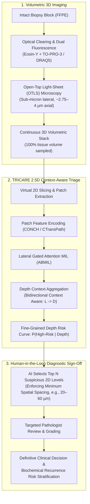
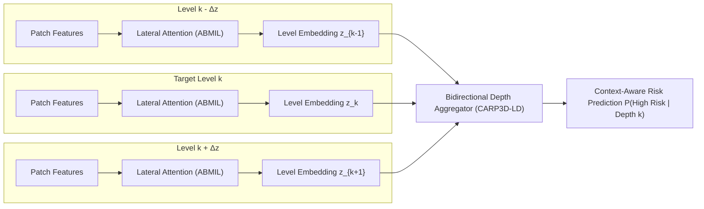

# TRICARE: Deep-learning triage of 3D pathology datasets

**Gao G, Yan R, Song AH, Hsieh H-C, Erion Barner LA, Wang F, Brenes D, Chow SSL, Wang R, Bishop KW, Liu Y, Farre X, Divatia M, Downes MR, Vakar-Lopez F, Lal P, Burke W, Madabhushi A, True LD, Reddi DM, Grady WM, Mahmood F, Liu JTC.** *Deep-learning triage of three-dimensional pathology datasets for comprehensive and efficient pathologist assessments.* Nature Biomedical Engineering (2026). Published: 12 August 2026. DOI: [10.1038/s41551-026-01760-1](https://doi.org/10.1038/s41551-026-01760-1).

- **Nature BME Article:** [doi.org/10.1038/s41551-026-01760-1](https://doi.org/10.1038/s41551-026-01760-1)
- **Code Repository:** [github.com/alecgao066/TRICARE](https://github.com/alecgao066/TRICARE)
- **TCIA Prostate 3D Dataset:** [TCIA: PCa_Bx_3Dpathology](https://www.cancerimagingarchive.net/collection/pca_bx_3dpathology/) (DOI: [10.7937/44MA-GX21](https://doi.org/10.7937/44MA-GX21))
- **Zenodo Archive:** [zenodo.20052262](https://doi.org/10.5281/zenodo.20052262) (DOI: [10.5281/zenodo.20052262](https://doi.org/10.5281/zenodo.20052262))

---

## Executive Summary

Standard slide-based 2D histopathology examines sparse 4–5 µm thin glass sections that represent **less than 1% of the entire biopsy volume**. Because focal high-grade cancer or dysplasia can easily be missed on standard cuts, patients face under-grading, delayed therapy, or repeat invasive biopsies.

While non-destructive **open-top light-sheet (OTLS) microscopy** can image 100% of an unsectioned biopsy at sub-micron resolution, a single core biopsy generates tens to hundreds of gigabytes of volumetric imagery spanning hundreds of virtual 2D levels—making exhaustive manual review infeasible.

**TRICARE** (*Triage of 3D Pathology Datasets*) is a **2.5D context-aware Multiple Instance Learning (MIL)** deep-learning framework. Rather than acting as an autonomous diagnostic "black box," TRICARE scans the entire 3D volume, integrates depth context across adjacent slices, and triages the specimen to present only the highest-risk 2D cross-sections to pathologists for definitive diagnosis.



---

## The 2D Undersampling Paradox in Pathology

| Metric / Dimension | Conventional 2D Histopathology | 3D Open-Top Light-Sheet (OTLS) Microscopy | AI-Triaged 3D Pathology (TRICARE) |
| :--- | :--- | :--- | :--- |
| **Tissue Sampling Ratio** | **< 1%** of biopsy volume (~4–5 µm thickness) | **100%** of biopsy volume (non-destructive) | **100% scanned**, top ~1–5% triaged for human review |
| **Physical Alteration** | Destructive physical sectioning; ribbon loss | Non-destructive; preserved for molecular assays | Non-destructive; intact specimen preserved |
| **Data Volume per Biopsy** | 1–3 WSIs (~1–3 GB) | 1,000s of virtual levels (~50–200 GB) | Full 3D scan analyzed by AI; 3–8 levels reviewed |
| **Pathologist Reading Load** | 3–16 physical slides | Infeasible for manual exhaustive search | **Identical or reduced** (e.g., 3 prostate / 8 esophagus levels) |
| **Diagnostic Sensitivity** | Misses focal aggressive patterns outside cut plane | Theoretical 100% capture if fully browsed | **Significantly upgraded capture** of aggressive patterns |

In prostate biopsies, **only 11.9% of specimens** had their true highest-risk level located within the standard 40 µm cutting window evaluated by 2D histology. In Barrett's esophagus biopsies, **only 13.3%** fell within the standard 80 µm window. Standard 2D histology is fundamentally constrained by spatial sampling bias.

---

## Methodological Architecture of TRICARE

### 1. Feature Extraction & Domain Adaptation
- **Volumetric Tiling:** Each virtual 2D depth level $z_k$ in the 3D stack is divided into non-overlapping patches (e.g., $256 \times 256$ or $512 \times 512$ pixels).
- **Foundation Model Encoders:** Patch embeddings $h_j \in \mathbb{R}^D$ are extracted using pathology vision-language foundation models (e.g., **CONCH** by Chen et al., *Nat Med* 2024; **CTransPath**; **PLIP**; or **ResNet50**).
- **Domain Adaptation:** A lightweight fully connected layer with ReLU non-linearity aligns OTLS pseudo-H&E embeddings with pretrained foundation model latent representations:
  $$\tilde{h}_j = \text{ReLU}(W_d h_j + b_d)$$

### 2. Lateral Gated Attention (Intra-Slice Aggregation)
Within each 2D slice $k$, patch features $\{\tilde{h}_{k,j}\}_{j=1}^{M_k}$ are aggregated into a level-level feature vector $z_k$ via gated attention:
$$a_{k,j} = \frac{\exp\left(w^T \left(\tanh(V \tilde{h}_{k,j}) \odot \text{sigmoid}(U \tilde{h}_{k,j})\right)\right)}{\sum_{m=1}^{M_k} \exp\left(w^T \left(\tanh(V \tilde{h}_{k,m}) \odot \text{sigmoid}(U \tilde{h}_{k,m})\right)\right)}$$
$$z_k = \sum_{j=1}^{M_k} a_{k,j} \tilde{h}_{k,j}$$

### 3. Bidirectional Depth Context Aggregation (Inter-Slice Modeling)
Glandular architecture and dysplastic changes are continuous 3D structures. Evaluating an isolated 2D slice misses the out-of-plane continuity of branching, fusion, or nuclear crowding. TRICARE aggregates lateral level features across a depth neighborhood $\pm \Delta z$ (e.g., aggregating 3–7 levels spaced by 10–20 µm):

- **Bidirectional Recurrent Context ($TRICARE_{L\to D}$):**
  $$\text{hid}_{k, +1} = \tanh\left(W_n z_k + W_h \text{hid}_{k+1, +1}\right)$$
  $$\text{hid}_{k, -1} = \tanh\left(W_n z_k + W_h \text{hid}_{k-1, -1}\right)$$
  $$\tilde{z}_k = \text{hid}_{k, +1} \oplus \text{hid}_{k, -1}$$
- **Risk Score Output:** A classification head maps $\tilde{z}_k$ to the predicted probability $P(\text{high-risk} \mid z_k)$.



### Aggregation Model Comparison

| Architecture | Lateral Aggregation | Depth Aggregation | AUC (Prostate) | AUC (Esophagus) |
| :--- | :--- | :--- | :--- | :--- |
| **2D Baseline (ABMIL)** | Gated Attention | None (Single Slice) | 0.871 | 0.895 |
| **$TRICARE_N$ (Naive)** | Depth-agnostic joint pooling across patches & levels | Gated Attention | 0.902 | 0.907 |
| **$TRICARE_{D\to L}$** | Depth context pooled per patch column first | Lateral Gated Attention | 0.918 | 0.912 |
| **$TRICARE_{L\to D}$ (Proposed)** | Lateral ABMIL within level | **Bidirectional Depth Context** | **0.939** ($P < 0.005$) | **0.921** ($P < 0.005$) |

---

## Clinical Validation & Key Findings

### 1. Prostate Cancer Risk Stratification
- **Objective:** Distinguish low-risk (benign / Gleason Grade Group 1) from higher-grade (Grade Group $\ge 2$) prostate carcinoma and predict biochemical recurrence.
- **Cohorts:**
  - *Development:* 112 core-needle biopsies from 54 radical prostatectomy patients at the University of Washington (UW), imaged on a 2nd-gen OTLS microscope.
  - *Independent Multi-Center Test:* 29 biopsies from 29 patients at the University of Pennsylvania (UPenn), imaged on a 4th-gen OTLS system with modified staining protocols.
- **Triage Performance:** AUC **0.939**, Balanced Accuracy **0.826**, $F_2$ score **0.882**.
- **Reader Study Impact:**
  - Pathologists reviewed 3 AI-triaged levels (minimum 60 µm spacing) vs 3 standard physical 2D levels (20 µm spacing).
  - In **18.6% of biopsies (11/59)**, aggressive fused/cribriform Pattern 4 glands were identified in the AI-triaged 3D levels that were completely absent from standard 2D histologic sections.
  - Clinical risk stratification for biochemical recurrence was significantly superior with AI-triaged 3D levels ($F_2$ and accuracy improved over 2D slides).

### 2. Barrett's Esophagus Neoplasia Screening
- **Objective:** Screen endoscopic mucosal biopsies / EMRs for subtle, patchy high-grade dysplasia (HGD) and intramucosal adenocarcinoma (EAC).
- **Cohorts:** Endoscopic biopsies from UWMC / Fred Hutchinson Cancer Center (development: 77 images from 30 specimens / 5 held-out test patients).
- **Triage Performance:** AUC **0.921**, Balanced Accuracy **0.833**, $F_2$ score **0.765**.
- **Reader Study Impact:**
  - Standard clinical protocol at UW requires reviewing **16 consecutive physical 2D sections**.
  - TRICARE selected **8 high-risk levels** (minimum 20 µm spacing).
  - Pathologists **upgraded 5 cases** to dysplasia/cancer (with **0 downgrades**) while **halving pathologist reading workload** (8 vs 16 slides).

---

## Open Science Resources & Dataset Architecture

### 1. TCIA Collection: `PCa_Bx_3Dpathology`
- **Identifier:** `PCa_Bx_3Dpathology` | DOI: [10.7937/44MA-GX21](https://doi.org/10.7937/44MA-GX21)
- **Scale:** 3.8 TB public repository containing:
  - 2× downsampled fused 3D OTLS volumes in H&E-analog pseudo-color.
  - Synthetic Cytokeratin-8 (CK8) immunofluorescence channels highlighting luminal glandular epithelial cells.
  - 3D semantic segmentation masks (ITAS3D) for gland lumen, epithelium, and stroma at 4× downsampling.
  - Complete clinical follow-up data (biochemical recurrence, time to recurrence, Gleason Grade Groups).

### 2. Zenodo Archive: `zenodo.20052262`
- **Identifier:** [DOI: 10.5281/zenodo.20052262](https://doi.org/10.5281/zenodo.20052262)
- **Artifacts:**
  - Precomputed patch feature embeddings (`.pt` tensors for CONCH and CTransPath encoders).
  - `prostate_development_cohort.csv` and `prostate_test_cohort.csv`.
  - `esophagus_development_cohort.csv` and `esophagus_test_cohort.csv`.
  - Split indices for leave-one-out and $K$-fold cross-validation.

### 3. GitHub Repository: `alecgao066/TRICARE`
- **Repository:** [github.com/alecgao066/TRICARE](https://github.com/alecgao066/TRICARE)
- **Key Modules:**
  - `create_splits_seq.py`: Generates patient-level stratified leave-one-out and $K$-fold data splits.
  - `main.py`: Training engine supporting `--model_type carp3d_ld`, `--agg_range`, `--agg_gap`, and `--adj_gap`.
  - `models/`: Implementations of 2D ABMIL, TransMIL, DTFD-MIL, and 2.5D CARP3D-LD architectures.

```bash
# Example TRICARE Training Command
python main.py \
    --drop_out \
    --lr 2e-4 \
    --k 8 \
    --leave_one_out \
    --agg_range 3 \
    --agg_gap 3 \
    --adj_gap 5 \
    --exp_code exp_prostate_range60gap60 \
    --weighted_sample \
    --max_epochs 50 \
    --bag_loss ce \
    --model_type carp3d_ld \
    --log_data \
    --data_root_dir test_data/
```

---

## Translational Significance for Pathology

1. **Pragmatic Clinical Pathway:** Autonomous AI in primary diagnosis faces formidable regulatory (FDA Class III), legal, and liability barriers. TRICARE instead operates as an **intelligent sampler/triage engine**, maintaining the board-certified pathologist as the ultimate diagnostic authority.
2. **Resolution of the 3D Microscopy Bottleneck:** Open-top light sheet and micro-CT technologies generate teravoxels of rich volumetric data that previously could not be translated into time-pressured pathology workflows. TRICARE solves this clinical mismatch.
3. **Foundation Model Integration:** Leverages pre-trained vision-language foundation models (CONCH, CTransPath) with lightweight domain adaptation, enabling high sample efficiency even in relatively modest 3D training cohorts.
4. **Broad Clinical Extensibility:** The 2.5D context-aware triage paradigm directly generalizes to other organ systems (e.g., surgical margin assessment in breast lumpectomies, colon cancer invasion depth, and kidney biopsies) as well as preclinical 3D organoid drug screens.
