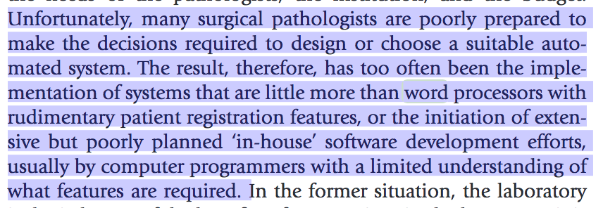

# Laboratory Information Systems

## Laboratory Information Systems

* LIS should warn pathologist if there is prior biopsy or cytology from the same patient is present.
* Dictation

[http://www.binasmedikal.com/urun/patoloji-icin-ses-kayit-cihazlari/](http://www.binasmedikal.com/urun/patoloji-icin-ses-kayit-cihazlari/)

[https://www.youtube.com/watch?v=FUDdnsuLUck](https://www.youtube.com/watch?v=FUDdnsuLUck)

* The Free Diagnostic Pathology Software Project

[http://www.filemaker.com/solutions/customers/stories/free-diagnostic-pathology-software-project.html](http://www.filemaker.com/solutions/customers/stories/free-diagnostic-pathology-software-project.html)

[https://freedp.wordpress.com/2013/12/28/index/](https://freedp.wordpress.com/2013/12/28/index/)

[https://www.youtube.com/watch?v=nvvhw7iy7RM](https://www.youtube.com/watch?v=nvvhw7iy7RM)

[http://www.diagnosticpathsolutions.com/free-d-path-pathology.html](http://www.diagnosticpathsolutions.com/free-d-path-pathology.html)

* TUMOR REPORTING SYSTEM

[http://www.essentialpathology.info/trs/](http://www.essentialpathology.info/trs/)

* Predictive Analytics to Support Real-Time Management in Pathology Facilities

[https://www.ncbi.nlm.nih.gov/pubmed/28269873](https://www.ncbi.nlm.nih.gov/pubmed/28269873)

* Word processors usually masquerading as information systems in surgical pathology. Warning from Rosai&Ackerman

* Are electronic medical records largely to blame for the growing crisis of physician burnout?

[https://qz.com/1061322/doctors-are-burning-out-because-electronic-medical-records-are-broken/](https://qz.com/1061322/doctors-are-burning-out-because-electronic-medical-records-are-broken/)

* Integrated Pathology Informatics Enables High-Quality Personalized and Precision Medicine Digital Pathology and Beyond

[https://doi.org/10.5858/arpa.2017-0139-OA](https://doi.org/10.5858/arpa.2017-0139-OA)

* * LIS should warn pathologist if there is prior biopsy or cytology from the same patient is present.
* Dictation

[http://www.binasmedikal.com/urun/patoloji-icin-ses-kayit-cihazlari/](http://www.binasmedikal.com/urun/patoloji-icin-ses-kayit-cihazlari/)

[https://www.youtube.com/watch?v=FUDdnsuLUck](https://www.youtube.com/watch?v=FUDdnsuLUck)

* The Free Diagnostic Pathology Software Project

[http://www.filemaker.com/solutions/customers/stories/free-diagnostic-pathology-software-project.html](http://www.filemaker.com/solutions/customers/stories/free-diagnostic-pathology-software-project.html)

[https://freedp.wordpress.com/2013/12/28/index/](https://freedp.wordpress.com/2013/12/28/index/)

[https://www.youtube.com/watch?v=nvvhw7iy7RM](https://www.youtube.com/watch?v=nvvhw7iy7RM)

[http://www.diagnosticpathsolutions.com/free-d-path-pathology.html](http://www.diagnosticpathsolutions.com/free-d-path-pathology.html)

* TUMOR REPORTING SYSTEM

[http://www.essentialpathology.info/trs/](http://www.essentialpathology.info/trs/)

* Predictive Analytics to Support Real-Time Management in Pathology Facilities

[https://www.ncbi.nlm.nih.gov/pubmed/28269873](https://www.ncbi.nlm.nih.gov/pubmed/28269873)

* Word processors usually masquerading as information systems in surgical pathology. Warning from Rosai&Ackerman

* Are electronic medical records largely to blame for the growing crisis of physician burnout?

[https://qz.com/1061322/doctors-are-burning-out-because-electronic-medical-records-are-broken/](https://qz.com/1061322/doctors-are-burning-out-because-electronic-medical-records-are-broken/)

* Integrated Pathology Informatics Enables High-Quality Personalized and Precision Medicine Digital Pathology and Beyond

[https://doi.org/10.5858/arpa.2017-0139-OA](https://doi.org/10.5858/arpa.2017-0139-OA)

* * LIS should warn pathologist if there is prior biopsy or cytology from the same patient is present.
* Dictation

[http://www.binasmedikal.com/urun/patoloji-icin-ses-kayit-cihazlari/](http://www.binasmedikal.com/urun/patoloji-icin-ses-kayit-cihazlari/)

[https://www.youtube.com/watch?v=FUDdnsuLUck](https://www.youtube.com/watch?v=FUDdnsuLUck)

* The Free Diagnostic Pathology Software Project

[http://www.filemaker.com/solutions/customers/stories/free-diagnostic-pathology-software-project.html](http://www.filemaker.com/solutions/customers/stories/free-diagnostic-pathology-software-project.html)

[https://freedp.wordpress.com/2013/12/28/index/](https://freedp.wordpress.com/2013/12/28/index/)

[https://www.youtube.com/watch?v=nvvhw7iy7RM](https://www.youtube.com/watch?v=nvvhw7iy7RM)

[http://www.diagnosticpathsolutions.com/free-d-path-pathology.html](http://www.diagnosticpathsolutions.com/free-d-path-pathology.html)

* TUMOR REPORTING SYSTEM

[http://www.essentialpathology.info/trs/](http://www.essentialpathology.info/trs/)

* Predictive Analytics to Support Real-Time Management in Pathology Facilities

[https://www.ncbi.nlm.nih.gov/pubmed/28269873](https://www.ncbi.nlm.nih.gov/pubmed/28269873)

* Word processors usually masquerading as information systems in surgical pathology. Warning from Rosai&Ackerman

* Are electronic medical records largely to blame for the growing crisis of physician burnout?

[https://qz.com/1061322/doctors-are-burning-out-because-electronic-medical-records-are-broken/](https://qz.com/1061322/doctors-are-burning-out-because-electronic-medical-records-are-broken/)

* Integrated Pathology Informatics Enables High-Quality Personalized and Precision Medicine Digital Pathology and Beyond

[https://doi.org/10.5858/arpa.2017-0139-OA](https://doi.org/10.5858/arpa.2017-0139-OA)

* * LIS should warn pathologist if there is prior biopsy or cytology from the same patient is present.
* Dictation

[http://www.binasmedikal.com/urun/patoloji-icin-ses-kayit-cihazlari/](http://www.binasmedikal.com/urun/patoloji-icin-ses-kayit-cihazlari/)

[https://www.youtube.com/watch?v=FUDdnsuLUck](https://www.youtube.com/watch?v=FUDdnsuLUck)

* The Free Diagnostic Pathology Software Project

[http://www.filemaker.com/solutions/customers/stories/free-diagnostic-pathology-software-project.html](http://www.filemaker.com/solutions/customers/stories/free-diagnostic-pathology-software-project.html)

[https://freedp.wordpress.com/2013/12/28/index/](https://freedp.wordpress.com/2013/12/28/index/)

[https://www.youtube.com/watch?v=nvvhw7iy7RM](https://www.youtube.com/watch?v=nvvhw7iy7RM)

[http://www.diagnosticpathsolutions.com/free-d-path-pathology.html](http://www.diagnosticpathsolutions.com/free-d-path-pathology.html)

* TUMOR REPORTING SYSTEM

[http://www.essentialpathology.info/trs/](http://www.essentialpathology.info/trs/)

* Predictive Analytics to Support Real-Time Management in Pathology Facilities

[https://www.ncbi.nlm.nih.gov/pubmed/28269873](https://www.ncbi.nlm.nih.gov/pubmed/28269873)

* Word processors usually masquerading as information systems in surgical pathology. Warning from Rosai&Ackerman

* Are electronic medical records largely to blame for the growing crisis of physician burnout?

[https://qz.com/1061322/doctors-are-burning-out-because-electronic-medical-records-are-broken/](https://qz.com/1061322/doctors-are-burning-out-because-electronic-medical-records-are-broken/)

* Integrated Pathology Informatics Enables High-Quality Personalized and Precision Medicine Digital Pathology and Beyond

[https://doi.org/10.5858/arpa.2017-0139-OA](https://doi.org/10.5858/arpa.2017-0139-OA)

* 
## Laboratory Information Systems

* LIS should warn pathologist if there is prior biopsy or cytology from the same patient is present.
* Dictation

[http://www.binasmedikal.com/urun/patoloji-icin-ses-kayit-cihazlari/](http://www.binasmedikal.com/urun/patoloji-icin-ses-kayit-cihazlari/)

[https://www.youtube.com/watch?v=FUDdnsuLUck](https://www.youtube.com/watch?v=FUDdnsuLUck)

* The Free Diagnostic Pathology Software Project

[http://www.filemaker.com/solutions/customers/stories/free-diagnostic-pathology-software-project.html](http://www.filemaker.com/solutions/customers/stories/free-diagnostic-pathology-software-project.html)

[https://freedp.wordpress.com/2013/12/28/index/](https://freedp.wordpress.com/2013/12/28/index/)

[https://www.youtube.com/watch?v=nvvhw7iy7RM](https://www.youtube.com/watch?v=nvvhw7iy7RM)

[http://www.diagnosticpathsolutions.com/free-d-path-pathology.html](http://www.diagnosticpathsolutions.com/free-d-path-pathology.html)

* TUMOR REPORTING SYSTEM

[http://www.essentialpathology.info/trs/](http://www.essentialpathology.info/trs/)

* Predictive Analytics to Support Real-Time Management in Pathology Facilities

[https://www.ncbi.nlm.nih.gov/pubmed/28269873](https://www.ncbi.nlm.nih.gov/pubmed/28269873)

* Word processors usually masquerading as information systems in surgical pathology. Warning from Rosai&Ackerman

* Are electronic medical records largely to blame for the growing crisis of physician burnout?

[https://qz.com/1061322/doctors-are-burning-out-because-electronic-medical-records-are-broken/](https://qz.com/1061322/doctors-are-burning-out-because-electronic-medical-records-are-broken/)

* Integrated Pathology Informatics Enables High-Quality Personalized and Precision Medicine Digital Pathology and Beyond

[https://doi.org/10.5858/arpa.2017-0139-OA](https://doi.org/10.5858/arpa.2017-0139-OA)

## Laboratory Management

During pathology residency we are not having enough education for laboratory management. Consequences of this appears when one first faces with a problem in the daily routine process.

