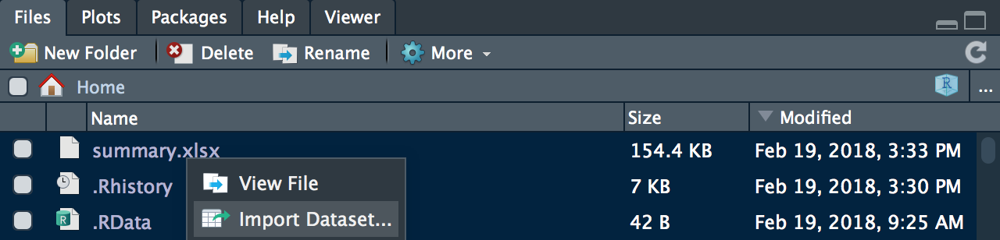
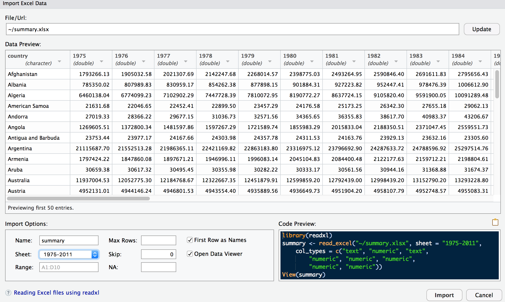

# R-project veri yüklemek neden zor?

R-project veri yüklemek neden zor?

Tüm dünya [R](https://www.r-project.org/) ile istatistik analizine ilerleyedursun, biz hala [SPSS](https://en.0wikipedia.org/wiki/SPSS) adı altında kurslar düzenleme derdindeyiz. [Jamovi](https://www.jamovi.org/) gibi grafik arayüzleri varken hem de. Peki neden? Haklı tarafı yok mu?

R savunucuları, bu durumla dalga geçedursun, aslında hala daha SPSS'in kullanılmasının önemli bir nedeni var: veri yüklemek

R'a veri yüklemek neden bu kadar zor. Çoğu data üstadının burun kıvırdığı excel hala daha en çok kullanılan veri giriş modeli. Bir spreadsheet herkesin anlayabileceği kolaylıkta.

Neden hala R'a excel yüklemek bu kadar sorun? En fonksiyonel bulduğum `xlsx`paketini eklemek için java yüklemek gerekiyor. SPSS için`foreign`paketleri,`haven`paketleri ortada geziyor. Hele bir de`.csv`dosyaları var ki, eğer Türkçe excel kullanıyorsanız`;`ile`,`arasındaki fark herhalde bu kadar anlamlı olmamıştır. Sayılara verdiğiniz`.`ya da`,`ile ondalıklar da epey sıkıntıya neden oluyor.

Jamovi de sadre şifa değil, o da henüz .sav dosyalarını okuyamıyor \(Onun için önce JASP ile açıp sonra Jamovi ile bu [JASP](https://jasp-stats.org/) dosyasını açmak lazım\). Eğer`.csv`dosyanızda sorun varsa veriniz de düzgün yüklenemiyor.

SPSS'in bu kadar yaygın olmasının nedeni belki de sadece bu konuda kullanıcı dostu olmaya devam etmesi.

Ortada yığınla R kursu var, ama hepsi afaki şeylerden bahsediyor. Neymiş efendim atomik vektör tipiymiş, zorlama ile türler nasıl değişirmiş, S dili çok önemliymiş,`lattice`mi kullaılacakmış,`ggplot`mu? Adama bir ağız tadı ile veri yükletip frekans tablosu aldıramadıktan sonra R çok iyi bir programmış kime ne?

Bu arada R'a veri yüklemenin -ve tabii bunu data.frame olarak yapmanın- en kolay yolu [RStudio](https://www.rstudio.com/) ile. Dökümana sağ tıklayıp import dataset dedikten sonrası oldukça anlaşılır:

