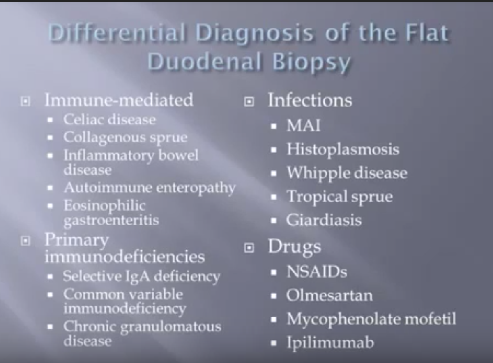

# Duodenal Biopsy

* Thunderstorm-triggered asthma attacks put under the microscope in Australia

[https://www.youtube.com/watch?v=8U5qL4-Kf7w](https://www.youtube.com/watch?v=8U5qL4-Kf7w)

* Thunderstorm-triggered asthma attacks put under the microscope in Australia

[https://www.youtube.com/watch?v=8U5qL4-Kf7w](https://www.youtube.com/watch?v=8U5qL4-Kf7w)

* Thunderstorm-triggered asthma attacks put under the microscope in Australia

[https://www.youtube.com/watch?v=8U5qL4-Kf7w](https://www.youtube.com/watch?v=8U5qL4-Kf7w)

* Thunderstorm-triggered asthma attacks put under the microscope in Australia

[https://www.youtube.com/watch?v=8U5qL4-Kf7w](https://www.youtube.com/watch?v=8U5qL4-Kf7w)

* Bugs, sprue, drugs and more: adventures in the small intestine

[https://www.youtube.com/watch?v=oZNH8z9-\_fU](https://www.youtube.com/watch?v=oZNH8z9-_fU)

Differential Diagnosis of the Flat Duodenal Biopsy

* # A gut bacterial pathway metabolizes aromatic amino acids into nine circulating metabolites.

[https://www.ncbi.nlm.nih.gov/pubmed/29168502/](https://www.ncbi.nlm.nih.gov/pubmed/29168502/)

* Bugs, sprue, drugs and more: adventures in the small intestine

[https://www.youtube.com/watch?v=oZNH8z9-\_fU](https://www.youtube.com/watch?v=oZNH8z9-_fU)

Differential Diagnosis of the Flat Duodenal Biopsy

* # A gut bacterial pathway metabolizes aromatic amino acids into nine circulating metabolites.

[https://www.ncbi.nlm.nih.gov/pubmed/29168502/](https://www.ncbi.nlm.nih.gov/pubmed/29168502/)

# GIPath Tweets

This is the list of Gastrointestinal Pathology \(GIPath\) Tweets collected automatically via `R`.

[GIPathTweets2019-07-08.md](https://github.com/sbalci/ParaPathology/tree/7b853c5e0793aa3f04000d8577340e5623b2678c/systemic-pathology/gastrointestinal-pathology/pathTweets/GIPathTweets2019-07-08.md)

# Gastrointestinal Pathology

* Bugs, sprue, drugs and more: adventures in the small intestine

[https://www.youtube.com/watch?v=oZNH8z9-\_fU](https://www.youtube.com/watch?v=oZNH8z9-_fU)

Differential Diagnosis of the Flat Duodenal Biopsy

* **A gut bacterial pathway metabolizes aromatic amino acids into nine circulating metabolites.**

[https://www.ncbi.nlm.nih.gov/pubmed/29168502/](https://www.ncbi.nlm.nih.gov/pubmed/29168502/)

