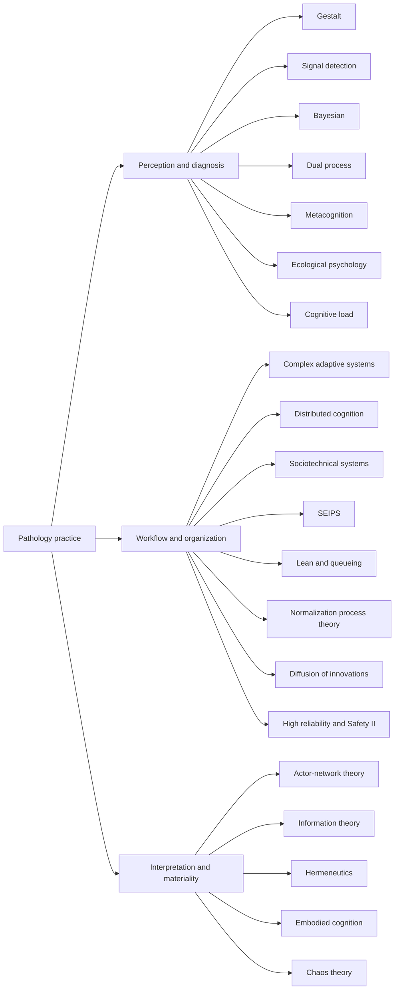
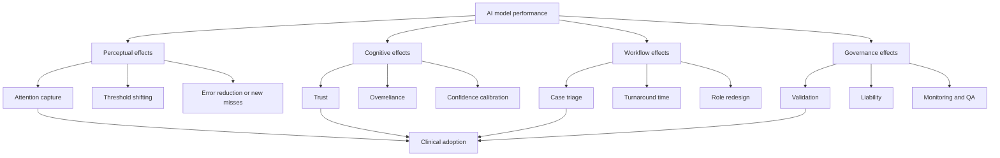

# Theories and Frameworks for Understanding Pathology Practice

## Executive summary

Pathology practice is best understood as a **layered activity** rather than a single cognitive act. At the **micro level**, pathologists rely on perceptual and inferential frameworks such as Gestalt pattern recognition, signal detection, Bayesian updating, dual-process reasoning, and metacognitive calibration to move from tissue appearance to a reportable diagnosis. At the **meso and macro levels**, diagnosis is embedded in workflows, laboratory infrastructure, second-opinion practices, information systems, quality regimes, and legal accountability, which are better captured by distributed cognition, sociotechnical systems, SEIPS-style human factors engineering, Lean/queueing models, implementation theory, and high-reliability/safety frameworks. Digital pathology and AI do not replace these layers; they redistribute them. citeturn31search1turn33search10turn29view2turn27search16turn16search1turn29view1turn17search6

The **strongest pathology-specific empirical support** in the literature sits around four domains: visual search and expert pattern recognition; observer variability, confidence, and calibration; digital pathology implementation and workflow redesign; and laboratory operations/process improvement. The evidence base is notably thinner for chaos theory, actor-network theory, hermeneutics, and embodied cognition as *formal* explanatory models of routine pathology practice, although they remain useful conceptual lenses. citeturn31search1turn33search10turn31search10turn31search0turn11search9turn29view4turn16search1turn16search5turn28view5turn41search0turn18search0turn15search3turn4search4

A key analytical finding from the recent literature is that **AI adoption in pathology is constrained less by benchmark accuracy alone than by workflow fit, trust, validation, role redesign, training, and governance**. A 2024 meta-analysis found high pooled diagnostic performance for AI in digital pathology, but also found that 99% of included studies had at least one area of high or unclear risk of bias or applicability concern. Qualitative and realist-implementation studies in pathology repeatedly reach the same conclusion: pathologists must be able to make sense of the tool, trust it, adapt work around it, and understand how responsibility is allocated if the tool is to become routine. citeturn32view0turn11search9turn29view1turn32view4turn35search1turn5search2

The practical implication is that pathology AI should be evaluated as a **human-AI work-system intervention**, not just as a classifier. That means measuring not only AUROC, sensitivity, or concordance, but also timing of cue presentation, effect on attention, second-opinion behavior, turnaround time, workload, safety monitoring, and the local organizational conditions under which the model is deployed. citeturn31search1turn29view2turn17search0turn29view1turn16search5turn21search16turn23search2

## Search strategy and evidence base

This report prioritized **peer-reviewed pathology literature, official guidance, and open-access primary or review sources**, with emphasis on anatomic pathology, digital pathology, cytology where relevant, and adjacent diagnostic-reasoning literature when direct pathology-specific work was sparse. The most informative recent sources were systematic reviews and meta-analyses, CAP and professional-society guidelines, implementation studies, qualitative interview and ethnographic studies, observer-performance papers, and workflow/operations studies. citeturn32view0turn30search0turn5search1turn17search0turn11search9turn41search0turn33search10turn16search1

The clearest lesson from the implementation literature is that pathology has used **relatively few explicit theoretical frameworks** compared with broader digital health. Betmouni’s 2021 implementation essay found that only a small fraction of digital pathology publications focused on implementation and that only a tiny subset explicitly reported a theoretical planning framework. That gap helps explain why many pathology papers are operationally useful but theoretically thin. citeturn28view4

Suggested databases for a replicable search are **PubMed**, **Scopus**, **Web of Science**, and **Google Scholar**. For PubMed specifically, the official guide supports Boolean operators, phrase searching, truncation, field tags, date filters, and proximity searching; that is useful when moving from broad “digital pathology” retrieval to theory-specific terms such as “dual process,” “signal detection,” or “normalization process theory.” citeturn6search15turn4search0

Suggested search strings:

```text
("pathology" OR histopathology OR cytopathology OR dermatopathology)
AND
("diagnostic reasoning" OR "pattern recognition" OR gestalt OR "signal detection" OR Bayesian OR "dual process" OR metacognition)

("digital pathology" OR "whole slide imaging" OR telepathology)
AND
(AI OR "artificial intelligence" OR "machine learning")
AND
(workflow OR trust OR implementation OR sociotechnical OR SEIPS OR "normalization process theory" OR "diffusion of innovation" OR "high reliability")

(pathology OR histopathology)
AND
("eye tracking" OR "visual search" OR "observer performance" OR ROC OR concordance OR confidence)

(pathology laboratory OR histopathology laboratory)
AND
(Lean OR queueing OR simulation OR "turnaround time" OR bottleneck OR workflow)

(pathology)
AND
(ethnography OR qualitative OR hermeneutics OR "actor-network theory" OR sociomaterial OR "distributed cognition")
```

A useful way to organize the literature is to sort theories by the part of pathology practice they explain best:



That clustering is consistent with the way recent pathology research has evolved: from observer-performance and image-analysis studies, to digital workflow implementation, and more recently to ethnography, implementation science, and governance. citeturn31search1turn33search10turn14search0turn29view2turn11search9turn29view1turn41search0turn35search1

## Comparative map of theories

The support ratings below are **synthetic judgments** based on the pathology-specific literature identified in this search. “Strong” means there is a substantial pathology-specific empirical base; “moderate” means there is a meaningful but still partial body of direct evidence or strong adjacent evidence; “weak” means the framework is mainly conceptual, metaphorical, or only lightly instantiated in pathology studies.

| Theory | Scale | Primary agents | Empirical support | Relevance to AI integration | Typical methods | Representative citations |
|---|---|---|---|---|---|---|
| Gestalt pattern recognition | Micro | Individual pathologist | Strong | High | Eye tracking, observer studies, rapid-exposure tasks, concordance | Brunyé et al. 2017; Lopes et al. 2024; Brunyé et al. 2021. citeturn31search1turn33search10turn3search8 |
| Signal detection theory | Micro | Individual observer and threshold-setting system | Moderate | High | ROC/AUC, confidence ratings, multi-reader performance | Swets 1988; Burgess 2011; Krupinski et al. 2012. citeturn38search6turn38search0turn38search16 |
| Bayesian reasoning | Micro | Individual pathologist, report category, ancillary test pathway | Moderate | High | Probabilistic reporting, likelihood-based interpretation, decision support | Eltoum et al. 2006; MacIntosh et al. 2008; Westfall et al. 2010. citeturn40search0turn39search5turn39search4 |
| Dual-process reasoning | Micro | Individual pathologist | Moderate | High | Error analysis, confidence studies, cognitive reviews | Norman 2010, 2017, 2024; Parsons et al. 2025. citeturn42search3turn42search2turn42search0turn24search13 |
| Metacognition and calibration | Micro | Individual pathologist plus peer-review system | Moderate | High | Confidence-accuracy studies, second-opinion behavior, calibration analysis | Clayton et al. 2023; Beebe et al. 2024; Kerr et al. 2026. citeturn31search0turn42search4turn9search18 |
| Ecological psychology | Micro to meso | Pathologist interacting with display and task environment | Moderate | High | Visual search, interface studies, navigation studies | Torre et al. 2020; Brunyé et al. 2021; Gu et al. 2023. citeturn24search5turn3search8turn19search10 |
| Cognitive load theory | Micro to meso | Individual pathologist in task environment | Moderate | High | Workload surveys, usability, time-motion, pupil/eye measures | Khatab et al. 2024; Mateos et al. 2016; Brunyé et al. 2025. citeturn20search0turn15search3turn9search16 |
| Complex adaptive systems | Meso to macro | Laboratory, department, institution | Moderate | High | Qualitative case studies, implementation analyses | Betmouni 2021; Drogt et al. 2022; Cheng et al. 2021. citeturn28view4turn11search9turn32view4 |
| Distributed cognition | Meso | Team plus artifacts | Moderate | High | Ethnography, workflow observation, collaboration studies | AHRQ DCog overview; Kiran et al. 2023; Geisler et al. 2025. citeturn10search19turn18search3turn41search0 |
| Sociotechnical systems | Meso to macro | People, tools, tasks, organization | Moderate to strong | High | Mixed methods, qualitative interviews, implementation studies | Hanna et al. 2022; Drogt et al. 2022; ESP 2025. citeturn29view2turn11search9turn35search1 |
| SEIPS and human factors engineering | Meso to macro | Work system | Moderate | High | Process mapping, observation, systems analysis, incident review | Carayon et al. 2022; Dowers & Jurewicz 2023; Yen et al. 2026. citeturn27search16turn27search8turn23search12 |
| Queueing, simulation, and Lean | Meso | Laboratory process, staffing, specimen flow | Strong | High | TAT metrics, simulation, A3, kaizen, error-frequency studies | Raab et al. 2008; Smith et al. 2012; Leeftink et al. 2016; McClintock et al. 2012. citeturn16search1turn16search5turn21search16turn21search15 |
| Normalization process theory | Meso | Staff adoption process | Moderate | High | NoMAD surveys, interviews, process evaluation | Mikkelsen et al. 2022; King et al. 2023; digital dermatopathology transition study 2025. citeturn22search1turn29view1turn22search4 |
| Diffusion of innovations | Meso to macro | Professional community and adopter network | Moderate | Medium to high | Adoption surveys, case studies, implementation narratives | Mairinger 2000; Williams et al. 2017; Betmouni 2021. citeturn22search15turn22search2turn28view4 |
| High reliability and Safety II | Macro | Organization and safety culture | Moderate | High | QA metrics, incident review, resilience-oriented safety studies | Zarbo et al. 2018; Banks et al. 2017; Choi et al. 2024. citeturn17search6turn17search2turn23search2 |
| Actor-network theory | Meso to macro | Human and non-human actors | Weak | Medium | Ethnography, document analysis, sociology of technology | Kusta et al. 2024; Geisler et al. 2025. citeturn28view5turn41search0 |
| Information theory | Micro to meso | Image, signal, storage, model | Moderate | High | Compression studies, entropy, feature extraction, QC metrics | Madabhushi & Lee 2016; Krupinski et al. 2012; Song et al. 2023. citeturn14search0turn38search16turn13search0 |
| Hermeneutics | Micro to meso | Interpreter, report, clinical context | Weak to moderate | Medium | Conceptual analysis, textual interpretation, narrative guides | Chetty 2017; Rashid et al. 2022; Crawford 2007. citeturn18search0turn18search1turn18search9 |
| Embodied cognition | Micro to meso | Pathologist-body-interface system | Weak to moderate | Medium | Ergonomic device studies, interface testing, HCI | Torre et al. 2020; Mateos et al. 2016; Alcaraz-Mateos et al. 2020. citeturn24search5turn15search3turn19search0 |
| Chaos theory | Macro and conceptual | System dynamics, instability, emergence | Weak | Low to medium | Conceptual essays, disease-complexity analogies | McLendon 2011; Heng et al. 2022, 2024. citeturn4search4turn4search1turn4search7 |

## Theory-by-theory synthesis

**Perceptual and cognitive theories**

| Theory | Concise definition and why it maps to pathology | Key empirical or seminal papers and recent reviews | Typical pathology applications and methods | Limitations and implications for AI adoption |
|---|---|---|---|---|
| Gestalt pattern recognition | Diagnosis often begins with a **whole-pattern impression** of tissue architecture, not a serial checklist of features. This maps closely onto the low-power “gist” scan, targeted zooming, and architectural recognition that experts report in routine practice. | **Seminal/empirical:** Kundel & Nodine, *Radiology* 1975; Brunyé et al., “Accuracy is in the eyes of the pathologist,” *J Biomed Inform* 2017. **Recent review:** Lopes et al., *J Pathol Inform* 2024. citeturn38search2turn31search1turn33search10 | Used in diagnosis, education, and digital slide-reading research. Methods include eye tracking, ROI fixation analysis, time-to-first-fixation, and rapid-exposure melanoma studies. Brunyé’s melanoma work showed that pathologists can extract diagnostically useful information from very brief WSI exposure. citeturn31search1turn3search8turn33search10 | Powerful but vulnerable to premature pattern completion and context bias. For AI, this argues for tools that **preserve overview and multiscale navigation** rather than forcing patchwise tunnel vision. Cues should support expert overview, not replace it. citeturn31search1turn19search10 |
| Signal detection theory | Separates **discriminability** from **decision threshold**. In pathology this maps to the distinction between “can I see malignancy?” and “at what confidence threshold do I call it atypia, suspicious, or malignant?” | **Seminal:** Swets, *Science* 1988; Burgess, *Acad Radiol* 2011. **Pathology studies:** Krupinski et al., WSI compression observer performance, 2012; Bejnordi et al., CAMELYON diagnostic confidence, 2017. citeturn38search6turn38search0turn38search16turn31search14 | Most useful for digital pathology validation, threshold setting, biomarker cutoffs, and compression/image-quality studies. Methods include ROC/AUC, confidence-scaled reads, MRMC designs, and false-positive/false-negative decomposition. citeturn38search16turn31search14 | Binary signal/noise simplifications can understate the graded uncertainty of real pathology categories. For AI, SDT suggests local threshold tuning, explicit uncertainty, and harm-aware optimization rather than a single “maximum accuracy” threshold. citeturn32view0turn31search14 |
| Bayesian reasoning | Combines prior probability with new morphologic or ancillary evidence. In pathology, this maps to integrating morphology with site, age, clinical history, immunostains, molecular tests, and category-specific risk of malignancy. | **Pathology practice papers:** Wang et al., probabilistic breast FNA, 1998; Eltoum et al., probabilistic EUS-FNA reporting, 2006; MacIntosh et al., male breast FNA, 2008; Westfall et al., Bayesian IHC use, 2010. **Recent proximate review:** Marchevsky, evidence-based pathology, 2017. citeturn40search10turn40search0turn39search5turn39search4turn39search7 | Especially relevant in cytology, gray-zone categories, and ancillary-test planning. Methods include probabilistic reporting schemas, risk-of-malignancy categories, likelihood-based interpretation, and decision support. citeturn40search0turn40search6turn40search12 | Much of pathology uses Bayesian reasoning **implicitly**, not formally. Priors can be wrong, undocumented, or socially inherited. For AI, Bayesian framing supports probabilistic outputs, prevalence-aware calibration, and more transparent management of uncertain cases. citeturn39search4turn29view1 |
| Dual-process reasoning | Pathologists often move between rapid, experience-based intuition and slower, analytic checking. This has obvious face validity in pathology, but recent critiques argue that the contrast is often overstated and may reflect different *knowledge structures* rather than distinct processors. | **Seminal and review:** Norman, *Med Educ* 2010; Norman et al., *Adv Health Sci Educ* 2017; Norman 2024 critique; Parsons et al. 2025 situativity review. **Pathology-adjacent studies:** Brunyé 2017; Elmore 2017. citeturn42search3turn42search2turn42search0turn24search13turn31search1turn31search10 | Used to understand diagnostic error, anchoring, “first impression then confirm,” and the role of ancillary studies in difficult cases. Methods include bias studies, case-vignette experiments, confidence recording, and observer-accuracy analysis. citeturn9search8turn31search10turn31search1 | The biggest criticism is oversimplification: pathology may be better seen as a flexible, context-sensitive mixture of exemplars, scripts, and analytic checks. For AI, the key question is **when** AI enters the process; immediate prompts can bias early perception, while delayed or toggleable support may preserve independent judgment. citeturn24search25turn9search16 |
| Metacognition and calibration | Focuses on whether pathologists know when they are likely to be right or wrong, when to seek help, and how confidence relates to actual accuracy. In practice this underlies second opinions, uncertainty statements, and escalation to ancillary testing. | **Key papers:** Clayton et al., “Are Pathologists Self-Aware of Their Diagnostic Accuracy?” 2023; Beebe et al., metacognitive diagnostic reasoning model, 2024; Kerr et al., prior diagnosis effects on second opinions, 2026. citeturn31search0turn42search4turn9search18 | Methods include confidence-accuracy associations, calibration curves, independent second-opinion designs, and studies of how prior diagnoses bias later reads. Applications include melanoma review, difficult dermatopathology, and QA. citeturn31search0turn9search18 | Confidence is not the same as accuracy, and social/contextual pressures can distort both. For AI, this supports interfaces that expose **model uncertainty**, encourage checking in low-confidence/high-risk cases, and make it easier to seek second opinions rather than quietly over-rely on the algorithm. citeturn31search0turn29view1 |
| Ecological psychology | Treats cognition as a **perception-action loop** in a real environment. In pathology, the “environment” is not abstract: it includes the monitor, viewer, zoom/pan affordances, scan quality, LIS integration, and the physical/temporal setting of reporting. | **Conceptual review:** Torre et al. 2020 on ecological and distributed views of clinical reasoning. **Pathology examples:** Brunyé et al. 2021 rapid melanoma; Gu et al. 2023 NaviPath navigation system. citeturn24search5turn3search8turn19search10 | Best applied to digital pathology navigation, attention guidance, and interface design. Methods include HCI studies, navigation analysis, eye tracking, and interactive tool evaluation. NaviPath reported faster coverage and improved precision/recall relative to manual navigation in its evaluation. citeturn19search10turn31search1 | Direct pathology-specific theory papers remain few. For AI, the practical lesson is to build **good affordances**: the viewer, not just the model, changes diagnostic behavior. Poorly timed prompts can become environmental distractions rather than perceptual aids. citeturn19search10turn9search16 |
| Cognitive load theory | Diagnostic work competes for limited attentional and working-memory resources. Gigapixel navigation, multiple stains, interruptions, EHR review, and administrative pressure all add load. | **Recent review:** Khatab et al., pathologist workload, burnout, and wellness, 2024. **Pathology ergonomics/HCI:** Mateos et al. 2016; Brunyé et al. 2025 on diagnostic HCI and AI; navigation-system studies. citeturn20search0turn15search3turn9search16turn19search10 | Methods include survey-based burnout/workload studies, usability testing, ergonomic comparisons of devices, timing metrics, and some eye-tracking indicators. Applications include digital transition, workstation design, and sign-out burden. citeturn20search0turn15search3 | Load is often inferred rather than directly measured, and not all added information is harmful. For AI, the goal should be **load shaping**, not just information addition: triage, summarize, and suppress unhelpful alerts. citeturn9search16turn19search10 |

**Work-system and implementation theories**

| Theory | Concise definition and why it maps to pathology | Key empirical or seminal papers and recent reviews | Typical pathology applications and methods | Limitations and implications for AI adoption |
|---|---|---|---|---|
| Complex adaptive systems | Views organizations as interacting agents whose routines stabilize over time. This maps well to pathology departments where slides, staff, LIS, turnaround targets, peer review, and clinician expectations co-evolve. | Pathology-specific work is mostly indirect: Betmouni 2021 on implementation learning; Drogt et al. 2022 on AI integration; Cheng et al. 2021 on deployment requirements; Zhang et al. 2024 routine implementation review. citeturn28view4turn11search9turn32view4turn35search0 | Useful for understanding why “good AI” fails when it perturbs established reporting routines, staffing, or accountability. Methods are mostly qualitative interviews, review essays, and implementation analyses. citeturn11search9turn29view2 | CAS language can become metaphorical if not operationalized. Still, it is a strong lens for AI adoption because it foregrounds co-evolution: infrastructure, roles, validation, and habits must all change together. citeturn32view4turn35search1 |
| Distributed cognition | Cognition is spread across people, tools, documents, images, and time. Pathology clearly fits this: diagnosis is rarely just “one brain plus one slide.” | **General healthcare definition:** AHRQ distributed cognition overview. **Pathology examples:** Kiran et al. 2023 digital pathology review; Barisoni et al. 2020 computational nephropathology; Geisler et al. 2025 ethnography. citeturn10search19turn18search3turn10search21turn41search0 | Excellent for tumor boards, consultation, digital archives, slide scanning, LIS-mediated worklists, and asynchronous peer input. Methods include ethnography, artifact analysis, workflow observation, and qualitative interviews. citeturn41search0turn29view4 | It explains coordination well but predicts less about individual bias. For AI, the implication is that evaluation must include **handoffs and shared activity**, not just solo pathologist-AI accuracy. citeturn10search19turn29view1 |
| Sociotechnical systems | Performance emerges from interactions among users, tasks, technologies, organizations, and policy contexts. This is one of the best direct fits for digital pathology and AI implementation. | Hanna et al. 2022; Drogt et al. 2022; Betmouni 2021; ESP 2025 expert opinion. These repeatedly stress coordinated enterprise integration, stakeholder alignment, and workflow redesign. citeturn29view2turn11search9turn28view4turn35search1 | Used for digital pathology rollouts, AI readiness, scanner/LIS integration, remote sign-out, training, and governance. Methods include mixed methods, interviews, implementation case studies, and organizational reviews. citeturn29view2turn11search9turn29view4 | Sometimes too descriptive unless paired with measurable implementation outcomes. For AI, it is indispensable: a classifier with high accuracy can still fail if it disrupts interfaces, staffing, handoffs, reimbursement, or quality assurance. citeturn32view4turn29view1 |
| SEIPS and human factors engineering | SEIPS models healthcare as a work system of persons, tasks, tools/technology, organization, environment, and external context. It is a formalized sociotechnical framework that is highly suitable for pathology but still underused there. | Carayon et al. 2022 PSNet overview; Dowers & Jurewicz 2023 used a systems engineering approach to study cytology process errors involving a cancer clinic, diagnostic lab, and pathology lab; Yen et al. 2026 reviewed diagnostic error through SEIPS. citeturn27search16turn27search8turn23search12 | Applications include process mapping of specimen ordering, accessioning, testing, reporting, and failure points. Methods include observation, interviews, process analysis, and work-system decomposition. citeturn27search8turn27search16 | Pathology-specific AI studies using SEIPS remain sparse. For AI adoption, this is a major research opportunity because SEIPS can tie model behavior to **where in the work system** gains and hazards actually appear. citeturn23search12turn32view4 |
| Queueing, simulation, and Lean | These approaches analyze flow, bottlenecks, delay, waste, and capacity. They map strongly to specimen accessioning, grossing, embedding, sectioning, scanning, sign-out, and turnaround time. | Raab et al. 2008 found Lean implementation improved efficiency and quality in histopathology. Smith et al. 2012 found lower near-miss proportions after Lean-based redesign. Leeftink et al. 2016 and McClintock et al. 2012 modeled workflow and TAT. citeturn16search1turn16search5turn21search16turn21search15 | Very strong fit for routine lab operations and digital transition logistics. Methods include TAT metrics, event logs, simulation, A3 root-cause analysis, kaizen, and before-after quality studies. citeturn16search5turn16search10turn21search16 | Weakest where interpretation itself, rather than flow, is the bottleneck. For AI, these frameworks are most useful when AI is used to relieve **specific bottlenecks** such as triage, quality checks, or quantification, rather than as an abstract “diagnostic revolution.” citeturn21search16turn35search0 |
| Normalization process theory | NPT explains how new practices become routine through sense-making, participation, collective action, and ongoing evaluation. Few theories map the *actual* adoption problem in pathology as directly. | Mikkelsen et al. 2022 explicitly used NoMAD/NPT before digital pathology implementation. King et al. 2023 used realist theory review and highlighted making sense, engagement, support, and perceived benefit. Staff-transition studies in 2024–2025 point in the same direction. citeturn29view0turn29view1turn29view4turn22search4 | Methods include NoMAD surveys, interviews, and process evaluation before and during implementation. Applications include pre-implementation readiness, staff expectations, and sustaining digital reporting. citeturn29view0turn29view4 | NPT does not evaluate model accuracy; it evaluates routinization. For AI, that is a strength: a model will not normalize unless pathologists can explain what it does, why it helps, and how its use fits daily work. citeturn29view1turn11search9 |
| Diffusion of innovations | Explains how technologies spread through professional networks via perceived relative advantage, compatibility, complexity, trialability, and observability. Historically very relevant to telepathology and digital pathology. | Telepathology adoption papers explicitly discussed diffusion and acceptance; Williams et al. 2017 made the case for clinical adoption; Betmouni 2021 highlighted how scaling beyond early adopters remains difficult. citeturn22search15turn22search2turn28view4 | Useful for understanding early-adopter behavior, regional/national rollout, and why successful pilot centers do not automatically produce broad uptake. Methods are surveys, literature reviews, business-case and adoption narratives. citeturn22search2turn28view4 | Classical diffusion models can be too linear and optimistic. For AI, the chief lesson is that **compatibility with pathology culture** matters as much as technical advantage. Observability through validation and trusted case examples is especially important. citeturn28view4turn30search6 |
| High reliability and Safety II | Focuses on resilience, near-miss learning, sensitivity to operations, and maintaining safe performance under complexity. This is a natural fit for pathology QA and patient safety. | Zarbo’s “Fifteen-Year Journey to High Reliability” 2018; Banks et al. 2017 specimen-handling metrics; Choi et al. 2024 diagnostic safety paradigms; Smith et al. 2012 Lean and patient safety in pathology. citeturn17search6turn17search2turn23search2turn16search5 | Applied to quality metrics, defect tracking, amended reports, specimen handling, and safety culture. Methods include audit metrics, incident reporting, longitudinal QA, and organizational safety review. citeturn17search2turn16search11turn16search10 | Not a full theory of diagnosis, but highly important for **clinical AI governance**. AI should be monitored as a safety-critical component, with override logs, near-miss analysis, and post-deployment surveillance. citeturn5search2turn23search2 |

**Interpretive and material theories**

| Theory | Concise definition and why it maps to pathology | Key empirical or seminal papers and recent reviews | Typical pathology applications and methods | Limitations and implications for AI adoption |
|---|---|---|---|---|
| Actor-network theory | ANT treats technologies, standards, devices, documents, and humans as jointly constituting practice. This is appealing in pathology because scanners, glass slides, barcodes, LIS fields, regulations, monitors, and pathologists all materially shape diagnosis. | Direct explicit ANT use in pathology is rare, but the strongest adjacent pathology studies are Kusta et al. 2024 and Geisler et al. 2025, both of which examine how actors, promises, and infrastructures reorganize work. citeturn28view5turn41search0 | Best for ethnographic and STS-style analysis of digitization, policy expectations, procurement, and everyday workarounds. Methods include observation, document analysis, and actor tracing. citeturn28view5turn41search0 | Weak quantitative traction and little pathology-specific formalization. Still useful for AI because it resists the false idea that “the model” alone drives adoption; the network around it does. citeturn28view5turn35search1 |
| Information theory | Information is treated as measurable signal under constraints such as noise, compression, entropy, and bandwidth. In pathology this maps to WSI quality, compression, artifact detection, entropy-based masking, and computational feature extraction. | Madabhushi & Lee 2016 reviewed machine learning challenges in digital pathology; Krupinski et al. 2012 studied compression vs observer performance; Song et al. 2023 developed entropy-based masking; Komura & Ishikawa 2024 reviewed ML methods in histopathology. citeturn14search0turn38search16turn13search0turn14search6 | Used in image acquisition, QC, compression studies, segmentation, feature engineering, and AI pipeline design. Methods include entropy measures, compression fidelity testing, AUC comparison, and image-processing benchmarks. citeturn38search16turn13search0turn14search0 | It captures image/data problems well but does not itself describe clinical reasoning or accountability. For AI, it is crucial for **input quality, artifact tolerance, and uncertainty propagation**, but it must be paired with work-system theory. citeturn32view0turn32view4 |
| Hermeneutics | A theory of interpretation emphasizing context, prior understanding, iterative reading, and meaning-making. Pathology is inherently interpretive: slides are read in light of history, site, report conventions, and clinical consequences. | Chetty 2017 explicitly linked pathology and radiology to medical hermeneutics; Rashid et al. 2022 proposed narrative online guides for interpreting digital pathology and tissue-atlas data; Crawford 2007 and Marchevsky 2015 addressed judgment and evidence-based pathology. citeturn18search0turn18search1turn18search9turn18search13 | Useful for understanding second opinions, report language, uncertainty phrases, clinicopathologic correlation, and why expert explanation matters even when criteria exist. Methods are conceptual analysis, textual analysis, and narrative or interpretive design. citeturn18search1turn18search0 | Compared with other frameworks, formal pathology empirics are sparse. For AI, hermeneutics argues against “black box replaces interpretation” thinking and supports explainable systems that help users situate findings within broader meaning. citeturn18search0turn11search9 |
| Embodied cognition | Cognition is partly constituted by bodily action and sensorimotor engagement. In pathology, a microscope-trained body learns habits of focusing, scanning, hand movements, and posture that change when work moves to digital devices. | Torre et al. 2020 included embodied cognition among theories widening clinical reasoning. Pathology workstation/device studies tested ergonomic devices and head tracking; voice and hands-free control were considered potentially useful in digital pathology. citeturn24search5turn15search3turn19search0 | Especially relevant to digital transition, ergonomics, navigation tools, and mixed-interface design. Methods include device-comparison studies, ergonomic assessment, usability testing, and interface experiments. citeturn15search3turn19search0 | Evidence is thinner than for sociotechnical or visual-search models. For AI, the implication is simple but important: if a tool adds interaction friction, it changes cognition and may erode trust even when its accuracy is good. citeturn15search3turn29view4 |
| Chaos theory | Emphasizes nonlinearity, emergent order, and sensitivity to initial conditions. In pathology, it has most often appeared in descriptions of tumor biology or as a metaphor for complexity rather than as a formal theory of laboratory practice. | McLendon 2011 explicitly borrowed a vocabulary of “self-organizing systems” and “complex adaptive systems” from chaos theory in neuropathology. Heng et al. 2022 and 2024 discussed genome chaos in cancer evolution. citeturn4search4turn4search1turn4search7 | Most useful as a cautionary language for heterogeneous tumors, phase change, and nonlinear diagnostic consequences; rarely used in workflow studies. Methods are largely conceptual or biological rather than organizational. citeturn4search4turn4search1 | As a framework for pathology practice, support is weak and mostly metaphorical. For AI, it can remind researchers that pathological systems are not fully reducible to stable linear inputs and outputs, but it is not sufficient for implementation planning. citeturn4search4turn32view4 |

## Implications for AI adoption

A useful synthesis is that pathology AI enters practice through **four coupled pathways**: perception, cognition, workflow, and governance. If developers optimize only the first, the system is unlikely to survive contact with the other three. That is exactly what recent pathology implementation and ethnographic studies show: digitization promises speed, accuracy, and efficiency, but in daily practice the realized benefit depends on how the new tools land in routines, staffing, infrastructure, and case mix. citeturn32view0turn28view5turn41search0turn35search1



Several concrete design implications follow from the literature.

First, **task specificity matters**. Realist-review work found that the benefits pathologists seek vary by context: in specialist centers, AI is more often valued for reducing workload than for improving baseline accuracy, whereas in other settings standardization or access to expertise may matter more. The 2023 Delphi study likewise anticipated differentiated effects across pathology tasks rather than a single “AI replaces pathology” trajectory. citeturn29view1turn4search12

Second, **validation is not just technical equivalence**. CAP’s 2022 guideline update and RCPath best-practice guidance both emphasize real-world validation, training, and staged implementation. The RCPath document explicitly frames validation as a learning process, with basic skills training, practice with feedback, an initial retrospective training set, prospective live-case validation, a formal validation statement, and ongoing monitoring. citeturn30search0turn36view2turn37view1

Third, **trust must be engineered, not assumed**. In King’s realist review, pathologists were more likely to accept AI when they could make sense of it, engage in its adoption, receive support for adapting workflows, and identify a real local benefit. In Drogt’s interview study, pathologists were generally positive about AI, but raised precisely the kinds of issues that trust theory predicts: responsibility, prerequisites for safe use, and fit into decision-making. citeturn29view1turn11search9

Fourth, **image-level accuracy does not guarantee clinic-level readiness**. The large 2024 meta-analysis found high pooled sensitivity and specificity but also widespread bias and reporting limitations. Complementary pathology reviews on development and regulation therefore stress digital infrastructure, pathologist participation, workflow modification, and reimbursement or cost-offset models as preconditions for widespread use. citeturn32view0turn32view4turn35search0

Fifth, **AI should be treated as a safety-critical work-system component**. High-reliability and Safety-II thinking suggest monitoring overrides, near misses, amended reports, failure modes, and performance drift after deployment. This is especially important because digital pathology systems are end-to-end imaging pipelines, not isolated algorithms, and because WSI toolchains remain device- and infrastructure-dependent. citeturn17search6turn17search2turn30search23turn5search2

In practical terms, the literature supports a pathology-AI adoption strategy that looks like this:

- choose **narrow, high-value use cases** first;
- validate in the **actual local workflow** with representative case mix;
- expose the model’s **uncertainty and failure modes**;
- measure **time, attention, confidence, and safety**, not just accuracy;
- redesign **roles, training, and escalation rules** at the same time as the software. citeturn29view1turn30search0turn37view1turn9search16turn17search6

## Annotated bibliography and open questions

Below is a concise annotated bibliography of key sources that anchor the theory landscape most directly.

**Brunyé TT, Mercan E, Weaver DL, Elmore JG. _Accuracy is in the eyes of the pathologist: The visual interpretive process and diagnostic accuracy with digital whole slide images._ J Biomed Inform. 2017;66:171-179. doi:10.1016/j.jbi.2017.01.004.**  
A foundational pathology observer-performance study linking diagnostic accuracy to experience, case difficulty, fixation patterns, and zooming behavior. Essential for any Gestalt, visual-search, or ecological account of pathology reasoning. citeturn31search1

**Lopes A, Ward AD, Cecchini M. _Eye tracking in digital pathology: A comprehensive literature review._ J Pathol Inform. 2024;15:100383. doi:10.1016/j.jpi.2024.100383.**  
The best recent review of eye tracking in pathology. Useful for mapping evidence on expertise, fixations, panning, zooming, strategy, education, and machine-learning applications. citeturn33search10

**Elmore JG et al. _Pathologists’ diagnosis of invasive melanoma and melanocytic proliferations: observer accuracy and reproducibility study._ BMJ. 2017;357:j2813.**  
A landmark pathology-specific reproducibility study showing how observer disagreement varies by diagnostic class. Indispensable for discussions of signal detection, thresholds, uncertainty, and metacognition. citeturn31search10

**Drogt J, Milota M, Vos S, Bredenoord A, Jongsma K. _Integrating artificial intelligence in pathology: a qualitative interview study of users’ experiences and expectations._ Mod Pathol. 2022;35(11):1540-1550. doi:10.1038/s41379-022-01123-6.**  
The leading qualitative paper on how pathologists and related professionals think about AI integration, prerequisites, responsibility, and workflow fit. A core sociotechnical source. citeturn11search9turn28view3

**King H, Wright J, Treanor D, Williams B, Randell R. _What Works Where and How for Uptake and Impact of Artificial Intelligence in Pathology: Review of Theories for a Realist Evaluation._ J Med Internet Res. 2023;25:e38039. doi:10.2196/38039.**  
Probably the clearest implementation-theory paper in this area. It directly addresses pathologist trust, sense-making, and contextual benefit. citeturn29view1

**Betmouni S. _Diagnostic digital pathology implementation: Learning from the digital health experience._ Digit Health. 2021;7:20552076211020240.**  
Important because it shows how little explicit implementation theory has been used in pathology compared with other digital-health fields, and argues for broader systems thinking. citeturn28view4

**Kusta O, Bearman M, Gorur R, Risør T, Brodersen JB, Hoeyer K. _Speed, accuracy, and efficiency: The promises and practices of digitization in pathology._ Soc Sci Med. 2024;345:116650. doi:10.1016/j.socscimed.2024.116650.**  
A central STS/sociological paper showing the gap between policy promises and everyday pathology practice. Particularly valuable for ANT-like and sociotechnical readings. citeturn28view5turn41search1

**Geisler BL et al. _Streamlining a Patchwork: Exploring the Challenges of Digital Transformation in Pathology: Ethnographic Study._ J Med Internet Res. 2025;27:e63366. doi:10.2196/63366.**  
An ethnographic study of digital transformation in pathology. It demonstrates why workflow patchworks, organizational layering, and informal adaptations matter as much as scanner procurement. citeturn41search0

**McGenity C et al. _Artificial intelligence in digital pathology: a systematic review and meta-analysis of diagnostic test accuracy._ npj Digit Med. 2024;7:114.**  
The most important broad evidence review on pathology AI accuracy. It is especially useful because it pairs high pooled performance estimates with a clear account of pervasive bias and reporting weaknesses. citeturn32view0

**Cheng JY, Abel JT, Balis UGJ, McClintock DS, Pantanowitz L. _Challenges in the Development, Deployment, and Regulation of Artificial Intelligence in Anatomic Pathology._ Am J Pathol. 2021;191(10):1684-1692. doi:10.1016/j.ajpath.2020.10.018.**  
A strong pathology review on what actually has to change for AI to enter routine practice: digital platforms, IT, workflows, reimbursement, pathologist participation, and regulation. citeturn32view4

**Evans AJ et al. _Validating Whole Slide Imaging Systems for Diagnostic Purposes in Pathology: Guideline Update From the College of American Pathologists in Collaboration With the American Society for Clinical Pathology._ 2022.**  
An authoritative guideline update. Essential for converting implementation theory into validation practice. citeturn30search0turn30search6

**Fraggetta F et al. _Best Practice Recommendations for the Implementation of a Digital Pathology Workflow in the Anatomic Pathology Laboratory._ Diagnostics. 2021.**  
One of the most practically important European guidance papers on digital pathology workflow implementation. Strong on operational prerequisites and multidisciplinary planning. citeturn5search1

**Mikkelsen MLN et al. _Prior to Implementation of Digital Pathology—Assessment of Expectations among Staff by Means of Normalization Process Theory._ Int J Environ Res Public Health. 2022;19(12):7253.**  
One of the few pathology studies to explicitly use NPT. Very helpful for assessing readiness and predicting routinization barriers before rollout. citeturn22search1turn29view0

**Raab SS et al. _Effect of Lean method implementation in the histopathology section._ 2008.**  
A classic pathology operations paper showing that Lean methods can materially improve efficiency and quality at the laboratory workflow level. citeturn16search1

**Smith ML et al. _The effect of a Lean quality improvement implementation program on surgical pathology specimen accessioning and gross preparation error frequency._ Am J Clin Pathol. 2012;138(3):367-373.**  
Important because it ties process redesign to patient-safety-relevant laboratory outcomes, not just efficiency language. citeturn16search5

**Chetty R. _Pathology and radiology taking medical hermeneutics to the next level._ J Clin Pathol. 2017.**  
A short but influential conceptual pointer for understanding pathology as interpretive work rather than only pattern classification. citeturn18search0

**Müller CSL. _Cognitive Robustness in Dermatopathology—Diagnostic Thinking Beyond Rules and Routines._ J Cutan Pathol. 2025;52(11):728-731. doi:10.1111/cup.14861.**  
A recent conceptual contribution that links dermatopathology to recognition-primed and real-world decision-making traditions. Useful as a sign of where pathology theory is moving, even though the direct empirical base remains small. citeturn26search6

Open questions remain.

Direct **pathology-specific tests of cognitive theory** are still surprisingly limited. There are good studies of visual search, confidence, and disagreement, but fewer experiments that directly compare debiasing strategies, cue timing, explainability styles, or metacognitive interventions in pathologists rather than general clinicians. citeturn31search1turn31search0turn9search16

The literature is also much stronger on **pre-deployment accuracy** than on **post-deployment consequences**. What is still missing are long-term studies of how AI changes second-opinion behavior, case mix, staffing, training trajectories, burnout, amended reports, and laboratory safety over time. citeturn32view0turn11search9turn20search0turn17search6

Finally, some of the most intellectually interesting frameworks—chaos, hermeneutics, ANT, and embodied cognition—remain **under-empiricized in pathology practice**. They are valuable not because they already have the strongest data, but because they expose dimensions that accuracy studies often neglect: interpretation, materiality, bodily routine, institutional promise, and the politics of technological change. citeturn4search4turn18search0turn28view5turn15search3